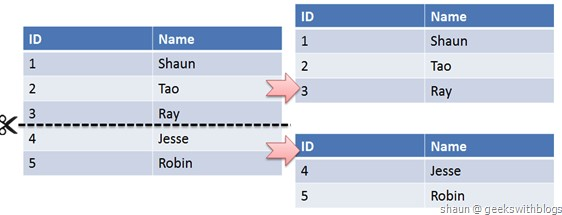

# 🤔👀♥MySQL知识体系详解♥

# MySQL - 数据类型

## 字段类型

### 整型

TINYINT, SMALLINT, MEDIUMINT, INT, BIGINT 分别使用 8, 16, 24, 32, 64 位存储空间，一般情况下越小的列越好。

INT(11) 中的数字只是规定了交互工具显示字符的个数，对于存储和计算来说是没有意义的。

### 浮点数

FLOAT 和 DOUBLE 为浮点类型，DECIMAL 为高精度小数类型。CPU 原生支持浮点运算，但是不支持 DECIMAl 类型的计算，因此 DECIMAL 的计算比浮点类型需要更高的代价。

FLOAT、DOUBLE 和 DECIMAL 都可以指定列宽，例如 DECIMAL(18, 9) 表示总共 18 位，取 9 位存储小数部分，剩下 9 位存储整数部分。

### 字符串

主要有 CHAR 和 VARCHAR 两种类型，一种是定长的，一种是变长的。

VARCHAR 这种变长类型能够节省空间，因为只需要存储必要的内容。但是在执行 UPDATE 时可能会使行变得比原来长，当超出一个页所能容纳的大小时，就要执行额外的操作。MyISAM 会将行拆成不同的片段存储，而 InnoDB 则需要分裂页来使行放进页内。

VARCHAR 会保留字符串末尾的空格，而 CHAR 会删除。

### 时间和日期

MySQL 提供了两种相似的日期时间类型: DATETIME 和 TIMESTAMP。

#### 1. DATETIME

能够保存从 1001 年到 9999 年的日期和时间，精度为秒，使用 8 字节的存储空间。

它与时区无关。

默认情况下，MySQL 以一种可排序的、无歧义的格式显示 DATETIME 值，例如“2008-01-16 22:37:08”，这是 ANSI 标准定义的日期和时间表示方法。

#### 2. TIMESTAMP

和 UNIX 时间戳相同，保存从 1970 年 1 月 1 日午夜(格林威治时间)以来的秒数，使用 4 个字节，只能表示从 1970 年 到 2038 年。

它和时区有关，也就是说一个时间戳在不同的时区所代表的具体时间是不同的。

MySQL 提供了 FROM_UNIXTIME() 函数把 UNIX 时间戳转换为日期，并提供了 UNIX_TIMESTAMP() 函数把日期转换为 UNIX 时间戳。

默认情况下，如果插入时没有指定 TIMESTAMP 列的值，会将这个值设置为当前时间。

应该尽量使用 TIMESTAMP，因为它比 DATETIME 空间效率更高。

## 选择优化的数据类型

- 更小的通常更好；更小的数据类型通常更快，因为它们占用更少的磁盘、内存和CPU缓存，并且处理时需要的CPU周期也更少；
- 简单就好；例如，整形比字符串操作代价更低；实用内建类型而不是字符串来存储日期和时间；用整形存储IP地址等；
- 尽量避免NULL；如果查询中包含可为NULL的列，对MySQL来说更难优化，因为可为NULL 的列使得索引、索引统计和值比较都更复杂。尽管把可为NULL的列改为NOT NULL带来的性能提升比较小，但如果计划在列上创建索引，就应该尽量避免设计成可为NULL的列；

### 字符串类型

#### VARCHAR 和 CHAR

VARCHAR是最常见的字符串类型。VARCHAR节省了存储空间，所以对性能也有帮助。但是，由于行是可变的，在UPDATE时可能使行变得比原来更长，这就导致需要做额外的工作。如果一个行占用的空间增长，并且在页内没有更多的空间可以存储，MyISAM会将行拆成不同的片段存储；InnoDB则需要分裂页来使行可以放进页内。

下面这些情况使用VARCHAR是合适的：字符串的最大长度比平均长度大很多；列的更新很少，所以碎片不是问题；使用了像UTF-8这样复杂的字符集，每个字符都使用不同的字节数进行存储。

当存储CHAR值时，MySQL会删除所有的末尾空格。CHAR值会根据需要采用空格进行填充以方便比较。

CHAR适合存储很短的字符串，或者所有值都接近同一个长度，如密码的MD5值。对于经常变更的数据，CHAR也比VARCHAR更好，因为CHAR不容易产生碎片（行间碎片？）。

#### VARCHAR(5)和VARCHAR(200)

> 使用VARCHAR(5)和VARCHAR(200)存储"hello"的空间开销是一样的。那么使用更短的列有什么优势吗？

事实证明有很大的优势。更长的列会消耗更多的内存，因为MySQL通常会分配固定大小的内存块来保存内部值。尤其是使用内存临时表进行排序或其他操作时会特别糟糕。在利用磁盘临时表进行排序时也同样糟糕。

所以最好的策略是只分配真正需要的空间。

#### BLOB 和 TEXT

BLOB和TEXT都是为存储很大的数据而设计的数据类型，分别采用二进制和字符方式存储。

与其他类型不同，MySQL把每个BLOB和TEXT值当做一个独立的对象去处理。当BLOB和TEXT值太大时，InnoDB会使用专门的“外部”存储区域来进行存储，此时每个值在行内需要1~4个字节存储一个指针，然后在外部存储区域存储实际的值。

MySQL对BLOB和TEXT列进行排序与其他类型是不同的：它只对每个列的最前max_sort_length个字节而不是整个字符串做排序。同样的，MySQL也不能将BLOB或TEXT列全部长度的字符串进行索引。

### 选择表示符（identifier）

整数类型通常是标识列的最佳选择，因为它们很快并且可以使用AUTO_INCREMENT。 如果可能，应该避免使用字符串类型作为标识列，因为它们很耗空间，并且比数字类型慢。 对于完全随机的字符串也需要多加注意，例如MD5(),SHA1()或者UUID()产生的字符串。这些函数生成的新值会任意分布在很大的空间内，这会导致INSERT以及一些SELECT语句变得很慢：

- 因为插入值会随机的写入到索引的不同位置，所以使得INSERT语句更慢。这会导致叶分裂、磁盘随机访问。
- SELECT语句会变的更慢，因为逻辑上相邻的行会分布在磁盘和内存的不同地方。
- 随机值导致缓存对所有类型的查询语句效果都很差，因为会使得缓存赖以工作的局部性原理失效。


# MySQL - 存储引擎

## InnoDB

是 MySQL 默认的事务型存储引擎，**只有在需要它不支持的特性时，才考虑使用其它存储引擎**。

实现了四个标准的隔离级别，默认级别是可重复读(REPEATABLE READ)。在可重复读隔离级别下，通过多版本并发控制(MVCC)+ 间隙锁(Next-Key Locking)防止幻影读。

主索引是聚簇索引，在索引中保存了数据，从而避免直接读取磁盘，因此对查询性能有很大的提升。

内部做了很多优化，包括从磁盘读取数据时采用的可预测性读、能够加快读操作并且自动创建的自适应哈希索引、能够加速插入操作的插入缓冲区等。

支持真正的在线热备份。其它存储引擎不支持在线热备份，要获取一致性视图需要停止对所有表的写入，而在读写混合场景中，停止写入可能也意味着停止读取。

## MyISAM

设计简单，数据以紧密格式存储。对于只读数据，或者表比较小、可以容忍修复操作，则依然可以使用它。

提供了大量的特性，包括压缩表、空间数据索引等。

**不支持事务**。

不支持行级锁，只能对整张表加锁，读取时会对需要读到的所有表加共享锁，写入时则对表加排它锁。但在表有读取操作的同时，也可以往表中插入新的记录，这被称为并发插入(CONCURRENT INSERT)。

可以手工或者自动执行检查和修复操作，但是和事务恢复以及崩溃恢复不同，可能导致一些数据丢失，而且修复操作是非常慢的。

如果指定了 DELAY_KEY_WRITE 选项，在每次修改执行完成时，不会立即将修改的索引数据写入磁盘，而是会写到内存中的键缓冲区，只有在清理键缓冲区或者关闭表的时候才会将对应的索引块写入磁盘。这种方式可以极大的提升写入性能，但是在数据库或者主机崩溃时会造成索引损坏，需要执行修复操作。

## 比较

- 事务: InnoDB 是事务型的，可以使用 Commit 和 Rollback 语句。
- 并发: MyISAM 只支持表级锁，而 InnoDB 还支持行级锁。
- 外键: InnoDB 支持外键。
- 备份: InnoDB 支持在线热备份。
- 崩溃恢复: MyISAM 崩溃后发生损坏的概率比 InnoDB 高很多，而且恢复的速度也更慢。
- 其它特性: MyISAM 支持压缩表和空间数据索引。


# MySQL - 索引(B+树)

### B+ Tree 原理

#### 1. 数据结构

B Tree 指的是 Balance Tree，也就是平衡树。平衡树是一颗查找树，并且所有叶子节点位于同一层。

B+ Tree 是基于 B Tree 和叶子节点顺序访问指针进行实现，它具有 B Tree 的平衡性，并且通过顺序访问指针来提高区间查询的性能。

在 B+ Tree 中，一个节点中的 key 从左到右非递减排列，如果某个指针的左右相邻 key 分别是 keyi 和 keyi+1，且不为 null，则该指针指向节点的所有 key 大于等于 keyi 且小于等于 keyi+1。


#### 2. 操作

进行查找操作时，首先在根节点进行二分查找，找到一个 key 所在的指针，然后递归地在指针所指向的节点进行查找。直到查找到叶子节点，然后在叶子节点上进行二分查找，找出 key 所对应的 data。

插入删除操作记录会破坏平衡树的平衡性，因此在插入删除操作之后，需要对树进行一个分裂、合并、旋转等操作来维护平衡性。

#### 3. 与红黑树的比较

红黑树等平衡树也可以用来实现索引，但是文件系统及数据库系统普遍采用 B+ Tree 作为索引结构，主要有以下两个原因:

(一)更少的查找次数

平衡树查找操作的时间复杂度等于树高 h，而树高大致为 O(h)=O(logdN)，其中 d 为每个节点的出度。

红黑树的出度为 2，而 B+ Tree 的出度一般都非常大，所以红黑树的树高 h 很明显比 B+ Tree 大非常多，检索的次数也就更多。

(二)利用计算机预读特性

为了减少磁盘 I/O，磁盘往往不是严格按需读取，而是每次都会预读。预读过程中，磁盘进行顺序读取，顺序读取不需要进行磁盘寻道，并且只需要很短的旋转时间，因此速度会非常快。

操作系统一般将内存和磁盘分割成固态大小的块，每一块称为一页，内存与磁盘以页为单位交换数据。数据库系统将索引的一个节点的大小设置为页的大小，使得一次 I/O 就能完全载入一个节点，并且可以利用预读特性，相邻的节点也能够被预先载入。

### MySQL 索引

索引是在存储引擎层实现的，而不是在服务器层实现的，所以不同存储引擎具有不同的索引类型和实现。

#### 1. B+Tree 索引

是大多数 MySQL 存储引擎的默认索引类型。

因为不再需要进行全表扫描，只需要对树进行搜索即可，因此查找速度快很多。除了用于查找，还可以用于排序和分组。

可以指定多个列作为索引列，多个索引列共同组成键。

适用于全键值、键值范围和键前缀查找，其中键前缀查找只适用于最左前缀查找。如果不是按照索引列的顺序进行查找，则无法使用索引。

InnoDB 的 B+Tree 索引分为主索引和辅助索引。

主索引的叶子节点 data 域记录着完整的数据记录，这种索引方式被称为聚簇索引。因为无法把数据行存放在两个不同的地方，所以一个表只能有一个聚簇索引。


辅助索引的叶子节点的 data 域记录着主键的值，因此在使用辅助索引进行查找时，需要先查找到主键值，然后再到主索引中进行查找。


#### 哈希索引

哈希索引能以 O(1) 时间进行查找，但是失去了有序性，它具有以下限制:

- 无法用于排序与分组；
- 只支持精确查找，无法用于部分查找和范围查找。

InnoDB 存储引擎有一个特殊的功能叫“自适应哈希索引”，当某个索引值被使用的非常频繁时，会在 B+Tree 索引之上再创建一个哈希索引，这样就让 B+Tree 索引具有哈希索引的一些优点，比如快速的哈希查找。

#### 3. 全文索引

MyISAM 存储引擎支持全文索引，用于查找文本中的关键词，而不是直接比较是否相等。查找条件使用 MATCH AGAINST，而不是普通的 WHERE。

全文索引一般使用倒排索引实现，它记录着关键词到其所在文档的映射。

InnoDB 存储引擎在 MySQL 5.6.4 版本中也开始支持全文索引。

#### 4. 空间数据索引

MyISAM 存储引擎支持空间数据索引(R-Tree)，可以用于地理数据存储。空间数据索引会从所有维度来索引数据，可以有效地使用任意维度来进行组合查询。

必须使用 GIS 相关的函数来维护数据。

### 索引优化

#### 1. 独立的列

在进行查询时，索引列不能是表达式的一部分，也不能是函数的参数，否则无法使用索引。

例如下面的查询不能使用 actor_id 列的索引:

```sql
SELECT actor_id FROM sakila.actor WHERE actor_id + 1 = 5;
```


#### 2. 多列索引

在需要使用多个列作为条件进行查询时，使用多列索引比使用多个单列索引性能更好。例如下面的语句中，最好把 actor_id 和 film_id 设置为多列索引。

```sql
SELECT film_id, actor_ id FROM sakila.film_actor
WHERE actor_id = 1 AND film_id = 1;
```


#### 3. 索引列的顺序

让选择性最强的索引列放在前面，索引的选择性是指: 不重复的索引值和记录总数的比值。最大值为 1，此时每个记录都有唯一的索引与其对应。选择性越高，查询效率也越高。

例如下面显示的结果中 customer_id 的选择性比 staff_id 更高，因此最好把 customer_id 列放在多列索引的前面。

```sql
SELECT COUNT(DISTINCT staff_id)/COUNT(*) AS staff_id_selectivity,
COUNT(DISTINCT customer_id)/COUNT(*) AS customer_id_selectivity,
COUNT(*)
FROM payment;
```

```html
   staff_id_selectivity: 0.0001
customer_id_selectivity: 0.0373
               COUNT(*): 16049
```


#### 4. 前缀索引

对于 BLOB、TEXT 和 VARCHAR 类型的列，必须使用前缀索引，只索引开始的部分字符。

对于前缀长度的选取需要根据索引选择性来确定。

#### 5. 覆盖索引

索引包含所有需要查询的字段的值。

具有以下优点:

- 索引通常远小于数据行的大小，只读取索引能大大减少数据访问量。
- 一些存储引擎(例如 MyISAM)在内存中只缓存索引，而数据依赖于操作系统来缓存。因此，只访问索引可以不使用系统调用(通常比较费时)。
- 对于 InnoDB 引擎，若辅助索引能够覆盖查询，则无需访问主索引。

### 索引的优点

- 大大减少了服务器需要扫描的数据行数。
- 帮助服务器避免进行排序和分组，也就不需要创建临时表(B+Tree 索引是有序的，可以用于 ORDER BY 和 GROUP BY 操作。临时表主要是在排序和分组过程中创建，因为不需要排序和分组，也就不需要创建临时表)。
- 将随机 I/O 变为顺序 I/O(B+Tree 索引是有序的，也就将相邻的数据都存储在一起)。

### 索引的使用场景

- 对于非常小的表、大部分情况下简单的全表扫描比建立索引更高效。
- 对于中到大型的表，索引就非常有效。
- 但是对于特大型的表，建立和维护索引的代价将会随之增长。这种情况下，需要用到一种技术可以直接区分出需要查询的一组数据，而不是一条记录一条记录地匹配，例如可以使用分区技术。


# MySQL - 性能优化

## 使用 Explain 进行分析

Explain 用来分析 SELECT 查询语句，开发人员可以通过分析 Explain 结果来优化查询语句。

比较重要的字段有:

- select_type : 查询类型，有简单查询、联合查询、子查询等
- key : 使用的索引
- rows : 扫描的行数

## 优化数据访问

### 1. 减少请求的数据量

- 只返回必要的列: 最好不要使用 SELECT * 语句。
- 只返回必要的行: 使用 LIMIT 语句来限制返回的数据。
- 缓存重复查询的数据: 使用缓存可以避免在数据库中进行查询，特别在要查询的数据经常被重复查询时，缓存带来的查询性能提升将会是非常明显的。

### 2. 减少服务器端扫描的行数

最有效的方式是使用索引来覆盖查询。

## 重构查询方式

### 1. 切分大查询

一个大查询如果一次性执行的话，可能一次锁住很多数据、占满整个事务日志、耗尽系统资源、阻塞很多小的但重要的查询。

```sql
DELEFT FROM messages WHERE create < DATE_SUB(NOW(), INTERVAL 3 MONTH);
```

```sql
rows_affected = 0
do {
    rows_affected = do_query(
    "DELETE FROM messages WHERE create  < DATE_SUB(NOW(), INTERVAL 3 MONTH) LIMIT 10000")
} while rows_affected > 0
```

### 2. 分解大连接查询

将一个大连接查询分解成对每一个表进行一次单表查询，然后将结果在应用程序中进行关联，这样做的好处有:

- 让缓存更高效。对于连接查询，如果其中一个表发生变化，那么整个查询缓存就无法使用。而分解后的多个查询，即使其中一个表发生变化，对其它表的查询缓存依然可以使用。
- 分解成多个单表查询，这些单表查询的缓存结果更可能被其它查询使用到，从而减少冗余记录的查询。
- 减少锁竞争；
- 在应用层进行连接，可以更容易对数据库进行拆分，从而更容易做到高性能和可伸缩。
- 查询本身效率也可能会有所提升。例如下面的例子中，使用 IN() 代替连接查询，可以让 MySQL 按照 ID 顺序进行查询，这可能比随机的连接要更高效。

```sql
SELECT * FROM tab
JOIN tag_post ON tag_post.tag_id=tag.id
JOIN post ON tag_post.post_id=post.id
WHERE tag.tag='mysql';
```

```sql
SELECT * FROM tag WHERE tag='mysql';
SELECT * FROM tag_post WHERE tag_id=1234;
SELECT * FROM post WHERE post.id IN (123,456,567,9098,8904);
```


# MySQL - 分表分库

## 水平切分

水平切分又称为 Sharding，它是将同一个表中的记录拆分到多个结构相同的表中。

当一个表的数据不断增多时，Sharding 是必然的选择，它可以将数据分布到集群的不同节点上，从而缓存单个数据库的压力。




## 垂直切分


垂直切分是将一张表按列切分成多个表，通常是按照列的关系密集程度进行切分，也可以利用垂直切分将经常被使用的列和不经常被使用的列切分到不同的表中。

在数据库的层面使用垂直切分将按数据库中表的密集程度部署到不同的库中，例如将原来的电商数据库垂直切分成商品数据库、用户数据库等。

## Sharding 策略

- 哈希取模: hash(key) % NUM_DB
- 范围: 可以是 ID 范围也可以是时间范围
- 映射表: 使用单独的一个数据库来存储映射关系

## Sharding 存在的问题及解决方案

### 1. 事务问题

使用分布式事务来解决，比如 XA 接口。

### 2. 链接

可以将原来的 JOIN 分解成多个单表查询，然后在用户程序中进行 JOIN。

### 3. ID 唯一性

- 使用全局唯一 ID: GUID
- 为每个分片指定一个 ID 范围
- 分布式 ID 生成器 (如 Twitter 的 Snowflake 算法)


# MySQL - 主从复制与读写分离

## 主从复制

主要涉及三个线程: binlog 线程、I/O 线程和 SQL 线程。

- **binlog 线程** : 负责将主服务器上的数据更改写入二进制日志中。
- **I/O 线程** : 负责从主服务器上读取二进制日志，并写入从服务器的中继日志中。
- **SQL 线程** : 负责读取中继日志并重放其中的 SQL 语句。


## 读写分离

主服务器处理写操作以及实时性要求比较高的读操作，而从服务器处理读操作。

读写分离能提高性能的原因在于:

- 主从服务器负责各自的读和写，极大程度缓解了锁的争用；
- 从服务器可以使用 MyISAM，提升查询性能以及节约系统开销；
- 增加冗余，提高可用性。

读写分离常用代理方式来实现，代理服务器接收应用层传来的读写请求，然后决定转发到哪个服务器。


# MySQL - MySQL InnoDB的MVCC实现机制

## 前提概要

### 什么是MVCC?

> MVCC，全称Multi-Version Concurrency Control，即多版本并发控制。MVCC是一种并发控制的方法，一般在数据库管理系统中，实现对数据库的并发访问，在编程语言中实现事务内存。 mvcc - @百度百科

MVCC在MySQL InnoDB中的实现主要是为了提高数据库并发性能，用更好的方式去处理读-写冲突，做到即使有读写冲突时，也能做到不加锁，非阻塞并发读

### 什么是当前读和快照读？

> 在学习MVCC多版本并发控制之前，我们必须先了解一下，什么是MySQL InnoDB下的当前读和快照读?

- **当前读**

像select lock in share mode(共享锁), select for update ; update, insert ,delete(排他锁)这些操作都是一种当前读，为什么叫当前读？就是它读取的是记录的最新版本，读取时还要保证其他并发事务不能修改当前记录，会对读取的记录进行加锁

- **快照读**

像不加锁的select操作就是快照读，即不加锁的非阻塞读；快照读的前提是隔离级别不是串行级别，串行级别下的快照读会退化成当前读；之所以出现快照读的情况，是基于提高并发性能的考虑，快照读的实现是基于多版本并发控制，即MVCC,可以认为MVCC是行锁的一个变种，但它在很多情况下，避免了加锁操作，降低了开销；既然是基于多版本，即快照读可能读到的并不一定是数据的最新版本，而有可能是之前的历史版本

> 说白了**MVCC就是为了实现读-写冲突不加锁**，而这个读指的就是**快照读**, 而非当前读，当**前读实际上是一种加锁的操作，是悲观锁的实现**

### 当前读，快照读和MVCC的关系

> 当前读，快照读和MVCC之间是什么关系呢？

- 准确的说，MVCC多版本并发控制指的是 “维持一个数据的多个版本，使得读写操作没有冲突” 这么一个概念。仅仅是一个理想概念
- 而在MySQL中，实现这么一个MVCC理想概念，我们就需要MySQL提供具体的功能去实现它，而快照读就是MySQL为我们实现MVCC理想模型的其中一个具体非阻塞读功能。而相对而言，当前读就是悲观锁的具体功能实现
- 要说的再细致一些，快照读本身也是一个抽象概念，再深入研究。MVCC模型在MySQL中的具体实现则是由 **4个隐式字段**，**undo日志** ，**Read View** 等去完成的，具体可以看下面的MVCC实现原理

### MVCC能解决什么问题，好处是？

#### 数据库并发场景?

有三种, 分别为：

- **读-读**：不存在任何问题，也不需要并发控制
- **读-写**：有线程安全问题，可能会造成事务隔离性问题，可能遇到脏读，幻读，不可重复读
- **写-写**：有线程安全问题，可能会存在更新丢失问题，比如第一类更新丢失，第二类更新丢失

#### MVCC带来的好处是？

多版本并发控制（MVCC）是一种用来解决读-写冲突的无锁并发控制，也就是为事务分配单向增长的时间戳，为每个修改保存一个版本，版本与事务时间戳关联，读操作只读该事务开始前的数据库的快照。 所以MVCC可以为数据库解决以下问题

在并发读写数据库时，可以做到在读操作时不用阻塞写操作，写操作也不用阻塞读操作，提高了数据库并发读写的性能 同时还可以解决脏读，幻读，不可重复读等事务隔离问题，但不能解决更新丢失问题

### 小结一下

总之，MVCC就是因为大牛们，不满意只让数据库采用悲观锁这样性能不佳的形式去解决读-写冲突问题，而提出的解决方案，所以在数据库中，因为有了MVCC，所以我们可以形成两个组合：

- **MVCC + 悲观锁** MVCC解决读写冲突，悲观锁解决写写冲突
- **MVCC + 乐观锁** MVCC解决读写冲突，乐观锁解决写写冲突

这种组合的方式就可以最大程度的提高数据库并发性能，并解决读写冲突，和写写冲突导致的问题

## MVCC的实现原理

> MVCC的目的就是多版本并发控制，在数据库中的实现，就是为了解决读写冲突，它的实现原理主要是依赖记录中的 **3个隐式字段**，**undo日志** ，**Read View** 来实现的。


### 隐式字段

每行记录除了我们自定义的字段外，还有数据库隐式定义的DB_TRX_ID,DB_ROLL_PTR,DB_ROW_ID等字段

- **DB_ROW_ID** 6byte, 隐含的自增ID（隐藏主键），如果数据表没有主键，InnoDB会自动以DB_ROW_ID产生一个聚簇索引
- **DB_TRX_ID** 6byte, 最近修改(修改/插入)事务ID：记录创建这条记录/最后一次修改该记录的事务ID
- **DB_ROLL_PTR** 7byte, 回滚指针，指向这条记录的上一个版本（存储于rollback segment里）
- **DELETED_BIT** 1byte, 记录被更新或删除并不代表真的删除，而是删除flag变了


如上图，DB_ROW_ID是数据库默认为该行记录生成的唯一隐式主键；DB_TRX_ID是当前操作该记录的事务ID； 而DB_ROLL_PTR是一个回滚指针，用于配合undo日志，指向上一个旧版本；delete flag没有展示出来。

### undo日志

nnoDB把这些为了回滚而记录的这些东西称之为undo log。这里需要注意的一点是，由于查询操作（SELECT）并不会修改任何用户记录，所以在查询操作执行时，并不需要记录相应的undo log。undo log主要分为3种：

- **Insert undo log** ：插入一条记录时，至少要把这条记录的主键值记下来，之后回滚的时候只需要把这个主键值对应的记录删掉就好了。

- **Update undo log**：修改一条记录时，至少要把修改这条记录前的旧值都记录下来，这样之后回滚时再把这条记录更新为旧值就好了。

- Delete undo log

  ：删除一条记录时，至少要把这条记录中的内容都记下来，这样之后回滚时再把由这些内容组成的记录插入到表中就好了。

  - 删除操作都只是设置一下老记录的DELETED_BIT，并不真正将过时的记录删除。
  - 为了节省磁盘空间，InnoDB有专门的purge线程来清理DELETED_BIT为true的记录。为了不影响MVCC的正常工作，purge线程自己也维护了一个read view（这个read view相当于系统中最老活跃事务的read view）;如果某个记录的DELETED_BIT为true，并且DB_TRX_ID相对于purge线程的read view可见，那么这条记录一定是可以被安全清除的。

对MVCC有帮助的实质是**update undo log** ，undo log实际上就是存在rollback segment中旧记录链，它的执行流程如下：

1. **比如一个有个事务插入persion表插入了一条新记录，记录如下，name为Jerry, age为24岁，隐式主键是1，事务ID和回滚指针，我们假设为NULL**


2.**现在来了一个事务1对该记录的name做出了修改，改为Tom**

1. 在事务1修改该行(记录)数据时，数据库会先对该行加排他锁
2. 然后把该行数据拷贝到undo log中，作为旧记录，既在undo log中有当前行的拷贝副本
3. 拷贝完毕后，修改该行name为Tom，并且修改隐藏字段的事务ID为当前事务1的ID, 我们默认从1开始，之后递增，回滚指针指向拷贝到undo log的副本记录，既表示我的上一个版本就是它
4. 事务提交后，释放锁


3.**又来了个事务2修改person表的同一个记录，将age修改为30岁**

1. 在事务2修改该行数据时，数据库也先为该行加锁
2. 然后把该行数据拷贝到undo log中，作为旧记录，发现该行记录已经有undo log了，那么最新的旧数据作为链表的表头，插在该行记录的undo log最前面
3. 修改该行age为30岁，并且修改隐藏字段的事务ID为当前事务2的ID, 那就是2，回滚指针指向刚刚拷贝到undo log的副本记录
4. 事务提交，释放锁


从上面，我们就可以看出，不同事务或者相同事务的对同一记录的修改，会导致该记录的undo log成为一条记录版本线性表，既链表，undo log的链首就是最新的旧记录，链尾就是最早的旧记录（当然就像之前说的该undo log的节点可能是会purge线程清除掉，向图中的第一条insert undo log，其实在事务提交之后可能就被删除丢失了，不过这里为了演示，所以还放在这里）

### Read View(读视图)

> 什么是Read View，说白了Read View就是事务进行快照读操作的时候生产的读视图(Read View)，在该事务执行的快照读的那一刻，会生成数据库系统当前的一个快照，记录并维护系统当前活跃事务的ID(当每个事务开启时，都会被分配一个ID, 这个ID是递增的，所以最新的事务，ID值越大)

所以我们知道 Read View主要是用来做可见性判断的, 即当我们某个事务执行快照读的时候，对该记录创建一个Read View读视图，把它比作条件用来判断当前事务能够看到哪个版本的数据，既可能是当前最新的数据，也有可能是该行记录的undo log里面的某个版本的数据。

Read View遵循一个可见性算法，主要是将要被修改的数据的最新记录中的DB_TRX_ID（即当前事务ID）取出来，与系统当前其他活跃事务的ID去对比（由Read View维护），如果DB_TRX_ID跟Read View的属性做了某些比较，不符合可见性，那就通过DB_ROLL_PTR回滚指针去取出Undo Log中的DB_TRX_ID再比较，即遍历链表的DB_TRX_ID（从链首到链尾，即从最近的一次修改查起），直到找到满足特定条件的DB_TRX_ID, 那么这个DB_TRX_ID所在的旧记录就是当前事务能看见的最新老版本

> 那么这个判断条件是什么呢？


我们这里盗窃@呵呵一笑百媚生一张源码图，如上，它是一段MySQL判断可见性的一段源码，即changes_visible方法（不完全哈，但能看出大致逻辑），该方法展示了我们拿DB_TRX_ID去跟Read View某些属性进行怎么样的比较

在展示之前，我先简化一下Read View，我们可以把Read View简单的理解成有三个全局属性

> - **trx_list** 未提交事务ID列表，用来维护Read View生成时刻系统正活跃的事务ID
> - **up_limit_id** 记录trx_list列表中事务ID最小的ID
> - **low_limit_id** ReadView生成时刻系统尚未分配的下一个事务ID，也就是目前已出现过的事务ID的最大值+1

- 首先比较DB_TRX_ID < up_limit_id, 如果小于，则当前事务能看到DB_TRX_ID 所在的记录，如果大于等于进入下一个判断
- 接下来判断 DB_TRX_ID 大于等于 low_limit_id , 如果大于等于则代表DB_TRX_ID 所在的记录在Read View生成后才出现的，那对当前事务肯定不可见，如果小于则进入下一个判断
- 判断DB_TRX_ID 是否在活跃事务之中，trx_list.contains(DB_TRX_ID)，如果在，则代表我Read View生成时刻，你这个事务还在活跃，还没有Commit，你修改的数据，我当前事务也是看不见的；如果不在，则说明，你这个事务在Read View生成之前就已经Commit了，你修改的结果，我当前事务是能看见的

### 整体流程

我们在了解了隐式字段，undo log， 以及Read View的概念之后，就可以来看看MVCC实现的整体流程是怎么样了

整体的流程是怎么样的呢？我们可以模拟一下

当事务2对某行数据执行了快照读，数据库为该行数据生成一个Read View读视图，假设当前事务ID为2，此时还有事务1和事务3在活跃中，事务4在事务2快照读前一刻提交更新了，所以Read View记录了系统当前活跃事务1，3的ID，维护在一个列表上，假设我们称为trx_list


Read View不仅仅会通过一个列表trx_list来维护事务2执行快照读那刻系统正活跃的事务ID，还会有两个属性up_limit_id（记录trx_list列表中事务ID最小的ID），low_limit_id(记录trx_list列表中下一个事务ID，也就是目前已出现过的事务ID的最大值+1)；所以在这里例子中up_limit_id就是1，low_limit_id就是4 + 1 = 5，trx_list集合的值是1,3，Read View如下图


我们的例子中，只有事务4修改过该行记录，并在事务2执行快照读前，就提交了事务，所以当前该行当前数据的undo log如下图所示；我们的事务2在快照读该行记录的时候，就会拿该行记录的DB_TRX_ID去跟up_limit_id,low_limit_id和活跃事务ID列表(trx_list)进行比较，判断当前事务2能看到该记录的版本是哪个。


所以先拿该记录DB_TRX_ID字段记录的事务ID 4去跟Read View的的up_limit_id比较，看4是否小于up_limit_id(1)，所以不符合条件，继续判断 4 是否大于等于 low_limit_id(5)，也不符合条件，最后判断4是否处于trx_list中的活跃事务, 最后发现事务ID为4的事务不在当前活跃事务列表中, 符合可见性条件，所以事务4修改后提交的最新结果对事务2快照读时是可见的，所以事务2能读到的最新数据记录是事务4所提交的版本，而事务4提交的版本也是全局角度上最新的版本


也正是Read View生成时机的不同，从而造成RC,RR级别下快照读的结果的不同

## MVCC相关问题

### RR是如何在RC级的基础上解决不可重复读的？

当前读和快照读在RR级别下的区别：

表1:


表2:


而在表2这里的顺序中，事务B在事务A提交后的快照读和当前读都是实时的新数据400，这是为什么呢？

这里与上表的唯一区别仅仅是表1的事务B在事务A修改金额前快照读过一次金额数据，而表2的事务B在事务A修改金额前没有进行过快照读。

**所以我们知道事务中快照读的结果是非常依赖该事务首次出现快照读的地方，即某个事务中首次出现快照读的地方非常关键，它有决定该事务后续快照读结果的能力**

**我们这里测试的是更新，同时删除和更新也是一样的，如果事务B的快照读是在事务A操作之后进行的，事务B的快照读也是能读取到最新的数据的**

### RC,RR级别下的InnoDB快照读有什么不同？

正是Read View生成时机的不同，从而造成RC,RR级别下快照读的结果的不同

- 在RR级别下的某个事务的对某条记录的第一次快照读会创建一个快照及Read View, 将当前系统活跃的其他事务记录起来，此后在调用快照读的时候，还是使用的是同一个Read View，所以只要当前事务在其他事务提交更新之前使用过快照读，那么之后的快照读使用的都是同一个Read View，所以对之后的修改不可见；
- 即RR级别下，快照读生成Read View时，Read View会记录此时所有其他活动事务的快照，这些事务的修改对于当前事务都是不可见的。而早于Read View创建的事务所做的修改均是可见
- 而在RC级别下的，事务中，每次快照读都会新生成一个快照和Read View, 这就是我们在RC级别下的事务中可以看到别的事务提交的更新的原因

**总之在RC隔离级别下，是每个快照读都会生成并获取最新的Read View；而在RR隔离级别下，则是同一个事务中的第一个快照读才会创建Read View, 之后的快照读获取的都是同一个Read View**。
