# 🤔👀 MySQL SQL 面试指南

.png)

# 数据库基础与理论


## SQL DB - 关系型数据库是如何工作的?

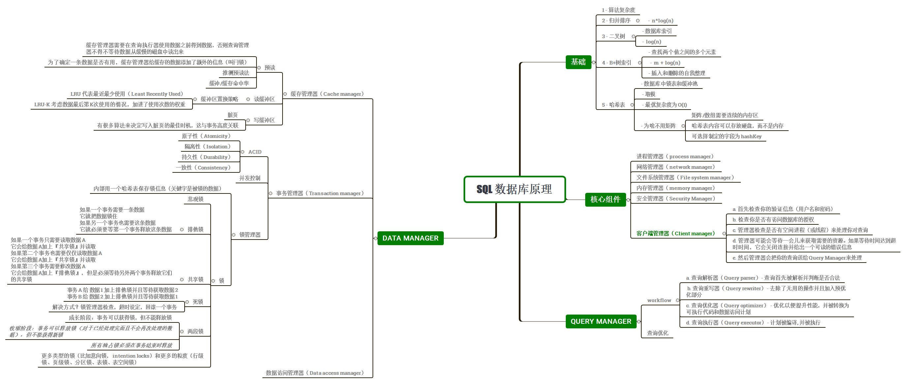

 

## 从数据结构说起


### 时间复杂度

对于数据库而言，重要的不是数据量，而是当数据量增加时运算如何增加。

时间复杂度用来检验某个算法处理一定量的数据要花多长时间，时间复杂度不会给出确切的运算次数，但是给出的是一种理念。


* 绿：O(1)或者叫常数阶复杂度，保持为常数（要不人家就不会叫常数阶复杂度了）。
* 红：O(log(n))对数阶复杂度，即使在十亿级数据量时也很低。
* 粉：最糟糕的复杂度是 O(n^2)，平方阶复杂度，运算数快速膨胀。
* 黑和蓝：另外两种复杂度（的运算数也是）快速增长。


如果要处理2000条元素：

* O(1) 算法会消耗 1 次运算
* O(log(n)) 算法会消耗 7 次运算
* O(n) 算法会消耗 2000 次运算
* O(n*log(n)) 算法会消耗 14,000 次运算
* O(n^2) 算法会消耗 4,000,000 次运算


### 归并排序

对于数据库，你需要理解这个 sort() 函数的工作原理。

归并排序是把问题拆分为小问题，通过解决小问题来解决最初的问题（注：这种算法叫分治法，即『分而治之、各个击破』）


**为什么是归并排序**？

* 你可以更改算法，以便于节省内存空间，方法是不创建新的序列而是直接修改输入序列。注：这种算法叫『**原地算法**』(in-place algorithm)


* 你可以更改算法，以便于同时使用磁盘空间和少量内存而避免巨量磁盘 I/O。方法是只向内存中加载当前处理的部分。在仅仅100MB的内存缓冲区内排序一个几个GB的表时，这是个很重要的技巧。注：这种算法叫『**外部排序**』(external sorting)。


* 你可以更改算法，以便于在 多处理器/多线程/多服务器 上运行。比如，分布式合并排序是**Hadoop**（那个著名的大数据框架）的关键组件之一。


### 二叉搜索树

数据库中查询的时间复杂度，是我们无法使用矩阵，转而使用二叉搜索树(BST)


- 二叉搜索树只需 log(N) 次运算，而如果你直接使用阵列则需要 N 次运算


### B+树索引

查找一个特定值这个树挺好用，但是当你需要**查找两个值之间的多个元素**时，就会有大麻烦了。你的成本将是 O(N)，因为你必须查找树的每一个节点，以判断它是否处于那 2 个值之间（例如，对树使用中序遍历）。而且这个操作不是磁盘I/O有利的，因为你必须读取整个树。我们需要找到高效的范围查询方法。


**如果你在数据库中增加或删除一行**（从而在相关的 B+树索引里）：

- 你必须在B+树中的节点之间保持顺序，否则节点会变得一团糟，你无法从中找到想要的节点。
- 你必须尽可能降低B+树的层数，否则 O(log(N)) 复杂度会变成 O(N)。


换句话说，B+树需要自我整理和自我平衡。谢天谢地，我们有智能删除和插入。但是这样也带来了成本：在B+树中，插入和删除操作是 O(log(N)) 复杂度。所以有些人听到过使用太多索引不是个好主意这类说法。没错，你减慢了快速插入/更新/删除表中的一个行的操作，因为数据库需要以代价高昂的每索引 O(log(N)) 运算来更新表的索引。再者，增加索引意味着给事务管理器带来更多的工作负荷（在本文结尾我们会探讨这个管理器）。


### 哈希表

当你想快速查找值时，哈希表是非常有用的。而且，理解哈希表会帮助我们接下来理解一个数据库常见的联接操作，叫做『哈希联接』。这个**数据结构也被数据库用来保存一些内部的东西**（比如**锁表**或者**缓冲池**，我们在下文会研究这两个概念）


**为什么不用阵列呢**？

- 如果有了好的哈希函数，在哈希表里搜索的时间复杂度是 O(1)。
- **一个哈希表可以只装载一半到内存，剩下的哈希桶可以留在硬盘上**。
- 用阵列的话，你需要一个连续内存空间。如果你加载一个大表，很难分配足够的连续内存空间。


## 全局概览

已经了解了**数据库内部的部分重要算法**，现在需要回来看看**数据库的全貌**了。

数据库一般可以用如下图形来理解：


### 核心组件

- **进程管理器（process manager）**：很多数据库具备一个需要妥善管理的进程/线程池。再者，为了实现纳秒级操作，一些现代数据库使用自己的线程而不是操作系统线程。
- **网络管理器（network manager）**：网路I/O是个大问题，尤其是对于分布式数据库。所以一些数据库具备自己的网络管理器。
- **文件系统管理器（File system manager）**：磁盘I/O是数据库的首要瓶颈。具备一个文件系统管理器来完美地处理OS文件系统甚至取代OS文件系统，是非常重要的。
- **内存管理器（memory manager）**：为了避免磁盘I/O带来的性能损失，需要大量的内存。但是如果你要处理大容量内存你需要高效的内存管理器，尤其是你有很多查询同时使用内存的时候。
- **安全管理器（Security Manager）**：用于对用户的验证和授权。
- **客户端管理器（Client manager）**：用于管理客户端连接。
- ......


### 工具

- **备份管理器（Backup manager）**：用于保存和恢复数据。
- **恢复管理器（Recovery manager**）：用于崩溃后重启数据库到一个一致状态。
- **监控管理器（Monitor manager）**：用于记录数据库活动信息和提供监控数据库的工具。
- **管理员管理器（Administration manager）**：用于保存元数据（比如表的名称和结构），提供管理数据库、模式、表空间的工具。
- .......


### 查询管理器

- **查询解析器（Query parser）**：用于检查查询是否合法
- **查询重写器（Query rewriter）**：用于预优化查询
- **查询优化器（Query optimizer）**：用于优化查询
- **查询执行器（Query executor）**：用于编译和执行查询


### 数据管理器：

- **事务管理器（Transaction manager）**：用于处理事务
- **缓存管理器（Cache manager）**：数据被使用之前置于内存，或者数据写入磁盘之前置于内存
- **数据访问管理器（Data access manager）**：访问磁盘中的数据


## 数据查询的流程

集中探讨数据库如何通过如下进程管理SQL查询的：

- 客户端管理器
- 查询管理器
- 数据管理器（含恢复管理器）
- 客户端管理器


## 客户端管理器

客户端管理器是处理客户端通信的。客户端可以是一个（网站）服务器或者一个最终用户或最终应用。客户端管理器通过一系列知名的API（JDBC, ODBC, OLE-DB …）提供不同的方式来访问数据库。客户端管理器也提供专有的数据库访问API。


**当连接到数据库时**：

- 管理器首先检查你的验证信息（用户名和密码），然后检查你是否有访问数据库的授权。这些权限由DBA分配。
- 然后，管理器检查是否有空闲进程（或线程）来处理你对查询。
- 管理器还会检查数据库是否负载很重。
- 管理器可能会等待一会儿来获取需要的资源。如果等待时间达到超时时间，它会关闭连接并给出一个可读的错误信息。
- 然后管理器会把你的查询送给查询管理器来处理。
- 因为查询处理进程不是『不全则无』的，一旦它从查询管理器得到数据，它会把部分结果保存到一个缓冲区并且开始给你发送。
- 如果遇到问题，管理器关闭连接，向你发送可读的解释信息，然后释放资源。


## 查询管理器

这部分是数据库的威力所在，在这部分里，一个写得糟糕的查询可以转换成一个快速执行的代码，代码执行的结果被送到客户端管理器。


这个多步骤操作过程如下：

- 查询首先被**解析**并判断是否合法
- 然后被**重写**，去除了无用的操作并且加入**预优化**部分
- 接着被**优化**以便提升性能，并被**转换为可执行代码**和**数据访问计划**。
- 然后计划被**编译**
- 最后，被**执行**


### 查询解析器

每一条SQL语句都要送到解析器来检查语法，如果你的查询有错，解析器将拒绝该查询。比如，如果你写成”SLECT …” 而不是 “SELECT …”，那就没有下文了。


但这还不算完，解析器还会检查关键字是否使用正确的顺序，比如 WHERE 写在 SELECT 之前会被拒绝。

然后，解析器要分析查询中的表和字段，使用数据库元数据来检查：

- 表是否存在
- 表的字段是否存在
- 对某类型字段的 运算 是否 可能（比如，你不能将整数和字符串进行比较，你不能对一个整数使用 substring() 函数）

接着，解析器检查在查询中你是否有权限来读取（或写入）表。再强调一次：这些权限由DBA分配。

在解析过程中，SQL 查询被转换为内部表示（通常是一个树）。

如果一切正常，内部表示被送到查询重写器。


### 查询重写器

在这一步，已经有了查询的内部表示，重写器的目标是：

- 预优化查询

- 避免不必要的运算

- 帮助优化器找到合理的最佳解决方案

  

重写器按照一系列已知的规则对查询执行检测。如果查询匹配一种模式的规则，查询就会按照这条规则来重写。下面是（可选）规则的非详尽的列表：

- **视图合并**：如果你在查询中使用视图，视图就会转换为它的 SQL 代码。

- 子查询扁平化

  ：子查询是很难优化的，因此重写器会尝试移除子查询

  - 例如：

  ```sql
  SELECT PERSON.*
  FROM PERSON
  WHERE PERSON.person_key IN
  (SELECT MAILS.person_key
  FROM MAILS
  WHERE MAILS.mail LIKE 'christophe%');
  ```

会转换为：

```sql
SELECT PERSON.*
FROM PERSON, MAILS
WHERE PERSON.person_key = MAILS.person_key
and MAILS.mail LIKE 'christophe%';
```

* **去除不必要的运算符**：比如，如果你用了 DISTINCT，而其实你有 UNIQUE 约束（这本身就防止了数据出现重复），那么 DISTINCT 关键字就被去掉了。


* **排除冗余的联接**：如果相同的 JOIN 条件出现两次，比如隐藏在视图中的 JOIN 条件，或者由于传递性产生的无用 JOIN，都会被消除。


* **常数计算赋值**：如果你的查询需要计算，那么在重写过程中计算会执行一次。比如 WHERE AGE > 10+2 会转换为 WHERE AGE > 12 ， TODATE(“日期字符串”) 会转换为 datetime 格式的日期值。


* **（高级）分区裁剪（Partition Pruning）**：如果你用了分区表，重写器能够找到需要使用的分区。


* **（高级）物化视图重写（Materialized view rewrite）**：如果你有个物化视图匹配查询谓词的一个子集，重写器将检查视图是否最新并修改查询，令查询使用物化视图而不是原始表。


* **（高级）自定义规则**：如果你有自定义规则来修改查询（就像 Oracle policy），重写器就会执行这些规则。


* **（高级）OLAP转换**：分析/加窗 函数，星形联接，ROLLUP 函数……都会发生转换（但我不确定这是由重写器还是优化器来完成，因为两个进程联系很紧，必须看是什么数据库）。


### 统计

研究数据库如何优化查询之前我们需要谈谈统计，因为**没有统计的数据库是愚蠢的**。除非你明确指示，数据库是不会分析自己的数据的。没有分析会导致数据库做出（非常）糟糕的假设。


但是，数据库需要什么类型的信息呢？

我必须（简要地）谈谈数据库和操作系统如何保存数据。两者使用的最小单位叫做页或块（默认 4 或 8 KB）。这就是说如果你仅需要 1KB，也会占用一个页。要是页的大小为 8KB，你就浪费了 7KB。

回来继续讲统计！ 当你要求数据库收集统计信息，数据库会计算下列值：

- 表中行和页的数量
- 表中每个列中的：
  - 唯一值
  - 数据长度（最小，最大，平均）
  - 数据范围（最小，最大，平均）
- 表的索引信息

**这些统计信息会帮助优化器估计查询所需的磁盘 I/O、CPU、和内存使用**

对每个列的统计非常重要。比如，如果一个表 PERSON 需要联接 2 个列： LAST_NAME, FIRST_NAME。根据统计信息，数据库知道FIRST_NAME只有 1,000 个不同的值，LAST_NAME 有 1,000,000 个不同的值。因此，数据库就会按照 LAST_NAME, FIRST_NAME 联接。因为 LAST_NAME 不大可能重复，多数情况下比较 LAST_NAME 的头 2 、 3 个字符就够了，这将大大减少比较的次数。

不过，这些只是基本的统计。你可以让数据库做一种高级统计，叫直方图。直方图是列值分布情况的统计信息。例如：

- 出现最频繁的值
- 分位数(quantiles)
- …

这些额外的统计会帮助数据库找到更佳的查询计划，尤其是对于等式谓词（例如： WHERE AGE = 18 ）或范围谓词（例如： WHERE AGE > 10 and AGE < 40），因为数据库可以更好的了解这些谓词相关的数字类型数据行（注：这个概念的技术名称叫选择率）。

统计信息保存在数据库元数据内，例如（非分区）表的统计信息位置：

- Oracle： USER / ALL / DBA_TABLES 和 USER / ALL / DBA_TAB_COLUMNS
- DB2： SYSCAT.TABLES 和 SYSCAT.COLUMNS


**统计信息必须及时更新**。如果一个表有 1,000,000 行而数据库认为它只有 500 行，没有比这更糟糕的了。统计唯一的不利之处是需要时间来计算，这就是为什么数据库大多默认情况下不会自动计算统计信息。数据达到百万级时统计会变得困难，这时候，你可以选择仅做基本统计或者在一个数据库样本上执行统计。

举个例子，我参与的一个项目需要处理每表上亿条数据的库，我选择只统计10%，结果造成了巨大的时间消耗。本例证明这是个糟糕的决定，因为有时候 Oracle 10G 从特定表的特定列中选出的 10% 跟全部 100% 有很大不同（对于拥有一亿行数据的表，这种情况极少发生）。这次错误的统计导致了一个本应 30 秒完成的查询最后执行了 8 个小时，查找这个现象根源的过程简直是个噩梦。这个例子显示了统计的重要性。

### 查询优化器

所有的现代数据库都在用**基于成本的优化**（即CBO）来优化查询。道理是针对每个运算设置一个成本，通过应用成本最低廉的一系列运算，来找到最佳的降低查询成本的方法。


为了理解成本优化器的原理，我觉得最好用个例子来『感受』一下这个任务背后的复杂性。这里我将给出联接 2 个表的 3 个方法，我们很快就能看到即便一个简单的联接查询对于优化器来说都是个噩梦。之后，我们会了解真正的优化器是怎么做的。


**对于这些联接操作，我会专注于它们的时间复杂度，但是，数据库优化器计算的是它们的 CPU 成本、磁盘 I/O 成本、和内存需求**。时间复杂度和 CPU 成本的区别是，时间成本是个近似值（给我这样的懒家伙准备的）。而 CPU 成本，我这里包括了所有的运算，比如：加法、条件判断、乘法、迭代……还有呢：


每一个高级代码运算都要特定数量的低级 CPU 运算。

对于 Intel Core i7、Intel Pentium 4、AMD Opteron…等，（就 CPU 周期而言）CPU 的运算成本是不同的，也就是说它取决于 CPU 的架构。


使用时间复杂度就容易多了（至少对我来说），用它我也能了解到 CBO 的概念。由于磁盘 I/O 是个重要的概念，我偶尔也会提到它。请牢记，**大多数时候瓶颈在于磁盘 I/O 而不是 CPU 使用**。


#### 索引

在研究 B+树的时候我们谈到了索引，要记住一点，索引都是已经排了序的。


仅供参考：还有其他类型的索引，比如位图索引，在 CPU、磁盘I/O、和内存方面与B+树索引的成本并不相同。

另外，很多现代数据库为了改善执行计划的成本，可以仅为当前查询动态地生成临时索引。


#### 存取路径

在应用联接运算符（join operators）之前，你首先需要获得数据。以下就是获得数据的方法。

注：由于所有存取路径的真正问题是磁盘 I/O，我不会过多探讨时间复杂度。

- 全扫描

如果你读过执行计划，一定看到过『全扫描』（或只是『扫描』）一词。简单的说全扫描就是数据库完整的读一个表或索引。就磁盘 I/O 而言，很明显全表扫描的成本比索引全扫描要高昂。

- 范围扫描

其他类型的扫描有索引范围扫描，比如当你使用谓词 ” WHERE AGE > 20 AND AGE < 40 ” 的时候它就会发生。

当然，你需要在 AGE 字段上有索引才能用到索引范围扫描。

在第一部分我们已经知道，范围查询的时间成本大约是 log(N)+M，这里 N 是索引的数据量，M 是范围内估测的行数。多亏有了统计我们才能知道 N 和 M 的值（注： M 是谓词 “ AGE > 20 AND AGE < 40 ” 的选择率）。另外范围扫描时，你不需要读取整个索引，因此在磁盘 I/O 方面没有全扫描那么昂贵。

- 唯一扫描

如果你只需要从索引中取一个值你可以用唯一扫描。

- 根据 ROW ID 存取

多数情况下，如果数据库使用索引，它就必须查找与索引相关的行，这样就会用到根据 ROW ID 存取的方式。

例如，假如你运行：

```sql
SELECT LASTNAME, FIRSTNAME from PERSON WHERE AGE = 28
```

如果 person 表的 age 列有索引，优化器会使用索引找到所有年龄为 28 的人，然后它会去表中读取相关的行，这是因为索引中只有 age 的信息而你要的是姓和名。

但是，假如你换个做法：

```sql
SELECT TYPE_PERSON.CATEGORY from PERSON ,TYPE_PERSON
WHERE PERSON.AGE = TYPE_PERSON.AGE
```

PERSON 表的索引会用来联接 TYPE_PERSON 表，但是 PERSON 表不会根据行ID 存取，因为你并没有要求这个表内的信息。

虽然这个方法在少量存取时表现很好，这个运算的真正问题其实是磁盘 I/O。假如需要大量的根据行ID存取，数据库也许会选择全扫描。

- 其它路径


我没有列举所有的存取路径，如果你感兴趣可以读一读 Oracle文档。其它数据库里也许叫法不同但背后的概念是一样的


#### 联接运算符

我们知道如何获取数据了，那现在就把它们联接起来！


我要展现的是3个个常用联接运算符：合并联接（Merge join），哈希联接（Hash Join）和嵌套循环联接（Nested Loop Join）。但是在此之前，我需要引入新词汇了：内关系和外关系（ inner relation and outer relation）这里的关系可以是：

- 一个表
- 一个索引
- 上一个运算的中间结果（比如上一个联接运算的结果）

当你联接两个关系时，联接算法对两个关系的处理是不同的。在本文剩余部分，我将假定：

- 外关系是左侧数据集
- 内关系是右侧数据集

比如， A JOIN B 是 A 和 B 的联接，这里 A 是外关系，B 是内关系。

多数情况下， **A JOIN B 的成本跟 B JOIN A 的成本是不同的**。

在这一部分，我还将假定外关系有 N 个元素，内关系有 M 个元素。要记住，真实的优化器通过统计知道 N 和 M 的值。

注：N 和 M 是关系的基数。

##### 嵌套循环联接

嵌套循环联接是最简单的。


原因如下：

- 针对外关系的每一行，查看内关系里的所有行来寻找匹配的行

下面是伪代码：

```java
nested_loop_join(array outer, array inner)
  for each row a in outer
    for each row b in inner
      if (match_join_condition(a,b))
        write_result_in_output(a,b)
      end if
    end for
   end for
```


由于这是个双迭代，**时间复杂度是 O(N\*M)**。

在磁盘 I/O 方面， 针对 N 行外关系的每一行，内部循环需要从内关系读取 M 行。这个算法需要从磁盘读取 N+ N*M 行。但是，如果内关系足够小，你可以把它读入内存，那么就只剩下 M + N 次读取。这样修改之后，内关系必须是最小的，因为它有更大机会装入内存。

在CPU成本方面没有什么区别，但是在磁盘 I/O 方面，最好最好的，是每个关系只读取一次。

当然，内关系可以由索引代替，对磁盘 I/O 更有利。

由于这个算法非常简单，下面这个版本在内关系太大无法装入内存时，对磁盘 I/O 更加有利。原因如下：

- 为了避免逐行读取两个关系，
- 你可以成簇读取，把（两个关系里读到的）两簇数据行保存在内存里，
- 比较两簇数据，保留匹配的，
- 然后从磁盘加载新的数据簇来继续比较
- 直到加载了所有数据。

可能的算法如下：

```java
// improved version to reduce the disk I/O.
nested_loop_join_v2(file outer, file inner)
  for each bunch ba in outer
  // ba is now in memory
    for each bunch bb in inner
        // bb is now in memory
        for each row a in ba
          for each row b in bb
            if (match_join_condition(a,b))
              write_result_in_output(a,b)
            end if
          end for
       end for
    end for
   end for
```

**使用这个版本，时间复杂度没有变化，但是磁盘访问降低了**：

- 用前一个版本，算法需要 N + N*M 次访问（每次访问读取一行）。
- 用新版本，磁盘访问变为 外关系的数据簇数量 + 外关系的数据簇数量 * 内关系的数据簇数量。
- 增加数据簇的尺寸，可以降低磁盘访问。

##### 哈希联接

哈希联接更复杂，不过在很多场合比嵌套循环联接成本低。

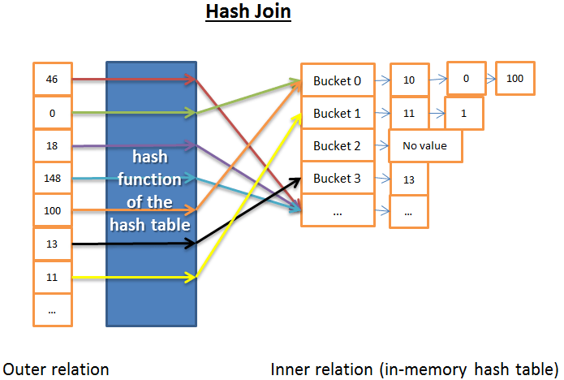


哈希联接的原理是：

- 读取内关系的所有元素
- 在内存里建一个哈希表
- 逐条读取外关系的所有元素 +（用哈希表的哈希函数）计算每个元素的哈希值，来查找内关系里相关的哈希桶内
- 是否与外关系的元素匹配。

在时间复杂度方面我需要做些假设来简化问题：

- 内关系被划分成 X 个哈希桶
- 哈希函数几乎均匀地分布每个关系内数据的哈希值，就是说哈希桶大小一致。
- 外关系的元素与哈希桶内的所有元素的匹配，成本是哈希桶内元素的数量。

时间复杂度是 (M/X) * N + 创建哈希表的成本(M) + 哈希函数的成本 * N 。如果哈希函数创建了足够小规模的哈希桶，那么复杂度就是 O(M+N)。

还有个哈希联接的版本，对内存有利但是对磁盘 I/O 不够有利。 这回是这样的：

- 计算内关系和外关系双方的哈希表
- 保存哈希表到磁盘
- 然后逐个哈希桶比较（其中一个读入内存，另一个逐行读取）。


##### 合并联接

合并联接是唯一产生排序的联接算法。


注：这个简化的合并联接不区分内表或外表；两个表扮演同样的角色。但是真实的实现方式是不同的，比如当处理重复值时。

- 1.（可选）排序联接运算：两个输入源都按照联接关键字排序。

- 2.合并联接运算：排序后的输入源合并到一起。

  

**排序**

我们已经谈到过合并排序，在这里合并排序是个很好的算法（但是并非最好的，如果内存足够用的话，还是哈希联接更好）。

然而有时数据集已经排序了，比如：

- 如果表内部就是有序的，比如联接条件里一个索引组织表(index-organized table)
- 如果关系是联接条件里的一个索引
- 如果联接应用在一个查询中已经排序的中间结果
- **合并联接**

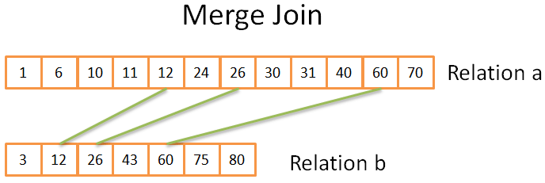


这部分与我们研究过的合并排序中的合并运算非常相似。不过这一次呢，我们不是从两个关系里挑选所有元素，而是只挑选相同的元素。道理如下：

- 在两个关系中，比较当前元素（当前=头一次出现的第一个）
- 如果相同，就把两个元素都放入结果，再比较两个关系里的下一个元素
- 如果不同，就去带有最小元素的关系里找下一个元素（因为下一个元素可能会匹配）
- 重复 1、2、3步骤直到其中一个关系的最后一个元素。

因为两个关系都是已排序的，你不需要『回头去找』，所以这个方法是有效的。

该算法是个简化版，因为它没有处理两个序列中相同数据出现多次的情况（即多重匹配）。真实版本『仅仅』针对本例就更加复杂，所以我才选择简化版。

如果两个关系都已经排序，时间复杂度是 O(N+M)

如果两个关系需要排序，时间复杂度是对两个关系排序的成本：O(N*Log(N) + M*Log(M))

##### 哪个算法最好

如果有最好的，就没必要弄那么多种类型了。这个问题很难，因为很多因素都要考虑，比如：

- **空闲内存**：没有足够的内存的话就跟强大的哈希联接拜拜吧（至少是完全内存中哈希联接）。
- **两个数据集的大小**。比如，如果一个大表联接一个很小的表，那么嵌套循环联接就比哈希联接快，因为后者有创建哈希的高昂成本；如果两个表都非常大，那么嵌套循环联接CPU成本就很高昂。
- **是否有索引**：有两个 B+树索引的话，聪明的选择似乎是合并联接。
- **结果是否需要排序**：即使你用到的是未排序的数据集，你也可能想用成本较高的合并联接（带排序的），因为最终得到排序的结果后，你可以把它和另一个合并联接串起来（或者也许因为查询用 ORDER BY/GROUP BY/DISTINCT 等操作符隐式或显式地要求一个排序结果）。
- **关系是否已经排序**：这时候合并联接是最好的候选项。
- **联接的类型**：是等值联接（比如 tableA.col1 = tableB.col2 ）？ 还是内联接？外联接？笛卡尔乘积？或者自联接？有些联接在特定环境下是无法工作的。
- **数据的分布**：如果联接条件的数据是倾斜的（比如根据姓氏来联接人，但是很多人同姓），用哈希联接将是个灾难，原因是哈希函数将产生分布极不均匀的哈希桶。
- 如果你希望联接操作使用**多线程或多进程**。

想要更详细的信息，可以阅读DB2, ORACLE 或 SQL Server)的文档。

#### 简化的例子

我们已经研究了 3 种类型的联接操作。现在，比如说我们要联接 5 个表，来获得一个人的全部信息。一个人可以有：

- 多个手机号（MOBILES）
- 多个邮箱（MAILS）
- 多个地址（ADRESSES）
- 多个银行账号（BANK_ACCOUNTS）

换句话说，我们需要用下面的查询快速得到答案：

```sql
SELECT * from PERSON, MOBILES, MAILS,ADRESSES, BANK_ACCOUNTS
WHERE
PERSON.PERSON_ID = MOBILES.PERSON_ID
AND PERSON.PERSON_ID = MAILS.PERSON_ID
AND PERSON.PERSON_ID = ADRESSES.PERSON_ID
AND PERSON.PERSON_ID = BANK_ACCOUNTS.PERSON_ID
```


作为一个查询优化器，我必须找到处理数据最好的方法。但有 2 个问题：

- 每个联接使用那种类型？
  - 我有 3 种可选（哈希、合并、嵌套），同时可能用到 0, 1 或 2 个索引（不必说还有多种类型的索引）。
- 按什么顺序执行联接？

比如，下图显示了针对 4 个表仅仅 3 次联接，可能采用的执行计划：

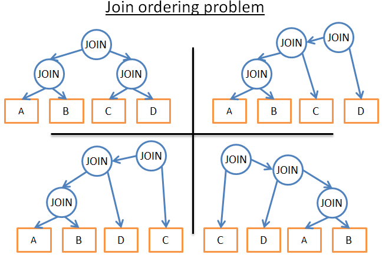


现实世界的查询还会有其他关系运算符，像 OUTER JOIN, CROSS JOIN, GROUP BY, ORDER BY, PROJECTION, UNION, INTERSECT, DISTINCT … 这意味着更多的可能性。

**那么，数据库是如何处理的呢**？

```
动态规划`，`贪心算法`和`启发式算法
```

#### 动态规划，贪心算法和启发式算法

关系型数据库会尝试我刚刚提到的多种方法，**优化器真正的工作是在有限时间里找到一个好的解决方案**。

多数时候，优化器找到的不是最佳的方案，而是一个『不错』的


- **动态规划**

对于小规模的查询，采取粗暴的方式是有可能的。但是为了让中等规模的查询也能采取粗暴的方式，我们有办法避免不必要的计算，这就是动态规划。


这几个字背后的理念是，很多执行计划是非常相似的。看看下图这几种计划：

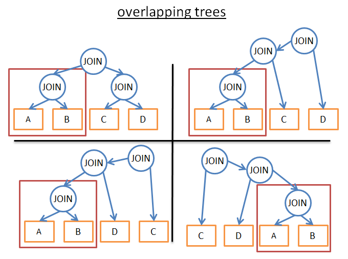


它们都有相同的子树（A JOIN B），所以，不必在每个计划中计算这个子树的成本，计算一次，保存结果，当再遇到这个子树时重用。用更正规的说法，我们面对的是个重叠问题。为了避免对部分结果的重复计算，我们使用记忆法。

应用这一技术，我们不再有 (2*N)!/(N+1)! 的复杂度，而是“只有” 3^N。在之前 4 个JOIN 的例子里，这意味着将 336 次排序降为 81 次。如果是大一些的查询，比如 8 个 JOIN （其实也不是很大啦），就是将 57,657,600 次降为 6551 次。

针对大规模查询，你也可以用动态规划方法，但是要附加额外的规则（或者称为启发式算法）来减少可能性。

- 如果我们仅分析一个特定类型的计划（例如左深树 left-deep tree，参考)，我们得到 n*2^n 而不是 3^n。

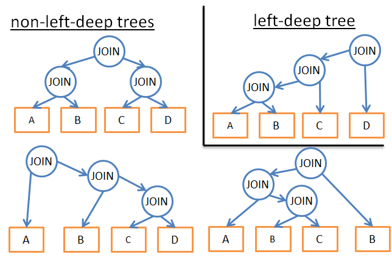


* 如果我们加上逻辑规则来避免一些模式的计划（像『如果一个表有针对指定谓词的索引，就不要对表尝试合并联接，要对索引』），就会在不给最佳方案造成过多伤害的前提下，减少可能性的数量。【译者注：原文应该是有两处笔误： as=has, to=too】


* 如果我们在流程里增加规则（像『联接运算先于其他所有的关系运算』），也能减少大量的可能性。


- **贪心算法**

但是，优化器面对一个非常大的查询，或者为了尽快找到答案（然而查询速度就快不起来了），会应用另一种算法，叫贪婪算法。


原理是按照一个规则（或启发）以渐进的方式制定查询计划。在这个规则下，贪婪算法逐步寻找最佳算法，先处理一条JOIN，接着每一步按照同样规则加一条新的JOIN。

我们来看个简单的例子。比如一个针对5张表（A,B,C,D,E）4次JOIN 的查询，为了简化我们把嵌套JOIN作为可能的联接方式，按照『使用最低成本的联接』规则。

- 直接从 5 个表里选一个开始（比如 A）
- 计算每一个与 A 的联接（A 作为内关系或外关系）
- 发现 “A JOIN B” 成本最低
- 计算每一个与 “A JOIN B” 的结果联接的成本（“A JOIN B” 作为内关系或外关系）
- 发现 “(A JOIN B) JOIN C” 成本最低
- 计算每一个与 “(A JOIN B) JOIN C” 的结果联接的成本
- ……
- 最后确定执行计划 “( ( (A JOIN B) JOIN C) JOIN D ) JOIN E )”

因为我们是武断地从表 A 开始，我们可以把同样的算法用在 B，然后 C，然后 D, 然后 E。最后保留成本最低的执行计划。


顺便说一句，这个算法有个名字，叫『最近邻居算法』。

抛开细节不谈，只需一个良好的模型和一个 N*log(N) 复杂度的排序，问题就轻松解决了。这个算法的复杂度是 O(N*log(N)) ，对比一下完全动态规划的 O(3^N)。如果你有个20个联接的大型查询，这意味着 26 vs 3,486,784,401 ，天壤之别！


这个算法的问题是，我们做的假设是：找到 2 个表的最佳联接方法，保留这个联接结果，再联接下一个表，就能得到最低的成本。但是：

- 即使在 A, B, C 之间，A JOIN B 可得最低成本
- (A JOIN C) JOIN B 也许比 (A JOIN B) JOIN C 更好。

为了改善这一状况，你可以多次使用基于不同规则的贪心算法，并保留最佳的执行计划。


#### 查询计划缓存

由于创建查询计划是耗时的，大多数据库把计划保存在查询计划缓存，来避免重复计算。这个话题比较大，因为数据库需要知道什么时候更新过时的计划。办法是设置一个上限，如果一个表的统计变化超过了上限，关于该表的查询计划就从缓存中清除。


### 查询执行器

在这个阶段，我们有了一个优化的执行计划，再编译为可执行代码。然后，如果有足够资源（内存，CPU），查询执行器就会执行它。计划中的操作符 (JOIN, SORT BY …) 可以顺序或并行执行，这取决于执行器。为了获得和写入数据，查询执行器与数据管理器交互，本文下一部分来讨论数据管理器。


## 数据管理器


在这一步，查询管理器执行了查询，需要从表和索引获取数据，于是向数据管理器提出请求。但是有 2 个问题：

- 关系型数据库使用事务模型，所以，当其他人在同一时刻使用或修改数据时，你无法得到这部分数据。
- 数据提取是数据库中速度最慢的操作，所以数据管理器需要足够聪明地获得数据并保存在内存缓冲区内。

在这一部分，我们看看关系型数据库是如何处理这两个问题的。


### 缓存管理器

前文已经说过，数据库的主要瓶颈是磁盘 I/O。为了提高性能，现代数据库使用缓存管理器。

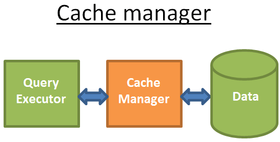


查询执行器不会直接从文件系统拿数据，而是向缓存管理器要。缓存管理器有一个内存缓存区，叫做缓冲池，从内存读取数据显著地提升数据库性能。对此很难给出一个数量级，因为这取决于你需要的是哪种操作：

- 顺序访问（比如：全扫描） vs 随机访问（比如：按照row id访问）
- 读还是写

以及数据库使用的磁盘类型：

- 7.2k/10k/15k rpm的硬盘
- SSD
- RAID 1/5/…

要我说，内存比磁盘要快100到10万倍。然而，这导致了另一个问题（数据库总是这样…)，缓存管理器需要在查询执行器使用数据之前得到数据，否则查询管理器不得不等待数据从缓慢的磁盘中读出来。


#### 预读

这个问题叫预读。查询执行器知道它将需要什么数据，因为它了解整个查询流，而且通过统计也了解磁盘上的数据。过程是这样的：

- 当查询执行器处理它的第一批数据时，会告诉缓存管理器预先装载第二批数据
- 当开始处理第二批数据时，告诉缓存管理器预先装载第三批数据，并且告诉缓存管理器第一批可以从缓存里清掉了。
- ……

缓存管理器在缓冲池里保存所有的这些数据。为了确定一条数据是否有用，缓存管理器给缓存的数据添加了额外的信息（叫闩锁）。

有时查询执行器不知道它需要什么数据，有的数据库也不提供这个功能。相反，它们使用一种推测预读法（比如：如果查询执行器想要数据1、3、5，它不久后很可能会要 7、9、11），或者顺序预读法（这时候缓存管理器只是读取一批数据后简单地从磁盘加载下一批连续数据）。

为了监控预读的工作状况，现代数据库引入了一个度量叫缓冲/缓存命中率，用来显示请求的数据在缓存中找到而不是从磁盘读取的频率。

注：糟糕的缓存命中率不总是意味着缓存工作状态不佳。

缓冲只是容量有限的内存空间，因此，为了加载新的数据，它需要移除一些数据。加载和清除缓存需要一些磁盘和网络I/O的成本。如果你有个经常执行的查询，那么每次都把查询结果加载然后清除，效率就太低了。现代数据库用缓冲区置换策略来解决这个问题。


#### 缓冲区置换策略

多数现代数据库(至少 SQL Server, MySQL, Oracle 和 DB2)使用 LRU 算法。


##### LRU

LRU代表最近最少使用（Least Recently Used）算法，背后的原理是：在缓存里保留的数据是最近使用的，所以更有可能再次使用。

图解：

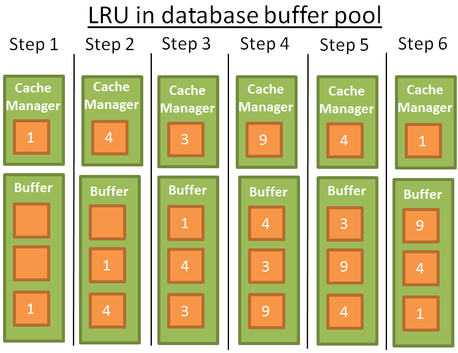


为了更好的理解，我假设缓冲区里的数据没有被闩锁锁住（就是说是可以被移除的）。在这个简单的例子里，缓冲区可以保存 3 个元素：

- 1：缓存管理器（简称CM）使用数据1，把它放入空的缓冲区
- 2：CM使用数据4，把它放入半载的缓冲区
- 3：CM使用数据3，把它放入半载的缓冲区
- 4：CM使用数据9，缓冲区满了，所以数据1被清除，因为它是最后一个最近使用的，数据9加入到缓冲区
- 5：CM使用数据4，数据4已经在缓冲区了，所以它再次成为第一个最近使用的。
- 6：CM使用数据1，缓冲区满了，所以数据9被清除，因为它是最后一个最近使用的，数据1加入到缓冲区
- ……

这个算法效果很好，但是有些限制。**如果对一个大表执行全表扫描怎么办**？换句话说，当表/索引的大小超出缓冲区会发生什么？使用这个算法会清除之前缓存内所有的数据，而且全扫描的数据很可能只使用一次。


##### 改进

为了防止这个现象，有些数据库增加了特殊的规则，比如Oracle文档中的描述：


对非常大的表来说，数据库通常使用直接路径来读取，即直接加载区块[……]，来避免填满缓冲区。对于中等大小的表，数据库可以使用直接读取或缓存读取。如果选择缓存读取，数据库把区块置于LRU的尾部，防止清空当前缓冲区。』


还有一些可能，比如使用高级版本的LRU，叫做 LRU-K。例如，SQL Server 使用 LRU-2。

这个算法的原理是把更多的历史记录考虑进来。简单LRU（也就是 LRU-1），只考虑最后一次使用的数据。LRU-K呢：

- 考虑数据最后第K次使用的情况
- 数据使用的次数加进了权重
- 一批新数据加载进入缓存，旧的但是经常使用的数据不会被清除（因为权重更高）
- 但是这个算法不会保留缓存中不再使用的数据
- 所以数据如果不再使用，权重值随着时间推移而降低

计算权重是需要成本的，所以SQL Server只是使用 K=2，这个值性能不错而且额外开销可以接受。


##### 其他算法

当然还有其他管理缓存的算法，比如：


* 2Q（类LRU-K算法）
* CLOCK（类LRU-K算法）
* MRU（最新使用的算法，用LRU同样的逻辑但不同的规则）
* LRFU（Least Recently and Frequently Used，最近最少使用最近最不常用）


#### 写缓冲区

我只探讨了读缓存 —— 在使用之前预先加载数据。用来保存数据、成批刷入磁盘，而不是逐条写入数据从而造成很多单次磁盘访问。

要记住，**缓冲区保存的是页（最小的数据单位）而不是行（逻辑上/人类习惯的观察数据的方式）**。缓冲池内的页如果被修改了但还没有写入磁盘，就是脏页。有很多算法来决定写入脏页的最佳时机，但这个问题与事务的概念高度关联，下面我们就谈谈事务。


### 事务管理器

最后但同样重要的，是事务管理器，我们将看到这个进程是如何保证每个查询在自己的事务内执行的。但开始之前，我们需要理解ACID事务的概念。


“I’m on acid”

一个ACID事务是一个工作单元，它要保证4个属性：

- 原子性（Atomicity）: 事务『要么全部完成，要么全部取消』，即使它持续运行10个小时。如果事务崩溃，状态回到事务之前（事务回滚）。
- 一致性（Consistency）: 只有合法的数据（依照关系约束和函数约束）能写入数据库，一致性与原子性和隔离性有关。
- 隔离性（Isolation）: 如果2个事务 A 和 B 同时运行，事务 A 和 B 最终的结果是相同的，不管 A 是结束于 B 之前/之后/运行期间。
- 持久性（Durability）: 一旦事务提交（也就是成功执行）,不管发生什么（崩溃或者出错），数据要保存在数据库中。

在同一个事务内，你可以运行多个SQL查询来读取、创建、更新和删除数据。当两个事务使用相同的数据，麻烦就来了。经典的例子是从账户A到账户B的汇款。假设有2个事务：

- 事务1（T1）从账户A取出100美元给账户B
- 事务2（T2）从账户A取出50美元给账户B

我们回来看看ACID属性：

- 原子性确保不管 T1 期间发生什么（服务器崩溃、网络中断…），你不能出现账户A 取走了100美元但没有给账户B 的现象（这就是数据不一致状态）。
- 隔离性确保如果 T1 和 T2 同时发生，最终A将减少150美元，B将得到150美元，而不是其他结果，比如因为 T2 部分抹除了 T1 的行为，A减少150美元而B只得到50美元（这也是不一致状态）。
- 持久性确保如果 T1 刚刚提交，数据库就发生崩溃，T1 不会消失得无影无踪。
- 一致性确保钱不会在系统内生成或灭失。


### 并发控制

确保隔离性、一致性和原子性的真正问题是**对相同数据的写操作（增、更、删）**：

- 如果所有事务只是读取数据，它们可以同时工作，不会更改另一个事务的行为。
- 如果（至少）有一个事务在修改其他事务读取的数据，数据库需要找个办法对其它事务隐藏这种修改。而且，它还需要确保这个修改操作不会被另一个看不到这些数据修改的事务擦除。

这个问题叫**并发控制**。

最简单的解决办法是依次执行每个事务（即顺序执行），但这样就完全没有伸缩性了，在一个多处理器/多核服务器上只有一个核心在工作，效率很低。

- 理想的办法是，每次一个事务创建或取消时：
- 监控所有事务的所有操作
- 检查是否2个（或更多）事务的部分操作因为读取/修改相同的数据而存在冲突
- 重新编排冲突事务中的操作来减少冲突的部分
- 按照一定的顺序执行冲突的部分（同时非冲突事务仍然在并发运行）
- 考虑事务有可能被取消

用更正规的说法，这是对冲突的调度问题。更具体点儿说，这是个非常困难而且CPU开销很大的优化问题。企业级数据库无法承担等待几个小时，来寻找每个新事务活动最好的调度，因此就使用不那么理想的方式以避免更多的时间浪费在解决冲突上。


### 锁管理器

为了解决这个问题，多数数据库使用**锁**和/或**数据版本控制**。这是个很大的话题，我会集中探讨锁，和一点点数据版本控制。

#### 悲观锁

原理是：

- 如果一个事务需要一条数据,它就把数据锁住
- 如果另一个事务也需要这条数据, 它就必须要等第一个事务释放这条数据

这个锁叫**排他锁**。

但是对一个仅仅读取数据的事务使用排他锁非常昂贵，因为这会迫使其它只需要读取相同数据的事务等待。因此就有了另一种锁，**共享锁**。

**共享锁是这样的**：

- 如果一个事务只需要读取数据A, 它会给数据A加上『共享锁』并读取
- 如果第二个事务也需要仅仅读取数据A, 它会给数据A加上『共享锁』并读取
- 如果第三个事务需要修改数据A, 它会给数据A加上『排他锁』，但是必须等待另外两个事务释放它们的共享锁。

同样的，如果一块数据被加上排他锁，一个只需要读取该数据的事务必须等待排他锁释放才能给该数据加上共享锁。

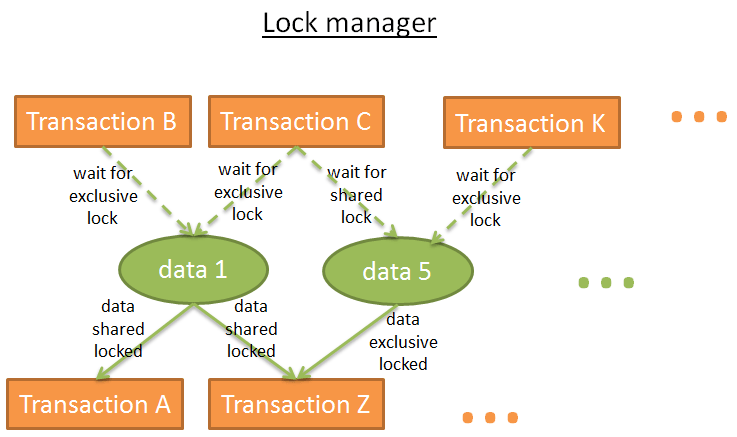


锁管理器是添加和释放锁的进程，在内部用一个哈希表保存锁信息（关键字是被锁的数据），并且了解每一块数据是：

- 被哪个事务加的锁
- 哪个事务在等待数据解锁


#### 死锁

但是使用锁会导致一种情况，2个事务永远在等待一块数据：

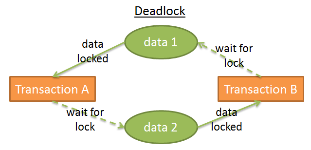


在本图中：

- 事务A 给 数据1 加上排他锁并且等待获取数据2
- 事务B 给 数据2 加上排他锁并且等待获取数据1

这叫**死锁**。

在死锁发生时，锁管理器要选择取消（回滚）一个事务，以便消除死锁。这可是个艰难的决定：

- 杀死数据修改量最少的事务（这样能减少回滚的成本）？
- 杀死持续时间最短的事务，因为其它事务的用户等的时间更长？
- 杀死能用更少时间结束的事务（避免可能的资源饥荒）？
- 一旦发生回滚，有多少事务会受到回滚的影响？

在作出选择之前，锁管理器需要检查是否有死锁存在。

哈希表可以看作是个图表（见上文图），图中出现循环就说明有死锁。由于检查循环是昂贵的（所有锁组成的图表是很庞大的），经常会通过简单的途径解决：**使用超时设定**。如果一个锁在超时时间内没有加上，那事务就进入死锁状态。

锁管理器也可以在加锁之前检查该锁会不会变成死锁，但是想要完美的做到这一点还是很昂贵的。因此这些预检经常设置一些基本规则。


#### 两段锁

实现纯粹的隔离最简单的方法是：事务开始时获取锁，结束时释放锁。就是说，事务开始前必须等待确保自己能加上所有的锁，当事务结束时释放自己持有的锁。这是行得通的，但是为了等待所有的锁，大量的时间被浪费了。


更快的方法是**两段锁协议**（Two-Phase Locking Protocol，由 DB2 和 SQL Server使用），在这里，事务分为两个阶段：

- **成长阶段**：事务可以获得锁，但不能释放锁。
- **收缩阶段**：事务可以释放锁（对于已经处理完而且不会再次处理的数据），但不能获得新锁。


这两条简单规则背后的过程是：

- 释放不再使用的锁，来降低其它事务的等待时间
- 防止发生这类情况：事务最初获得的数据，在事务开始后被修改，当事务重新读取该数据时发生不一致。

这个规则可以很好地工作，但有个例外：如果修改了一条数据、释放了关联的锁后，事务被取消（回滚），而另一个事务读到了修改后的值，但最后这个值却被回滚。为了避免这个问题，**所有独占锁必须在事务结束时释放**。


#### 更多

当然了，真实的数据库使用更复杂的系统，涉及到更多类型的锁（比如意向锁，intention locks）和更多的粒度（行级锁、页级锁、分区锁、表锁、表空间锁），但是思路是相同的。


我只探讨纯粹基于锁的方法，**数据版本控制是解决这个问题的另一个方法**。

版本控制是这样的：

- 每个事务可以在相同时刻修改相同的数据
- 每个事务有自己的数据拷贝（或者叫版本）
- 如果2个事务修改相同的数据，只接受一个修改，另一个将被拒绝，相关的事务回滚（或重新运行）

这将提高性能，因为：

- 读事务不会阻塞写事务
- 写事务不会阻塞读
- 没有『臃肿缓慢』的锁管理器带来的额外开销

除了两个事务写相同数据的时候，数据版本控制各个方面都比锁表现得更好。只不过，你很快就会发现磁盘空间消耗巨大。

**数据版本控制和锁机制是两种不同的见解**：乐观锁和悲观锁。两者各有利弊，完全取决于使用场景（读多还是写多）。


一些数据库，比如DB2（直到版本 9.7）和 SQL Server（不含快照隔离）仅使用锁机制。其他的像PostgreSQL, MySQL 和 Oracle 使用锁和鼠标版本控制混合机制。


### 日志管理器

我们已经知道，为了提升性能，数据库把数据保存在内存缓冲区内。但如果当事务提交时服务器崩溃，崩溃时还在内存里的数据会丢失，这破坏了事务的持久性。你可以把所有数据都写在磁盘上，但是如果服务器崩溃，最终数据可能只有部分写入磁盘，这破坏了事务的原子性。

**事务作出的任何修改必须是或者撤销，或者完成**。

有 2 个办法解决这个问题：

- **影子副本/页（Shadow copies/pages）**：每个事务创建自己的数据库副本（或部分数据库的副本），并基于这个副本来工作。一旦出错，这个副本就被移除；一旦成功，数据库立即使用文件系统的一个把戏，把副本替换到数据中，然后删掉『旧』数据。
- **事务日志（Transaction log）**：事务日志是一个存储空间，在每次写盘之前，数据库在事务日志中写入一些信息，这样当事务崩溃或回滚，数据库知道如何移除或完成尚未完成的事务。


#### WAL（预写式日志）

影子副本/页在运行较多事务的大型数据库时制造了大量磁盘开销，所以现代数据库使用**事务日志**。事务日志必须保存在**稳定的存储**上，我不会深挖存储技术，但至少RAID磁盘是必须的，以防磁盘故障。


多数数据库（至少是Oracle,SQL Server,DB2,PostgreSQL, MySQL 和SQLite) 使用预写日志协议（Write-Ahead Logging protocol ，WAL）来处理事务日志。WAL协议有 3 个规则：

- 每个对数据库的修改都产生一条日志记录，在数据写入磁盘之前日志记录必须写入事务日志。
- 日志记录必须按顺序写入；记录 A 发生在记录 B 之前，则 A 必须写在 B 之前。
- 当一个事务提交时，在事务成功之前，提交顺序必须写入到事务日志。


#### ARIES

1992年，IBM 研究人员『发明』了WAL的增强版，叫 ARIES。ARIES 或多或少地在现代数据库中使用，逻辑未必相同，但AIRES背后的概念无处不在。ARIES 代表『数据库恢复原型算法』（Algorithms forRecovery andIsolationExploitingSemantics）。


这个技术要达到一个双重目标：

- 写日志的同时保持良好性能
- 快速和可靠的数据恢复

有多个原因让数据库不得不回滚事务：

- 因为用户取消
- 因为服务器或网络故障
- 因为事务破坏了数据库完整性（比如一个列有唯一性约束而事务添加了重复值）
- 因为死锁


#### 日志

有时候（比如网络出现故障），数据库可以恢复事务。这怎么可能呢？为了回答这个问题，我们需要了解日志里保存的信息。


事务的**每一个操作（增/删/改）产生一条日志**，由如下内容组成：

- LSN：一个唯一的日志序列号（Log Sequence Number）。LSN是按时间顺序分配的，这意味着如果操作 A 先于操作 B，log A 的 LSN 要比 log B 的 LSN 小。
- TransID：产生操作的事务ID。
- PageID：被修改的数据在磁盘上的位置。磁盘数据的最小单位是页，所以数据的位置就是它所处页的位置。
- PrevLSN：同一个事务产生的上一条日志记录的链接。
- UNDO：取消本次操作的方法。比如，如果操作是一次更新，UNDO将或者保存元素更新前的值/状态（物理UNDO），或者回到原来状态的反向操作（**逻辑UNDO**, 只使用逻辑UNDO，因为处理物理UNDO太过混乱了)。
- REDO：重复本次操作的方法。 同样的，有 2 种方法：或者保存操作后的元素值/状态，或者保存操作本身以便重复。
- …：（供您参考，一个 ARIES 日志还有 2 个字段：UndoNxtLSN 和 Type）。

磁盘上每个页（保存数据的，不是保存日志的）都记录着最后一个修改该数据操作的LSN。


注：据我所知，只有 PostgreSQL 没有使用UNDO，而是用一个垃圾回收服务来删除旧版本的数据。这个跟 PostgreSQL 对数据版本控制的实现有关。


为了更好的说明这一点，这有一个简单的日志记录演示图，是由查询 “`UPDATE FROM PERSON SET AGE = 18;`” 产生的:

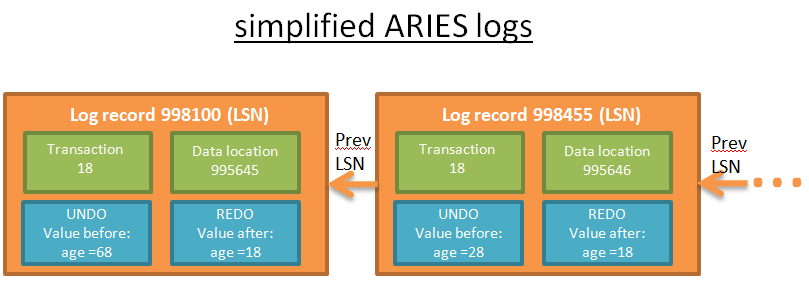


每条日志都有一个唯一的LSN，链接在一起的日志属于同一个事务。日志按照时间顺序链接（链接列表的最后一条日志是最后一个操作产生的）。


#### 日志缓冲区

为了防止写日志成为主要的瓶颈，数据库使用了日志缓冲区。


当查询执行器要求做一次修改：

- 缓存管理器将修改存入自己的缓冲区；
- 日志管理器将相关的日志存入自己的缓冲区；
- 到了这一步，查询执行器认为操作完成了（因此可以请求做另一次修改）；
- 接着（不久以后）日志管理器把日志写入事务日志，什么时候写日志由某算法来决定。
- 接着（不久以后）缓存管理器把修改写入磁盘，什么时候写盘由某算法来决定。

**当事务提交，意味着事务每一个操作的5个步骤都完成了**。写事务日志是很快的，因为它只是『在事务日志某处增加一条日志』；而数据写盘就更复杂了，因为要用『能够快速读取的方式写入数据』。

#### STEAL 和 FORCE 策略

出于性能方面的原因，**第 5 步有可能在提交之后完成**，因为一旦发生崩溃，还有可能用REDO日志恢复事务。这叫做 **NO-FORCE策略**。


数据库可以选择FORCE策略（比如第 5 步在提交之前必须完成）来降低恢复时的负载。

另一个问题是，**要选择数据是一步步的写入（STEAL策略），还是缓冲管理器需要等待提交命令来一次性全部写入（NO-STEAL策略）**。选择STEAL还是NO-STEAL取决于你想要什么：快速写入但是从 UNDO 日志恢复缓慢，还是快速恢复。

下面是这些策略对恢复的影响：

- **STEAL/NO-FORCE 需要 UNDO 和 REDO: 性能高**，但是日志和恢复过程更复杂 (比如 ARIES)。多数数据库选择这个策略。 注：这是我从多个学术论文和教程里看到的，但并没有看到官方文档里显式说明这一点。
- STEAL/ FORCE 只需要 UNDO.
- NO-STEAL/NO-FORCE 只需要 REDO.
- NO-STEAL/FORCE 什么也不需要: 性能最差，而且需要巨大的内存。


#### 关于恢复

假设新来的实习生让数据库崩溃了，你重启了数据库，恢复过程开始了。

ARIES从崩溃中恢复有三个阶段：

- 1) **分析阶段**：恢复进程读取全部事务日志，来重建崩溃过程中所发生事情的时间线，决定哪个事务要回滚（所有未提交的事务都要回滚）、崩溃时哪些数据需要写盘。
- 2) **Redo阶段**：这一关从分析中选中的一条日志记录开始，使用 REDO 来将数据库恢复到崩溃之前的状态。
  - 在REDO阶段，REDO日志按照时间顺序处理（使用LSN）。
  - 对每一条日志，恢复进程需要读取包含数据的磁盘页LSN。
  - 如果LSN（磁盘页）>= LSN（日志记录），说明数据已经在崩溃前写到磁盘（但是值已经被日志之后、崩溃之前的某个操作覆盖），所以不需要做什么。
  - 如果LSN（磁盘页）< LSN（日志记录），那么磁盘上的页将被更新。
  - 即使将被回滚的事务，REDO也是要做的，因为这样简化了恢复过程（但是我相信现代数据库不会这么做的）。
- \3) **Undo阶段**：这一阶段回滚所有崩溃时未完成的事务。回滚从每个事务的最后一条日志开始，并且按照时间倒序处理UNDO日志（使用日志记录的PrevLSN）。

恢复过程中，事务日志必须留意恢复过程的操作，以便写入磁盘的数据与事务日志相一致。一个解决办法是移除被取消的事务产生的日志记录，但是这个太困难了。相反，ARIES在事务日志中记录补偿日志，来逻辑上删除被取消的事务的日志记录。


当事务被『手工』取消，或者被锁管理器取消（为了消除死锁），或仅仅因为网络故障而取消，那么分析阶段就不需要了。对于哪些需要 REDO 哪些需要 UNDO 的信息在 2 个内存表中：

- 事务表（保存当前所有事务的状态）

- 脏页表（保存哪些数据需要写入磁盘）

  

当新的事务产生时，这两个表由缓存管理器和事务管理器更新。因为是在内存中，当数据库崩溃时它们也被破坏掉了。


分析阶段的任务就是在崩溃之后，用事务日志中的信息重建上述的两个表。为了加快分析阶段，ARIES提出了一个概念：**检查点（check point）**，就是不时地把事务表和脏页表的内容，还有此时最后一条LSN写入磁盘。那么在分析阶段当中，只需要分析这个LSN之后的日志即可。

