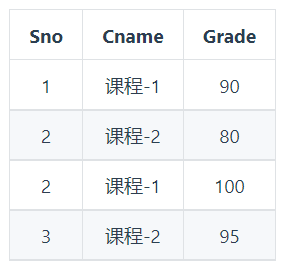
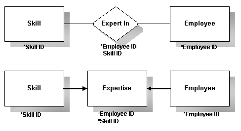

# 🤔👀 MySQL SQL 面试指南

# SQL DB - 关系型数据库设计理论

## 重要的术语

关系模型是一种基于表的数据模型，以下为关系学生信息，该表有很多不足之处，本文研究内容就是如何改进它：

下面是一些重要术语：

- **属性（attribute）**：列的名字，上图有学号、姓名、班级、兴趣爱好、班主任、课程、授课主任、分数。
- **依赖（relation）**：列属性间存在的某种联系。
- **元组（tuple）**：每一个行，如第二行 （1301，小明，13班，篮球，王老师，英语，赵英，70） 就是一个元组
- **表（table）**：由多个属性，以及众多元组所表示的各个实例组成。
- **模式（schema）**：这里我们指逻辑结构，如 学生信息（学号，姓名，班级，兴趣爱好，班主任，课程，授课主任，分数） 的笼统表述。
- **域（domain）**：数据类型，如string、integer等，上图中每一个属性都有它的数据类型（即域）。
- **键（key）**：由关系的一个或多个属性组成，任意两个键相同的元组，所有属性都相同。需要保证表示键的属性最少。一个关系可以存在好几种键，工程中一般从这些候选键中选出一个作为**主键（primary key）**。
- **候选键（prime attribute）**：由关系的一个或多个属性组成，候选键都具备键的特征，都有资格成为主键。
- **超键（super key）**：包含键的属性集合，无需保证属性集的最小化。每个键也是超键。可以认为是**键的超集**。
- **外键（foreign key）**：如果某一个关系A中的一个（组）属性是另一个关系B的键，则该（组）属性在A中称为外键。
- **主属性（prime attribute）**：所有候选键所包含的属性都是主属性。
- **投影（projection）**：选取特定的列，如将关系学生信息投影为学号、姓名即得到上表中仅包含学号、姓名的列
- **选择（selection）**：按照一定条件选取特定元组，如选择上表中分数>80的元组。
- **笛卡儿积（交叉连接Cross join）**：第一个关系每一行分别与第二个关系的每一行组合。
- **自然连接（natural join）**：第一个关系中每一行与第二个关系的每一行进行匹配，如果得到有交叉部分则合并，若无交叉部分则舍弃。
- **连接（theta join）**：即加上约束条件的笛卡儿积，先得到笛卡儿积，然后根据约束条件删除不满足的元组。
- **外连接（outer join）**：执行自然连接后，将舍弃的部分也加入，并且匹配失败处的属性用NULL代替。
- **除法运算（division）**：关系R除以关系S的结果为T，则T包含所有在R但不在S中的属性，且T的元组与S的元组的所有组合在R中。

## 函数依赖

通过函数依赖关系，来帮助你确定表中的合理主外健等；这里只是简介，有这么个概念就可以了，因为大多数情况你不用那些所谓的推倒关系，你也是可以凭借**直觉**设计出来的。

记 A->B 表示 A 函数决定 B，也可以说 B 函数依赖于 A。

如果 {A1，A2，... ，An} 是关系的一个或多个属性的集合，该集合函数决定了关系的其它所有属性并且是最小的，那么该集合就称为键码。

对于 A->B，如果能找到 A 的真子集 A'，使得 A'-> B，那么 A->B 就是部分函数依赖，否则就是完全函数依赖。

对于 A->B，B->C，则 A->C 是一个传递函数依赖。

## 异常

介绍 不符合范式的关系，会产生很多异常，为了引出**范式**的内容。

以下的学生课程关系的函数依赖为 Sno, Cname -> Sname, Sdept, Mname, Grade，键码为 {Sno, Cname}。也就是说，确定学生和课程之后，就能确定其它信息。

不符合范式的关系，会产生很多异常，主要有以下四种异常:

- 冗余数据: 例如 `学生-2` 出现了两次。
- 修改异常: 修改了一个记录中的信息，但是另一个记录中相同的信息却没有被修改。
- 删除异常: 删除一个信息，那么也会丢失其它信息。例如删除了 `课程-1` 需要删除第一行和第三行，那么 `学生-1` 的信息就会丢失。
- 插入异常: 例如想要插入一个学生的信息，如果这个学生还没选课，那么就无法插入。

## 范式

范式理论是为了解决以上提到四种异常。

高级别范式的依赖于低级别的范式，1NF 是最低级别的范式。

### 1. 第一范式 (1NF)

属性不可分。

### 2. 第二范式 (2NF)

每个非主属性完全函数依赖于键码。

可以通过分解来满足。

**分解前**

以上学生课程关系中，{Sno, Cname} 为键码，有如下函数依赖:

- Sno -> Sname, Sdept
- Sdept -> Mname
- Sno, Cname-> Grade

Grade 完全函数依赖于键码，它没有任何冗余数据，每个学生的每门课都有特定的成绩。

Sname, Sdept 和 Mname 都部分依赖于键码，当一个学生选修了多门课时，这些数据就会出现多次，造成大量冗余数据。

**分解后**

关系-1

有以下函数依赖:

- Sno -> Sname, Sdept
- Sdept -> Mname

关系-2

有以下函数依赖:

- Sno, Cname -> Grade

### 3. 第三范式 (3NF)

非主属性不传递函数依赖于键码。

上面的 关系-1 中存在以下传递函数依赖:

- Sno -> Sdept -> Mname

可以进行以下分解:

关系-3

关系-4

# SQL DB - 关系型数据库设计流程

## 规范设计的6个阶段

按照规范设计的方法，考虑数据库及其应用系统开发全过程，将数据库设计分为以下6个阶段

**需求分析**：分析用户的需求，包括数据、功能和性能需求；

**概念结构设计**：主要采用E-R模型进行设计，包括画E-R图；

**逻辑结构设计**：通过将E-R图转换成表，实现从E-R模型到关系模型的转换；

**数据库物理设计**：主要是为所设计的数据库选择合适的存储结构和存取路径；

**数据库的实施**：包括编程、测试和试运行；

**数据库运行与维护**：系统的运行与数据库的日常维护

其中最为重要的是**概念结构设计**和**逻辑结构设计**，所以后面独立两个章节分别具体讲：`E-R图`和`结构设计流程`。

### 需求分析阶段（常用自顶向下）

进行数据库设计首先必须准确了解和分析用户需求（包括数据与处理）。需求分析是整个设计过程的基础，也是最困难，最耗时的一步。需求分析是否做得充分和准确，决定了在其上构建数据库大厦的速度与质量。需求分析做的不好，会导致整个数据库设计返工重做。

需求分析的任务，是通过详细调查现实世界要处理的对象，充分了解原系统工作概况，明确用户的各种需求，然后在此基础上确定新的系统功能，新系统还得充分考虑今后可能的扩充与改变，不仅仅能够按当前应用需求来设计。

调查的重点是，数据与处理。达到信息要求，处理要求，安全性和完整性要求。

分析方法常用**SA(Structured Analysis) 结构化分析方法，SA方法从最上层的系统组织结构入手，采用自顶向下，逐层分解的方式分析系统**。

数据流图表达了数据和处理过程的关系，在SA方法中，处理过程的处理逻辑常常借助判定表或判定树来描述。在处理功能逐步分解的同事，系统中的数据也逐级分解，形成若干层次的数据流图。系统中的数据则借助数据字典（data dictionary，DD）来描述。数据字典是系统中各类数据描述的集合，数据字典通常包括数据项，数据结构，数据流，数据存储，和处理过程5个阶段。

### 概念结构设计阶段（常用自底向上）

概念结构设计是整个数据库设计的关键，它通过对用户需求进行综合，归纳与抽象，形成了一个独立于具体DBMS的概念模型。

设计概念结构通常有四类方法：

- 自顶向下。即首先定义全局概念结构的框架，再逐步细化。
- 自底向上。即首先定义各局部应用的概念结构，然后再将他们集成起来，得到全局概念结构。
- 逐步扩张。首先定义最重要的核心概念结构，然后向外扩张，以滚雪球的方式逐步生成其他的概念结构，直至总体概念结构。
- 混合策略。即自顶向下和自底向上相结合。

### 逻辑结构设计阶段（E-R图）

逻辑结构设计是将概念结构转换为某个DBMS所支持的数据模型，并将进行优化。

在这阶段，E-R图显得异常重要。大家要学会各个实体定义的属性来画出总体的E-R图。

各分E-R图之间的冲突主要有三类：属性冲突，命名冲突，和结构冲突。

E-R图向关系模型的转换，要解决的问题是如何将实体性和实体间的联系转换为关系模式，如何确定这些关系模式的属性和码。

### 物理设计阶段

物理设计是为逻辑数据结构模型选取一个最适合应用环境的物理结构（包括存储结构和存取方法）。

首先要对运行的事务详细分析，获得选择物理数据库设计所需要的参数，其次，要充分了解所用的RDBMS的内部特征，特别是系统提供的存取方法和存储结构。

常用的存取方法有三类：

- 1.索引方法，目前主要是B+树索引方法。
- 2.聚簇方法（Clustering）方法。
- 3.是HASH方法。

### 数据库实施阶段

数据库实施阶段，设计人员运营DBMS提供的数据库语言（如sql）及其宿主语言，根据逻辑设计和物理设计的结果建立数据库，编制和调试应用程序，组织数据入库，并进行试运行。

### 数据库运行和维护阶段

数据库应用系统经过试运行后，即可投入正式运行，在数据库系统运行过程中必须不断地对其进行评价，调整，修改。

## E-R图

Entity-Relationship，有三个组成部分: 实体、属性、联系。

用来进行关系型数据库系统的概念设计。

### 实体的三种联系

包含一对一，一对多，多对多三种。

- 如果 A 到 B 是一对多关系，那么画个带箭头的线段指向 B；
- 如果是一对一，画两个带箭头的线段；
- 如果是多对多，画两个不带箭头的线段。

下图的 Course 和 Student 是一对多的关系。

### 表示出现多次的关系

一个实体在联系出现几次，就要用几条线连接。

下图表示一个课程的先修关系，先修关系出现两个 Course 实体，第一个是先修课程，后一个是后修课程，因此需要用两条线来表示这种关系。

### 联系的多向性

虽然老师可以开设多门课，并且可以教授多名学生，但是对于特定的学生和课程，只有一个老师教授，这就构成了一个三元联系。

一般只使用二元联系，可以把多元联系转换为二元联系。

### 表示子类

用一个三角形和两条线来连接类和子类，与子类有关的属性和联系都连到子类上，而与父类和子类都有关的连到父类上。

## 基于E-R图的数据库结构设计

上面6个阶段比较抽象的，来看看实际重要的**基于E-R图的数据库结构设计**示例吧

### 确定entities及relationships

- 明确宏观行为。数据库是用来做什么的？比如，管理雇员的信息。
- 确定entities。对于一系列的行为，确定所管理信息所涉及到的主题范围。这将变成table。比如，雇用员工，指定具体部门，确定技能等级。
- 确定relationships。分析行为，确定tables之间有何种关系。比如，部门与雇员之间存在一种关系。给这种关系命名。
- 细化行为。从宏观行为开始，现在仔细检查这些行为，看有哪些行为能转为微观行为。比如，管理雇员的信息可细化为：
  - 增加新员工
  - 修改存在员工信息
  - 删除调走的员工
- 确定业务规则。分析业务规则，确定你要采取哪种。比如，可能有这样一种规则，一个部门有且只能有一个部门领导。这些规则将被设计到数据库的结构中。

**下面举个例子，需求如下**： ACME是一个小公司，在5个地方都设有办事处。当前，有75名员工。公司准备快速扩大规模，划分了9个部门，每个部门都有其领导。 为有助于寻求新的员工，人事部门规划了68种技能，为将来人事管理作好准备。员工被招进时，每一种技能的专业等级都被确定。

#### 定义宏观行为

一些ACME公司的宏观行为包括：

- 招聘员工
- 解雇员工
- 管理员工个人信息
- 管理公司所需的技能信息
- 管理哪位员工有哪些技能
- 管理部门信息
- 管理办事处信息

#### 确定entities及relationships

我们可以确定要存放信息的主题领域(表)及其关系，并创建一个基于宏观行为及描述的图表。 我们用方框来代表table，用菱形代表relationship。我们可以确定哪些relationship是一对多，一对一，及多对多。 这是一个E-R草图，以后会细化。

#### 细化宏观行为

以下微观行为基于上面宏观行为而形成：

- 增加或删除一个员工
- 增加或删除一个办事处
- 列出一个部门中的所有员工
- 增加一项技能
- 增加一个员工的一项技能
- 确定一个员工的技能
- 确定一个员工每项技能的等级
- 确定所有拥有相同等级的某项技能的员工
- 修改员工的技能等级

这些微观行为可用来确定需要哪些table或relationship。

#### 确定业务规则

业务规则常用于确定一对多，一对一，及多对多关系。

相关的业务规则可能有：

- 现在有5个办事处；最多允许扩展到10个。
- 员工可以改变部门或办事处
- 每个部门有一个部门领导
- 每个办事处至多有3个电话号码
- 每个电话号码有一个或多个扩展
- 员工被招进时，每一种技能的专业等级都被确定。
- 每位员工拥有3到20个技能
- 某位员工可能被安排在一个办事处，也可能不安排办事处。

### 确定所需数据

要确定所需数据：

- 确定支持数据
- 列出所要跟踪的所有数据。描述table(主题)的数据回答这些问题：谁，什么，哪里，何时，以及为什么
- 为每个table建立数据
- 列出每个table目前看起来合适的可用数据
- 为每个relationship设置数据
- 如果有，为每个relationship列出适用的数据

#### 确定支持数据

你所确定的支持数据将会成为table中的字段名。比如，下列数据将适用于表Employee，表Skill，表Expert In。

如果将这些数据画成图表，就像：

**需要注意**：

- 在确定支持数据时，请一定要参考你之前所确定的宏观行为，以清楚如何利用这些数据。
- 比如，如果你知道你需要所有员工的按姓氏排序的列表，确保你将支持数据分解为名字与姓氏，这比简单地提供一个名字会更好。
- 你所选择的名称最好保持一致性。这将更易于维护数据库，也更易于阅读所输出的报表。
- 比如，如果你在某些地方用了一个缩写名称Emp_status，你就不应该在另外一个地方使用全名(Empolyee_ID)。相反，这些名称应当是Emp_status及Emp_id。
- 数据是否与正确的table相对应无关紧要，你可以根据自己的喜好来定。在下节中，你会通过测试对此作出判断。

### 标准化数据

标准化是你用以消除数据冗余及确保数据与正确的table或relationship相关联的一系列测试。共有5个测试。本节中，我们将讨论经常使用的3个。

#### 标准化格式

标准化格式是标准化数据的常用测试方式。你的数据通过第一遍测试后，就被认为是达到第一标准化格式；通过第二遍测试，达到第二标准化格式；通过第三遍测试，达到第三标准化格式。

如何标准格式：

- 1． 列出数据
- 2． 为每个表确定至少一个键。每个表必须有一个主键。
- 3． 确定relationships的键。relationships的键是连接两个表的键。
- 4． 检查支持数据列表中的计算数据。计算数据通常不保存在数据库中。
- 5． 将数据放在第一遍的标准化格式中：
- 6． 从tables及relationships除去重复的数据。
- 7． 以你所除去数据创建一个或更多的tables及relationships。
- 8． 将数据放在第二遍的标准化格式中：
- 9． 用多于一个以上的键确定tables及relationships。
- 10． 除去只依赖于键一部分的数据。
- 11． 以你所除去数据创建一个或更多的tables及relationships。
- 12． 将数据放在第三遍的标准化格式中：
- 13． 除去那些依赖于tables或relationships中其他数据，并且不是键的数据。
- 14． 以你所除去数据创建一个或更多的tables及relationships。

#### 数据与键

在你开始标准化（测试数据）前，简单地列出数据，并为每张表确定一个唯一的主键。这个键可以由一个字段或几个字段（连锁键）组成。

主键是一张表中唯一区分各行的一组字段。Employee表的主键是Employee ID字段。Works In relationship中的主键包括Office Code及Employee ID字段。给数据库中每一relationship给出一个键，从其所连接的每一个table中抽取其键产生。

**将数据放在第一遍的标准化格式中**

- 除去重复的组
- 要测试第一遍标准化格式，除去重复的组，并将它们放进他们各自的一张表中。
- 在下面的例子中，Phone Number可以重复。（一个工作人员可以有多于一个的电话号码。）将重复的组除去，创建一个名为Telephone的新表。在Telephone与Office创建一个名为Associated With的relationship。

**将数据放在第二遍的标准化格式中**

- 除去那些不依赖于整个键的数据。
- 只看那些有一个以上键的tables及relationships。要测试第二遍标准化格式，除去那些不依赖于整个键的任何数据（组成键的所有字段）。
- 在此例中，原Employee表有一个由两个字段组成的键。一些数据不依赖于整个键；例如，department name只依赖于其中一个键（Department ID）。因此，Department ID，其他Employee数据并不依赖于它，应移至一个名为Department的新表中，并为Employee及Department建立一个名为Assigned To的relationship。

**将数据放在第三遍的标准化格式中**

- 除去那些不直接依赖于键的数据。
- 要测试第三遍标准化格式，除去那些不是直接依赖于键，而是依赖于其他数据的数据。
- 在此例中，原Employee表有依赖于其键（Employee ID）的数据。然而，office location及office phone依赖于其他字段，即Office Code。它们不直接依赖于Employee ID键。将这组数据，包括Office Code，移至一个名为Office的新表中，并为Employee及Office建立一个名为Works In的relationship。

### 考量关系

当你完成标准化进程后，你的设计已经差不多完成了。你所需要做的，就是考量关系。

### 考量带有数据的关系

你的一些relationship可能集含有数据。这经常发生在多对多的关系中。

遇到这种情况，将relationship转化为一个table。relationship的键依旧成为table中的键。

#### 考量没有数据的关系

要实现没有数据的关系，你需要定义外部键。外部键是含有另外一个表中主键的一个或多个字段。外部键使你能同时连接多表数据。

有一些基本原则能帮助你决定将这些键放在哪里：

**一对多** 在一对多关系中，“一”中的主键放在“多”中。此例中，外部键放在Employee表中。

**一对一** 在一对一关系中，外部键可以放进任一表中。如果必须要放在某一边，而不能放在另一边，应该放在必须的一边。此例中，外部键（Head ID）在Department表中，因为这是必需的。

**多对多** 在多对多关系中，用两个外部键来创建一个新表。已存的旧表通过这个新表来发生联系。

### 检验设计

在你完成设计之前，你需要确保它满足你的需要。检查你在一开始时所定义的行为，确认你可以获取行为所需要的所有数据：

- 你能找到一个路径来等到你所需要的所有信息吗？
- 设计是否满足了你的需要？
- 所有需要的数据都可用吗？ 如果你对以上的问题都回答是，你已经差不多完成设计了。

### 最终设计

最终设计看起来就像这样：

#### 设计数据库的表属性

数据库设计需要确定有什么表，每张表有什么字段。此节讨论如何指定各字段的属性。

对于每一字段，你必须决定字段名，数据类型及大小，是否允许NULL值，以及你是否希望数据库限制字段中所允许的值。

#### 选择字段名

字段名可以是字母、数字或符号的任意组合。然而，如果字段名包括了字母、数字或下划线、或并不以字母打头，或者它是个关键字（详见关键字表），那么当使用字段名称时，必须用双引号括起来。

为字段选择数据类型

- SQL Anywhere支持的数据类型包括：
- 整数（int, integer, smallint）
- 小数（decimal, numeric）
- 浮点数（float, double）
- 字符型（char, varchar, long varchar）
- 二进制数据类型（binary, long binary）
- 日期/时间类型（date, time, timestamp）
- 用户自定义类型

#### NULL与NOT NULL

如果一个字段值是必填的，你就将此字段定义为NOT NULL。否则，字段值可以为NULL值，即可以有空值。SQL中的默认值是允许空值；你应该显示地将字段定义为NOT NULL，除非你有好理由将其设为允许空值。

#### 选择约束

尽管字段的数据类型限制了能存在字段中的数据（例如，只能存数字或日期），你或许希望更进一步来约束其允许值。

你可以通过指定一个“CHECK”约束来限制任意字段的值。你可以使用能在WHERE子句中出现的任何有效条件来约束被允许的值，尽管大多数CHECK约束使用BETWEEN或IN条件。

#### 选择主键及外部键

主键是唯一识别表中每一项记录的字段。如何你的表已经正确标准化，主键应当成为数据库设计的一部分。 外部键是包含另一表中主键值的一个或一组字段。外部键关系在数据库中建立了一对一及一对多关系。如果你的设计已经正确标准化，外部键应当成为数据库设计的一部分。
