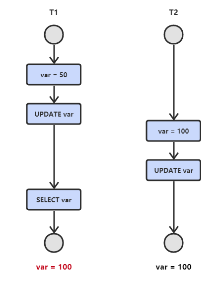
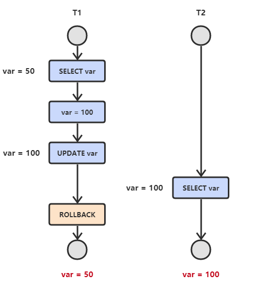
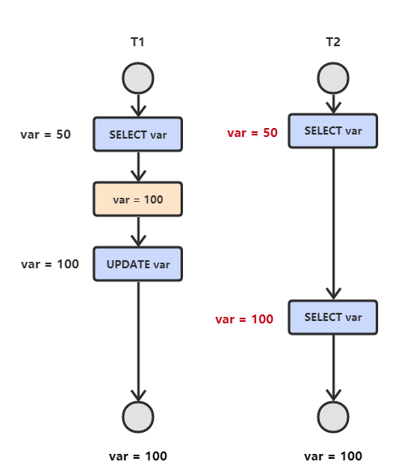
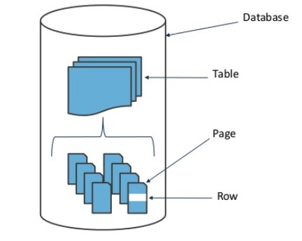
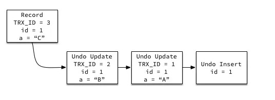

# 🤔👀 MySQL SQL 面试指南

# SQL DB - 数据库系统核心知识点

基于上篇数据库如何工作的基础之上，我们再来梳理下数据库系统中有哪些重要的知识点，包括：事务，并发一致性，封锁，隔离级别，多版本并发控制等。


## 一、事务

### 概念

事务指的是满足 ACID 特性的一组操作，可以通过 Commit 提交一个事务，也可以使用 Rollback 进行回滚。


### ACID

#### 1. 原子性(Atomicity)

事务被视为不可分割的最小单元，事务的所有操作要么全部提交成功，要么全部失败回滚。

回滚可以用日志来实现，日志记录着事务所执行的修改操作，在回滚时反向执行这些修改操作即可。

#### 2. 一致性(Consistency)

数据库在事务执行前后都保持一致性状态。在一致性状态下，所有事务对一个数据的读取结果都是相同的。

#### 3. 隔离性(Isolation)

一个事务所做的修改在最终提交以前，对其它事务是不可见的。

#### 4. 持久性(Durability)

一旦事务提交，则其所做的修改将会永远保存到数据库中。即使系统发生崩溃，事务执行的结果也不能丢失。

可以通过数据库备份和恢复来实现，在系统发生崩溃时，使用备份的数据库进行数据恢复。

------

事务的 ACID 特性概念简单，但不是很好理解，主要是因为这几个特性不是一种平级关系:

- 只有满足一致性，事务的执行结果才是正确的。
- 在无并发的情况下，事务串行执行，隔离性一定能够满足。此时只要能满足原子性，就一定能满足一致性。
- 在并发的情况下，多个事务并行执行，事务不仅要满足原子性，还需要满足隔离性，才能满足一致性。
- 事务满足持久化是为了能应对数据库崩溃的情况。


### AUTOCOMMIT

MySQL 默认采用自动提交模式。也就是说，如果不显式使用`START TRANSACTION`语句来开始一个事务，那么每个查询都会被当做一个事务自动提交。

## 二、并发一致性问题

在并发环境下，事务的隔离性很难保证，因此会出现很多并发一致性问题。

### 丢失修改

T1 和 T2 两个事务都对一个数据进行修改，T1 先修改，T2 随后修改，T2 的修改覆盖了 T1 的修改。




### 读脏数据

T1 修改一个数据，T2 随后读取这个数据。如果 T1 撤销了这次修改，那么 T2 读取的数据是脏数据。



### 不可重复读

T2 读取一个数据，T1 对该数据做了修改。如果 T2 再次读取这个数据，此时读取的结果和第一次读取的结果不同。




### 幻影读

T1 读取某个范围的数据，T2 在这个范围内插入新的数据，T1 再次读取这个范围的数据，此时读取的结果和和第一次读取的结果不同。


产生并发不一致性问题主要原因是破坏了事务的隔离性，解决方法是通过并发控制来保证隔离性。并发控制可以通过封锁来实现，但是封锁操作需要用户自己控制，相当复杂。数据库管理系统提供了事务的隔离级别，让用户以一种更轻松的方式处理并发一致性问题。

## 三、封锁

### 封锁粒度

MySQL 中提供了两种封锁粒度: 行级锁以及表级锁。

应该尽量只锁定需要修改的那部分数据，而不是所有的资源。锁定的数据量越少，发生锁争用的可能就越小，系统的并发程度就越高。

但是加锁需要消耗资源，锁的各种操作(包括获取锁、释放锁、以及检查锁状态)都会增加系统开销。因此封锁粒度越小，系统开销就越大。

在选择封锁粒度时，需要在锁开销和并发程度之间做一个权衡。




### 封锁类型

#### 1. 读写锁

- 排它锁(Exclusive)，简写为 X 锁，又称写锁。
- 共享锁(Shared)，简写为 S 锁，又称读锁。

有以下两个规定:

- 一个事务对数据对象 A 加了 X 锁，就可以对 A 进行读取和更新。加锁期间其它事务不能对 A 加任何锁。
- 一个事务对数据对象 A 加了 S 锁，可以对 A 进行读取操作，但是不能进行更新操作。加锁期间其它事务能对 A 加 S 锁，但是不能加 X 锁。

锁的兼容关系如下:

|  -   |  X   |  S   |
| :--: | :--: | :--: |
|  X   |  🎈   |  🎈   |
|  S   |  🎈   |  ✔   |

#### 2. 意向锁

使用意向锁(Intention Locks)可以更容易地支持多粒度封锁。

在存在行级锁和表级锁的情况下，事务 T 想要对表 A 加 X 锁，就需要先检测是否有其它事务对表 A 或者表 A 中的任意一行加了锁，那么就需要对表 A 的每一行都检测一次，这是非常耗时的。

意向锁在原来的 X/S 锁之上引入了 IX/IS，IX/IS 都是表锁，用来表示一个事务想要在表中的某个数据行上加 X 锁或 S 锁。有以下两个规定:

- 一个事务在获得某个数据行对象的 S 锁之前，必须先获得表的 IS 锁或者更强的锁；
- 一个事务在获得某个数据行对象的 X 锁之前，必须先获得表的 IX 锁。

通过引入意向锁，事务 T 想要对表 A 加 X 锁，只需要先检测是否有其它事务对表 A 加了 X/IX/S/IS 锁，如果加了就表示有其它事务正在使用这个表或者表中某一行的锁，因此事务 T 加 X 锁失败。

各种锁的兼容关系如下:

|  -   |  X   |  IX  |  S   |  IS  |
| :--: | :--: | :--: | :--: | :--: |
|  X   |  🎈   |  🎈   |  🎈   |  🎈   |
|  IX  |  🎈   |  ✔   |  🎈   |  ✔   |
|  S   |  🎈   |  🎈   |  ✔   |  ✔   |
|  IS  |  🎈   |  ✔   |  ✔   |  ✔   |

解释如下:

- 任意 IS/IX 锁之间都是兼容的，因为它们只是表示想要对表加锁，而不是真正加锁；
- S 锁只与 S 锁和 IS 锁兼容，也就是说事务 T 想要对数据行加 S 锁，其它事务可以已经获得对表或者表中的行的 S 锁。

### 封锁协议

#### 1. 三级封锁协议

**一级封锁协议**

事务 T 要修改数据 A 时必须加 X 锁，直到 T 结束才释放锁。

可以解决丢失修改问题，因为不能同时有两个事务对同一个数据进行修改，那么事务的修改就不会被覆盖。

|      T1       |      T2       |
| :-----------: | :-----------: |
|   lock-x(A)   |               |
|  read A = 20  |               |
|               |  lock - x(A)  |
|               |     wait      |
| write A = 19  |       .       |
|    commit     |       .       |
| unlock - x(A) |       .       |
|               |    obtain     |
|               |  read A = 19  |
|               | write A = 21  |
|               |    commit     |
|               | unlock - x(A) |


**二级封锁协议**

在一级的基础上，要求读取数据 A 时必须加 S 锁，读取完马上释放 S 锁。

可以解决读脏数据问题，因为如果一个事务在对数据 A 进行修改，根据 1 级封锁协议，会加 X 锁，那么就不能再加 S 锁了，也就是不会读入数据。

|      T1       |      T2       |
| :-----------: | :-----------: |
|   lock-x(A)   |               |
|  read A = 20  |               |
| write A = 19  |  lock - s(A)  |
|               |     wait      |
|   rollback    |       .       |
|    A = 20     |       .       |
| unlock - x(A) |       .       |
|               |    obtain     |
|               |  read A = 19  |
|               | write A = 22  |
|               |    commit     |
|               | unlock - s(A) |


**三级封锁协议**

在二级的基础上，要求读取数据 A 时必须加 S 锁，直到事务结束了才能释放 S 锁。

可以解决不可重复读的问题，因为读 A 时，其它事务不能对 A 加 X 锁，从而避免了在读的期间数据发生改变。

|      T1       |      T2       |
| :-----------: | :-----------: |
|   lock-s(A)   |               |
|  read A = 20  |               |
|               |  lock - x(A)  |
|               |     wait      |
| write A = 20  |       .       |
|    commit     |       .       |
| unlock - s(A) |       .       |
|               |    obtain     |
|               |  read A = 20  |
|               | write A = 19  |
|               |    commit     |
|               | unlock - x(A) |

#### 2. 两段锁协议

加锁和解锁分为两个阶段进行。

可串行化调度是指，通过并发控制，使得并发执行的事务结果与某个串行执行的事务结果相同。

事务遵循两段锁协议是保证可串行化调度的充分条件。例如以下操作满足两段锁协议，它是可串行化调度。

```html
lock-x(A)...lock-s(B)...lock-s(C)...unlock(A)...unlock(C)...unlock(B)
```

但不是必要条件，例如以下操作不满足两段锁协议，但是它还是可串行化调度。

```html
lock-x(A)...unlock(A)...lock-s(B)...unlock(B)...lock-s(C)...unlock(C)
```


### MySQL 隐式与显示锁定

MySQL 的 InnoDB 存储引擎采用两段锁协议，会根据隔离级别在需要的时候自动加锁，并且所有的锁都是在同一时刻被释放，这被称为隐式锁定。

InnoDB 也可以使用特定的语句进行显示锁定:

```sql
SELECT ... LOCK In SHARE MODE;
SELECT ... FOR UPDATE;
```

## 四、隔离级别

### 未提交读(READ UNCOMMITTED)

事务中的修改，即使没有提交，对其它事务也是可见的。

### 提交读(READ COMMITTED)

一个事务只能读取已经提交的事务所做的修改。换句话说，一个事务所做的修改在提交之前对其它事务是不可见的。

### 可重复读(REPEATABLE READ)

保证在同一个事务中多次读取同样数据的结果是一样的。

### 可串行化(SERIALIZABLE)

强制事务串行执行。

| 隔离级别 | 脏读 | 不可重复读 | 幻影读 |
| :------: | :--: | :--------: | :----: |
| 未提交读 |  ✔   |     ✔      |   ✔    |
|  提交读  |  🎈   |     ✔      |   ✔    |
| 可重复读 |  🎈   |     🎈      |   ✔    |
| 可串行化 |  🎈   |     🎈      |   🎈    |


## 五、多版本并发控制

多版本并发控制(Multi-Version Concurrency Control, MVCC)是 MySQL 的 InnoDB 存储引擎实现隔离级别的一种具体方式，用于实现提交读和可重复读这两种隔离级别。而未提交读隔离级别总是读取最新的数据行，无需使用 MVCC。可串行化隔离级别需要对所有读取的行都加锁，单纯使用 MVCC 无法实现。

### 版本号

- 系统版本号: 是一个递增的数字，每开始一个新的事务，系统版本号就会自动递增。
- 事务版本号: 事务开始时的系统版本号。

### 隐藏的列

MVCC 在每行记录后面都保存着两个隐藏的列，用来存储两个版本号:

- 创建版本号: 指示创建一个数据行的快照时的系统版本号；
- 删除版本号: 如果该快照的删除版本号大于当前事务版本号表示该快照有效，否则表示该快照已经被删除了。

### Undo 日志

MVCC 使用到的快照存储在 Undo 日志中，该日志通过回滚指针把一个数据行(Record)的所有快照连接起来。



### 实现过程

以下实现过程针对可重复读隔离级别。

当开始新一个事务时，该事务的版本号肯定会大于当前所有数据行快照的创建版本号，理解这一点很关键。

#### 1. SELECT

多个事务必须读取到同一个数据行的快照，并且这个快照是距离现在最近的一个有效快照。但是也有例外，如果有一个事务正在修改该数据行，那么它可以读取事务本身所做的修改，而不用和其它事务的读取结果一致。

把没有对一个数据行做修改的事务称为 T，T 所要读取的数据行快照的创建版本号必须小于 T 的版本号，因为如果大于或者等于 T 的版本号，那么表示该数据行快照是其它事务的最新修改，因此不能去读取它。除此之外，T 所要读取的数据行快照的删除版本号必须大于 T 的版本号，因为如果小于等于 T 的版本号，那么表示该数据行快照是已经被删除的，不应该去读取它。

#### 2. INSERT

将当前系统版本号作为数据行快照的创建版本号。

#### 3. DELETE

将当前系统版本号作为数据行快照的删除版本号。

#### 4. UPDATE

将当前系统版本号作为更新前的数据行快照的删除版本号，并将当前系统版本号作为更新后的数据行快照的创建版本号。可以理解为先执行 DELETE 后执行 INSERT。

### 快照读与当前读

#### 1. 快照读

使用 MVCC 读取的是快照中的数据，这样可以减少加锁所带来的开销。

```sql
select * from table ...;
```

#### 2. 当前读

读取的是最新的数据，需要加锁。以下第一个语句需要加 S 锁，其它都需要加 X 锁。

```sql
select * from table where ? lock in share mode;
select * from table where ? for update;
insert;
update;
delete;
```

## 六、Next-Key Locks

Next-Key Locks 是 MySQL 的 InnoDB 存储引擎的一种锁实现。

MVCC 不能解决幻读的问题，Next-Key Locks 就是为了解决这个问题而存在的。在可重复读(REPEATABLE READ)隔离级别下，使用 MVCC + Next-Key Locks 可以解决幻读问题。

### Record Locks

锁定一个记录上的索引，而不是记录本身。

如果表没有设置索引，InnoDB 会自动在主键上创建隐藏的聚簇索引，因此 Record Locks 依然可以使用。

### Gap Locks

锁定索引之间的间隙，但是不包含索引本身。例如当一个事务执行以下语句，其它事务就不能在 t.c 中插入 15。

```sql
SELECT c FROM t WHERE c BETWEEN 10 and 20 FOR UPDATE;
```

### Next-Key Locks

它是 Record Locks 和 Gap Locks 的结合，不仅锁定一个记录上的索引，也锁定索引之间的间隙。例如一个索引包含以下值: 10, 11, 13, and 20，那么就需要锁定以下区间:

```sql
(negative infinity, 10]
(10, 11]
(11, 13]
(13, 20]
(20, positive infinity)
```
