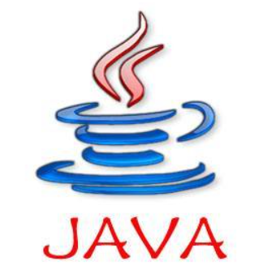
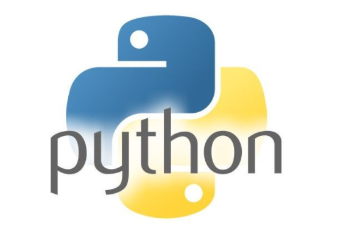

# **大数据开源技术栈✨**

**欢迎到访！🎈**  

**很高兴见到您~**

**祝您，早上好，中午好，下午好，晚安！😮🤑**

🚀[点我~emo啦~](https://gitee.com/BigData-dsjprs/big-data-dsjprs.gitee.io/blob/master/emoji.md)

## **技术栈路线😍**
- [x] **计算机基础**
- [x] **计算机网络**
- [x] **操作系统**
- [x] **数据库原理与概论**
- [x] **数据结构与算法**
- [x] **编程语言**
- [x] **大数据生态组件**

### **计算机基础💻**
* **深入理解计算机基础**[点我~](https://www.aliyundrive.com/s/fHDSwyyoNe6)

### **计算机网络💬**
* **30张图详解计算机网络(暗黑风格-图解网络)**[点我~](https://www.aliyundrive.com/s/WBnjtFC4EpA)

### **操作系统🤷‍👓**
* **深入理解操作系统**[点我~](https://www.aliyundrive.com/s/e9BdMi894WX)
* **易百教程**[Liunx学习](https://www.yiibai.com/linux)
* **易百教程**[Shell学习](https://www.yiibai.com/shell)
* **菜鸟教程**[Linux&Shell](https://www.runoob.com/linux/linux-tutorial.html)
* **Linux实战100讲**[点我~](https://www.aliyundrive.com/s/p8ouzLJSTmr)
* **Linux公社**[Linux门户](https://www.linuxidc.com/)
* **Linux栏目：**
  * [Linux常用命令速查表](https://gitee.com/BigData-dsjprs/big-data-dsjprs.gitee.io/blob/master/Linux/Linux%E5%91%BD%E4%BB%A4%E9%80%9F%E6%9F%A5.md)
  * [Linux常用命令详解](https://gitee.com/BigData-dsjprs/big-data-dsjprs.gitee.io/blob/master/Linux/Linux%E5%B8%B8%E7%94%A8%E5%91%BD%E4%BB%A4.md)
  * [Linux高级命令](https://gitee.com/BigData-dsjprs/big-data-dsjprs.gitee.io/blob/master/Linux/Linux%E6%8E%92%E9%94%99%E5%91%BD%E4%BB%A4.md)
  * [Shell入门&基础语法](https://gitee.com/BigData-dsjprs/big-data-dsjprs.gitee.io/blob/master/Linux/Shell%E5%9F%BA%E7%A1%80%E8%AF%AD%E6%B3%95.md)
  * 深入理解Linux[点我~](https://www.aliyundrive.com/s/FCgRztLssHu)

### **数据库原理与概论🖨**
* **SQL入门到精通📚**[点我~](https://www.aliyundrive.com/s/u7SwYtDdeaR)
* **MySQL基础教程📚**[点我~](https://www.aliyundrive.com/s/zMDKaXTyae6)
* **MySQL打怪升级📚**[点我~](https://www.aliyundrive.com/s/JeXMbo6PZzs)

#### **SQL&MySQL栏目**
  * [数据库基础与概论](https://gitee.com/BigData-dsjprs/big-data-dsjprs.gitee.io/blob/master/MySQL/SQL%E6%A0%B8%E5%BF%83%E9%87%8D%E7%82%B901.md)
  * [关系型数据库设计理论](https://gitee.com/BigData-dsjprs/big-data-dsjprs.gitee.io/blob/master/MySQL/SQL%E6%A0%B8%E5%BF%83%E9%87%8D%E7%82%B902.md)
  * [数据库系统核心知识点](https://gitee.com/BigData-dsjprs/big-data-dsjprs.gitee.io/blob/master/MySQL/SQL%E6%A0%B8%E5%BF%83%E9%87%8D%E7%82%B903.md)
  * [SQL基础语法](https://gitee.com/BigData-dsjprs/big-data-dsjprs.gitee.io/blob/master/MySQL/SQL%E8%AF%AD%E6%B3%95%E5%9F%BA%E7%A1%80.md)
  * [SQL语句练习](https://gitee.com/BigData-dsjprs/big-data-dsjprs.gitee.io/blob/master/MySQL/SQL%E8%AF%AD%E5%8F%A5%E7%BB%83%E4%B9%A0.md)
  * [SQL语句优化](https://gitee.com/BigData-dsjprs/big-data-dsjprs.gitee.io/blob/master/MySQL/SQL%E8%AF%AD%E5%8F%A5%E4%BC%98%E5%8C%96.md)
  * [SQL题目进阶](https://gitee.com/BigData-dsjprs/big-data-dsjprs.gitee.io/blob/master/MySQL/SQL%E9%A2%98%E7%9B%AE%E8%BF%9B%E9%98%B6.md)
  * [SQL优化总结](https://gitee.com/BigData-dsjprs/big-data-dsjprs.gitee.io/blob/master/MySQL/SQL%E4%BC%98%E5%8C%96.md)
  * [Mysql基础语法](https://gitee.com/BigData-dsjprs/big-data-dsjprs.gitee.io/blob/master/MySQL/MySQL%E6%A0%8F%E7%9B%AE.md)
  * [MySQL知识详解](https://gitee.com/BigData-dsjprs/big-data-dsjprs.gitee.io/blob/master/MySQL/MySQL%E7%B2%BE%E7%AE%80%E6%80%BB%E7%BB%93.md)
  * [MySQL基础总结](https://gitee.com/BigData-dsjprs/big-data-dsjprs.gitee.io/blob/master/MySQL/MySQL%E6%80%BB%E7%BB%93.md)
  * [MySQL优化大全](https://gitee.com/BigData-dsjprs/big-data-dsjprs.gitee.io/blob/master/MySQL/MySQL%E4%BC%98%E5%8C%96.md)
  
### **数据结构与算法🔐**
* **算法相关书籍**[点我~](https://www.aliyundrive.com/s/tNBNbdthucF)

* [点我点我~🚀学算法](https://the-algorithms.com/)网站上面，收录了包括 Python、Java、C++、JavaScript、Go 等多种主流编程语言的算法代码实现。
#### **十大排序算法🕶**
  * [排序算法知识体系](https://gitee.com/BigData-dsjprs/big-data-dsjprs.gitee.io/blob/master/%E6%95%B0%E6%8D%AE%E7%BB%93%E6%9E%84%E4%B8%8E%E7%AE%97%E6%B3%95/%E6%8E%92%E5%BA%8F%E7%AE%97%E6%B3%95/1_%E5%B8%B8%E8%A7%81%E7%AE%97%E6%B3%95%E7%9F%A5%E8%AF%86%E8%AF%A6%E8%A7%A3.md)
  * [冒泡排序](https://gitee.com/BigData-dsjprs/big-data-dsjprs.gitee.io/blob/master/%E6%95%B0%E6%8D%AE%E7%BB%93%E6%9E%84%E4%B8%8E%E7%AE%97%E6%B3%95/%E6%8E%92%E5%BA%8F%E7%AE%97%E6%B3%95/2_%E5%86%92%E6%B3%A1%E6%8E%92%E5%BA%8F(Bubble%20Sort).md)
  * [快速排序](https://gitee.com/BigData-dsjprs/big-data-dsjprs.gitee.io/blob/master/%E6%95%B0%E6%8D%AE%E7%BB%93%E6%9E%84%E4%B8%8E%E7%AE%97%E6%B3%95/%E6%8E%92%E5%BA%8F%E7%AE%97%E6%B3%95/3_%E5%BF%AB%E9%80%9F%E6%8E%92%E5%BA%8F(Quick%20Sort).md)
  * [插入排序](https://gitee.com/BigData-dsjprs/big-data-dsjprs.gitee.io/blob/master/%E6%95%B0%E6%8D%AE%E7%BB%93%E6%9E%84%E4%B8%8E%E7%AE%97%E6%B3%95/%E6%8E%92%E5%BA%8F%E7%AE%97%E6%B3%95/4_%E6%8F%92%E5%85%A5%E6%8E%92%E5%BA%8F(Insertion%20Sort).md)
  * [Shell排序](https://gitee.com/BigData-dsjprs/big-data-dsjprs.gitee.io/blob/master/%E6%95%B0%E6%8D%AE%E7%BB%93%E6%9E%84%E4%B8%8E%E7%AE%97%E6%B3%95/%E6%8E%92%E5%BA%8F%E7%AE%97%E6%B3%95/5_Shell%E6%8E%92%E5%BA%8F(Shell%20Sort).md)
  * [选择排序](https://gitee.com/BigData-dsjprs/big-data-dsjprs.gitee.io/blob/master/%E6%95%B0%E6%8D%AE%E7%BB%93%E6%9E%84%E4%B8%8E%E7%AE%97%E6%B3%95/%E6%8E%92%E5%BA%8F%E7%AE%97%E6%B3%95/6_%E9%80%89%E6%8B%A9%E6%8E%92%E5%BA%8F(Selection%20Sort).md)
  * [堆排序](https://gitee.com/BigData-dsjprs/big-data-dsjprs.gitee.io/blob/master/%E6%95%B0%E6%8D%AE%E7%BB%93%E6%9E%84%E4%B8%8E%E7%AE%97%E6%B3%95/%E6%8E%92%E5%BA%8F%E7%AE%97%E6%B3%95/7_%E5%A0%86%E6%8E%92%E5%BA%8F(Heap%20Sort).md)
  * [归并排序](https://gitee.com/BigData-dsjprs/big-data-dsjprs.gitee.io/blob/master/%E6%95%B0%E6%8D%AE%E7%BB%93%E6%9E%84%E4%B8%8E%E7%AE%97%E6%B3%95/%E6%8E%92%E5%BA%8F%E7%AE%97%E6%B3%95/8_%E5%BD%92%E5%B9%B6%E6%8E%92%E5%BA%8F(Merge%20Sort).md)
  * [桶排序](https://gitee.com/BigData-dsjprs/big-data-dsjprs.gitee.io/blob/master/%E6%95%B0%E6%8D%AE%E7%BB%93%E6%9E%84%E4%B8%8E%E7%AE%97%E6%B3%95/%E6%8E%92%E5%BA%8F%E7%AE%97%E6%B3%95/9_%E6%A1%B6%E6%8E%92%E5%BA%8F(Bucket%20Sort).md)
  * [基数排序](https://gitee.com/BigData-dsjprs/big-data-dsjprs.gitee.io/blob/master/%E6%95%B0%E6%8D%AE%E7%BB%93%E6%9E%84%E4%B8%8E%E7%AE%97%E6%B3%95/%E6%8E%92%E5%BA%8F%E7%AE%97%E6%B3%95/10_%E5%9F%BA%E6%95%B0%E6%8E%92%E5%BA%8F(Rdix%20Sort).md)
#### **数据结构与算法详解🛠**
  * [数据结构知识体系](https://gitee.com/BigData-dsjprs/big-data-dsjprs.gitee.io/blob/master/%E6%95%B0%E6%8D%AE%E7%BB%93%E6%9E%84%E4%B8%8E%E7%AE%97%E6%B3%95/1_%E6%95%B0%E6%8D%AE%E7%BB%93%E6%9E%84%E5%9F%BA%E7%A1%80.md)
  * [线性表(数组&矩阵)](https://gitee.com/BigData-dsjprs/big-data-dsjprs.gitee.io/blob/master/%E6%95%B0%E6%8D%AE%E7%BB%93%E6%9E%84%E4%B8%8E%E7%AE%97%E6%B3%95/2_%E7%BA%BF%E6%80%A7%E8%A1%A8-%E6%95%B0%E7%BB%84%E5%92%8C%E7%9F%A9%E9%98%B5.md)
  * [线性表(链表)](https://gitee.com/BigData-dsjprs/big-data-dsjprs.gitee.io/blob/master/%E6%95%B0%E6%8D%AE%E7%BB%93%E6%9E%84%E4%B8%8E%E7%AE%97%E6%B3%95/3_%E7%BA%BF%E6%80%A7%E8%A1%A8-%E9%93%BE%E8%A1%A8.md)
  * [线性表(散列哈希表)](https://gitee.com/BigData-dsjprs/big-data-dsjprs.gitee.io/blob/master/%E6%95%B0%E6%8D%AE%E7%BB%93%E6%9E%84%E4%B8%8E%E7%AE%97%E6%B3%95/4_%E7%BA%BF%E6%80%A7%E8%A1%A8(%E6%95%A3%E5%88%97)-%E5%93%88%E5%B8%8C%E8%A1%A8.md)
  * [线性表(栈&队列)](https://gitee.com/BigData-dsjprs/big-data-dsjprs.gitee.io/blob/master/%E6%95%B0%E6%8D%AE%E7%BB%93%E6%9E%84%E4%B8%8E%E7%AE%97%E6%B3%95/5_%E7%BA%BF%E6%80%A7%E8%A1%A8-%E6%A0%88%E5%92%8C%E9%98%9F%E5%88%97.md)
  * [树(基础回顾)](https://gitee.com/BigData-dsjprs/big-data-dsjprs.gitee.io/blob/master/%E6%95%B0%E6%8D%AE%E7%BB%93%E6%9E%84%E4%B8%8E%E7%AE%97%E6%B3%95/11_%E6%A0%91-%E5%9F%BA%E7%A1%80%E5%92%8COverview.md)
  * [树(二叉搜索树)](https://gitee.com/BigData-dsjprs/big-data-dsjprs.gitee.io/blob/master/%E6%95%B0%E6%8D%AE%E7%BB%93%E6%9E%84%E4%B8%8E%E7%AE%97%E6%B3%95/6_%E6%A0%91-%E4%BA%8C%E5%8F%89%E6%90%9C%E7%B4%A2%E6%A0%91(BST).md)
  * [树(平衡二叉树)](https://gitee.com/BigData-dsjprs/big-data-dsjprs.gitee.io/blob/master/%E6%95%B0%E6%8D%AE%E7%BB%93%E6%9E%84%E4%B8%8E%E7%AE%97%E6%B3%95/7_%E6%A0%91-%E5%B9%B3%E8%A1%A1%E4%BA%8C%E5%8F%89%E6%A0%91(AVL).md)
  * [树(红黑树)](https://gitee.com/BigData-dsjprs/big-data-dsjprs.gitee.io/blob/master/%E6%95%B0%E6%8D%AE%E7%BB%93%E6%9E%84%E4%B8%8E%E7%AE%97%E6%B3%95/8_%E6%A0%91-%E7%BA%A2%E9%BB%91%E6%A0%91(R-B%20Tree).md)
  * [树(哈夫曼树)](https://gitee.com/BigData-dsjprs/big-data-dsjprs.gitee.io/blob/master/%E6%95%B0%E6%8D%AE%E7%BB%93%E6%9E%84%E4%B8%8E%E7%AE%97%E6%B3%95/9_%E6%A0%91-%E5%93%88%E5%A4%AB%E6%9B%BC%E6%A0%91(Huffman%20Tree).md)
  * [树(前缀树)](https://gitee.com/BigData-dsjprs/big-data-dsjprs.gitee.io/blob/master/%E6%95%B0%E6%8D%AE%E7%BB%93%E6%9E%84%E4%B8%8E%E7%AE%97%E6%B3%95/10_%E6%A0%91-%E5%89%8D%E7%BC%80%E6%A0%91(Trie%20Tree).md)
  * [图(基础回顾)](https://gitee.com/BigData-dsjprs/big-data-dsjprs.gitee.io/blob/master/%E6%95%B0%E6%8D%AE%E7%BB%93%E6%9E%84%E4%B8%8E%E7%AE%97%E6%B3%95/12_%E5%9B%BE-%E5%9F%BA%E7%A1%80%E5%92%8COverView.md)
  * [图-遍历(BFS & DFS)](https://gitee.com/BigData-dsjprs/big-data-dsjprs.gitee.io/blob/master/%E6%95%B0%E6%8D%AE%E7%BB%93%E6%9E%84%E4%B8%8E%E7%AE%97%E6%B3%95/13_%E5%9B%BE-%E9%81%8D%E5%8E%86(BFS%20&%20DFS).md)
  * [图-最小生成树((Prim & Kruskal))](https://gitee.com/BigData-dsjprs/big-data-dsjprs.gitee.io/blob/master/%E6%95%B0%E6%8D%AE%E7%BB%93%E6%9E%84%E4%B8%8E%E7%AE%97%E6%B3%95/14_%E5%9B%BE-%E6%9C%80%E5%B0%8F%E7%94%9F%E6%88%90%E6%A0%91(Prim%20&%20Krukal).md)
  * [图-最短路径(Dijkstra & Frolyd)](https://gitee.com/BigData-dsjprs/big-data-dsjprs.gitee.io/blob/master/%E6%95%B0%E6%8D%AE%E7%BB%93%E6%9E%84%E4%B8%8E%E7%AE%97%E6%B3%95/15_%E5%9B%BE-%E6%9C%80%E7%9F%AD%E8%B7%AF%E5%BE%84(DIjkstra%20&%20Frolyod).md)
  * [图-拓扑排序(Topological sort)](https://gitee.com/BigData-dsjprs/big-data-dsjprs.gitee.io/blob/master/%E6%95%B0%E6%8D%AE%E7%BB%93%E6%9E%84%E4%B8%8E%E7%AE%97%E6%B3%95/16_%E5%9B%BE-%E6%8B%93%E6%89%91%E6%8E%92%E5%BA%8F(Topological%20sort).md)
  * [图-AOE & 关键路径](https://gitee.com/BigData-dsjprs/big-data-dsjprs.gitee.io/blob/master/%E6%95%B0%E6%8D%AE%E7%BB%93%E6%9E%84%E4%B8%8E%E7%AE%97%E6%B3%95/17_AOE%20&%20%E5%85%B3%E9%94%AE%E8%B7%AF%E5%BE%84.md)
  * [算法核心思想(重点)](https://gitee.com/BigData-dsjprs/big-data-dsjprs.gitee.io/blob/master/%E6%95%B0%E6%8D%AE%E7%BB%93%E6%9E%84%E4%B8%8E%E7%AE%97%E6%B3%95/%E7%AE%97%E6%B3%95%E6%A0%B8%E5%BF%83%E6%80%9D%E6%83%B3.md)

### **编程语言👀**

#### **Java**
##### **Java入门必知必会⚙**
  * [基础知识详解](https://gitee.com/BigData-dsjprs/big-data-dsjprs.gitee.io/blob/master/Java/Java%E5%9F%BA%E7%A1%80/1_Java%E5%9F%BA%E7%A1%80-%E7%9F%A5%E8%AF%86%E7%82%B9.md)
  * [面向对象](https://gitee.com/BigData-dsjprs/big-data-dsjprs.gitee.io/blob/master/Java/Java%E5%9F%BA%E7%A1%80/2_Java%E5%9F%BA%E7%A1%80-%E9%9D%A2%E5%90%91%E5%AF%B9%E8%B1%A1.md)
  * [基础知识体系小结](https://gitee.com/BigData-dsjprs/big-data-dsjprs.gitee.io/blob/master/Java/Java%E5%9F%BA%E7%A1%80/3_Java%E5%9F%BA%E7%A1%80-%E5%9B%BE%E8%B0%B1%20&%20Q%20%20A.md)
  * [泛型机制详解](https://gitee.com/BigData-dsjprs/big-data-dsjprs.gitee.io/blob/master/Java/Java%E5%9F%BA%E7%A1%80/4_Java%E5%9F%BA%E7%A1%80-%E6%B3%9B%E5%9E%8B%E6%9C%BA%E5%88%B6%E8%AF%A6%E8%A7%A3.md)
  * [注解机制详解](https://gitee.com/BigData-dsjprs/big-data-dsjprs.gitee.io/blob/master/Java/Java%E5%9F%BA%E7%A1%80/5_Java%E5%9F%BA%E7%A1%80-%E6%B3%A8%E8%A7%A3%E6%9C%BA%E5%88%B6%E8%AF%A6%E8%A7%A3.md)
  * [异常机制详解](https://gitee.com/BigData-dsjprs/big-data-dsjprs.gitee.io/blob/master/Java/Java%E5%9F%BA%E7%A1%80/6_Java%E5%9F%BA%E7%A1%80-%E5%BC%82%E5%B8%B8%E6%9C%BA%E5%88%B6%E8%AF%A6%E8%A7%A3.md)
  * [反射机制详解](https://gitee.com/BigData-dsjprs/big-data-dsjprs.gitee.io/blob/master/Java/Java%E5%9F%BA%E7%A1%80/7_Java%E5%9F%BA%E7%A1%80-%E5%8F%8D%E5%B0%84%E6%9C%BA%E5%88%B6%E8%AF%A6%E8%A7%A3.md)
  * [SPI机制详解](https://gitee.com/BigData-dsjprs/big-data-dsjprs.gitee.io/blob/master/Java/Java%E5%9F%BA%E7%A1%80/8_Java%E5%9F%BA%E7%A1%80-SPI%E6%9C%BA%E5%88%B6%E8%AF%A6%E8%A7%A3.md)
  * [面试题精简总结01](https://gitee.com/BigData-dsjprs/big-data-dsjprs.gitee.io/tree/master/Java/Java%E5%9F%BA%E7%A1%80)
  * [面试题精简总结02](https://gitee.com/BigData-dsjprs/big-data-dsjprs.gitee.io/blob/master/Java/Java%E5%9F%BA%E7%A1%80/JAVA%E5%9F%BA%E7%A1%80%E6%80%BB%E7%BB%9302.md)
  * [面试题精简总结03](https://gitee.com/BigData-dsjprs/big-data-dsjprs.gitee.io/blob/master/Java/Java%E9%9D%A2%E9%9C%B8%E7%AF%87.md)
##### **Java集合框架🗜**  
  * [Collection类关系图](https://gitee.com/BigData-dsjprs/big-data-dsjprs.gitee.io/blob/master/Java/Java%E9%9B%86%E5%90%88%E6%A1%86%E6%9E%B6/1_Collection%E7%B1%BB%E5%85%B3%E7%B3%BB%E5%9B%BE.md)
  * [Collection-ArrayList源码解析](https://gitee.com/BigData-dsjprs/big-data-dsjprs.gitee.io/blob/master/Java/Java%E9%9B%86%E5%90%88%E6%A1%86%E6%9E%B6/2_Collection_ArrayList%E6%BA%90%E7%A0%81%E8%A7%A3%E6%9E%90.md)
  * [Collection-LinkedList源码解析](https://gitee.com/BigData-dsjprs/big-data-dsjprs.gitee.io/blob/master/Java/Java%E9%9B%86%E5%90%88%E6%A1%86%E6%9E%B6/3_Collection_LinkedList%E6%BA%90%E7%A0%81%E8%A7%A3%E6%9E%90.md)
  * [Collection-Stack&Queue源码解析](https://gitee.com/BigData-dsjprs/big-data-dsjprs.gitee.io/blob/master/Java/Java%E9%9B%86%E5%90%88%E6%A1%86%E6%9E%B6/4_Colletction_Stack%20&%20Queue%E6%BA%90%E7%A0%81%E8%A7%A3%E6%9E%90.md)
  * [Collection-PriorityQueue源码解析](https://gitee.com/BigData-dsjprs/big-data-dsjprs.gitee.io/blob/master/Java/Java%E9%9B%86%E5%90%88%E6%A1%86%E6%9E%B6/5_Collection_PriorityQueue%E6%BA%90%E7%A0%81%E8%A7%A3%E6%9E%90.md)
  * [Map-HashSet&HashMap源码解析](https://gitee.com/BigData-dsjprs/big-data-dsjprs.gitee.io/blob/master/Java/Java%E9%9B%86%E5%90%88%E6%A1%86%E6%9E%B6/6_Map-HashSet%20&%20HashMap%E6%BA%90%E7%A0%81%E8%A7%A3%E6%9E%90.md)
  * [Map-LinkedHashSet&Map源码解析](https://gitee.com/BigData-dsjprs/big-data-dsjprs.gitee.io/blob/master/Java/Java%E9%9B%86%E5%90%88%E6%A1%86%E6%9E%B6/7_Map-linkedHashSet&Map%E6%BA%90%E7%A0%81%E8%A7%A3%E6%9E%90.md)
  * [Map-TreeSet&TreeMap源码解析](https://gitee.com/BigData-dsjprs/big-data-dsjprs.gitee.io/blob/master/Java/Java%E9%9B%86%E5%90%88%E6%A1%86%E6%9E%B6/8_Map-TreeSet%20&%20TreeMap%E6%BA%90%E7%A0%81%E8%A7%A3%E6%9E%90.md)
  * [Map-WeakHashMap源码解析](https://gitee.com/BigData-dsjprs/big-data-dsjprs.gitee.io/blob/master/Java/Java%E9%9B%86%E5%90%88%E6%A1%86%E6%9E%B6/9_Map%20-%20WeakHashMap%E6%BA%90%E7%A0%81%E8%A7%A3%E6%9E%90.md)
##### **Java IO&NIO&AIO🧪**
  * [Java IO知识图谱详解](https://gitee.com/BigData-dsjprs/big-data-dsjprs.gitee.io/blob/master/Java/Java%20IO&NIO&AIO/1_%E2%99%A5Java%20IO%E7%9F%A5%E8%AF%86%E4%BD%93%E7%B3%BB%E8%AF%A6%E8%A7%A3%E2%99%A5.md)
  * [Java IO-分类(传输，操作)](https://gitee.com/BigData-dsjprs/big-data-dsjprs.gitee.io/blob/master/Java/Java%20IO&NIO&AIO/2_Java%20IO%20-%20%E5%88%86%E7%B1%BB(%E4%BC%A0%E8%BE%93%EF%BC%8C%E6%93%8D%E4%BD%9C).md)
  * [Java IO-设计模式(装饰者模式)](https://gitee.com/BigData-dsjprs/big-data-dsjprs.gitee.io/blob/master/Java/Java%20IO&NIO&AIO/3_Java%20IO%20-%20%E8%AE%BE%E8%AE%A1%E6%A8%A1%E5%BC%8F(%E8%A3%85%E9%A5%B0%E8%80%85%E6%A8%A1%E5%BC%8F).md)
  * [Java IO-源码:InputStream](https://gitee.com/BigData-dsjprs/big-data-dsjprs.gitee.io/blob/master/Java/Java%20IO&NIO&AIO/4_Java%20IO%20-%20%E6%BA%90%E7%A0%81%20InputStream.md)
  * [Java IO-源码OutputStream](https://gitee.com/BigData-dsjprs/big-data-dsjprs.gitee.io/blob/master/Java/Java%20IO&NIO&AIO/5_Java%20IO%20-%20%E6%BA%90%E7%A0%81%20OutputStream.md)
  * [Java IO-常见类使用](https://gitee.com/BigData-dsjprs/big-data-dsjprs.gitee.io/blob/master/Java/Java%20IO&NIO&AIO/6_Java%20IO%20-%20%E5%B8%B8%E8%A7%81%E7%B1%BB%E4%BD%BF%E7%94%A8.md)
  * [IO 模型-Unix IO 模型](https://gitee.com/BigData-dsjprs/big-data-dsjprs.gitee.io/blob/master/Java/Java%20IO&NIO&AIO/7_IO%20%E6%A8%A1%E5%9E%8B%20-%20Unix%20IO%20%E6%A8%A1%E5%9E%8B.md)
  * [Java IO-BIO详解](https://gitee.com/BigData-dsjprs/big-data-dsjprs.gitee.io/blob/master/Java/Java%20IO&NIO&AIO/8_Java%20IO%20-%20BIO%20%E8%AF%A6%E8%A7%A3.md)
  * [Java NIO-基础详解](https://gitee.com/BigData-dsjprs/big-data-dsjprs.gitee.io/blob/master/Java/Java%20IO&NIO&AIO/9_Java%20NIO%20-%20%E5%9F%BA%E7%A1%80%E8%AF%A6%E8%A7%A3.md)
  * [Java NIO-IO多路复用详解](https://gitee.com/BigData-dsjprs/big-data-dsjprs.gitee.io/blob/master/Java/Java%20IO&NIO&AIO/10_Java%20NIO%20-%20IO%E5%A4%9A%E8%B7%AF%E5%A4%8D%E7%94%A8%E8%AF%A6%E8%A7%A3.md)
  * [Java AIO-异步IO详解](https://gitee.com/BigData-dsjprs/big-data-dsjprs.gitee.io/blob/master/Java/Java%20IO&NIO&AIO/11_Java%20AIO%20-%20%E5%BC%82%E6%AD%A5IO%E8%AF%A6%E8%A7%A3.md)
  * [Java N(A)IO-框架Netty](https://gitee.com/BigData-dsjprs/big-data-dsjprs.gitee.io/blob/master/Java/Java%20IO&NIO&AIO/12_Java%20N(A)IO%20-%20%E6%A1%86%E6%9E%B6%20Netty.md)
  * [Java NIO-零拷贝实现](https://gitee.com/BigData-dsjprs/big-data-dsjprs.gitee.io/blob/master/Java/Java%20IO&NIO&AIO/13_Java%20NIO%20-%20%E9%9B%B6%E6%8B%B7%E8%B4%9D%E5%AE%9E%E7%8E%B0.md)
##### **Java多线程&JUC⛓**
  * [并发知识图谱详解](https://gitee.com/BigData-dsjprs/big-data-dsjprs.gitee.io/blob/master/Java/Java%E5%A4%9A%E7%BA%BF%E7%A8%8B&JUC/1_Java%E9%AB%98%E5%B9%B6%E5%8F%91%E7%9F%A5%E8%AF%86%E8%AF%A6%E8%A7%A3.md)
  * [并发-理论基础](https://gitee.com/BigData-dsjprs/big-data-dsjprs.gitee.io/blob/master/Java/Java%E5%A4%9A%E7%BA%BF%E7%A8%8B&JUC/2_Java%E5%B9%B6%E5%8F%91-%E7%90%86%E8%AE%BA%E5%9F%BA%E7%A1%80.md)
  * [并发-线程基础](https://gitee.com/BigData-dsjprs/big-data-dsjprs.gitee.io/blob/master/Java/Java%E5%A4%9A%E7%BA%BF%E7%A8%8B&JUC/3_Java%20%E5%B9%B6%E5%8F%91%20-%20%E7%BA%BF%E7%A8%8B%E5%9F%BA%E7%A1%80.md)
  * [关键字:synchronized详解](https://gitee.com/BigData-dsjprs/big-data-dsjprs.gitee.io/blob/master/Java/Java%E5%A4%9A%E7%BA%BF%E7%A8%8B&JUC/4_%E5%85%B3%E9%94%AE%E5%AD%97%20synchronized%E8%AF%A6%E8%A7%A3.md)
  * [关键字:volatile详解](https://gitee.com/BigData-dsjprs/big-data-dsjprs.gitee.io/blob/master/Java/Java%E5%A4%9A%E7%BA%BF%E7%A8%8B&JUC/5_%E5%85%B3%E9%94%AE%E5%AD%97%20volatile%E8%AF%A6%E8%A7%A3.md)
  * [关键字:final详解](https://gitee.com/BigData-dsjprs/big-data-dsjprs.gitee.io/blob/master/Java/Java%E5%A4%9A%E7%BA%BF%E7%A8%8B&JUC/6_%E5%85%B3%E9%94%AE%E5%AD%97%20final%E8%AF%A6%E8%A7%A3.md)
  * [JUC-类汇总指南](https://gitee.com/BigData-dsjprs/big-data-dsjprs.gitee.io/blob/master/Java/Java%E5%A4%9A%E7%BA%BF%E7%A8%8B&JUC/7_JUC%20-%20%E7%B1%BB%E6%B1%87%E6%80%BB%E5%92%8C%E5%AD%A6%E4%B9%A0%E6%8C%87%E5%8D%97.md)
  * [JUC原子类: CAS、Unsafe和原子类详解](https://gitee.com/BigData-dsjprs/big-data-dsjprs.gitee.io/blob/master/Java/Java%E5%A4%9A%E7%BA%BF%E7%A8%8B&JUC/8_JUC%E5%8E%9F%E5%AD%90%E7%B1%BB%20CAS,%20Unsafe%E5%92%8C%E5%8E%9F%E5%AD%90%E7%B1%BB%E8%AF%A6%E8%A7%A3.md)
  * [JUC锁:LockSupport详解](https://gitee.com/BigData-dsjprs/big-data-dsjprs.gitee.io/blob/master/Java/Java%E5%A4%9A%E7%BA%BF%E7%A8%8B&JUC/9_JUC%E9%94%81%20LockSupport%E8%AF%A6%E8%A7%A3.md)
  * [JUC锁:锁核心类AQS详解](https://gitee.com/BigData-dsjprs/big-data-dsjprs.gitee.io/blob/master/Java/Java%E5%A4%9A%E7%BA%BF%E7%A8%8B&JUC/10_JUC%E9%94%81%20%E9%94%81%E6%A0%B8%E5%BF%83%E7%B1%BBAQS%E8%AF%A6%E8%A7%A3.md)
  * [JUC锁:ReentrantLock详解](https://gitee.com/BigData-dsjprs/big-data-dsjprs.gitee.io/blob/master/Java/Java%E5%A4%9A%E7%BA%BF%E7%A8%8B&JUC/11_JUC%E9%94%81%20ReentrantLock%E8%AF%A6%E8%A7%A3.md)
  * [JUC锁:ReentrantReadWriteLock详解](https://gitee.com/BigData-dsjprs/big-data-dsjprs.gitee.io/blob/master/Java/Java%E5%A4%9A%E7%BA%BF%E7%A8%8B&JUC/12_JUC%E9%94%81%20ReentrantReadWriteLock%E8%AF%A6%E8%A7%A3.md)
  * [JUC集合:ConcurrentHashMap详解](https://gitee.com/BigData-dsjprs/big-data-dsjprs.gitee.io/blob/master/Java/Java%E5%A4%9A%E7%BA%BF%E7%A8%8B&JUC/13_JUC%E9%9B%86%E5%90%88%20ConcurrentHashMap%E8%AF%A6%E8%A7%A3.md)
  * [JUC集合:CopyOnWriteArrayList详解](https://gitee.com/BigData-dsjprs/big-data-dsjprs.gitee.io/blob/master/Java/Java%E5%A4%9A%E7%BA%BF%E7%A8%8B&JUC/14_JUC%E9%9B%86%E5%90%88%20CopyOnWriteArrayList%E8%AF%A6%E8%A7%A3.md)
  * [JUC集合:ConcurrentLinkedQueue详解](https://gitee.com/BigData-dsjprs/big-data-dsjprs.gitee.io/blob/master/Java/Java%E5%A4%9A%E7%BA%BF%E7%A8%8B&JUC/15_JUC%E9%9B%86%E5%90%88%20ConcurrentLinkedQueue%E8%AF%A6%E8%A7%A3.md)
  * [JUC集合:BlockingQueue详解](https://gitee.com/BigData-dsjprs/big-data-dsjprs.gitee.io/blob/master/Java/Java%E5%A4%9A%E7%BA%BF%E7%A8%8B&JUC/16_JUC%E9%9B%86%E5%90%88%20BlockingQueue%E8%AF%A6%E8%A7%A3.md)
  * [JUC线程池:FutureTask详解](https://gitee.com/BigData-dsjprs/big-data-dsjprs.gitee.io/blob/master/Java/Java%E5%A4%9A%E7%BA%BF%E7%A8%8B&JUC/17_JUC%E7%BA%BF%E7%A8%8B%E6%B1%A0%20FutureTask%E8%AF%A6%E8%A7%A3.md)
  * [JUC线程池:ThreadPoolExecutor详解](https://gitee.com/BigData-dsjprs/big-data-dsjprs.gitee.io/blob/master/Java/Java%E5%A4%9A%E7%BA%BF%E7%A8%8B&JUC/18_JUC%E7%BA%BF%E7%A8%8B%E6%B1%A0%20ThreadPoolExecutor%E8%AF%A6%E8%A7%A3.md)
  * [JUC线程池:ScheduledThreadPoolExecutor详解](https://gitee.com/BigData-dsjprs/big-data-dsjprs.gitee.io/blob/master/Java/Java%E5%A4%9A%E7%BA%BF%E7%A8%8B&JUC/19_JUC%E7%BA%BF%E7%A8%8B%E6%B1%A0%20ScheduledThreadPoolExecutor%E8%AF%A6%E8%A7%A3.md)
  * [JUC线程池:Fork/Join框架详解](https://gitee.com/BigData-dsjprs/big-data-dsjprs.gitee.io/blob/master/Java/Java%E5%A4%9A%E7%BA%BF%E7%A8%8B&JUC/20_JUC%E7%BA%BF%E7%A8%8B%E6%B1%A0%20ForkJoin%E6%A1%86%E6%9E%B6%E8%AF%A6%E8%A7%A3.md)
  * [JUC工具类:CountDownLatch详解](https://gitee.com/BigData-dsjprs/big-data-dsjprs.gitee.io/blob/master/Java/Java%E5%A4%9A%E7%BA%BF%E7%A8%8B&JUC/21_JUC%E5%B7%A5%E5%85%B7%E7%B1%BB%20CountDownLatch%E8%AF%A6%E8%A7%A3.md)
  * [JUC工具类:CyclicBarrier详解](https://gitee.com/BigData-dsjprs/big-data-dsjprs.gitee.io/blob/master/Java/Java%E5%A4%9A%E7%BA%BF%E7%A8%8B&JUC/22_JUC%E5%B7%A5%E5%85%B7%E7%B1%BB%20CyclicBarrier%E8%AF%A6%E8%A7%A3.md)
  * [JUC工具类:Semaphore详解](https://gitee.com/BigData-dsjprs/big-data-dsjprs.gitee.io/blob/master/Java/Java%E5%A4%9A%E7%BA%BF%E7%A8%8B&JUC/23_JUC%E5%B7%A5%E5%85%B7%E7%B1%BB%20Semaphore%E8%AF%A6%E8%A7%A3.md)
  * [JUC工具类:Phaser详解](https://gitee.com/BigData-dsjprs/big-data-dsjprs.gitee.io/blob/master/Java/Java%E5%A4%9A%E7%BA%BF%E7%A8%8B&JUC/24_JUC%E5%B7%A5%E5%85%B7%E7%B1%BB%20Phaser%E8%AF%A6%E8%A7%A3.md)
  * [JUC工具类:Exchanger详解](https://gitee.com/BigData-dsjprs/big-data-dsjprs.gitee.io/blob/master/Java/Java%E5%A4%9A%E7%BA%BF%E7%A8%8B&JUC/25_JUC%E5%B7%A5%E5%85%B7%E7%B1%BB%20Exchanger%E8%AF%A6%E8%A7%A3.md)
  * [并发-ThreadLocal详解](https://gitee.com/BigData-dsjprs/big-data-dsjprs.gitee.io/blob/master/Java/Java%E5%A4%9A%E7%BA%BF%E7%A8%8B&JUC/26_Java%20%E5%B9%B6%E5%8F%91%20-%20ThreadLocal%E8%AF%A6%E8%A7%A3.md)
##### **深度解读JVM💣**
  * [JVM知识图谱详解](https://gitee.com/BigData-dsjprs/big-data-dsjprs.gitee.io/blob/master/Java/JVM/1_JVM%E7%9B%B8%E5%85%B3%E7%9F%A5%E8%AF%86%E4%BD%93%E7%B3%BB%E8%AF%A6%E8%A7%A3.md)
  * [类字节码详解](https://gitee.com/BigData-dsjprs/big-data-dsjprs.gitee.io/blob/master/Java/JVM/2_JVM%20%E5%9F%BA%E7%A1%80%20-%20%E7%B1%BB%E5%AD%97%E8%8A%82%E7%A0%81%E8%AF%A6%E8%A7%A3.md)
  * [类加载机制](https://gitee.com/BigData-dsjprs/big-data-dsjprs.gitee.io/blob/master/Java/JVM/3_JVM%20%E5%9F%BA%E7%A1%80%20-%20Java%20%E7%B1%BB%E5%8A%A0%E8%BD%BD%E6%9C%BA%E5%88%B6.md)
  * [内存结构](https://gitee.com/BigData-dsjprs/big-data-dsjprs.gitee.io/blob/master/Java/JVM/4_JVM%20%E5%9F%BA%E7%A1%80%20-%20JVM%20%E5%86%85%E5%AD%98%E7%BB%93%E6%9E%84.md)
  * [内存模型引入](https://gitee.com/BigData-dsjprs/big-data-dsjprs.gitee.io/blob/master/Java/JVM/5_JVM%20%E5%9F%BA%E7%A1%80%20-%20Java%20%E5%86%85%E5%AD%98%E6%A8%A1%E5%9E%8B%E5%BC%95%E5%85%A5.md)
  * [内存模型详解](https://gitee.com/BigData-dsjprs/big-data-dsjprs.gitee.io/blob/master/Java/JVM/6_JVM%20%E5%9F%BA%E7%A1%80%20-%20Java%20%E5%86%85%E5%AD%98%E6%A8%A1%E5%9E%8B%E8%AF%A6%E8%A7%A3.md)
  * [垃圾回收基础](https://gitee.com/BigData-dsjprs/big-data-dsjprs.gitee.io/blob/master/Java/JVM/7_JVM%20%E5%9F%BA%E7%A1%80%20-%20Java%20%E5%9E%83%E5%9C%BE%E5%9B%9E%E6%94%B6%E5%9F%BA%E7%A1%80.md)
  * [垃圾回收器G1详解](https://gitee.com/BigData-dsjprs/big-data-dsjprs.gitee.io/blob/master/Java/JVM/8_JVM%20%E5%9F%BA%E7%A1%80%20-%20Java%20%E5%9E%83%E5%9C%BE%E5%9B%9E%E6%94%B6%E5%99%A8G1%E8%AF%A6%E8%A7%A3.md)
  * [调优参数](https://gitee.com/BigData-dsjprs/big-data-dsjprs.gitee.io/blob/master/Java/JVM/9_%E8%B0%83%E8%AF%95%E6%8E%92%E9%94%99%20-%20JVM%20%E8%B0%83%E4%BC%98%E5%8F%82%E6%95%B0.md)
  * [OOM分析](https://gitee.com/BigData-dsjprs/big-data-dsjprs.gitee.io/blob/master/Java/JVM/10_%E8%B0%83%E8%AF%95%E6%8E%92%E9%94%99%20-%20Java%20OOM%20%E5%88%86%E6%9E%90.md)
  * [线程Dump分析](https://gitee.com/BigData-dsjprs/big-data-dsjprs.gitee.io/blob/master/Java/JVM/11_%E8%B0%83%E8%AF%95%E6%8E%92%E9%94%99%20-%20Java%E7%BA%BF%E7%A8%8BDump%E5%88%86%E6%9E%90.md)
  * [问题排查:Linux命令](https://gitee.com/BigData-dsjprs/big-data-dsjprs.gitee.io/blob/master/Java/JVM/12_%E8%B0%83%E8%AF%95%E6%8E%92%E9%94%99%20-%20Java%E9%97%AE%E9%A2%98%E6%8E%92%E6%9F%A5%EF%BC%9ALinux%E5%91%BD%E4%BB%A4.md)
  * [问题排查:工具单](https://gitee.com/BigData-dsjprs/big-data-dsjprs.gitee.io/blob/master/Java/JVM/13_%E8%B0%83%E8%AF%95%E6%8E%92%E9%94%99%20-%20Java%E9%97%AE%E9%A2%98%E6%8E%92%E6%9F%A5%EF%BC%9A%E5%B7%A5%E5%85%B7%E5%8D%95.md)
  * [9种常见的CMS、GC问题分析与解决](https://gitee.com/BigData-dsjprs/big-data-dsjprs.gitee.io/blob/master/Java/JVM/14_%E8%B0%83%E8%AF%95%E6%8E%92%E9%94%99%20-%209%E7%A7%8D%E5%B8%B8%E8%A7%81%E7%9A%84CMS%20GC%E9%97%AE%E9%A2%98%E5%88%86%E6%9E%90%E4%B8%8E%E8%A7%A3%E5%86%B3.md)
  * [动态调试技术原理](https://gitee.com/BigData-dsjprs/big-data-dsjprs.gitee.io/blob/master/Java/JVM/15_%E8%B0%83%E8%AF%95%E6%8E%92%E9%94%99%20-%20Java%E5%8A%A8%E6%80%81%E8%B0%83%E8%AF%95%E6%8A%80%E6%9C%AF%E5%8E%9F%E7%90%86.md)
  * [应用在线调试Arthas](https://gitee.com/BigData-dsjprs/big-data-dsjprs.gitee.io/blob/master/Java/JVM/16_%E8%B0%83%E8%AF%95%E6%8E%92%E9%94%99%20-%20Java%E5%BA%94%E7%94%A8%E5%9C%A8%E7%BA%BF%E8%B0%83%E8%AF%95Arthas.md)
  * [使用IDEA本地调试和远程调试](https://gitee.com/BigData-dsjprs/big-data-dsjprs.gitee.io/blob/master/Java/JVM/17_%E8%B0%83%E8%AF%95%E6%8E%92%E9%94%99%20-%20%E4%BD%BF%E7%94%A8IDEA%E6%9C%AC%E5%9C%B0%E8%B0%83%E8%AF%95%E5%92%8C%E8%BF%9C%E7%A8%8B%E8%B0%83%E8%AF%95.md)
##### **Java8特性详解🗡**
  * [Java8特性知识图谱详解](https://gitee.com/BigData-dsjprs/big-data-dsjprs.gitee.io/blob/master/Java/Java8%E7%89%B9%E6%80%A7%E8%AF%A6%E8%A7%A3/1_Java8%20-%20%E7%89%B9%E6%80%A7%E7%9F%A5%E8%AF%86%E4%BD%93%E7%B3%BB%E8%AF%A6%E8%A7%A3.md)
  * [函数编程lambda表达式](https://gitee.com/BigData-dsjprs/big-data-dsjprs.gitee.io/blob/master/Java/Java8%E7%89%B9%E6%80%A7%E8%AF%A6%E8%A7%A3/2_Java%208%20-%20%E5%87%BD%E6%95%B0%E7%BC%96%E7%A8%8B(lambda%E8%A1%A8%E8%BE%BE%E5%BC%8F).md)
  * [Optional类深度解析](https://gitee.com/BigData-dsjprs/big-data-dsjprs.gitee.io/blob/master/Java/Java8%E7%89%B9%E6%80%A7%E8%AF%A6%E8%A7%A3/3_Java%208%20-%20Optional%E7%B1%BB%E6%B7%B1%E5%BA%A6%E8%A7%A3%E6%9E%90.md)
  * [默认方法](https://gitee.com/BigData-dsjprs/big-data-dsjprs.gitee.io/blob/master/Java/Java8%E7%89%B9%E6%80%A7%E8%AF%A6%E8%A7%A3/4_Java%208%20-%20%E9%BB%98%E8%AE%A4%E6%96%B9%E6%B3%95.md)
  * [类型注解](https://gitee.com/BigData-dsjprs/big-data-dsjprs.gitee.io/blob/master/Java/Java8%E7%89%B9%E6%80%A7%E8%AF%A6%E8%A7%A3/5_Java%208%20-%20%E7%B1%BB%E5%9E%8B%E6%B3%A8%E8%A7%A3.md)
  * [重复注解](https://gitee.com/BigData-dsjprs/big-data-dsjprs.gitee.io/blob/master/Java/Java8%E7%89%B9%E6%80%A7%E8%AF%A6%E8%A7%A3/6_Java%208%20-%20%E9%87%8D%E5%A4%8D%E6%B3%A8%E8%A7%A3.md)
  * [类型推断优化](https://gitee.com/BigData-dsjprs/big-data-dsjprs.gitee.io/blob/master/Java/Java8%E7%89%B9%E6%80%A7%E8%AF%A6%E8%A7%A3/7_Java%208%20-%20%E7%B1%BB%E5%9E%8B%E6%8E%A8%E6%96%AD%E4%BC%98%E5%8C%96.md)
  * [JRE精化](https://gitee.com/BigData-dsjprs/big-data-dsjprs.gitee.io/blob/master/Java/Java8%E7%89%B9%E6%80%A7%E8%AF%A6%E8%A7%A3/8_Java%208%20-%20JRE%E7%B2%BE%E7%AE%80.md)
  * [移除Permgen](https://gitee.com/BigData-dsjprs/big-data-dsjprs.gitee.io/blob/master/Java/Java8%E7%89%B9%E6%80%A7%E8%AF%A6%E8%A7%A3/9_Java%208%20-%20%E7%A7%BB%E9%99%A4Permgen.md)
  * [StampedLock](https://gitee.com/BigData-dsjprs/big-data-dsjprs.gitee.io/blob/master/Java/Java8%E7%89%B9%E6%80%A7%E8%AF%A6%E8%A7%A3/10_Java%208%20-%20StampedLock.md)
  * [LocalDate&LocalDateTime](https://gitee.com/BigData-dsjprs/big-data-dsjprs.gitee.io/blob/master/Java/Java8%E7%89%B9%E6%80%A7%E8%AF%A6%E8%A7%A3/11_Java%208%20-%20LocalDateLocalDateTime.md)
  * [JavaFx 2.0](https://gitee.com/BigData-dsjprs/big-data-dsjprs.gitee.io/blob/master/Java/Java8%E7%89%B9%E6%80%A7%E8%AF%A6%E8%A7%A3/12_Java%208%20-%20JavaFx%202.0.md)
  * [其它更新:字符串，base64....](https://gitee.com/BigData-dsjprs/big-data-dsjprs.gitee.io/blob/master/Java/Java8%E7%89%B9%E6%80%A7%E8%AF%A6%E8%A7%A3/13_Java%208%20-%20%E5%85%B6%E5%AE%83%E6%9B%B4%E6%96%B0%20%E5%AD%97%E7%AC%A6%E4%B8%B2%EF%BC%8Cbase64,....md)
##### **Java8+特性详解⚔**
  * [Java8+特性知识图谱详解](https://gitee.com/BigData-dsjprs/big-data-dsjprs.gitee.io/blob/master/Java/Java8%E4%BB%A5%E4%B8%8A%E7%89%B9%E6%80%A7%E8%AF%A6%E8%A7%A3/1_Java8+%E7%89%B9%E6%80%A7%E7%9F%A5%E8%AF%86%E4%BD%93%E7%B3%BB%E8%AF%A6%E8%A7%A3.md)
  * [Java9新特性概述](https://gitee.com/BigData-dsjprs/big-data-dsjprs.gitee.io/blob/master/Java/Java8%E4%BB%A5%E4%B8%8A%E7%89%B9%E6%80%A7%E8%AF%A6%E8%A7%A3/2_Java%209%20%E6%96%B0%E7%89%B9%E6%80%A7%E6%A6%82%E8%BF%B0.md)
  * [Java10新特性概述](https://gitee.com/BigData-dsjprs/big-data-dsjprs.gitee.io/blob/master/Java/Java8%E4%BB%A5%E4%B8%8A%E7%89%B9%E6%80%A7%E8%AF%A6%E8%A7%A3/3_Java%2010%20%E6%96%B0%E7%89%B9%E6%80%A7%E6%A6%82%E8%BF%B0.md)
  * [Java11新特性概述](https://gitee.com/BigData-dsjprs/big-data-dsjprs.gitee.io/blob/master/Java/Java8%E4%BB%A5%E4%B8%8A%E7%89%B9%E6%80%A7%E8%AF%A6%E8%A7%A3/4_Java%2011%20%E6%96%B0%E7%89%B9%E6%80%A7%E6%A6%82%E8%BF%B0.md)
  * [Java13新特性概述](https://gitee.com/BigData-dsjprs/big-data-dsjprs.gitee.io/blob/master/Java/Java8%E4%BB%A5%E4%B8%8A%E7%89%B9%E6%80%A7%E8%AF%A6%E8%A7%A3/5_Java%2013%20%E6%96%B0%E7%89%B9%E6%80%A7%E6%A6%82%E8%BF%B0.md)
  * [Java14新特性概述](https://gitee.com/BigData-dsjprs/big-data-dsjprs.gitee.io/blob/master/Java/Java8%E4%BB%A5%E4%B8%8A%E7%89%B9%E6%80%A7%E8%AF%A6%E8%A7%A3/6_Java%2014%20%E6%96%B0%E7%89%B9%E6%80%A7%E6%A6%82%E8%BF%B0.md)
  * [Java15新特性概述](https://gitee.com/BigData-dsjprs/big-data-dsjprs.gitee.io/blob/master/Java/Java8%E4%BB%A5%E4%B8%8A%E7%89%B9%E6%80%A7%E8%AF%A6%E8%A7%A3/7_Java%2015%20%E6%96%B0%E7%89%B9%E6%80%A7%E6%A6%82%E8%BF%B0.md)
##### **Java相关学习网站推荐🍗**
  * **易百教程**[点我~](https://www.yiibai.com/java/)
  * **廖雪峰的官方网站**[点我~](https://www.liaoxuefeng.com/wiki/1252599548343744)
  * **菜鸟教程**[点我~](https://www.runoob.com/java/java-tutorial.html)
  * **Vue在线教程**[点我~](http://www.vue5.com/java/java_tutorial.html)

##### **Java相关资料🍖**
  * **Java扩展知识**[点我~](https://www.aliyundrive.com/s/DaBVBsJZQKk)
  * **阿里巴巴开发手册**[点我~](https://www.aliyundrive.com/s/ZroPaPuG3pv)
  * **Java自学宝典**[点我~](https://www.aliyundrive.com/s/78NHNV462Nm)
  * **Java面试题深度剖析**[点我](https://www.aliyundrive.com/s/EuTZo8Aespq)
  * **JVM面试题剖析**[点我~](https://www.aliyundrive.com/s/EZiFwWwx6ih)

#### **Scala**
##### **Scala核心总结🥤**
  * [**Scala核心总结**](https://gitee.com/BigData-dsjprs/big-data-dsjprs.gitee.io/blob/master/Scala/Scala%E6%A0%B8%E5%BF%83%E6%80%BB%E7%BB%93.md)
  * [**Scala符号&方法详解**](https://gitee.com/BigData-dsjprs/big-data-dsjprs.gitee.io/blob/master/Scala/Spark%E5%BC%80%E5%8F%91%E5%9F%BA%E7%A1%80%E4%B9%8BScala%E5%88%A9%E5%89%91.md)
  * [**Scala资料**](https://www.aliyundrive.com/s/fM3BK9pFcKD)
  
#### **Python**
* [**Python资料**](https://www.aliyundrive.com/s/fZ5kJLGiA8N)

#### **Go**
* [**Go资料**](https://www.aliyundrive.com/s/L7ZZ7pUu1uS)

### 大数据生态组件

#### **大数据相关书籍**

* [**大数据学习书籍**](https://www.aliyundrive.com/s/8j6ujUsdQcy)
* [**图灵程序丛书300+本**](https://www.aliyundrive.com/s/MUjby8t2cSL)

#### **Hadoop**
* [**大数据概述**](https://gitee.com/BigData-dsjprs/big-data-dsjprs.gitee.io/blob/master/Hadoop/0_%E5%A4%A7%E6%95%B0%E6%8D%AE%E5%AF%BC%E8%AE%BA.md)
* [**大数据环境配置宝典**](https://gitee.com/BigData-dsjprs/big-data-dsjprs.gitee.io/blob/master/%E5%A4%A7%E6%95%B0%E6%8D%AE%E7%8E%AF%E5%A2%83%E9%85%8D%E7%BD%AE%E5%AE%9D%E5%85%B8/%E5%A4%A7%E6%95%B0%E6%8D%AE%E7%BB%84%E4%BB%B6%E7%8E%AF%E5%A2%83%E9%85%8D%E7%BD%AE%E5%AE%9D%E5%85%B8.md)
* [**Hadoop简介**](https://gitee.com/BigData-dsjprs/big-data-dsjprs.gitee.io/blob/master/Hadoop/1_Hadoop%E4%BB%8B%E7%BB%8D.md)
* [**HDFS详解**](https://gitee.com/BigData-dsjprs/big-data-dsjprs.gitee.io/blob/master/Hadoop/2_HDFS.md)
* [**HDFS核心精讲**](https://gitee.com/BigData-dsjprs/big-data-dsjprs.gitee.io/blob/master/Hadoop/HDFS%E6%A0%B8%E5%BF%83%E7%B2%BE%E8%AE%B2.md)
* [**HDFS底层交互原理详解**](https://gitee.com/BigData-dsjprs/big-data-dsjprs.gitee.io/blob/master/Hadoop/HDFS%E5%BA%95%E5%B1%82%E4%BA%A4%E4%BA%92%E5%8E%9F%E7%90%86.md)
* [**MapReduece详解**](https://gitee.com/BigData-dsjprs/big-data-dsjprs.gitee.io/blob/master/Hadoop/3_MapReduce.md)
* [**Yarn详解**](https://gitee.com/BigData-dsjprs/big-data-dsjprs.gitee.io/blob/master/Hadoop/4_Yarn.md)
* [**Hadoop调优**](https://gitee.com/BigData-dsjprs/big-data-dsjprs.gitee.io/blob/master/Hadoop/5_Hadoop%E8%B0%83%E4%BC%98.md)
* [**Hadoop源码**](https://gitee.com/BigData-dsjprs/big-data-dsjprs.gitee.io/blob/master/Hadoop/6_Hadoop%E6%BA%90%E7%A0%81.md)
* [**Hadoop3.x新特性**](https://gitee.com/BigData-dsjprs/big-data-dsjprs.gitee.io/blob/master/Hadoop/Hadoop3.X%E6%96%B0%E7%89%B9%E6%80%A7.md)
* [**Hadoop面经**](https://gitee.com/BigData-dsjprs/big-data-dsjprs.gitee.io/blob/master/Hadoop/Hadoop%E9%9D%A2%E7%BB%8F01.md)

#### **Spark**
* [**Spark概述**](https://gitee.com/BigData-dsjprs/big-data-dsjprs.gitee.io/blob/master/Spark/1_Spark%E6%A6%82%E8%BF%B0.md)
* [**Spark集群搭建**](https://gitee.com/BigData-dsjprs/big-data-dsjprs.gitee.io/blob/master/Spark/2_Spark%E9%9B%86%E7%BE%A4%E6%90%AD%E5%BB%BA.md)
* [**Spark Core**](https://gitee.com/BigData-dsjprs/big-data-dsjprs.gitee.io/blob/master/Spark/3_Spark%20Core.md)
* [**Spark SQL**](https://gitee.com/BigData-dsjprs/big-data-dsjprs.gitee.io/blob/master/Spark/3_Spark%20Core.md)
* [**Spark内核**](https://gitee.com/BigData-dsjprs/big-data-dsjprs.gitee.io/blob/master/Spark/5_Spark%E5%86%85%E6%A0%B8.md)
* [**Spark优化**](https://gitee.com/BigData-dsjprs/big-data-dsjprs.gitee.io/blob/master/Spark/6_Spark%E4%BC%98%E5%8C%96.md)
* [**SparkRDD详解**](https://gitee.com/BigData-dsjprs/big-data-dsjprs.gitee.io/blob/master/Spark/7_SparkRDD%E8%AF%A6%E8%A7%A3.md)
* [**SparkRDD_API详解**](https://gitee.com/BigData-dsjprs/big-data-dsjprs.gitee.io/blob/master/Spark/8_Spark_RDD_API%E8%AF%A6%E8%A7%A3.md)
* [**Spark思维导图总结**](https://gitee.com/BigData-dsjprs/big-data-dsjprs.gitee.io/blob/master/Spark/9_Spark%E6%80%9D%E7%BB%B4%E5%AF%BC%E5%85%A5.md)
* [**Spark调优(OOM)**](https://gitee.com/BigData-dsjprs/big-data-dsjprs.gitee.io/blob/master/Spark/10_Spark_OOM.md)
* [**Spark性能优化**](https://gitee.com/BigData-dsjprs/big-data-dsjprs.gitee.io/blob/master/Spark/11_Spark%E8%B0%83%E4%BC%98.md)

#### **Flink**
* [**Flink简介**](https://gitee.com/BigData-dsjprs/big-data-dsjprs.gitee.io/blob/master/Flink/1_Flink%E7%AE%80%E4%BB%8B.md)
* [**Flink运行架构**](https://gitee.com/BigData-dsjprs/big-data-dsjprs.gitee.io/blob/master/Flink/2_Flink%E8%BF%90%E8%A1%8C%E6%9E%B6%E6%9E%84.md)
* [**Flink window API**](https://gitee.com/BigData-dsjprs/big-data-dsjprs.gitee.io/blob/master/Flink/3_Flink%20window%20API.md)
* [**Flink中的时间语义和watermark**](https://gitee.com/BigData-dsjprs/big-data-dsjprs.gitee.io/blob/master/Flink/4_Flink%20%E4%B8%AD%E7%9A%84%20%E6%97%B6%E9%97%B4%E8%AF%AD%E4%B9%89%E5%92%8C%20watermark.md)
* [**Flink状态管理**](https://gitee.com/BigData-dsjprs/big-data-dsjprs.gitee.io/blob/master/Flink/5_Flink%20%E7%8A%B6%E6%80%81%E7%AE%A1%E7%90%86.md)
* [**Flink容错机制**](https://gitee.com/BigData-dsjprs/big-data-dsjprs.gitee.io/blob/master/Flink/6_Flink%20%E7%9A%84%E5%AE%B9%E9%94%99%E6%9C%BA%E5%88%B6.md)
* [**Flink状态一致性**](https://gitee.com/BigData-dsjprs/big-data-dsjprs.gitee.io/blob/master/Flink/7_Flink%20%E7%9A%84%E7%8A%B6%E6%80%81%E4%B8%80%E8%87%B4%E6%80%A7.md)
* [**Flink Table API和Flink SQL**](https://gitee.com/BigData-dsjprs/big-data-dsjprs.gitee.io/blob/master/Flink/8_Table%20API%20%E5%92%8C%20Flink%20SQL.md)
* [**Flink CEP 简介**](https://gitee.com/BigData-dsjprs/big-data-dsjprs.gitee.io/blob/master/Flink/9_Flink%20CEP%20%E7%AE%80%E4%BB%8B.md)
* [**Flink核心总结**](https://gitee.com/BigData-dsjprs/big-data-dsjprs.gitee.io/blob/master/Flink/Flink%E6%A0%B8%E5%BF%83%E6%80%BB%E7%BB%93.md)

#### **Hive**
* [**Hive入门详解刨析(重点)**](https://gitee.com/BigData-dsjprs/big-data-dsjprs.gitee.io/blob/master/Hive/1_Hive%E7%AE%80%E4%BB%8B.md)
* [**Hive优化思路**](https://gitee.com/BigData-dsjprs/big-data-dsjprs.gitee.io/blob/master/Hive/Hive%20SQL%E4%BC%98%E5%8C%96%E6%80%9D%E8%B7%AF.md)
* [**Hive面试总结**](https://gitee.com/BigData-dsjprs/big-data-dsjprs.gitee.io/blob/master/Hive/Hive%E5%9F%BA%E7%A1%80%E6%80%BB%E7%BB%93(%E9%9D%A2%E8%AF%95%E5%B8%B8%E7%94%A8).md)
* [**Hive总结**](https://gitee.com/BigData-dsjprs/big-data-dsjprs.gitee.io/blob/master/Hive/2_Hive%E6%80%BB%E7%BB%93.md)
* [**Hive详解**](https://gitee.com/BigData-dsjprs/big-data-dsjprs.gitee.io/blob/master/Hive/Hive%E8%AE%A1%E7%AE%97%E5%BC%95%E6%93%8E%E5%A4%A7PK%EF%BC%8C%E4%B8%87%E5%AD%97%E9%95%BF%E6%96%87%E8%A7%A3%E6%9E%90MapRuce%E3%80%81Tez%E3%80%81Spark%E4%B8%89%E5%A4%A7%E5%BC%95%E6%93%8E1.md)
* [**Hive架构与源码分析**](https://gitee.com/BigData-dsjprs/big-data-dsjprs.gitee.io/blob/master/Hive/3_Hive%E6%9E%B6%E6%9E%84%E4%B8%8E%E6%BA%90%E7%A0%81%E5%88%86%E6%9E%90.md)
* [**数据仓库基础&Hive3.x入门**](https://gitee.com/BigData-dsjprs/big-data-dsjprs.gitee.io/blob/master/Hive/Hive3.x_1_%E6%95%B0%E6%8D%AE%E4%BB%93%E5%BA%93%E5%9F%BA%E7%A1%80.md)
* [**Hive3.x数据定义语言(DDL)**](https://gitee.com/BigData-dsjprs/big-data-dsjprs.gitee.io/blob/master/Hive/Hive3.x_2_%20%E6%95%B0%E6%8D%AE%E5%AE%9A%E4%B9%89%E8%AF%AD%E8%A8%80(DDL).md)
* [**Hive3.x数据操控&查询语言(DML&DQL)**](https://gitee.com/BigData-dsjprs/big-data-dsjprs.gitee.io/blob/master/Hive/Hive3.x_3_%E6%95%B0%E6%8D%AE%E6%93%8D%E6%8E%A7%E3%80%81%E6%9F%A5%E8%AF%A2%E8%AF%AD%E8%A8%80%EF%BC%88DML%E3%80%81DQL%EF%BC%89.md)
* [**Hive3.x参数配置&函数&运算符**](https://gitee.com/BigData-dsjprs/big-data-dsjprs.gitee.io/blob/master/Hive/Hive3.x_4_%E5%8F%82%E6%95%B0%E9%85%8D%E7%BD%AE&%E5%87%BD%E6%95%B0.md)
* [**Hive3.x函数应用案例**](https://gitee.com/BigData-dsjprs/big-data-dsjprs.gitee.io/blob/master/Hive/Hive3.x_5_%E5%BA%94%E7%94%A8%E6%A1%88%E5%88%97.md)
* [**Hive3.x新特性&性能优化**](https://gitee.com/BigData-dsjprs/big-data-dsjprs.gitee.io/blob/master/Hive/Hive3.x_6_%E6%80%A7%E8%83%BD%E4%BC%98%E5%8C%96&Hive3%E6%96%B0%E7%89%B9%E6%80%A7.md)

#### **HBase**
* [**HBase核心总结**](https://gitee.com/BigData-dsjprs/big-data-dsjprs.gitee.io/blob/master/Hbase/HBase%E6%A0%B8%E5%BF%83%E6%80%BB%E7%BB%93.md)
* [**HBase详解**](https://gitee.com/BigData-dsjprs/big-data-dsjprs.gitee.io/blob/master/Hbase/HBase%E5%85%A5%E9%97%A8%E5%88%B0%E7%B2%BE%E9%80%9A.md)

#### **Zookeepr**
* [**Zookeeper面试解析**](https://gitee.com/BigData-dsjprs/big-data-dsjprs.gitee.io/blob/master/Zookeeper/ZooKeeper%E9%9D%A2%E8%AF%95%E9%A2%98%E7%AD%94%E6%A1%88%E8%A7%A3%E6%9E%90.md)
* [**Zookeeper详解**](https://gitee.com/BigData-dsjprs/big-data-dsjprs.gitee.io/blob/master/Zookeeper/Zookeeper%20.md)

#### **Flume**
* [**Flume总结**](https://gitee.com/BigData-dsjprs/big-data-dsjprs.gitee.io/blob/master/Flume/Flume%E5%85%A5%E9%97%A8%E5%88%B0%E7%B2%BE%E9%80%9A.md)

#### **Kafka**
* [**Kafka总结**](https://gitee.com/BigData-dsjprs/big-data-dsjprs.gitee.io/blob/master/Kafka/Kafka%E5%85%A5%E9%97%A8%E5%88%B0%E7%B2%BE%E9%80%9A.md)

#### **Kylin**

#### **presto**

[回到顶部](###大数据生态组件)

