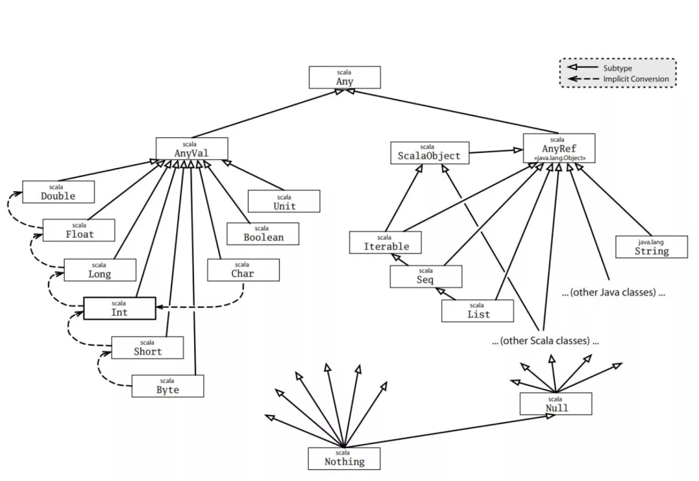

# Scala核心总结


## 简介

Scala作为一门面向对象的函数式编程语言，把面向对象编程与函数式编程结合起来，使得代码更简洁高效易于理解。这就是Scala得到青睐的初衷。


Scala作为一门JVM的语言，大数据生态的大部分组件都是Java语言开发的，而Scala可以与Java无缝混编，因此可以很好地融合到大数据生态圈。


## 主要内容

1. **变量和数据类型**
2. **函数式编程**

**（a）高阶函数**

**（b）匿名函数**

**（c）闭包**

**（d）函数柯里化**

3. **面向对象**

**（a）类与对象**

**（b）伴生对象**

**（c）特质**

1. **模式匹配**
2. **隐式转换**

## 变量和数据类型

#### 变量（var声明变量，val声明常量）

var 修饰的变量可改变

val 修饰的变量不可改变

但真的如此吗？

###### 对于以下的定义

```scala
class A(a: Int) {
  var value = a
}

class B(b: Int) {
  val value = new A(b)
}
```

###### 效果测试

```scala
val x = new B(1)

x = new B(1) // 错误，因为 x 为 val 修饰的，引用不可改变
x.value = new A(1) // 错误，因为 x.value 为 val 修饰的，引用不可改变

x.value.value = 1 // 正确，x.value.value 为var 修饰的，可以重新赋值
```

事实上，var 修饰的对象引用可以改变，val 修饰的则不可改变，但对象的状态却是可以改变的。

#### 可变与不可变的理解

我们知道scala中的List是不可变的，Map是可变和不可变的。观察下面的例子

###### var可变和List不可变的组合

```scala
var list = List("上","下")

list += "走"
```

###### 理解就是

var list指向的对象是 List("左","右")

后面修改list的指向，因为是可变的var修饰，list又可以指向新的 List("左","右","手")

如果是以下(会报错的)

```scala
val list = List("上","下")

list += "走"
```

###### val var与Map可变和不可变

```scala
var map = Map(
      "上" -> 1,
      "下" ->1,
    )
map+=("走"->1)
val map=scala.collection.mutable.Map(
  "上" -> 1,
  "下" ->1,
)

map+=("走"->1)
```

###### 理解

不可变的Map在添加元素的时候，原来的Map不变，生成一个新的Map来保存原来的map+添加的元素。

可变的Map在添加元素的时候，并不用新生成一个Map，而是直接将元素添加到原来的Map中。

val不可变的只是指针，跟对象map没有关系。

#### 数据类型




| 数据类型 | 描述                                                         |
| :------- | :----------------------------------------------------------- |
| Byte     | 8位有符号补码整数。数值区间为 -128 到 127                    |
| Short    | 16位有符号补码整数。数值区间为 -32768 到 32767               |
| Int      | 32位有符号补码整数。数值区间为 -2147483648 到 2147483647     |
| Long     | 64位有符号补码整数。数值区间为 -9223372036854775808 到 9223372036854775807 |
| Float    | 32 位, IEEE 754 标准的单精度浮点数                           |
| Double   | 64 位 IEEE 754 标准的双精度浮点数                            |
| Char     | 16位无符号Unicode字符, 区间值为 U+0000 到 U+FFFF             |
| String   | 字符序列                                                     |
| Boolean  | true或false                                                  |
| Unit     | 表示无值，和其他语言中void等同。用作不返回任何结果的方法的结果类型。Unit只有一个实例值，写成()。 |
| Null     | null 或空引用                                                |
| Nothing  | Nothing类型在Scala的类层级的最底端；它是任何其他类型的子类型。 |
| Any      | Any是所有其他类的超类                                        |
| AnyRef   | AnyRef类是Scala里所有引用类(reference class)的基类           |

------

## 函数式编程

#### 高阶函数

高阶函数是指使用其他函数作为参数、或者返回一个函数作为结果的函数。在Scala中函数是"一等公民"。

###### 简单例子

```scala
val list=List(1,2,3,4)

val function= (x:Int) => x*2

val value=list.map(function)
```

###### 方法为函数

```scala
def main(args: Array[String]): Unit = {
    val list=List(1,2,3,4)
    val value=list.map(function)
}

def function   (x:Int)=x*2
```

###### 返回函数的函数

```scala
def calculate(symbol:String): (String,String)=>String ={
    symbol match {
      case "拼接方式1" => (a:String,b:String)=> s"拼接方式1:$a , $b"
      case "拼接方式2" => (a:String,b:String)=> s"拼接方式2: $b , $a"
    }
  }
val function: (String, String) => String = calculate("拼接方式2")

println(function("大数据", "上上下下"))
```

#### 匿名函数

Scala 中定义匿名函数的语法很简单，箭头左边是参数列表，右边是函数体。

使用匿名函数后，我们的代码变得更简洁了。

```scala
var inc = (x:Int) => x+1

var x = inc(7)-1
```

也可无参数

```scala
var user = () => println("大数据上上下下") 
```

#### 闭包

闭包是一个函数，返回值依赖于声明在函数外部的一个或多个变量。

闭包通常来讲可以简单的认为是可以访问一个函数里面局部变量的另外一个函数。

简单理解就是：函数内部的变量不在其作用域时，仍然可以从外部进行访问。

```scala
val function= (x:Int) => x*2
```

闭包的实质就是代码与用到的非局部变量的混合

闭包 = 代码 + 用到的非局部变量

```scala
val fact=2
val function= (x:Int) => x*fact
```

#### 函数柯里化

柯里化指的是将原来接受两个参数的函数变成新的接受一个参数的函数的过程。新的函数返回一个以原有第二个参数为参数的函数。

###### 先定义一个简单的

```scala
def add(x:Int,y:Int)=x+y

使用

add(1,2)
```

###### 函数变形（这种方式就叫柯里化）

```scala
def add(x:Int)(y:Int) = x + y

使用

add(1)(2)
```

###### 实现过程

add(1)(2) 实际上是依次调用两个普通函数（非柯里化函数）

第一次调用使用一个参数 x，返回一个函数类型的值。

第二次使用参数y调用这个函数类型的值。

```scala
接收一个x为参数，返回一个匿名函数

接收一个Int型参数y，函数体为x+y。

def add(x:Int)=(y:Int)=>x+y

(1)
val result = add(1)  // result= (y:Int)=>1+y

(2)
val sum = result(2)

(3)
sum=3
```

------

## 面向对象

#### 类和对象

类是对象的抽象，而对象是类的具体实例。类是抽象的，不占用内存，而对象是具体的，占用存储空间。类是用于创建对象的蓝图，它是一个定义包括在特定类型的对象中的方法和变量的软件模板。

###### 类可以带有类参数

类参数可以直接在类的主体中使用。类参数同样可以使用var作前缀，还可以使用private、protected、override修饰。

scala编译器会收集类参数并创造出带同样的参数的类的主构造器。，并将类内部任何既不是字段也不是方法定义的代码编译至主构造器中。

```scala
class Test(val a: Int, val b: Int) {
    // 
}
```

###### 样例类

case class一般被翻译成样例类，它是一种特殊的类，能够被优化以用于模式匹配。

当一个类被声名为case class的时候。具有以下功能：

1. 构造器中的参数如果不被声明为var的话，它默认的是val类型的。
2. 自动创建伴生对象，同时在里面给我们实现子apply方法，使我们在使用的时候可以不直接使用new创建对象。
3. 伴生对象中同样会帮我们实现unapply方法，从而可以将case class应用于模式匹配。
4. 实现自己的toString、hashCode、copy、equals方法

```scala
case class person(
    name:String,
    age:Int
)
```

###### 对象与伴生对象

Scala单例对象是十分重要的，没有像在Java一样，有静态类、静态成员、静态方法，但是Scala提供了object对象，这个object对象类似于Java的静态类,它的成员、它的方法都默认是静态的。


定义单例对象并不代表定义了类，因此你不可以使用它来new对象。当单例对象与某个类共享同一个名称时，它就被称为这个类的伴生对象。

类和它的伴生对象必须定义在同一个源文件里。类被称为这个单例对象的伴生类。

类和它的伴生对象可以互相访问其私有成员。

```scala
object Test {
  private var name="大数据"

  def main(args: Array[String]): Unit = {
    val test = new Test()
    println(test.update_name())
  }
}

class Test{
  def update_name(): String ={
    Test.name="上上下下"
    Test.name
  }

}
```

###### 特质(trait)

scala trait相当于java 的接口，实际上它比接口还功能强大。与接口不同的是，它还可以定义属性和方法的实现。

一般情况下scala的类只能够继承单一父类，但是如果是trait 的话就可以继承多个，从结果来看就是实现了多重继承（关键字with）。其实scala trait更像java的抽象类。

```scala
object Test extends UserImp with AddressImp {
  override def getUserName(): String = ???

  override def getAddress(): String = ???
}

trait UserImp{
  def getUserName():String 
}

trait AddressImp{
  def getAddress():String
}
```

## 模式匹配

以java 的 switch 为例，java 的 switch 仅仅会做一些基本类型的匹配，然后执行一些动作，并且是没有返回值的。

而 scala 的 pattern matching match 则要强大得多，除了可以匹配数值，同时它还能匹配类型。

```scala
def calculate(symbol:String): (String,String)=>String ={
    symbol match {
      case "拼接方式1" => (a:String,b:String)=> s"拼接方式1:$a , $b"
      case "拼接方式2" => (a:String,b:String)=> s"拼接方式2: $b , $a"
    }
  }
```

###### 让我吃惊的是（就短短几行）

```scala
快排

def quickSort(list: List[Int]): List[Int] = list match {
    case Nil => Nil
    case List() => List()
    case head :: tail =>
      val (left, right) = tail.partition(_ < head)
      quickSort(left) ::: head :: quickSort(right)
  }
  
归并

def merge(left: List[Int], right: List[Int]): List[Int] = (left, right) match {
    case (Nil, _) => right
    case (_, Nil) => left
    case (x :: xTail, y :: yTail) =>
      if (x <= y) x :: merge(xTail, right)
      else y :: merge(left, yTail)
}
```

------

## 隐式转换

Scala提供的隐式转换和隐式参数功能，是非常有特色的功能。是Java等编程语言所没有的功能。它可以允许你手动指定，将某种类型的对象转换成其他类型的对象。通过这些功能，可以实现非常强大，而且特殊的功能。

#### 规则

（1）在使用隐式转换之前，需要用import把隐式转换引用到当前的作用域里或者就在作用域里定义隐式转换。

（2）隐式转换只能在无其他可用转换的前提下才能操作。如果在同一作用域里，对同一源类型定义一个以上的隐式转换函数，如果多种隐式转换函数都可以匹配，那么编译器将报错，所以在使用时请移除不必要的隐式定义。

#### 数据类型的隐式转换

String类型是不能自动转换为Int类型的，所以当给一个Int类型的变量或常量赋予String类型的值时编译器将报错。但是.....

```scala
  implicit def strToInt(str: String) = str.toInt
  def main(args: Array[String]): Unit = {
    val a:Int="100"
    
    print(a)
  }
```

#### 参数的隐式转换

所谓的隐式参数，指的是在函数或者方法中，定义一个用implicit修饰的参数，此时Scala会尝试找到一个指定类型的，用implicit修饰的对象，即隐式值，并注入参数。

```scala
object Test {
  private var name="大数据"
  implicit val test = new Test

  def getName(implicit test:Test): Unit ={
    println(test.update_name())
  }
  def main(args: Array[String]): Unit = {
    getName
  }
}

class Test{
  def update_name(): String ={
    Test.name="上上下下"
    Test.name
  }

}
```
