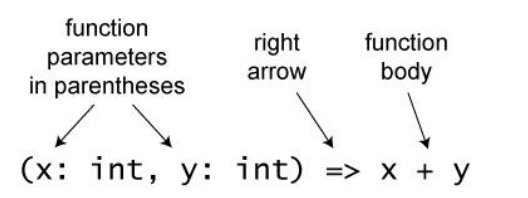
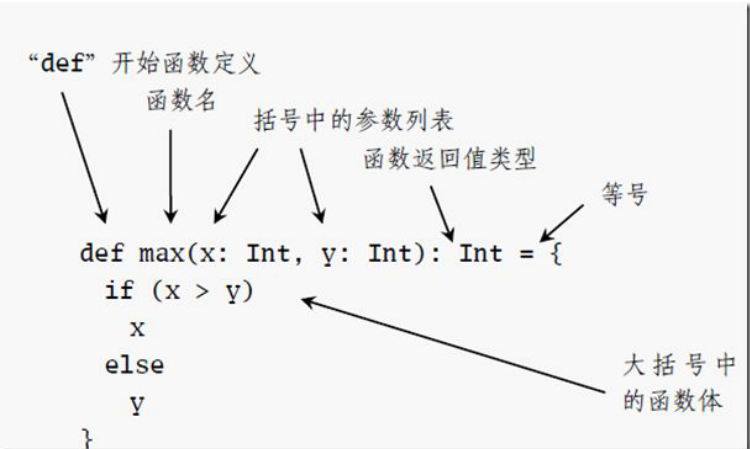

# Spark开发基础之Scala 利剑

## 序言

spark 是用 Scala 语言来写的，因此学习 Scala 成为 spark 的基础。当然如果使用其它语言也 是可以的。从性能上来讲，及代码简洁等方面，Scala 是比较好的一个选择。 


 Scala 是函数式编程，继承了其它语言的很多特点，并且发展了自己特性。因此下面所涉及 的内容，需要熟悉一门语言，特别是 Java 语言。


什么是函数式编程？ 在 Scala 编程中认为：函数式编程有两种指导理念： 


第一种理念：函数式头等值。也就是函数式有值的，并且其可以作为参数来传递。匿名函 数，可以随意的插入代码中。这个与传统的语言中的函数是不同的，传统语言函数可以理 解为一个操作，或则功能。作为参数传递，会让传统程序员难以理解。但是在 Scala 中是 可以的。 


第二种理念： 程序的操作应该把输入值映射为输出值而不是修改原先数据。比如我们操作一个字符串， 当我们执行 replace 操作后，形成的是一个新的字符串。而不是在原先的字符串的基础上修 改而成。这有点绕的。打个比方，你们家房子旧了，你想翻新。不是对旧房子改造，而是 另外新盖一个房子。 


第二种理念另外的解释：方法不应有任何副作用。方法与环境的唯一交流方式是获取参数 和返回结果。同样也是以字符串为例，Java 的 String， replace 操作后，会返回一个新的字 符串，这就是返回的结果。这里面参数是字符串本身，以及替换和被替换的字符。


## Spark 开发基础之从 Scala 符号入门 Scala

1.Scala 中有哪些常见符号？ 

2.本文讲了哪些符号？ 

3.你对符号的理解是什么？

 4.<-,->,=>,Int=,_ 它们含义是什么？用在什么地方？


spark 是使用 Scala 语言开发的，由于语言是相通的，所以对于传统 程序员【Java，.net，c 等】，能看懂 Scala 程序是没有问题的。但是当看到它的时候，却傻眼 了。那么多符号，左箭头，右箭头，下划线等等。


### Scala 符号 

#### **第一个符号：<- **：

这个符号	**<-**	用在什么地方，比如用于 for 循环， <-用于遍历集合对象(可遍历对象)B，在每次遍历的过程中，生成一个新的对象 A，这个 A 是 val，而不是 var，然后对循环体中对 A 进行处理，<-在 Scala 中称为 generator。 

不需要显式的指定 A 的类型，因为 Scala 使用自动推导的方式根据 B 的元素类型得出 A 的类型 

#### **示例 1：** 

```scala
for (arg <- args)
println(arg)
```

解析：

含义： 循环 args，打印出里面的元素


#### **示例 2：**

```scala
for (i <- 0 to 2)
print(greetStrings(i))
```

含义：是遍历一个数组

```scala
val A= new Array[String](3)
A(0) = "Hello"
A(1) = ", "
A(2) = "world!\n"

for (i <- 0 to 2)
print(A(i))
```

这个符号其实很碍眼，导致你可能根本弄不清楚为什么要搞这么个符号。而且很可能被我们误认为是一个 负号。这样就增大了阅读难度。但是如何习惯了，其实 Scala 还是不错的，间接而且思想跟别的 语言有很大的区别。 


这里出现的英文 to，也是比较奇怪的，看到过变量和函数使用英文，但是在 for 语句中使用英文，这 也太随意了，不知道的以为是在做阅读理解。其实这里的 to，是 0 的一个方法，全写。

```scala
for (i <- 0.to(2))
```

#### **第二个符号:  ->** 

**->:**	方法是所有 Scala 对象都有的方法，比如 A->B,->方法调用的结果是返回一个二元的元组(A,B) 这个符号用于什么地方，比如 map 映射 Map(映射)是一种可迭代的键值对（key/value）结构。

```scala
// Map 键值对演示
val colors = Map("red" -> "#FF0000", "azure" -> "#F0FFFF")
```

上面是定义 map，那么 map 该如何操作： Scala Map 有三个基本操作：

| 方法 |           描述           |
| :--: | :----------------------: |
| keys |  返回 Map 所有的键(key)  |
| keys | 返回 Map 所有的值(value) |
| keys |  在 Map 为空时返回 true  |

#### **实例:** 

以下实例演示了以上三个方法的基本应用：

```scala
object Test {
	def main(args: Array[String]) {
		val colors = Map("red" -> "#FF0000",
						"azure" -> "#F0FFFF",
						"peru" -> "#CD853F")
		val nums: Map[Int, Int] = Map()
        
		println( "colors 中的键为 : " + colors.keys )
		println( "colors 中的值为 : " + colors.values )
		println( "检测 colors 是否为空 : " + colors.isEmpty )
		println( "检测 nums 是否为空 : " + nums.isEmpty )
	}
}
```

输出结果为：

```scala
$ scalac Test.scala
$ scala Test
colors 中的键为 : Set(red, azure, peru)
colors 中的值为 : MapLike(#FF0000, #F0FFFF, #CD853F)
检测 colors 是否为空 : false
检测 nums 是否为空 : true
```

#### **map 映射与 map 函数的区别**:

同时有一个小小的不同：

#### **map 函数：** 

函数式编程都有一个 map 函数，map 函数就像一个加工厂，传入一个函数，利用这个函数将集合里的每 一个元素处理并将结果返回。

 **aList.map(processFunc)**//就这么简单，aList 中的每一个元素将会变成 processFunc 的返回值。 这个 processFunc 一般都是匿名函数，因为用过一次后就用不到了。

```scala
val l = List(1,2,3)
var ll = l.map(x => x*x)//返回 ll=(1,4,9)
```

#### **第三个符号：=>** 

这些符号说大于不是大于，说等号不是等号。它代表什么意思.我们来看下面内容：




左边像参数传递，右箭头右侧像一个加法运算。

而这个其实是 Scala 的匿名函数。 左边是参数，右边是函数体。在我们印象中，函数体一般都是在大括号中，而这里真让我们难以理解。 


总之：方法参数=> 方法体这时候我们需要明白这是匿名函数这就是 Scala 不走寻常路，而且其它的很多地方，都是这个样子。

比如下面的函数定义等等。

```scala
val l = List(1,2,3)
var ll = l.map(x => x*x)//返回 ll=(1,4,9)
```

map 里面的 x => x*x 就是一个匿名函数。 


#### **为什么要产生匿名函数?**

因为匿名函数基本上使用 一次，后面就用不到了。 对于右箭头，还有一个地方用到就是 匹配模式语句 case 与后面表达式的分隔符:

```scala
// 例如
a match {
case 1 => "match 1"
case _ => "match _"
}
```

**其实无论它是什么符号，它只起到分割的作用**


#### **第四个符号：int=** 

int=，变量后面是一个等号是非常常见的，比如 a=1,等，变量等于（=）这个确实难以理解。 下面来看下 Scala 是函数的定义，就能明白了，int=的含义




scala 中函数的定义是使用关键字 def,然后函数名，括号中参数的定义，更是与传统语言反着来。


Scala 是 参数在前，类型在后，以冒号(:)作为分隔符。

返回值则是写在后面，函数的定义与函数体分隔符则是使用 等号分割。

单从函数的定义，就能看出 Scala 打破了传统的函数定义，除了函数定义，其它还有很多 地方，都反映了 Scala 思想，没有以前 Java，c 等那么严格。Scala 更像是一个思想的自由者，解放者， 随心所欲，不管 Java，.net，c 等如何搞的，它是自成一家。


比如变量定义，for 循环，case 等都是做了很大的改变。比如：

```scala
for(i <- 1 to 5; j <- 1 to 5)

// for 嵌套，这是我们所熟悉的两层 for 循环。
```

```scala
for（i=1;i++;i<=5）
{ for(j=1;j++;j<=5)
	{}
}
```

**比如 for 条件过滤。**

```scala
for（i=1;i++;i<=5）
{ for(j=1;j++;j<=5)
	{
	if (!(i==3&&j==3)))
		{
			if(i!=2 || j!=2)
				{
				}
		}
	}
}

```

**使用Scala 进行表达：**

```scala
for(i<- 1 to 5; j <- 1 to i;if (!(i==3&&j==3)); if(i!=2 || j!=2)){
}

```

#### **深入了解**

比如： 去掉了函数体定义时的“=”的函数一般称之为“过程”，过程函数的结果类型一定是 Unit。因此，有时定义函数时忘记加等号，结果常常是出乎你的意料的。 如:没有返回值的函数的默认返回值是 Unit。 

```scala
def f(a:Int) {
    println(a) 
} 
println(f(1))  
```

输出结果：

```scala
 1 ()
```


#### **第五个“_”** 

在 scala 中，符号**“_”**相当于 java 中的通配符**“ * ”**。

这个有很多的含义 :

*1、作为“通配符”，类似 Java 中的*。如 import scala.math._*


*2、:\_作为一个整体，告诉编译器你希望将某个参数当作参数序列处理！例如 val s = sum(1 to 5:\_)就 是将 1 to 5 当作参数序列处理。*


*3、指代一个集合中的每个元素。例如我们要在一个 Array a 中筛出偶数，并乘以 2，可以用以下办法： a.filter(%2==0).map(2*\_)。 又如要对缓冲数组 ArrayBuffer b 排序，可以这样： val bSorted = b.sorted(*


*4、在元组中，可以用方法_1, _2, _3 访问组员。如 a.\_2。其中句点可以用空格替代。*


*5、使用模式匹配可以用来获取元组的组员，例如 val (first, second, third) = t 但如果不是所有的部件都需要，那么可以在不需要的部件位置上使用_。比如上一例中 val (first, second, _) = t*


*6、还有一点，下划线_代表的是某一类型的默认值。 对于 Int 来说，它是 0。 对于 Double 来说，它是 0.0 对于引用类型，它是 null。*


#### **:::运算符** 

**:::(三个冒号)表示 List 的连接操作，比如：**

```scala
val a = List(1, 2)
val b = List(3, 4)
val c = a ::: b
```

其中 a,b 保持不变，a 和 b 连接产生一个新表 List(1,2,3,4),而不是在 a 上面做 add 操作。


Scala 中的 List 不同于 Java 的 List，Java 声明 final List javaList，表示 javaList 一旦初始化，那么不能再 为它赋值，但是它其中的元素可以变化，


#### **::运算符** 

**::(两个冒号)表示普通元素与 List 的连接操作，比如：**

```scala
val a = 1
val b = List(3, 4)
val c = 1 :: b
```

则 c 的结果是 List(1,3,4),需要注意的是，1:: b 操作，::是右侧对象的方法，即它是 b 对象的方法，而::左 侧的运算数是::方法的参数，所以 1::b 的含义是 b.::(1)


#### 从关键字、函数入门 Scala

问题导读 

* 1.apply 的作用是什么？ 

* 2.yield 什么情况下使用？ 

* 3.partition 如何使用？


**Scala 有 39 个关键字：**

```scala
package, import, class, object, trait, extends, with, type, 

forSome, private, protected, abstract, sealed, final, implicit, 

lazy, override, try, catch, finally, throw, if, else, match, 

case, do, while, for, return, yield, def, val, var, this, super
, new, true, false, null
函数当然也很多，不在列举
```

#### **with 用法** 

复合类型的定义，需要使用 with。 T1with T2 with T3 …，这种形式的类型称为复合类型(compoundtype)或者也叫交集类型(intersection type)。

*如下面*

```scala
// 定义特征(CompoundType1、CompoundType2) trait CompoundType1;
trait CompoundType2;
class CompoundType extends CompoundType1 with CompoundType2;

object CompoundType {
    
// 定义方法 compoundType，该方法需要传递即参数满足 CompoundType1 类型且
//又要满 CompoundType2 类型的，复合类型。
	def compoundType(x:CompoundType1 with CompoundType2) = 		
    	{
            println("Compound Type in global method!!!")}
    
def main(args: Array[String]): Unit = {
    
// new 出即符合 CompoundType1 类切也符合 CompoundType2 类型，执行结果：
Compound Type in global method!!!
	compoundType(new CompoundType1 with CompoundType2)
    
// object 混入代码中，将 object 对象当参数传递方法，执行结果：
Compound Type in global method!!!
    object compoundTypeObject extends CompoundType1 with CompoundType2
compoundType(compoundTypeObject);
    
// 使用 type 关键字，起别名
type compoundTypeAlias = CompoundType1 with CompoundType2;
    
// 定义函数，参数使用别名 compoundTypeAlias 类型
def compoundTypeLocal(x:compoundTypeAlias) = println("Compound Type
in local method!!!");
    
// 别名的函数调用，执行结果:Compound Type in local method!!!
var compoundTypeClass = new CompoundType();
    
compoundTypeLocal(compoundTypeClass);
// 定义复合类型：在 CompoundType1 并且 CompoundType2 类，同时必须实现在 init 方法。
type Scala = CompoundType1 with CompoundType2 {def init():Unit}
	}
}

```

#### **trait 用法** 

这里的 trait 字面意思是特质或者特征，这个词翻译成特征比较合适。它的意义和 java，c#中接口很类似。 


但是 trait 支持部分实现，也就是说可以在 scala 的 trait 中可以实现部分方法。 


trait 的使用方法就是这样子了，它很强大，抽象类能做的事情，trait 都可以做。它的长处在于可以多继承。 


trait 和抽象类的区别在于抽象类是对一个继承链的，类和类之前确实有父子类的继承关系，而 trait 则如 其名字，表示一种特征，可以多继承。

```scala
abstract class Plant {
	def photosynthesis = println("Oh, the sunlight!")
}

class Rose extends Plant {
	def smell = println("Good!")
	def makePeopleHappy = println("People like me")
}

class Ruderal extends Plant {
	def grow = println("I take up all the space!")
}

abstract class Animal {
	def move = println("I can move!")
}

class Dog extends Animal {
	def bark = println("Woof!")
	def makePeopleHappy = println("People like me")
}

class Snake extends Animal {
	def bite = println("I am poisonous!")
}
```

```scala
植物家族有玫瑰和杂草。
动物家族有狗和毒蛇。

仔细观察可以发现，玫瑰和狗有一个共同的行为，它们都可以取悦人类，这个行为是用完全一样的代码实
现的。

如何把 Rose 和 Dog 中的重复代码消除掉呢？有一种潜在的解决方案： 把 makePeopleHappy 提取到一个
类中去，让植物和动物都继承自它。
这么做虽然消除了重复代码但有两个明显的缺点：
1. 植物和动物继承自同一个类，不太合理
2. 杂草和毒蛇也具有了取悦于人的能力，也不太合理
这时我们就可以使用 trait，它没有上面提到的两个缺点。
```

```scala
trait PeoplePleaser {
	def makePeopleHappy = println("People like me")
}

class Rose extends Plant with PeoplePleaser {
	def smell = println("Good!")
}

class Dog extends Animal with PeoplePleaser {
	def bark = println("Woof!")
}
```

定义一个 trait，把 makePeopleHappy 置于其中，让 Rose 和 Dog 都 with 这个 trait。然后就可以写这 样的代码来调用它们了：

```scala
new Rose().makePeopleHappy
new Dog().makePeopleHappy
```

解决了重复代码的问题，而且没有触及已存在的继承关系。


看看 trait 的实现机制吧，我们开始反编译！

```scala
public abstract interface PeoplePleaser
{
	public abstract void makePeopleHappy();
}

public abstract class PeoplePleaser$class
{
	public static void makePeopleHappy(PeoplePleaser $this)
	{
		Predef..MODULE$.println("People like me");
	}
public static void $init$(PeoplePleaser $this)
	{
	}
}

public class Rose extends Plant
	implements PeoplePleaser
{
	public void makePeopleHappy()
	{
		PeoplePleaser$class.makePeopleHappy(this);
	}
public void smell() { Predef..MODULE$.println("Good!"); }
public Rose()
	{
		PeoplePleaser.class.$init$(this);
	}
}

public class Dog extends Animal
	implements PeoplePleaser
	{
	public void makePeopleHappy()
	{
		PeoplePleaser$class.makePeopleHappy(this);
	}
public void bark() { Predef..MODULE$.println("Woof!"); }
        
public Dog()
	{
		PeoplePleaser.class.$init$(this);
	}
}
```

*PeoplePleaser 被编译成了一个接口加一个抽象类。Rose 和 Dog 实现这个接口，并通过调用 抽象类中的静态方法来实现了 makePeopleHappy。*


*有趣的一点是 Rose 和 Dog 在调用静态方法时都把 this 传了进去，为什么呢？我们把原来的代码改成这 样来看：*

```scala
trait PeoplePleaser {
	val moreMessage = ""
	def makePeopleHappy = println("People like me. " + moreMessage)
}

class Rose extends Plant with PeoplePleaser {
	override val moreMessage = "Because I smell nice."
	def smell = println("Good!")
}

class Dog extends Animal with PeoplePleaser {
	override val moreMessage = "Because I fetch balls."
	def bark = println("Woof!")
}
```

*给 makePeopleHappy 加上一段额外的信息。 现在再次反编译。*

```scala
public abstract interface PeoplePleaser
{
	public abstract void
objsets$PeoplePleaser$_setter_$moreMessage_$eq(String paramString);
	public abstract String moreMessage();
	public abstract void makePeopleHappy();
}

public abstract class PeoplePleaser$class
{
	public static void makePeopleHappy(PeoplePleaser $this)
	{
		Predef..MODULE$.println(new StringBuilder()
		.append("People like me. ")
		.append($this.moreMessage()).toString());
	}
    
public static void $init$(PeoplePleaser $this)
{
	$this.objsets$PeoplePleaser$_setter_$moreMessage_$eq("");
}
}

public class Rose extends Plant
	implements PeoplePleaser
{
	private final String moreMessage;
	public void objsets$PeoplePleaser$_setter_$moreMessage_$eq(String x$1)
	{
	}
	public void makePeopleHappy()
	{
		PeoplePleaser$class.makePeopleHappy(this);
	}
    
public String moreMessage() { return this.moreMessage; }
public void smell() {
	Predef..MODULE$.println("Good!");
}
    
	public Rose()
	{
		PeoplePleaser.class.$init$(this);
		this.moreMessage = "Because I smell nice.";
	}
}
public class Dog extends Animal
	implements PeoplePleaser
{
	private final String moreMessage;
	public void objsets$PeoplePleaser$_setter_$moreMessage_$eq(String x$1)
	{
	}
    
	public void makePeopleHappy()
	{
		PeoplePleaser$class.makePeopleHappy(this);
	}
    
public String moreMessage() { return this.moreMessage; }
	public void bark() {
		Predef..MODULE$.println("Woof!");
	}
    
	public Dog()
	{
	PeoplePleaser.class.$init$(this);
	this.moreMessage = "Because I fetch balls.";
	}
}
```

*抽象类中的静态方法可能会依赖于各个实例不同的状态，所以需要把 this 传递进去。 这 样才能够给 makePeopleHappy 加上一段额外的信息。*


#### **super 用法** 

属性只能是本类的属性，方法可以是父类的方法。也就是调用父类用 super

super： 1、super.方法 2、super(参数 1，参数 2，……)

```scala
// 1、新建父类：AnimalInfo.Java
public class AnimalInfo {
private String color;
private String type;
    
public AnimalInfo(String color, String type) {
	this.color = color;
	this.type = type;
	System.out.println("父类的有参构造方法结果：打印颜色:"+color+";类型："+type);
}
    
/**
* 重载:要求返回值类型、方法名称一致而参数列表必须不同，访问修饰符不限制
*
*/
public void eat(){
	System.out.println("父类的吃方法！");
}
protected void eat(String width){}
	void eat(String width,String height){}
/*动物叫方法*/
public void song(){
	System.out.println("父类的叫方法！");
	}
}


// 2、新建子类：DogInfo.java
public class DogInfo extends AnimalInfo {
	String name;
    
/**
*覆盖：要求方法名称必须一致，访问修饰符限制必须一致或者范围更宽
*/

    /*
    如果构造方法不添加访问修饰符，那么就是默认(default)
    */
    
DogInfo() {
	this("狗二");
	System.out.println("子类无参构造方法");
	super.eat();//调用父类方法
	this.eat();
}
/**覆盖构造方法，覆盖只发生在构造方法中*/
DogInfo(String input) {
	super("blue","dog");//调用父类构造方法
	// super();
	name = input;
}
private DogInfo(String out,String in){ }
	DogInfo(String out,String in,String error){ }
}
```

#### **type 用法：** 

scala 中也可以定义类型成员,跟 class,trait,object 类似，类型成员以关键字 type 声明。通过使用类型成员， 可以为类型定义别名。 type 相当于声明一个类型别名：

```scala
scala> type S = String
defined type alias S
```

*把 String 类型用 S 代替，通常 type 用于声明某种复杂类型，或用于定义一个抽象类型。 场景 1 用于声明一些复杂类型，比如下面声明一个结构类型*

```scala
scala> type T = Serializable {
| 			type X
| 			def foo():Unit
|		}
defined type alias T
```

*这个结构类型内部也允许通过 type 来定义类型，这里对 X 没有赋值表示 X 是一个抽象类型，需要子类型 在实现时提供 X 具体的类型。下面是一个 T 类型的具体实例：*

```scala
scala> object A extends Serializable{ type X=String; 
                                     def foo(){} 
                                    }
scala> typeOf[A.type] <:< typeOf[T]
res19: Boolean = true
```

场景 2 用于抽象类型:

```scala
scala> trait A { type T ; def foo(i:T) = print(i) }
scala> class B extends A { type T = Int }
scala> val b = new B
scala> b.foo(200)
200
scala> class C extends A { type T = String }
scala> val c = new C
scala> c.foo("hello")
hello
```

#### **forSome 用法：**

forSome 是 Scala 的一个关键字，不是函数。 

forSome 用于下面的场景： 我们想对一些对象做一些操作，但是不关心对象内部的具体类型。或者说我们指向知道对象可以进行哪些 操作，但是不关心它是什么以及可以进行哪些其他操作。


比如我们想取 List 的第一个元素或者 List 的长度， 但是不关心 List 是什么类型。因此我们需要知道该对象可以进行获取长度的操作，但是不关心其元素是什么类型： 


即 Existential type 做到了隐藏我们不关心的对象结构，同时暴露我们想要进行的操作，恰如其分地对外 暴露协议。

```scala
def printFirst(x : Array[T] forSome {type T}) = println(x(0))
```

也可以使用泛型：

```scala
def printFirst[T](x : Array[T]) = println(x(0))
```

但是有些情况下我们可能不想使用方法泛型。 来自 scala 的术语表：

```scala
An existential type includes references to type variables that are unknown.
For example, Array[T] forSome { type T } is an existential type. It is an
array of T, where T is some completely unknown type. All that is assumed
about T is that it exists at all. This assumption is weak, but it means at
least that an Array[T] forSome { type T } is indeed an array and not a banana.
也就是说 forSome 只是表面类型存在，至于它是什么类型，不关心，Java 中我们这样定义泛型：
```

```scala
class MyClass<?> {
...
}
```

*也就是不关心泛型的类型，任何类型都可以。 另外可以指定某些类型,类似于 Java 中的*

```scala
def addToFirst(x : Array[T] forSome {type T <: Integer}) = x(0) + 1
class MyClass<? extends Integer> {
	...
}
```

一种更简洁的写法：

```scala
def addToFirst(x: Array[_ <: Integer ]) = x(0) + 1
```

对于下面两个例子：

```scala
Array[T] forSome { type T; }
Array[T forSome { type T; }]
```

*它们之间的区别非常大，第一个代表元素类型为任意类型的 Array，第二个代表 Array[Any]。即：T forSome {type T;} 等同于 Any。*

```scala
Type Any is equivalent to a for_some { type a; }
```

再看：

```scala
Map[Class[T forSome { type T}], String] // Map[Class[Any],String]
Map[Class[T] forSome { type T}, String] // key 为任意类型的 Class
Map[Class[T], String] forSome { type T}
```

使用通配符：

```scala
Array[_] // Array[T] forSome {type T}
Map[Class[_] , String] //Map[Class[T] ,String] forSome {type T}
```

#### lazy 用法：

Scala 中使用关键字 lazy 来定义惰性变量，实现延迟加载(懒加载)。 


惰性变量只能是不可变变量，并且只有在调用惰性变量时，才会去实例化这个变量。 


在 Java 中，要实现延迟加载(懒加载)，需要自己手动实现。一般的做法是这样的:

```scala
public class LazyDemo {
	private String property;
public String getProperty() {
	if (property == null) {//如果没有初始化过，那么进行初始化
		property = initProperty();
	}
	return property;
}
	private String initProperty() {
	return "property";
	}
}
```

*比如常用的单例模式懒汉式实现时就使用了上面类似的思路实现。 而在 Scala 中对延迟加载这一特性提供了语法级别的支持:*

```scala
lazy val property = initProperty()
```

使用 lazy 关键字修饰变量后，只有在使用该变量时，才会调用其实例化方法。


也就是说在定义 property=initProperty()时并不会调用 initProperty()方法，只有在后面的代码中使用变量 property 时才会 调用 initProperty()方法。 


如果不使用 lazy 关键字对变量修饰，那么变量 property 是立即实例化的:

```scala
object LazyOps {
	def init(): String = {
		println("call init()")
		return ""
	}
	def main(args: Array[String]) {
		val property = init();//没有使用 lazy 修饰
		println("after init()")
		println(property)
	}
}
```

上面的 property 没有使用 lazy 关键字进行修饰，所以 property 是立即实例化的，如果观察程序的输出:

```scala
call init()
after init()
```

可以发现，property 声明时，立即进行实例化,调用了`init()“实例化方法 而如果使用 lazy 关键字进行修饰：

```scala
object LazyOps {
	def init(): String = {
		println("call init()")
		return ""
	}
	def main(args: Array[String]) {
		lazy val property = init();//使用 lazy 修饰
		println("after init()")
		println(property)
		println(property)
	}
}
```

观察输出:

```scala
after init()
call init()
```

在声明 property 时，并没有立即调用实例化方法 intit(),而是在使用 property 时，才会调用实例化方法,并 且无论缩少次调用，实例化方法只会执行一次。


 与 Java 相比起来，实现懒加载确实比较方便了。


那么 Scala 是如何实现这个语法糖的呢？反编译看下 Scala 生成的 class：

```scala
private final String property$lzycompute$1(ObjectRef property$lzy$1,
VolatileByteRef bitmap$0$1)
	{
		synchronized (this)//加锁
	{
		if ((byte)(bitmap$0$1.elem & 0x1) == 0)//如果属性不为 null
		{//那么进行初始化
			property$lzy$1.elem = init();bitmap$0$1.elem = ((byte)(bitmap$0$1.elem
			| 0x1));
		}
		return (String)property$lzy$1.elem;
	}
}
```

Scala 同样使用了 Java 中常用的懒加载的方式自动帮助实现了延迟加载，并且还加锁避免多个线程同 时调用初始化方法可能导致的不一致问题。


总结：

对于这样一个表达式： lazy val t:T = expr 无论 expr 是什么东西，字面量也好，方法调用也好。


Scala 的 编译器都会把这个 expr 包在一个方法中，并且生成一个 flag 来决定只在 t 第一次被访问时才调用该方法。


#### **apply 用法：**

Scala 中的 apply 方法有着不同的含义, 对于函数来说该方法意味着调用 function 本身, 以下说明摘自:

```scala
Programming in Scala, 3rd Edition
Every function value is an instance of some class that extends one of several FunctionN traits in
package scala, such as Function0 for functions with no parameters, Function1 for functions with one
parameter, and so on. Each FunctionN trait has an apply method used to invoke the function.
```

在 Scala 语言中, 函数也是对象, 每一个对象都是 scala.FunctionN(1-22)的实例, 其中 N 是函数参数的数量, 例如定义一个函数并复制给一个变量:

```scala
scala> val f = (x: Int) => x + 1
f: Int => Int = <function1>
```

这里定义了一个接收一个整型变量作为参数的函数, 函数的功能是返回输入参数加 1. 可以看到 REPL 返回 参数的 toString 方法 即  . 那么如果我们有一个指向函数对象的引用, 我们该如何调用这个函 数呢? 


答案是通过 FunctionN 的 apply 方法, 即 FunctionN.apply() , 因此调用函数对象的方法如下:

```scala
scala> f.apply(3)
res2: Int = 4
```

但是如果每次调用方法对象都要通过 FunctionN.apply(x, y...), 就会略显啰嗦, Scala 提供一种模仿函数调 用的格式来调用函数对象

```scala
scala> f(3)
res3: Int = 4
```

**应用场景** 

工厂方法 

在 Scala 中可以通过 List.apply(1, 2, 3) 创建一个 List 对象, apply 方法定义在 List 类的伴生对象中, 像之前 所说的, 我们可以简化 apply 方法, 直接通过 List(1, 2, 3) 创建一个 List 实例. 


#### **集合类** 

在 Scala 集合一文中提到过 Iterator 迭代器的几个子 trait 包括 Seq, Set, Map 都继承 PartialFunction 并实 现了 apply 方法, 不同的是实现的方式不一样, 我们可以通过下面的例子来说明 apply 的应用

```scala
scala> Seq(1, 2, 3).apply(1) // 检索
res6: Int = 2
scala> Set(1, 2, 3).apply(2) // 判断是否存在
res7: Boolean = true
scala> Map("china" -> "beijing", "US" ->"Washington").apply("US") // 根据键查找值
res8: String = Washington
scala> Set(1, 2, 3)(2)
res9: Boolean = true
scala> Set(1, 2, 3)(2)
res10: Boolean = true
scala> Map("china" -> "beijing", "US" -> "Washington")("US")
res11: String = Washington
```

#### **yield 用法**

 scala 里面的 for...yield 循环： 

下面那段话的意义就是，for 循环中的 yield 会把当前的元素记下来，保存在集合中，循环结束后将返回该集合。Scala 中 for 循环是有返回值的。


如果被循环的是 Map，返回的就是 Map，被循环的是 List，返 回的就是 List，以此类推。

```scala
@Test def forYieldTest = {
    val s = for (x <- 1 to 25) yield 1 * x
    print(s)
}
```

返回：Vector(1, 2, 3, 4, 5, 6, 7, 8, 9, 10, 11, 12, 13, 14, 15, 16, 17, 18, 19, 20, 21, 22, 23, 24, 25) 还可以增加表达式，例如 if：

```scala
@Test def forYiledTest = {
    val s = for (x <- 1 to 25 if x > 5) yiled 1 * x
    print(s)
}
```

返回： 

Vector(6, 7, 8, 9, 10, 11, 12, 13, 14, 15, 16, 17, 18, 19, 20, 21, 22, 23, 24, 25) 

每循环一次，会自动添加一个 yield 的 1*x 表达式算出来的值，循环结束后，会返回所有 yield 的值组成 的集合。返回的集合类型和遍历的类型是一样的。


#### **map 用法** 

scala 对 map 的操作：

```scala
@Test def mapTest = {
    var map = Map[Int, String](1 -> "str1", 2 -> "str2")
    map += (3 -> "str3")
    map.foreach {
        case (k, v) => {
            print(k, "---->" + y)
        }
    }
}
```

打印：

```scala
1---->str1
2---->str2
3---->str3
```

#### **partition 用法** 

partition 根据断言函数的返回值对列表进行拆分。

```scala
@Test def partitonTest = {
    val numbers = List(1, 2, 3, 4, 5, 6, 7, 8, 9, 10)
    val list2 = numbers.partion(_ % 2 == 0)
    println(list2._1)
    println(list2._2)
}
```

输出：

```scala
List(2, 4, 6, 8, 10)
List(1, 3, 5, 7, 9)
```

*经过 partition 之后，会返回元组形式。*

#### **filter 用法** 

有时候需要对一个集合进行判断，比如，从 1 到 10 里面去查找 5 这个元素：

```scala
@Test def filterTest = {
    var retInt = List[Int]()
    val lists = List[Int](0, 1, 2, 3, 4, 5, 6, 7, 8, 9, 10)
    lists.foreach(a => {
        if (a == 5){
            retInt = a
        }
    })
    println(retInt(0))
}
```

*以上代码可以改成这样：*

```scala
@Test def filterTest = {
    var retInt = List[Int]()
    val lists = List[Int](0, 1, 2, 3, 4, 5, 6, 7, 8, 9, 10)
    /*lists.foreach(a => {
        if (a == 5){
            retInt = a
        }
    })*/
    retInt = lists.filter(a => a== 5)
    println(retInt(0))
}
```

以上的：

```scala
reInt = lists.filter(a => a == 5)
for (a <- lists if a == 5){
    println(a)
}
```

#### **update 用法** 

在 Scala 中，名字叫做 update 的方法是有特殊作用的。 比如：

```scala
val scores = new scala.collection.mutable.HashMap[String, Int]
scores("Bob") = 100
val bobsScore = scores("Bob")
```

以上三行代码，创建了一个可变的 map 来存储得分情况，然后我们记录了 Bob 的得分是 100 分，最 后我们又把 Bob 的分数取出来了。 


这三行代码看似平淡无奇，实则暗藏了一点点玄机。 


第二行实际是调用了 HashMap 的 update 方法。 


第三行实际是调用了 HashMap 的 apply 方法。 我们可以把上面的代码改写成下面的等价形式：

```scala
val scores = new scala.collection.mutable.HashMap[String, Int]
scores.update("Bob", 100)
val bobsScore = scores.apply("Bob”)

```

虽然等价，但是可读性却降低了一些。 

apply 方法我们之前讲过，就不再赘述。 

update 方法也不太复杂，它的规则就是:

```scala
x(y) = z
```

这样的代码会被编译为：

```scala
x.update(y, z)
```

修改某个人地址的一段代码：

```scala
class AddressChanger {
    def update(name: String, age: Int, newAddress: String) = {
		println(s"changing address of $name, whose age is $age to $newAddress")
	//actually change the address
	}
}
```

调用:

```scala
val changer = new AddressChanger()
changer.update("xiao ming", 23, "beijing")
```

也可以这样来调用

```scala
val addressOf = new AddressChanger()
addressOf(name = "xiao ming", age = 23) = "beijing"
```

代码是等价的.

比较一下，前一种用法显得中规中矩，没什么特别好的，也没啥特大的毛病。

 

可是后一种用法就不同了，读起来很通顺，有读英语语句的感觉：


把名字叫做小明，年龄 23 岁的人的地 址改为北京。 


如果再给 AddressChanger 加上一个 apply 方法，我们还可以写这样的代码：

```scala
1 val currentAddress = addressOf(name = "xiao ming", age = 23)
```

这样，读取和更新的代码都看起来非常自然。

```scala
val currentAddress = addressOf(name = "xiao ming", age = 23)
addressOf(name = "xiao ming", age = 23) = "beijing"
```

 addressOf(name = “xiao ming”, age = 23)可以看做一个整体，它就如同一个可读可写的属性。 


把它放到赋值语句的右侧，就能取到小明的当前住址。 


把它放到赋值语句的左侧，就能修改小明的住址。 


apply 和 update 都是蛮简单的语言特性，但是加以合适的应用，却能得到可读性极强的代码。


