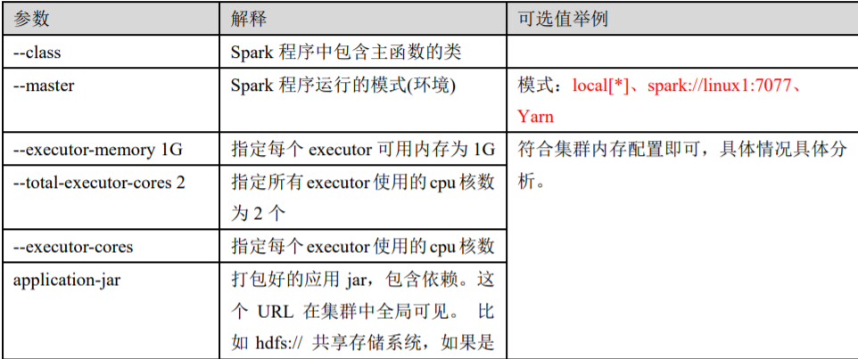
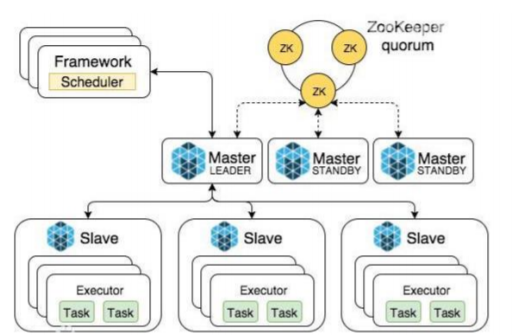
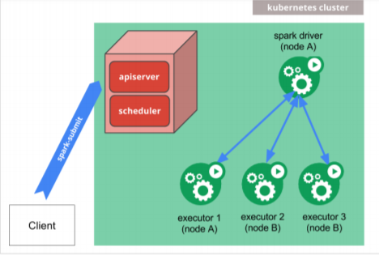

## Local 模式
所谓的 Local 模式，就是不需要其他任何节点资源就可以在本地执行 Spark 代码的环境。

## 解压缩文件 

将 spark-3.0.0-bin-hadoop3.2.tgz 文件上传到 Linux 并解压缩，放置在指定位置，路径中 不要包含中文或空格。

```sh
tar -zxvf spark-3.0.0-bin-hadoop3.2.tgz -C /opt/module
cd /opt/module
mv spark-3.0.0-bin-hadoop3.2 spark-local
```

## 启动 Local 环境 

1) 进入解压缩后的路径，执行如下指令

```sh
bin/spark-shell
```


2) 启动成功后，可以输入网址进行 Web UI 监控页面访问http://虚拟机地址:4040

## 命令行工具

在解压缩文件夹下的 data 目录中，添加 word.txt 文件。在命令行工具中执行如下代码指 令（和 IDEA 中代码简化版一致）

```scala
sc.textFile("data/word.txt").flatMap(_.split(" ")).map((_,1)).reduceByKey(_+_).collect
```

## 退出本地模式

按键 Ctrl+C 或输入 Scala 指令

```scala
:quit
```

## 提交应用

```sh
bin/spark-submit \
--class org.apache.spark.examples.SparkPi \
--master local[2] \
./examples/jars/spark-examples_2.12-3.0.0.jar \
10
```

1) --class 表示要执行程序的主类，此处可以更换为咱们自己写的应用程序
2) --master local[2] 部署模式，默认为本地模式，数字表示分配的虚拟 CPU 核数量
3) spark-examples_2.12-3.0.0.jar 运行的应用类所在的 jar 包，实际使用时，可以设定为自己打的 jar 包
4) 数字 10 表示程序的入口参数，用于设定当前应用的任务数量


# Standalone 模式

将应用提交到对应的集群中去执行，只使用 Spark 自身节点运行的集群模式，也就是所谓的 独立部署（Standalone）模式。

Spark 的 Standalone 模式体现了经典的 master-slave 模式。 

## 解压缩文件 

将 spark-3.0.0-bin-hadoop3.2.tgz 文件上传到 Linux 并解压缩在指定位置

```shell
tar -zxvf spark-3.0.0-bin-hadoop3.2.tgz -C /opt/module
cd /opt/module
mv spark-3.0.0-bin-hadoop3.2 spark-standalone
```


## 修改配置文件 

1. 进入解压缩后路径的 conf 目录，修改 slaves.template 文件名为 slaves

  ```sh
  mv slaves.template slaves
  ```

  

2. 修改 slaves 文件，添加 work 节点

  ```sh
  linux1 
  linux2 
  linux3
  ```

  

3. 修改 spark-env.sh.template 文件名为 spark-env.sh

  ```sh
  mv spark-env.sh.template spark-env.sh
  ```

  

4. 修改 spark-env.sh 文件，添加 JAVA_HOME 环境变量和集群对应的 master 节点

  ```shell
  export JAVA_HOME=/opt/module/jdk1.8.0_144
  SPARK_MASTER_HOST=linux1
  SPARK_MASTER_PORT=7077
  
  # 注意：7077 端口，相当于 hadoop3 内部通信的 8020 端口，此处的端口需要确认自己的 Hadoop 配置
  ```


5. 分发 spark-standalone 目录

  ```sh
  xsync spark-standalone
  ```

## 提交应用

```shell
bin/spark-submit \
--class org.apache.spark.examples.SparkPi \
--master spark://linux1:7077 \
./examples/jars/spark-examples_2.12-3.0.0.jar \
10
```

1) --class 表示要执行程序的主类
2) --master spark://linux1:7077 独立部署模式，连接到 Spark 集群
3) spark-examples_2.12-3.0.0.jar 运行类所在的 jar 包
4) 数字 10 表示程序的入口参数，用于设定当前应用的任务数量

```sh
# 提交参数说明
# 在提交应用中，一般会同时一些提交参数
bin/spark-submit \
--class <main-class>
--master <master-url> \
... # other options
<application-jar> \
[application-arguments]
```




## 配置历史服务

由于 spark-shell 停止掉后，集群监控 linux1:4040 页面就看不到历史任务的运行情况，所以开发时都配置历史服务器记录任务运行情况。

1) 修改 spark-defaults.conf.template 文件名为 spark-defaults.conf

```sh
mv spark-defaults.conf.template spark-defaults.conf
```

2) 修改 spark-default.conf 文件，配置日志存储路径

```sh
spark.eventLog.enabled true
spark.eventLog.dir hdfs://linux1:8020/directory

# 注意：需要启动 hadoop 集群，HDFS 上的 directory 目录需要提前存在。
```

3) 修改 spark-env.sh 文件, 添加日志配置

```shell
export SPARK_HISTORY_OPTS="
-Dspark.history.ui.port=18080
-Dspark.history.fs.logDirectory=hdfs://linux1:8020/directory
-Dspark.history.retainedApplications=30"
```

```shell
参数 1 含义：WEB UI 访问的端口号为 18080
参数 2 含义：指定历史服务器日志存储路径
参数 3 含义：指定保存 Application 历史记录的个数，如果超过这个值，旧的应用程序信息将被删除，这个是内存中的应用数，而不是页面上显示的应用数。
```

4) 分发配置文件

```sh
xsync conf
```

5) 重新启动集群和历史服务

```sh
sbin/start-all.sh sbin/start-history-server.sh
```

# 配置高可用（HA）
所谓的高可用是因为当前集群中的 Master 节点只有一个，所以会存在单点故障问题。所以 为了解决单点故障问题，需要在集群中配置多个 Master 节点，一旦处于活动状态的 Master 发生故障时，由备用 Master 提供服务，保证作业可以继续执行。这里的高可用一般采用 Zookeeper 设置

1) 停止集群

```
sbin/stop-all.sh 
```

2) 启动 Zookeeper

```
xstart zk
```

3) 修改 spark-env.sh 文件添加如下配置

```shell
# 注释如下内容：
# SPARK_MASTER_HOST=linux1
# SPARK_MASTER_PORT=7077
# 添加如下内容:
# Master 监控页面默认访问端口为 8080，但是可能会和 Zookeeper 冲突，所以改成 8989，也可以自定义，访问 UI 监控页面时请注意
SPARK_MASTER_WEBUI_PORT=8989
export SPARK_DAEMON_JAVA_OPTS="
-Dspark.deploy.recoveryMode=ZOOKEEPER
-Dspark.deploy.zookeeper.url=linux1,linux2,linux3
-Dspark.deploy.zookeeper.dir=/spark"
```

4. 分发配置文件

  ```sh
  xsync conf/
  ```

5. 启动集群

  ```sh
  sbin/start-all.sh
  ```

# Yarn 模式

独立部署（Standalone）模式由 Spark 自身提供计算资源，无需其他框架提供资源。这种方式降低了和其他第三方资源框架的耦合性，独立性非常强。Spark 主 要是计算框架，而不是资源调度框架，所以本身提供的资源调度并不是它的强项，所以还是和其他专业的资源调度框架集成会更靠谱一些。

## 解压缩文件 

将 spark-3.0.0-bin-hadoop3.2.tgz 文件上传到 linux 并解压缩，放置在指定位置。

```sh
tar -zxvf spark-3.0.0-bin-hadoop3.2.tgz -C /opt/module
cd /opt/module
mv spark-3.0.0-bin-hadoop3.2 spark-yarn
```

## 修改配置文件

1) 修改 hadoop 配置文件/opt/module/hadoop/etc/hadoop/yarn-site.xml, 并分发

```xml
<!--是否启动一个线程检查每个任务正使用的物理内存量，如果任务超出分配值，则直接将其杀掉，默认是 true -->
<property>
 <name>yarn.nodemanager.pmem-check-enabled</name>
 <value>false</value>
</property>
<!--是否启动一个线程检查每个任务正使用的虚拟内存量，如果任务超出分配值，则直接将其杀掉，默认是 true -->
<property>
 <name>yarn.nodemanager.vmem-check-enabled</name>
 <value>false</value>
</property>
```


2) 修改 conf/spark-env.sh，添加 JAVA_HOME 和 YARN_CONF_DIR 配置

```sh
mv spark-env.sh.template spark-env.sh
export JAVA_HOME=/opt/module/jdk1.8.0_144
YARN_CONF_DIR=/opt/module/hadoop/etc/hadoop
# 启动 HDFS 以及 YARN 集群, 启动
```

## 提交应用

```sh
bin/spark-submit \
--class org.apache.spark.examples.SparkPi \
--master yarn \
--deploy-mode cluster \
./examples/jars/spark-examples_2.12-3.0.0.jar \
10
```


## 配置历史服务器 

1. 修改 spark-defaults.conf.template 文件名为 spark-defaults.conf

  ```sh
  mv spark-defaults.conf.template spark-defaults.conf
  ```

2. 修改 spark-default.conf 文件，配置日志存储路径

  ```sh
  spark.eventLog.enabled true
  spark.eventLog.dir hdfs://linux1:8020/directory
  ```

注意：需要启动 hadoop 集群，HDFS 上的目录需要提前存在。

```sh
sbin/start-dfs.sh
hadoop fs -mkdir /directory
```

3. 修改 spark-env.sh 文件, 添加日志配置

  ```sh
  export SPARK_HISTORY_OPTS="
  -Dspark.history.ui.port=18080
  -Dspark.history.fs.logDirectory=hdfs://linux1:8020/directory
  -Dspark.history.retainedApplications=30"
  ```

```
参数 1 含义：WEB UI 访问的端口号为 18080
参数 2 含义：指定历史服务器日志存储路径
参数 3 含义：指定保存 Application 历史记录的个数，如果超过这个值，旧的应用程序
信息将被删除，这个是内存中的应用数，而不是页面上显示的应用数。
```

4. 修改 spark-defaults.conf

  ```shell
  spark.yarn.historyServer.address=linux1:18080 
  spark.history.ui.port=18080
  ```

5. 启动历史服务

  ```sh
  sbin/start-history-server.sh
  ```

# K8S & Mesos 模式;

Mesos 是 Apache 下的开源分布式资源管理框架，它被称为是分布式系统的内核,在 Twitter 得到广泛使用,管理着 Twitter 超过 30,0000 台服务器上的应用部署，但是在国内，依 然使用着传统的 Hadoop 大数据框架，所以国内使用 Mesos 框架的并不多，但是原理其实都差不多。




容器化部署是目前业界很流行的一项技术，基于 Docker 镜像运行能够让用户更加方便 地对应用进行管理和运维。容器管理工具中最为流行的就是 Kubernetes（k8s），而 Spark 也在最近的版本中支持了 k8s 部署模式。




