# Spark Core

## 运行架构

Spark 框架的核心是一个计算引擎，整体来说，它采用了标准 master-slave 的结构。 如下图所示，它展示了一个 Spark 执行时的基本结构。图形中的 Driver 表示 master， 负责管理整个集群中的作业任务调度。图形中的 Executor 则是 slave，负责实际执行任务。

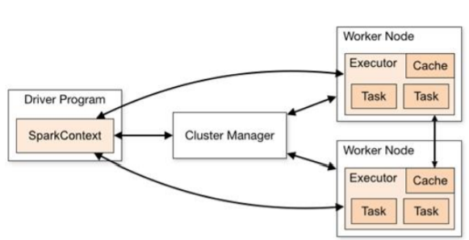

**核心组件**

Spark 框架有两个核心组件：
**Driver**
Spark 驱动器节点，用于执行 Spark 任务中的 main 方法，负责实际代码的执行工作。 Driver 在 Spark 作业执行时主要负责：

- 将用户程序转化为作业（job）
- 在 Executor 之间调度任务(task)
- 跟踪 Executor 的执行情况
- 通过 UI 展示查询运行情况


所以简单理解，所谓的 Driver 就是驱使整个应用运行起来的程序，也称之为 Driver 类。


**Executor**

Spark Executor 是集群中工作节点（Worker）中的一个 JVM 进程，负责在 Spark 作业 中运行具体任（Task），任务彼此之间相互独立。


Spark 应用启动时，Executor 节点被同时启动，并且始终伴随着整个 Spark 应用的生命周期而存在。如果有Executor 节点发生了 故障或崩溃，Spark 应用也可以继续执行，会将出错节点上的任务调度到其他 Executor 节点 上继续运行。


**Executor 有两个核心功能：**

- 负责运行组成 Spark 应用的任务，并将结果返回给驱动器进程
- 它们通过自身的块管理器（Block Manager）为用户程序中要求缓存的 RDD 提供内存式存储。RDD 是直接缓存在 Executor 进程内的，因此任务可以在运行时充分利用缓存数据加速运算。


**Master & Worker;**
Spark 集群的独立部署环境中，不需要依赖其他的资源调度框架，自身就实现了资源调 度的功能，所以环境中还有其他两个核心组件：Master 和 Worker，Master 是一个进 程，主要负责资源的调度和分配，并进行集群的监控等职责，类似于 Yarn 环境中的 RM, 而 Worker 呢，也是进程，一个 Worker 运行在集群中的一台服务器上，由 Master 分配资源对 数据进行并行的处理和计算，类似于 Yarn 环境中 NM。


**ApplicationMaster**
Hadoop 用户向 YARN 集群提交应用程序时,提交程序中应该包含 ApplicationMaster，用于向资源调度器申请执行任务的资源容器 Container，运行用户自己的程序任务 job，监控整个任务的执行，跟踪整个任务的状态，处理任务失败等异常情况。说的简单点就是，ResourceManager（资源）和 Driver（计算）之间的解耦合靠的就是
ApplicationMaster。


# 核心概念

**Executor 与 Core**

Spark Executor 是集群中运行在工作节点（Worker）中的一个 JVM 进程，是整个集群中 的专门用于计算的点。在提交应用中，可以提供参数指定计算节点的个数，以及对应的资 源。这里的资源一般指的是工作节点 Executor 的内存大小和使用的虚拟 CPU 核（Core）数 量。

**应用程序相关启动参数如下：**

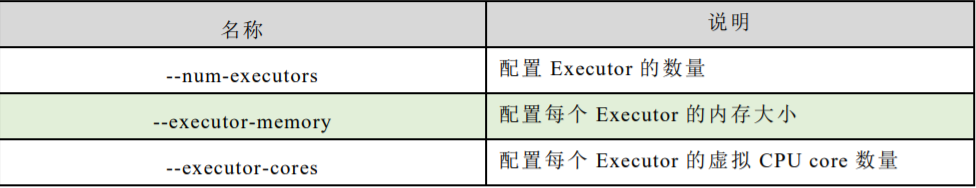


## 并行度（Parallelism）

在分布式计算框架中一般都是多个任务同时执行，由于任务分布在不同的计算节点进行计算，所以能够真正地实现多任务并行执行，记住，这里是并行，而不是并发。整个集群并行执行任务的数量称之为并行度。那么一个作业到底并行度是多少呢？这个取决 于框架的默认配置。应用程序也可以在运行过程中动态修改。


**有向无环图（DAG）**

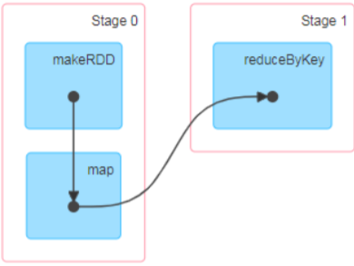


大数据计算引擎框架根据使用方式的不同一般会分为四类，其中第一类就是Hadoop 所承载的 MapReduce,它将计算分为两个阶段，分别为 Map 阶段 和 Reduce 阶段。对于上层应用来说，就不得不想方设法去拆分算法，甚至于不得不在上层应用实现多个 Job的串联，以完成一个完整的算法，例如迭代计算。 由于这样的弊端，催生了支持 DAG 框架的产生。因此，支持 DAG 的框架被划分为第二代计算引擎。如 Tez 以及更上层的Oozie。对于当时的 Tez 和 Oozie 来说，大多还是批处理的任务。接下来就是以 Spark 为代表的第三代的计算引擎。第三代计
算引擎的特点主要是 Job 内部的 DAG 支持（不跨越 Job），以及实时计算。


有向无环图，并不是真正意义的图形，而是由 Spark 程序直接映射成的数据流的高级抽象模型。简单理解就是将整个程序计算的执行过程用图形表示出来,这样更直观，更便于理解，可以用于表示程序的拓扑结构。


## DAG：

**（Directed Acyclic Graph）有向无环图是由点和线组成的拓扑图形，该图形具有方向，不会闭环。**

**提交流程**

所谓的提交流程，其实就是开发人员根据需求写的应用程序通过 Spark 客户端提交 给 Spark 运行环境执行计算的流程。在不同的部署环境中，这个提交过程基本相同，但是又有细微的区别。

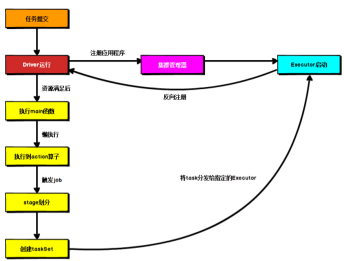


Spark 应用程序提交到 Yarn 环境中执行的时候，一般会有两种部署执行的方式：Client 和 Cluster。两种模式主要区别在于：Driver 程序的运行节点位置。


**Yarn Client 模式**

Client 模式将用于监控和调度的 Driver 模块在客户端执行，而不是在 Yarn 中，所以一般用于测试。

- Driver 在任务提交的本地机器上运行


- Driver 启动后会和 ResourceManager 通讯申请启动 ApplicationMaster


- ResourceManager 分配 container，在合适的 NodeManager 上启动 ApplicationMaster，负责向 ResourceManager 申请 Executor 内存


- ResourceManager 接到 ApplicationMaster 的资源申请后会分配 container，然后ApplicationMaster 在资源分配指定的 NodeManager 上启动 Executor 进程


- Executor 进程启动后会向 Driver 反向注册，Executor 全部注册完成后 Driver 开始执行main 函数


- 之后执行到 Action 算子时，触发一个 Job，并根据宽依赖开始划分 stage，每个 stage 生成对应的 TaskSet，之后将 task 分发到各个 Executor 上执行。


**Yarn Cluster 模式**

Cluster 模式将用于监控和调度的 Driver 模块启动在 Yarn 集群资源中执行。一般应用于实际生产环境。

- 在 YARN Cluster 模式下，任务提交后会和 ResourceManager 通讯申请启动ApplicationMaster。


- 随后 ResourceManager 分配 container，在合适的 NodeManager 上启动 ApplicationMaster，此时的 ApplicationMaster 就是 Driver。


- Driver 启动后向 ResourceManager 申请 Executor 内存，ResourceManager 接到ApplicationMaster 的资源申请后会分配 container，然后在合适的 NodeManager 上启动Executor 进程


- Executor 进程启动后会向 Driver 反向注册，Executor 全部注册完成后 Driver 开始执行main 函数。


- 之后执行到 Action 算子时，触发一个 Job，并根据宽依赖开始划分 stage，每个 stage 生成对应的 TaskSet，之后将 task 分发到各个 Executor 上执行。


# Spark 核心编程

Spark 计算框架为了能够进行高并发和高吞吐的数据处理，封装了三大数据结构，用于处理不同的应用场景。三大数据结构分别是：

- RDD : 弹性分布式数据集
- 累加器：分布式共享只写变量
- 广播变量：分布式共享只读变量


## **RDD**

RDD概念：RDD（Resilient Distributed Dataset）叫做弹性分布式数据集，是 Spark 中最基本的数据 处理模型。代码中是一个抽象类，它代表一个弹性的、不可变、可分区、里面的元素可并行 计算的集合。

- 弹性
  - 存储的弹性：内存与磁盘的自动切换；
  - 容错的弹性：数据丢失可以自动恢复；
  - 计算的弹性：计算出错重试机制；
  - 分片的弹性：可根据需要重新分片。
  - 分布式：数据存储在大数据集群不同节点上


- 分布式：数据存储在大数据集群不同节点上
  - 数据集：RDD 封装了计算逻辑，并不保存数据
  - 数据抽象：RDD 是一个抽象类，需要子类具体实现
  - 不可变：RDD 封装了计算逻辑，是不可以改变的，想要改变，只能产生新的 RDD，在新的 RDD 里面封装计算逻辑
  - 可分区、并行计算


## 核心属性

- 分区列表：RDD 数据结构中存在分区列表，用于执行任务时并行计算，是实现分布式计算的重要属性。

- 分区计算函数：Spark 在计算时，是使用分区函数对每一个分区进行计算

- RDD 之间的依赖关系：RDD 是计算模型的封装，当需求中需要将多个计算模型进行组合时，就需要将多个 RDD 建 立依赖关系

- 分区器（可选）：当数据为 KV 类型数据时，可以通过设定分区器自定义数据的分区

- 首选位置（可选）：计算数据时，可以根据计算节点的状态选择不同的节点位置进行计算


## 执行原理

从计算的角度来讲，数据处理过程中需要计算资源（内存 & CPU）和计算模型（逻辑）。执行时，需要将计算资源和计算模型进行协调和整合。Spark 框架在执行时，先申请资源，然后将应用程序的数据处理逻辑分解成一个一个的计算任务。然后将任务发到已经分配资源的计算节点上, 按照指定的计算模型进行数据计算。最后得到计算结果。


RDD 是 Spark 框架中用于数据处理的核心模型，接下来我们看看，在 Yarn 环境中，RDD的工作原理:

### 1) 启动 Yarn 集群环境

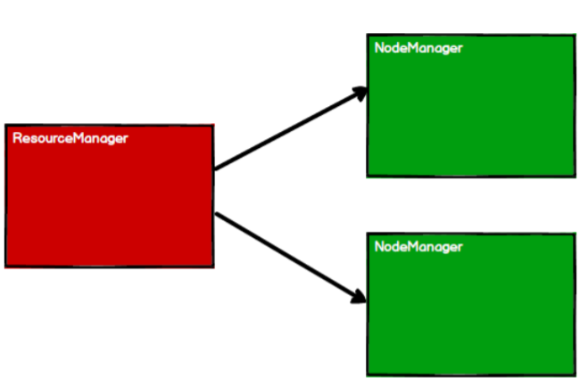


### 2) Spark 通过申请资源创建调度节点和计算节点

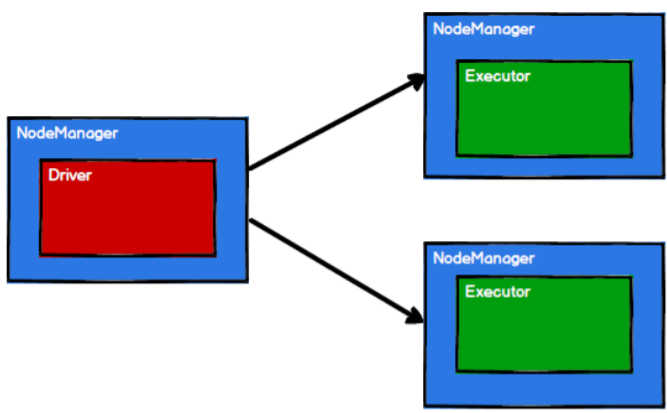


### 3) Spark 框架根据需求将计算逻辑根据分区划分成不同的任务

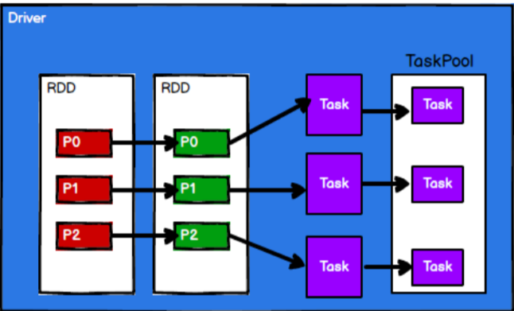


### 4) 调度节点将任务根据计算节点状态发送到对应的计算节点进行计算

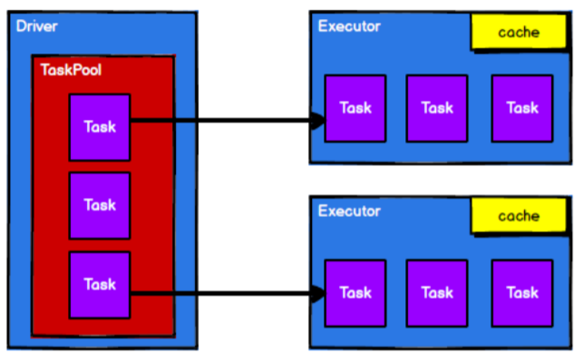


 **RDD 在整个流程中主要用于将逻辑进行封装，并生成 Task 发送给 Executor 节点执行计算，接下来我们就一起看看 Spark 框架中 RDD 是具体是如何进行数据处理的。**


## 基础编程

RDD 创建：在 Spark 中创建 RDD 的创建方式可以分为四种： 

**1)从集合（内存）中创建 RDD**

```scala
// 从集合中创建 RDD，Spark 主要提供了两个方法：parallelize 和 makeRDD
val sparkConf = new SparkConf().setMaster("local[*]").setAppName("spark")
val sparkContext = new SparkContext(sparkConf)
val rdd1 = sparkContext.parallelize(
 List(1,2,3,4)
)
val rdd2 = sparkContext.makeRDD(
 List(1,2,3,4)
)
rdd1.collect().foreach(println)
rdd2.collect().foreach(println)
sparkContext.stop()

// 从底层代码实现来讲，makeRDD 方法其实就是 parallelize 方法

def makeRDD[T: ClassTag](
 seq: Seq[T],
 numSlices: Int = defaultParallelism): RDD[T] = withScope {
 parallelize(seq, numSlices)
}
```

**2) 从外部存储（文件）创建 RDD**

```scala
//由外部存储系统的数据集创建 RDD 包括本地的文件系统，所有 Hadoop 支持的数据集，比如 HDFS、HBase 等。

val sparkConf =new SparkConf().setMaster("local[*]").setAppName("spark")
val sparkContext = new SparkContext(sparkConf)
val fileRDD: RDD[String] = sparkContext.textFile("input")

fileRDD.collect().foreach(println)
sparkContext.stop()
```

**3) 从其他 RDD 创建**


**4) 直接创建 RDD（new）**

使用 new 的方式直接构造 RDD，一般由 Spark 框架自身使用。

**RDD 并行度与分区**
默认情况下，Spark 可以将一个作业切分多个任务后，发送给 Executor 节点并行计算，而能够并行计算的任务数称之为并行度。这个数量可以在构建 RDD 时指定。并行执行的任务数量，并不是指的切分任务的数量。

```scala
val sparkConf =new SparkConf().setMaster("local[*]").setAppName("spark")
val sparkContext = new SparkContext(sparkConf)
val dataRDD: RDD[Int] =sparkContext.makeRDD(List(1,2,3,4),4)
val fileRDD: RDD[String] =sparkContext.textFile("input",2)

fileRDD.collect().foreach(println)
sparkContext.stop()
```

读取内存数据时，数据可以按照并行度的设定进行数据的分区操作，
数据分区规则的 Spark 核心源码如下：

```scala
def positions(length: Long, numSlices: Int): Iterator[(Int, Int)] = {
 (0 until numSlices).iterator.map { i =>
 val start = ((i * length) / numSlices).toInt
 val end = (((i + 1) * length) / numSlices).toInt(start, end)
 }
}
```

读取文件数据时，数据是按照 Hadoop 文件读取的规则进行切片分区，而切片规则和数 据读取的规则有些差异，具体 Spark 核心源码如下:

```scala
public InputSplit[] getSplits(JobConf job, int numSplits)
 throws IOException {
 long totalSize = 0; // compute total size
 for (FileStatus file: files) { // check we have valid files
 if (file.isDirectory()) {
 throw new IOException("Not a file: "+ file.getPath());
 }
 totalSize += file.getLen();
 }
 long goalSize = totalSize / (numSplits == 0 ? 1 : numSplits);
 long minSize = Math.max(job.getLong(org.apache.hadoop.mapreduce.lib.input.
 FileInputFormat.SPLIT_MINSIZE, 1), minSplitSize);

 ...

 for (FileStatus file: files) {

 ...

 if (isSplitable(fs, path)) {
 long blockSize = file.getBlockSize();
 long splitSize = computeSplitSize(goalSize, minSize, blockSize);
 ...
 }
 protected long computeSplitSize(long goalSize, long minSize,
 long blockSize) {
 return Math.max(minSize, Math.min(goalSize, blockSize));
 }

```

## RDD 转换算子

RDD 根据数据处理方式的不同将算子整体上分为 Value 类型、双 Value 类型和 Key-Value 类型

Value 类型

1.**map**

函数签名
def map[U: ClassTag](f: T => U): RDD[U]

函数说明
将处理的数据逐条进行映射转换，这里的转换可以是类型的转换，也可以是值的转换。

```scala
val dataRDD: RDD[Int] = sparkContext.makeRDD(List(1,2,3,4))
val dataRDD1: RDD[Int] = dataRDD.map(
 num => {
num * 2
 }
)
val dataRDD2: RDD[String] = dataRDD1.map(
 num => {
 "" + num
 }
)
```

小功能：从服务器日志数据 apache.log 中获取用户请求 URL 资源路径


2.**mapPartitions**

函数签名
def mapPartitions[U: ClassTag](
 f: Iterator[T] => Iterator[U],
 preservesPartitioning: Boolean = false): RDD[U]

函数说明
将待处理的数据以分区为单位发送到计算节点进行处理，
这里的处理是指可以进行任意的处 理，哪怕是过滤数据。

```scala
val dataRDD1: RDD[Int] = dataRDD.mapPartitions(
 datas => {
 datas.filter(_==2)
 }
)
```

小功能：获取每个数据分区的最大值


**map 和 mapPartitions 的区别**

数据处理角度
Map 算子是分区内一个数据一个数据的执行，类似于串行操作。

mapPartitions 算子是以分区为单位进行批处理操作。

- 功能的角度
  Map 算子主要目的将数据源中的数据进行转换和改变。但是不会减少或增多数据。MapPartitions 算子需要传递一个迭代器，返回一个迭代器，没有要求的元素的个数保持不变，所以可以增加或减少数据
- 性能的角度
  Map 算子因为类似于串行操作，所以性能比较低，而是 mapPartitions 算子类似于批处理，所以性能较高。但是 mapPartitions 算子会长时间占用内存，那么这样会导致内存可能不够用，出现内存溢出的错误。所以在内存有限的情况下，不推荐使用。使用 map 操作。


**mapPartitionsWithIndex**
函数签名
def mapPartitionsWithIndex[U: ClassTag](
 f: (Int, Iterator[T]) => Iterator[U],
 preservesPartitioning: Boolean = false): RDD[U]
函数说明
将待处理的数据以分区为单位发送到计算节点进行处理，这里的处理是指可以进行任意的处理，哪怕是过滤数据，在处理时同时可以获取当前分区索引。

```scala
val dataRDD1 = dataRDD.mapPartitionsWithIndex(
 (index, datas) => {
 datas.map(index, _)
 }
)
```

小功能：获取第二个数据分区的数据


**flatMap**

函数签名
def flatMap[U: ClassTag](f: T => TraversableOnce[U]): RDD[U]
函数说明
将处理的数据进行扁平化后再进行映射处理，所以算子也称之为扁平映射

```scala
val dataRDD = sparkContext.makeRDD(List(
 List(1,2),List(3,4)
),1)
val dataRDD1 = dataRDD.flatMap(
 list => list
)
```

小功能：将 List(List(1,2),3,List(4,5))进行扁平化操作


**glom**
函数签名
def glom(): RDD[Array[T]]
函数说明
将同一个分区的数据直接转换为相同类型的内存数组进行处理，分区不变

```scala
val dataRDD = sparkContext.makeRDD(List(
 1,2,3,4
),1)
val dataRDD1:RDD[Array[Int]] = dataRDD.glom()
```

小功能：计算所有分区最大值求和（分区内取最大值，分区间最大值求和）


**groupBy**

函数签名
def groupBy[K](f: T => K)(implicit kt: ClassTag[K]): RDD[(K, Iterable[T])]
函数说明
将数据根据指定的规则进行分组, 分区默认不变，但是数据会被打乱重新组合，将这样的操作称之为 shuffle。极限情况下，数据可能被分在同一个分区中一个组的数据在一个分区中，但是并不是说一个分区中只有一个组

```scala
val dataRDD = sparkContext.makeRDD(List(1,2,3,4),1)
val dataRDD1 = dataRDD.groupBy(
 _%2
)
```

小功能：将 List("Hello", "hive", "hbase", "Hadoop")根据单词首写字母进行分组。 
小功能：从服务器日志数据 apache.log 中获取每个时间段访问量。 
小功能：WordCount。


**filter**

函数签名
def filter(f: T => Boolean): RDD[T]
函数说明
将数据根据指定的规则进行筛选过滤，符合规则的数据保留，不符合规则的数据丢弃。当数据进行筛选过滤后，分区不变，但是分区内的数据可能不均衡，生产环境下，可能会出现数据倾斜。

```scala
val dataRDD = sparkContext.makeRDD(List(
 1,2,3,4
),1)
val dataRDD1 = dataRDD.filter(_%2 == 0)
```

小功能：从服务器日志数据 apache.log 中获取 2015 年 5 月 17 日的请求路径


**sample** 
函数签名

```scala
def sample(
 withReplacement: Boolean,
 fraction: Double,
 seed: Long = Utils.random.nextLong): RDD[T]
```

函数说明
根据指定的规则从数据集中抽取数据

```scala
val dataRDD = sparkContext.makeRDD(List(
 1,2,3,4
),1)
// 抽取数据不放回（伯努利算法）
// 伯努利算法：又叫 0、1 分布。例如扔硬币，要么正面，要么反面。
// 具体实现：根据种子和随机算法算出一个数和第二个参数设置几率比较，小于第二个参数要，大于不
要
// 第一个参数：抽取的数据是否放回，false：不放回
// 第二个参数：抽取的几率，范围在[0,1]之间,0：全不取；1：全取；
// 第三个参数：随机数种子
val dataRDD1 = dataRDD.sample(false, 0.5)
// 抽取数据放回（泊松算法）
// 第一个参数：抽取的数据是否放回，true：放回；false：不放回
// 第二个参数：重复数据的几率，范围大于等于 0.表示每一个元素被期望抽取到的次数
// 第三个参数：随机数种子
val dataRDD2 = dataRDD.sample(true, 2)
```


**distinct**

函数签名

```scala
def distinct()(implicit ord: Ordering[T] = null): RDD[T]
def distinct(numPartitions: Int)(implicit ord: Ordering[T] = null): RDD[T]
```

函数说明
将数据集中重复的数据去重

```scala
val dataRDD = sparkContext.makeRDD(List(
 1,2,3,4,1,2
),1)
val dataRDD1 = dataRDD.distinct()
val dataRDD2 = dataRDD.distinct(2)
```

**coalesce**

函数签名

```scala
def coalesce(numPartitions: Int, shuffle: Boolean = false,
 partitionCoalescer: Option[PartitionCoalescer] = Option.empty)
 (implicit ord: Ordering[T] = null)
 : RDD[T]
```

函数说明
根据数据量缩减分区，用于大数据集过滤后，提高小数据集的执行效率当 spark 程序中，存在过多的小任务的时候，可以通过 coalesce 方法，收缩合并分区，减少分区的个数，减小任务调度成本

```scala
val dataRDD = sparkContext.makeRDD(List(
 1,2,3,4,1,2
),6)
val dataRDD1 = dataRDD.coalesce(2)
```


**repartition**

函数签名 def repartition(numPartitions: Int)(implicit ord: Ordering[T] = null): RDD[T] ➢ 函数说明 该操作内部其实执行的是 coalesce 操作，参数 shuffle 的默认值为 true。无论是将分区数多的 RDD 转换为分区数少的 RDD，还是将分区数少的 RDD 转换为分区数多的 RDD，repartition 操作都可以完成，因为无论如何都会经 shuffle 过程。

```scala
val dataRDD = sparkContext.makeRDD(List(
 1,2,3,4,1,2
),2)
val dataRDD1 = dataRDD.repartition(4)
```


**sortBy**
函数签名

```scala
def sortBy[K](
 f: (T) => K
ascending: Boolean = true,
 numPartitions: Int = this.partitions.length)
 (implicit ord: Ordering[K], ctag: ClassTag[K]): RDD[T]
```

函数说明
该操作用于排序数据。在排序之前，可以将数据通过 f 函数进行处理，之后按照 f 函数处理
的结果进行排序，默认为升序排列。排序后新产生的 RDD 的分区数与原 RDD 的分区数一
致。中间存在 shuffle 的过程

```scala
val dataRDD = sparkContext.makeRDD(List(
 1,2,3,4,1,2
),2)
val dataRDD1 = dataRDD.sortBy(num=>num, false, 4)
```

**双 Value 类型**

**intersection**
函数签名

```scala
def intersection(other: RDD[T]): RDD[T]
```

函数说明
对源 RDD 和参数 RDD 求交集后返回一个新的 RDD

```scala
val dataRDD1 = sparkContext.makeRDD(List(1,2,3,4))
val dataRDD2 = sparkContext.makeRDD(List(3,4,5,6))
val dataRDD = dataRDD1.intersection(dataRDD2)
```


**union**

函数签名
def union(other: RDD[T]): RDD[T]
函数说明
对源 RDD 和参数 RDD 求并集后返回一个新的 RDD

```scala
val dataRDD1 = sparkContext.makeRDD(List(1,2,3,4))
val dataRDD2 = sparkContext.makeRDD(List(3,4,5,6))
val dataRDD = dataRDD1.union(dataRDD2)
```


**subtract**
函数签名
def subtract(other: RDD[T]): RDD[T]
函数说明
以一个 RDD 元素为主，去除两个 RDD 中重复元素，将其他元素保留下来。求差集

```scala
val dataRDD1 = sparkContext.makeRDD(List(1,2,3,4))
val dataRDD2 = sparkContext.makeRDD(List(3,4,5,6))
val dataRDD = dataRDD1.subtract(dataRDD2)
```

**zip**
函数签名
def zip[U: ClassTag](other: RDD[U]): RDD[(T, U)]
函数说明
将两个 RDD 中的元素，以键值对的形式进行合并。其中，键值对中的 Key 为第 1 个 RDD
中的元素，Value 为第 2 个 RDD 中的相同位置的元素。

```scala
val dataRDD1 = sparkContext.makeRDD(List(1,2,3,4))
val dataRDD2 = sparkContext.makeRDD(List(3,4,5,6))
val dataRDD = dataRDD1.zip(dataRDD2)
```


**Key - Value 类型**

**partitionBy**
函数签名
def partitionBy(partitioner: Partitioner): RDD[(K, V)]
函数说明
将数据按照指定 Partitioner 重新进行分区。Spark 默认的分区器是 HashPartitioner

```scala
val rdd: RDD[(Int, String)] =
 sc.makeRDD(Array((1,"aaa"),(2,"bbb"),(3,"ccc")),3)
import org.apache.spark.HashPartitioner
val rdd2: RDD[(Int, String)] =
 rdd.partitionBy(new HashPartitioner(2))
```

**reduceByKey**

函数签名
def reduceByKey(func: (V, V) => V): RDD[(K, V)]
def reduceByKey(func: (V, V) => V, numPartitions: Int): RDD[(K, V)]
函数说明
可以将数据按照相同的 Key 对 Value 进行聚合

```scala
val dataRDD1 = sparkContext.makeRDD(List(("a",1),("b",2),("c",3)))
val dataRDD2 = dataRDD1.reduceByKey(_+_)
val dataRDD3 = dataRDD1.reduceByKey(_+_, 2)
```

小功能：WordCount


**groupByKey**

函数签名

```scala
def groupByKey(): RDD[(K, Iterable[V])]
def groupByKey(numPartitions: Int): RDD[(K, Iterable[V])]
def groupByKey(partitioner: Partitioner): RDD[(K, Iterable[V])]
```

函数说明
将数据源的数据根据 key 对 value 进行分组

```scala
val dataRDD1 =
 sparkContext.makeRDD(List(("a",1),("b",2),("c",3)))
val dataRDD2 = dataRDD1.groupByKey()
val dataRDD3 = dataRDD1.groupByKey(2)
val dataRDD4 = dataRDD1.groupByKey(new HashPartitioner(2))
```

**reduceByKey 和 groupByKey 的区别:**

**从 shuffle 的角度：**reduceByKey 和 groupByKey 都存在 shuffle 的操作，但是 reduceByKey
可以在 shuffle 前对分区内相同 key 的数据进行预聚合（combine）功能，这样会减少落盘的
数据量，而 groupByKey 只是进行分组，不存在数据量减少的问题，reduceByKey 性能比较
高。

**从功能的角度：**reduceByKey 其实包含分组和聚合的功能。GroupByKey 只能分组，不能聚
合，所以在分组聚合的场合下，推荐使用 reduceByKey，如果仅仅是分组而不需要聚合。那
么还是只能使用 groupByKey

**aggregateByKey**

函数签名
def aggregateByKey[U: ClassTag](zeroValue: U)(seqOp: (U, V) => U,**
 combOp: (U, U) => U): RDD[(K, U)]**
函数说明
将数据根据不同的规则进行分区内计算和分区间计算

```scala
val dataRDD1 =
 sparkContext.makeRDD(List(("a",1),("b",2),("c",3)))
val dataRDD2 =
 dataRDD1.aggregateByKey(0)(_+_,_+_)
// 取出每个分区内相同 key 的最大值然后分区间相加
// TODO : 取出每个分区内相同 key 的最大值然后分区间相加
// aggregateByKey 算子是函数柯里化，存在两个参数列表
// 1. 第一个参数列表中的参数表示初始值
// 2. 第二个参数列表中含有两个参数
// 2.1 第一个参数表示分区内的计算规则
// 2.2 第二个参数表示分区间的计算规则
val rdd =
 sc.makeRDD(List(
 ("a",1),("a",2),("c",3),
 ("b",4),("c",5),("c",6)
 ),2)
// 0:("a",1),("a",2),("c",3) => (a,10)(c,10)
// => (a,10)(b,10)(c,20)
// 1:("b",4),("c",5),("c",6) => (b,10)(c,10)
val resultRDD =
 rdd.aggregateByKey(10)(
 (x, y) => math.max(x,y),
 (x, y) => x + y
 )
resultRDD.collect().foreach(println)
```


**foldByKey**
函数签名
def foldByKey(zeroValue: V)(func: (V, V) => V): RDD[(K, V)]
函数说明
当分区内计算规则和分区间计算规则相同时，aggregateByKey 就可以简化为 foldByKey

```scala
val dataRDD1 = sparkContext.makeRDD(List(("a",1),("b",2),("c",3)))
val dataRDD2 = dataRDD1.foldByKey(0)(_+_)
```

**combineByKey**
函数签名
def combineByKey[C](
 createCombiner: V => C,
 mergeValue: (C, V) => C,
 mergeCombiners: (C, C) => C): RDD[(K, C)]
函数说明
最通用的对 key-value 型 rdd 进行聚集操作的聚集函数（aggregation function）。

类似于aggregate()，combineByKey()允许用户返回值的类型与输入不一致。
小练习：

将数据 List(("a", 88), ("b", 95), ("a", 91), ("b", 93), ("a", 95), ("b", 98))求每个 key 的平
均值

```scala
val list: List[(String, Int)] = List(("a", 88), ("b", 95), ("a", 91), ("b", 93),
("a", 95), ("b", 98))
val input: RDD[(String, Int)] = sc.makeRDD(list, 2)
val combineRdd: RDD[(String, (Int, Int))] = input.combineByKey(
 (_, 1),
 (acc: (Int, Int), v) => (acc._1 + v, acc._2 + 1),
 (acc1: (Int, Int), acc2: (Int, Int)) => (acc1._1 + acc2._1, acc1._2 + acc2._2)
)
```

**reduceByKey、foldByKey、aggregateByKey、combineByKey 的区别:**
reduceByKey: 相同 key 的第一个数据不进行任何计算，分区内和分区间计算规则相同
FoldByKey: 相同 key 的第一个数据和初始值进行分区内计算，分区内和分区间计算规则相同

AggregateByKey：相同 key 的第一个数据和初始值进行分区内计算，分区内和分区间计算规 则可以不相同 
CombineByKey:当计算时，发现数据结构不满足要求时，可以让第一个数据转换结构。分区 内和分区间计算规则不相同。


**sortByKey**

函数签名
def sortByKey(ascending: Boolean = true, numPartitions: Int = self.partitions.length): RDD[(K, V)]
函数说明
在一个(K,V)的 RDD 上调用，K 必须实现 Ordered 接口(特质)，返回一个按照 key 进行排序
的

```scala
val dataRDD1 = sparkContext.makeRDD(List(("a",1),("b",2),("c",3)))
val sortRDD1: RDD[(String, Int)] = dataRDD1.sortByKey(true)
val sortRDD1: RDD[(String, Int)] = dataRDD1.sortByKey(false)
```


**join**
函数签名
def join[W](other: RDD[(K, W)]): RDD[(K, (V, W))]
函数说明
在类型为(K,V)和(K,W)的 RDD 上调用，返回一个相同 key 对应的所有元素连接在一起的

```scala
(K,(V,W))的 RDD
val rdd: RDD[(Int, String)] = sc.makeRDD(Array((1, "a"), (2, "b"), (3, "c")))
val rdd1: RDD[(Int, Int)] = sc.makeRDD(Array((1, 4), (2, 5), (3, 6)))
rdd.join(rdd1).collect().foreach(println)
```

**leftOuterJoin**
函数签名
def leftOuterJoin[W](other: RDD[(K, W)]): RDD[(K, (V, Option[W]))]
函数说明
类似于 SQL 语句的左外连接

```scala
val dataRDD1 = sparkContext.makeRDD(List(("a",1),("b",2),("c",3)))
val dataRDD2 = sparkContext.makeRDD(List(("a",1),("b",2),("c",3)))
val rdd: RDD[(String, (Int, Option[Int]))] = dataRDD1.leftOuterJoin(dataRDD2)
```

**cogroup**
函数签名
def cogroup[W](other: RDD[(K, W)]): RDD[(K, (Iterable[V], Iterable[W]))]
函数说明
在类型为(K,V)和(K,W)的 RDD 上调用，返回一个(K,(Iterable<V>,Iterable<W>))类型的 RDD

```scala
val dataRDD1 = sparkContext.makeRDD(List(("a",1),("a",2),("c",3)))
val dataRDD2 = sparkContext.makeRDD(List(("a",1),("c",2),("c",3)))
val value: RDD[(String, (Iterable[Int], Iterable[Int]))] =dataRDD1.cogroup(dataRDD2)
```

## RDD 行动算子

**reduce**
函数签名
def reduce(f: (T, T) => T): T
函数说明
聚集 RDD 中的所有元素，先聚合分区内数据，再聚合分区间数据

```scala
val rdd: RDD[Int] = sc.makeRDD(List(1,2,3,4))
// 聚合数据
val reduceResult: Int = rdd.reduce(_+_)
```

**collect**
函数签名
def collect(): Array[T]
函数说明
在驱动程序中，以数组 Array 的形式返回数据集的所有元素

```scala
val rdd: RDD[Int] = sc.makeRDD(List(1,2,3,4))
// 收集数据到 Driver
rdd.collect().foreach(println)
```

**count**
函数签名
def count(): Long
函数说明
返回 RDD 中元素的个数

```scala
val rdd: RDD[Int] = sc.makeRDD(List(1,2,3,4))
// 返回 RDD 中元素的个数
val countResult: Long = rdd.count()
```


**first**
函数签名
def first(): T
函数说明
返回 RDD 中的第一个元素

```scala
val rdd: RDD[Int] = sc.makeRDD(List(1,2,3,4))
// 返回 RDD 中元素的个数
val firstResult: Int = rdd.first()
println(firstResult)
```


**take**
函数签名
def take(num: Int): Array[T]
函数说明
返回一个由 RDD 的前 n 个元素组成的数组

```scala
vval rdd: RDD[Int] = sc.makeRDD(List(1,2,3,4))
// 返回 RDD 中元素的个数
val takeResult: Array[Int] = rdd.take(2)
println(takeResult.mkString(","))
```

**takeOrdered**
函数签名
def takeOrdered(num: Int)(implicit ord: Ordering[T]): Array[T]
函数说明
返回该 RDD 排序后的前 n 个元素组成的数组

```scala
val rdd: RDD[Int] = sc.makeRDD(List(1,3,2,4))
// 返回 RDD 中元素的个数
val result: Array[Int] = rdd.takeOrdered(2)
```

**aggregate**
函数签名
def aggregate[U: ClassTag](zeroValue: U)(seqOp: (U, T) => U, combOp: (U, U) => U): U
函数说明
分区的数据通过初始值和分区内的数据进行聚合，然后再和初始值进行分区间的数据聚合

```scala
val rdd: RDD[Int] = sc.makeRDD(List(1, 2, 3, 4), 8)
// 将该 RDD 所有元素相加得到结果
//val result: Int = rdd.aggregate(0)(_ + _, _ + _)
val result: Int = rdd.aggregate(10)(_ + _, _ + _)
```

**fold**

函数签名
def fold(zeroValue: T)(op: (T, T) => T): T
函数说明
折叠操作，aggregate 的简化版操作

```scala
val rdd: RDD[Int] = sc.makeRDD(List(1, 2, 3, 4))
val foldResult: Int = rdd.fold(0)(_+_)
```

countByKey
函数签名
def countByKey(): Map[K, Long]
函数说明
统计每种 key 的个数

```scala
val rdd: RDD[(Int, String)] = sc.makeRDD(List((1, "a"), (1, "a"), (1, "a"), (2,"b"), (3, "c"), (3, "c")))
// 统计每种 key 的个数
val result: collection.Map[Int, Long] = rdd.countByKey()
```

**save 相关算子**
函数签名

```scala
def saveAsTextFile(path: String): Unit
def saveAsObjectFile(path: String): Unit
def saveAsSequenceFile(
 path: String,
 codec: Option[Class[_ <: CompressionCodec]] = None): Unit
```

函数说明
将数据保存到不同格式的文件中

```scala
// 保存成 Text 文件
rdd.saveAsTextFile("output")
// 序列化成对象保存到文件
rdd.saveAsObjectFile("output1")
// 保存成 Sequencefile 文件
rdd.map((_,1)).saveAsSequenceFile("output2")
```


**foreach**
函数签名

```scala
def foreach(f: T => Unit): Unit = withScope {
 val cleanF = sc.clean(f)
 sc.runJob(this, (iter: Iterator[T]) => iter.foreach(cleanF))
}
```

函数说明
分布式遍历 RDD 中的每一个元素，调用指定函数

```scala
val rdd: RDD[Int] = sc.makeRDD(List(1,2,3,4))
// 收集后打印
rdd.map(num=>num).collect().foreach(println)
println("************")
// 分布式打印
rdd.foreach(println)
```


## RDD 序列化

1) 闭包检查:
从计算的角度, 算子以外的代码都是在 Driver 端执行, 算子里面的代码都是在 Executor端执行。那么在 scala 的函数式编程中，就会导致算子内经常会用到算子外的数据，这样就形成了闭包的效果，如果使用的算子外的数据无法序列化，就意味着无法传值给 Executor端执行，就会发生错误，所以需要在执行任务计算前，检测闭包内的对象是否可以进行序列化，这个操作称之为闭包检测。Scala2.12 版本后闭包编译方式发生了改变


2. 序列化方法和属性
  从计算的角度, 算子以外的代码都是在 Driver 端执行, 算子里面的代码都是在 Executor端执行，看如下代码：

  ```scala
  object serializable02_function {
      def main(args: Array[String]): Unit = {
      //1.创建 SparkConf 并设置 App 名称
      val conf: SparkConf = new
     SparkConf().setAppName("SparkCoreTest").setMaster("local[*]")
          
      //2.创建 SparkContext，该对象是提交 Spark App 的入口
      val sc: SparkContext = new SparkContext(conf)
          
      //3.创建一个 RDD
      val rdd: RDD[String] = sc.makeRDD(Array("hello world", "hello spark",
     "hive", "atguigu"))
          
      //3.1 创建一个 Search 对象
      val search = new Search("hello")
          
      //3.2 函数传递，打印：ERROR Task not serializable
      search.getMatch1(rdd).collect().foreach(println)
          
      //3.3 属性传递，打印：ERROR Task not serializable
      search.getMatch2(rdd).collect().foreach(println)
          
      //4.关闭连接
      sc.stop()
      }
     }
     class Search(query:String) extends Serializable {
      def isMatch(s: String): Boolean = {
      s.contains(query)
      }
         
      // 函数序列化案例
      def getMatch1 (rdd: RDD[String]): RDD[String] = {
          
      //rdd.filter(this.isMatch)
      rdd.filter(isMatch)
      }
  
  // 属性序列化案例
   def getMatch2(rdd: RDD[String]): RDD[String] = {
   //rdd.filter(x => x.contains(this.query))
       
   rdd.filter(x => x.contains(query))
   //val q = query
   //rdd.filter(x => x.contains(q))
   }
  }
  
  ```

  


3. **Kryo 序列化框架**参考地址: https://github.com/EsotericSoftware/kryo

   Java 的序列化能够序列化任何的类。但是比较重（字节多），序列化后，对象的提交也比较大。Spark 出于性能的考虑，Spark2.0 开始支持另外一种 Kryo 序列化机制。Kryo 速度是 Serializable 的 10 倍。当 RDD 在 Shuffle 数据的时候，简单数据类型、数组和字符串类型已经在 Spark 内部使用 Kryo 来序列化。
   注意：即使使用 Kryo 序列化，也要继承 Serializable 接口。

```scala
object serializable_Kryo {
 def main(args: Array[String]): Unit = {
 val conf: SparkConf = new SparkConf()
 .setAppName("SerDemo")
 .setMaster("local[*]")
 // 替换默认的序列化机制
 .set("spark.serializer",
"org.apache.spark.serializer.KryoSerializer")
 // 注册需要使用 kryo 序列化的自定义类
 .registerKryoClasses(Array(classOf[Searcher]))
 val sc = new SparkContext(conf)
 val rdd: RDD[String] = sc.makeRDD(Array("hello world", "hello atguigu",
"atguigu", "hahah"), 2)
 val searcher = new Searcher("hello")
 val result: RDD[String] = searcher.getMatchedRDD1(rdd)
 result.collect.foreach(println)
 }
}
case class Searcher(val query: String) {
 def isMatch(s: String) = {
 s.contains(query)
 }
 def getMatchedRDD1(rdd: RDD[String]) = {
 rdd.filter(isMatch)
 }
 def getMatchedRDD2(rdd: RDD[String]) = {
 val q = query
 rdd.filter(_.contains(q))
 }
}
```


## RDD 依赖关系

1) RDD 血缘关系
RDD 只支持粗粒度转换，即在大量记录上执行的单个操作。将创建 RDD 的一系列 Lineage（血统）记录下来，以便恢复丢失的分区。RDD 的 Lineage 会记录 RDD 的元数据信息和转换行为，当该 RDD 的部分分区数据丢失时，它可以根据这些信息来重新运算和恢复丢失的数据分区。

```scala
val fileRDD: RDD[String] = sc.textFile("input/1.txt")
println(fileRDD.toDebugString)
println("----------------------")
val wordRDD: RDD[String] = fileRDD.flatMap(_.split(" "))
println(wordRDD.toDebugString)
println("----------------------")
val mapRDD: RDD[(String, Int)] = wordRDD.map((_,1))
println(mapRDD.toDebugString)
println("----------------------")
val resultRDD: RDD[(String, Int)] = mapRDD.reduceByKey(_+_)
println(resultRDD.toDebugString)
resultRDD.collect()
```


2) RDD 依赖关系 这里所谓的依赖关系，其实就是两个相邻 RDD 之间的关系

```scala
val sc: SparkContext = new SparkContext(conf)
val fileRDD: RDD[String] = sc.textFile("input/1.txt")
println(fileRDD.dependencies)
println("----------------------")
val wordRDD: RDD[String] = fileRDD.flatMap(_.split(" "))
println(wordRDD.dependencies)
println("----------------------")
val mapRDD: RDD[(String, Int)] = wordRDD.map((_,1))
println(mapRDD.dependencies)
println("----------------------")
val resultRDD: RDD[(String, Int)] = mapRDD.reduceByKey(_+_)
println(resultRDD.dependencies)
resultRDD.collect()
```


3) RDD 窄依赖

窄依赖表示每一个父(上游)RDD 的 Partition 最多被子（下游）RDD 的一个 Partition 使用，
窄依赖我们形象的比喻为独生子女。
class OneToOneDependency[T](rdd: RDD[T]) extends NarrowDependency[T](rdd)

4) RDD 宽依赖

宽依赖表示同一个父（上游）RDD 的 Partition 被多个子（下游）RDD 的 Partition 依赖，会 引起 Shuffle，总结：宽依赖我们形象的比喻为多生。

class ShuffleDependency[K: ClassTag, V: ClassTag, C: ClassTag](
 @transient private val _rdd: RDD[_ <: Product2[K, V]],
 val partitioner: Partitioner,
 val serializer: Serializer = SparkEnv.get.serializer,
 val keyOrdering: Option[Ordering[K]] = None,
 val aggregator: Option[Aggregator[K, V, C]] = None,
 val mapSideCombine: Boolean = false)
 extends Dependency[Product2[K, V]]


5) RDD 阶段划分

DAG（Directed Acyclic Graph）有向无环图是由点和线组成的拓扑图形，该图形具有方向， 不会闭环。例如，DAG 记录了 RDD 的转换过程和任务的阶段。

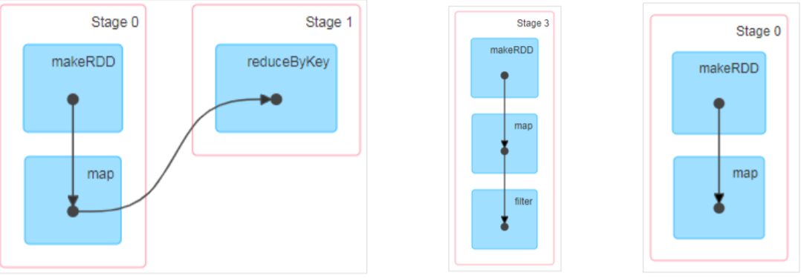


6) RDD 阶段划分源码

```scala
try {
 // New stage creation may throw an exception if, for example, jobs are run on
a
 // HadoopRDD whose underlying HDFS files have been deleted.
 finalStage = createResultStage(finalRDD, func, partitions, jobId, callSite)
} catch {
 case e: Exception =>
 logWarning("Creating new stage failed due to exception - job: " + jobId, e)
 listener.jobFailed(e)
 return
}
……
private def createResultStage(
 rdd: RDD[_],
 func: (TaskContext, Iterator[_]) => _,
 partitions: Array[Int],
 jobId: Int,
 callSite: CallSite): ResultStage = {
val parents = getOrCreateParentStages(rdd, jobId)
val id = nextStageId.getAndIncrement()
val stage = new ResultStage(id, rdd, func, partitions, parents, jobId, callSite)
stageIdToStage(id) = stage
updateJobIdStageIdMaps(jobId, stage)
stage
}
……
private def getOrCreateParentStages(rdd: RDD[_], firstJobId: Int): List[Stage]
= {
getShuffleDependencies(rdd).map { shuffleDep =>
 getOrCreateShuffleMapStage(shuffleDep, firstJobId)
}.toList
}
……
private[scheduler] def getShuffleDependencies(
 rdd: RDD[_]): HashSet[ShuffleDependency[_, _, _]] = {
val parents = new HashSet[ShuffleDependency[_, _, _]]
val visited = new HashSet[RDD[_]]
val waitingForVisit = new Stack[RDD[_]]
waitingForVisit.push(rdd)
while (waitingForVisit.nonEmpty) {
 val toVisit = waitingForVisit.pop()
 if (!visited(toVisit)) {
 visited += toVisit
 toVisit.dependencies.foreach {
 case shuffleDep: ShuffleDependency[_, _, _] =>
 parents += shuffleDep
 case dependency =>
 waitingForVisit.push(dependency.rdd)
 }
 }
}
parents
}
```


7) RDD 任务划分

RDD 任务切分中间分为：Application、Job、Stage 和 Task

- Application：初始化一个 SparkContext 即生成一个 Application；
- Job：一个 Action 算子就会生成一个 Job；
- Stage：Stage 等于宽依赖(ShuffleDependency)的个数加 1；
- Task：一个 Stage 阶段中，最后一个 RDD 的分区个数就是 Task 的个数。

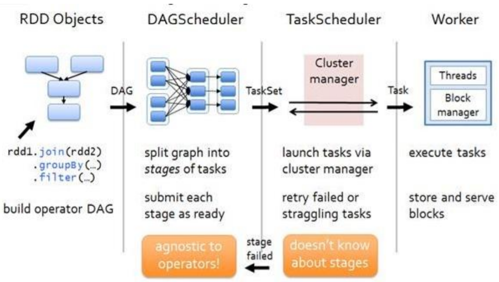


8) RDD 任务划分源码

```scala
val tasks: Seq[Task[_]] = try {
 stage match {
 case stage: ShuffleMapStage =>
 partitionsToCompute.map { id =>
 val locs = taskIdToLocations(id)
 val part = stage.rdd.partitions(id)
 new ShuffleMapTask(stage.id, stage.latestInfo.attemptId,
 taskBinary, part, locs, stage.latestInfo.taskMetrics, properties,
Option(jobId),
 Option(sc.applicationId), sc.applicationAttemptId)
 }
 case stage: ResultStage =>
 partitionsToCompute.map { id =>
 val p: Int = stage.partitions(id)
 val part = stage.rdd.partitions(p)
 val locs = taskIdToLocations(id)
 new ResultTask(stage.id, stage.latestInfo.attemptId,
 taskBinary, part, locs, id, properties, stage.latestInfo.taskMetrics,
 Option(jobId), Option(sc.applicationId), sc.applicationAttemptId)
 }
 }
……
val partitionsToCompute: Seq[Int] = stage.findMissingPartitions()
……
override def findMissingPartitions(): Seq[Int] = {
mapOutputTrackerMaster
 .findMissingPartitions(shuffleDep.shuffleId)
 .getOrElse(0 until numPartitions)
}
```


## RDD 持久化

1) RDD Cache 缓存

RDD 通过 Cache 或者 Persist 方法将前面的计算结果缓存，默认情况下会把数据以缓存 在 JVM 的堆内存中。但是并不是这两个方法被调用时立即缓存，而是触发后面的 action 算 子时，该 RDD 将会被缓存在计算节点的内存中，并供后面重用。

```scala
// cache 操作会增加血缘关系，不改变原有的血缘关系
println(wordToOneRdd.toDebugString)
// 数据缓存。
wordToOneRdd.cache()
// 可以更改存储级别
//mapRdd.persist(StorageLevel.MEMORY_AND_DISK_2)
```

存储级别

```scala
object StorageLevel {
 val NONE = new StorageLevel(false, false, false, false)
 val DISK_ONLY = new StorageLevel(true, false, false, false)
 val DISK_ONLY_2 = new StorageLevel(true, false, false, false, 2)
 val MEMORY_ONLY = new StorageLevel(false, true, false, true)
 val MEMORY_ONLY_2 = new StorageLevel(false, true, false, true, 2)
 val MEMORY_ONLY_SER = new StorageLevel(false, true, false, false)
 val MEMORY_ONLY_SER_2 = new StorageLevel(false, true, false, false, 2)
 val MEMORY_AND_DISK = new StorageLevel(true, true, false, true)
 val MEMORY_AND_DISK_2 = new StorageLevel(true, true, false, true, 2)
 val MEMORY_AND_DISK_SER = new StorageLevel(true, true, false, false)
 val MEMORY_AND_DISK_SER_2 = new StorageLevel(true, true, false, false, 2)
 val OFF_HEAP = new StorageLevel(true, true, true, false, 1)
```

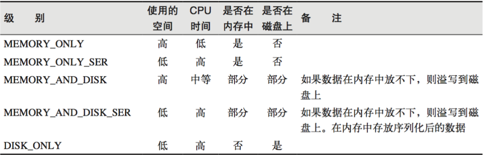


缓存有可能丢失，或者存储于内存的数据由于内存不足而被删除，RDD 的缓存容错机制保证了即使缓存丢失也能保证计算的正确执行。通过基于 RDD 的一系列转换，丢失的数据会被重算，由于 RDD 的各个 Partition 是相对独立的，因此只需要计算丢失的部分即可，并不需要重算全部 Partition。


Spark 会自动对一些 Shuffle 操作的中间数据做持久化操作(比如：reduceByKey)。这样做的目的是为了当一个节点 Shuffle 失败了避免重新计算整个输入。


但是，在实际使用的时候，如果想重用数据，仍然建议调用 persist 或 cache。


2) RDD CheckPoint 检查点

所谓的检查点其实就是通过将 RDD 中间结果写入磁盘
由于血缘依赖过长会造成容错成本过高，这样就不如在中间阶段做检查点容错，如果检查点
之后有节点出现问题，可以从检查点开始重做血缘，减少了开销。
对 RDD 进行 checkpoint 操作并不会马上被执行，必须执行 Action 操作才能触发。

```scala
// 设置检查点路径
sc.setCheckpointDir("./checkpoint1")
// 创建一个 RDD，读取指定位置文件:hello atguigu atguigu
val lineRdd: RDD[String] = sc.textFile("input/1.txt")
// 业务逻辑
val wordRdd: RDD[String] = lineRdd.flatMap(line => line.split(" "))
val wordToOneRdd: RDD[(String, Long)] = wordRdd.map {
 word => {
 (word, System.currentTimeMillis())
 }
}
// 增加缓存,避免再重新跑一个 job 做 checkpoint
wordToOneRdd.cache()
// 数据检查点：针对 wordToOneRdd 做检查点计算
wordToOneRdd.checkpoint()
// 触发执行逻辑
wordToOneRdd.collect().foreach(println)
```


3) 缓存和检查点区别

1）Cache 缓存只是将数据保存起来，不切断血缘依赖。Checkpoint 检查点切断血缘依赖。
2）Cache 缓存的数据通常存储在磁盘、内存等地方，可靠性低。Checkpoint 的数据通常存储在 HDFS 等容错、高可用的文件系统，可靠性高。
3）建议对 checkpoint()的 RDD 使用 Cache 缓存，这样 checkpoint 的 job 只需从 Cache 缓存
中读取数据即可，否则需要再从头计算一次 RDD。


## RDD 分区器

Spark 目前支持 Hash 分区和 Range 分区，和用户自定义分区。Hash 分区为当前的默认分区。分区器直接决定了 RDD 中分区的个数、RDD 中每条数据经过 Shuffle 后进入哪个分区，进而决定了 Reduce 的个数。

- 只有 Key-Value 类型的 RDD 才有分区器，非 Key-Value 类型的 RDD 分区的值是 None
- 每个 RDD 的分区 ID 范围：0 ~ (numPartitions - 1)，决定这个值是属于那个分区的。

1. Hash 分区：对于给定的 key，计算其 hashCode,并除以分区个数取余

  ```scala
  class HashPartitioner(partitions: Int) extends Partitioner {
   require(partitions >= 0, s"Number of partitions ($partitions) cannot be
  negative.")
   def numPartitions: Int = partitions
   def getPartition(key: Any): Int = key match {
   case null => 0
   case _ => Utils.nonNegativeMod(key.hashCode, numPartitions)
   }
   override def equals(other: Any): Boolean = other match {
   case h: HashPartitioner =>
   h.numPartitions == numPartitions
   case _ =>
   false
   }
   override def hashCode: Int = numPartitions
  }
  ```


2) Range 分区：将一定范围内的数据映射到一个分区中，尽量保证每个分区数据均匀，而 且分区间有序

```scala
class RangePartitioner[K : Ordering : ClassTag, V](
 partitions: Int,
 rdd: RDD[_ <: Product2[K, V]],
 private var ascending: Boolean = true)
 extends Partitioner {
 // We allow partitions = 0, which happens when sorting an empty RDD under the
default settings.
 require(partitions >= 0, s"Number of partitions cannot be negative but found
$partitions.")
 private var ordering = implicitly[Ordering[K]]
 // An array of upper bounds for the first (partitions - 1) partitions
 private var rangeBounds: Array[K] = {
 ...
 }
 def numPartitions: Int = rangeBounds.length + 1
 private var binarySearch: ((Array[K], K) => Int) =
CollectionsUtils.makeBinarySearch[K]

def getPartition(key: Any): Int = {
 val k = key.asInstanceOf[K]
 var partition = 0
 if (rangeBounds.length <= 128) {
 // If we have less than 128 partitions naive search
 while (partition < rangeBounds.length && ordering.gt(k,
rangeBounds(partition))) {
 partition += 1
 }
 } else {
 // Determine which binary search method to use only once.
 partition = binarySearch(rangeBounds, k)
 // binarySearch either returns the match location or -[insertion point]-1
 if (partition < 0) {
 partition = -partition-1
 }
 if (partition > rangeBounds.length) {
 partition = rangeBounds.length
 }
 }
 if (ascending) {
 partition
 } else {
 rangeBounds.length - partition
 }
 }
 override def equals(other: Any): Boolean = other match {
 ...
 }
 override def hashCode(): Int = {
 ...
 }
 @throws(classOf[IOException])
 private def writeObject(out: ObjectOutputStream): Unit =
Utils.tryOrIOException {
 ...
 }
 @throws(classOf[IOException])
 private def readObject(in: ObjectInputStream): Unit = Utils.tryOrIOException
{
 ...
 }
}
```


## RDD 文件读取与保存


Spark 的数据读取及数据保存可以从两个维度来作区分：文件格式以及文件系统。 文件格式分为：text 文件、csv 文件、sequence 文件以及 Object 文件； 文件系统分为：本地文件系统、HDFS、HBASE 以及数据库。

- text 文件

```scala
// 读取输入文件
val inputRDD: RDD[String] = sc.textFile("input/1.txt")
// 保存数据
inputRDD.saveAsTextFile("output")
```

- sequence 文件

SequenceFile 文件是 Hadoop 用来存储二进制形式的 key-value 对而设计的一种平面文件(FlatFile)。在 SparkContext 中，可以调用 sequenceFile[keyClass, valueClass](path)。

```scala
// 保存数据为 SequenceFile
dataRDD.saveAsSequenceFile("output")
// 读取 SequenceFile 文件
sc.sequenceFile[Int,Int]("output").collect().foreach(println)
```

- object 对象文件

对象文件是将对象序列化后保存的文件，采用 Java 的序列化机制。可以通过 objectFile[T:
ClassTag](path)函数接收一个路径，读取对象文件，返回对应的 RDD，也可以通过调用

```scala
saveAsObjectFile()实现对对象文件的输出。因为是序列化所以要指定类型。
// 保存数据
dataRDD.saveAsObjectFile("output")
// 读取数据
sc.objectFile[Int]("output").collect().foreach(println)
```

## 累加器

实现原理：累加器用来把 Executor 端变量信息聚合到 Driver 端。在 Driver 程序中定义的变量，在 Executor 端的每个 Task 都会得到这个变量的一份新的副本，每个 task 更新这些副本的值后， 传回 Driver 端进行 merge。

基础编程

```scala
val rdd = sc.makeRDD(List(1,2,3,4,5))
// 声明累加器
var sum = sc.longAccumulator("sum");
rdd.foreach(
 num => {
 // 使用累加器
 sum.add(num)
 }
)
// 获取累加器的值
println("sum = " + sum.value)


自定义累加器

// 自定义累加器
// 1. 继承 AccumulatorV2，并设定泛型
// 2. 重写累加器的抽象方法
class WordCountAccumulator extends AccumulatorV2[String, mutable.Map[String,
Long]]{
var map : mutable.Map[String, Long] = mutable.Map()
// 累加器是否为初始状态
override def isZero: Boolean = {
 map.isEmpty
}
// 复制累加器
override def copy(): AccumulatorV2[String, mutable.Map[String, Long]] = {
 new WordCountAccumulator
}
// 重置累加器
override def reset(): Unit = {
 map.clear()
}
// 向累加器中增加数据 (In)
override def add(word: String): Unit = {
 // 查询 map 中是否存在相同的单词
 // 如果有相同的单词，那么单词的数量加 1
 // 如果没有相同的单词，那么在 map 中增加这个单词
 map(word) = map.getOrElse(word, 0L) + 1L
}

// 合并累加器
override def merge(other: AccumulatorV2[String, mutable.Map[String, Long]]):
Unit = {
 val map1 = map
 val map2 = other.value
 // 两个 Map 的合并
 map = map1.foldLeft(map2)(
 ( innerMap, kv ) => {
 innerMap(kv._1) = innerMap.getOrElse(kv._1, 0L) + kv._2
 innerMap
 }
 )
}
// 返回累加器的结果 （Out）
override def value: mutable.Map[String, Long] = map
}
```

## 广播变量

实现原理：广播变量用来高效分发较大的对象。向所有工作节点发送一个较大的只读值，以供一个 或多个 Spark 操作使用。比如，如果你的应用需要向所有节点发送一个较大的只读查询表， 广播变量用起来都很顺手。在多个并行操作中使用同一个变量，但是 Spark 会为每个任务 分别发送。

基础编程

```scala
val rdd1 = sc.makeRDD(List( ("a",1), ("b", 2), ("c", 3), ("d", 4) ),4)
val list = List( ("a",4), ("b", 5), ("c", 6), ("d", 7) )
// 声明广播变量
val broadcast: Broadcast[List[(String, Int)]] = sc.broadcast(list)
val resultRDD: RDD[(String, (Int, Int))] = rdd1.map {
 case (key, num) => {
 var num2 = 0
 // 使用广播变量
 for ((k, v) <- broadcast.value) {
 if (k == key) {
 num2 = v
 }
 }
 (key, (num, num2))
 }
}
```


