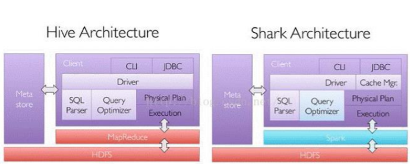
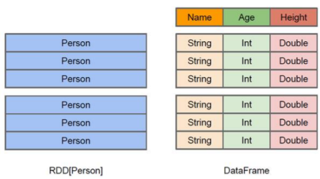
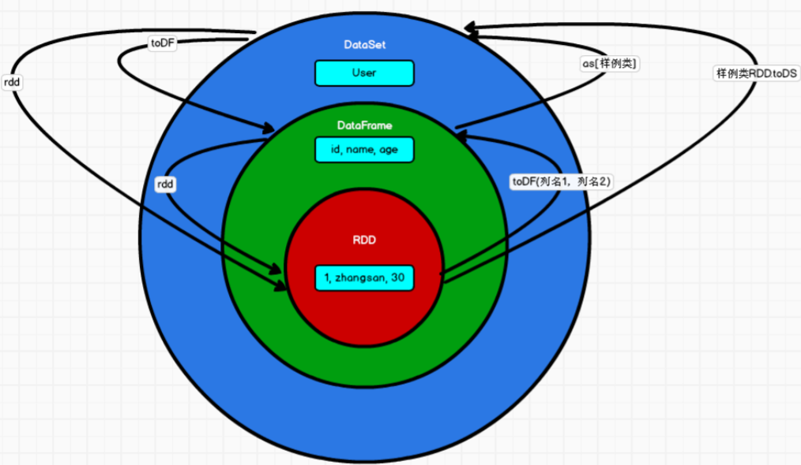
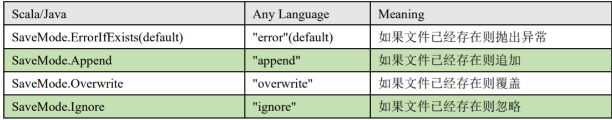
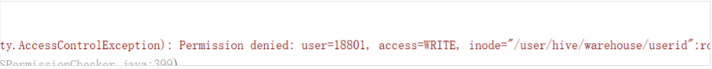

# Spark SQL概述 

SparkSQL概念：Spark SQL 是 Spark 用于结构化数据(structured data)处理的 Spark 模块。


## **Hive and SparkSQL**

SparkSQL 的前身是 Shark，给熟悉 RDBMS 但又不理解 MapReduce 的技术人员提供快速上手的工具。


Hive 是早期唯一运行在 Hadoop 上的 SQL-on-Hadoop 工具。但是 MapReduce 计算过程中大量的中间磁盘落地过程消耗了大量的 I/O，降低的运行效率，为了提高 SQL-on-Hadoop的效率，大量的 SQL-on-Hadoop 工具开始产生，其中表现较为突出的是：

- Drill
- Impala
- Shark
- 其中 Shark 是伯克利实验室 Spark 生态环境的组件之一，是基于 Hive 所开发的工具，它修改了下图所示的右下角的内存管理、物理计划、执行三个模块，并使之能运行在 Spark 引擎上。




## SparkSQL 特点

**易整合**

- 无缝的整合了 SQL 查询和 Spark 编程


**统一的数据访问**

- 使用相同的方式连接不同的数据源


**兼容 Hive**

- 在已有的仓库上直接运行 SQL 或者 HiveQL


**标准数据连接**

- 通过 JDBC 或者 ODBC 来连接


## **DataFrame 概念**

DataFrame 是一种以 RDD 为基础的分布式数据集，类似于传统数据库中的二维表格。DataFrame 与 RDD 的主要区别在于，前者带有 schema 元信息，即 DataFrame所表示的二维表数据集的每一列都带有名称和类型。这使得 Spark SQL 得以洞察更多的结构信息，从而对藏于 DataFrame 背后的数据源以及作用于 DataFrame 之上的变换进行了针对性的优化，最终达到大幅提升运行时效率的目标。反观 RDD，由于无从得知所存数据元素的
具体内部结构，Spark Core 只能在 stage 层面进行简单、通用的流水线优化。同时，与 Hive 类似，DataFrame 也支持嵌套数据类型（struct、array 和 map）。从 API易用性的角度上看，DataFrame API 提供的是一套高层的关系操作，比函数式的 RDD API 要更加友好，门槛更低。




**DataFrame 和 RDD 的区别：**
左侧的 RDD[Person]虽然以 Person 为类型参数，但 Spark 框架本身不了解 Person 类的内部结构。而右侧的 DataFrame 却提供了详细的结构信息，使得 Spark SQL 可以清楚地知道该数据集中包含哪些列，每列的名称和类型各是什么。


DataFrame 是为数据提供了 Schema 的视图。可以把它当做数据库中的一张表来对待。

DataFrame 也是懒执行的，但性能上比 RDD 要高，主要原因：优化的执行计划，即查询计划通过 Spark catalyst optimiser 进行优化。


## **DataSet 概念**

DataSet 是分布式数据集合。DataSet 是 Spark 1.6 中添加的一个新抽象，是 DataFrame的一个扩展。它提供了 RDD 的优势（强类型，使用强大的 lambda 函数的能力）以及 SparkSQL 优化执行引擎的优点。DataSet 也可以使用功能性的转换（操作 map，flatMap，filter等等）。

- DataSet 是 DataFrame API 的一个扩展，是 SparkSQL 最新的数据抽象
  - 用户友好的 API 风格，既具有类型安全检查也具有 DataFrame 的查询优化特性；
  - 用样例类来对 DataSet 中定义数据的结构信息，样例类中每个属性的名称直接映射到


- DataSet 中的字段名称；
  - DataSet 是强类型的。比如可以有 DataSet[Car]，DataSet[Person]。
  - DataFrame 是 DataSet 的特列，DataFrame=DataSet[Row] ，所以可以通过 as 方法将
  - DataFrame 转换为 DataSet。Row 是一个类型，跟 Car、Person 这些的类型一样，所有的
    表结构信息都用 Row 来表示。获取数据时需要指定顺序


## SparkSQL 核心编程

Spark Core 中，如果想要执行应用程序，需要首先构建上下文环境对象 **SparkContext**，Spark SQL 其实可以理解为对 Spark Core 的一种封装，不仅仅在模型上进行了封装，上下文环境对象也进行了封装。在老的版本中，SparkSQL 提供两种 SQL 查询起始点：一个叫 **SQLContext**，用于 Spark自己提供的 SQL 查询；一个叫**HiveContext**，用于连接 Hive 的查询。SparkSession 是 Spark 最新的 SQL 查询起始点，实质上是 SQLContext 和 HiveContext的组合，所以在 SQLContex 和 HiveContext 上可用的 API 在 SparkSession 上同样是可以使用
的。SparkSession 内部封装了 SparkContext，所以计算实际上是由 sparkContext 完成的。当使用 spark-shell 的时候, spark 框架会自动的创建一个名称叫做 spark 的 SparkSession 对象, 就像以前可以自动获取到一个 sc 来表示 SparkContext 对象一样。


**DataFrame**

Spark SQL 的 DataFrame API 允许我们使用 DataFrame 而不用必须去注册临时表或者 生成 SQL 表达式。DataFrame API 既有 transformation 操作也有 action 操作。 


创建 DataFrame


在 Spark SQL 中 SparkSession 是创建 DataFrame 和执行 SQL 的入口，创建 DataFrame 有三种方式：通过 Spark 的数据源进行创建；从一个存在的 RDD 进行转换；还可以从 Hive Table 进行查询返回

从 Spark 数据源进行创建
查看 Spark 支持创建文件的数据源格式

```scala
scala> spark.read.

csv format jdbc json load option options orc parquet schema table text textFile
```

在 spark 的 bin/data 目录中创建 user.json 文件

```scala
{"username":"zhangsan","age":20}
```


读取 json 文件创建 DataFrame

```scala
scala> val df = spark.read.json("data/user.json")
df: org.apache.spark.sql.DataFrame = [age: bigint， username: string]
```

注意：如果从内存中获取数据，spark 可以知道数据类型具体是什么。如果是数字，默认作
为 Int 处理；但是从文件中读取的数字，不能确定是什么类型，所以用 bigint 接收，可以和
Long 类型转换，但是和 Int 不能进行转换

展示结果

```scala
+---+--------+
|age|username|
+---+--------+
| 20|zhangsan|
+---+--------+
```


2) 从 RDD 进行转换


3) 从 Hive Table 进行查询返回


SQL 语法

SQL 语法风格是指我们查询数据的时候使用 SQL 语句来查询，这种风格的查询必须要 有临时视图或者全局视图来辅助


1) 读取 JSON 文件创建 DataFrame


2. ```scala
   scala> val df = spark.read.json("data/user.json")
   df: org.apache.spark.sql.DataFrame = [age: bigint， username: string]
   ```
   
   对 DataFrame 创建一个临时表

```scala
scala> df.createOrReplaceTempView("people")
```


3. 通过 SQL 语句实现查询全表

  ```scala
  scala> val sqlDF = spark.sql("SELECT * FROM people")
  sqlDF: org.apache.spark.sql.DataFrame = [age: bigint， name: string]
  ```

  结果展示

  ```scala
  scala> sqlDF.show
  +---+--------+
  |age|username|
  +---+--------+
  | 20|zhangsan|
  | 30| lisi|
  | 40| wangwu|
  +---+--------+
  ```

注意：普通临时表是 Session 范围内的，如果想应用范围内有效，可以使用全局临时表。使 用全局临时表时需要全路径访问，如：global_temp.people

5) 对于 DataFrame 创建一个全局表

```scala
scala> df.createGlobalTempView("people")
```


6) 通过 SQL 语句实现查询全表

```scala
scala> spark.sql("SELECT * FROM global_temp.people").show()
+---+--------+
|age|username|
+---+--------+
| 20|zhangsan|
| 30| lisi|
| 40| wangwu|
+---+--------+
scala> spark.newSession().sql("SELECT * FROM global_temp.people").show()
+---+--------+
|age|username|
+---+--------+
| 20|zhangsan|
| 30| lisi|
| 40| wangwu|
+---+--------+
```

DSL 语法


DataFrame 提供一个特定领域语言(domain-specific language, DSL)去管理结构化的数据。 可以在 Scala, Java, Python 和 R 中使用 DSL，使用 DSL 语法风格不必去创建临时视图了

1) 创建一个 DataFrame

```scala
scala> val df = spark.read.json("data/user.json")
df: org.apache.spark.sql.DataFrame = [age: bigint， name: string]
```

2) 查看 DataFrame 的 Schema 信息

```scala
scala> df.printSchema
root
|-- age: Long (nullable = true)
|-- username: string (nullable = true)
```


3) 只查看"username"列数据，

```scala
scala> df.select("username").show()
+--------+
|username|
+--------+
|zhangsan|
| lisi|
| wangwu|
+--------+
```

4) 查看"username"列数据以及"age+1"数据

注意:涉及到运算的时候, 每列都必须使用$, 或者采用引号表达式：单引号+字段名

```scala
scala> df.select($"username",$"age" + 1).show
scala> df.select('username, 'age + 1).show()
scala> df.select('username, 'age + 1 as "newage").show()
+--------+---------+
|username|(age + 1)|
+--------+---------+
|zhangsan| 21|
| lisi| 31|
| wangwu| 41|
+--------+---------+
```

5) 查看"age"大于"30"的数据

```scala
scala> df.filter($"age">30).show
+---+---------+
|age| username|
+---+---------+
| 40| wangwu|
+---+---------+
```

6) 按照"age"分组，查看数据条数

```scala
scala> df.groupBy("age").count.show
+---+-----+
|age|count|
+---+-----+
| 20| 1|
| 30| 1|
| 40| 1|
+---+-----+
```

## **RDD 转换为 DataFrame**

在 IDEA 中开发程序时，如果需要 RDD 与 DF 或者 DS 之间互相操作，那么需要引入 import spark.implicits._ 这里的 spark 不是 Scala 中的包名，而是创建的 sparkSession 对象的变量名称，所以必 须先创建 SparkSession 对象再导入。这里的 spark 对象不能使用 var 声明，因为 Scala 只支持 val 修饰的对象的引入。 spark-shell 中无需导入，自动完成此操作。 

```scala
scala> val idRDD = sc.textFile("data/id.txt")
scala> idRDD.toDF("id").show
+---+
| id|
+---+
| 1|
| 2|
| 3|
| 4|
+---+


// 实际开发中，一般通过样例类将 RDD 转换为 DataFrame

scala> case class User(name:String, age:Int)
defined class User
scala> sc.makeRDD(List(("zhangsan",30), ("lisi",40))).map(t=>User(t._1,
t._2)).toDF.show
+--------+---+
| name|age|
+--------+---+
|zhangsan| 30|
| lisi| 40|
+--------+---+
```

## **DataFrame 转换为 RDD**

DataFrame 其实就是对 RDD 的封装，所以可以直接获取内部的 RDD

```scala
scala> val df = sc.makeRDD(List(("zhangsan",30), ("lisi",40))).map(t=>User(t._1,
t._2)).toDF
df: org.apache.spark.sql.DataFrame = [name: string, age: int]
scala> val rdd = df.rdd
rdd: org.apache.spark.rdd.RDD[org.apache.spark.sql.Row] = MapPartitionsRDD[46]
at rdd at <console>:25
scala> val array = rdd.collect
array: Array[org.apache.spark.sql.Row] = Array([zhangsan,30], [lisi,40])


// 注意：此时得到的 RDD 存储类型为 Row

scala> array(0)
res28: org.apache.spark.sql.Row = [zhangsan,30]
scala> array(0)(0)
res29: Any = zhangsan
scala> array(0).getAs[String]("name")
res30: String = zhangsan
```

## **DataSet**

DataSet 是具有强类型的数据集合，需要提供对应的类型信息。


创建 DataSet

1） 使用样例类序列创建 DataSet

```scala
scala> case class Person(name: String, age: Long)
defined class Person
scala> val caseClassDS = Seq(Person("zhangsan",2)).toDS()
caseClassDS: org.apache.spark.sql.Dataset[Person] = [name: string, age: Long]
scala> caseClassDS.show
+---------+---+
| name|age|
+---------+---+
| zhangsan| 2|
+---------+---+
```


2） 使用基本类型的序列创建 DataSet

```scala
scala> val ds = Seq(1,2,3,4,5).toDS
ds: org.apache.spark.sql.Dataset[Int] = [value: int]
scala> ds.show
+-----+
|value|
+-----+
| 1|
| 2|
| 3|
| 4|
| 5|
+-----+
```

注意：在实际使用的时候，很少用到把序列转换成DataSet，更多的是通过RDD来得到DataSet


## **RDD 转换为 DataSet**


SparkSQL 能够自动将包含有 case 类的 RDD 转换成 DataSet，case 类定义了 table 的结 构，case 类属性通过反射变成了表的列名。Case 类可以包含诸如 Seq 或者 Array 等复杂的结 构。

```scala
scala> case class User(name:String, age:Int)
defined class User
scala> sc.makeRDD(List(("zhangsan",30), ("lisi",49))).map(t=>User(t._1,
t._2)).toDS
res11: org.apache.spark.sql.Dataset[User] = [name: string, age: int]
```

DataFrame 和 DataSet 转换

DataFrame 其实是 DataSet 的特例，所以它们之间是可以互相转换的。 

DataFrame 转换为 DataSet

```scala
scala> case class User(name:String, age:Int)
defined class User
scala> val df = sc.makeRDD(List(("zhangsan",30),
("lisi",49))).toDF("name","age")
df: org.apache.spark.sql.DataFrame = [name: string, age: int]
scala> val ds = df.as[User]
ds: org.apache.spark.sql.Dataset[User] = [name: string, age: int]


// DataSet 转换为 DataFrame

scala> val ds = df.as[User]
ds: org.apache.spark.sql.Dataset[User] = [name: string, age: int]
scala> val df = ds.toDF
df: org.apache.spark.sql.DataFrame = [name: string, age: int]
```


## **RDD、DataFrame、DataSet 三者的关系**

在 SparkSQL 中 Spark 为我们提供了两个新的抽象，分别是 DataFrame 和 DataSet。他们
和 RDD 有什么区别呢？首先从版本的产生上来看：

- Spark1.0 => RDD
- Spark1.3 => DataFrame
- Spark1.6 => Dataset
  

如果同样的数据都给到这三个数据结构，他们分别计算之后，都会给出相同的结果。不
同是的他们的执行效率和执行方式。在后期的 Spark 版本中，DataSet 有可能会逐步取代 RDD
和 DataFrame 成为唯一的 API 接口。


## **三者的共性**

- RDD、DataFrame、DataSet 全都是 spark 平台下的分布式弹性数据集，为处理超大型数
  据提供便利;

  

- 三者都有惰性机制，在进行创建、转换，如 map 方法时，不会立即执行，只有在遇到Action 如 foreach 时，三者才会开始遍历运算;


- 三者有许多共同的函数，如 filter，排序等;


- 在对 DataFrame 和 Dataset 进行操作许多操作都需要这个包:import spark.implicits._（在创建好 SparkSession 对象后尽量直接导入）


- 三者都会根据 Spark 的内存情况自动缓存运算，这样即使数据量很大，也不用担心会内存溢出


- 三者都有 partition 的概念


- DataFrame 和 DataSet 均可使用模式匹配获取各个字段的值和类型


## **三者的区别**

1) RDD
* RDD 一般和 spark mllib 同时使用
* RDD 不支持 sparksql 操作
2) DataFrame
* 与 RDD 和 Dataset 不同，DataFrame 每一行的类型固定为 Row，每一列的值没法直接访问，只有通过解析才能获取各个字段的值
* DataFrame 与 DataSet 一般不与 spark mllib 同时使用
* DataFrame 与 DataSet 均支持 SparkSQL 的操作，比如 select，groupby 之类，还能注册临时表/视窗，进行 sql 语句操作
* DataFrame 与 DataSet 支持一些特别方便的保存方式，比如保存成 csv，可以带上表头

3) DataSet
- Dataset 和 DataFrame 拥有完全相同的成员函数，区别只是每一行的数据类型不同。
- DataFrame 其实就是 DataSet 的一个特例 type DataFrame = Dataset[Row]
- DataFrame 也可以叫 Dataset[Row],每一行的类型是 Row，不解析，每一行究竟有哪
  些字段，各个字段又是什么类型都无从得知，只能用上面提到的 getAS 方法或者共
  性中的第七条提到的模式匹配拿出特定字段。而 Dataset 中，每一行是什么类型是
  不一定的，在自定义了 case class 之后可以很自由的获得每一行的信息




## 用户自定义函数

用户可以通过 spark.udf 功能添加自定义函数，实现自定义功能。

**UDF**

1. 创建 DataFrame

  ```scala
  scala> val df = spark.read.json("data/user.json")
  df: org.apache.spark.sql.DataFrame = [age: bigint， username: string]
  ```

  注册 UDF

  ```scala
  scala> spark.udf.register("addName",(x:String)=> "Name:"+x)
  res9: org.apache.spark.sql.expressions.UserDefinedFunction =
  UserDefinedFunction(<function1>,StringType,Some(List(StringType)))
  ```


3. 创建临时表

  ```scala
  scala> df.createOrReplaceTempView("people")
  ```

4. 应用 UDF

  ```scala
  scala> spark.sql("Select addName(name),age from people").show()
  ```

## UDAF
强类型的 Dataset 和弱类型的 DataFrame 都提供了相关的聚合函数， 如 count()，countDistinct()，avg()，max()，min()。除此之外，用户可以设定自己的自定义聚合函数。通过继承 UserDefinedAggregateFunction 来实现用户自定义弱类型聚合函数。从 Spark3.0 版本后，UserDefinedAggregateFunction 已经不推荐使用了。可以统一采用强类型聚合函数Aggregator

需求：计算平均工资 一个需求可以采用很多种不同的方法实现需求


1) 实现方式 - RDD

```scala
val conf: SparkConf = new SparkConf().setAppName("app").setMaster("local[*]")
val sc: SparkContext = new SparkContext(conf)
val res: (Int, Int) = sc.makeRDD(List(("zhangsan", 20), ("lisi", 30), ("wangw",
40))).map {
 case (name, age) => {
 (age, 1)
 }
}.reduce {
 (t1, t2) => {
(t1._1 + t2._1, t1._2 + t2._2)
 }
}
println(res._1/res._2)
// 关闭连接
sc.stop()
```


2. 实现方式 - 累加器

  ```scal
  class MyAC extends AccumulatorV2[Int,Int]{
      var sum:Int = 0
      var count:Int = 0
      override def isZero: Boolean = {
      return sum ==0 && count == 0
      }
      override def copy(): AccumulatorV2[Int, Int] = {
      val newMyAc = new MyAC
      newMyAc.sum = this.sum
      newMyAc.count = this.count
      newMyAc
      }
      override def reset(): Unit = {
      sum =0
      count = 0
      }
      override def add(v: Int): Unit = {
      sum += v
      count += 1
      }
      override def merge(other: AccumulatorV2[Int, Int]): Unit = {
      other match {
      case o:MyAC=>{
      sum += o.sum
      count += o.count
      }
      case _=>
      }
      }
      override def value: Int = sum/count
     }
  
  
  3) 
  ```

  ## **实现方式 - UDAF - 弱类型**

```scala
/*
定义类继承 UserDefinedAggregateFunction，并重写其中方法
*/
class MyAveragUDAF extends UserDefinedAggregateFunction {
 // 聚合函数输入参数的数据类型
 def inputSchema: StructType =
StructType(Array(StructField("age",IntegerType)))
 // 聚合函数缓冲区中值的数据类型(age,count)
 def bufferSchema: StructType = {

StructType(Array(StructField("sum",LongType),StructField("count",LongType)))
 }
// 函数返回值的数据类型
 def dataType: DataType = DoubleType
 // 稳定性：对于相同的输入是否一直返回相同的输出。
 def deterministic: Boolean = true
 // 函数缓冲区初始化
 def initialize(buffer: MutableAggregationBuffer): Unit = {
 // 存年龄的总和
 buffer(0) = 0L
 // 存年龄的个数
 buffer(1) = 0L
 }
 // 更新缓冲区中的数据
 def update(buffer: MutableAggregationBuffer,input: Row): Unit = {
 if (!input.isNullAt(0)) {
 buffer(0) = buffer.getLong(0) + input.getInt(0)
 buffer(1) = buffer.getLong(1) + 1
 }
 }
 // 合并缓冲区
 def merge(buffer1: MutableAggregationBuffer,buffer2: Row): Unit = {
 buffer1(0) = buffer1.getLong(0) + buffer2.getLong(0)
 buffer1(1) = buffer1.getLong(1) + buffer2.getLong(1)
 }
 // 计算最终结果
 def evaluate(buffer: Row): Double = buffer.getLong(0).toDouble /
buffer.getLong(1)
}
。。。
//创建聚合函数
var myAverage = new MyAveragUDAF
//在 spark 中注册聚合函数
spark.udf.register("avgAge",myAverage)
spark.sql("select avgAge(age) from user").show()
```


4) 实现方式 - UDAF - 强类型

```scala
//输入数据类型
case class User01(username:String,age:Long)
//缓存类型
case class AgeBuffer(var sum:Long,var count:Long)
/**

 * 定义类继承 org.apache.spark.sql.expressions.Aggregator
 * 重写类中的方法
   */
   class MyAveragUDAF1 extends Aggregator[User01,AgeBuffer,Double]{
    override def zero: AgeBuffer = {
    AgeBuffer(0L,0L)
    }
    override def reduce(b: AgeBuffer, a: User01): AgeBuffer = {
   b.sum = b.sum + a.age
    b.count = b.count + 1
    b
    }
    override def merge(b1: AgeBuffer, b2: AgeBuffer): AgeBuffer = {
    b1.sum = b1.sum + b2.sum
    b1.count = b1.count + b2.count
    b1
    }
    override def finish(buff: AgeBuffer): Double = {
    buff.sum.toDouble/buff.count
    }
    //DataSet 默认额编解码器，用于序列化，固定写法
    //自定义类型就是 product 自带类型根据类型选择
    override def bufferEncoder: Encoder[AgeBuffer] = {
    Encoders.product
    }
    override def outputEncoder: Encoder[Double] = {
    Encoders.scalaDouble
    }
   }
   。。。
   //封装为 DataSet
   val ds: Dataset[User01] = df.as[User01]
   //创建聚合函数
   var myAgeUdaf1 = new MyAveragUDAF1
   //将聚合函数转换为查询的列
   val col: TypedColumn[User01, Double] = myAgeUdaf1.toColumn
   //查询
   ds.select(col).show()
```

Spark3.0 版本可以采用强类型的 Aggregator 方式代替 UserDefinedAggregateFunction 

```scala
// TODO 创建 UDAF 函数
val udaf = new MyAvgAgeUDAF
// TODO 注册到 SparkSQL 中
spark.udf.register("avgAge", functions.udaf(udaf))
// TODO 在 SQL 中使用聚合函数
// 定义用户的自定义聚合函数
spark.sql("select avgAge(age) from user").show
// **************************************************
case class Buff( var sum:Long, var cnt:Long )
// totalage, count
class MyAvgAgeUDAF extends Aggregator[Long, Buff, Double]{
 override def zero: Buff = Buff(0,0)
 override def reduce(b: Buff, a: Long): Buff = {
 b.sum += a
 b.cnt += 1
 b
 }
override def merge(b1: Buff, b2: Buff): Buff = {
 b1.sum += b2.sum
 b1.cnt += b2.cnt
 b1
 }
 override def finish(reduction: Buff): Double = {
 reduction.sum.toDouble/reduction.cnt
 }
 override def bufferEncoder: Encoder[Buff] = Encoders.product
 override def outputEncoder: Encoder[Double] = Encoders.scalaDouble
}
```

## **数据的加载和保存**

通用的加载和保存方式
SparkSQL 提供了通用的保存数据和数据加载的方式。这里的通用指的是使用相同的 API，根据不同的参数读取和保存不同格式的数据，SparkSQL 默认读取和保存的文件格式 为 parquet


1. 加载数据
  spark.read.load 是加载数据的通用方法

  ```scala
  scala> spark.read.
  csv format jdbc json load option options orc parquet schema
  table text textFile
  ```

如果读取不同格式的数据，可以对不同的数据格式进行设定

```scala
scala> spark.read.format("…")[.option("…")].load("…")
```

format("…")：指定加载的数据类型，包括"csv"、"jdbc"、"json"、"orc"、"parquet"和
"textFile"。
load("…")：在"csv"、"jdbc"、"json"、"orc"、"parquet"和"textFile"格式下需要传入加载
数据的路径。
option("…")：在"jdbc"格式下需要传入 JDBC 相应参数，url、user、password 和 dbtable
使用 read API 先把文件加载到 DataFrame 然后再查询，其实，也可以直接在文件上进行查询: 文件格式.`文件路径`

```scala
scala>spark.sql("select * from json.`/opt/module/data/user.json`").show
```

2. 保存数据
  df.write.save 是保存数据的通用方法

  ```scala
  scala>df.write.
  csv jdbc json orc parquet textFile… …
  ```

如果保存不同格式的数据，可以对不同的数据格式进行设定

```scala
scala>df.write.format("…")[.option("…")].save("…") 
```

format("…")：指定保存的数据类型，包括"csv"、"jdbc"、"json"、"orc"、"parquet"和
"textFile"。
save ("…")：在"csv"、"orc"、"parquet"和"textFile"格式下需要传入保存数据的路径。
option("…")：在"jdbc"格式下需要传入 JDBC 相应参数，url、user、password 和 dbtable,保存操作可以使用 SaveMode, 用来指明如何处理数据，使用 mode()方法来设置。有一点很重要: 这些 SaveMode 都是没有加锁的, 也不是原子操作。SaveMode 是一个枚举类，其中的常量包括：




## Parquet

Spark SQL 的默认数据源为 Parquet 格式。Parquet 是一种能够有效存储嵌套数据的列式
存储格式。
数据源为 Parquet 文件时，Spark SQL 可以方便的执行所有的操作，不需要使用 format。
修改配置项 spark.sql.sources.default，可修改默认数据源格式。


1) 加载数据

```scala
scala> val df = spark.read.load("examples/src/main/resources/users.parquet")
scala> df.show
```

2) 保存数据

```scala
scala> var df = spark.read.json("/opt/module/data/input/people.json")
//保存为 parquet 格式
scala> df.write.mode("append").save("/opt/module/data/output")
```

## JSON
Spark SQL 能够自动推测 JSON 数据集的结构，并将它加载为一个 Dataset[Row]. 可以通过 SparkSession.read.json()去加载 JSON 文件。
注意：Spark 读取的 JSON 文件不是传统的 JSON 文件，每一行都应该是一个 JSON 串。格
式如下：

```scala
{"name":"Michael"}
{"name":"Andy"， "age":30}
[{"name":"Justin"， "age":19},{"name":"Justin"， "age":19}]
```

1）导入隐式转换

```scala
import spark.implicits._ 
```

2）加载 JSON 文件

```scala
val path = "/opt/module/spark-local/people.json"
val peopleDF = spark.read.json(path)
```

3）创建临时表

```scala
peopleDF.createOrReplaceTempView("people")
```

4）数据查询

```scala
val teenagerNamesDF = spark.sql("SELECT name FROM people WHERE age BETWEEN 13 AND 19")
teenagerNamesDF.show()
+------+
| name|
+------+
|Justin|
+------+
```


## **CSV**

Spark SQL 可以配置 CSV 文件的列表信息，读取 CSV 文件,CSV 文件的第一行设置为 数据列

```scala
spark.read.format("csv").option("sep", ";").option("inferSchema",
"true").option("header", "true").load("data/user.csv")
```

## MySQL

Spark SQL 可以通过 JDBC 从关系型数据库中读取数据的方式创建 DataFrame，
通过对 DataFrame 一系列的计算后，还可以将数据再写回关系型数据库中。
如果使用 spark-shell 操 作，可在启动 shell 时指定相关的数据库驱动路径或者将相关的数据库驱动放到 spark 的类 路径下。

```scala
bin/spark-shell
--jars mysql-connector-java-5.1.27-bin.jar
```

演示在 Idea 中通过 JDBC 对 Mysql 进行操作

1）导入依赖

```xml
<dependency>
 <groupId>mysql</groupId>
 <artifactId>mysql-connector-java</artifactId>
 <version>5.1.27</version>
</dependency>
```

2）读取数据

```scala
val conf: SparkConf = new
SparkConf().setMaster("local[*]").setAppName("SparkSQL")
//创建 SparkSession 对象
val spark: SparkSession = SparkSession.builder().config(conf).getOrCreate()
import spark.implicits._
//方式 1：通用的 load 方法读取
spark.read.format("jdbc")
 .option("url", "jdbc:mysql://linux1:3306/spark-sql")
 .option("driver", "com.mysql.jdbc.Driver")
.option("user", "root")
 .option("password", "123123")
 .option("dbtable", "user")
 .load().show
//方式 2:通用的 load 方法读取 参数另一种形式
spark.read.format("jdbc")
 .options(Map("url"->"jdbc:mysql://linux1:3306/spark-sql?user=root&password=
123123",
 "dbtable"->"user","driver"->"com.mysql.jdbc.Driver")).load().show
//方式 3:使用 jdbc 方法读取
val props: Properties = new Properties()
props.setProperty("user", "root")
props.setProperty("password", "123123")
val df: DataFrame = spark.read.jdbc("jdbc:mysql://linux1:3306/spark-sql",
"user", props)
df.show
//释放资源
spark.stop()
```

3）写入数据

```scala
case class User2(name: String, age: Long)
。。。
val conf: SparkConf = new
SparkConf().setMaster("local[*]").setAppName("SparkSQL")
//创建 SparkSession 对象
val spark: SparkSession = SparkSession.builder().config(conf).getOrCreate()
import spark.implicits._
val rdd: RDD[User2] = spark.sparkContext.makeRDD(List(User2("lisi", 20),
User2("zs", 30)))
val ds: Dataset[User2] = rdd.toDS
//方式 1：通用的方式 format 指定写出类型
ds.write
 .format("jdbc")
 .option("url", "jdbc:mysql://linux1:3306/spark-sql")
 .option("user", "root")
 .option("password", "123123")
 .option("dbtable", "user")
 .mode(SaveMode.Append)
 .save()
//方式 2：通过 jdbc 方法
val props: Properties = new Properties()
props.setProperty("user", "root")
props.setProperty("password", "123123")
ds.write.mode(SaveMode.Append).jdbc("jdbc:mysql://linux1:3306/spark-sql",
"user", props)
//释放资源
spark.stop()
```

## Hive

Apache Hive 是 Hadoop 上的 SQL 引擎，Spark SQL 编译时可以包含 Hive 支持，也 可以不包含。包含 Hive 支持的 Spark SQL 可以支持 Hive 表访问、UDF (用户自定义函数)以及 Hive 查询语言(HiveQL/HQL)等。需要强调的一点是，如果要在 Spark SQL 中包含Hive 的库，并不需要事先安装 Hive。一般来说，最好还是在编译 Spark SQL 时引入 Hive支持，这样就可以使用这些特性了。如果你下载的是二进制版本的 Spark，它应该已经在编
译时添加了 Hive 支持。若要把 Spark SQL 连接到一个部署好的 Hive 上，你必须把 hive-site.xml 复制到
Spark 的配置文件目录中($SPARK_HOME/conf)。即使没有部署好 Hive，Spark SQL 也可以运行。 需要注意的是，如果你没有部署好 Hive，Spark SQL 会在当前的工作目录中创建出自己的 Hive 元数据仓库，叫作 metastore_db。此外，如果你尝试使用 HiveQL 中的CREATE TABLE (并非 CREATE EXTERNAL TABLE)语句来创建表，这些表会被放在你默认的文件系统中的 /user/hive/warehouse 目录中(如果你的 classpath 中有配好的
hdfs-site.xml，默认的文件系统就是 HDFS，否则就是本地文件系统)。


spark-shell 默认是 Hive 支持的；代码中是默认不支持的，需要手动指定（加一个参数即可）。


1）内嵌的 HIVE

如果使用 Spark 内嵌的 Hive, 则什么都不用做, 
直接使用即可. Hive 的元数据存储在 derby 中, 默认仓库地址:$SPARK_HOME/spark-warehouse

```scala
scala> spark.sql("show tables").show
。。。
+--------+---------+-----------+
|database|tableName|isTemporary|
+--------+---------+-----------+
+--------+---------+-----------+
scala> spark.sql("create table aa(id int)")
。。。
scala> spark.sql("show tables").show
+--------+---------+-----------+
|database|tableName|isTemporary|
+--------+---------+-----------+
| default| aa| false|
+--------+---------+-----------+
```


向表加载本地数据

```scala
scala> spark.sql("load data local inpath 'input/ids.txt' into table aa")
。。。
scala> spark.sql("select * from aa").show
+---+
| id|
+---+
| 1|
| 2|
| 3|
```


在实际使用中, 几乎没有任何人会使用内置的 Hive


2）外部的 HIVE
如果想连接外部已经部署好的 Hive，需要通过以下几个步骤：

Spark 要接管 Hive 需要把 hive-site.xml 拷贝到 conf/目录下
把 Mysql 的驱动 copy 到 jars/目录下
如果访问不到 hdfs，则需要把 core-site.xml 和 hdfs-site.xml 拷贝到 conf/目录下
重启 spark-shell

```scala
scala> spark.sql("show tables").show
20/04/25 22:05:14 WARN ObjectStore: Failed to get database global_temp, returning
NoSuchObjectException
+--------+--------------------+-----------+
|database| tableName|isTemporary|
+--------+--------------------+-----------+
| default| emp| false|
| default|hive_hbase_emp_table| false|
| default| relevance_hbase_emp| false|
| default| staff_hive| false|
| default| ttt| false|
| default| user_visit_action| false|
+--------+--------------------+-----------+
```


3）运行 Spark SQL CLI
Spark SQL CLI 可以很方便的在本地运行 Hive 元数据服务以及从命令行执行查询任务。在 Spark 目录下执行如下命令启动 Spark SQL CLI，直接执行 SQL 语句，类似一 Hive 窗口

```sh
bin/spark-sql
```

4）运行 Spark beeline
Spark Thrift Server 是 Spark 社区基于 HiveServer2 实现的一个 Thrift 服务。旨在无缝兼容HiveServer2。因为 Spark Thrift Server 的接口和协议都和 HiveServer2 完全一致，因此我们部署好 Spark Thrift Server 后，可以直接使用 hive 的 beeline 访问 Spark Thrift Server 执行相关语句。Spark Thrift Server 的目的也只是取代 HiveServer2，因此它依旧可以和 Hive Metastore进行交互，获取到 hive 的元数据。
如果想连接 Thrift Server，需要通过以下几个步骤：

Spark 要接管 Hive 需要把 hive-site.xml 拷贝到 conf/目录下
把 Mysql 的驱动 copy 到 jars/目录下
如果访问不到 hdfs，则需要把 core-site.xml 和 hdfs-site.xml 拷贝到 conf/目录下
启动 Thrift Server

```scala
sbin/start-thriftserver.sh
```

使用 beeline 连接 Thrift Server

```scala
bin/beeline -u jdbc:hive2://linux1:10000 -n root
```

5）代码操作 Hive

1）导入依赖

```xml
<dependency>
 <groupId>org.apache.spark</groupId>
 <artifactId>spark-hive_2.12</artifactId>
 <version>3.0.0</version>
</dependency>
<dependency>
 <groupId>org.apache.hive</groupId>
 <artifactId>hive-exec</artifactId>
 <version>1.2.1</version>
</dependency>
<dependency>
 <groupId>mysql</groupId>
 <artifactId>mysql-connector-java</artifactId>
 <version>5.1.27</version>
</dependency>
```

2）将 hive-site.xml 文件拷贝到项目的 resources 目录中，代码实现

```scala
//创建 SparkSession
val spark: SparkSession = SparkSession
 .builder()
 .enableHiveSupport()
 .master("local[*]")
 .appName("sql")
 .getOrCreate()
```


注意：在开发工具中创建数据库默认是在本地仓库，通过参数修改数据库仓库的地址:

config("spark.sql.warehouse.dir", "hdfs://linux1:8020/user/hive/warehouse") 

如果在执行操作时，出现如下错误：



可以代码最前面增加如下代码解决： 

System.setProperty("HADOOP_USER_NAME", "root")


此处的 root 改为自己的 hadoop 用户名称


