# Spark 优化

## **常规性能调优一：最优资源配置**

park 性能调优的第一步，就是为任务分配更多的资源，在一定范围内，增加资源的分配与性能的提升是成正比的，实现了最优的资源配置后，在此基础上再考虑进行后面论述的性能调优策略。资源的分配在使用脚本提交 Spark 任务时进行指定，标准的 Spark 任务提交脚本如下所
示：

```scala
bin/spark-submit \
--class com.atguigu.spark.Analysis \
--master yarn
--deploy-mode cluster
--num-executors 80 \
--driver-memory 6g \
--executor-memory 6g \
--executor-cores 3 \
/usr/opt/modules/spark/jar/spark.jar \
```


可以进行分配的资源如表所示：

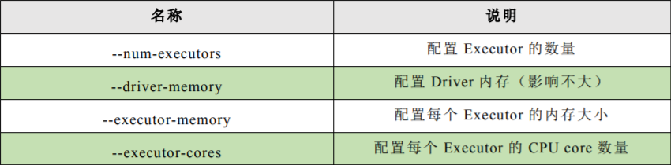


调节原则：尽量将任务分配的资源调节到可以使用的资源的最大限度。对于具体资源的分配，我们分别讨论 Spark 的两种 Cluster 运行模式：


第一种是 Spark Standalone 模式，在提交任务前，一定知道或者可以从运维部门获取到你可以使用的资源情况，在编写 submit 脚本的时候，就根据可用的资源情况进行资源的分配，比如说集群有 15 台机器，每台机器为 8G 内存，2 个 CPU core，那么就指定 15 个 Executor，每个 Executor 分配 8G 内存，2 个 CPU core。


第二种是 Spark Yarn 模式，由于 Yarn 使用资源队列进行资源的分配和调度，在编写submit 脚本的时候，就根据 Spark 作业要提交到的资源队列，进行资源的分配，比如资源队列有 400G 内存，100 个 CPU core，那么指定 50 个 Executor，每个 Executor 分配8G 内存，2 个 CPU core。

**对各项资源进行了调节后，得到的性能提升会有如下表现：**

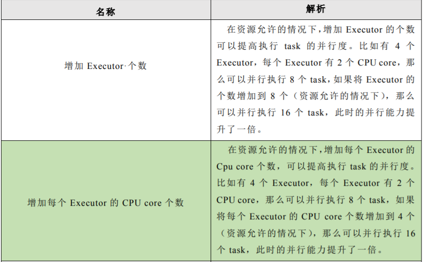

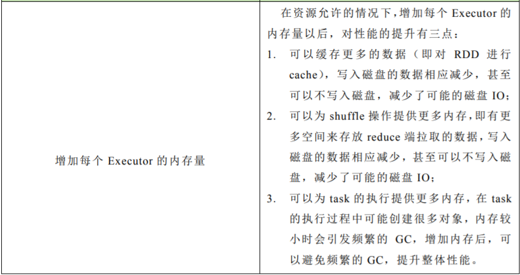


生产环境 Spark submit 脚本配置

```scala
bin/spark-submit \
--class com.atguigu.spark.WordCount \
--master yarn\
--deploy-mode cluster\
--num-executors 80 \
--driver-memory 6g \
--executor-memory 6g \
--executor-cores 3 \
--queue root.default \
--conf spark.yarn.executor.memoryOverhead=2048 \
--conf spark.core.connection.ack.wait.timeout=300 \
/usr/local/spark/spark.jar
```


参数配置参考值：

➢ --num-executors：50~100
➢ --driver-memory：1G~5G
➢ --executor-memory：6G~10G
➢ --executor-cores：3
➢ --master：实际生产环境一定使用 yarn


## 常规性能调优二：RDD 优化

1) RDD 复用
在对 RDD 进行算子时，要避免相同的算子和计算逻辑之下对 RDD 进行重复的计算

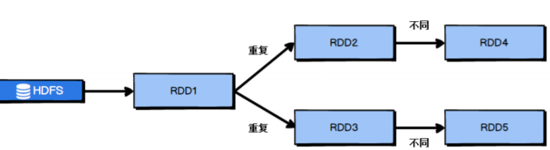


对上图中的 RDD 计算架构进行修改，得到如下图所示的优化结果：

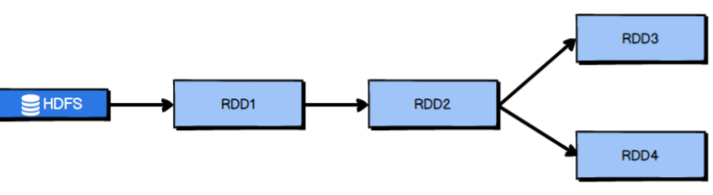

2) RDD 持久化

在 Spark 中，当多次对同一个 RDD 执行算子操作时，每一次都会对这个 RDD 以之前的父 RDD 重新计算一次，这种情况是必须要避免的，对同一个 RDD 的重复计算是对资源的极大浪费，因此，必须对多次使用的 RDD 进行持久化，通过持久化将公共 RDD 的数据缓存到内存/磁盘中，之后对于公共 RDD 的计算都会从内存/磁盘中直接获取 RDD 数据。对于 RDD 的持久化，有两点需要说明：


RDD 的持久化是可以进行序列化的，当内存无法将 RDD 的数据完整的进行存放的时候，可以考虑使用序列化的方式减小数据体积，将数据完整存储在内存中。


 如果对于数据的可靠性要求很高，并且内存充足，可以使用副本机制，对 RDD 数据进行持久化。当持久化启用了复本机制时，对于持久化的每个数据单元都存储一个副本，放在其他节点上面，由此实现数据的容错，一旦一个副本数据丢失，不需要重新计算，还可以使用另外一个副本。

3) RDD 尽可能早的 filter 操作
获取到初始 RDD 后，应该考虑尽早地过滤掉不需要的数据，进而减少对内存的占用，从而提升 Spark 作业的运行效率。

## 常规性能调优三：并行度调节
Spark 作业中的并行度指各个 stage 的 task 的数量。如果并行度设置不合理而导致并行度过低，会导致资源的极大浪费，例如，20 个 Executor，每个 Executor 分配 3 个 CPU core，而 Spark 作业有 40 个 task，这样每个 Executor 分配到的task 个数是 2 个，这就使得每个 Executor 有一个 CPU core 空闲，导致资源的浪费。


理想的并行度设置，应该是让并行度与资源相匹配，简单来说就是在资源允许的前提下，并行度要设置的尽可能大，达到可以充分利用集群资源。合理的设置并行度，可以提升整个Spark 作业的性能和运行速度。Spark 官方推荐，task 数量应该设置为 Spark 作业总 CPU core 数量的 2~3 倍。之所以没有推荐 task 数量与 CPU core 总数相等，是因为 task 的执行时间不同，有的 task 执行速度快而有的 task 执行速度慢，如果 task 数量与 CPU core 总数相等，那么执行快的 task 执行完成后，会出现 CPU core 空闲的情况。如果 task 数量设置为 CPU core 总数的 2~3 倍，那么一个task 执行完毕后，CPU core 会立刻执行下一个 task，降低了资源的浪费，同时提升了 Spark
作业运行的效率。


Spark 作业并行度的设置如下所示：

```scala
val conf = new SparkConf()
.set("spark.default.parallelism", "500")
```

## 常规性能调优四：广播大变量
默认情况下，task 中的算子中如果使用了外部的变量，每个 task 都会获取一份变量的复本，这就造成了内存的极大消耗。一方面，如果后续对 RDD 进行持久化，可能就无法将 RDD数据存入内存，只能写入磁盘，磁盘 IO 将会严重消耗性能；另一方面，task 在创建对象的时候，也许会发现堆内存无法存放新创建的对象，这就会导致频繁的 GC，GC 会导致工作线程停止，进而导致 Spark 暂停工作一段时间，严重影响 Spark 性能。假设当前任务配置了 20 个 Executor，指定 500 个 task，有一个 20M 的变量被所有 task共用，此时会在 500 个 task 中产生 500 个副本，耗费集群 10G 的内存，如果使用了广播变量， 那么每个 Executor 保存一个副本，一共消耗 400M 内存，内存消耗减少了 5 倍。


广播变量在每个 Executor 保存一个副本，此 Executor 的所有 task 共用此广播变量，这让变量产生的副本数量大大减少。在初始阶段，广播变量只在 Driver 中有一份副本。task 在运行的时候，想要使用广播变量中的数据，此时首先会在自己本地的 Executor 对应的 BlockManager 中尝试获取变量，如果本地没有，BlockManager 就会从 Driver 或者其他节点的 BlockManager 上远程拉取变量的复本，并由本地的 BlockManager 进行管理；之后此 Executor 的所有 task 都会直接从本地的BlockManager 中获取变量。


## **常规性能调优五：Kryo 序列化**
默认情况下，Spark 使用 Java 的序列化机制。Java 的序列化机制使用方便，不需要额外的配置，在算子中使用的变量实现 Serializable 接口即可，但是，Java 序列化机制的效率不高，序列化速度慢并且序列化后的数据所占用的空间依然较大。

Kryo 序列化机制比 Java 序列化机制性能提高 10 倍左右，Spark 之所以没有默认使用Kryo 作为序列化类库，是因为它不支持所有对象的序列化，同时 Kryo 需要用户在使用前注册需要序列化的类型，不够方便，但从 Spark 2.0.0 版本开始，简单类型、简单类型数组、字符串类型的 Shuffling RDDs 已经默认使用 Kryo 序列化方式了。

```scala
public class MyKryoRegistrator implements KryoRegistrator
{
 @Override
 public void registerClasses(Kryo kryo)
 {
 kryo.register(StartupReportLogs.class);
 }
}

配置 Kryo 序列化方式的实例代码：

//创建 SparkConf 对象
val conf = new SparkConf().setMaster(…).setAppName(…)
//使用 Kryo 序列化库，如果要使用 Java 序列化库，需要把该行屏蔽掉
conf.set("spark.serializer", "org.apache.spark.serializer.KryoSerializer");
//在 Kryo 序列化库中注册自定义的类集合，如果要使用 Java 序列化库，需要把该行屏蔽掉
conf.set("spark.kryo.registrator", "atguigu.com.MyKryoRegistrator"); 
```

## 常规性能调优六：调节本地化等待时长

Spark 作业运行过程中，Driver 会对每一个 stage 的 task 进行分配。根据 Spark 的 task 分配算法，Spark 希望 task 能够运行在它要计算的数据算在的节点（数据本地化思想），这样就可以避免数据的网络传输。通常来说，task 可能不会被分配到它处理的数据所在的节点，因为这些节点可用的资源可能已经用尽，此时，Spark 会等待一段时间，默认 3s，如果等待指定时间后仍然无法在指定节点运行，那么会自动降级，尝试将 task 分配到比较差的本地化级别所对应的节点上，比如将 task 分配到离它要计算的数据比较近的一个节点，然后进行计算，如果当前级别仍然不行，那么继续降级。当 task 要处理的数据不在 task 所在节点上时，会发生数据的传输。task 会通过所在节点的 BlockManager 获取数据，BlockManager 发现数据不在本地时，户通过网络传输组件从
数据所在节点的 BlockManager 处获取数据。


网络传输数据的情况是我们不愿意看到的，大量的网络传输会严重影响性能，因此，希望通过调节本地化等待时长，如果在等待时长这段时间内，目标节点处理完成了一部分task，那么当前的 task 将有机会得到执行，这样就能够改善 Spark 作业的整体性能。Spark 的本地化等级如表所示：

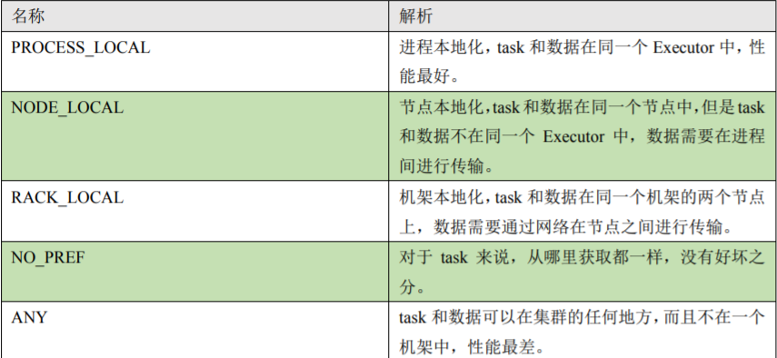


在 Spark 项目开发阶段，可以使用 client 模式对程序进行测试，此时，可以在本地看到比较全的日志信息，日志信息中有明确的 task 数据本地化的级别，如果大部分都是PROCESS_LOCAL，那么就无需进行调节，但是如果发现很多的级别都是 NODE_LOCAL、ANY，那么需要对本地化的等待时长进行调节，通过延长本地化等待时长，看看 task 的本地化级别有没有提升，并观察 Spark 作业的运行时间有没有缩短。


注意，过犹不及，不要将本地化等待时长延长地过长，导致因为大量的等待时长，使得Spark 作业的运行时间反而增加了。
Spark 本地化等待时长的设置如代码所示：

```scala
val conf = new SparkConf()
 .set("spark.locality.wait", "6")
```

## 算子调优

### 算子调优一：mapPartitions

普通的 map 算子对 RDD 中的每一个元素进行操作，而 mapPartitions 算子对 RDD 中每一个分区进行操作。如果是普通的 map 算子，假设一个 partition 有 1 万条数据，那么 map 算子中的 function 要执行 1 万次，也就是对每个元素进行操作。

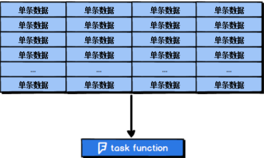

如果是 mapPartition 算子，由于一个 task 处理一个 RDD 的 partition，那么一个 task 只 会执行一次 function，function 一次接收所有的 partition 数据，效率比较高。

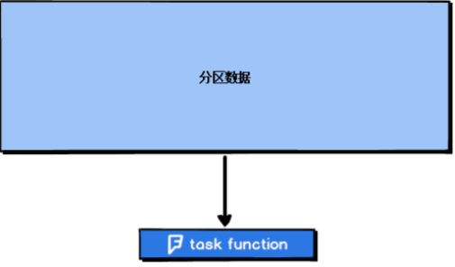


比如，当要把 RDD 中的所有数据通过 JDBC 写入数据，如果使用 map 算子，那么需要对 RDD 中的每一个元素都创建一个数据库连接，这样对资源的消耗很大，如果使用mapPartitions 算子，那么针对一个分区的数据，只需要建立一个数据库连接。


mapPartitions 算子也存在一些缺点：对于普通的 map 操作，一次处理一条数据，如果在处理了 2000 条数据后内存不足，那么可以将已经处理完的 2000 条数据从内存中垃圾回收掉；但是如果使用 mapPartitions 算子，但数据量非常大时，function 一次处理一个分区的数据，如果一旦内存不足，此时无法回收内存，就可能会 OOM，即内存溢出。因此，mapPartitions 算子适用于数据量不是特别大的时候，此时使用 mapPartitions 算子对性能的提升效果还是不错的。（当数据量很大的时候，一旦使用 mapPartitions 算子，就会直接 OOM）在项目中，应该首先估算一下 RDD 的数据量、每个 partition 的数据量，以及分配给每个 Executor 的内存资源，如果资源允许，可以考虑使用 mapPartitions 算子代替 map。


## 算子调优二：foreachPartition 优化数据库操作

在生产环境中，通常使用 foreachPartition 算子来完成数据库的写入，通过 foreachPartition算子的特性，可以优化写数据库的性能。如果使用 foreach 算子完成数据库的操作，由于 foreach 算子是遍历 RDD 的每条数据，因此，每条数据都会建立一个数据库连接，这是对资源的极大浪费，因此，对于写数据库操作，我们应当使用foreachPartition 算子。与 mapPartitions 算子非常相似，foreachPartition 是将 RDD 的每个分区作为遍历对象，
一次处理一个分区的数据，也就是说，如果涉及数据库的相关操作，一个分区的数据只需要创建一次数据库连接，如图所示：


使用了 foreachPartition 算子后，可以获得以下的性能提升：

```
对于我们写的 function 函数，一次处理一整个分区的数据；
对于一个分区内的数据，创建唯一的数据库连接；
只需要向数据库发送一次 SQL 语句和多组参数；
```

在生产环境中，全部都会使用 foreachPartition 算子完成数据库操作。foreachPartition 算子存
在一个问题，与 mapPartitions 算子类似，如果一个分区的数据量特别大，可能会造成 OOM，
即内存溢出。


## 算子调优三：filter 与 coalesce 的配合使用
在 Spark 任务中我们经常会使用 filter 算子完成 RDD 中数据的过滤，在任务初始阶段， 从各个分区中加载到的数据量是相近的，但是一旦进过 filter 过滤后，每个分区的数据量有 可能会存在较大差异，如图所示

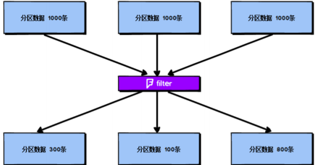


根据图中信息我们可以发现两个问题：
每个 partition 的数据量变小了，如果还按照之前与 partition 相等的 task 个数去处理当前数据，有点浪费 task 的计算资源；


每个 partition 的数据量不一样，会导致后面的每个 task 处理每个 partition 数据的时候，每个 task 要处理的数据量不同，这很有可能导致数据倾斜问题。


如上图所示，第二个分区的数据过滤后只剩100条，而第三个分区的数据过滤后剩下800条，在相同的处理逻辑下，第二个分区对应的 task 处理的数据量与第三个分区对应的 task 处理的数据量差距达到了 8 倍，这也会导致运行速度可能存在数倍的差距，这也就是数据倾斜问题。针对上述的两个问题，分别进行分析：


针对第一个问题，既然分区的数据量变小了，我们希望可以对分区数据进行重新分配，比如将原来 4 个分区的数据转化到 2 个分区中，这样只需要用后面的两个 task 进行处理即可，避免了资源的浪费。


针对第二个问题，解决方法和第一个问题的解决方法非常相似，对分区数据重新分配，让每个 partition 中的数据量差不多，这就避免了数据倾斜问题。那么具体应该如何实现上面的解决思路？需要 coalesce 算子。


repartition 与 coalesce 都可以用来进行重分区，其中 repartition 只是 coalesce 接口中 shuffle为 true 的简易实现，coalesce 默认情况下不进行 shuffle，但是可以通过参数进行设置。假设希望将原本的分区个数 A 通过重新分区变为 B，那么有以下几种情况：
 A > B（多数分区合并为少数分区）

1) A 与 B 相差值不大，此时使用 coalesce 即可，无需 shuffle 过程。
2) A 与 B 相差值很大
此时可以使用 coalesce 并且不启用 shuffle 过程，但是会导致合并过程性能低下，所以推荐设置 coalesce 的第二个参数为 true，即启动 shuffle 过程。A < B（少数分区分解为多数分区）此时使用 repartition 即可，如果使用 coalesce 需要将 shuffle 设置为 true，否则 coalesce 无效。可以在 filter 操作之后，使用 coalesce 算子针对每个 partition 的数据量各不相同的情况，压缩 partition 的数量，而且让每个 partition 的数据量尽量均匀紧凑，以便于后面的 task 进行计算操作，在某种程度上能够在一定程度上提升性能。
3) 注意：local 模式是进程内模拟集群运行，已经对并行度和分区数量有了一定的内部优化，因此不用去设置并行度和分区数量。1.2.4 算子调优四：repartition 解决 SparkSQL 低并行度问题在第一节的常规性能调优中我们讲解了并行度的调节策略，但是，并行度的设置对于Spark SQL 是不生效的，用户设置的并行度只对于 Spark SQL 以外的所有 Spark 的 stage 生效。
4) Spark SQL 的并行度不允许用户自己指定，Spark SQL 自己会默认根据 hive 表对应的HDFS 文件的 split 个数自动设置 Spark SQL 所在的那个 stage 的并行度，用户自己通spark.default.parallelism 参数指定的并行度，只会在没 Spark SQL 的 stage 中生效。由于 Spark SQL 所在 stage 的并行度无法手动设置，如果数据量较大，并且此 stage 中后续的 transformation 操作有着复杂的业务逻辑，而 Spark SQL 自动设置的 task 数量很少，这就意味着每个 task 要处理为数不少的数据量，然后还要执行非常复杂的处理逻辑，这就可能表现为第一个有 Spark SQL 的 stage 速度很慢，而后续的没有 Spark SQL 的 stage 运行速度非常快。为了解决 Spark SQL 无法设置并行度和 task 数量的问题，我们可以使用 repartition 算子。

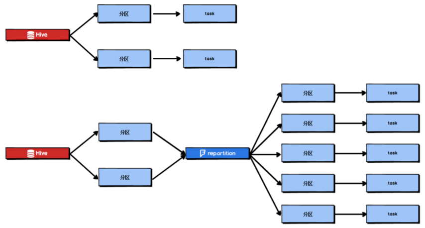


Spark SQL 这一步的并行度和 task 数量肯定是没有办法去改变了，但是，对于Spark SQL 查询出来的 RDD，立即使用 repartition 算子，去重新进行分区，这样可以重新分区为多个 partition，从 repartition 之后的 RDD 操作，由于不再设计 SparkSQL，因此 stage 的并行度就会等于你手动设置的值，这样就避免了 Spark SQL 所在的 stage 只能用少量的 task 去处理大量数据并执行复杂的算法逻辑。


## 算子调优五：reduceByKey 预聚合

reduceByKey 相较于普通的 shuffle 操作一个显著的特点就是会进行 map 端的本地聚合，map 端会先对本地的数据进行 combine 操作，然后将数据写入给下个 stage 的每个 task 创建的文件中，也就是在 map 端，对每一个 key 对应的 value，执行 reduceByKey 算子函数。reduceByKey 算子的执行过程如图所示：

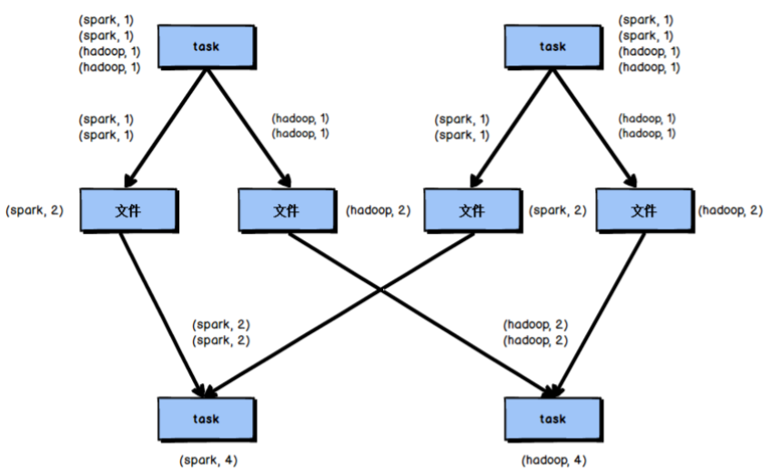


使用 reduceByKey 对性能的提升如下：
➢ 本地聚合后，在 map 端的数据量变少，减少了磁盘 IO，也减少了对磁盘空间的占用；
➢ 本地聚合后，下一个 stage 拉取的数据量变少，减少了网络传输的数据量；
➢ 本地聚合后，在 reduce 端进行数据缓存的内存占用减少；
➢ 本地聚合后，在 reduce 端进行聚合的数据量减少。
基于 reduceByKey 的本地聚合特征，我们应该考虑使用 reduceByKey 代替其他的 shuffle 算
子，例如 groupByKey。reduceByKey 与 groupByKey 的运行原理如图所示：

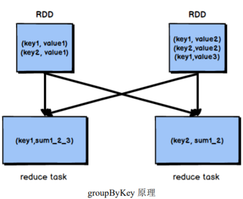


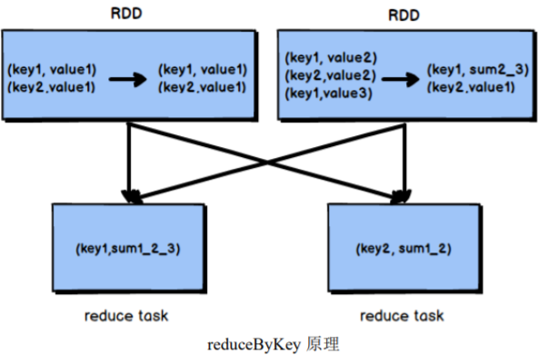


groupByKey 不会进行 map 端的聚合，而是将所有 map 端的数据 shuffle 到 reduce 端，然后在 reduce 端进行数据的聚合操作。由于 reduceByKey 有 map 端聚合的特性， 使得网络传输的数据量减小，因此效率要明显高于 groupByKey


## Shuffle 调优

### Shuffle 调优一：调节 map 端缓冲区大小

在 Spark 任务运行过程中，如果 shuffle 的 map 端处理的数据量比较大，但是 map 端缓冲的大小是固定的，可能会出现 map 端缓冲数据频繁 spill 溢写到磁盘文件中的情况，使得性能非常低下，通过调节 map 端缓冲的大小，可以避免频繁的磁盘 IO 操作，进而提升 Spark任务的整体性能。


map 端缓冲的默认配置是 32KB，如果每个 task 处理 640KB 的数据，那么会发生 640/32= 20 次溢写，如果每个 task 处理 64000KB 的数据，机会发生 64000/32=2000 此溢写，这对于性能的影响是非常严重的。

map 端缓冲的配置方法如代码清单所示：

```scala
val conf = new SparkConf()
 .set("spark.shuffle.file.buffer", "64")
```

### Shuffle 调优二：调节 reduce 端拉取数据缓冲区大小
Spark Shuffle 过程中，shuffle reduce task 的 buffer 缓冲区大小决定了 reduce task 每次能够缓冲的数据量，也就是每次能够拉取的数据量，如果内存资源较为充足，适当增加拉取数据缓冲区的大小，可以减少拉取数据的次数，也就可以减少网络传输的次数，进而提升性能。reduce 端数据拉取缓冲区的大小可以通过 spark.reducer.maxSizeInFlight 参数进行设置，默认为 48MB，该参数的设置方法如代码清单所示：

```scala
val conf = new SparkConf()
.set("spark.reducer.maxSizeInFlight", "96")
```

### Shuffle 调优三：调节 reduce 端拉取数据重试次数

Spark Shuffle 过程中，reduce task 拉取属于自己的数据时，如果因为网络异常等原因导致失败会自动进行重试。对于那些包含了特别耗时的 shuffle 操作的作业，建议增加重试最大次数（比如 60 次），以避免由于 JVM 的 full gc 或者网络不稳定等因素导致的数据拉取失败。在实践中发现，对于针对超大数据量（数十亿~上百亿）的 shuffle 过程，调节该参数可以大幅度提升稳定性。


reduce 端拉取数据重试次数可以通过 spark.shuffle.io.maxRetries 参数进行设置，该参数就代表了可以重试的最大次数。如果在指定次数之内拉取还是没有成功，就可能会导致作业执行失败，默认为 3，该参数的设置方法如代码清单所示：

```scala
val conf = new SparkConf()
 .set("spark.shuffle.io.maxRetries", "6")
```

### Shuffle 调优四：调节 reduce 端拉取数据等待间隔

Spark Shuffle 过程中，reduce task 拉取属于自己的数据时，如果因为网络异常等原因导致失败会自动进行重试，在一次失败后，会等待一定的时间间隔再进行重试，可以通过加大间隔时长（比如 60s），以增加 shuffle 操作的稳定性。reduce 端拉取数据等待间隔可以通过 spark.shuffle.io.retryWait 参数进行设置，默认值为 5s，该参数的设置方法如代码清单所示：

```scala
val conf = new SparkConf()
 .set("spark.shuffle.io.retryWait", "60s")
```

### Shuffle 调优五：调节 SortShuffle 排序操作阈值
会进行排序操作，而是直接按照未经优化的 HashShuffleManager 的方式去写数据，但是最后会将每个 task 产生的所有临时磁盘文件都合并成一个文件，并会创建单独的索引文件。


当你使用 SortShuffleManager 时，如果的确不需要排序操作，那么建议将这个参数调大一些，大于 shuffle read task 的数量，那么此时 map-side 就不会进行排序了，减少了排序的性能开销，但是这种方式下，依然会产生大量的磁盘文件，因此 shuffle write 性能有待提高。


SortShuffleManager 排序操作阈值的设置可以通过 spark.shuffle.sort. bypassMergeThreshold 这
一参数进行设置，默认值为 200，该参数的设置方法如代码清单所示：

```scala
val conf = new SparkConf()
 .set("spark.shuffle.sort.bypassMergeThreshold", "400")
```


## JVM 调优

对于 JVM 调优，首先应该明确，full gc/minor gc，都会导致 JVM 的工作线程停止工作， 即 stop the world。

### JVM 调优一：降低 cache 操作的内存占比

1. 静态内存管理机制
根据 Spark 静态内存管理机制，堆内存被划分为了两块，Storage 和 Execution。Storage主要用于缓存 RDD 数据和 broadcast 数据，Execution 主要用于缓存在 shuffle 过程中产生的中间数据，Storage 占系统内存的 60%，Execution 占系统内存的 20%，并且两者完全独立。在一般情况下，Storage 的内存都提供给了 cache 操作，但是如果在某些情况下 cache 操作内存不是很紧张，而 task 的算子中创建的对象很多，Execution 内存又相对较小，这回导致频繁的 minor gc，甚至于频繁的 full gc，进而导致 Spark 频繁的停止工作，性能影响会很大。


2. 在 Spark UI 中可以查看每个 stage 的运行情况，包括每个 task 的运行时间、gc 时间等等，如果发现 gc 太频繁，时间太长，就可以考虑调节 Storage 的内存占比，让 task 执行算子函数式，有更多的内存可以使用。
    Storage 内存区域可以通过 spark.storage.memoryFraction 参数进行指定，默认为 0.6，即
    60%，可以逐级向下递减，如代码清单所示：

  ```scala
  val conf = new SparkConf()
   .set("spark.storage.memoryFraction", "0.4")
  ```

  

3. 统一内存管理机制
    根据 Spark 统一内存管理机制，堆内存被划分为了两块，Storage 和 Execution。Storage主要用于缓存数据，Execution 主要用于缓存在 shuffle 过程中产生的中间数据，两者所组成的内存部分称为统一内存，Storage 和 Execution 各占统一内存的 50%，由于动态占用机制的实现，shuffle 过程需要的内存过大时，会自动占用 Storage 的内存区域，因此无需手动进行调节。

  

### JVM 调优二：调节 Executor 堆外内存
Executor 的堆外内存主要用于程序的共享库、Perm Space、 线程 Stack 和一些 Memory,mapping 等, 或者类 C 方式 allocate object。有时，如果你的 Spark 作业处理的数据量非常大，达到几亿的数据量，此时运行 Spark
作业会时不时地报错，例如 shuffle output file cannot find，executor lost，task lost，out of memory等，这可能是 Executor 的堆外内存不太够用，导致 Executor 在运行的过程中内存溢出。


stage 的 task 在运行的时候，可能要从一些 Executor 中去拉取 shuffle map output 文件，但是 Executor 可能已经由于内存溢出挂掉了，其关联的 BlockManager 也没有了，这就可能会报出 shuffle output file cannot find，executor lost，task lost，out of memory 等错误，此时，就可以考虑调节一下 Executor 的堆外内存，也就可以避免报错，与此同时，堆外内存调节的比较大的时候，对于性能来讲，也会带来一定的提升。默认情况下，Executor 堆外内存上限大概为 300 多 MB，在实际的生产环境下，对海量数据进行处理的时候，这里都会出现问题，导致 Spark 作业反复崩溃，无法运行，此时就会去调节这个参数，到至少 1G，甚至于 2G、4G。Executor 堆外内存的配置需要在 spark-submit 脚本里配置，如代码清单所示：

```scala
--conf spark.yarn.executor.memoryOverhead=2048
```

以上参数配置完成后，会避免掉某些 JVM OOM 的异常问题，同时，可以提升整体 Spark
作业的性能。


### JVM 调优三：调节连接等待时长
在 Spark 作业运行过程中，Executor 优先从自己本地关联的 BlockManager 中获取某份数据，如果本地BlockManager没有的话，会通过TransferService远程连接其他节点上Executor的 BlockManager 来获取数据。
如果 task 在运行过程中创建大量对象或者创建的对象较大，会占用大量的内存，这回导致频繁的垃圾回收，但是垃圾回收会导致工作现场全部停止，也就是说，垃圾回收一旦执行，Spark 的 Executor 进程就会停止工作，无法提供相应，此时，由于没有响应，无法建立网络连接，会导致网络连接超时。


在生产环境下，有时会遇到 file not found、file lost 这类错误，在这种情况下，很有可能是 Executor 的BlockManager 在拉取数据的时候，无法建立连接，然后超过默认的连接等待时长 60s 后，宣告数据拉取失败，如果反复尝试都拉取不到数据，可能会导致 Spark 作业的崩溃。这种情况也可能会导致 DAGScheduler 反复提交几次 stage，TaskScheduler 返回提交几次 task，大大延长了我们的 Spark 作业的运行时间。此时，可以考虑调节连接的超时时长，连接等待时长需要在 spark-submit 脚本中进行设置，设置方式如代码清单所示：
--conf spark.core.connection.ack.wait.timeout=300
调节连接等待时长后，通常可以避免部分的 XX 文件拉取失败、XX 文件 lost 等报错。


## **Spark 数据倾斜**

Spark 中的数据倾斜问题主要指 shuffle 过程中出现的数据倾斜问题，是由于不同的 key对应的数据量不同导致的不同 task 所处理的数据量不同的问题。


例如，reduce 点一共要处理 100 万条数据，第一个和第二个 task 分别被分配到了 1 万条数据，计算 5 分钟内完成，第三个 task 分配到了 98 万数据，此时第三个 task 可能需要 10个小时完成，这使得整个 Spark 作业需要 10 个小时才能运行完成，这就是数据倾斜所带来的后果。


注意，要区分开数据倾斜与数据量过量这两种情况，数据倾斜是指少数 task 被分配了绝大多数的数据，因此少数 task 运行缓慢；数据过量是指所有 task 被分配的数据量都很大，相差不多，所有 task 都运行缓慢。


数据倾斜的表现：
Spark 作业的大部分 task 都执行迅速，只有有限的几个 task 执行的非常慢，此时可能出现了数据倾斜，作业可以运行，但是运行得非常慢；


Spark 作业的大部分 task 都执行迅速，但是有的 task 在运行过程中会突然报出 OOM，反复执行几次都在某一个 task 报出 OOM 错误，此时可能出现了数据倾斜，作业无法正常运行。


定位数据倾斜问题：
查阅代码中的 shuffle 算子，例如 reduceByKey、countByKey、groupByKey、join 等算子，根据代码逻辑判断此处是否会出现数据倾斜；


查看 Spark 作业的 log 文件，log 文件对于错误的记录会精确到代码的某一行，可以根据异常定位到的代码位置来明确错误发生在第几个 stage，对应的 shuffle 算子是哪一个；


### 解决方案一：聚合原数据

1) 避免 shuffle 过程
绝大多数情况下，Spark 作业的数据来源都是 Hive 表，这些 Hive 表基本都是经过 ETL之后的昨天的数据。为了避免数据倾斜，我们可以考虑避免 shuffle 过程，如果避免了 shuffle过程，那么从根本上就消除了发生数据倾斜问题的可能。


2. 如果 Spark 作业的数据来源于 Hive 表，那么可以先在 Hive 表中对数据进行聚合，例如
    按照 key 进行分组，将同一 key 对应的所有 value 用一种特殊的格式拼接到一个字符串里去，


这样，一个 key 就只有一条数据了；之后，对一个 key 的所有 value 进行处理时，只需要进行 map 操作即可，无需再进行任何的 shuffle 操作。通过上述方式就避免了执行 shuffle 操作，也就不可能会发生任何的数据倾斜问题。对于 Hive 表中数据的操作，不一定是拼接成一个字符串，也可以是直接对 key 的每一条数据进行累计计算。要区分开，处理的数据量大和数据倾斜的区别。缩小 key 粒度（增大数据倾斜可能性，降低每个 task 的数据量）
key 的数量增加，可能使数据倾斜更严重。增大 key 粒度（减小数据倾斜可能性，增大每个 task 的数据量）
如果没有办法对每个 key 聚合出来一条数据，在特定场景下，可以考虑扩大 key 的聚合粒度。例如，目前有 10 万条用户数据，当前 key 的粒度是（省，城市，区，日期），现在我们考虑扩大粒度，将 key 的粒度扩大为（省，城市，日期），这样的话，key 的数量会减少，key 之间的数据量差异也有可能会减少，由此可以减轻数据倾斜的现象和问题。（此方法只针对特定类型的数据有效，当应用场景不适宜时，会加重数据倾斜）


### 解决方案二：过滤导致倾斜的 key
如果在 Spark 作业中允许丢弃某些数据，那么可以考虑将可能导致数据倾斜的 key 进行 过滤，滤除可能导致数据倾斜的 key 对应的数据，这样，在 Spark 作业中就不会发生数据倾 斜了。


### 解决方案三：提高 shuffle 操作中的 reduce 并行度

当方案一和方案二对于数据倾斜的处理没有很好的效果时，可以考虑提高 shuffle 过程中的 reduce 端并行度，reduce 端并行度的提高就增加了 reduce 端 task 的数量，那么每个 task分配到的数据量就会相应减少，由此缓解数据倾斜问题。


reduce 端并行度的设置
在大部分的 shuffle 算子中，都可以传入一个并行度的设置参数，比如 reduceByKey(500)，这个参数会决定 shuffle 过程中 reduce 端的并行度，在进行 shuffle 操作的时候，就会对应着创建指定数量的 reduce task。对于 Spark SQL 中的 shuffle 类语句，比如 group by、join 等，需要设置一个参数，即 spark.sql.shuffle.partitions，该参数代表了 shuffle read task 的并行度，该值默认是 200，对于很多场景来说都有点过小。增加 shuffle read task 的数量，可以让原本分配给一个 task 的多个 key 分配给多个 task，从而让每个 task 处理比原来更少的数据。举例来说，如果原本有 5 个 key，每个 key 对应 10条数据，这 5 个 key 都是分配给一个 task 的，那么这个 task 就要处理 50 条数据。而增加了shuffle read task 以后，每个 task 就分配到一个 key，即每个 task 就处理 10 条数据，那么自然每个 task 的执行时间都会变短了。


reduce 端并行度设置存在的缺陷
提高 reduce 端并行度并没有从根本上改变数据倾斜的本质和问题（方案一和方案二从根本上避免了数据倾斜的发生），只是尽可能地去缓解和减轻 shuffle reduce task 的数据压力，以及数据倾斜的问题，适用于有较多 key 对应的数据量都比较大的情况。该方案通常无法彻底解决数据倾斜，因为如果出现一些极端情况，比如某个 key 对应的数据量有 100 万，那么无论你的 task 数量增加到多少，这个对应着 100 万数据的 key 肯定还是会分配到一个 task 中去处理，因此注定还是会发生数据倾斜的。所以这种方案只能说是在发现数据倾斜时尝试使用的第一种手段，尝试去用嘴简单的方法缓解数据倾斜而已，或者是和其他方案结合起来使用。在理想情况下，reduce 端并行度提升后，会在一定程度上减轻数据倾斜的问题，甚至基本消除数据倾斜；但是，在一些情况下，只会让原来由于数据倾斜而运行缓慢的 task 运行速度稍有提升，或者避免了某些 task 的 OOM 问题，但是，仍然运行缓慢，此时，要及时放弃


方案三，开始尝试后面的方案。


### **解决方案四：使用随机 key 实现双重聚合**

当使用了类似于 groupByKey、reduceByKey 这样的算子时，可以考虑使用随机 key 实 现双重聚合，如图所示：

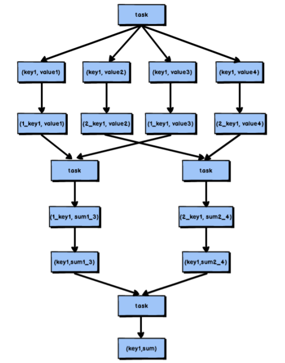

首先，通过 map 算子给每个数据的 key 添加随机数前缀，对 key 进行打散，将原先一样的 key 变成不一样的 key，然后进行第一次聚合，这样就可以让原本被一个 task 处理的数据分散到多个 task 上去做局部聚合；随后，去除掉每个 key 的前缀，再次进行聚合。此方法对于由 groupByKey、reduceByKey 这类算子造成的数据倾斜由比较好的效果，仅仅适用于聚合类的 shuffle 操作，适用范围相对较窄。如果是 join 类的 shuffle 操作，还得用其他的解决方案。

此方法也是前几种方案没有比较好的效果时要尝试的解决方案。


### **解决方案五：将 reduce join 转换为 map join**

正常情况下，join 操作都会执行 shuffle 过程，并且执行的是 reduce join，也就是先将所 有相同的 key 和对应的 value 汇聚到一个 reduce task 中，然后再进行 join。普通 join 的过程 如下图所示：

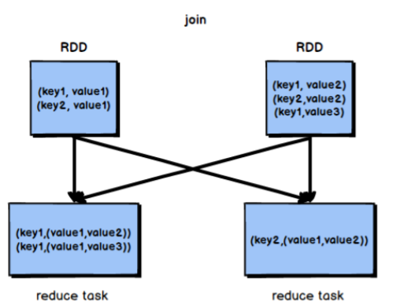


普通的 join 是会走 shuffle 过程的，而一旦 shuffle，就相当于会将相同 key 的数据拉取到一个 shuffle read task 中再进行 join，此时就是 reduce join。但是如果一个 RDD 是比较小的，则可以采用广播小 RDD 全量数据+map 算子来实现与 join 同样的效果，也就是 map join，此时就不会发生 shuffle 操作，也就不会发生数据倾斜。
（注意，RDD 是并不能进行广播的，只能将 RDD 内部的数据通过 collect 拉取到 Driver 内存然后再进行广播）


核心思路：
不使用 join 算子进行连接操作，而使用 Broadcast 变量与 map 类算子实现 join 操作，进而完全规避掉 shuffle 类的操作，彻底避免数据倾斜的发生和出现。将较小 RDD 中的数据直接通过 collect 算子拉取到 Driver 端的内存中来，然后对其创建一个 Broadcast 变量；接着对另外一个 RDD 执行 map 类算子，在算子函数内，从 Broadcast 变量中获取较小 RDD 的全量数据，与当前 RDD 的每一条数据按照连接 key 进行比对，如果连接 key 相同的话，那么就将两个 RDD 的数据用你需要的方式连接起来。根据上述思路，根本不会发生 shuffle 操作，从根本上杜绝了 join 操作可能导致的数据倾斜问题。


当 join 操作有数据倾斜问题并且其中一个 RDD 的数据量较小时，可以优先考虑这种方式，效果非常好。map join 的过程如图所示：

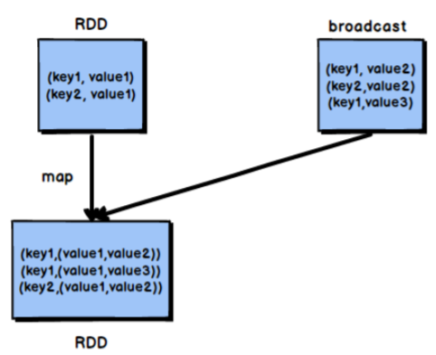

不适用场景分析： 由于Spark 的广播变量是在每个Executor中保存一个副本，如果两个 RDD数据量都比较大， 那么如果将一个数据量比较大的 RDD 做成广播变量，那么很有可能会造成内存溢出。


### **解决方案六：sample 采样对倾斜 key 单独进行 join**

在 Spark 中，如果某个 RDD 只有一个 key，那么在 shuffle 过程中会默认将此 key 对应的数据打散，由不同的 reduce 端 task 进行处理。当由单个 key 导致数据倾斜时，可有将发生数据倾斜的 key 单独提取出来，组成一个
RDD，然后用这个原本会导致倾斜的 key 组成的 RDD 根其他 RDD 单独 join，此时，根据Spark 的运行机制，此 RDD 中的数据会在 shuffle 阶段被分散到多个 task 中去进行 join 操作。倾斜 key 单独 join 的流程如图所示：

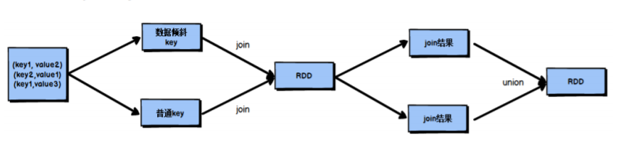


1． 适用场景分析：
对于 RDD 中的数据，可以将其转换为一个中间表，或者是直接使用 countByKey()的方式，看一个这个 RDD 中各个 key 对应的数据量，此时如果你发现整个 RDD 就一个 key 的数据量特别多，那么就可以考虑使用这种方法。
当数据量非常大时，可以考虑使用 sample 采样获取 10%的数据，然后分析这 10%的数据中哪个 key 可能会导致数据倾斜，然后将这个 key 对应的数据单独提取出来。


2． 不适用场景分析：
如果一个 RDD 中导致数据倾斜的 key 很多，那么此方案不适用。


### **解决方案七：使用随机数扩容进行 join**
如果在进行 join 操作时，RDD 中有大量的 key 导致数据倾斜，那么进行分拆 key 也没什么意义，此时就只能使用最后一种方案来解决问题了，对于 join 操作，我们可以考虑对其中一个 RDD 数据进行扩容，另一个 RDD 进行稀释后再 join。


我们会将原先一样的 key 通过附加随机前缀变成不一样的 key，然后就可以将这些处理后的“不同 key”分散到多个 task 中去处理，而不是让一个 task 处理大量的相同 key。这一种方案是针对有大量倾斜 key 的情况，没法将部分 key 拆分出来进行单独处理，需要对整个RDD 进行数据扩容，对内存资源要求很高。

1. 核心思想：
选择一个 RDD，使用 flatMap 进行扩容，对每条数据的 key 添加数值前缀（1~N 的数
值），将一条数据映射为多条数据；（扩容）
选择另外一个 RDD，进行 map 映射操作，每条数据的 key 都打上一个随机数作为前缀
（1~N 的随机数）；（稀释）
将两个处理后的 RDD，进行 join 操作。

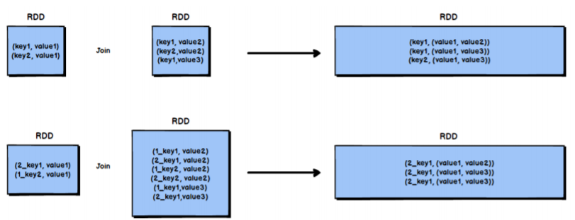


2. 局限性：
如果两个 RDD 都很大，那么将 RDD 进行 N 倍的扩容显然行不通；使用扩容的方式只能缓解数据倾斜，不能彻底解决数据倾斜问题。使用方案七对方案六进一步优化分析：当 RDD 中有几个 key 导致数据倾斜时，方案六不再适用，而方案七又非常消耗资源，此时可以引入方案七的思想完善方案六：


3. 对包含少数几个数据量过大的 key 的那个 RDD，通过 sample 算子采样出一份样本来，然后统计一下每个 key 的数量，计算出来数据量最大的是哪几个 key。

  

4. 然后将这几个 key 对应的数据从原来的 RDD 中拆分出来，形成一个单独的 RDD，并给每个 key 都打上 n 以内的随机数作为前缀，而不会导致倾斜的大部分 key 形成另外一个RDD。

  

5. 接着将需要 join 的另一个 RDD，也过滤出来那几个倾斜 key 对应的数据并形成一个单独的 RDD，将每条数据膨胀成 n 条数据，这 n 条数据都按顺序附加一个 0~n 的前缀，不会导致倾斜的大部分 key 也形成另外一个 RDD。

  

6. 再将附加了随机前缀的独立 RDD 与另一个膨胀 n 倍的独立 RDD 进行 join，此时就可以将原先相同的 key 打散成 n 份，分散到多个 task 中去进行 join 了。
  

7. 而另外两个普通的 RDD 就照常 join 即可。
  

8. 最后将两次 join 的结果使用 union 算子合并起来即可，就是最终的 join 结果。


