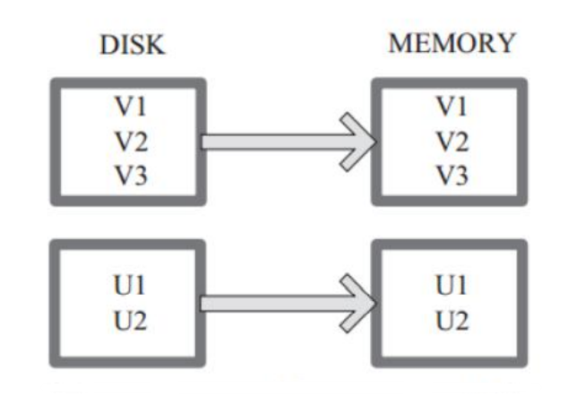
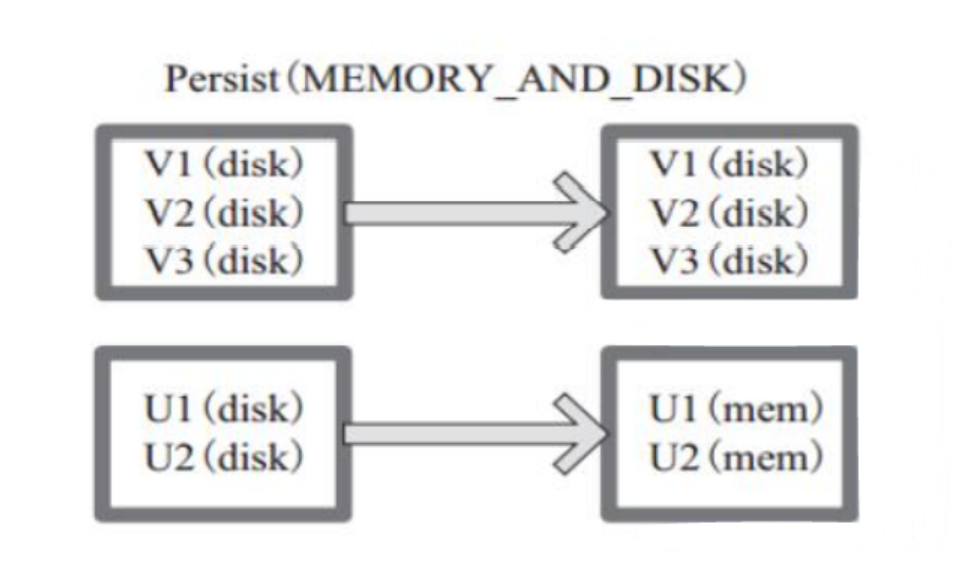
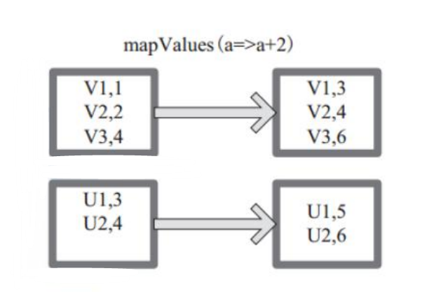
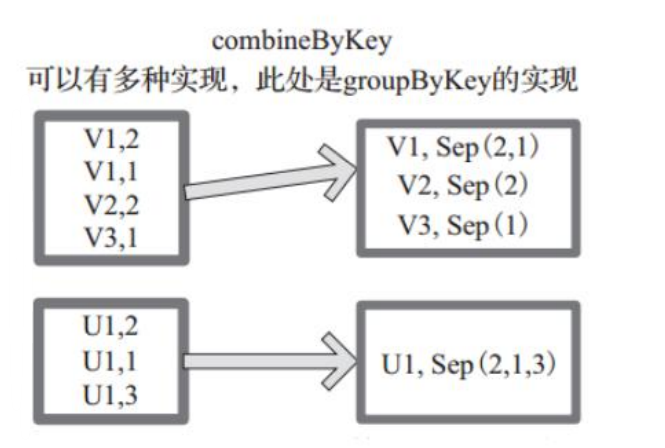
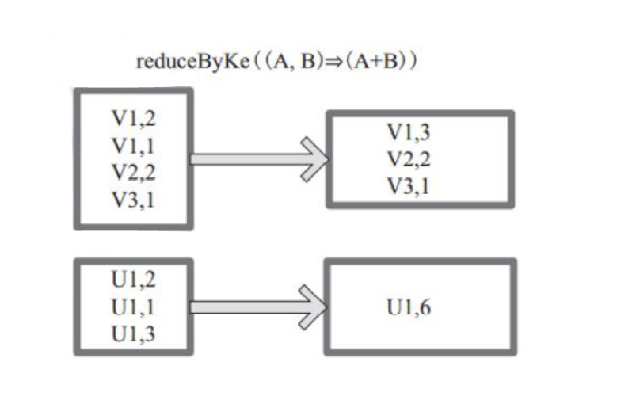
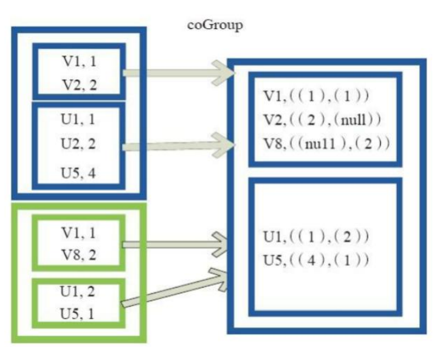
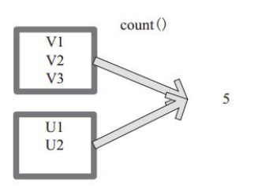

# Spark 常用RDD详解

## 算子分类

Spark 的算子的分类 从大方向来说，Spark 算子大致可以分为以下两类: 


1）Transformation 变换/转换算子：

这种变换并不触发提交作业，完成作 业中间过程处理。 Transformation 操作是延迟计算的，也就是说从一个 RDD 转换生成 另一个 RDD 的转换操作不是马上执行，需要等到有 Action 操作的时候才会真 正触发运算。 


2）Action 行动算子：

这类算子会触发 SparkContext 提交 Job 作业。 Action 算子会触发 Spark 提交作业（Job），并将数据输出 Spark 系统。


**从小方向来说，Spark 算子大致可以分为以下三类:** 

1）Value 数据类型的 Transformation 算子，这种变换并不触发提交作业， 针对处理的数据项是 Value 型的数据。


 2）Key-Value 数据类型的 Transfromation 算子，这种变换并不触发提交作 业，针对处理的数据项是 Key-Value 型的数据对。 


3）Action 算子，这类算子会触发 SparkContext 提交 Job 作业。


## **1）Value 数据类型的 Transformation 算子 **

### **一、输入分区与输出分区一对一型** 

1、map 算子 

2、flatMap 算子 

3、mapPartitions 算子 

4、glom 算子


### **二、输入分区与输出分区多对一型** 

5、union 算子 

6、cartesian 算子


### **三、输入分区与输出分区多对多型** 

7、grouBy 算子


### **四、输出分区为输入分区子集型** 

8、filter 算子 

9、distinct 算子 

10、subtract 算子 

11、sample 算子 

12、takeSample 算子


### **五、Cache 型** 

13、cache 算子 

14、persist 算子


## **2）Key-Value 数据类型的 Transfromation 算子** 

### **一、输入分区与输出分区一对一** 

15、mapValues 算子 


### **二、对单个 RDD 或两个 RDD 聚集 单个 RDD 聚集** 

16、combineByKey 算子 

17、reduceByKey 算子

18、partitionBy 算子 


### **两个 RDD 聚集** 

19、Cogroup 算子


**三、连接** 

20、join 算子 

21、leftOutJoin 和 rightOutJoin 算


## **3）Action 算子** 

### **一、无输出** 

22、foreach 算子 


### **二、HDFS** 

23、saveAsTextFile 算子 

24、saveAsObjectFile 算子 


### **三、Scala 集合和数据类型** 

25、collect 算子 

26、collectAsMap 算子 

27、reduceByKeyLocally 算子 

28、lookup 算子 

29、count 算子 

30、top 算子 

31、reduce 算子 

32、fold 算子 

33、aggregate 算


## 1.Transformations 算子

### **1.map()** 

将原来 RDD 的每个数据项通过 map 中的用户自定义函数 f 映射转变为一 个新的元素。源码中 map 算子相当于初始化一个 RDD， 新 RDD 叫做 MappedRDD(this, sc.clean(f))。


图中每个方框表示一个 RDD 分区，左侧的分区经过用户自定义函数 f:T->U 映射为右侧的新 RDD 分区。但是，实际只有等到 Action 算子触发后， 这个 f 函数才会和其他函数在一个 stage 中对数据进行运算。


在图中的第 一个分区，数据记录 V1 输入 f，通过 f 转换输出为转换后的分区中的数据记 录 V’1。


### **2.flatMap()** 

将原来 RDD 中的每个元素通过函数 f 转换为新的元素，并将生成的 RDD 的每个集合中的元素合并为一个集合，内部创建 FlatMappedRDD(this， sc.clean(f))。 


图中表 示 RDD 的 一 个 分 区 ，进 行 flatMap 函 数 操 作， flatMap 中 传 入 的 函 数 为 f:T->U， T 和 U 可以是任意的数据类型。将分区中的 数据通过用户自定义函数 f 转换为新的数据。外部大方框可以认为是一个 RDD 分区，小方框代表一个集合。 


V1、 V2、 V3 在一个集合作为 RDD 的一个数据 项，可能存储为数组或其他容器，转换为 V’1、 V’2、 V’3 后，将原来的数 组或容器结合拆散，拆散的数据形成为 RDD 中的数据项


### **3.mapPartitions mapPartitions()** 

函 数 获 取 到 每 个 分 区 的 迭 代器，在 函 数 中 通 过 这 个 分 区 整 体 的 迭 代 器 对整 个 分 区 的 元 素 进 行 操 作。 内 部 实 现 是 生 成 MapPartitionsRDD。


图中的方框代表一个 RDD 分区。图中，用户通过函 数 f (iter)=>iter.f ilter(_>=3) 对分区中所有数据进行过滤，大于和等于 3 的数据保留。


一个方块代表一个 RDD 分区，含有 1、 2、 3 的分区过滤只剩下 元素 3


### **4.glom()**

函数将每个分区形成一个数组，内部实现是返回的 GlommedRDD。 


图中的每个方框代表一个 RDD 分区。图 4 中的方框代表一个分区。 


该图表示含有 V1、 V2、 V3 的分区通过函数 glom 形成一数组  Array[（V1），（V2），（V3）]。


### **5.union()** 

使用 union 函数时需要保证两个 RDD 元素的数据类型相同，返回的 RDD 数据类型和被合并的 RDD 元素数据类型相同，并不进行去重操作，保存所有元 素。如果想去重 可以使用 distinct()。同时 Spark 还提供更为简洁的使用 union 的 API，通 过 ++ 符号相当于 union 函数操作。 


图中左侧大方框代表两个 RDD，大方框内的小方框代表 RDD 的分区。 右侧大方框代表合并后的 RDD，大方框内的小方框代表分区。 


含有 V1、V2、U1、U2、U3、U4 的 RDD 和含有 V1、V8、U5、U6、U7、U8 的 RDD 合并所有元素形成一个 RDD。V1、V1、V2、V8 形成一个分区，U1、U2、U3、 U4、U5、U6、U7、U8 形成一个分区。


### **6.cartesian()** 

对 两 个 RDD 内 的 所 有 元 素 进 行 笛 卡 尔 积 操 作。 操 作 后， 内 部 实 现 返 回 CartesianRDD。


图中左侧大方框代表两个 RDD，大 方框内的小方框代表 RDD 的分区。右侧大方框代表合并后的 RDD，大方框内的 小方框代表分区。图中的大方框代表 RDD，大方框中的小方框代表 RDD 分区。 


例 如：V1 和 另 一 个 RDD 中 的 W1、W2、Q5 进 行 笛 卡 尔 积 运 算 形 成 (V1,W1)、(V1,W2)、 (V1,Q5)。


### **7.groupBy()** 

将元素通过函数生成相应的 Key，数据就转化为 Key-Value 格 式，之后将 Key 相同的元素分为一组。 函数实现如下： 

1）将用户函数预处理： val cleanF = sc.clean(f) 


2）对数据 map 进行函数操作，最后再进行 groupByKey 分组操作。 

this.map(t => (cleanF(t), t)).groupByKey(p) 其中， p 确定了分区个数和分区函数，也就决定了并行化的程度。 


图中方框代表一个 RDD 分区，相同 key 的元素合并到一个组。


例如 V1 和 V2 合并为 V， Value 为 V1,V2。形成 V,Seq(V1,V2)


### **8.filter()**

函数功能是对元素进行过滤，对每个 元 素 应 用 f 函 数，返 回 值 为 true 的 元 素 在 RDD 中保留，返回值为 false 的元素将被过滤掉。 内 部 实 现 相 当 于 生 成 FilteredRDD(this，sc.clean(f))。 


下面代码为函数的本质实现： deffilter(f:T=>Boolean):RDD[T]=newFilteredRDD(this,sc.clean(f)) 


图中每个方框代表一个 RDD 分区， T 可以是任意的类型。通过用户自 定义的过滤函数 f，对每个数据项操作，将满足条件、返回结果为 true 的数据 项保留。


例如，过滤掉 V2 和 V3 保留了 V1，为区分命名为 V’1。


### **9.distinct()** 

将 RDD 中的元素进行去重操作。


图中的每个方框代表一个 RDD 分区，通过 distinct 函数，将数据去重。 


例如，重复数据 V1、 V1 去重后只保 留一份 V1。


### **10.subtract()** 

相当于进行集合的差操作，RDD 1 去除 RDD 1 和 RDD 2 交集中的所 有元素。


图中左侧的大方框代表两个 RDD，大方框内的小方框代表 RDD 的分 区。 右侧大方框 代表合并后的 RDD，大方框内的小方框代表分区。 


V1 在两个 RDD 中均有，根据 差集运算规则，新 RDD 不保留，V2 在第一个 RDD 有，第二个 RDD 没有，则在新 RDD 元素中包含 V2。


### **11.sample()** 

将 RDD 这个集合内的元素进行采样，获取所有元素的子集。用 户可以设定是否有放回的抽样、百分比、随机种子，进而决定采样方式。


内部实 现是生成 SampledRDD(withReplacement， fraction， seed)。

 

函数参数设置： 

‰ withReplacement=true，表示有放回的抽样。 

‰ withReplacement=false，表示无放回的抽样。 


图中 的 每 个 方 框 是 一 个 RDD 分 区。 通 过 sample 函 数， 采 样 50% 的 数 据。


V1、 V2、 U1、 U2、U3、U4 采样出数据 V1 和 U1、 U2 形成新的 RDD。


### **12.takeSample()** 

函数和上面的 sample 函数是一个原理，但是不使用相对比 例采样，而是按设定的采样个数进行采样，同时返回结果不再是 RDD，而是相当 于对采样后的数据进行 Collect（），返回结果的集合为单机的数组。 


图中左侧的方框代表分布式的各个节点上的分区，右侧方框代表单机上 返回的结果数组。 


通过 takeSample 对数据采样，设置为采样一份数据，返回结 果为 V1


### **13.cache()** 

将 RDD 元素从磁盘缓存到内存。 相当于 persist(MEMORY_ONLY) 函数的功能。 


图中每个方框代表一个 RDD 分区，左侧相当于数据分区都存储在磁 盘，通过 cache 算子将数据缓存在内存。



### **14.persist()** 

函数对 RDD 进行缓存操作。数据缓存在哪里依据 StorageLevel 这个枚举类型进行确定。 


有以下几种类型的组合（见 10）， DISK 代表磁盘， MEMORY 代表内存， SER 代表数据是否进行序列化存储。 下面为函数定义， StorageLevel 是枚举类型，代表存储模式，用户可以通 过图 14-1 按需进行选择。


persist(newLevel:StorageLevel) 图中 列 出 persist 函 数 可 以 进 行 缓 存 的 模 式 。 


例如 ， MEMORY_AND_DISK_SER 代表数据可以存储在内存和磁盘，并且以序列化的方式存 储，其他同理。


图中方框代表 RDD 分区。 disk 代表存储在磁盘， mem 代表存储在 内存。数据最初全部存储在磁盘，通过 persist(MEMORY_AND_DISK) 将数据缓存 到内存，但是有的分区无法容纳在内存，将含有 V1、 V2、 V3 的 RDD 存储到磁 盘，将含有 U1，U2 的 RDD 仍旧存储在内存。




### **15.mapValues()**

针对（Key， Value）型数据中的 Value 进行 Map 操作， 而不对 Key 进行处理。 


图中的方框代表 RDD 分区。 


a=>a+2 代表对 (V1,1) 这样的 Key Value 数据对，数据只对 Value 中的 1 进行加 2 操作，返回结果为3。



### **16.combineByKey()** 

下面代码为 combineByKey 函数的定义： combineByKey[C](createCombiner:(V) C, mergeValue:(C, V) C, mergeCombiners:(C, C) C, partitioner:Partitioner, mapSideCombine:Boolean=true, serializer:Serializer=null):RDD[(K,C)] 

说明： 

‰ createCombiner： V => C， C 不存在的情况下，比如通过 V 创建 seq C。 


‰ mergeValue： (C， V) => C，当 C 已经存在的情况下，需要 merge， 比如把 item V 加到 seq C 中，或者叠加。 mergeCombiners： (C， C) => C，合并两个 C。 


‰ partitioner： Partitioner, Shuff le 时需要的 Partitioner。 


‰ mapSideCombine ： Boolean = true，为了减小传输量，很多 combine 可以在 map 端先做，比如叠加，可以先在一个 partition 中把所有相同的 key 的 value 叠 加， 再 shuff le。 


‰ serializerClass： String = null，传输需要序列化，用户可以自定义 


序列化类： 例如，相当于将元素为 (Int，Int) 的 RDD 转变为了 (Int，Seq[Int]) 类 型元素的 RDD。


图中的方框代表 RDD 分区。如图，通过 combineByKey， 将 (V1,2)， (V1,1)数据合并为（ V1,Seq(2,1)）。




### **17.reduceByKey()** 

是比 combineByKey 更简单的一种情况，只是两个值合并成 一个值，（ Int， Int V）to （Int， Int C），比如叠加。所以 createCombiner reduceBykey 很简单，就是直接返回 v，而 mergeValue 和 mergeCombiners 逻 辑是相同的，没有区别。 

函数实现： 

```scala
def reduceByKey(partitioner: Partitioner, func: (V, V) => V): RDD[(K, V)] = { 		
    combineByKey[V]((v: V) => v, func, func, partitioner) 
} 
```


图中的方框代表 RDD 分区。通过用户自定义函数 (A,B) => (A + B) 函 数，将相同 key 的数据 (V1,2) 和 (V1,1) 的 value 相加运算，结果为 （ V1,3）



### **18.partitionBy()** 

函数对 RDD 进行分区操作。 函数定义如下。 partitionBy（partitioner：Partitioner） 如果原有 RDD 的分区器和现有分区器（partitioner）一致，则不重分区， 如果不一致，则相当于根据分区器生成一个新的 ShuffledRDD。 


图中的方框代表 RDD 分区。 通过新的分区策略将原来在不同分区的 V1、 V2 数据都合并到了一个分区。


### **19.Cogroup()** 

函数将两个 RDD 进行协同划分，cogroup 函数的定义如下。 cogroup[W]（other： RDD[（K， W）]， numPartitions： Int）： RDD[（K， （Iterable[V]， Iterable[W]））] 对在两个 RDD 中的 Key-Value 类型的元素，每个 RDD 相同 Key 的元素分别聚合为一个集合，并且返回两个 RDD 中对应 Key 的元素集合的迭代器。 （K， （Iterable[V]， Iterable[W]）） 其中，Key 和 Value，Value 是两个 RDD 下相同 Key 的两个数据集合的迭代 器所构成的元组。


图中的大方框代表 RDD，大方框内的小方框代表 RDD 中的分区。 将 RDD1 中的数据（U1，1）、 （U1，2）和 RDD2 中的数据（U1，2）合并为（U1，（（1， 2），（2）））。




### **20.join()** 

对两个需要连接的 RDD 进行 cogroup 函数操作，将相同 key 的 数据能够放到一个分区，在 cogroup 操作之后形成的新 RDD 对每个 key 下的 元素进行笛卡尔积的操作，返回的结果再展平，对应 key 下的所有元组形成一 个集合。


最后返回 RDD[(K， (V， W))]。 下 面 代 码 为 join 的 函 数 实 现， 本 质 是通 过 cogroup 算 子 先 进 行 协 同 划 分， 再 通 过 flatMapValues 将合并的数据打散。 

```scala
this.cogroup(other,partitioner).flatMapValues{case(vs,ws) => for(v<-vs;w<-ws)yield(v,w) } 
```


图是对两个 RDD 的 join 操作示意图。大方框代表 RDD，小方框代表 RDD 中的分区。函数对相同 key 的元素，如 V1 为 key 做连接后结果为 (V1,(1,1)) 和 (V1,(1,2))。


### **21.leftOutJoin 和 rightOutJoin **

LeftOutJoin()（左外连接）和 RightOutJoin（右外连接）相当于在 join 的 基础上先判断一侧的 RDD 元素是否为空，如果为空，则填充为空。 


如果不为空， 则将数据进行连接运算，并 返回结果。 

下面代码是 leftOutJoin 的实现。 

```scala
if （ws.isEmpty）{ 
    vs.map（v => （v， None）） 
} else { 
    for （v <- vs； w <- ws） 
    yield （v， Some（w）） 
}
```

## 2.Actions 算子

本质上在 Action 算子中通过 SparkContext 进行了提交作业的 runJob 操作，触发了 RDD DAG 的执行。 

例如， Action 算子 collect 函数的代码如下

源码剖析：

```scala
 /**
 Return an array that contains all of the elements in this RDD. 
 */ 
def collect(): Array[T] = { 
    /* 提交 Job*/ 
    val results = sc.runJob(this, (iter: Iterator[T]) => iter.toArray) 		
    	Array.concat(results: _*) 
}
```

### **22.foreach()** 

对 RDD 中的每个元素都应用 f 函数操作，不返回 RDD 和 Array， 而是返回 Uint。

图表示 foreach 算子通过用户自定义函数对每个数据项进 行操作。


本例中自定义函数为 println()，控制台打印所有数据项。


### **23.saveAsTextFile()** 

函数将数据输出，存储到 HDFS 的指定目录。 下面为 saveAsTextFile 函数的内部实现，其内部通过调用 saveAsHadoopFile 进行实现： 

```scala
this.map(x => (NullWritable.get(),newText(x.toString))).saveAsHadoopFile[TextOutputFormat[NullWritable, Text]](path) 
```


将 RDD 中的每个元素映射转变为 (null，x.toString)，然后再将其写入 HDFS。 图中左侧方框代表 RDD 分区，右侧方框代表 HDFS 的 Block。通过函 数将 RDD 的每个分区存储为 HDFS 中的一个 Block。


### **24.saveAsObjectFile()** 

将分区中的每 10 个元素组成一个 Array，然后将这个 Array 序列化，映射为（Null，BytesWritable（Y））的元素，写入 HDFS 为 SequenceFile 的格式。 

下面代码为函数内部实现。 

```scala
map（x=>（NullWritable.get（），new BytesWritable（Utils.serialize （x）））） 
```

图中的左侧方框代表 RDD 分区，右侧方框代表 HDFS 的 Block。 通过函 数将 RDD 的每个分区存储为 HDFS 上的一个 Block。


### **25.collect()**

相当于 toArray， toArray 已经过时不推荐使用， collect 将分 布式的 RDD 返回为一个单机的 scala Array 数组。在这个数组上运用 scala 的函数式操作。 


图中左侧方框代表 RDD 分区，右侧方框代表单机内存中的数组。通过函数操作，将结果返回到 Driver 程序所在的节点，以数组形式存储。


### **26.collectAsMap()** 

对（K，V）型的 RDD 数据返回一个单机 HashMap。 对于重复 K 的 RDD 元素，后面的元素覆盖前面的元素。 


图中的左侧方框代表 RDD 分区，右侧方框代表单机数组。 数据通过 collectAsMap 函数返回给 Driver 程序计算结果，结果以 HashMap 形式存储。


### **27.reduceByKeyLocally()** 

实现的是先 reduce 再 collectAsMap 的功能，先对 RDD 的整体进行 reduce 操作，然后再收集所有结果返回为一个 HashMap。


### **28.lookup()** 

下面代码为 lookup 的声明。 

lookup（key：K）：

Seq[V] Lookup 函数对（Key，Value）型的 RDD 操作，返回指定 Key 对应的元素形成的 Seq。 


这个函数处理优化的部分在于，如果这个 RDD 包含分区器，则只会对应处 理 K 所在的分区，然后返回由（K，V）形成的 Seq。 如果 RDD 不包含分区器， 则需要对全 RDD 元素进行暴力扫描处理，搜索指定 K 对应的元素。 


图中的左侧方框代表 RDD 分区，右侧方框代表 Seq，最后结果返回到 Driver。


### **29.count()** 

返回整个 RDD 的元素个数。 

内部函数实现为： 

```scala
defcount():Long=sc.runJob(this,Utils.getIteratorSize_).sum 
```


图中，返回数据的个数为 5。一个方块代表一个 RDD 分区。




### **30.top()** 

可返回最大的 k 个元素。 函数定义如下。 top（num：Int）（implicit ord：Ordering[T]）：Array[T] 相近函数说明如下。 

·top 返回最大的 k 个元素。 

·take 返回最小的 k 个元素。 

·takeOrdered 返回最小的 k 个元素，并且在返回的数组中保持元素的顺序。 

·first 相当于 top（1）返回整个 RDD 中的前 k 个元素，可以定义排序的方式 Ordering[T]。 返回的是一个含前 k 个元素的数组。


### **31.reduce()** 

函数相当于对 RDD 中的元素进行 reduceLeft 函数的操作。 

函数实现如下:

Some（iter.reduceLeft（cleanF）） reduceLeft 先对两个元素进行 reduce 函数操作，然后将结果和迭代 器取出的下一个元素进行 reduce 函数操作，直到迭代器遍历完所有元素， 得到最后结果。在 RDD 中，先对每个分区中的所有元素的集合分别进行 reduceLeft。 


每个分区形成的结果相当于一个元素，再对这个结果集合 进行 reduceleft 操作。 


例如：用户自定义函数如下。

```scala
f：（A，B）=>（A._1+”@”+B._1，A._2+B._2） 
```


图中的方框代表一个 RDD 分区，通过用户自定函数 f 将数据进行 reduce 运算。

 

示例最后的返回结果为 V1@[1]V2U！@U2@U3@U4，12。


### **32.fold()** 

和 reduce 的原理相同，但是与 reduce 不同，相当于每个 reduce 时， 迭代器取的第一个元素是 zeroValue。 


图中通过下面的用户自定义函数进行 fold 运算，图中的一个方框代表一 个 RDD 分区。 读者可以参照 reduce 函数理解。 

```scala
fold（（”V0@”，2））（ （A，B）=>（A._1+”@”+B._1，A._2+B._2））
```


### **33.aggregate()** 

先对每个分区的所有元素进行 aggregate 操作，再对分区的结 果进行 fold 操作。 


aggreagate 与 fold 和 reduce 的不同之处在于，aggregate 相当于采用归并 的方式进行数据聚集，这种聚集是并行化的。 


而在 fold 和 reduce 函数的运算 过程中，每个分区中需要进行串行处理，每个分区串行计算完结果，结果再按之 前的方式进行聚集，并返回最终聚集结果。 

函数的定义如下:

```scala
aggregate[B]（z： B）（seqop： （B，A） => B，combop： （B，B） => B）： B
```

图中通过用户自定义函数对 RDD 进行 aggregate 的聚集操作，图中的每个 方框代表一个 RDD 分区。 

```scala
rdd.aggregate（”V0@”，2）（（A，B）=>（A._1+”@”+B._1，A._2+B._2））， （A，B）=>（A._1+”@”+B_1，A._@+B_.2）） 
```


计算模型中的两个特殊变量。 

广播（broadcast）变量：其广泛用于广播 Map Side Join 中的小表，以及 广播大变量等场景。 

这些数据集合在单节点内存能够容纳，不需要像 RDD 那样 在节点之间打散存储。


Spark 运行时把广播变量数据发到各个节点，并保存下来，后续计算可以复用。 


相比 Hadoo 的 distributed cache，广播的内容可以跨作业共享。 Broadcast 的底层实现采用了 BT 机制。


②代表 V。 

③代表 U。 


accumulator 变量：允许做全局累加操作，如 accumulator 变量广泛使用在 应用中记录当前的运行指标的情景