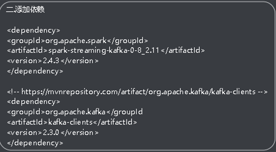

# Spark 思维导图详解

## **一：Spark的发展**

### **MapReduce的缺点**

- mr基于数据集计算，面向数据。对较小的数据集处理较慢
- 基于运算规则从存储介质中获取数据，最后将计算结构存储导介质中，所有主要应用于一次性计算，不适合数据挖掘和机器学习这样的迭代计算和图形挖掘计算。
- mr基于文件存储介质的操作，性能非常的慢。
- mr于Hadoop紧密耦合在一起，无法动态替换。

 

### **Spark思想**

- Spark基于Hadoop1x版本，采用了自己的方法替换了mr的计算缺点。
- spark计算基于内存，并且基于scala语法的开发，所有天生适合迭代式计算。

 

### **Hadoop框架的发展**

- 1x：hdfs + mapreduce框架
- 2x：hdfs + spark + yarn框架

 

### **Spark介绍**

spark是一种通用内存计算框架，使用scala语言进行实现，它是一种面向对象，函数式编程，能够操作本地集合对象一样轻松地操作分布式数据集。

 

### **Spark特点**

- 快：与mr相比，spark基于内存的运算要快上100倍以上。
- 易用：spark支持java,python,scala的API。
- 通用：spark提供了同意的解决方案。可以用于批处理，交互式查询，实时流处理，机器学习，图计算。
- 兼容性：spark可以非常方便的与其他开源产品进行融合。


### **Spark内置模块**

- spark core：实现了spark的基础功能（任务调度，内存管理，错误恢复，与存储系统交互等），以及对弹性api数据集的API定义。
- spark SQL：是spark用来操作结构化的程序包。支持多种数据源hive, parquet, josn等。
- spark streaming：对实时数据进行流式计算的组件，提供了同来操作数据流的API，并于spark core中的RDD API高度对应。
- spark Milb：提供了常见的机器学习（ML）功能的程序库。
- Graphx是spark面向图像计算的框架和算法库。
- 集群管理器：spark设计为可以搞笑的在一个计算节点导数千个计算节点之间伸缩计算。

 

### **Spark的使用场景**

- 复杂的批量处理（Batch Data Processing）,偏重在于处理海量数据的能力，至于处理速度可忍受，通常的时间可能实在数十分钟导数小时。
- 基于历史数据的交互式查询（Inter active Query），通常的时间在数十秒到数十分钟之间。
- 基于实时数据流的数据处理（Streaming Data Processing），通常在数百毫秒到数秒之间。

 

### **Spark部署模式**

- local（本地模式）：常用本地开发测试，本地还分为local单线程和local-cluster多线程，master和worker都为本机。运行时直接加断点调试即可。
- standalone（集群模式）：构建一个master + slave构成的spark集群，spark运行在集群中。简单来说，只用spark，不用yarn，所有不需要启动Hadoop。
- on yarn（集群模式）：运行在yarn资源管理器框架上，由yarn负责资源管理器，spark进行任务调度和计算。


- on mesos（集群模式）：运行在mesos资源管理器框架上，由mesos负责资源管理器，spark负责任务调度和计算
- on cloud（集群模式）：你如AWS的EC2，使用这个模式能很方便的访问Amazon的S3，spark支持多种分布式存储系统：HDFS和S3

 

### **Spark运行流程**

- 运行流程图


### **Spark通用运行流程**

- 任务提交后，都会先启动Driver进程
- Driver进程想集群管理器注册用于程序Application
- 集群管理器根据此任务的配置文件分配Execute并启动
- 当Driver所需的资源全部满足后，Driver开始执行main函数
- spark查村为懒执行，当指向action（行动）算子时，开始反向推算
- 根据款因爱进行stage（阶段）的划分，随后每个stage对于一个taskset，taskset中对应很多个task

- 根据本地化原则，task会被分发到指定的Execute中执行
- 在执行任务的过程中，Execute也不断与Driver进行通信，报告任务运行情况
- task在Execute上运行完后释放所有资源


### **Spark的基本使用**

- 启动spark：bin/start-all.sh
- 启动spark-shell：bin/spark-shell
- 使用spark求圆周率（官方案列）

```scala
bin/spark0submit --class org.apache.spark.examples.sparkpi\
--master spark://master:7070\ //指定master是那台机器
--executor -memory 1G\
--total -executor-cores 2\
./examples/jars/spark-examples_2.11_2.23.jar\
100
```


### **Spark RDD**

RDD介绍

- RDD（resilisent Distributed Dataset）弹性分布式数据集，是spark中基本的逻辑（数据）抽象。
- 代码中是一个抽象类，它代表一个不可变，可分区，里面的元素可以进行并行（多个线程一起执行）计算的集合。

 

RDD属性

- 一组分区（partition）：即数据集的基本组成单位
- 一个计算每个分区的函数
- RDD之间的依赖关系
- 一个partition，即RDD的分片函数
- 一个列表，存储存取每个partition的优先位置（preferred location）

 

RDD特点

- 分区：RDD逻辑上是分区的，每个分区数据是抽象的存在


- 从内存中创建RDD分区规则：


- 从内存中创建RDD:分区有两个函数parallelize和makeRDD这两个函数底层原理是一样。用这两个函数创建RDD时，如果没有传入分区参数，它将会默认将cpu核数的个数和2进行比较，较大的那个数为分区数。如果创建RDD时，传入分区数，则会将传入的分区数和2进行比较，较大的作为分区数。

 

- 从外部创建RDD分区规则：读取文件时，传递分区参数为最小分区数（传递的分区数和2进行比较，但不一定是这个分区数，取决于Hadoop读取文件时的分片规则）

 

 

- 只读：RDD表示制度的分区的数据集，要想改变RDD的数据，只能在现有的RDD基础通过算子转换创建新的RDD。

 

- 转换：由于RDD不可变，所有对RDD进行改动，只能通过转换操作

 

- 依赖：从一个RDD得到一个新的RDD，新的RDD包含了其他的RDD衍生所必须的信息，所有RDD之间一定存在依赖关系。


- 持久化：如果血缘关系较长，可以通过持久化（检查点） RDD来切断血缘关系

 


### **RDD的创建**

- 从集合（内存）中创建

- 从集合中创建RDD，spark主要提供了两种函数：parallelize和makeRDD


使用parallelize()

```scala
val rdd = scparallelize(Array(1, 2, 3, 4))
```

使用makeRDD()

```scala
val rdd1 = scmake(Array(1, 2, 3, 4))
```

注意：这两种方式等价，makeRDD底层原理就是parallelize，没有区别

 

从外部存储中创建

包括：本地文件系统，Hadoop支持的数据集（HDFS, HBase, cassandra）

```scala
val rdd2 = sctextfile(“hdfs || file 路径”)
```

说明：

- 默认情况下可以读取项目路径，也可以读取其他路径hdfs

- 默认从文件中读取的数据都是字符串类型

 

从其他创建

 

**RDD的保存**

```scala
Rdd1.saveAsTextFile(“output”) //output文件夹自动创建
```

 


## **常用算子**

### 转换算子

#### **map(func)算子**

作用：返回一个新的RDD，该RDD由每一个输入元素经过func函数转换后组成

过程：每次处理一个元素

需求：创建一个RDD，将所有的元素*2后返回新的RDD

```scala
var rdd1 = scparallelize(1 to 10)
var rdd2 = rdd1.map(_*2).collect()
Rdd2.foreach(println)
```

#### **mapPartition(func)算子**

作用：类似于map,但独立地RDD的每一分片（分区）上运行

过程：每次处理一个分区，运行结果和map一样，只是过程不同

优点：效率低于map算子，减少了发送到执行器的交互次数

缺点：当分区大小超过执行器的内存时，会出现溢出（oom）

```scala
val mapPar = rdd1.mapPartition(datas => {datas,map(data => data* 2)})
```

#### **flatMap(func)算子**

作用：类似于map，但是每一个输入元素可以被银映射为0或多个元素，所有要求传入的func函数返回的时一个序列，而不是单一元素。

简单来说：就是传入的元素可能时一个集合，将集合的每一个元素去除，并返回（偏平化的操作）

使用：

```scala
val listRDD:RDD[list[]int] = sc.makeRDD(Array(List(1, 2), List(3, 4)))
val flastmap:RDD[int] = listRDD.FLATmAP(data => datas)
```

#### **glom()算子**

说明：这个算子不能传参数，它会将同一个分区中的元素放到一个数组里，由多个分区就有多少个数组

作用：可以利用这个算子，多分区做相应的运算

使用：

```scala
val rdd:RDD[int] = sc.makeRDD(List(1, ,2, 32, 3, 4, 5, 4), 3)

//将同一个分区中元素放到同一个数组中，返回值的类型时数组
val glomRDD:RDD[Array[int]] = rdd.glom()

//将结果打印，这就是可以对数组进行操作
glomRDD.collect().foreach(arr =>{ println(arr.mkString(“ , ”)))}
```

#### **groupBy(func)算子**

作用：分组，按照传入的函数的返回值进行分组，将相同的key对于的值放入一个迭代器。

需求：创建一个RDD，按照元素模以2的值进行分组

说明：

分组的数据形成了对偶元组（k, v），k表示分组的key

使用：

```scala
val rdd1:RDD[int] = sc.make(List(1, 2, 3, 4))
val groupBy:RDD[](int, Interate[Int]) = rdd1.groupBy(i => i % 2)
```

#### **filter(func)算子**

作用：过滤，根据传入的逻辑，然后判断结果为true的元素，过来掉false的元素

使用：

```scala
Val rdd1:RDD[int] = sc.makeRDD(List(1, 2, 3, 4))
Val res:RDD[int] = rdd1.fiter(x => x %2 == 0)
```

结果：

```scala
Res = 2, 4
```


#### distinct([numPartition])算子

作用：对数据集去重操作，可以指定去重的分区数，也可以不指定

使用:

```scala
val rdd:RDD[int] = sc.makeRDD(List(1, 2, 3, 4, 3))
val distinct:RDD[int] = rdd.distinct(2) //指定两个分区
```

#### coalesce(numPartitions)算子

作用：缩减分区数，用于大数据集过滤后，提高小数据集的执行效率

需求：创建一个4个分区的RDD，对其缩减成3个分区

使用：

```scala
val listRDD:RDD[int] = sc.make(1 to 16, 4) //指定4个分区
Println(“缩减分区前：”+listRDD.partitions.size)

val coaleseRDD:RDD[int] = listRDD.coalesec(3)
Println(“缩减分区后 ”+listRDD.partitions.size)
```

#### repartitions(numPartitions)算子

作用：根据分区数，红心通过网络随机洗牌（shuffle）所有数据，可以解决数据倾斜

需求：创建一个4分区的RDD，对其分区

```scala
val rdd = sc.parallelize(1 to 16 ,4)
Println(“缩减分区前”+rdd.partitions.size)

val rerdd = rdd.repartitions(2)
Println(“缩减分区后 ”+rerdd.partitions.size)
```

**repartitions算子底层就是调coalesce shuffle = true**


- sortByKey按照key值排序，默认时升序，加入false参数后就是降序排序
- mapValue只对k-v类型进行操作
- join将类型为(k,v), (k, m)形成一个新的RDD(k,(k,m)).即将key相同的value组合到一起形成一个元组。如果由一堆k-v在另一个RDD中不存在，这个k-v就不会返回

 

 

 

 

### 行动算子

- reduce化简
- collect()在驱动程序中，一数组的形式返回数据集中的所有的元素
- count()返回RDD中的元素的个数
- first()返回RDD中第一个元素
- take(n)取出RDD中前n个元素
- takeOrdered(n)取出RDD排序后的前n个元素
- aggregate(n)(func, func)将每个分区里面的元素和初始值进行聚合，分区和分区聚合时也需要加上初始值
- fold(n)(func)分区内和分区间的操作相同时的aggregate简化操作
- saveAsTextFile(path)保存文本文件
- saveAsSequenceFile(path)将元素保存Hadoop sequnence个数保存
- saveAsObject(path)将RDD中的元素保存序列化对象
- countByKey返回每一个key的个数
- foreach

 

**小结：**

**每调用一次行动算子，就会执行一次run.job。**

**行动算子在driver中执行，转换算子在executor中执行**

 

## RDD函数传递

在实际开发中我们往往需要自己定义一些对RDD的操作，那么此时需要注意的是：初始化工作是在Driver中进行的。而实际上是在Executor端进行的。这就涉及到跨进程通信，是需要序列化的。

 

## RDD依赖关系

- RDD依赖关系基本介绍：RDD只支持处理都转换，即在大量记录上执行单个操作。将创建RDD的一系列Lineage（血统）记录下来，一边恢复丢失的分区。RDD的Lineage会记录RDD元数据信息和转换关系，当该RDD的部分分区数据丢失时，它可以根据这些信息来重新运算和恢复丢失的数据分区

 

- 查看RDD之间的依赖关系：List.toDegugString //查看RDD的所有依赖关系，List.dependencies //查看当前RDD上一层依赖关系

 

- 窄依赖：窄依赖指的是每一个父RDD的Partitions最多被子RDD的一个Partitions使用。即一个分区的数据原封不懂的给另一个分区的就叫窄依赖。可以形象的比如成独生子女

 

- 宽依赖：宽依赖指的是多个子RDD的partitions会依赖同一个父RDD的partition，这就会硬气shuffle。简单来说，就有shuffle过程的都叫宽依赖。可以形象的比喻成超生

 

## DAG

DAG（Directed Acyclic Graph）叫做有向无环图。原始的RDD通过一系列转换就形成了DAG，根据DAG之间的依赖关系的不同将DAG划分为不同的stage（阶段），对窄依赖，partition的转换处理在stage中完成该计算。对于宽依赖，由于有shuffle的存在，只能在parent（起源）RDD处理完成后，才能进行接下来的计算，因此宽依赖时划分stage的依据。

 

 

## 任务划分（面试重点）

RDD任务切分中间分为：Application（应用）Job（作用）,Stage（阶段）， Task（任务）

- Application：初始化一个sparkcontext即生成Application
- Job：每个action（行动）算子都会生成一个job
- Stage：根据RDD之间的宽依赖的不同将job划分成不同的Stage,遇到一个宽依赖就会划分一个Stage
- Task：Stage是一个TaskSet，将Stage划分的结果发送到不同的Executor执行即为一个Task


**注意：**

- Appcation -> job ->stage -task 每一层都是1对n的关系
- 每个分区都对应一个task，即将每个分区交给Executor执行
- 判断task数量的方法，窄依赖之间之划分一个task，宽依赖根据执行结果最后有几个分区来判断task数量，每个分区对于一个task

 

**RDD缓存与检查点**

- RDD缓存
- RDD的缓存通过persist方法或cache方法将前面的计算记过缓存，默认情况下persist()会把数据序列化的形式缓存在JVM中的堆空间
- 但是并不是这两个方法被调用时立即进行缓存，而是触发后面的action（行动算子）时，该RDD将会缓存在计算节点的内存中，并供给后面重用
- 缓存有可能丢失，或者存储于内存的数据由于内存的不足而被删除，RDD的缓存容错机制保证了即使缓存丢失也能计算的正确执行。通过基于RDD的一系列转换，丢失的数据会被重用，由于RDD的各个partitions分区是相对独立的，因此只需要计算丢失的部分即可，并不需要重算全部的partition

 

## 检查点

Spark中对于数据的保存处理持久化操作之外，还提供了一种检查点的机制，检查点本质就是通过RDD写入DISK（磁盘）做检查点，是为了通过lineage做容错的辅助，lineage过长会导致容错成本过高，这样就不如在中间做检查点容错，如果之后节点出现问题而丢失分区，从检查点RDD开始重做lineage，就会减少开销。检查点通过将数据写道HDFS文件系统实现了RDD的检查功能。

- RDD 缓存机制和检查点一般用于RDD血缘关系较长时。
- 缓存存在内存中，检查点存在磁盘中。

 

 

## 数据的存储和读取

- 本地文件系统
- MySQL数据库
- HBase数据库

 

## RDD编程进阶

- 累加器（累加器是只写共享变量）累加器它用来对信息进行聚合，通常在想spark传递函数时，比如使用map()函数或者filter()传条件时，可以使用驱动器程序中定义的变量，但是集群中运行的每个任务都会得到这些变量的一份新的副本，更新这些副本的值也不会影响驱动器中的对应变量，如果我们向实现所有分片处理时更新共享变量的功能，那么累加器可以实现我们的需求。

 

- 广播变量（广播变量只读共享变量）广播变量用来搞笑分发较大的对象。向所有工作节点发送较大的只读值，以供一个或多个spark操作使用。比如，如果你的应用需要想所有节点发送一个较大的只读查询表，甚至时机器学习算法中的一个很大大特征向量，广播变量用起来都很顺手。在多个并行操作中使用同一个变量，spark会为每个任务分别发送。


## Spark SQL基础

### 介绍

Spark SQL是模仿hive而来的，它是spark用来处理结构化数据的一个模块，它提供了两个编程抽象，DataFrame和DataSet，并且作为分布式SQL查询引擎的作用。

 

学习使用hive，它是hive SQL转换成mapreduce然后提交到集群中执行，大大简化了mapreduce的程序的复杂性，由于mapreduce这种计算框架执行效率比较慢，所以spark SQL应运而生，他将spark SQL转换成RDD,然后提交到集群去执行，所以执行效率非常的快。

 

 

### 特点

- 易整合
- 统一的数据访问方式
- 兼容hive
- 标准的数据连接

 

### 两个编程抽象

- DataFrame：与RDD类似，DataFrame也是一个分布式数据容器，然后DataFrame更像传统数据库的二位表格，处理表格以外，还记录数据的结构信息，即schema。同时，与hive类似，DataFrame也支持嵌套数据类型（struct,array,map）.从API易用性的角度上看，DataFrame API提供的时一套高层的关系操作，比函数式RDD API要更加友好了，门槛低。

 

- DataSet：是DataFrame API的一个扩展，是spark最新的数据抽象
- 用户友好的API风格，即具有类型安全检查也具有DataFrame的查询优化特性
- DataSet支持编解码器，当需要访问非堆上的数据时可以避免反序列化整个对象，提高了效率
- 样例类被用在DataSet中定义数据的结构信息，样例类中的每个属性的名称直接映射到DataFrame中的字段名称

 

**说明**

- DataFrame在RDD的基础上增加了结构，这样才能提供sql查询
- DataSet在DataFrame的基础上增加了类型
- 如果同样的数据都给到着三个数据类型，它们分别计算后，都会给出相同的结构，不同的是它们执行的效率和执行方式


- 在后期的spark版本中，DataFrame会逐步取代RDD和DataFrame成为唯一的API接口

  

- DataFrame是DataSet的特列，DataFrame = DataSet[ROW],所以可以通过as的方式将DataFrame转换成DataSet,ROW是一个类型，跟car person这些类型一样，所以游标结构的信息是我们都用ROW来表示

  

- DataFrame只是知道字段，但是不知道字段的类型，所以在执行这些操作的时候是没办法

 

### DataFrame创建

Spark Session是spark最新的SQL查村的起始点，实质上是SQLContext和HiveContext组合，所以在SQLContext和HiveContext上可用的API在sparkSession上同样是可以使用的，sparkSession内部封装了sparkContext，所以计算实际上由sparkContext完成的

 

在sparkSQL中sparkSession是创建DataFrame和执行SQL的入口，创建DataFrame有三种方式：通过spark的数据源进行创建，从一个存在的RDD进行转换，还可以从一个hivetable中查询返回

 

Spark.read可以读取文件的类型

Csv format jdbc json load option options orc parquet scemattable text textFile

 

- 创建DataFrame

```scala
val df = spark.read.json(“file:///........”)
```

- 查看DataFrame中的内容

```scala
Df.show()
```

- 将DataFrame转换成一个临时视图（表），一边使用SQL

```scala
Df.createTempView(“student”) //student为视图名
```

- 使用SQL查询语句

```scala
spark.sql(“select * from student”).show()
```

注意：

临时表是Session范围内的，Session退出后，表就失败了。如果向应用范围内有效，可以使用全局表。朱使用全局表需要全路径访问。如：global_temp.peopl

 

- 对于DataFrame创建一个全局表

```scala
Df.createGlobalTempView(“people”)
```

- 通过SQL全局表实现查询全表

```scala
spark.sql(“select * from global_temp.people”).show()
```

- 在新的session中访问全局表

```scala
spark.newSession().sql(“select * from global_temp.people”).show()
```

**DSL风格**

- 创建一个DataFrame

```scala
 Val df = spark.read.json(“file:////..................json”)
```

- 查看DataFrame中schema信息

```scala
Df.printSchema
```

- 查看 ”name” 列的数据

```scala
Df.select(“name”).show()
```

- 将年龄字段加1

```scala
Df.select($”aage” + 1).show()
```

- 查看年龄大于18的行

```scala
Df.select($”age” > 18).show()
```

- 根据每个年龄段进行分组

```scala
 Df.groupBy(“age”).count().show
```

### DataSet创建

**DataSet的基本介绍**

DataSet是具有强类型的数据集合，需要提供对应的类型信息

 

```scala
// 创建样例类
Case class person(name:String age:int)

// 根据样例类模板创建DS
Val classDS = Seq(person(“zhangshan”, 17)).toDS

//查看
classDS.show
```

- 将DS转换成表，以便于sql语法

```scala
ClassDS.createTempView(“xx”)

Spark.sql(“select * from xxx”).show
```

## RDD DataFrame DataSet之间的转换

 ### RDD与DataFrame相互转换

- RDD转换成DataFrame

  

- 如果需要RDD和DF或者DS之间进行转换那么需要引入import spark.implicits._(spark不是包名，二十sparksession对象的名称)

  

- 前置条件：导入隐式转换并创建一个RDD

 

- 导包的方式转换

```scala
 Import spark.implicits._
 var rdd = sc.makrRDD(List(1, 2, 23, 4, 5))

 Rdd.toDF(“id”) //为RDD添加结构就成立DF

 Df.show
```

 

 

- 样例类方式转换

 

```scala
var rdd = sc.makeRDD(List((“zhangshan”, 22),(“lisi”, 32),(“wangwu”,23)))

 // 创建样例类
 Case class people(name:String, age:Int)

 // 通过map算子将rdd中每个元素传入到样例类(指定结构)
 var peopleRDD = rdd.map(t => people(t._1, t._2))

 // 转换
 var df = peopleRDD.toDF
 Df.show
```

 

- 将DataFrame转换成RDD

```scala
var rdd2 = df.rdd
```


### RDD与DataSet相互转换

- 将RDD转换成DataSet

```scala
 var rdd = sc.makeRDD(List((“zhangshan”, 22),(“lisi”, 32),(“wangwu”,23)))

 // 创建样例类
 Case class people(name:String, age:Int)

 // 将rdd中元素传入样例类中
 var mapRDD = rdd.map(t => people(t._1, t._2))

 // 转换成DS
 var ds = mapRDD.toDS
 Df.show
```

- 将DS转换成RDD

```scala
 var rdd2 = ds.rdd
```

### DataFrame与DataSet相互转换

- 将DF转换成DS

```scala
 var rdd = sc.makeRDD(List((“zhangshan”,22),(“lisi”, 32),(“wangwu”,15)))

 //将RDD加上结构编程了DF
 var df = rdd.toDF(“name”, “age”)

 //将DF加上类型就变成了DS
 Case class people(name:String, age:Int) //这个就是类型
 var ds = df.as[people]
```

- 将DS转换成DF

```scala
 var df2 = ds.toDF
```

### 三者之间的共性

**三者的共同点**

- RDD DataFrame DataSet全部都是spark平台下的分布式弹性数据集，为处理超大型数据提供便利

  

- 三者都有惰性机制，在进行创建，转换，如map方法时，不会立即执行，只有遇到行动算子Action,如foreach时，三者才会开始便利


- 三者都会根据spark内存情况自动缓存运算，这样即使数据两很大，也不必担心内存溢出

  

- 三者都有partition的概念

  

- 三者都有许多共同的函数，如filter sort等

  

- 在对DataFrame和DataSet进行操作到需要这个包支持 import spark.implicits._

  

- DataFrame和DataSet均可以使用匹配模式获取各个字段的类型

 

 

**三者的区别**

- RDD一般和spark milb同时使用， 但不支持sparkSQL操作

  

- DataFrame与RDD和DataSet不同，DataFrame每一行的类型固定为ROW,每一列的值无法直接访问，只有通过解析才能获取各个字段的值

  

- DataFrame和DataSet一般不与sparkmlib同时使用

 

 

**IDEA创建spark SQL程序**


## 用户自定义函数

### **UDF**

用户自定义函数

强类型的DataSet和弱类型的DataSet都提供了相关的聚合函数，

如：count(),countdistinct(),avg(),max(), min().除此之外，用户可以设定自己的自定义函数

 

### UDAF

- 用户自定义聚合函数
- 通过继承UserDedineAggregateFunction来实现自定义函数，直接用SQL语句就可以使用该函数
- 通过继承Aggregator，可用DSC风格使用函数

 

 

### Spark SQL数据源

- 文件的读取与保存

Spark SQL 的默认数据源为Parquet格式。数据源为Parquet文件时，spark SQL可以方便的执行所以的操作。修改spark.sql.source.default可以修改默认的数据源格式

 

- 读取文件

```scala
// 读取json文件常规操作
Spark.read.json(“/.........json”)

//通用的读取文件方式（本地文件）
Spark.read.fomat(“json”).load(“/.......json”)

//读取hdfs上的文件
Spark.read.format(“json”).load(“hdfs://192......../data.json”)

// 写文件到本地或者hdfs
// 将文件写入到本地
Df.write.format(“json”).save(“/........./output”)

//将文件写入到hdfs
Df.write.format(“json”).save(“hdfs://192....../output”)
```

- 写入时可以添加mode（写入方式）

```scala
// 以追加的方式写入
比如：df.write.format(“json”).mode(“append”).save(“hdfs://192...../output”)
```

**mode介绍：error(默认) append（追加） overwrite（覆写） ignore（数据存在，则忽略）**

 

### MySQL读取与存储

- 取出数据库中的数据

```scala
Spark.read.foemat(“jdbc”)
.option(“url”,jdbc:mysql://master:3306/rdd)
.option(“dbtable”,”user”)
.option(“user”,”root”)
.option(“passwd”, “mysql”)
.load()
```

- 将数据写入到MySQL

```scala
Df.write.mode(“mode”)
.option(“url”,jdbc:mysql://master:3306/rdd”)
.option(“dbtalbe”.”user”)
.option(“passwd”,”mysql”)
.save()
```

### Spark操作hive数据库

**基本介绍**

默认情况下，spark自带hive，可以直接写入spark.sql(“.....”)来操作内置的hive数据库

 

**使用外部hive**

- 删除spark中内置的hive,即删除matastore_db和spark-warehouse文件夹
- 将外部hive中的hive-site.xml文件复制到spark/conf中
- 重启spark-shell
- 这是spark.sql(“.....”)访问的就是外部的hive了
- 可以使用bin/spark-sql命令段操作hive

 

 

## Spark Sreaming

### 基本介绍

spark streaming 用于流式数据处理，spark streaming支持多种数据源输入，列如：kafka，flume,twitter,zeroMQ和简单的TCP套接字等等。数据输入后可以使用spark的高度抽象原语，如:map ,reduce,join,window进行操作运算，而记过也可以保存在很多的地方，如HDFS,数据库等。


和spark基于RDD的概念很相似，spark streaming时用来离散化流(discretized stream)作为抽象表示，叫做DStream。DStream时随着时间推移而收到的数据的序列。每个时间收到的数据都作为RDD存在，而DStream是由RDD组成的序列，因此得名“离散化”

### spark streaming特点

- 易用
- 容错
- 易整合到spark体系

 

### wordCount案列实操

需求：使用netcat工具向9999端口不断的发送数据，通过sparkstreaming读取端口并统计不同单词的出现的次数

- Linux安装netcat工具

```sh
yum install -y nc
Nc -lk 9999 //向9999端口发送消息
```

- 代码演示

```scala
//使用spark streaming完成wordcount
//构建sparkconf对象
var conf = new sparkConf().setMaster(“local[*]”).setAppName(“wordcount”)
 

//构建实时数据分析环境对象
//采集周期：以指定的时间为周期采集实时数据
var streamingContext:StreamingContext = new StreamingContext(conf, Second(3))


//从指定的端口采集数据
var socketLineDStream;ReciverInputDStream[String] = 
streamingContext.socketTextStream(“192..........”,99999)

//将采集的数据进行分解
var wordDStream:DStream[String] = socketLineDStream.flatMap(Line =>line.split(“”)) 

//将数据结构转换成K-V类型
var mapDStream:DStream[(String.Int)] = wordDStream.map(a -> a -> 1)

//统计每个单词的数量
var mapToSumDStream:DStream[(String, Int)] = mapDStream.reduceByKey(_+_)

//将结果打印
mapToSumDStream.println()

//启动采集器
streamingContext.start()
 
//Driver等待采集器执行
Streamingcontext.awaitTermination()
```

### DStream创建

**DStream**

Sparkstreaming原生支持一些不同的数据源。一些和核心的数据源已经已经被打包到spark streaming的maven工件中，而其他的一些数据源可以通过spark streaming kafka等附加的工件获取。每个接收器都已spark执行器程序中的一个长期运行的任务运行，因此会占据分配给应用的CPU核心。此外，我们还需要有可以的CPU核心来处理数据。


这意味着如果要运行多个接收器，就必须至少有和接收器数目相同的核心数，还要加上用来完成计算所需要的核心数。


列如：如果想要在流计算应用中运行10个接收器，那么至少为应用分配11个CPU核心，所以如果在本地运行，不要使用local[1]

 

### 文件数据源

文件数据源：能够读取所以HDFS API兼容的文件系统，通过filestream方式进行读取，spark streaming 将会监控dataDriectory目录不断移动进来的文件，记住目前不支持嵌套目录

 

**注意：**

- 文件需要有相同的数据格式
- 文件进入dataDriectory的方式需要通过移动或者重命名来实现
- 一旦文件移动目录，则不能在修改，即便修改也不会读取数据

 

 

- 代码演示

```scala
var conf = new 
sparkconf().setMaster(“local[*]”).setAppName(“sparkstreaming01_FileDataSource”) 

//构建实时分析数据分析环境对象
//采集周期：以指定的时间为周期采集实时数据
var streamingContext:StringContext = new StringContext(conf, Second(5))

// 从指定文件夹采集数据
var flieDStream:DStream[String] = streamingContext.textfileStream(“D:\\spark\\test”)

//将采集的数据进行分解
var wordDStream:DStream[String] = fileDStream.flatMap(line =>line.split(“ ”))

// 将数据结构转换为K-V类型
var mapToSumDStream:DStream[(String, Int)] = mapDStream.reduceByKey(_+_)

//将结果打印
mapToSumDStream.print() 
```

- RDD队列用法及说明

测试过程，可以通过使用ssc.queueStream(queueOfRDDs)来创建DStream，每一个推送到这个队列的RDD，都会作为一个DStream处理

 

- 需求

循环创建几个RDD，将RDD放入队列中。通过sparkstreaming创建DStream，计算wordcount

 

 

### 从kafka中采集数据

**用法和说明**

在工程中需要引入Maven工件spark streaming-kafka_2.10来使用它。包内提供的kafkaUtils对象可以在streamingcontext和javastreamingcontext中以你的kafka消息队列创建出DStream。


由于kafkaUtils可以订阅多个主题，因此它创建出的DStream由承兑的主题和消息组成。要创建出一个流数据，需要使用streamingcontext实列。


一个由都好隔开的zookeeper主机列表字符串，消费者组的名字（唯一的名字），以及一个从主题到针对这个主题的接收器线程数的映射表来调用createStream()方法

 

- 添加依赖




- 代码演示

```scala
Package sparkstreaming
Import kafka.seriallzer.StringDecoder
Import org.apache.spark.Sparkconf
Import org.apache.spark.streaming.[Seconds, streamingContext]
Import org.apache.spark.streaming.kafka._

Object01{
 Def main(args:Array[String]): Unit = {
//待接收的topic名称
var topics = “”name1, spark
 

//broker地址
var brokers = “192....:9092” 

//创建sparkconf对象
var conf = new sparkconf().setMaster(“local[*]”).setAppName(“kafka test”) 

//创建ssc对象
var ssc = new SreamingContext(conf, Seconds(3))

//分割待接收的topic

var topicsSet = topic.spilt(“,”).toset 

//连接kafka的配置文件
var kafkaParams = Map[String, String](“metadata.broker.list” -> brokers)

//根据配置文件获取kafka消息
var messages = kafkaUtils.createDriectStreaming[String, String, StringDecoder, 
StringDecoder](ssc, kafkaParams, topicsSet)

//读取kafka消息
var lines = messages.map(_._2) 

var words = lines.flatMap(_.split(“ ”)).map(x =>(x, 1))
Words.reduceByKey(_ + _).print()
Ssc.start()
Ssc.awaitTermination()

	}
}
```

 

### DStream转换

- **DStream转换基本介绍**

DStream上的源于于RDD类似，非为transfomation(转换)和output opteration(输出)两种，此外转换操作还有一些比较特俗的原语。比如：uodateStateByKey() transform()以及各种window相关的原语

 

- **无状态转换操作**

无状态转换就是把简单的RDD转换操作应用到每个批次上，也就是转换DStream中的每一个RDD。简单的说就是每个批次的数据没有关联。

 

- **有状态转换操作（重点）**

updateStateByKey原语用于记录历史激励，又是，需要在DStream中跨批次维护状态（列如流计算中累加wordcount）。


针对这种情况，uodateStateByKey()提供了对一个状态变量的访问，用于键值对形式DStream。给定一个由(键， 时间)对构成的DStream，并传递一个指定如何根据新的事件跟新跟新每个键对应转台的函数，它可以构建出一个新的DStream，器内部数据为键值对。


updateStateByKey()的结果回事一个新的DStream,器内部的RDD序列是由每个时间区间对应的（键，状态）对组成。


updateStateByKey操作使得我们可以在用新的信息进行更新时保持任意的状态。为使用这个功能，需要做如下步骤：

- 定义状态，状态可以是一个任意的数据类型
- 定义状态更新函数，用此函数阐明如何使用之前的状态和来自输入流的新值对状态进行更新。
- 使用updateStateByKey需要对检查点目录进行配置，会使用检查点来保存状态

 

### window函数

- window Operations（窗口操作）介绍
- window Operation可以设置窗口的大小和华东的间隔来获取当前streaming的用于状态

```scala
//设置窗口函数
//窗口大小应该为采集周期的整数倍，窗口华东的步长也应该为采集周期的整数倍
Val window:DStream[(String, String)] = kafkaDStream.window(Seconds(9), Second(3))
```