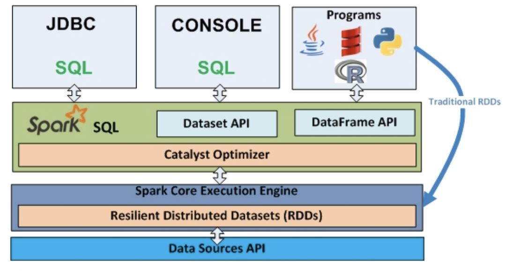
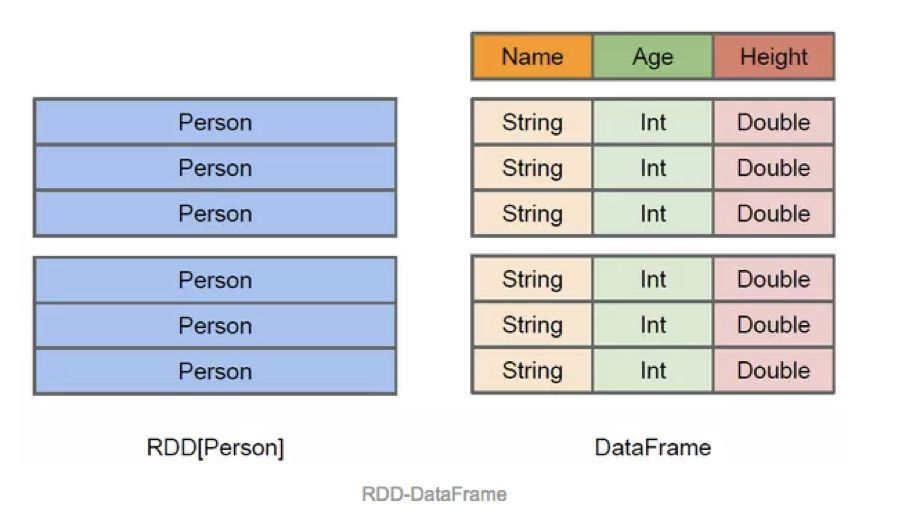
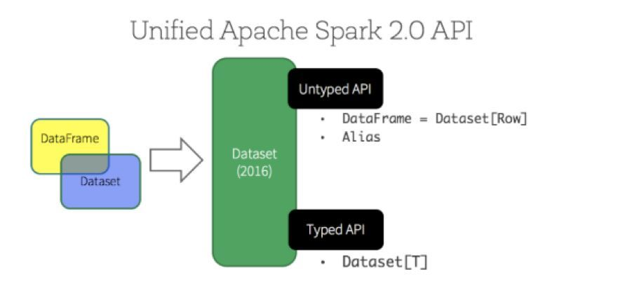
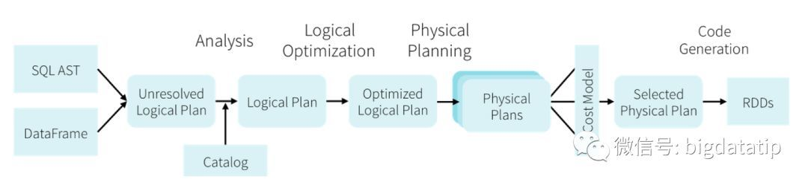
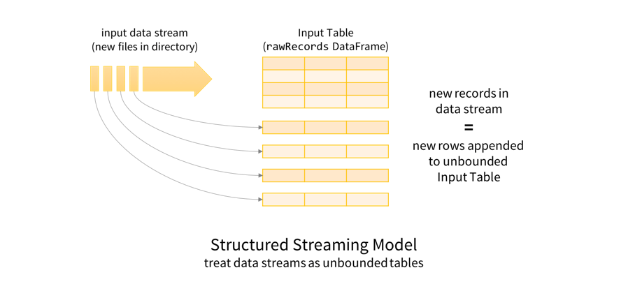
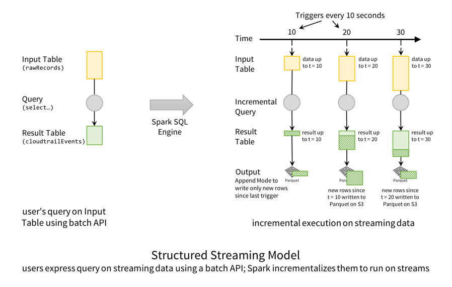
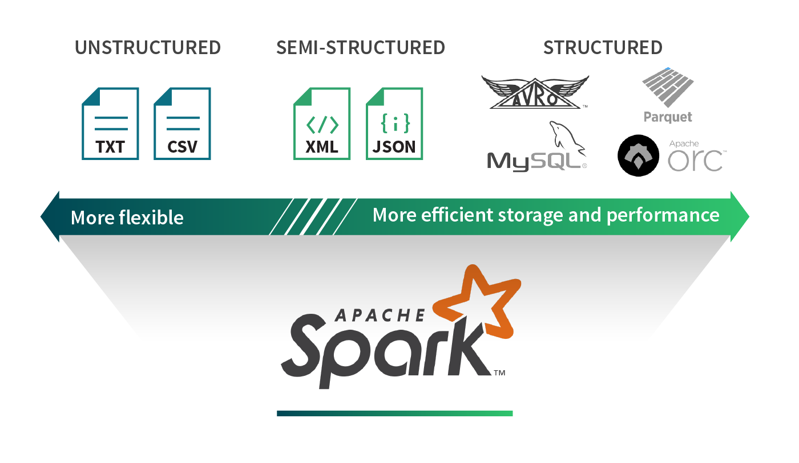
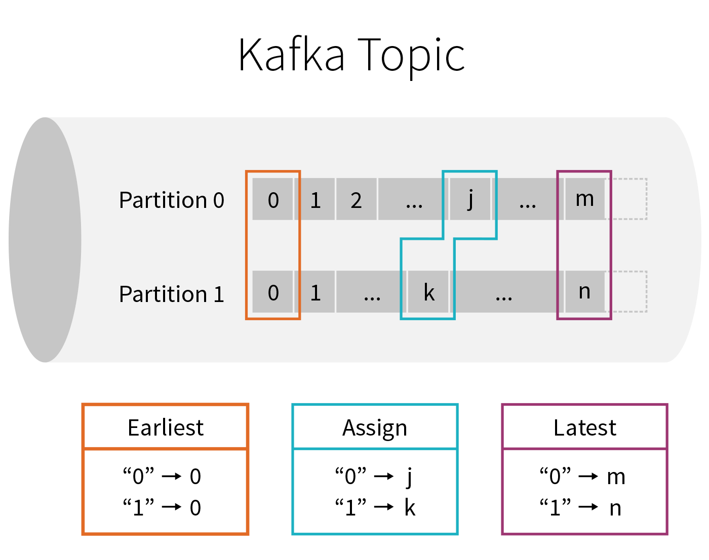
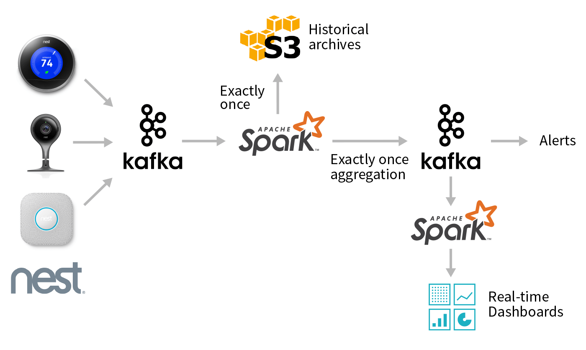

# Spark SQL/Hive实用函数大全

总结Spark SQL/Hive中常用的函数，主要分为字符串函数、JSON函数、时间函数、开窗函数以及在编写Spark SQL代码应用时实用的函数算子五个模块。

### **字符串函数**

#### **1. concat**

对字符串进行拼接：concat(str1, str2, ..., strN) ，参数：str1、str2...是要进行拼接的字符串。

```sql
-- return the concatenation of str1、str2、..., strN
-- SparkSQL
select concat('Spark', 'SQL');
```

#### **2. concat_ws**

在拼接的字符串中间添加某种分隔符：concat_ws(sep, [str | array(str)]+)。

参数1：分隔符，如 - ；参数2：要拼接的字符串（可多个）

```sql
-- return the concatenation of the strings separated by sep
-- Spark-SQL
select concat_ws("-", "Spark", "SQL");
```

#### **3. encode**

设置编码格式：encode(str, charset)。

参数1：要进行编码的字符串 ；参数2：使用的编码格式，如UTF-8

```sql
-- encode the first argument using the second argument character set
select encode("HIVE", "UTF-8");
```

#### **4. decode**

转码：decode(bin, charset)。

参数1：进行转码的binary ；参数2：使用的转码格式，如UTF-8

```sql
-- decode the first argument using the second argument character set
select decode(encode("HIVE", "UTF-8"), "UTF-8");
```

#### **5. format_string / printf**

格式化字符串：format_string(strfmt, obj, ...)

```sql
-- returns a formatted string from printf-style format strings
select format_string("Spark SQL %d %s", 100, "days");
```

#### **6. initcap / lower / upper**

initcap：将每个单词的首字母转为大写，其他字母小写。单词之间以空白分隔。

upper：全部转为大写。

lower：全部转为小写。

```sql
-- Spark Sql
select initcap("spaRk sql");

-- SPARK SQL
select upper("sPark sql");

-- spark sql
select lower("Spark Sql");
```

#### **7. length**

返回字符串的长度。

```sql
-- 返回4
select length("Hive");
```

#### **8. lpad / rpad**

返回固定长度的字符串，如果长度不够，用某种字符进行补全。

lpad(str, len, pad)：左补全

rpad(str, len, pad)：右补全

注意：如果参数str的长度大于参数len，则返回的结果长度会被截取为长度为len的字符串

```sql
-- vehi
select lpad("hi", 4, "ve");

-- hive
select rpad("hi", 4, "ve");

-- spar
select lpad("spark", 4, "ve");
```

#### **9. trim / ltrim / rtrim**

去除空格或者某种字符。

trim(str) / trim(trimStr, str)：首尾去除。

ltrim(str) / ltrim(trimStr, str)：左去除。

rtrim(str) / rtrim(trimStr, str)：右去除。

```sql
-- hive
select trim(" hive ");

-- arkSQLS
SELECT ltrim("Sp", "SSparkSQLS") as tmp;
```

#### **10. regexp_extract**

正则提取某些字符串

```sql
-- 2000
select regexp_extract("1000-2000", "(\\d+)-(\\d+)", 2);
```

#### **11. regexp_replace**

正则替换

```sql
-- r-r
select regexp_replace("100-200", "(\\d+)", "r");
```

#### **12. repeat**

repeat(str, n)：复制给定的字符串n次

```sql
-- aa
select repeat("a", 2);
```

#### **13. instr / locate**

返回截取字符串的位置。如果匹配的字符串不存在，则返回0

```sql
-- returns the (1-based) index of the first occurrence of substr in str.

-- 6
select instr("SparkSQL", "SQL");

-- 0
select locate("A", "fruit");
```

#### **14. space**

在字符串前面加n个空格

```sql
select concat(space(2), "A");
```

#### **15. split**

split(str, regex)：以某字符拆分字符串 split(str, regex)

```sql
-- ["one","two"]
select split("one two", " ");
```

#### **16. substr / substring_index**

```sql
-- k SQL
select substr("Spark SQL", 5);

-- 从后面开始截取，返回SQL
select substr("Spark SQL", -3);

-- k
select substr("Spark SQL", 5, 1);

-- org.apache。注意：如果参数3为负值，则从右边取值
select substring_index("org.apache.spark", ".", 2);
```

#### **17. translate**

替换某些字符为指定字符

```sql
-- The translate will happen when any character in the string matches the character in the `matchingString`
-- A1B2C3
select translate("AaBbCc", "abc", "123");
```

### **JSON函数**

#### **1. get_json_object**

```sql
-- v2
select get_json_object('{"k1": "v1", "k2": "v2"}', '$.k2');
```

#### **2. from_json**

```sql
select tmp.k from  (
select from_json('{"k": "fruit", "v": "apple"}','k STRING, v STRING', map("","")) as tmp
);
```

这个方法可以给json定义一个Schema,这样在使用时，就可以直接使用a.k这种方式了，会简化很多。

#### **3. to_json**

```sql
-- 可以把所有字段转化为json字符串，然后表示成value字段
select to_json(struct(*)) AS value;
```

### **时间函数**

#### **1. current_date / current_timestamp**

获取当前时间

```sql
select current_date;

select current_timestamp;
```

#### **2. 从日期时间中提取字段/格式化时间** 

##### 1）year、month、day、dayofmonth、hour、minute、second**

```sql
-- 20
select day("2020-12-20");
```

##### **2）dayofweek(1 = Sunday, 2 = Monday, ..., 7 = Saturday)、dayofyear**

```sql
-- 7
select dayofweek("2020-12-12");
```

##### **3）weekofyear(date)**

```sql
/**
   * Extracts the week number as an integer from a given date/timestamp/string.
   *
   * A week is considered to start on a Monday and week 1 is the first week with more than 3 days,
   * as defined by ISO 8601
   *
   * @return An integer, or null if the input was a string that could not be cast to a date
   * @group datetime_funcs
   * @since 1.5.0
   */
  def weekofyear(e: Column): Column = withExpr { WeekOfYear(e.expr) }

-- 50
select weekofyear("2020-12-12");
```

##### **4）trunc**

截取某部分的日期，其他部分默认为01。第二个参数: YEAR、YYYY、YY、MON、MONTH、MM

```sql
-- 2020-01-01
select trunc("2020-12-12", "YEAR");

-- 2020-12-01
select trunc("2020-12-12", "MM");
```

##### **5）date_trunc**

参数：YEAR、YYYY、YY、MON、MONTH、MM、DAY、DD、HOUR、MINUTE、SECOND、WEEK、QUARTER

```sql
-- 2012-12-12 09:00:00
select date_trunc("HOUR" ,"2012-12-12T09:32:05.359");
```

##### **6）date_format**

按照某种格式格式化时间

```sql
-- 2020-12-12
select date_format("2020-12-12 12:12:12", "yyyy-MM-dd");
```

#### **3. 日期时间转换**

##### **1）unix_timestamp**

返回当前时间的unix时间戳。

```sql
select unix_timestamp();

-- 1609257600
select unix_timestamp("2020-12-30", "yyyy-MM-dd");
```

##### **2）from_unixtime**

将unix epoch（1970-01-01 00:00:00 UTC）中的秒数转换为以给定格式表示当前系统时区中该时刻的时间戳的字符串。

```sql
select from_unixtime(1609257600, "yyyy-MM-dd HH:mm:ss");
```

##### **3）to_unix_timestamp**

将时间转化为时间戳。

```sql
-- 1609257600
select to_unix_timestamp("2020-12-30", "yyyy-MM-dd");
```

##### **4）to_date / date**

将时间字符串转化为date。

```sql
-- 2020-12-30
select to_date("2020-12-30 12:30:00");
select date("2020-12-30");
```

##### 5）to_timestamp

将时间字符串转化为timestamp。

```sql
select to_timestamp("2020-12-30 12:30:00");
```

##### **6）quarter**

从给定的日期/时间戳/字符串中提取季度。

```sql
-- 4
select quarter("2020-12-30");
```

#### **4. 日期、时间计算**

##### **1）months_between(end, start)**

返回两个日期之间的月数。参数1为截止时间，参数2为开始时间

```sql
-- 3.94959677
select months_between("1997-02-28 10:30:00", "1996-10-30");
```

##### **2）add_months**

返回某日期后n个月后的日期。

```sql
-- 2020-12-28
select add_months("2020-11-28", 1);
```

##### **3）last_day(date)**

返回某个时间的当月最后一天

```sql
-- 2020-12-31
select last_day("2020-12-01");
```

##### **4）next_day(start_date, day_of_week)**

返回某时间后the first date基于specified day of the week。

参数1：开始时间。

参数2：Mon、Tue、Wed、Thu、Fri、Sat、Sun。

```sql
-- 2020-12-07
select next_day("2020-12-01", "Mon");
```

##### **5）date_add(start_date, num_days)**

返回指定时间增加num_days天后的时间

```sql
-- 2020-12-02
select date_add("2020-12-01", 1);
```

##### **6）datediff(endDate, startDate)**

两个日期相差的天数

```sql
-- 3
select datediff("2020-12-01", "2020-11-28");
```

##### **7）关于UTC时间**

```sql
-- to_utc_timestamp(timestamp, timezone) - Given a timestamp like '2017-07-14 02:40:00.0', interprets it as a time in the given time zone, and renders that time as a timestamp in UTC. For example, 'GMT+1' would yield '2017-07-14 01:40:00.0'.

select to_utc_timestamp("2020-12-01", "Asia/Seoul") ;

-- from_utc_timestamp(timestamp, timezone) - Given a timestamp like '2017-07-14 02:40:00.0', interprets it as a time in UTC, and renders that time as a timestamp in the given time zone. For example, 'GMT+1' would yield '2017-07-14 03:40:00.0'.

select from_utc_timestamp("2020-12-01", "Asia/Seoul");
```

### **常用的开窗函数**

开窗函数格式通常满足：

function_name([argument_list]) OVER ( [PARTITION BY partition_expression,…] [ORDER BY sort_expression, … [ASC|DESC]])

function_name: 函数名称，比如SUM()、AVG()

partition_expression：分区列

sort_expression：排序列

注意：以下举例涉及的表employee中字段含义：name（员工姓名）、dept_no（部门编号）、salary（工资）

#### **1. cume_dist**

如果按升序排列，则统计：小于等于当前值的行数/总行数(number of rows ≤ current row)/(total number of rows）。如果是降序排列，则统计：大于等于当前值的行数/总行数。用于累计统计。

举例：

1）统计小于等于当前工资的人数占总人数的比例 ，用于累计统计

```sql
SELECT
 name,
 dept_no,
 salary,
 cume_dist() OVER (ORDER BY salary) as cume
FROM employee;
```

2）按照部门统计小于等于当前工资的人数占部门总人数的比例

```sql
SELECT
 name,
 dept_no,
 salary,
 cume_dist() OVER (PARTITION BY dept_no ORDER BY salary) as cume_val
FROM employee;
```

#### **2. lead(value_expr[,offset[,default]])**

用于统计窗口内往下第n行值。第一个参数为列名，第二个参数为往下第n行（可选，默认为1），第三个参数为默认值（当往下第n行为NULL时候，取默认值，如不指定，则为NULL）。

举例：按照部门统计每个部门员工的工资以及大于等于该员工工资的下一个员工的工资

```sql
SELECT
 name,
 dept_no,
 salary,
 lead(salary, 1) OVER (PARTITION BY dept_no ORDER BY salary) as lead_val
FROM employee;
```

#### **3. lag(value_expr[,offset[,default]])**

与lead相反，用于统计窗口内往上第n行值。第一个参数为列名，第二个参数为往上第n行（可选，默认为1），第三个参数为默认值（当往上第n行为NULL时候，取默认值，如不指定，则为NULL）。

举例：按照部门统计每个部门员工的工资以及小于等于该员工工资的上一个员工的工资

```sql
SELECT
 name,
 dept_no,
 salary,
 lag(salary, 1) OVER (PARTITION BY dept_no ORDER BY salary) as lag_val
FROM employee;
```

#### **4. first_value**

取分组内排序后，截止到当前行，第一个值。

举例：按照部门统计每个部门员工工资以及该部门最低的员工工资

```sql
SELECT
 name,
 dept_no,
 salary,
 first_value(salary) OVER (PARTITION BY dept_no ORDER BY salary) as first_val
FROM employee;
```

#### **5. last_value**

取分组内排序后，截止到当前行，最后一个值。

举例：按部门分组，统计每个部门员工工资以及该部门最高的员工工资

```sql
SELECT
 name,
 dept_no,
 salary,
 last_value(salary) OVER (PARTITION BY dept_no ORDER BY salary RANGE
    BETWEEN UNBOUNDED PRECEDING AND UNBOUNDED FOLLOWING) as last_val
FROM employee;
```

注意:

last_value默认的窗口是RANGE BETWEEN UNBOUNDED PRECEDING AND CURRENT ROW，表示当前行永远是最后一个值，需改成RANGE BETWEEN UNBOUNDED PRECEDING AND UNBOUNDED FOLLOWING。

此外：

RANGE BETWEEN UNBOUNDED PRECEDING AND CURRENT ROW：为默认值，即当指定了ORDER BY从句，而省略了window从句 ，表示从开始到当前行（当前行永远是最后一个值）。

RANGE BETWEEN CURRENT ROW AND UNBOUNDED FOLLOWING：表示从当前行到最后一行。

RANGE BETWEEN UNBOUNDED PRECEDING AND UNBOUNDED FOLLOWING：表示所有行。

n  PRECEDING  m FOLLOWING：表示窗口的范围是[（当前行的行数）- n, （当前行的行数）+ m] row。

#### **6. rank**

对组中的数据进行排名，如果名次相同，则排名也相同，但是下一个名次的排名序号会出现不连续。比如查找具体条件的topN行。RANK() 排序为 (1,2,2,4)。

#### **7. dense_rank**

dense_rank函数的功能与rank函数类似，dense_rank函数在生成序号时是连续的，而rank函数生成的序号有可能不连续。当出现名次相同时，则排名序号也相同。而下一个排名的序号与上一个排名序号是连续的。 DENSE_RANK() 排序为 (1,2,2,3)。

#### **8. SUM/AVG/MIN/MAX**

数据：

```sql
id        time                  pv
1         2015-04-10      1
1         2015-04-11      3
1         2015-04-12      6
1         2015-04-13      3
1         2015-04-14      2
2         2015-05-15      8
2         2015-05-16      6
```

结果：

```sql
SELECT id,
       time,
       pv,
       SUM(pv) OVER(PARTITION BY id ORDER BY time) AS pv1, -- 默认为从起点到当前行
       SUM(pv) OVER(PARTITION BY id ORDER BY time ROWS BETWEEN UNBOUNDED PRECEDING AND CURRENT ROW) AS pv2, --从起点到当前行，结果同pv1
       SUM(pv) OVER(PARTITION BY id) AS pv3,                                --分组内所有行
       SUM(pv) OVER(PARTITION BY id ORDER BY time ROWS BETWEEN 3 PRECEDING AND CURRENT ROW) AS pv4,   --当前行+往前3行
       SUM(pv) OVER(PARTITION BY id ORDER BY time ROWS BETWEEN 3 PRECEDING AND 1 FOLLOWING) AS pv5,    --当前行+往前3行+往后1行
       SUM(pv) OVER(PARTITION BY id ORDER BY time ROWS BETWEEN CURRENT ROW AND UNBOUNDED FOLLOWING) AS pv6   ---当前行+往后所有行  
FROM data;
```

#### **9. NTILE**

NTILE(n)，用于将分组数据按照顺序切分成n片，返回当前切片值。

NTILE不支持ROWS BETWEEN，比如 NTILE(2) OVER(PARTITION BY cookieid ORDER BY createtime ROWS BETWEEN 3 PRECEDING AND CURRENT ROW)。

如果切片不均匀，默认增加第一个切片的分布。

#### **10. ROW_NUMBER**

从1开始，按照顺序，生成分组内记录的序列。

比如，按照pv降序排列，生成分组内每天的pv名次 ROW_NUMBER() 的应用场景非常多，比如获取分组内排序第一的记录。

**SparkSQL函数算子**

以上函数都是可以直接在SQL中应用的。

那么如果是在Spark SQL的DataFrame/DataSet的算子中调用，可以参考DataFrame/DataSet的算子以及org.apache.spark.sql.functions._下的函数：


# Spark SQL从入门到精通

### **发家史**

熟悉spark sql的都知道，spark sql是从shark发展而来。Shark为了实现Hive兼容，在HQL方面重用了Hive中HQL的解析、逻辑执行计划翻译、执行计划优化等逻辑，可以近似认为仅将物理执行计划从MR作业替换成了Spark作业（辅以内存列式存储等各种和Hive关系不大的优化）；

同时还依赖Hive Metastore和Hive SerDe（用于兼容现有的各种Hive存储格式）。 Spark SQL在Hive兼容层面仅依赖HQL parser、Hive Metastore和Hive SerDe。也就是说，从HQL被解析成抽象语法树（AST）起，就全部由Spark SQL接管了。执行计划生成和优化都由Catalyst负责。借助Scala的模式匹配等函数式语言特性，利用Catalyst开发执行计划优化策略比Hive要简洁得多。

Spark SQL



spark sql提供了多种接口：

1. 纯Sql 文本

2. dataset/dataframe api

当然，相应的，也会有各种客户端：

sql文本，可以用thriftserver/spark-sql

编码，Dataframe/dataset/sql

### **Dataframe/Dataset API简介**

Dataframe/Dataset也是分布式数据集，但与RDD不同的是其带有schema信息，类似一张表。

可以用下面一张图详细对比Dataset/dataframe和rdd的区别：



Dataset是在spark1.6引入的，目的是提供像RDD一样的强类型、使用强大的lambda函数，同时使用spark sql的优化执行引擎。到spark2.0以后，DataFrame变成类型为Row的Dataset，即为：

```javascript
type DataFrame = Dataset[Row]
```



所以，很多移植spark1.6及之前的代码到spark2+的都会报错误，找不到dataframe类。

### **基本操作**

```java
val df = spark.read.json(“file:///opt/meitu/bigdata/src/main/data/people.json”)
df.show()
import spark.implicits._
df.printSchema()
df.select("name").show()
df.select($"name", $"age" + 1).show()
df.filter($"age" > 21).show()
df.groupBy("age").count().show()
spark.stop()
```

### **分区分桶** **排序**

```java
分桶排序保存hive表
df.write.bucketBy(42,“name”).sortBy(“age”).saveAsTable(“people_bucketed”)
分区以parquet输出到指定目录
df.write.partitionBy("favorite_color").format("parquet").save("namesPartByColor.parquet")
分区分桶保存到hive表
df.write .partitionBy("favorite_color").bucketBy(42,"name").saveAsTable("users_partitioned_bucketed")
```

**cube rullup pivot**

```java
cube
sales.cube("city", "year”).agg(sum("amount")as "amount”) .show()
rull up
sales.rollup("city", "year”).agg(sum("amount")as "amount”).show()
pivot 只能跟在groupby之后
sales.groupBy("year").pivot("city",Seq("Warsaw","Boston","Toronto")).agg(sum("amount")as "amount”).show()
```

### **SQL编程**

Spark SQL允许用户提交SQL文本，支持一下三种手段编写sql文本：

1. spark 代码

2. spark-sql的shell

3. thriftserver

支持Spark SQL自身的语法，同时也兼容HSQL。

**1. 编码**

要先声明构建SQLContext或者SparkSession，这个是SparkSQL的编码入口。早起的版本使用的是SQLContext或者HiveContext，spark2以后，建议使用的是SparkSession。

```java
1. SQLContext
new SQLContext(SparkContext)

2. HiveContext
new HiveContext(spark.sparkContext)

3. SparkSession
不使用hive元数据：
val spark = SparkSession.builder()
  .config(sparkConf) .getOrCreate()
使用hive元数据
 val spark = SparkSession.builder()
  .config(sparkConf) .enableHiveSupport().getOrCreate()
```

使用

```java
val df =spark.read.json("examples/src/main/resources/people.json") 
df.createOrReplaceTempView("people") 
spark.sql("SELECT * FROM people").show()
```

**2. spark-sql脚本**

spark-sql 启动的时候类似于spark-submit 可以设置部署模式资源等，可以使用

bin/spark-sql –help 查看配置参数。 

需要将hive-site.xml放到${SPARK_HOME}/conf/目录下，然后就可以测试

```sql
show tables;

select count(*) from student;
```

**3. thriftserver**

thriftserver jdbc/odbc的实现类似于hive1.2.1的hiveserver2，可以使用spark的beeline命令来测试jdbc server。

```sql
安装部署
1). 开启hive的metastore
 bin/hive --service metastore 
2). 将配置文件复制到spark/conf/目录下
3). thriftserver
 sbin/start-thriftserver.sh --masteryarn  --deploy-mode client
对于yarn只支持client模式
4). 启动bin/beeline
5). 连接到thriftserver
 !connect jdbc:hive2://localhost:10001
```

### **用户自定义函数** 

**1. UDF**

定义一个udf很简单，例如我们自定义一个求字符串长度的udf。

```java
val len = udf{(str:String) => str.length}
spark.udf.register("len",len)
val ds =spark.read.json("file:///opt/meitu/bigdata/src/main/data/employees.json")
ds.createOrReplaceTempView("employees")
ds.show()
spark.sql("select len(name) from employees").show()
```

**2. UserDefinedAggregateFunction**

定义一个UDAF

```java
import org.apache.spark.sql.{Row, SparkSession}
import org.apache.spark.sql.expressions.MutableAggregationBuffer
import org.apache.spark.sql.expressions.UserDefinedAggregateFunction
import org.apache.spark.sql.types._

object MyAverageUDAF extends UserDefinedAggregateFunction {
  //Data types of input arguments of this aggregate function
  definputSchema:StructType = StructType(StructField("inputColumn", LongType) :: Nil)
  //Data types of values in the aggregation buffer
  defbufferSchema:StructType = {
    StructType(StructField("sum", LongType):: StructField("count", LongType) :: Nil)
  }
  //The data type of the returned value
  defdataType:DataType = DoubleType
  //Whether this function always returns the same output on the identical input
  defdeterministic: Boolean = true
  //Initializes the given aggregation buffer. The buffer itself is a `Row` that inaddition to
  // standard methods like retrieving avalue at an index (e.g., get(), getBoolean()), provides
  // the opportunity to update itsvalues. Note that arrays and maps inside the buffer are still
  // immutable.
  definitialize(buffer:MutableAggregationBuffer): Unit = {
    buffer(0) = 0L
    buffer(1) = 0L
  }
  //Updates the given aggregation buffer `buffer` with new input data from `input`
  defupdate(buffer:MutableAggregationBuffer, input: Row): Unit ={
    if(!input.isNullAt(0)) {
      buffer(0) = buffer.getLong(0)+ input.getLong(0)
      buffer(1) = buffer.getLong(1)+ 1
    }
  }
  // Mergestwo aggregation buffers and stores the updated buffer values back to `buffer1`
  defmerge(buffer1:MutableAggregationBuffer, buffer2: Row): Unit ={
    buffer1(0) = buffer1.getLong(0)+ buffer2.getLong(0)
    buffer1(1) = buffer1.getLong(1)+ buffer2.getLong(1)
  }
  //Calculates the final result
  defevaluate(buffer:Row): Double =buffer.getLong(0).toDouble /buffer.getLong(1)
}
```

使用UDAF

```java
val ds = spark.read.json("file:///opt/meitu/bigdata/src/main/data/employees.json")
ds.createOrReplaceTempView("employees")
ds.show()
spark.udf.register("myAverage", MyAverageUDAF)
val result = spark.sql("SELECT myAverage(salary) as average_salary FROM employees")
result.show()
```

**3. Aggregator**

定义一个Aggregator

```java
import org.apache.spark.sql.{Encoder, Encoders, SparkSession}
import org.apache.spark.sql.expressions.Aggregator
case class Employee(name: String, salary: Long)
case class Average(var sum: Long, var count: Long)

object MyAverageAggregator extends Aggregator[Employee, Average, Double] {

  // A zero value for this aggregation. Should satisfy the property that any b + zero = b
  def zero: Average = Average(0L, 0L)
  // Combine two values to produce a new value. For performance, the function may modify `buffer`
  // and return it instead of constructing a new object
  def reduce(buffer: Average, employee: Employee): Average = {
    buffer.sum += employee.salary
    buffer.count += 1
    buffer
  }
  // Merge two intermediate values
  def merge(b1: Average, b2: Average): Average = {
    b1.sum += b2.sum
    b1.count += b2.count
    b1
  }
  // Transform the output of the reduction
  def finish(reduction: Average): Double = reduction.sum.toDouble / reduction.count
  // Specifies the Encoder for the intermediate value type
  def bufferEncoder: Encoder[Average] = Encoders.product
  // Specifies the Encoder for the final output value type
  def outputEncoder: Encoder[Double] = Encoders.scalaDouble
}
```

使用

```java
spark.udf.register("myAverage2", MyAverageAggregator)
import spark.implicits._
val ds = spark.read.json("file:///opt/meitu/bigdata/src/main/data/employees.json").as[Employee]
ds.show()
val averageSalary = MyAverageAggregator.toColumn.name("average_salary")
val result = ds.select(averageSalary)
result.show() 
```

### **数据源**

1. 通用的laod/save函数 可支持多种数据格式：json, parquet, jdbc, orc, libsvm, csv, text

```java
val peopleDF = spark.read.format("json").load("examples/src/main/resources/people.json")
peopleDF.select("name", "age").write.format("parquet").save("namesAndAges.parquet")
```

默认的是parquet，可以通过spark.sql.sources.default，修改默认配置。 2. Parquet 文件

```java
val parquetFileDF =spark.read.parquet("people.parquet") 
 peopleDF.write.parquet("people.parquet")
```

3. ORC 文件

```java
val ds = spark.read.json("file:///opt/meitu/bigdata/src/main/data/employees.json")
ds.write.mode("append").orc("/opt/outputorc/")
spark.read.orc("/opt/outputorc/*").show(1)
```

4. JSON

```java
ds.write.mode("overwrite").json("/opt/outputjson/")
spark.read.json("/opt/outputjson/*").show()
```

5. Hive 表

spark 1.6及以前的版本使用hive表需要hivecontext。

Spark2开始只需要创建sparksession增加enableHiveSupport()即可。

```java
val spark = SparkSession
 .builder()
 .config(sparkConf)
 .enableHiveSupport()
 .getOrCreate()

spark.sql("select count(*) from student").show()
```

6. JDBC

写入mysql

```java
wcdf.repartition(1).write.mode("append").option("user", "root")
  .option("password", "mdh2018@#").jdbc("jdbc:mysql://localhost:3306/test","alluxio",new Properties())
```

从mysql里读

```java
val fromMysql = spark.read.option("user", "root")
  .option("password", "mdh2018@#").jdbc("jdbc:mysql://localhost:3306/test","alluxio",new Properties())
```

7. 自定义数据源

自定义source比较简单，首先我们要看看source加载的方式

指定的目录下，定义一个DefaultSource类，在类里面实现自定义source。就可以实现我们的目标。

```java
import org.apache.spark.sql.sources.v2.{DataSourceOptions, DataSourceV2, ReadSupport}

class DefaultSource  extends DataSourceV2 with ReadSupport {

  def createReader(options: DataSourceOptions) = new SimpleDataSourceReader()
}
import org.apache.spark.sql.Row
import org.apache.spark.sql.sources.v2.reader.{DataReaderFactory, DataSourceReader}
import org.apache.spark.sql.types.{StringType, StructField, StructType}

class SimpleDataSourceReader extends DataSourceReader {

  def readSchema() = StructType(Array(StructField("value", StringType)))

  def createDataReaderFactories = {
    val factoryList = new java.util.ArrayList[DataReaderFactory[Row]]
    factoryList.add(new SimpleDataSourceReaderFactory())
    factoryList
  }
}
import org.apache.spark.sql.Row
import org.apache.spark.sql.sources.v2.reader.{DataReader, DataReaderFactory}

class SimpleDataSourceReaderFactory extends
  DataReaderFactory[Row] with DataReader[Row] {
  def createDataReader = new SimpleDataSourceReaderFactory()
  val values = Array("1", "2", "3", "4", "5")

  var index = 0

  def next = index < values.length

  def get = {
    val row = Row(values(index))
    index = index + 1
    row
  }

  def close() = Unit
}
```

使用

```java
val simpleDf = spark.read
  .format("bigdata.spark.SparkSQL.DataSources")
  .load()

simpleDf.show()
```

### **优化器及执行计划**

**1. 流程简介**

整体流程如下:



总体执行流程如下：从提供的输入API（SQL，Dataset， dataframe）开始，依次经过unresolved逻辑计划，解析的逻辑计划，优化的逻辑计划，物理计划，然后根据cost based优化，选取一条物理计划进行执行.

简单化成四个部分：

```java
1). analysis

Spark 2.0 以后语法树生成使用的是antlr4，之前是scalaparse。

2). logical optimization

常量合并，谓词下推，列裁剪，boolean表达式简化，和其它的规则

3). physical planning

eg:SortExec          

4). Codegen

codegen技术是用scala的字符串插值特性生成源码，然后使用Janino，编译成java字节码。Eg： SortExec
```

**2. 自定义优化器**

1). 实现

继承Rule[LogicalPlan]

2). 注册

```java
spark.experimental.extraOptimizations= Seq(MultiplyOptimizationRule)
```

3). 使用

```java
selectExpr("amountPaid* 1")
```

3. 自定义执行计划

主要是实现重载count函数的功能

1).  物理计划：

继承SparkLan实现doExecute方法

2). 逻辑计划

继承SparkStrategy实现apply

3). 注册到Spark执行策略：

```java
spark.experimental.extraStrategies =Seq(countStrategy)
```

4). 使用

```java
spark.sql("select count(*) fromtest")
```


# spark streaming知识总结[优化]  

Spark Streaming将数据流以时间片为单位分割形成RDD，使用RDD操作处理每一块数 据，每块数据（也就是RDD）都会生成一个Spark Job进行处理，最终以批处理的方式处理 每个时间片的数据

说明：Spark中的Job和MR中Job不一样不一样。MR中Job主要是Map或者Reduce Job。而Spark的Job其实很好区别，RDD一个action算子就算一个Job.

**什么是batch** Spark Streaming生成新的batch并对它进行一些处理，每个batch中的数据都代表一个RDD **理解batch** 间隔时间开始会创建，间隔时间内会积累 **设置时间间隔的理解** 我们知道spark streaming有个时间间隔。假如间隔为1秒，它是停下1秒，然后在接受1秒的数据，也就是说是间隔1秒，然后在接受1秒数据，还是说接受1秒的数据。这里表面上没有太大的区别，其实在于理解的到不到位。说白了batch封装的是1秒的数据。

**batch创建** batch在时间间隔开始被创建，在间隔时间内任何到达的数据都被添加到批数据中，间隔时间结束，batch创建结束。  **什么是batch间隔参数** 间隔时间大小的参数被称之为batch间隔参数 **batch间隔范围一般为** 500 毫秒到几分钟，由开发者定义。

DStreams是discretized streams的缩写，是离散流的意思。

DStreams是随着时间【推移】到达的一系列数据

每个dstream被表示为一个序列的RDDS（因此名称“离散”）。

DStreams可以不同的数据源创建，比如flume，kafka，或则hdfs.一旦构建，

DStreams提供两种类型的操作：

transformations,产生一个新的DStream

output operations，写数据到外部系统。

DStreams提供许多与RDD相同的操作，外加一些关于时间的操作比如slidingwindows【滑动窗口】。

### **DStreams来源**

1.外部数据源

2.通过transformations转换而来

### **Transformations操作**

分为有状态和无状态 Stateful transformations需要checkpointing，在StreamingContext中启用容错。 设置checkpointing ssc.checkpoint("hdfs://...") **Windowed transformations** window操作需要两个参数，窗口持续时间和滑动持续时间。这两个必须是多个StreamingContext的batch时间区间。DStream数据源时间间隔是10秒。想创建滑动窗口上一个30秒（或则上3batches)），我们应该设置windowDuration30秒。sliding时间间隔，默认是batch时间间隔，控制DStream刷新计算结果。如果我们的DStream batch时间区间为10秒，我们想计算我们的window，只能在每个第二batch。我们设置我们的sliding间隔为20秒。 **输出操作** 保存DStream 为文本文件

ipAddressRequestCount.saveAsTextFiles("outputDir", "txt")

saveAsHadoopFiles()是hadoop输出格式，例如Spark Streaming没有SaveAsSequenceFile()函数，我们可以保存为SequenceFiles Scala

```java
val writableIpAddressRequestCount = ipAddressRequestCount.map {
(ip, count) => (new Text(ip), new LongWritable(count)) }
writableIpAddressRequestCount.saveAsHadoopFiles[
SequenceFileOutputFormat[Text, LongWritable]]("outputDir", "txt")

Java

JavaPairDStream<Text, LongWritable> writableDStream = ipDStream.mapToPair(
new PairFunction<Tuple2<String, Long>, Text, LongWritable>() {
public Tuple2<Text, LongWritable> call(Tuple2<String, Long> e) {
return new Tuple2(new Text(e._1()), new LongWritable(e._2()));
}});
class OutFormat extends SequenceFileOutputFormat<Text, LongWritable> {};
writableDStream.saveAsHadoopFiles(
"outputDir", "txt", Text.class, LongWritable.class, OutFormat.class);

foreachRDD()

ipAddressRequestCount.foreachRDD { rdd =>
rdd.foreachPartition { partition =>
// Open connection to storage system (e.g. a database connection)
partition.foreach { item =>
// Use connection to push item to system
}
// Close connection
}
}
```

**checkpointing机制** spark streaming主要机制checkpointing,它将数据存储在一个可靠的文件系统，比如hdfs. checkpoint的作用，用于恢复数据。

它会定期保存状态到可靠的文件系统比如hdfs,s3 比如你每5-10批数据设置checkpointing。当发生丢失数据的时候，Spark Streaming讲恢复最近的checkpoint.随着 streaming application 的持续运行，checkpoint 数据占用的存储空间会不断变大。

因此，需要小心设置checkpoint 的时间间隔。设置得越小，checkpoint 次数会越多，占用空间会越大；如果设置越大，会导致恢复时丢失的数据和进度越多。

一般推荐设置为 batch duration 的5~10倍。  **输入源** spark streaming支持多个数据源，一些核心的数据源，已被构建到Streaming Maven artifact,其它可以通过额外的artifact，比如spark-streaming-kafka. 核心数据源比如sockets，还有文件 和 Akka actors. **其它数据源** 使用kafka必须引入artifact：spark-streaming-kafka_2.10到项目中。它提供KafkaUtils对象，通过StreamingContext 和 JavaStreamingContext创建kafka消息的DStream. 因为它订阅多个topic. DStream创建由topic 和 message组成的对。我们可以调用createStream()方法来创建Stream。字符串分割开ZooKeeper hosts, consumer group的名称（唯一的名字），receiver 线程用于topic. Apache Kafka 订阅Panda的topic【Scala】

```scala
import org.apache.spark.streaming.kafka._
...
// Create a map of topics to number of receiver threads to use
val topics = List(("pandas", 1), ("logs", 1)).toMap
val topicLines = KafkaUtils.createStream(ssc, zkQuorum, group, topics)
StreamingLogInput.processLines(topicLines.map(_._2))


Apache Kafka 订阅 to Panda’s topic【Java】 
import org.apache.spark.streaming.kafka.*;
...
// Create a map of topics to number of receiver threads to use
Map<String, Integer> topics = new HashMap<String, Integer>();
topics.put("pandas", 1);
topics.put("logs", 1);
JavaPairDStream<String, String> input =
KafkaUtils.createStream(jssc, zkQuorum, group, topics);
input.print();
```


# Spark Structured Streaming 使用总结

### 1.1 Introduction

在[大数据](https://cloud.tencent.com/solution/bigdata?from=10680)时代中我们迫切需要实时应用解决源源不断涌入的数据，然而建立这么一个应用需要解决多个问题：

1. 提供端到端的可靠性与正确性
2. 执行复杂转换(JSON, CSV, etc.)
3. 解决乱序数据
4. 与其他系统整合(Kafka, HDFS, etc.)

Structured Streaming以Spark SQL 为基础， 建立在上述基础之上，借用其强力API提供无缝的查询接口，同时最优化的执行低延迟持续的更新结果。

### 1.2 流数据ETL操作的需要

> ETL： Extract, Transform, and Load

ETL操作可将非结构化数据转化为可以高效查询的Table。具体而言需要可以执行以下操作：

1. 过滤，转换和清理数据 
2. 转化为更高效的存储格式，如JSON(易于阅读)转换为Parquet(查询高效)
3. 数据按重要列来分区(更高效查询)

传统上，ETL定期执行批处理任务。例如实时转储原始数据，然后每隔几小时将其转换为结构化表格，以实现高效查询，但高延迟非常高。在许多情况下这种延迟是不可接受的。

幸运的是，Structured Streaming 可轻松将这些定期批处理任务转换为实时数据。此外，该引擎提供保证与定期批处理作业相同的容错和数据一致性，同时提供更低的端到端延迟。

### 1.3 使用Structured Streaming转换未处理Logs

```scala
val cloudTrailSchema = new StructType()
  .add("Records", ArrayType(new StructType()
    .add("additionalEventData", StringType)
    .add("apiVersion", StringType)
    .add("awsRegion", StringType)
    // ...
val rawRecords = spark.readStream
  .schema(cloudTrailSchema)
  .json("s3n://mybucket/AWSLogs/*/CloudTrail/*/2017/*/*")
```

这里的`rawRecords`为Dataframe，可理解为无限表格



转化为Dataframe我们可以很方便地使用Spark SQL查询一些复杂的结构

```scala
val cloudtrailEvents = rawRecords 
  .select(explode($"records") as 'record)
  .select(
    unix_timestamp(
      $"record.eventTime", 
      "yyyy-MM-dd'T'hh:mm:ss").cast("timestamp") as 'timestamp, $"record.*")
val streamingETLQuery = cloudtrailEvents
  .withColumn("date", $"timestamp".cast("date") // derive the date
  .writeStream
  .trigger(ProcessingTime("10 seconds")) // check for files every 10s
  .format("parquet") // write as Parquet partitioned by date
  .partitionBy("date")
  .option("path", "/cloudtrail")
  .option("checkpointLocation", "/cloudtrail.checkpoint/")
  .start()
```

StreamingQuery将会连续运行，当新数据到达时并会对其进行转换

这里我们为StreamingQuery指定以下配置：

- 从时间戳列中导出日期
- 每10秒检查一次新文件（即触发间隔）
- 将解析后的DataFrame中的转换数据写为/cloudtrail上的Parquet格式表
- 按日期对Parquet表进行分区，以便我们以后可以有效地查询数据的时间片
- 在路径/检查点/ cloudtrail上保存检查点信息以获得容错性

> ```scala
> option（“checkpointLocation”，“/ cloudtrail.checkpoint /”）
> ```

当查询处于活动状态时，Spark会不断将已处理数据的元数据写入检查点目录。即使整个群集出现故障，也可以使用相同的检查点目录在新群集上重新启动查询，并进行恢复。更具体地说，在新集群上，Spark使用元数据来启动新查询，从而确保端到端一次性和数据一致性。




### 2.1 数据源与格式



**结构化数据**

结构化数据源可提供有效的存储和性能。例如，Parquet和ORC等柱状格式使从列的子集中提取值变得更加容易。基于行的存储格式（如Avro）可有效地序列化和存储提供存储优势的数据。然而，这些优点通常以灵活性为代价。如因结构的固定性，格式转变可能相对困难。

**非结构化数据**

相比之下，非结构化数据源通常是自由格式文本或二进制对象，其不包含标记或元数据以定义数据的结构。报纸文章，医疗记录，图像，应用程序日志通常被视为非结构化数据。这些类型的源通常要求数据周围的上下文是可解析的。

**半结构化数据**

半结构化数据源是按记录构建的，但不一定具有跨越所有记录的明确定义的全局模式。每个数据记录都使用其结构信息进行扩充。 半结构化数据格式的好处是，它们在表达数据时提供了最大的灵活性，因为每条记录都是自我描述的。但这些格式的主要缺点是它们会产生额外的解析开销，并且不是特别为ad-hoc(特定)查询而构建的。

### 2.2 Spark SQL转数据格式

Spark SQL支持以Parquet，ORC，JSON，CSV和文本格式读取和写入数据，并且Spark包中还存在大量其他连接器，还可以使用JDBC DataSource连接到SQL[数据库](https://cloud.tencent.com/solution/database?from=10680)。

转数据格式如下所示：

```scala
events = spark.readStream \
  .format("json") \           # or parquet, kafka, orc...
  .option() \                 # format specific options
  .schema(my_schema) \        # required
  .load("path/to/data")

output = …                   # perform your transformations

output.writeStream \          # write out your data 
  .format("parquet") \
  .start("path/to/write")
```

### 2.3 转换复杂数据类型

例如：

嵌套所有列: 星号（*）可用于包含嵌套结构中的所有列。

```js
// input
{
  "a": 1,
  "b": 2
}

Python: events.select(struct("*").alias("x"))
 Scala: events.select(struct("*") as 'x)
   SQL: select struct(*) as x from events

// output
{
  "x": {
    "a": 1,
    "b": 2
  }
}
```

Spark SQL提供`from_json()`及`to_json()`函数

```scala
// input
{
  "a": "{\"b\":1}"
}

Python: 
  schema = StructType().add("b", IntegerType())
  events.select(from_json("a", schema).alias("c"))
Scala:
  val schema = new StructType().add("b", IntegerType)
  events.select(from_json('a, schema) as 'c)

// output
{
  "c": {
    "b": 1
  }
}
```

`regexp_extract()`解析正则表达式

```scala
// input
[{ "a": "x: 1" }, { "a": "y: 2" }]

Python: events.select(regexp_extract("a", "([a-z]):", 1).alias("c"))
Scala:  events.select(regexp_extract('a, "([a-z]):", 1) as 'c)
SQL:    select regexp_extract(a, "([a-z]):", 1) as c from events

// output
[{ "c": "x" }, { "c": "y" }]
```


使用Spark SQL API处理转换来自Kafka的复杂数据流，并存储到HDFS MySQL等系统中。

### 3.1 Kafka简述

Kafka是一种分布式pub-sub消息传递系统，广泛用于摄取实时数据流，并以并行和容错的方式向下游消费者提供。这使得Kafka适合构建可在异构处理系统之间可靠地移动数据的实时流数据流水线。

Kafka中的数据被分为并行分区的主题。每个分区都是有序且不可变的记录序列。Producer将记录附加到这些序列的尾部，Consumer按照自己需要阅读序列。多个消费者可以订阅主题并在数据到达时接收数据。当新数据到达Kafka主题中的分区时，会为它们分配一个称为偏移的顺序ID号。 Kafka群集保留所有已发布的数据无论它们是否已被消耗。在可配置的保留期内，之后它们被标记为删除。



我们有三种不同startingOffsets选项读取数据：

1. **earliest** - 在流的开头开始阅读(不包括已从Kafka中删除的数据)
2. **latest** - 从现在开始，仅处理查询开始后到达的新数据
3. **分区指定** - 指定从每个分区开始的精确偏移量，允许精确控制处理应该从哪里开始。例如，如果我们想要准确地获取某些其他系统或查询中断的位置，则可以利用此选项

### 3.2 Structured Streaming 对Kafka支持

从Kafka中读取数据，并将二进制流数据转为字符串：

```scala
# Construct a streaming DataFrame that reads from topic1
df = spark \
  .readStream \
  .format("kafka") \
  .option("kafka.bootstrap.servers", "host1:port1,host2:port2") \
  .option("subscribe", "topic1") \
  .option("startingOffsets", "earliest") \
  .load()
  
df.selectExpr("CAST(key AS STRING)", "CAST(value AS STRING)")
```

使用Spark作为Producer发送Kafka数据：

```scala
# Write key-value data from a DataFrame to a Kafka topic specified in an option
query = df \
  .selectExpr("CAST(userId AS STRING) AS key", "to_json(struct(*)) AS value") \
  .writeStream \
  .format("kafka") \
  .option("kafka.bootstrap.servers", "host1:port1,host2:port2") \
  .option("topic", "topic1") \
  .option("checkpointLocation", "/path/to/HDFS/dir") \
  .start()
```

### 3.3 一个端到端的例子



此例子使用一个Nest摄像头，收集的数据通过Kafka发送至Spark做相应计算，下面是Nest发送的JSON数据格式：

```scala
"devices": {
  "cameras": {
    "device_id": "awJo6rH...",
    "last_event": {
      "has_sound": true,
      "has_motion": true,
      "has_person": true,
      "start_time": "2016-12-29T00:00:00.000Z",
      "end_time": "2016-12-29T18:42:00.000Z"
    }
  }
}
```

我们的目标：

1. 使用类似Parquet这样的柱状格式创建所有事件的高效且可查询的历史存档
2. 执行低延迟事件时间聚合，并将结果推送回Kafka以供其他消费者使用
3. 对Kafka中主题中存储的批量数据执行汇报

#### 3.3.1 第一步

我们使用`from_json`函数读取并解析从Nest摄像头发来的数据

```scala
schema = StructType() \
  .add("metadata", StructType() \
    .add("access_token", StringType()) \
    .add("client_version", IntegerType())) \
  .add("devices", StructType() \
    .add("thermostats", MapType(StringType(), StructType().add(...))) \
    .add("smoke_co_alarms", MapType(StringType(), StructType().add(...))) \
    .add("cameras", MapType(StringType(), StructType().add(...))) \
    .add("companyName", StructType().add(...))) \
  .add("structures", MapType(StringType(), StructType().add(...)))

nestTimestampFormat = "yyyy-MM-dd'T'HH:mm:ss.sss'Z'"
jsonOptions = { "timestampFormat": nestTimestampFormat }
parsed = spark \
  .readStream \
  .format("kafka") \
  .option("kafka.bootstrap.servers", "localhost:9092") \
  .option("subscribe", "nest-logs") \
  .load() \
  .select(from_json(col("value").cast("string"), schema, jsonOptions).alias("parsed_value"))
```

我们使用`explode()`函数为每个键值对创建一个新行，展平数据

```scala
camera = parsed \
  .select(explode("parsed_value.devices.cameras")) \
  .select("value.*")

sightings = camera \
  .select("device_id", "last_event.has_person", "last_event.start_time") \
  .where(col("has_person") == True)
```

可以使用`printSchema()`方法查看camera DataSet的结构：

```scala
camera.printSchema()
root
 |-- device_id: string (nullable = true)
 |-- software_version: string (nullable = true)
 |-- structure_id: string (nullable = true)
 |-- where_id: string (nullable = true)
 |-- where_name: string (nullable = true)
 |-- name: string (nullable = true)
 |-- name_long: string (nullable = true)
 |-- is_online: boolean (nullable = true)
 |-- is_streaming: boolean (nullable = true)
 |-- is_audio_input_enable: boolean (nullable = true)
 |-- last_is_online_change: timestamp (nullable = true)
 |-- is_video_history_enabled: boolean (nullable = true)
 |-- web_url: string (nullable = true)
 |-- app_url: string (nullable = true)
 |-- is_public_share_enabled: boolean (nullable = true)
 |-- activity_zones: array (nullable = true)
 |    |-- element: struct (containsNull = true)
 |    |    |-- name: string (nullable = true)
 |    |    |-- id: string (nullable = true)
 |-- public_share_url: string (nullable = true)
 |-- snapshot_url: string (nullable = true)
 |-- last_event: struct (nullable = true)
 |    |-- has_sound: boolean (nullable = true)
 |    |-- has_motion: boolean (nullable = true)
 |    |-- has_person: boolean (nullable = true)
 |    |-- start_time: timestamp (nullable = true)
 |    |-- end_time: timestamp (nullable = true)
 |    |-- urls_expire_time: timestamp (nullable = true)
 |    |-- web_url: string (nullable = true)
 |    |-- app_url: string (nullable = true)
 |    |-- image_url: string (nullable = true)
 |    |-- animated_image_url: string (nullable = true)
 |    |-- activity_zone_ids: array (nullable = true)
 |    |    |-- element: string (containsNull = true)
```

#### 3.3.2 聚合数据并发送Kafka

我们首先创建一个表示此位置数据的DataFrame，然后将其与目标DataFrame连接，并在设备ID上进行匹配。我们在这里做的是将流式DataFrame目标加入静态DataFrame位置：

```scala
locationDF = spark.table("device_locations").select("device_id", "zip_code")
sightingLoc = sightings.join(locationDF, "device_id")
```

生成一个流式聚合，计算每小时每个邮政编码中的摄像头人数，然后将其写入Kafka topic1，称为“nest-camera-stats”

```scala
sightingLoc \
  .groupBy("zip_code", window("start_time", "1 hour")) \
  .count() \
  .select( \
    to_json(struct("zip_code", "window")).alias("key"),
    col("count").cast("string").alias("value")) \
  .writeStream \
  .format("kafka") \
  .option("kafka.bootstrap.servers", "localhost:9092") \
  .option("topic", "nest-camera-stats") \
  .option("checkpointLocation", "/path/to/HDFS/dir") \
  .outputMode("complete") \
  .start()
```

聚合统计数据并写入Kafka：

```scala
sightingLoc \
  .groupBy("zip_code", window("start_time", "1 hour")) \
  .count() \
  .select( \
    to_json(struct("zip_code", "window")).alias("key"),
    col("count").cast("string").alias("value")) \
  .writeStream \
  .format("kafka") \
  .option("kafka.bootstrap.servers", "localhost:9092") \
  .option("topic", "nest-camera-stats") \
  .option("checkpointLocation", "/path/to/HDFS/dir") \
  .outputMode("complete") \
  .start()
```

#### 3.3.3 将结果存入数据库

```scala
camera.writeStream \
  .format("parquet") \
  .option("startingOffsets", "earliest") \
  .option("path", "s3://nest-logs") \
  .option("checkpointLocation", "/path/to/HDFS/dir") \
  .start()
```

PS:我们可以使用相同的Dataframe做多个流查询(streaming queries)

#### 3.3.4 批量查询并汇报

这里直接使用`read`方法去做批量查询，用法与`readStream`类似

```scala
report = spark \
  .read \
  .format("kafka") \
  .option("kafka.bootstrap.servers", "localhost:9092") \
  .option("subscribe", "nest-camera-stats") \
  .load() \
  .select( \
    json_tuple(col("key").cast("string"), "zip_code", "window").alias("zip_code", "window"),
    col("value").cast("string").cast("integer").alias("count")) \
  .where("count > 1000") \
  .select("zip_code", "window") \
  .distinct()
```
