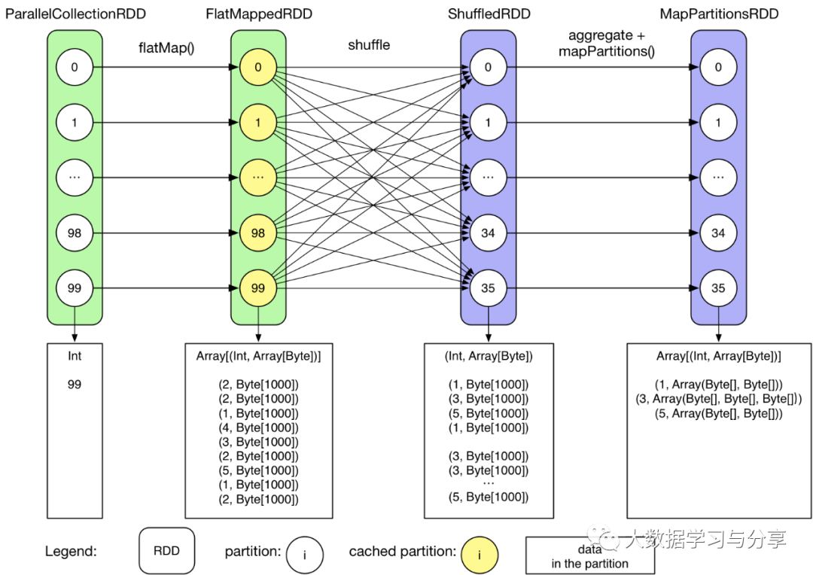
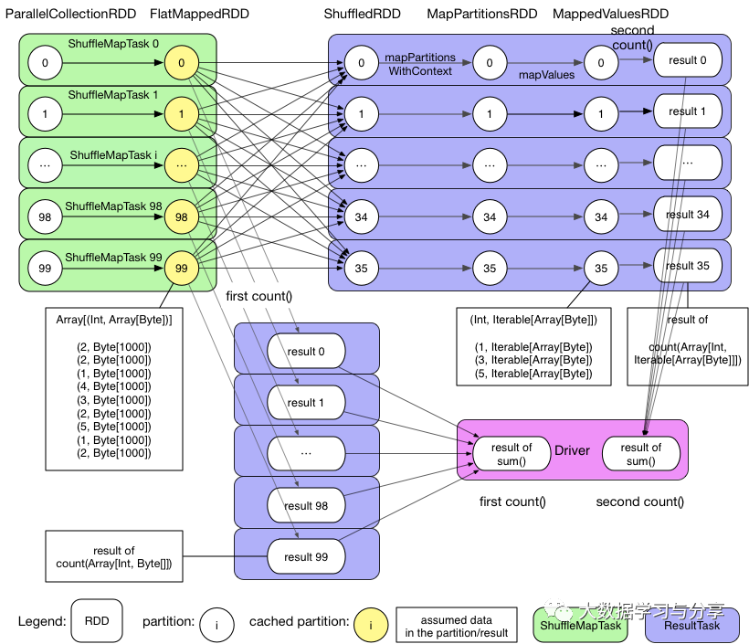
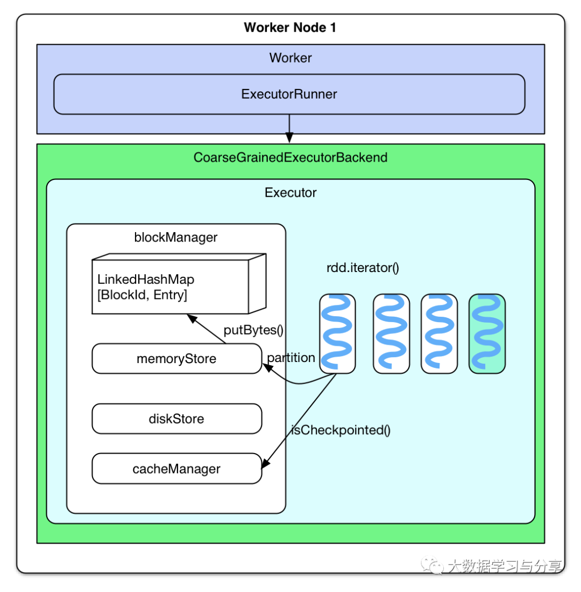
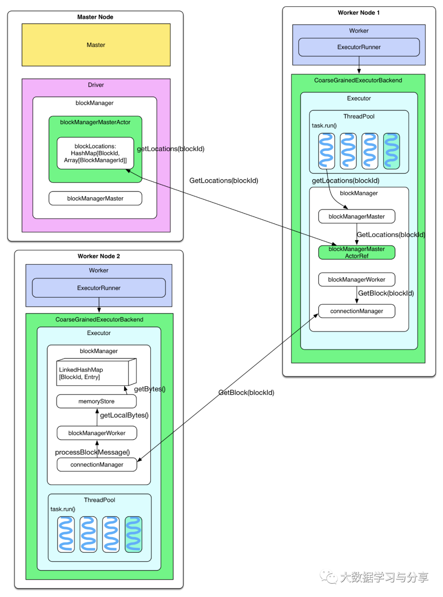

# Spark架构、cache和checkpoint区别和联系

### **cache和checkpoint**  

作为区别于Hadoop的一个重要feature，cache机制保证了需要访问重复数据的应用（如迭代型算法和交互式应用）可以运行的更快。与Hadoop MapReduce job不同的是Spark的逻辑/物理执行图可能很庞大，task中 computing chain可能会很长，计算某些RDD也可能会很耗时。这时，如果task中途运行出错，那么task的整个computing chain需要重算，代价太高。因此，有必要将计算代价较大的RDD checkpoint一下，这样，当下游RDD计算出错时，可以直接从checkpoint过的RDD那里读取数据继续算。

### **cache机制**

GroupByTest的例子：

```scala
object GroupByTest {
  def main(args: Array[String]) {
    val sparkConf = new SparkConf().setAppName("GroupBy Test")
    var numMappers = 100
    var numKVPairs = 10000
    var valSize = 1000
    var numReducers = 36

    val sc = new SparkContext(sparkConf)

    val pairs1 = sc.parallelize(0 until numMappers, numMappers).flatMap { p =>
      val ranGen = new Random
      var arr1 = new Array[(Int, Array[Byte])](numKVPairs)
      for (i <- 0 until numKVPairs) {
        val byteArr = new Array[Byte](valSize)
        ranGen.nextBytes(byteArr)
        arr1(i) = (ranGen.nextInt(Int.MaxValue), byteArr)
      }
      arr1
    }.cache
    // Enforce that everything has been calculated and in cache
    pairs1.count

    println(pairs1.groupByKey(numReducers).count)

    sc.stop()
  }
}
```

里面对FlatMappedRDD进行了cache，这样Job1在执行时就直接从FlatMappedRDD开始算了。可见cache能够让重复数据在同一个application中的jobs间共享。

### **逻辑执行图和物理执行图：**





**问题：哪些RDD需要cache？**

会被重复使用的（但不能太大）。

**问题：用户怎么设定哪些RDD要cache？**

因为用户只与driver program打交道，因此只能用rdd.cache()去cache 用户能看到的RDD。所谓能看到指的是调用transformation()后生成的RDD，而某些在transformation()中Spark自己生成的RDD是不能被用户直接cache的，比如reduceByKey()中会生成的ShuffledRDD、MapPartitionsRDD是不能被用户直接cache的。

**问题：driver program设定rdd.cache()后，系统怎么对RDD进行cache？**

先不看实现，自己来想象一下如何完成cache：当task计算得到RDD的某个partition的第一个record后，就去判断该RDD是否要被cache，如果要被cache的话，将这个record及后续计算的到的records直接丢给本地blockManager的memoryStore，如果memoryStore存不下就交给diskStore存放到磁盘。

实际实现与设想的基本类似，区别在于：将要计算rdd partition的时候（而不是已经计算得到第一个record的时候）就去判断partition要不要被cache。如果要被cache的话，先将partition计算出来，然后cache到内存。cache只使用memory，写磁盘的话那就叫checkpoint了。

调用rdd.cache()后，rdd就变成persistRDD了，其StorageLevel为MEMORY_ONLY。persistRDD会告知driver说自己是需要被persist的。



如果用代码表示：

```javascript
rdd.iterator()
=> SparkEnv.get.cacheManager.getOrCompute(thisRDD, split, context, storageLevel)
=> key = RDDBlockId(rdd.id, split.index)
=> blockManager.get(key)
=> computedValues = rdd.computeOrReadCheckpoint(split, context)
      if (isCheckpointed) firstParent[T].iterator(split, context) 
      else compute(split, context)
=> elements = new ArrayBuffer[Any]
=> elements ++= computedValues
=> updatedBlocks = blockManager.put(key, elements, tellMaster = true)

当rdd.iterator()被调用的时候，也就是要计算该rdd中某个partition的时候，会先去cacheManager那里领取一个blockId，表明是要存哪个RDD的哪个partition，这个blockId类型是RDDBlockId（memoryStore里面可能还存放有task的result等数据，因此blockId的类型是用来区分不同的数据）。然后去blockManager里面查看该partition是不是已经checkpoint了，如果是，表明以前运行过该task，那就不用计算该partition了，直接从checkpoint中读取该partition的所有records放到叫做elements的ArrayBuffer里面。如果没有被checkpoint过，先将partition计算出来，然后将其所有records放到elements里面。最后将elements交给blockManager进行cache。
blockManager将elements（也就是partition）存放到memoryStore管理的LinkedHashMap[BlockId,Entry]里面。如果partition大于memoryStore的存储极限（默认是60%的heap），那么直接返回说存不下。如果剩余空间也许能放下，会先drop掉一些早先被cached的RDD的partition，为新来的partition腾地方，如果腾出的地方够，就把新来的partition放到LinkedHashMap里面，腾不出就返回说存不下。注意drop的时候不会去drop与新来的partition同属于一个RDD的partition。drop的时候先drop最早被cache的partition。（说
好的LRU替换算法呢？）
```



获取cached partitions的存储位置：partition被cache后所在节点上的blockManager会通知driver上的blockMangerMasterActor说某rdd的partition已经被我cache了，这个信息会存储在blockMangerMasterActor的blockLocations：HashMap中。等到task执行需要cached rdd的时候，会调用blockManagerMaster的getLocations(blockId)去询问某partition的存储位置，这个询问信息会发到driver那里，driver查询blockLocations获得位置信息并将信息送回。

读取其他节点上的 cached partition：task得到cached partition的位置信息后，将getBlock(blockId)的请求通过connectionManager发送到目标节点。目标节点收到请求后从本地blockManager那里的memoryStore读取cached partition，最后发送回来。

### **Checkpoint**

**问题：哪些RDD需要checkpoint？**

运算时间很长或运算量太大才能得到的RDD，computing chain过长或依赖其他RDD很多的RDD。实际上，将ShuffleMapTask的输出结果存放到本地磁盘也算是checkpoint，只不过这个checkpoint的主要目的是去partition输出数据。

**问题：什么时候checkpoint？**

cache机制是每计算出一个要cache的partition就直接将其cache到内存了。但checkpoint没有使用这种第一次计算得到就存储的方法，而是等到job结束后另外启动专门的job去完成checkpoint。

也就是说需要checkpoint的RDD会被计算两次。因此，在使用rdd.checkpoint()的时候，建议加上rdd.cache()，这样第二次运行的job就不用再去计算该rdd了，直接读取cache写磁盘。其实Spark提供了rdd.persist(StorageLevel.DISK_ONLY)这样的方法，相当于cache到磁盘上，这样可以做到rdd第一次被计算得到时就存储到磁盘上，但这个persist和checkpoint有很多不同，之后会讨论。

**问题：checkpoint怎么实现？**

RDD需要经过[ Initialized --> marked for checkpointing --> checkpointing in progress --> checkpointed ]这几个阶段才能被checkpoint。

Initialized：首先driver program需要使用rdd.checkpoint()去设定哪些rdd需要checkpoint，设定后，该rdd就接受RDDCheckpointData管理。用户还要设定checkpoint的存储路径，一般在HDFS上。

marked for checkpointing：初始化后，RDDCheckpointData会将rdd标记为MarkedForCheckpoint。

checkpointing in progress：每个job运行结束后会调用finalRdd.doCheckpoint()，finalRdd会顺着computing chain回溯扫描，碰到要checkpoint的RDD就将其标记为CheckpointingInProgress，然后将写磁盘（比如写HDFS）需要的配置文件（如core-site.xml等）broadcast到其他worker节点上的blockManager。完成以后，启动一个job来完成checkpoint（使用rdd.context.runJob(rdd,CheckpointRDD.writeToFile(path.toString, broadcastedConf))）。

checkpointed：job完成checkpoint后，将该rdd的dependency全部清掉，并设定该rdd状态为checkpointed。然后，为该rdd强加一个依赖，设置该rdd的parent rdd为CheckpointRDD，该CheckpointRDD负责以后读取在文件系统上的checkpoint文件，生成该rdd的partition。

有意思的是我在driver program里checkpoint了两个rdd，结果只有一个（下面的result）被checkpoint成功，pairs2没有被checkpoint，也不知道是bug还是故意只checkpoint下游的RDD：

```javascript
val data1 = Array[(Int, Char)]((1, 'a'), (2, 'b'), (3, 'c'), 
    (4, 'd'), (5, 'e'), (3, 'f'), (2, 'g'), (1, 'h'))
val pairs1 = sc.parallelize(data1, 3)

val data2 = Array[(Int, Char)]((1, 'A'), (2, 'B'), (3, 'C'), (4, 'D'))
val pairs2 = sc.parallelize(data2, 2)

pairs2.checkpoint

val result = pairs1.join(pairs2)
result.checkpoint
```

**问题：怎么读取checkpoint过的RDD？**

在runJob()的时候会先调用finalRDD的partitions()来确定最后会有多个task。rdd.partitions()会去检查（通过RDDCheckpointData去检查，因为它负责管理被checkpoint过的rdd）该rdd是会否被checkpoint过了，如果该rdd已经被checkpoint过了，直接返回该rdd的partitions也就是Array[Partition]。

当调用rdd.iterator()去计算该rdd的partition的时候，会调用computeOrReadCheckpoint(split:Partition)去查看该rdd是否被checkpoint过了，如果是，就调用该rdd的parent rdd的iterator()也就是CheckpointRDD.iterator()，CheckpointRDD负责读取文件系统上的文件，生成该rdd的partition。这就解释了为什么那么trickly地为checkpointed rdd添加一个parent CheckpointRDD。

**问题：cache与checkpoint的区别？**

关于这个问题，Tathagata Das有一段回答:

```javascript
There is a significant difference between
 cache and checkpoint. Cache materializes the RDD and keeps it in memory
 and/or disk（其实只有 memory）. But the lineage（也就是 computing chain） of RDD 
(that is, seq of operations that generated the RDD) will be remembered, 
so that if there are node failures and parts of the cached RDDs are 
lost, they can be regenerated. However, checkpoint saves the RDD to an HDFS file and actually forgets the lineage completely. This
 is allows long lineages to be truncated and the data to be saved 
reliably in HDFS (which is naturally fault tolerant by replication).
```

深入一点讨论，rdd.persist(StorageLevel.DISK_ONLY)与checkpoint 也有区别。前者虽然可以将RDD的partition持久化到磁盘，但该partition由blockManager管理。一旦driver program执行结束，也就是executor所在进程CoarseGrainedExecutorBackend stop，blockManager也会stop，被cache到磁盘上的RDD也会被清空（整个blockManager使用的local文件夹被删除）。而checkpoint将RDD持久化到HDFS或本地文件夹，如果不被手动remove掉（话说怎么remove checkpoint过的 RDD？），是一直存在的，也就是说可以被下一个driver program使用，而cached RDD不能被其他dirver program使用。

 **Discussion** 

Hadoop MapReduce在执行job的时候，不停地做持久化，每个task运行结束做一次，每个job运行结束做一次（写到HDFS）。在task运行过程中也不停地在内存和磁盘间swap来swap去。可是讽刺的是，Hadoop中的task太傻，中途出错需要完全重新运行，比如shuffle了一半的数据存放到了磁盘，下次重新运行时仍然要重新shuffle。Spark好的一点在于尽量不去持久化，所以使用pipeline，cache等机制。用户如果感觉 job可能会出错可以手动去checkpoint一些critical的RDD，job如果出错，下次运行时直接从checkpoint中读取数据。唯一不足的是，checkpoint需要两次运行job。

 **Example** 

貌似还没有发现官方给出的checkpoint的例子，这里我写了一个：

```scala
package internals

import org.apache.spark.SparkContext
import org.apache.spark.SparkContext._
import org.apache.spark.SparkConf

object groupByKeyTest {

   def main(args: Array[String]) {
    val conf = new SparkConf().setAppName("GroupByKey").setMaster("local")
    val sc = new SparkContext(conf) 
    sc.setCheckpointDir("/Users/xulijie/Documents/data/checkpoint")

    val data = Array[(Int, Char)]((1, 'a'), (2, 'b'),
                                     (3, 'c'), (4, 'd'),
                                     (5, 'e'), (3, 'f'),
                                     (2, 'g'), (1, 'h')
                                    )                                
    val pairs = sc.parallelize(data, 3)

    pairs.checkpoint
    pairs.count

    val result = pairs.groupByKey(2)

    result.foreachWith(i => i)((x, i) => println("[PartitionIndex " + i + "] " + x))

    println(result.toDebugString)
   }
}
```