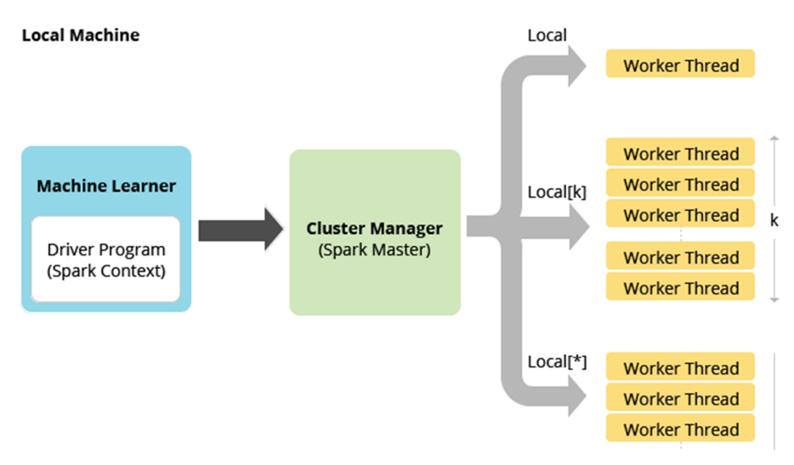
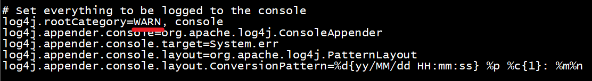
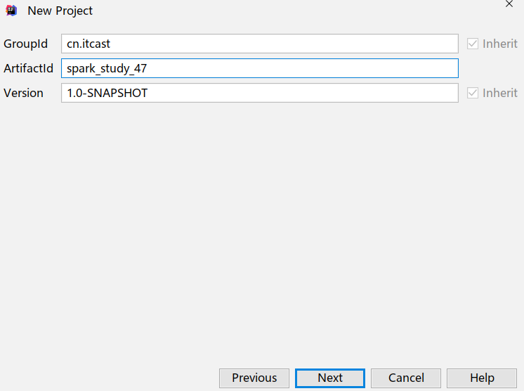
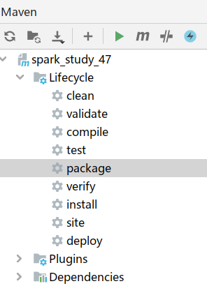

# Spark概述

## Spark发展历史

2009年诞生

2014成为Apache顶级项目

2016发布2.0

2019发布3.0

2020年9月份发布3.0.1


## 使用现状


## 官网介绍


Spark是一个大数据领域统一的数据分析/计算/处理引擎


## 流行原因


## 组成模块


# Spark环境搭建-Local-本地模式

## 准备工作

1.JDK

2.ScalaSDK只需要在Windows安装即可

3.Spark安装包

http://spark.apache.org/downloads.html

直接使用资料中的spark-3.0.1-bin-hadoop2.7.tgz

## 原理



## 操作-开箱即用

1.上传解压安装包

tar -zxvf spark-3.0.1-bin-hadoop2.7.tgz  

2.修改权限

chown -R root /export/server/spark-3.0.1-bin-hadoop2.7

chgrp -R root /export/server/spark-3.0.1-bin-hadoop2.7

3.创建软连接

ln -s /export/server/spark-3.0.1-bin-hadoop2.7 /export/server/spark

4.查看安装目录


## 测试

1.启动spark交互式窗口

/export/server/spark/bin/spark-shell


2.打开http://node1:4040


3.准备文件

vim /root/words.txt

```
hello me you her
hello me you
hello me
hello
```


4.执行WordCount

```Java
val textFile = sc.textFile("file:///root/words.txt")
val counts = textFile.flatMap(_.split(" ")).map((_,1)).reduceByKey(_ + _)
counts.collect
```


# Spark环境搭建-Standalone-独立集群

## 原理


## 操作

1.集群规划

node1:master

ndoe2:worker/slave

node3:worker/slave


2.配置slaves/workers

进入配置目录

cd /export/server/spark/conf

修改配置文件名称

mv slaves.template slaves

vim slaves

内容如下：

```
node2
node3
```


3.配置master

进入配置目录

cd /export/server/spark/conf

修改配置文件名称

mv spark-env.sh.template spark-env.sh

修改配置文件

vim spark-env.sh

增加如下内容：

```
## 设置JAVA安装目录
JAVA_HOME=/export/server/jdk

## HADOOP软件配置文件目录，读取HDFS上文件和运行Spark在YARN集群时需要,先提前配上
HADOOP_CONF_DIR=/export/server/hadoop/etc/hadoop
YARN_CONF_DIR=/export/server/hadoop/etc/hadoop

## 指定spark老大Master的IP和提交任务的通信端口
SPARK_MASTER_HOST=node1
SPARK_MASTER_PORT=7077

SPARK_MASTER_WEBUI_PORT=8080

SPARK_WORKER_CORES=1
SPARK_WORKER_MEMORY=1g
```


4.分发

将配置好的将 Spark 安装包分发给集群中其它机器，命令如下：

cd /export/server/

scp -r spark-3.0.1-bin-hadoop2.7 root@node2:$PWD

scp -r spark-3.0.1-bin-hadoop2.7 root@node3:$PWD

创建软连接

ln -s /export/server/spark-3.0.1-bin-hadoop2.7 /export/server/spark


## 测试

1.集群启动和停止

在主节点上启动spark集群

/export/server/spark/sbin/start-all.sh 

在主节点上停止spark集群

/export/server/spark/sbin/stop-all.sh

 

在主节点上单独启动和停止Master：

start-master.sh

stop-master.sh

在从节点上单独启动和停止Worker(Worker指的是slaves配置文件中的主机名)

start-slaves.sh

stop-slaves.sh


2.jps查看进程

node1:master

node2/node3:worker


3.http://node1:8080/


4.启动spark-shell

/export/server/spark/bin/spark-shell --master spark://node1:7077


5.提交WordCount任务

注意:上传文件到hdfs方便worker读取

上传文件到hdfs

hadoop fs -put /root/words.txt /wordcount/input/words.txt

目录如果不存在可以创建

hadoop fs -mkdir -p /wordcount/input

结束后可以删除测试文件夹

hadoop fs -rm -r /wordcount


```Java
val textFile = sc.textFile("hdfs://node1:8020/wordcount/input/words.txt")
val counts = textFile.flatMap(_.split(" ")).map((_,1)).reduceByKey(_ + _)
counts.collect
counts.saveAsTextFile("hdfs://node1:8020/wordcount/output47")
```


6.查看结果

http://node1:50070/explorer.html#/wordcount/output47


7.查看spark任务web-ui

http://node1:4040/jobs/


总结:

spark: 4040 任务运行web-ui界面端口

spark: 8080 spark集群web-ui界面端口

spark: 7077 spark提交任务时的通信端口


hadoop: 50070集群web-ui界面端口

hadoop:8020/9000(老版本) 文件上传下载通信端口


8.停止集群

/export/server/spark/sbin/stop-all.sh


# Spark环境搭建-Standalone-HA

## 原理


## 操作

1.启动zk

2.修改配置

vim /export/server/spark/conf/spark-env.sh

注释

```
#SPARK_MASTER_HOST=node1
```

增加

```
SPARK_DAEMON_JAVA_OPTS="-Dspark.deploy.recoveryMode=ZOOKEEPER -Dspark.deploy.zookeeper.url=node1:2181,node2:2181,node3:2181 -Dspark.deploy.zookeeper.dir=/spark-ha"
```


3.分发配置

cd /export/server/spark/conf

scp -r spark-env.sh root@node2:$PWD

scp -r spark-env.sh root@node3:$PWD


## 测试

0.启动zk服务

zkServer.sh status

zkServer.sh stop

zkServer.sh start

 

1.node1上启动Spark集群执行

/export/server/spark/sbin/start-all.sh

 

2.在node2上再单独只起个master:

/export/server/spark/sbin/start-master.sh

 

3.查看WebUI

http://node1:8080/


http://node2:8080/


4.模拟node1宕机

jps

kill -9 进程id


5.再次查看web-ui

http://node1:8080/


http://node2:8080/


6.测试WordCount

/export/server/spark/bin/spark-shell --master spark://node1:7077,node2:7077

运行

```Java
val textFile = sc.textFile("hdfs://node1:8020/wordcount/input/words.txt")
val counts = textFile.flatMap(_.split(" ")).map((_,1)).reduceByKey(_ + _)
counts.collect
counts.saveAsTextFile("hdfs://node1:8020/wordcount/output47_2")
```


# Spark环境搭建-Spark-On-Yarn

## 原理


注意: 

在实际开发中, 大数据任务都有统一的资源管理和任务调度工具来进行管理! ---Yarn使用的最多! 

因为它成熟稳定, 支持多种调度策略:FIFO/Capcity/Fair

可以使用Yarn调度管理MR/Hive/Spark/Flink


## 准备工作

### 0.关闭之前的Spark-Standalone集群

   /export/server/spark/sbin/stop-all.sh

### 1.配置Yarn历史服务器并关闭资源检查

vim /export/server/hadoop/etc/hadoop/yarn-site.xml

```xml
<configuration>
    <!-- 配置yarn主节点的位置 -->
    <property>
        <name>yarn.resourcemanager.hostname</name>
        <value>node1</value>
    </property>
    <property>
        <name>yarn.nodemanager.aux-services</name>
        <value>mapreduce_shuffle</value>
    </property>
    <!-- 设置yarn集群的内存分配方案 -->
    <property>
        <name>yarn.nodemanager.resource.memory-mb</name>
        <value>20480</value>
    </property>
    <property>
        <name>yarn.scheduler.minimum-allocation-mb</name>
        <value>2048</value>
    </property>
    <property>
        <name>yarn.nodemanager.vmem-pmem-ratio</name>
        <value>2.1</value>
    </property>
    <!-- 开启日志聚合功能 -->
    <property>
        <name>yarn.log-aggregation-enable</name>
        <value>true</value>
    </property>
    <!-- 设置聚合日志在hdfs上的保存时间 -->
    <property>
        <name>yarn.log-aggregation.retain-seconds</name>
        <value>604800</value>
    </property>
    <!-- 设置yarn历史服务器地址 -->
    <property>
        <name>yarn.log.server.url</name>
        <value>http://node1:19888/jobhistory/logs</value>
    </property>
    <!-- 关闭yarn内存检查 -->
    <property>
        <name>yarn.nodemanager.pmem-check-enabled</name>
        <value>false</value>
    </property>
    <property>
        <name>yarn.nodemanager.vmem-check-enabled</name>
        <value>false</value>
    </property>
</configuration>
```

注意:如果之前没有配置,现在配置了需要分发并重启yarn

cd /export/server/hadoop/etc/hadoop

scp -r yarn-site.xml root@node2:$PWD

scp -r yarn-site.xml root@node3:$PWD

/export/server/hadoop/sbin/stop-yarn.sh

/export/server/hadoop/sbin/start-yarn.sh


### 2.配置Spark的历史服务器和Yarn的整合

- 修改spark-defaults.conf

进入配置目录

cd /export/server/spark/conf

修改配置文件名称

mv spark-defaults.conf.template spark-defaults.conf

vim spark-defaults.conf

添加内容：

```xml
spark.eventLog.enabled                  true
spark.eventLog.dir                      hdfs://node1:8020/sparklog/
spark.eventLog.compress                 true
spark.yarn.historyServer.address        node1:18080
```

- 修改spark-env.sh

修改配置文件

vim /export/server/spark/conf/spark-env.sh

增加如下内容：

```xml
## 配置spark历史日志存储地址
SPARK_HISTORY_OPTS="-Dspark.history.fs.logDirectory=hdfs://node1:8020/sparklog/ -Dspark.history.fs.cleaner.enabled=true"
```


注意:sparklog需要手动创建

hadoop fs -mkdir -p /sparklog


- 修改日志级别

进入目录

cd /export/server/spark/conf

修改日志属性配置文件名称

mv log4j.properties.template log4j.properties

改变日志级别

vim log4j.properties

修改内容如下：




- 分发-可选,如果只在node1上提交spark任务到yarn,那么不需要分发

  cd /export/server/spark/conf

  scp -r spark-env.sh root@node2:$PWD

  scp -r spark-env.sh root@node3:$PWD

   

  scp -r spark-defaults.conf root@node2:$PWD

  scp -r spark-defaults.conf root@node3:$PWD

   

  scp -r log4j.properties root@node2:$PWD

  scp -r log4j.properties root@node3:$PWD


### 3.配置依赖的Spark 的jar包

1.在HDFS上创建存储spark相关jar包的目录

hadoop fs -mkdir -p /spark/jars/

 

2.上传$SPARK_HOME/jars所有jar包到HDFS

hadoop fs -put /export/server/spark/jars/* /spark/jars/

 

3.在node1上修改spark-defaults.conf

vim /export/server/spark/conf/spark-defaults.conf

添加内容

spark.yarn.jars  hdfs://node1:8020/spark/jars/*

分发同步-可选

cd /export/server/spark/conf

scp -r spark-defaults.conf root@node2:$PWD

scp -r spark-defaults.conf root@node3:$PWD


### 4.启动服务

\- 启动HDFS和YARN服务，在node1执行命令

start-dfs.sh

start-yarn.sh

或

start-all.sh

-启动MRHistoryServer服务，在node1执行命令

mr-jobhistory-daemon.sh start historyserver

\- 启动Spark HistoryServer服务，，在node1执行命令

/export/server/spark/sbin/start-history-server.sh


\- MRHistoryServer服务WEB UI页面：

http://node1:19888

\- Spark HistoryServer服务WEB UI页面：

http://node1:18080/


## 两种模式

### client-了解


### cluster模式-开发使用


## 操作

1.需要Yarn集群

2.历史服务器

3.提交任务的的客户端工具-spark-submit命令

4.待提交的spark任务/程序的字节码--可以使用示例程序


### client模式

```shell
SPARK_HOME=/export/server/spark
${SPARK_HOME}/bin/spark-submit \
--master yarn  \
--deploy-mode client \
--driver-memory 512m \
--driver-cores 1 \
--executor-memory 512m \
--num-executors 2 \
--executor-cores 1 \
--class org.apache.spark.examples.SparkPi \
${SPARK_HOME}/examples/jars/spark-examples_2.12-3.0.1.jar \
10
```


查看web界面

http://node1:8088/cluster


### cluster模式

```shell
SPARK_HOME=/export/server/spark
${SPARK_HOME}/bin/spark-submit \
--master yarn \
--deploy-mode cluster \
--driver-memory 512m \
--executor-memory 512m \
--num-executors 1 \
--class org.apache.spark.examples.SparkPi \
${SPARK_HOME}/examples/jars/spark-examples_2.12-3.0.1.jar \
10
```


查看web界面

http://node1:8088/cluster


## 补充:spark-shell和spark-submit

- 两个命令的区别

spark-shell:spark应用交互式窗口,启动后可以直接编写spark代码,即时运行,一般在学习测试时使用

spark-submit:用来将spark任务/程序的jar包提交到spark集群(一般都是提交到Yarn集群)


- 可以携带哪些参数
  - --master: 默认是local[*] ,或者指定 --master local[2], --master  spark://node1:7077,--master   yarn
  - 其他参数

```shell
[root@node1 bin]# ./spark-shell --help
Usage: ./bin/spark-shell [options]

Scala REPL options:
  -I <file>                   preload <file>, enforcing line-by-line interpretation

Options:
  --master MASTER_URL         spark://host:port, mesos://host:port, yarn,
                              k8s://https://host:port, or local (Default: local[*]).
  --deploy-mode DEPLOY_MODE   Whether to launch the driver program locally ("client") or
                              on one of the worker machines inside the cluster ("cluster")
                              (Default: client).
  --class CLASS_NAME          Your application's main class (for Java / Scala apps).
  --name NAME                 A name of your application.
  --jars JARS                 Comma-separated list of jars to include on the driver
                              and executor classpaths.
  --packages                  Comma-separated list of maven coordinates of jars to include
                              on the driver and executor classpaths. Will search the local
                              maven repo, then maven central and any additional remote
                              repositories given by --repositories. The format for the
                              coordinates should be groupId:artifactId:version.
  --exclude-packages          Comma-separated list of groupId:artifactId, to exclude while
                              resolving the dependencies provided in --packages to avoid
                              dependency conflicts.
  --repositories              Comma-separated list of additional remote repositories to
                              search for the maven coordinates given with --packages.
  --py-files PY_FILES         Comma-separated list of .zip, .egg, or .py files to place
                              on the PYTHONPATH for Python apps.
  --files FILES               Comma-separated list of files to be placed in the working
                              directory of each executor. File paths of these files
                              in executors can be accessed via SparkFiles.get(fileName).

  --conf, -c PROP=VALUE       Arbitrary Spark configuration property.
  --properties-file FILE      Path to a file from which to load extra properties. If not
                              specified, this will look for conf/spark-defaults.conf.

  --driver-memory MEM         Memory for driver (e.g. 1000M, 2G) (Default: 1024M).
  --driver-java-options       Extra Java options to pass to the driver.
  --driver-library-path       Extra library path entries to pass to the driver.
  --driver-class-path         Extra class path entries to pass to the driver. Note that
                              jars added with --jars are automatically included in the
                              classpath.

  --executor-memory MEM       Memory per executor (e.g. 1000M, 2G) (Default: 1G).

  --proxy-user NAME           User to impersonate when submitting the application.
                              This argument does not work with --principal / --keytab.

  --help, -h                  Show this help message and exit.
  --verbose, -v               Print additional debug output.
  --version,                  Print the version of current Spark.

 Cluster deploy mode only:
  --driver-cores NUM          Number of cores used by the driver, only in cluster mode
                              (Default: 1).

 Spark standalone or Mesos with cluster deploy mode only:
  --supervise                 If given, restarts the driver on failure.

 Spark standalone, Mesos or K8s with cluster deploy mode only:
  --kill SUBMISSION_ID        If given, kills the driver specified.
  --status SUBMISSION_ID      If given, requests the status of the driver specified.

 Spark standalone, Mesos and Kubernetes only:
  --total-executor-cores NUM  Total cores for all executors.

 Spark standalone, YARN and Kubernetes only:
  --executor-cores NUM        Number of cores used by each executor. (Default: 1 in
                              YARN and K8S modes, or all available cores on the worker
                              in standalone mode).

 Spark on YARN and Kubernetes only:
  --num-executors NUM         Number of executors to launch (Default: 2).
                              If dynamic allocation is enabled, the initial number of
                              executors will be at least NUM.
  --principal PRINCIPAL       Principal to be used to login to KDC.
  --keytab KEYTAB             The full path to the file that contains the keytab for the
                              principal specified above.

 Spark on YARN only:
  --queue QUEUE_NAME          The YARN queue to submit to (Default: "default").
  --archives ARCHIVES         Comma separated list of archives to be extracted into the
                              working directory of each executor.
```


```shell
[root@node1 bin]# ./spark-submit --help
Usage: spark-submit [options] <app jar | python file | R file> [app arguments]
Usage: spark-submit --kill [submission ID] --master [spark://...]
Usage: spark-submit --status [submission ID] --master [spark://...]
Usage: spark-submit run-example [options] example-class [example args]

Options:
  --master MASTER_URL         spark://host:port, mesos://host:port, yarn,
                              k8s://https://host:port, or local (Default: local[*]).
  --deploy-mode DEPLOY_MODE   Whether to launch the driver program locally ("client") or
                              on one of the worker machines inside the cluster ("cluster")
                              (Default: client).
  --class CLASS_NAME          Your application's main class (for Java / Scala apps).
  --name NAME                 A name of your application.
  --jars JARS                 Comma-separated list of jars to include on the driver
                              and executor classpaths.
  --packages                  Comma-separated list of maven coordinates of jars to include
                              on the driver and executor classpaths. Will search the local
                              maven repo, then maven central and any additional remote
                              repositories given by --repositories. The format for the
                              coordinates should be groupId:artifactId:version.
  --exclude-packages          Comma-separated list of groupId:artifactId, to exclude while
                              resolving the dependencies provided in --packages to avoid
                              dependency conflicts.
  --repositories              Comma-separated list of additional remote repositories to
                              search for the maven coordinates given with --packages.
  --py-files PY_FILES         Comma-separated list of .zip, .egg, or .py files to place
                              on the PYTHONPATH for Python apps.
  --files FILES               Comma-separated list of files to be placed in the working
                              directory of each executor. File paths of these files
                              in executors can be accessed via SparkFiles.get(fileName).

  --conf, -c PROP=VALUE       Arbitrary Spark configuration property.
  --properties-file FILE      Path to a file from which to load extra properties. If not
                              specified, this will look for conf/spark-defaults.conf.

  --driver-memory MEM         Memory for driver (e.g. 1000M, 2G) (Default: 1024M).
  --driver-java-options       Extra Java options to pass to the driver.
  --driver-library-path       Extra library path entries to pass to the driver.
  --driver-class-path         Extra class path entries to pass to the driver. Note that
                              jars added with --jars are automatically included in the
                              classpath.

  --executor-memory MEM       Memory per executor (e.g. 1000M, 2G) (Default: 1G).

  --proxy-user NAME           User to impersonate when submitting the application.
                              This argument does not work with --principal / --keytab.

  --help, -h                  Show this help message and exit.
  --verbose, -v               Print additional debug output.
  --version,                  Print the version of current Spark.

 Cluster deploy mode only:
  --driver-cores NUM          Number of cores used by the driver, only in cluster mode
                              (Default: 1).

 Spark standalone or Mesos with cluster deploy mode only:
  --supervise                 If given, restarts the driver on failure.

 Spark standalone, Mesos or K8s with cluster deploy mode only:
  --kill SUBMISSION_ID        If given, kills the driver specified.
  --status SUBMISSION_ID      If given, requests the status of the driver specified.

 Spark standalone, Mesos and Kubernetes only:
  --total-executor-cores NUM  Total cores for all executors.

 Spark standalone, YARN and Kubernetes only:
  --executor-cores NUM        Number of cores used by each executor. (Default: 1 in
                              YARN and K8S modes, or all available cores on the worker
                              in standalone mode).

 Spark on YARN and Kubernetes only:
  --num-executors NUM         Number of executors to launch (Default: 2).
                              If dynamic allocation is enabled, the initial number of
                              executors will be at least NUM.
  --principal PRINCIPAL       Principal to be used to login to KDC.
  --keytab KEYTAB             The full path to the file that contains the keytab for the
                              principal specified above.

 Spark on YARN only:
  --queue QUEUE_NAME          The YARN queue to submit to (Default: "default").
  --archives ARCHIVES         Comma separated list of archives to be extracted into the
                              working directory of each executor.
```


# Spark程序开发-重点

## 准备工作

1.创建工程




2.pom依赖

```xml
<?xml version="1.0" encoding="UTF-8"?>
<project xmlns="http://maven.apache.org/POM/4.0.0"
         xmlns:xsi="http://www.w3.org/2001/XMLSchema-instance"
         xsi:schemaLocation="http://maven.apache.org/POM/4.0.0 http://maven.apache.org/xsd/maven-4.0.0.xsd">
    <modelVersion>4.0.0</modelVersion>

    <groupId>cn.itcast</groupId>
    <artifactId>spark_study_47</artifactId>
    <version>1.0-SNAPSHOT</version>

    <repositories>
        <repository>
            <id>aliyun</id>
            <url>http://maven.aliyun.com/nexus/content/groups/public/</url>
        </repository>
        <repository>
            <id>apache</id>
            <url>https://repository.apache.org/content/repositories/snapshots/</url>
        </repository>
        <repository>
            <id>cloudera</id>
            <url>https://repository.cloudera.com/artifactory/cloudera-repos/</url>
        </repository>
    </repositories>
    <properties>
        <encoding>UTF-8</encoding>
        <maven.compiler.source>1.8</maven.compiler.source>
        <maven.compiler.target>1.8</maven.compiler.target>
        <scala.version>2.12.11</scala.version>
        <spark.version>3.0.1</spark.version>
        <hadoop.version>2.7.5</hadoop.version>
    </properties>
    <dependencies>
        <!--依赖Scala语言-->
        <dependency>
            <groupId>org.scala-lang</groupId>
            <artifactId>scala-library</artifactId>
            <version>${scala.version}</version>
        </dependency>

        <!--SparkCore依赖-->
        <dependency>
            <groupId>org.apache.spark</groupId>
            <artifactId>spark-core_2.12</artifactId>
            <version>${spark.version}</version>
        </dependency>

        <!-- spark-streaming-->
        <dependency>
            <groupId>org.apache.spark</groupId>
            <artifactId>spark-streaming_2.12</artifactId>
            <version>${spark.version}</version>
        </dependency>

        <!--spark-streaming+Kafka依赖-->
        <dependency>
            <groupId>org.apache.spark</groupId>
            <artifactId>spark-streaming-kafka-0-10_2.12</artifactId>
            <version>${spark.version}</version>
        </dependency>

        <!--SparkSQL依赖-->
        <dependency>
            <groupId>org.apache.spark</groupId>
            <artifactId>spark-sql_2.12</artifactId>
            <version>${spark.version}</version>
        </dependency>

        <!--SparkSQL+ Hive依赖-->
        <dependency>
            <groupId>org.apache.spark</groupId>
            <artifactId>spark-hive_2.12</artifactId>
            <version>${spark.version}</version>
        </dependency>
        <dependency>
            <groupId>org.apache.spark</groupId>
            <artifactId>spark-hive-thriftserver_2.12</artifactId>
            <version>${spark.version}</version>
        </dependency>

        <!--StructuredStreaming+Kafka依赖-->
        <dependency>
            <groupId>org.apache.spark</groupId>
            <artifactId>spark-sql-kafka-0-10_2.12</artifactId>
            <version>${spark.version}</version>
        </dependency>

        <!-- SparkMlLib机器学习模块,里面有ALS推荐算法-->
        <dependency>
            <groupId>org.apache.spark</groupId>
            <artifactId>spark-mllib_2.12</artifactId>
            <version>${spark.version}</version>
        </dependency>

        <dependency>
            <groupId>org.apache.hadoop</groupId>
            <artifactId>hadoop-client</artifactId>
            <version>2.7.5</version>
        </dependency>

        <dependency>
            <groupId>com.hankcs</groupId>
            <artifactId>hanlp</artifactId>
            <version>portable-1.7.7</version>
        </dependency>

        <dependency>
            <groupId>mysql</groupId>
            <artifactId>mysql-connector-java</artifactId>
            <version>5.1.38</version>
        </dependency>

        <dependency>
            <groupId>redis.clients</groupId>
            <artifactId>jedis</artifactId>
            <version>2.9.0</version>
        </dependency>

        <dependency>
            <groupId>com.alibaba</groupId>
            <artifactId>fastjson</artifactId>
            <version>1.2.47</version>
        </dependency>

        <dependency>
            <groupId>org.projectlombok</groupId>
            <artifactId>lombok</artifactId>
            <version>1.18.2</version>
            <scope>provided</scope>
        </dependency>
    </dependencies>

    <build>
        <sourceDirectory>src/main/scala</sourceDirectory>
        <plugins>
            <!-- 指定编译java的插件 -->
            <plugin>
                <groupId>org.apache.maven.plugins</groupId>
                <artifactId>maven-compiler-plugin</artifactId>
                <version>3.5.1</version>
            </plugin>
            <!-- 指定编译scala的插件 -->
            <plugin>
                <groupId>net.alchim31.maven</groupId>
                <artifactId>scala-maven-plugin</artifactId>
                <version>3.2.2</version>
                <executions>
                    <execution>
                        <goals>
                            <goal>compile</goal>
                            <goal>testCompile</goal>
                        </goals>
                        <configuration>
                            <args>
                                <arg>-dependencyfile</arg>
                                <arg>${project.build.directory}/.scala_dependencies</arg>
                            </args>
                        </configuration>
                    </execution>
                </executions>
            </plugin>
            <plugin>
                <groupId>org.apache.maven.plugins</groupId>
                <artifactId>maven-surefire-plugin</artifactId>
                <version>2.18.1</version>
                <configuration>
                    <useFile>false</useFile>
                    <disableXmlReport>true</disableXmlReport>
                    <includes>
                        <include>**/*Test.*</include>
                        <include>**/*Suite.*</include>
                    </includes>
                </configuration>
            </plugin>
            <plugin>
                <groupId>org.apache.maven.plugins</groupId>
                <artifactId>maven-shade-plugin</artifactId>
                <version>2.3</version>
                <executions>
                    <execution>
                        <phase>package</phase>
                        <goals>
                            <goal>shade</goal>
                        </goals>
                        <configuration>
                            <filters>
                                <filter>
                                    <artifact>*:*</artifact>
                                    <excludes>
                                        <exclude>META-INF/*.SF</exclude>
                                        <exclude>META-INF/*.DSA</exclude>
                                        <exclude>META-INF/*.RSA</exclude>
                                    </excludes>
                                </filter>
                            </filters>
                            <transformers>
                                <transformer
                                        implementation="org.apache.maven.plugins.shade.resource.ManifestResourceTransformer">
                                    <mainClass></mainClass>
                                </transformer>
                            </transformers>
                        </configuration>
                    </execution>
                </executions>
            </plugin>
        </plugins>
    </build>
</project>
```

3.准备源码目录


## 代码实现-WordCount

```java
package cn.itcast.hello

import org.apache.spark.rdd.RDD
import org.apache.spark.{SparkConf, SparkContext}

/**
 * Author itcast
 * Desc 演示Spark入门案例-WordCount
 */
object WordCount {
  def main(args: Array[String]): Unit = {
    //TODO 1.env/准备sc/SparkContext/Spark上下文执行环境
    val conf: SparkConf = new SparkConf().setAppName("wc").setMaster("local[*]")
    val sc: SparkContext = new SparkContext(conf)
    sc.setLogLevel("WARN")

    //TODO 2.source/读取数据
    //RDD:A Resilient Distributed Dataset (RDD):弹性分布式数据集,简单理解为分布式集合!使用起来和普通集合一样简单!
    //RDD[就是一行行的数据]
    val lines: RDD[String] = sc.textFile("data/input/words.txt")

    //TODO 3.transformation/数据操作/转换
    //切割:RDD[一个个的单词]
    val words: RDD[String] = lines.flatMap(_.split(" "))
    //记为1:RDD[(单词, 1)]
    val wordAndOnes: RDD[(String, Int)] = words.map((_,1))
    //分组聚合:groupBy + mapValues(_.map(_._2).reduce(_+_)) ===>在Spark里面分组+聚合一步搞定:reduceByKey
    val result: RDD[(String, Int)] = wordAndOnes.reduceByKey(_+_)

    //TODO 4.sink/输出
    //直接输出
    result.foreach(println)
    //收集为本地集合再输出
    println(result.collect().toBuffer)
    //输出到指定path(可以是文件/夹)
    result.repartition(1).saveAsTextFile("data/output/result")
    result.repartition(2).saveAsTextFile("data/output/result2")

    //为了便于查看Web-UI可以让程序睡一会
    Thread.sleep(1000 * 60)

    //TODO 5.关闭资源
    sc.stop()
  }
}

```


## 代码实现-On-Yarn

```Java
package cn.itcast.hello

import org.apache.spark.rdd.RDD
import org.apache.spark.{SparkConf, SparkContext}

/**
 * Author itcast
 * Desc 演示Spark入门案例-WordCount-修改代码使适合在Yarn集群上运行
 */
object WordCount {
  def main(args: Array[String]): Unit = {
    if(args.length < 2){
      println("请指定input和output")
      System.exit(1)//非0表示非正常退出程序
    }
    //TODO 1.env/准备sc/SparkContext/Spark上下文执行环境
    val conf: SparkConf = new SparkConf().setAppName("wc")//.setMaster("local[*]")
    val sc: SparkContext = new SparkContext(conf)
    sc.setLogLevel("WARN")

    //TODO 2.source/读取数据
    //RDD:A Resilient Distributed Dataset (RDD):弹性分布式数据集,简单理解为分布式集合!使用起来和普通集合一样简单!
    //RDD[就是一行行的数据]
    val lines: RDD[String] = sc.textFile(args(0))//注意提交任务时需要指定input参数

    //TODO 3.transformation/数据操作/转换
    //切割:RDD[一个个的单词]
    val words: RDD[String] = lines.flatMap(_.split(" "))
    //记为1:RDD[(单词, 1)]
    val wordAndOnes: RDD[(String, Int)] = words.map((_,1))
    //分组聚合:groupBy + mapValues(_.map(_._2).reduce(_+_)) ===>在Spark里面分组+聚合一步搞定:reduceByKey
    val result: RDD[(String, Int)] = wordAndOnes.reduceByKey(_+_)

    //TODO 4.sink/输出
    //直接输出
    //result.foreach(println)
    //收集为本地集合再输出
    //println(result.collect().toBuffer)
    //输出到指定path(可以是文件/夹)
    //如果涉及到HDFS权限问题不能写入,需要执行:
    //hadoop fs -chmod -R 777  /
    //并添加如下代码
    System.setProperty("HADOOP_USER_NAME", "root")
    result.repartition(1).saveAsTextFile(args(1))//注意提交任务时需要指定output参数

    //为了便于查看Web-UI可以让程序睡一会
    //Thread.sleep(1000 * 60)

    //TODO 5.关闭资源
    sc.stop()
  }
}

```


1.打包



2.修改别名


3.上传到linux


4.提交任务

```shell
SPARK_HOME=/export/server/spark
${SPARK_HOME}/bin/spark-submit \
--master yarn \
--deploy-mode cluster \
--driver-memory 512m \
--executor-memory 512m \
--num-executors 1 \
--class cn.itcast.hello.WordCount \
/root/wc.jar \
hdfs://node1:8020/wordcount/input/words.txt \
hdfs://node1:8020/wordcount/output47_3
```


5.查看任务

http://node1:8088/cluster


6.查看结果

http://node1:50070/explorer.html#/wordcount/output47_3


## WordCount图解


# 扩展:面试题 蒙特卡罗算法求PI

## 思路


## 代码实现

```Java
package cn.itcast.temp;

import java.util.Random;

/**
 * Author itcast
 * Desc 使用蒙特卡罗算法求PI
 */
public class Interview_4 {
    public static void main(String[] args) {
        Random random = new Random();
        int sum = 1000000000;//总共撒的点的数量
        int count = 0;//落在扇形区域的点的数量
        double  x = 0;
        double  y = 0;
        for (int i = 0; i < sum ;i++){
            x = random.nextDouble();//随机产生一个[0.0~1.0)之间的随机数
            y = random.nextDouble();//随机产生一个[0.0~1.0)之间的随机数
            if(x*x + y*y < 1){ //落在扇形区域
                count++;
            }
        }
        double  Pi = 4.0 * count / sum;
        System.out.println("计算出的Pi的值为:"+Pi);
    }
}

```


