# Spark内核原理

## 依赖关系

### 宽窄依赖

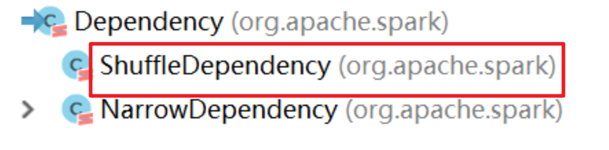


- 宽依赖:有shuffle
- 子RDD的一个分区会依赖于父RDD的多个分区--错误
- 父RDD的一个分区会被子RDD的多个分区所依赖--正确


- 窄依赖:没有shuffle
- 子RDD的一个分区只会依赖于父RDD的1个分区--错误
- 父RDD的一个分区只会被子RDD的1个分区所依赖--正确


### 为什么需要宽窄依赖

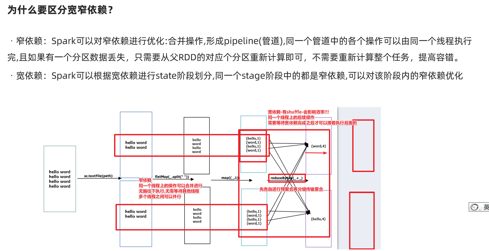

总结:

窄依赖: 并行化+容错

宽依赖: 进行阶段划分(shuffle后的阶段需要等待shuffle前的阶段计算完才能执行)


## DAG和Stage

### DAG

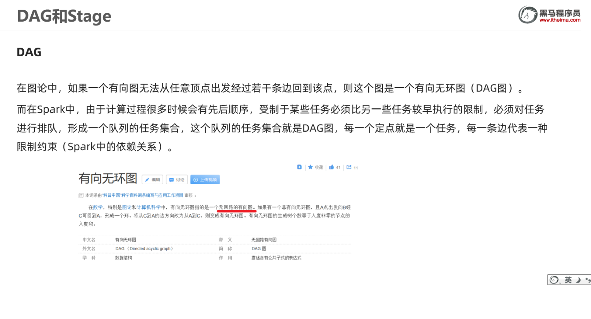

Spark的DAG:就是spark任务/程序执行的流程图!

DAG的开始:从创建RDD开始

DAG的结束:到Action结束

一个Spark程序中有几个Action操作就有几个DAG!


### Stage

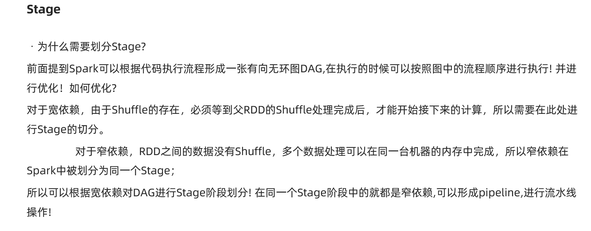

Stage:是DAG中根据shuffle划分出来的阶段!

前面的阶段执行完才可以执行后面的阶段!

同一个阶段中的各个任务可以并行执行无需等待!

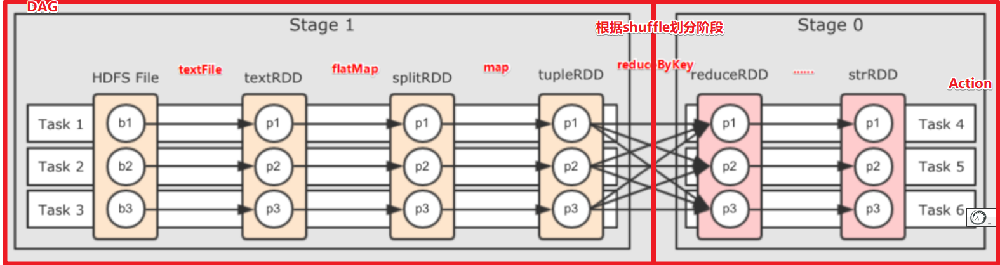


## 基本名词

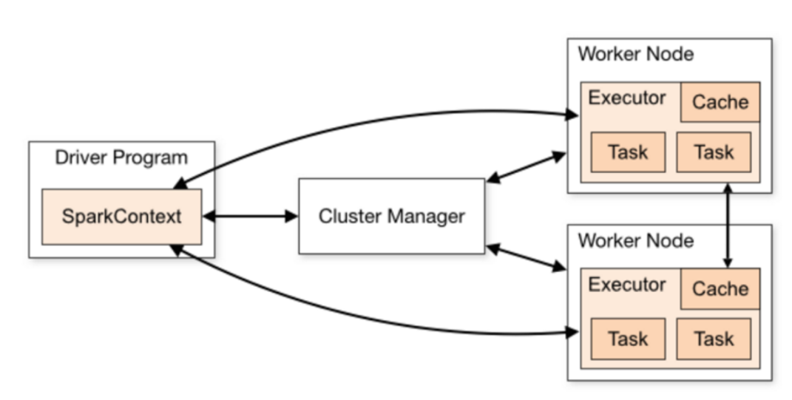

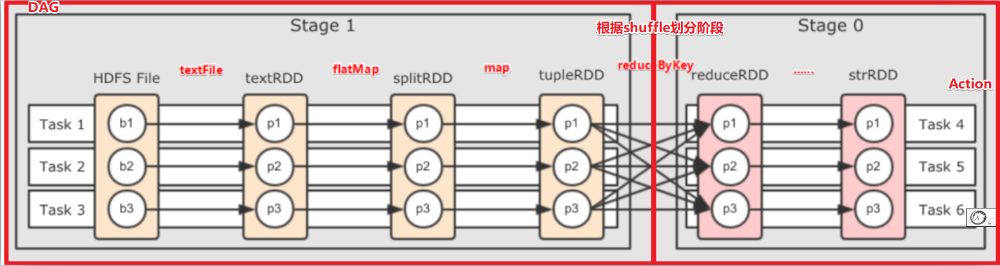

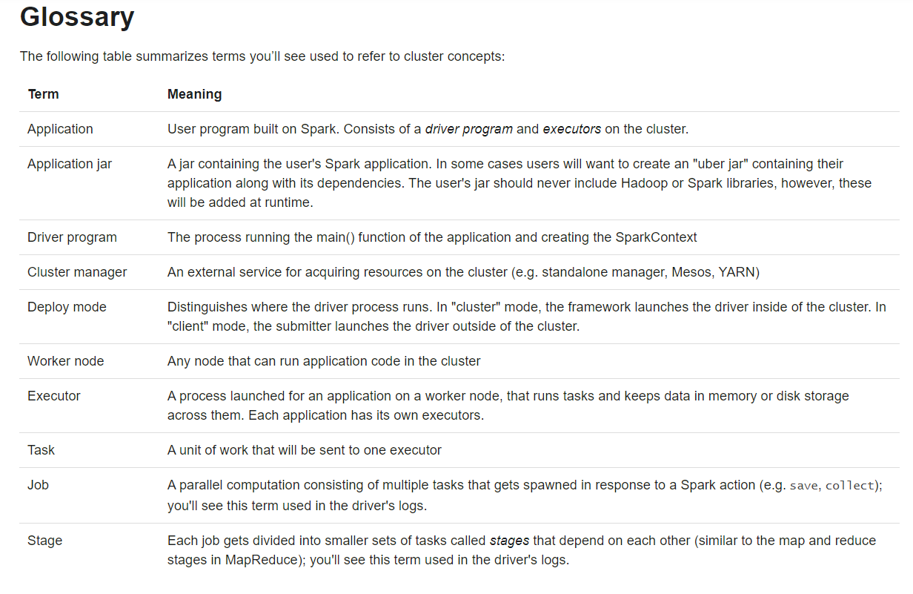

```xml
1.Application：应用,就是程序员编写的Spark代码,如WordCount代码

2.Driver：驱动程序,就是用来执行main方法的JVM进程,里面会执行一些Drive端的代码,如创建SparkContext,设置应用名,设置日志级别...

3.SparkContext:Spark运行时的上下文环境,用来和ClusterManager进行通信的,并进行资源的申请、任务的分配和监控等

4.ClusterManager：集群管理器,对于Standalone模式,就是Master,对于Yarn模式就是ResourceManager/ApplicationMaster,在集群上做统一的资源管理的进程

5.Worker:工作节点,是拥有CPU/内存等资源的机器,是真正干活的节点

6.Executor：运行在Worker中的JVM进程!

7.RDD：弹性分布式数据集

8.DAG：有向无环图,就是根据Action形成的RDD的执行流程图---静态的图

9.Job：作业,按照DAG进行执行就形成了Job---按照图动态的执行

10.Stage：DAG中,根据shuffle依赖划分出来的一个个的执行阶段!

11.Task：一个分区上的一系列操作(pipline上的一系列流水线操作)就是一个Task,同一个Stage中的多个Task可以并行执行!(一个Task由一个线程执行),所以也可以这样说:Task(线程)是运行在Executor(进程)中的最小单位!

12.TaskSet:任务集,就是同一个Stage中的各个Task组成的集合!
```


## Job提交执行流程

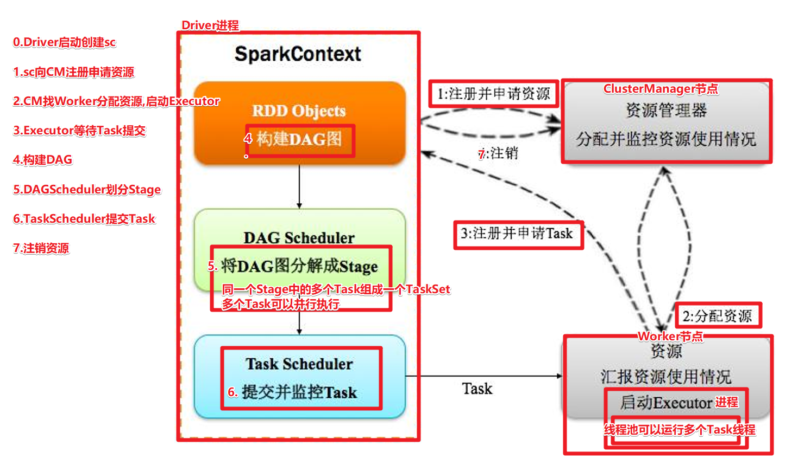


# 搜狗搜索日志分析

## 数据

l 数据网址：http://www.sogou.com/labs/resource/q.php

搜狗实验室提供【用户查询日志(SogouQ)】数据分为三个数据集，大小不一样

迷你版(样例数据, 376KB)：http://download.labs.sogou.com/dl/sogoulabdown/SogouQ/SogouQ.mini.zip

精简版(1天数据，63MB)：http://download.labs.sogou.com/dl/sogoulabdown/SogouQ/SogouQ.reduced.zip

完整版(1.9GB)：http://www.sogou.com/labs/resource/ftp.php?dir=/Data/SogouQ/SogouQ.zip


## 需求

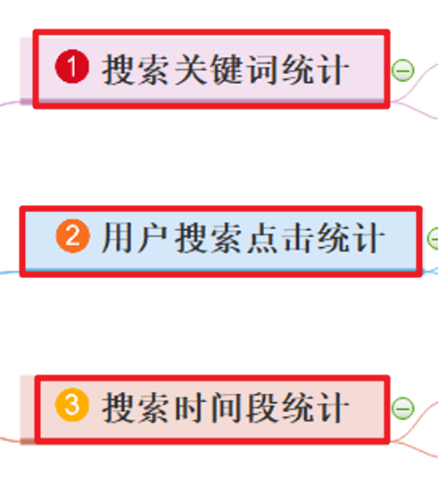

## 分词工具测试

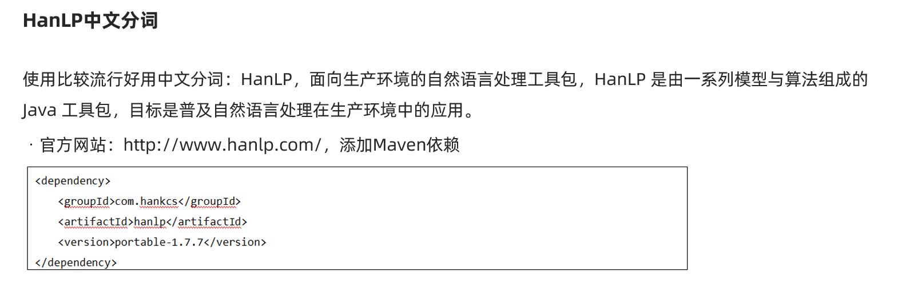


l 官方网站：http://www.hanlp.com/，添加Maven依赖

```
<dependency>
<groupId>com.hankcs</groupId>
<artifactId>hanlp</artifactId>
<version>portable-1.7.7</version>
</dependency>
```


```Java
package cn.itcast.core

import java.util

import com.hankcs.hanlp.HanLP
import com.hankcs.hanlp.seg.common.Term


/**
 * Author itcast
 * Desc HanLP入门案例
 */
object HanLPTest {
  def main(args: Array[String]): Unit = {
    val words = "[HanLP入门案例]"
    val terms: util.List[Term] = HanLP.segment(words)
    println(terms) //直接打印java的list:[[/w, HanLP/nx, 入门/vn, 案例/n, ]/w]
    import scala.collection.JavaConverters._
    println(terms.asScala.map(_.word)) //转为scala的list:ArrayBuffer([, HanLP, 入门, 案例, ])

    val cleanWords1: String = words.replaceAll("\\[|\\]", "") //将"["或"]"替换为空"" //"HanLP入门案例"
    println(cleanWords1) //HanLP入门案例
    println(HanLP.segment(cleanWords1).asScala.map(_.word)) //ArrayBuffer(HanLP, 入门, 案例)

    val log = """00:00:00 2982199073774412    [360安全卫士]   8 3 download.it.com.cn/softweb/software/firewall/antivirus/20067/17938.html"""
    val cleanWords2 = log.split("\\s+")(2) //[360安全卫士] 
      .replaceAll("\\[|\\]", "") //360安全卫士
    println(HanLP.segment(cleanWords2).asScala.map(_.word)) //ArrayBuffer(360, 安全卫士)
  }
}
```


## 代码实现

```Java
package cn.itcast.core

import com.hankcs.hanlp.HanLP
import org.apache.spark.rdd.RDD
import org.apache.spark.{SparkConf, SparkContext}
import shapeless.record
import spire.std.tuples

import scala.collection.immutable.StringOps
import scala.collection.mutable

/**
 * Author itcast
 * Desc 需求:对SougouSearchLog进行分词并统计如下指标:
 * 1.热门搜索词
 * 2.用户热门搜索词(带上用户id)
 * 3.各个时间段搜索热度
 */
object SougouSearchLogAnalysis {
  def main(args: Array[String]): Unit = {
    //TODO 0.准备环境
    val conf: SparkConf = new SparkConf().setAppName("spark").setMaster("local[*]")
    val sc: SparkContext = new SparkContext(conf)
    sc.setLogLevel("WARN")
    //TODO 1.加载数据
    val lines: RDD[String] = sc.textFile("data/input/SogouQ.sample")

    //TODO 2.处理数据
    //封装数据
    val SogouRecordRDD: RDD[SogouRecord] = lines.map(line => {//map是一个进去一个出去
      val arr: Array[String] = line.split("\\s+")
      SogouRecord(
        arr(0),
        arr(1),
        arr(2),
        arr(3).toInt,
        arr(4).toInt,
        arr(5)
      )
    })

    //切割数据
   /* val wordsRDD0: RDD[mutable.Buffer[String]] = SogouRecordRDD.map(record => {
      val wordsStr: String = record.queryWords.replaceAll("\\[|\\]", "") //360安全卫士
      import scala.collection.JavaConverters._ //将Java集合转为scala集合
      HanLP.segment(wordsStr).asScala.map(_.word) //ArrayBuffer(360, 安全卫士)
    })*/

    val wordsRDD: RDD[String] = SogouRecordRDD.flatMap(record => { //flatMap是一个进去,多个出去(出去之后会被压扁) //360安全卫士==>[360, 安全卫士]
      val wordsStr: String = record.queryWords.replaceAll("\\[|\\]", "") //360安全卫士
      import scala.collection.JavaConverters._ //将Java集合转为scala集合
      HanLP.segment(wordsStr).asScala.map(_.word) //ArrayBuffer(360, 安全卫士)
    })

    //TODO 3.统计指标
    //--1.热门搜索词
    val result1: Array[(String, Int)] = wordsRDD
      .filter(word => !word.equals(".") && !word.equals("+"))
      .map((_, 1))
      .reduceByKey(_ + _)
      .sortBy(_._2, false)
      .take(10)

    //--2.用户热门搜索词(带上用户id)
    val userIdAndWordRDD: RDD[(String, String)] = SogouRecordRDD.flatMap(record => { //flatMap是一个进去,多个出去(出去之后会被压扁) //360安全卫士==>[360, 安全卫士]
      val wordsStr: String = record.queryWords.replaceAll("\\[|\\]", "") //360安全卫士
      import scala.collection.JavaConverters._ //将Java集合转为scala集合
      val words: mutable.Buffer[String] = HanLP.segment(wordsStr).asScala.map(_.word) //ArrayBuffer(360, 安全卫士)
      val userId: String = record.userId
      words.map(word => (userId, word))
    })
    val result2: Array[((String, String), Int)] = userIdAndWordRDD
      .filter(t => !t._2.equals(".") && !t._2.equals("+"))
      .map((_, 1))
      .reduceByKey(_ + _)
      .sortBy(_._2, false)
      .take(10)

    //--3.各个时间段搜索热度
    val result3: Array[(String, Int)] = SogouRecordRDD.map(record => {
      val timeStr: String = record.queryTime
      val hourAndMitunesStr: String = timeStr.substring(0, 5)
      (hourAndMitunesStr, 1)
    }).reduceByKey(_ + _)
      .sortBy(_._2, false)
      .take(10)

    //TODO 4.输出结果
    result1.foreach(println)
    result2.foreach(println)
    result3.foreach(println)

    //TODO 5.释放资源
    sc.stop()
  }
  //准备一个样例类用来封装数据
  /**
   * 用户搜索点击网页记录Record
   * @param queryTime  访问时间，格式为：HH:mm:ss
   * @param userId     用户ID
   * @param queryWords 查询词
   * @param resultRank 该URL在返回结果中的排名
   * @param clickRank  用户点击的顺序号
   * @param clickUrl   用户点击的URL
   */
  case class SogouRecord(
                          queryTime: String,
                          userId: String,
                          queryWords: String,
                          resultRank: Int,
                          clickRank: Int,
                          clickUrl: String
                        )
}

```


# SparkStreaming引入

## 流式计算应用场景

1.实时大屏

2.实时监控

3.实时风控

4.实时流式数据统计分析

.....


## 流式计算处理模式

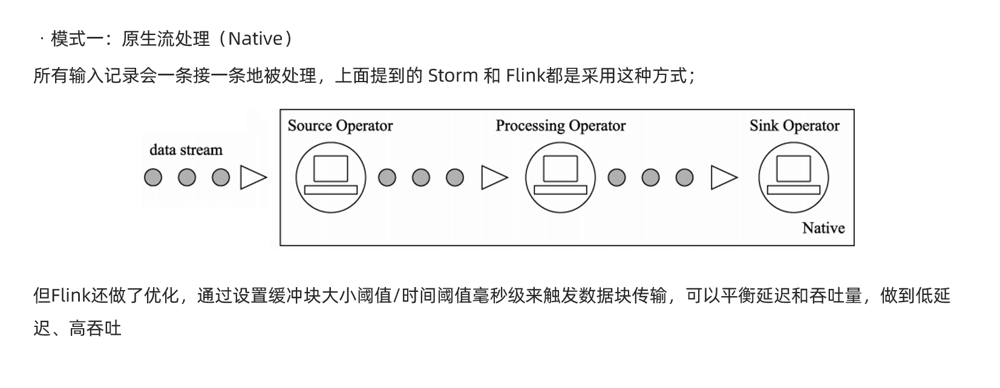

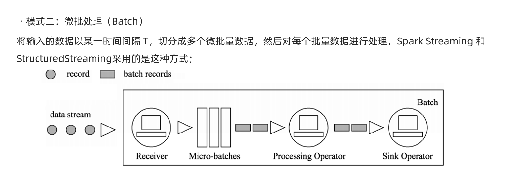

https://haokan.baidu.com/v?vid=3184290770425607225&pd=bjh&fr=bjhauthor&type=video


## SparkStreaming介绍

- 官方定义

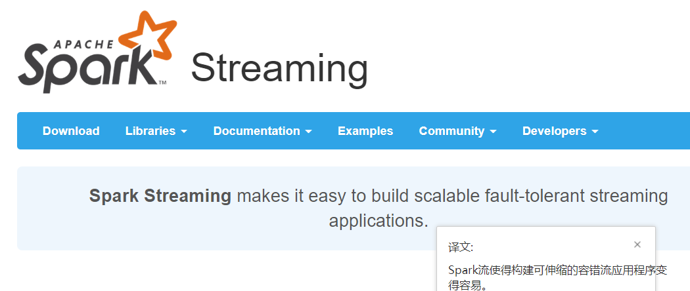

- SparkStreaming在Spark框架中的位置

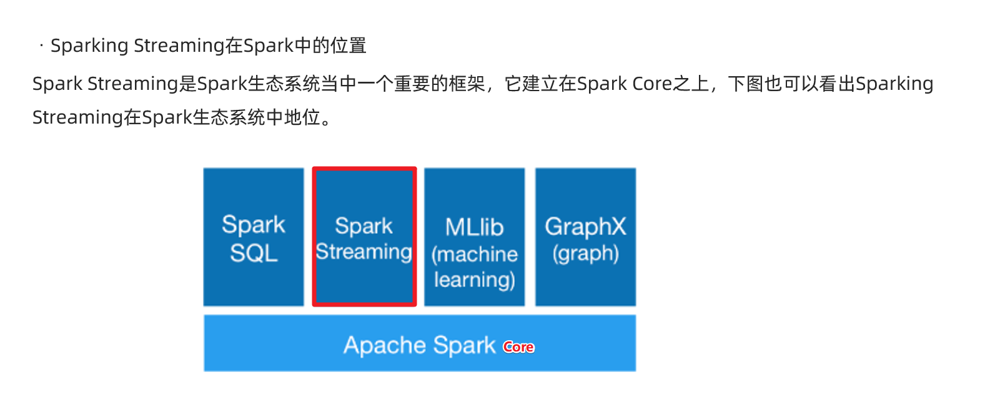

- 特点


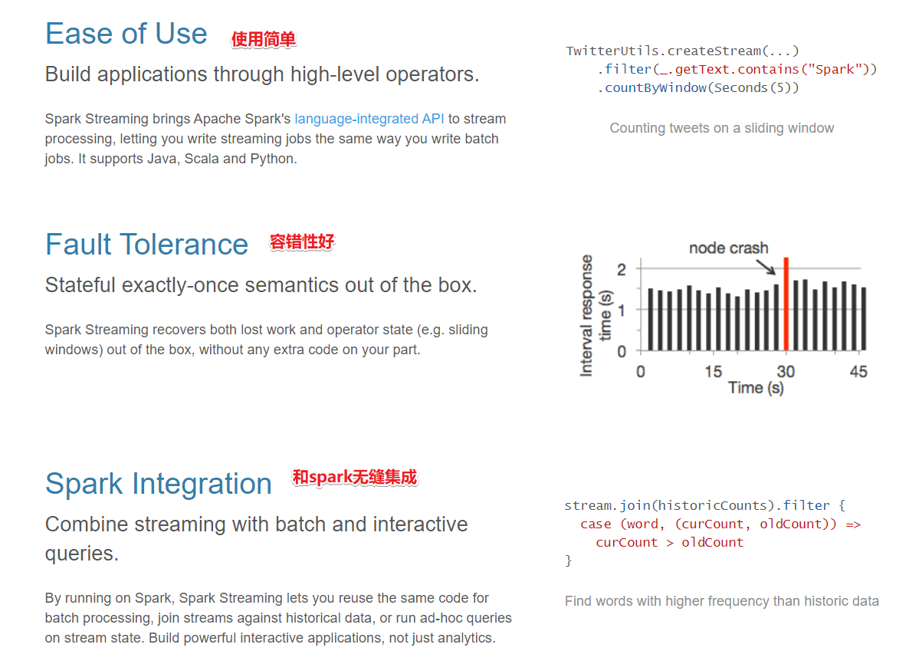

- 数据处理流程

  Kafka--->SparkStreaming-->各种存储组件

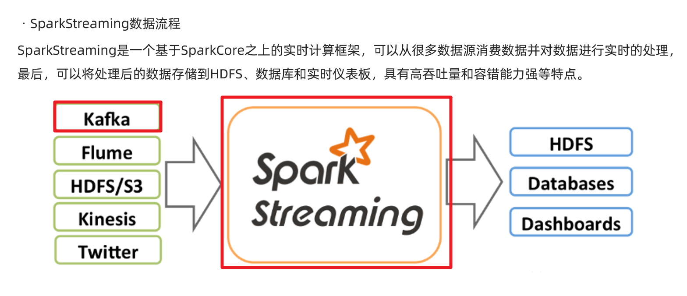

- 核心计算思想

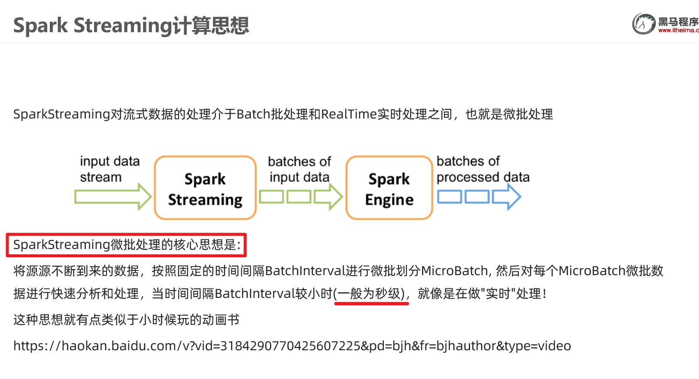


# SparkStreaming数据抽象

## DStream的本质

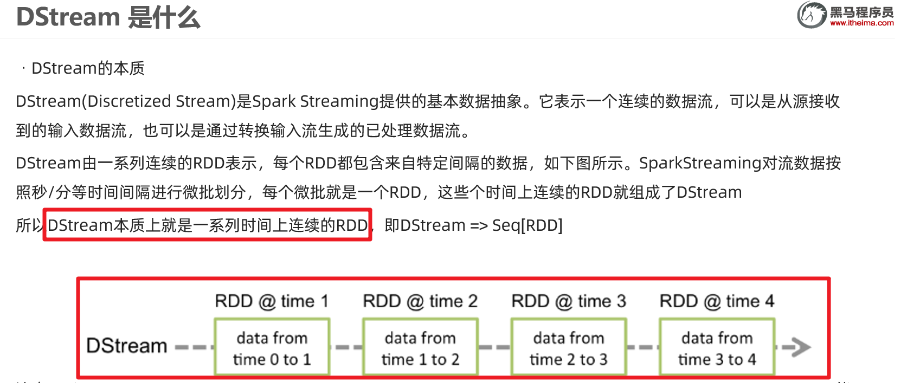


## 对DStream进行操作

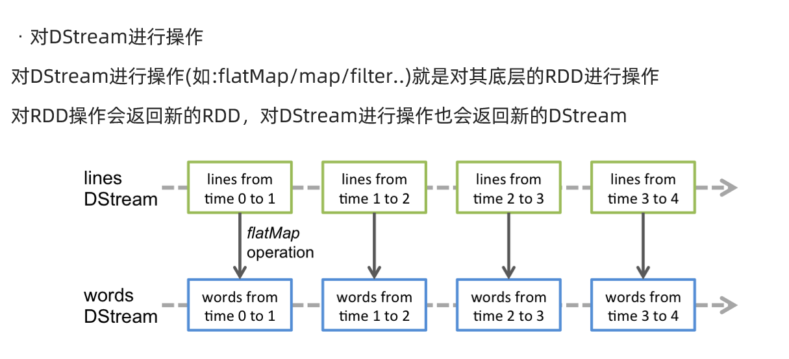

## DSteam的容错

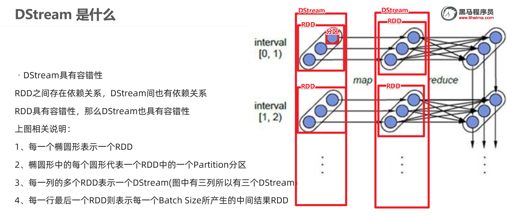


## DSteam的API

大多数Transformation和Action/Output和 之前的RDD的一样使用, 少部分不一样的通过案例讲解

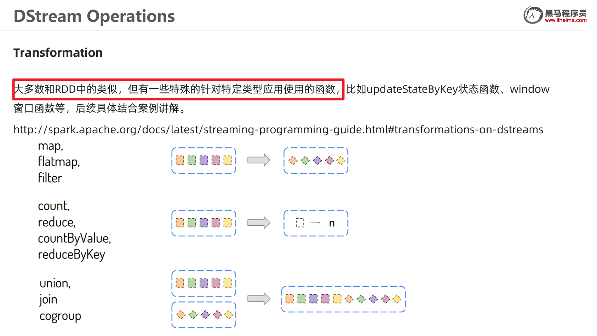

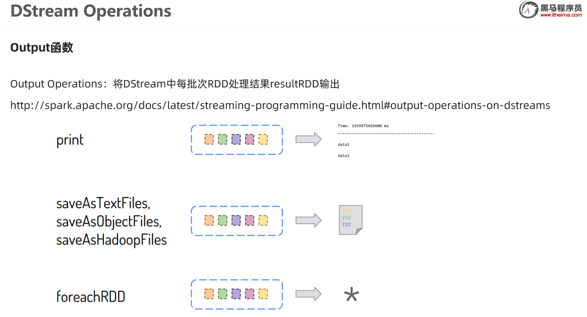


# SparkStreaming案例


##  案例1-WordCount

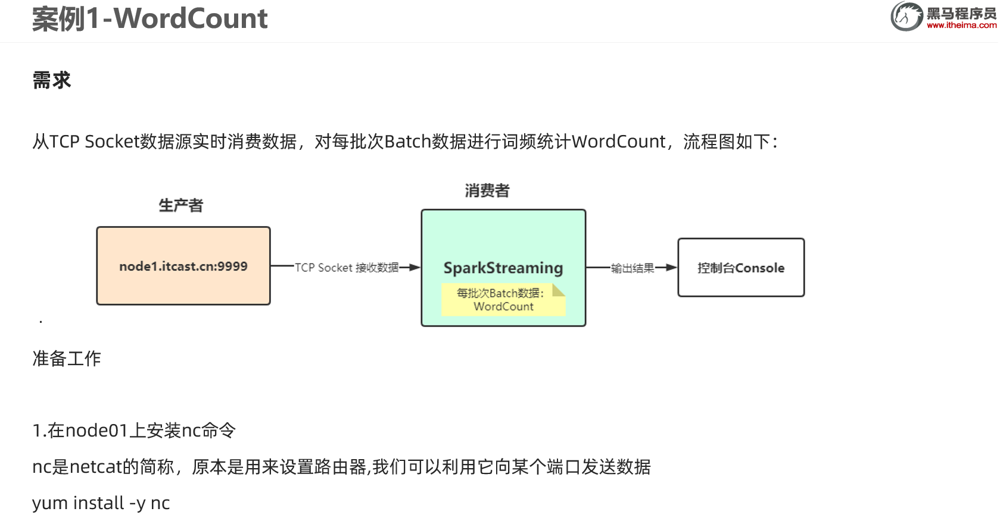

yum install -y nc

https://github.com/apache/spark/blob/master/examples/src/main/scala/org/apache/spark/examples/streaming/NetworkWordCount.scala

```Java
package cn.itcast.streaming

import org.apache.spark.streaming.dstream.{DStream, ReceiverInputDStream}
import org.apache.spark.{SparkConf, SparkContext, streaming}
import org.apache.spark.streaming.{Seconds, StreamingContext}

/**
 * Author itcast
 * Desc 使用SparkStreaming接收node1:9999的数据并做WordCount
 */
object WordCount01 {
  def main(args: Array[String]): Unit = {
    //TODO 0.准备环境
    val conf: SparkConf = new SparkConf().setAppName("spark").setMaster("local[*]")
    val sc: SparkContext = new SparkContext(conf)
    sc.setLogLevel("WARN")
    //the time interval at which streaming data will be divided into batches
    val ssc: StreamingContext = new StreamingContext(sc,Seconds(5))//每隔5s划分一个批次

    //TODO 1.加载数据
    val lines: ReceiverInputDStream[String] = ssc.socketTextStream("node1",9999)

    //TODO 2.处理数据
    val resultDS: DStream[(String, Int)] = lines.flatMap(_.split(" "))
      .map((_, 1))
      .reduceByKey(_ + _)

    //TODO 3.输出结果
    resultDS.print()

    //TODO 4.启动并等待结束
    ssc.start()
    ssc.awaitTermination()//注意:流式应用程序启动之后需要一直运行等待手动停止/等待数据到来

    //TODO 5.关闭资源
    ssc.stop(stopSparkContext = true, stopGracefully = true)//优雅关闭
  }
}

```


## 案例2-状态管理

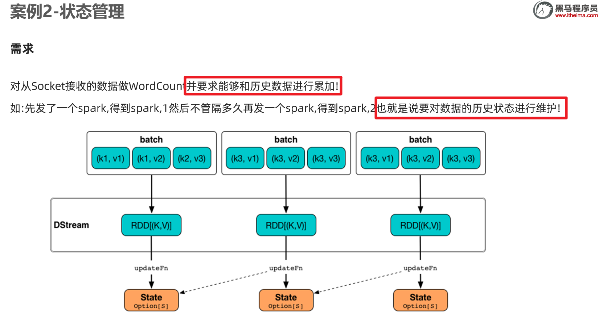


```Java
package cn.itcast.streaming

import org.apache.spark.streaming.dstream.{DStream, ReceiverInputDStream}
import org.apache.spark.streaming.{Seconds, StreamingContext}
import org.apache.spark.{SparkConf, SparkContext}

/**
 * Author itcast
 * Desc 使用SparkStreaming接收node1:9999的数据并做WordCount+实现状态管理:
 * 如输入spark hadoop 得到(spark,1),(hadoop,1)
 * 再下一个批次在输入 spark spark,得到(spark,3)
 */
object WordCount02 {
  def main(args: Array[String]): Unit = {
    //TODO 0.准备环境
    val conf: SparkConf = new SparkConf().setAppName("spark").setMaster("local[*]")
    val sc: SparkContext = new SparkContext(conf)
    sc.setLogLevel("WARN")
    //the time interval at which streaming data will be divided into batches
    val ssc: StreamingContext = new StreamingContext(sc, Seconds(5)) //每隔5s划分一个批次

    //The checkpoint directory has not been set. Please set it by StreamingContext.checkpoint().
    //注意:state存在checkpoint中
    ssc.checkpoint("./ckp")

    //TODO 1.加载数据
    val lines: ReceiverInputDStream[String] = ssc.socketTextStream("node1", 9999)

    //TODO 2.处理数据
    //定义一个函数用来处理状态:把当前数据和历史状态进行累加
    //currentValues:表示该key(如:spark)的当前批次的值,如:[1,1]
    //historyValue:表示该key(如:spark)的历史值,第一次是0,后面就是之前的累加值如1
    val updateFunc = (currentValues: Seq[Int], historyValue: Option[Int]) => {
      if (currentValues.size > 0) {
        val currentResult: Int = currentValues.sum + historyValue.getOrElse(0)
        Some(currentResult)
      } else {
        historyValue
      }
    }

    val resultDS: DStream[(String, Int)] = lines.flatMap(_.split(" "))
      .map((_, 1))
      //.reduceByKey(_ + _)
      // updateFunc: (Seq[V], Option[S]) => Option[S]
      .updateStateByKey(updateFunc)

    //TODO 3.输出结果
    resultDS.print()

    //TODO 4.启动并等待结束
    ssc.start()
    ssc.awaitTermination() //注意:流式应用程序启动之后需要一直运行等待手动停止/等待数据到来

    //TODO 5.关闭资源
    ssc.stop(stopSparkContext = true, stopGracefully = true) //优雅关闭
  }
}

```


## 案例3-状态恢复-扩展

```Java
package cn.itcast.streaming

import org.apache.spark.streaming.dstream.{DStream, ReceiverInputDStream}
import org.apache.spark.streaming.{Seconds, StreamingContext}
import org.apache.spark.{SparkConf, SparkContext}

/**
 * Author itcast
 * Desc 使用SparkStreaming接收node1:9999的数据并做WordCount+实现状态管理+状态恢复
 * 如输入spark hadoop 得到(spark,1),(hadoop,1)
 * 再下一个批次在输入 spark spark,得到(spark,3)
 */
object WordCount03 {
  def creatingFunc():StreamingContext ={
    //TODO 0.准备环境
    val conf: SparkConf = new SparkConf().setAppName("spark").setMaster("local[*]")
    val sc: SparkContext = new SparkContext(conf)
    sc.setLogLevel("WARN")
    //the time interval at which streaming data will be divided into batches
    val ssc: StreamingContext = new StreamingContext(sc, Seconds(5)) //每隔5s划分一个批次

    //The checkpoint directory has not been set. Please set it by StreamingContext.checkpoint().
    //注意:state存在checkpoint中
    ssc.checkpoint("./ckp")

    //TODO 1.加载数据
    val lines: ReceiverInputDStream[String] = ssc.socketTextStream("node1", 9999)

    //TODO 2.处理数据
    //定义一个函数用来处理状态:把当前数据和历史状态进行累加
    //currentValues:表示该key(如:spark)的当前批次的值,如:[1,1]
    //historyValue:表示该key(如:spark)的历史值,第一次是0,后面就是之前的累加值如1
    val updateFunc = (currentValues: Seq[Int], historyValue: Option[Int]) => {
      if (currentValues.size > 0) {
        val currentResult: Int = currentValues.sum + historyValue.getOrElse(0)
        Some(currentResult)
      } else {
        historyValue
      }
    }

    val resultDS: DStream[(String, Int)] = lines.flatMap(_.split(" "))
      .map((_, 1))
      //.reduceByKey(_ + _)
      // updateFunc: (Seq[V], Option[S]) => Option[S]
      .updateStateByKey(updateFunc)

    //TODO 3.输出结果
    resultDS.print()

    ssc
  }
  def main(args: Array[String]): Unit = {
    //TODO 0.准备环境
    val ssc: StreamingContext = StreamingContext.getOrCreate("./ckp", creatingFunc _)
    ssc.sparkContext.setLogLevel("WARN")

    //TODO 4.启动并等待结束
    ssc.start()
    ssc.awaitTermination() //注意:流式应用程序启动之后需要一直运行等待手动停止/等待数据到来

    //TODO 5.关闭资源
    ssc.stop(stopSparkContext = true, stopGracefully = true) //优雅关闭
  }
}

```


## 案例4-窗口计算

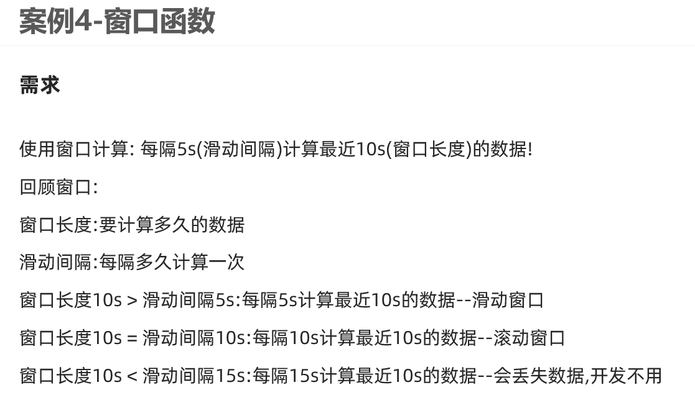

如实际开发中:

每隔1min计算最近24小时的热搜排行榜

每隔10s计算最近10分钟的广告点击量

每隔1h计算最近7天的热搜

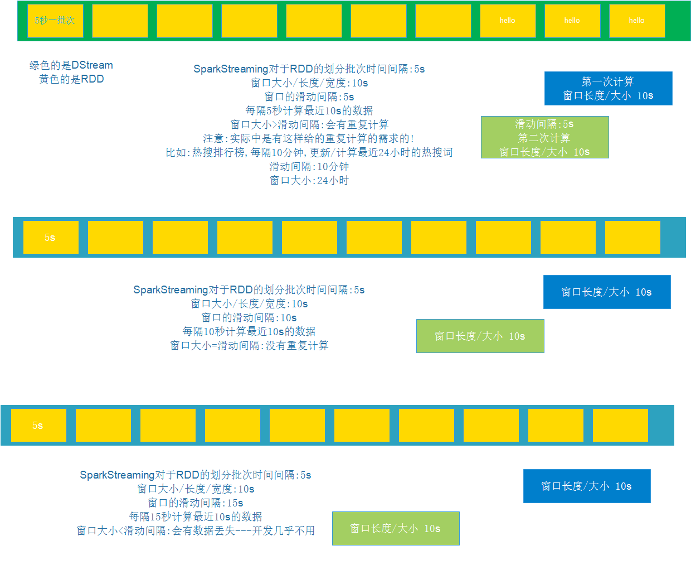

```Java
package cn.itcast.streaming

import org.apache.spark.streaming.dstream.{DStream, ReceiverInputDStream}
import org.apache.spark.streaming.{Seconds, StreamingContext}
import org.apache.spark.{SparkConf, SparkContext}

/**
 * Author itcast
 * Desc 使用SparkStreaming接收node1:9999的数据并做WordCount+窗口计算
 * 每隔5s计算最近10s的数据
 */
object WordCount04 {
  def main(args: Array[String]): Unit = {
    //TODO 0.准备环境
    val conf: SparkConf = new SparkConf().setAppName("spark").setMaster("local[*]")
    val sc: SparkContext = new SparkContext(conf)
    sc.setLogLevel("WARN")
    //the time interval at which streaming data will be divided into batches
    val ssc: StreamingContext = new StreamingContext(sc,Seconds(5))//每隔5s划分一个批次

    //TODO 1.加载数据
    val lines: ReceiverInputDStream[String] = ssc.socketTextStream("node1",9999)

    //TODO 2.处理数据
    val resultDS: DStream[(String, Int)] = lines.flatMap(_.split(" "))
      .map((_, 1))
      //.reduceByKey(_ + _)
      //   windowDuration :窗口长度/窗口大小,表示要计算最近多长时间的数据
      //   slideDuration : 滑动间隔,表示每隔多长时间计算一次
      //   注意:windowDuration和slideDuration必须是batchDuration的倍数
      //  每隔5s(滑动间隔)计算最近10s(窗口长度/窗口大小)的数据
      //reduceByKeyAndWindow(聚合函数,windowDuration,slideDuration)
        //.reduceByKeyAndWindow(_+_,Seconds(10),Seconds(5))
      .reduceByKeyAndWindow((a:Int,b:Int)=>a+b,Seconds(10),Seconds(5))
    //实际开发中需要我们掌握的是如何根据需求设置windowDuration和slideDuration
    //如:
    //每隔10分钟(滑动间隔slideDuration)更新最近24小时(窗口长度windowDuration)的广告点击数量
    // .reduceByKeyAndWindow((a:Int,b:Int)=>a+b,Minutes(60*24),Minutes(10))

    //TODO 3.输出结果
    resultDS.print()

    //TODO 4.启动并等待结束
    ssc.start()
    ssc.awaitTermination()//注意:流式应用程序启动之后需要一直运行等待手动停止/等待数据到来

    //TODO 5.关闭资源
    ssc.stop(stopSparkContext = true, stopGracefully = true)//优雅关闭
  }
}

```

