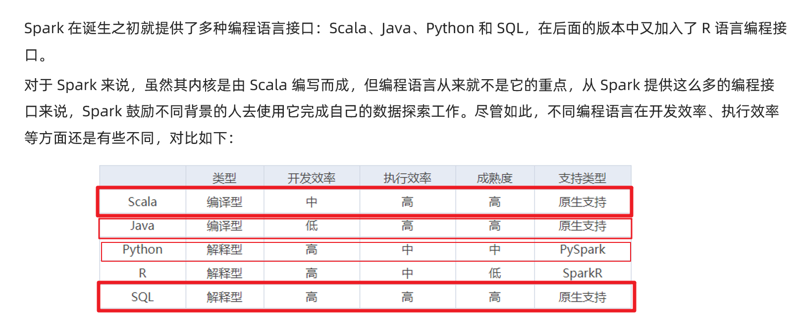
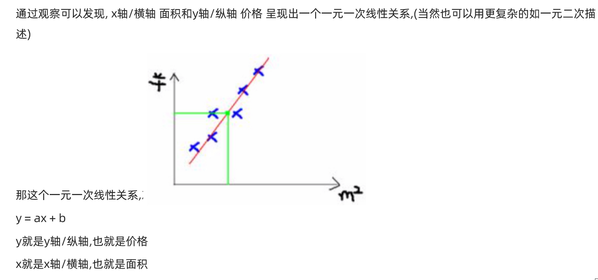
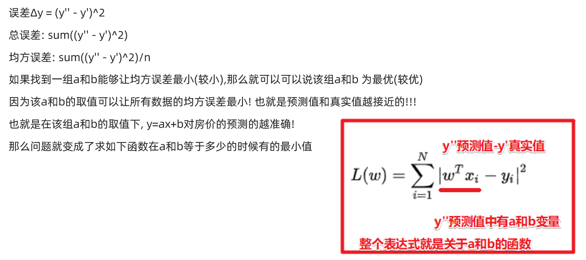
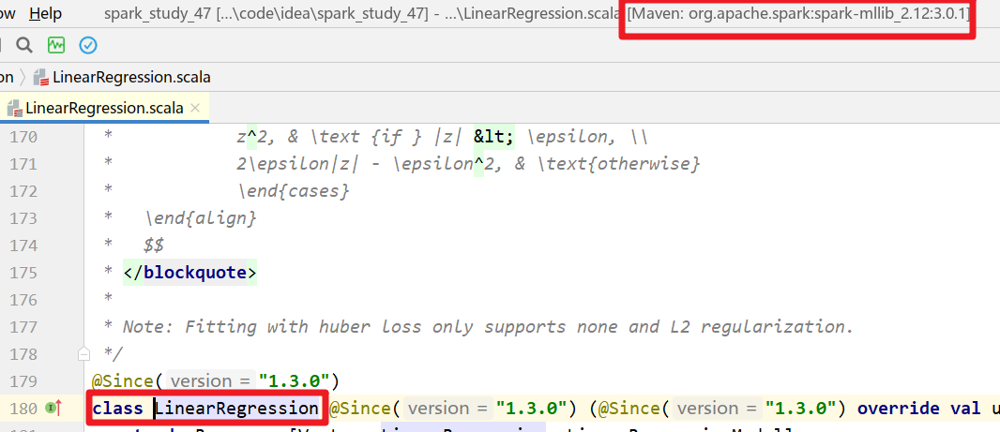
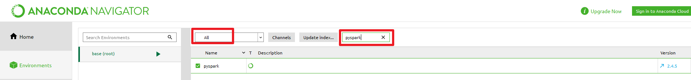
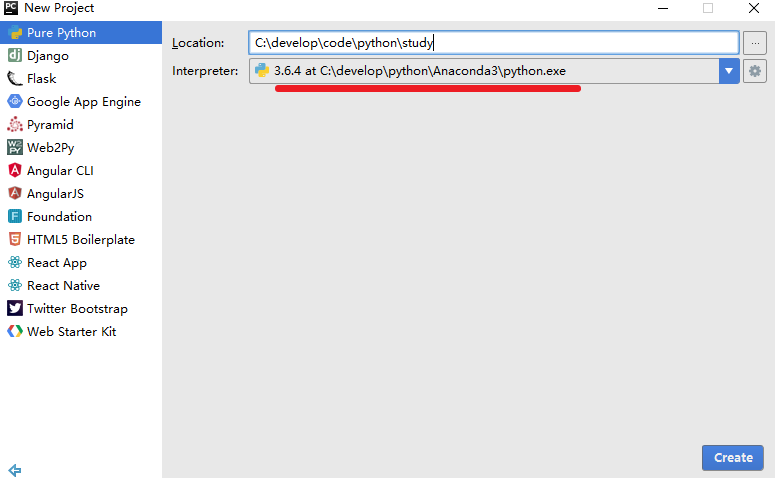
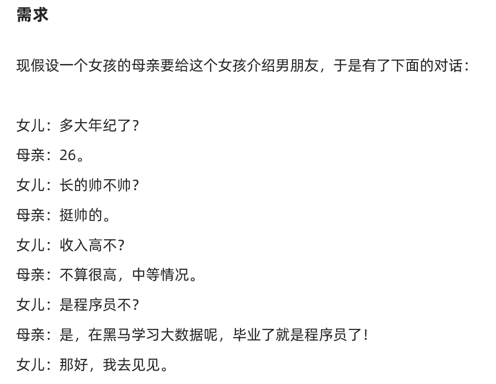
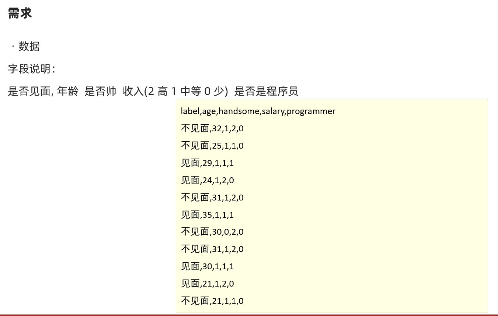
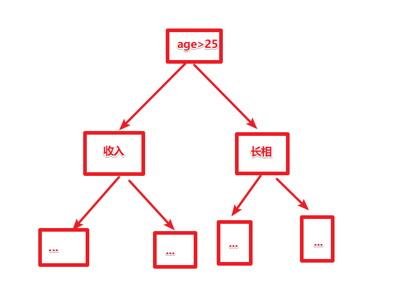

# 多语言开发-说明




# Java-Spark-掌握

https://github.com/apache/spark/tree/master/examples/src/main/java/org/apache/spark/examples

## SparkCore

```java
package cn.itcast.hello;

import org.apache.spark.SparkConf;
import org.apache.spark.api.java.JavaPairRDD;
import org.apache.spark.api.java.JavaRDD;
import org.apache.spark.api.java.JavaSparkContext;
import scala.Tuple2;

import java.util.Arrays;
import java.util.List;

/**
 * Author itcast
 * Desc 演示使用Java语言开发SparkCore完成WordCount
 */
public class JavaSparkDemo01 {
    public static void main(String[] args) {
        //0.TODO 准备环境
        SparkConf sparkConf = new SparkConf().setAppName("JavaSparkDemo").setMaster("local[*]");
        JavaSparkContext jsc = new JavaSparkContext(sparkConf);
        jsc.setLogLevel("WARN");

        //1.TODO 加载数据
        JavaRDD<String> fileRDD = jsc.textFile("data/input/words.txt");

        //2.TODO 处理数据-WordCount
        //切割
        /*
        @FunctionalInterface
        public interface FlatMapFunction<T, R> extends Serializable {
          Iterator<R> call(T t) throws Exception;
        }

         */
        //注意:java的函数/lambda表达式的语法:
        // (参数列表)->{函数体}
        JavaRDD<String> wordsRDD = fileRDD.flatMap(line -> Arrays.asList(line.split(" ")).iterator());
        //每个单词记为1
        JavaPairRDD<String, Integer> wordAndOneRDD = wordsRDD.mapToPair(word -> new Tuple2<>(word, 1));
        //分组聚合
        JavaPairRDD<String, Integer> wordAndCountRDD = wordAndOneRDD.reduceByKey((a, b) -> a + b);

        //3.TODO 输出结果
        List<Tuple2<String, Integer>> result = wordAndCountRDD.collect();
        //result.forEach(t-> System.out.println(t));
        result.forEach(System.out::println);//方法引用/就是方法转为了函数

        //4.TODO 关闭资源
        jsc.stop();
    }
}

```


## SparkStreaming

```java
package cn.itcast.hello;

import org.apache.spark.SparkConf;
import org.apache.spark.streaming.Durations;
import org.apache.spark.streaming.api.java.JavaPairDStream;
import org.apache.spark.streaming.api.java.JavaReceiverInputDStream;
import org.apache.spark.streaming.api.java.JavaStreamingContext;
import scala.Tuple2;

import java.util.Arrays;

/**
 * Author itcast
 * Desc 演示使用Java语言开发SparkStreaming完成WordCount
 */
public class JavaSparkDemo02 {
    public static void main(String[] args) throws InterruptedException {
        //0.TODO 准备环境
        SparkConf sparkConf = new SparkConf().setAppName("JavaSparkDemo").setMaster("local[*]");
        //JavaSparkContext jsc = new JavaSparkContext(sparkConf);
        //jsc.setLogLevel("WARN");
        JavaStreamingContext jssc = new JavaStreamingContext(sparkConf, Durations.seconds(5));
        jssc.sparkContext().setLogLevel("WARN");

        //1.TODO 加载数据
        JavaReceiverInputDStream<String> lines = jssc.socketTextStream("node1", 9999);

        //2.TODO 处理数据-WordCount
        JavaPairDStream<String, Integer> result = lines.flatMap(line -> Arrays.asList(line.split(" ")).iterator())
                .mapToPair(word -> new Tuple2<>(word, 1))
                .reduceByKey((a, b) -> a + b);

        //3.TODO 输出结果
        result.print();

        //4.TODO 启动并等待停止
        jssc.start();
        jssc.awaitTermination();

        //4.TODO 关闭资源
        jssc.stop();
    }
}

```


## SparkSQL

```java
package cn.itcast.hello;

import org.apache.spark.sql.Dataset;
import org.apache.spark.sql.Encoders;
import org.apache.spark.sql.SparkSession;

import java.util.Arrays;
import static org.apache.spark.sql.functions.col;

/**
 * Author itcast
 * Desc 演示使用Java语言开发SparkSQL完成WordCount
 */
public class JavaSparkDemo03 {
    public static void main(String[] args) {
        //0.TODO 准备环境
        SparkSession spark = SparkSession.builder().appName("JavaSparkDemo").master("local[*]").getOrCreate();
        spark.sparkContext().setLogLevel("WARN");


        //1.TODO 加载数据
        Dataset<String> ds = spark.read().textFile("data/input/words.txt");

        //2.TODO 处理数据-WordCount
        Dataset<String> wordsDS = ds.flatMap((String line) -> Arrays.asList(line.split(" ")).iterator(), Encoders.STRING());

        //TODO ====SQL
        wordsDS.createOrReplaceTempView("t_word");
        String sql = "select value, count(*) as counts " +
                "from t_word " +
                "group by value " +
                "order by counts desc";
        spark.sql(sql).show();

        //TODO ====DSL
        /*Dataset<Row> temp = wordsDS.groupBy("value")
                .count();
        temp.orderBy(temp.col("count").desc()).show();*/
        wordsDS.groupBy("value")
                .count()
                //.orderBy($"count".desc()).show();
                .orderBy(col("count").desc()).show();

        //3.TODO 输出结果


        //4.TODO 关闭资源
        spark.stop();

    }
}

```


## StructuredStreaming

```java
package cn.itcast.hello;

import org.apache.spark.sql.Dataset;
import org.apache.spark.sql.Encoders;
import org.apache.spark.sql.Row;
import org.apache.spark.sql.SparkSession;
import org.apache.spark.sql.streaming.OutputMode;
import org.apache.spark.sql.streaming.StreamingQueryException;

import java.util.Arrays;
import java.util.concurrent.TimeoutException;

import static org.apache.spark.sql.functions.col;
/**
 * Author itcast
 * Desc 演示使用Java语言开发StructuredStreaming完成WordCount
 */
public class JavaSparkDemo04 {
    public static void main(String[] args) throws TimeoutException, StreamingQueryException {
        //0.TODO 准备环境
        SparkSession spark = SparkSession.builder().appName("JavaSparkDemo").master("local[*]")
                .config("spark.sql.shuffle.partitions", "4")
                .getOrCreate();
        spark.sparkContext().setLogLevel("WARN");


        //1.TODO 加载数据
        Dataset<Row> lines = spark.readStream()
                .format("socket")
                .option("host", "node1")
                .option("port", 9999)
                .load();

        //2.TODO 处理数据-WordCount
        Dataset<String> ds = lines.as(Encoders.STRING());
        Dataset<String> wordsDS = ds.flatMap((String line) -> Arrays.asList(line.split(" ")).iterator(), Encoders.STRING());

        //TODO ====SQL
        wordsDS.createOrReplaceTempView("t_word");
        String sql = "select value, count(*) as counts " +
                "from t_word " +
                "group by value " +
                "order by counts desc";
        Dataset<Row> result1 = spark.sql(sql);

        //TODO ====DSL
        Dataset<Row> result2 = wordsDS.groupBy("value")
                .count()
                .orderBy(col("count").desc());

        //3.TODO 输出结果
        result1.writeStream()
                .format("console")
                .outputMode(OutputMode.Complete())
                .start();
                /*.awaitTermination()*/
        result2.writeStream()
                .format("console")
                .outputMode(OutputMode.Complete())
                .start()
                .awaitTermination();

        //4.TODO 关闭资源
        spark.stop();

    }
}

```


## 线性回归算法-房价预测案例

### 需求








```
特征列:
|房屋编号mlsNum|城市city|平方英尺|卧室数bedrooms|卫生间数bathrooms|车库garage|年龄age|房屋占地面积acres|
标签列:
房屋价格price
```


### 代码实现

```
0.准备环境
1.加载数据
2.特征处理 
3.数据集划分0.8训练集/0.2测试集
4.使用训练集训练线性回归模型
5.使用测试集对模型进行测试
6.计算误差rmse均方误差
7.模型保存(save)方便后续使用(load)
8.关闭资源
```


```java
package cn.itcast.hello;

import org.apache.spark.ml.evaluation.RegressionEvaluator;
import org.apache.spark.ml.feature.VectorAssembler;
import org.apache.spark.ml.regression.LinearRegression;
import org.apache.spark.ml.regression.LinearRegressionModel;
import org.apache.spark.sql.Dataset;
import org.apache.spark.sql.Row;
import org.apache.spark.sql.SparkSession;
import org.apache.spark.sql.streaming.StreamingQueryException;

import java.io.IOException;
import java.util.concurrent.TimeoutException;

/**
 * Author itcast
 * Desc 演示使用Java语言开发SparkMlLib-线性回归算法-房价预测案例
 */
public class JavaSparkDemo05 {
    public static void main(String[] args) throws TimeoutException, StreamingQueryException, IOException {
        //0.TODO 准备环境
        SparkSession spark = SparkSession.builder().appName("JavaSparkDemo").master("local[*]")
                .config("spark.sql.shuffle.partitions", "4")
                .getOrCreate();
        spark.sparkContext().setLogLevel("WARN");

        //TODO 1.加载数据
        Dataset<Row> homeDataDF = spark.read()
                .format("csv")
                .option("sep", "|")//指定分隔符
                .option("header", "true")//是否有表头
                .option("inferSchema", "true")//是否自动推断约束
                .load("data/input/homeprice.data");
        homeDataDF.printSchema();
        homeDataDF.show();
        /*
        root
 |-- mlsNum: integer (nullable = true)
 |-- city: string (nullable = true)
 |-- sqFt: double (nullable = true)
 |-- bedrooms: integer (nullable = true)
 |-- bathrooms: integer (nullable = true)
 |-- garage: integer (nullable = true)
 |-- age: integer (nullable = true)
 |-- acres: double (nullable = true)
 |-- price: double (nullable = true)
//|房屋编号|城市|平方英尺|卧室数|卫生间数|车库|年龄|房屋占地面积|房屋价格
+-------+------------+-------+--------+---------+------+---+-----+---------+
| mlsNum|        city|   sqFt|bedrooms|bathrooms|garage|age|acres|    price|
+-------+------------+-------+--------+---------+------+---+-----+---------+
|4424109|Apple Valley| 1634.0|       2|        2|     2| 33| 0.04| 119900.0|
|4404211|   Rosemount|13837.0|       4|        6|     4| 17|14.46|3500000.0|
|4339082|  Burnsville| 9040.0|       4|        6|     8| 12| 0.74|2690000.0|
         */

        //TODO 2.特征处理
        //特征选择
        Dataset<Row> featuredDF = homeDataDF.select("sqFt", "age", "acres", "price");
        //特征向量化
        Dataset<Row> vectorDF = new VectorAssembler()
                .setInputCols(new String[]{"sqFt", "age", "acres"})//指定要对哪些特征做向量化
                .setOutputCol("features")//向量化之后的特征列列名
                .transform(featuredDF);
        vectorDF.printSchema();
        vectorDF.show();
        /*
        root
         |-- sqFt: double (nullable = true)
         |-- age: integer (nullable = true)
         |-- acres: double (nullable = true)
         |-- price: double (nullable = true)
         |-- features: vector (nullable = true)

        +-------+---+-----+---------+--------------------+
        |   sqFt|age|acres|    price|            features|
        +-------+---+-----+---------+--------------------+
        | 1634.0| 33| 0.04| 119900.0|  [1634.0,33.0,0.04]|
        |13837.0| 17|14.46|3500000.0|[13837.0,17.0,14.46]|
        | 9040.0| 12| 0.74|2690000.0|  [9040.0,12.0,0.74]|
         */


        //TODO 3.数据集划分0.8训练集/0.2测试集
        Dataset<Row>[] arr = vectorDF.randomSplit(new double[]{0.8, 0.2}, 100);
        Dataset<Row> trainSet = arr[0];
        Dataset<Row> testSet = arr[1];

        //TODO 4.构建线性回归模型并使用训练集训练
        LinearRegressionModel model = new LinearRegression()
                .setFeaturesCol("features")//设置特征列(应该设置向量化之后的)
                .setLabelCol("price")//设置标签列(数据中已经标记好的原本的价格)
                .setPredictionCol("predict_price")//设置预测列(后续做预测时预测的价格)
                .setMaxIter(10)//最大迭代次数
                .fit(trainSet);//使用训练集进行训练

        //TODO 5.使用测试集对模型进行测试/预测
        Dataset<Row> testResult = model.transform(testSet);
        testResult.show(false);

        //TODO 6.计算误差rmse均方误差
        double rmse = new RegressionEvaluator()//创建误差评估器
                .setMetricName("rmse") //设置要计算的误差名称,均方根误差 (sum((y-y')^2)/n)^0.5
                .setLabelCol("price")//设置真实值是哪一列
                .setPredictionCol("predict_price")//设置预测值是哪一列
                .evaluate(testResult);//对数据中的真实值和预测值进行误差计算
        System.out.println("rmse为:" + rmse);

        //TODO 7.模型保存(save)方便后续使用(load)
        //model.save("path");
        //LinearRegressionModel lmodel = LinearRegressionModel.load("path");

        //TODO 8.关闭资源
        spark.stop();
    }
}

```


# PySpark-了解

python教程600集

https://www.bilibili.com/video/BV1ex411x7Em


pyspark官方案例

https://github.com/apache/spark/tree/master/examples/src/main/python


环境准备

1.先安装Anaconda3-5.1.0-Windows-x86_64-Python3.6.exe

2.安装pycharm-professional-2017.1.4-Win开发工具

3.打开Anaconda安装pyspark环境/或者cmd安装 pip install pyspark



4.打开pycharm创建python项目(注意关联Anaconda中的python)




## SparkCore

```python
from pyspark import SparkContext

if __name__ == "__main__":
    sc = SparkContext(master="local[*]", appName="pyspark")
    lines = sc.textFile("data/words.txt")
    result = lines.flatMap(lambda line:line.split(" "))\
        .map(lambda word:(word,1))\
        .reduceByKey(lambda a,b:a+b)\
        .collect()
    for(word,count) in result:
        print("%s,%i" %(word,count))
```


## SparkStreaming

```python
from pyspark import SparkContext
from streaming import StreamingContext

if __name__ == "__main__":
    """
    演示pyspark-SparkStreaming
    """
    # 创建环境
    sc = SparkContext(master="local[*]", appName="pyspark")
    ssc = StreamingContext(sc,5)

    lines = ssc.socketTextStream("node1",9999)
    result = lines.flatMap(lambda line:line.split(" "))\
        .map(lambda word:(word,1))\
        .reduceByKey(lambda a,b:a+b)

    result.pprint()

    ssc.start()
    ssc.awaitTermination()
```

## SparkSQL

```java
from sql import SparkSession
from sql.functions import split, explode

if __name__ == "__main__":
    """
    演示pyspark-SparkSQL
    """
    # 创建环境
    spark = SparkSession.builder.appName("pyspark").master("local[*]").getOrCreate()

    df = spark.read.text("data/words.txt")

    wordsDF = df.select(explode(split(df.value," ")).alias("word"))

    wordsDF.createOrReplaceTempView("t_words")

    spark.sql("select word,count(*) counts from t_words group by word order by counts desc").show()

    wordsDF.groupBy("word").count().orderBy("count", ascending=False).show()

    spark.stop()
```


## StructuredStreaming

```java
from sql import SparkSession
from sql.functions import split, explode

if __name__ == "__main__":
    """
    演示pyspark-StructuredStreaming
    """
    # 创建环境
    spark = SparkSession.builder.appName("pyspark").master("local[*]") \
        .config("spark.sql.shuffle.partitions", "2") \
        .getOrCreate()
    df = spark.readStream\
        .format("socket") \
        .option('host', "node1") \
        .option('port', 9999) \
        .load()

    wordsDF = df.select(explode(split(df.value," ")).alias("word"))

    wordsDF.createOrReplaceTempView("t_words")

    result1 = spark.sql("select word,count(*) counts from t_words group by word order by counts desc")

    result2 = wordsDF.groupBy("word").count().orderBy("count", ascending=False)

    result1.writeStream.format("console").outputMode("complete").start()
    result2.writeStream.format("console").outputMode("complete").start().awaitTermination()


    # spark.streams.awaitAnyTermination
    spark.stop()
```


## 决策树算法-相亲决策案例

### 需求








### 思路

从历史数据中找出一些"关键因素"来作为树的节点/决策依据

在信息论中, 信息熵可以衡量系统的不确定性,如果让信息熵变小就可以让系统的不确定性变小/也就是变得更加确定!

而我们的目标也是让系统的不确定性变小, 让我们的程序能够更加特征尽快的做出确定性的决策/判断

所以现在的目标就变成了选择一些能够让系统的信息熵变小的特征作为树的节点/决策依据,也就是要选择信息增益较大的特征(信息增益指的是信息熵减少的程度!)

而且信息熵/信息增益能够量化!也就是能够计算!


总结: 决策树算法中需要选择当前信息增益最大的特征作为树的节点/决策依据,依次选择相应的特征作为树的节点/决策依据,直到形成一颗决策树!


### 代码实现

```python
from ml import Pipeline
from ml.classification import DecisionTreeClassifier, DecisionTreeClassificationModel
from ml.evaluation import MulticlassClassificationEvaluator
from ml.feature import StringIndexer, VectorAssembler, IndexToString
from sql import SparkSession


if __name__ == "__main__":
    """
    演示pyspark-决策树分类案例-相亲决策案例
    """
    # 0.创建环境
    spark = SparkSession.builder.appName("pyspark").master("local[*]") \
        .config("spark.sql.shuffle.partitions", "2") \
        .getOrCreate()

    # 0.加载数据
    df = spark.read.format("csv")\
        .option("sep", ",") \
        .option("header", "true") \
        .option("inferSchema", "true") \
        .load("data/appointment.data")
    df.printSchema()
    df.show()

    # 1.标签数值化
    # 设置哪一列是字符串格式的标签列
    # 设置标签数值化之后的列名
    stringIndexer = StringIndexer()\
        .setInputCol("label")\
        .setOutputCol("label_index").fit(df)

    # 2.特征向量化
    # 设置特征列有哪些列
    # 设置特征向量化之后的列名
    vectorAssembler = VectorAssembler() \
        .setInputCols(["age", "handsome", "salary", "programmer"]) \
        .setOutputCol("features")
    # 后续可以使用pipeline做统一的训练和转换,所以这里不需要调用transform


    # 3.构建决策树模型
    # 设置向量化之后的特征列
    # 设置数值化之后的标签列
    # 设置预测列名称(预测出来的是数字)
    decisionTreeClassifier = DecisionTreeClassifier()\
        .setFeaturesCol("features")\
        .setLabelCol("label_index")\
        .setPredictionCol("predict_index")\
        .setMaxDepth(5)
    # 后续可以使用pipeline做统一的训练和转换,所以这里不需要调用fit

    # 4.标签还原
    # 预测出来的标签数值还原为字符串
    # 设置数值化的预测列
    # 设置转为字符串后的预测列的列名
    # 设置数值和字符串的对应关系在哪里
    indexToString = IndexToString().setInputCol("predict_index")\
        .setOutputCol("predict_String")\
        .setLabels(stringIndexer.labels)

    # 5.数据集划分
    trainSet,testSet = df.randomSplit(weights=[0.8,0.2])

    # 6.构建pipeline
    pipeline = Pipeline().setStages([stringIndexer,vectorAssembler,decisionTreeClassifier,indexToString])

    # 7.使用训练集训练
    model = pipeline.fit(trainSet)

    # 8.使用测试集测试模型
    testResult = model.transform(testSet)
    testResult.show()

    # 9.输出决策过程
    print("模型决策过程为: \n %s" % model.stages[2].toDebugString)

    # 10评估模型误差/好坏
    accuracy = MulticlassClassificationEvaluator(labelCol="label_index", predictionCol="predict_index", metricName="accuracy")\
        .evaluate(testResult)
    print("测试集错误率为: %f" % (1.0 - accuracy))

    # model.save("path")
    # model2 =DecisionTreeClassificationModel.load("path")


    spark.stop()
```


