# Spark3.0新特性介绍

## 动态分区裁剪

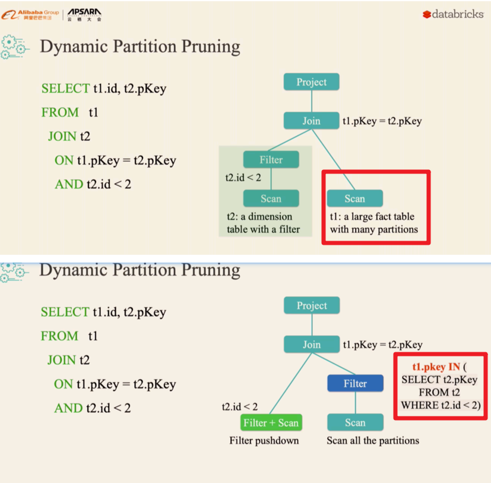

总结:

SparkSQL在执行的过程中,对分区表join进行成本统计/在runtime中进行cost compute, 决定是否需要通过增加一条分区过滤函数来多分区表的分区数据进行裁剪优化


## 自适应查询

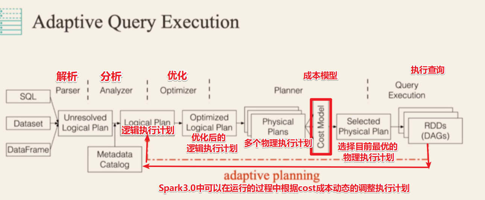


## 加速器感知调度


## DataSourceV2

下面是V1的问题,在V2中得到了解决

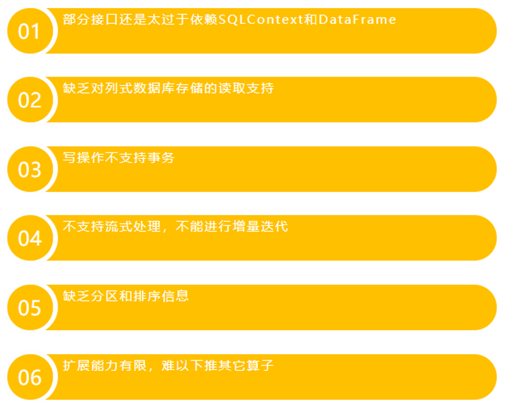

而且底层做好了封装

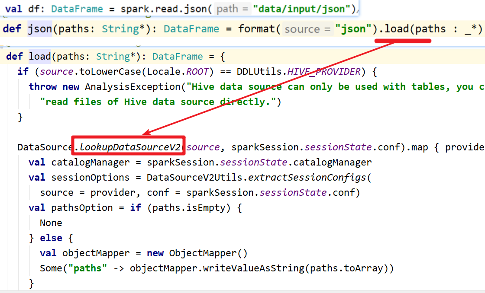


## 更好的SQL兼容

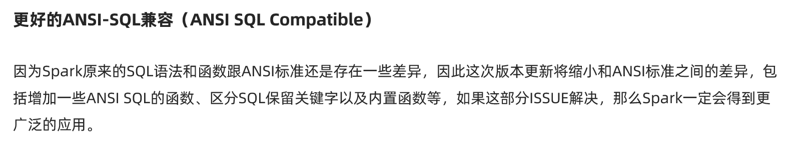

## SparkR的向量化读写

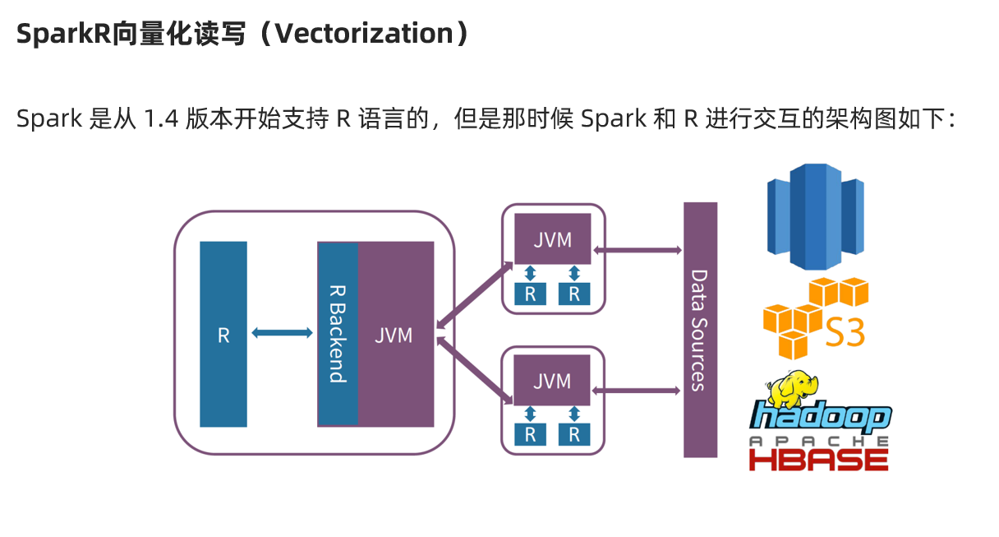

## 其他的新特性

如对数据湖的支持 和 对Python的支持

....


## 注意:

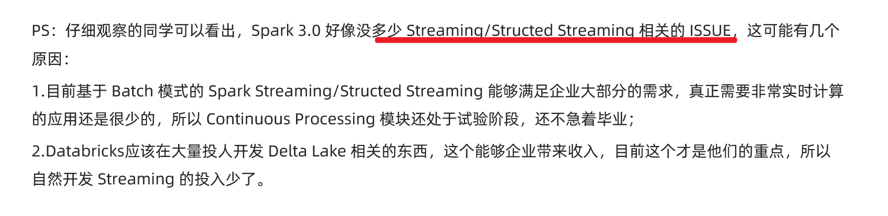


# Spark3.0-动态分区裁剪-体验

## 参数设置

默认就已经允许动态分区裁剪,但是执行的过程中是否会真正的开启还是需要runtime cost compute

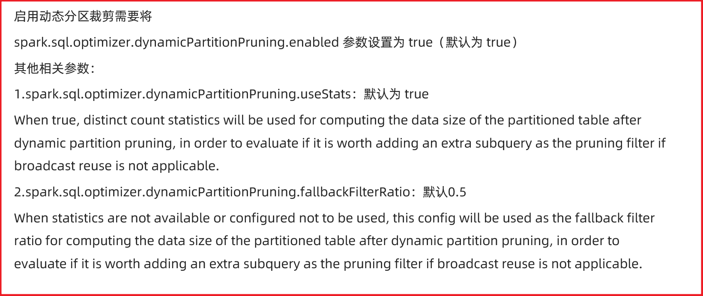

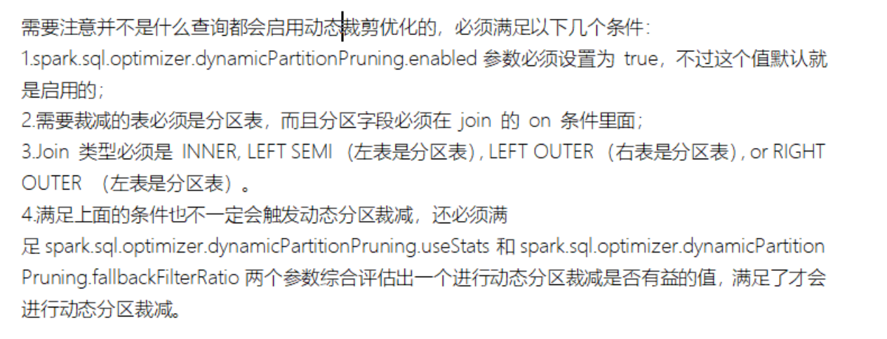


## 代码演示

```java
package cn.itcast.test

import org.apache.spark.SparkContext
import org.apache.spark.sql.SparkSession

/**
  * Author itcast
  * 动态分区裁剪（Dynamic Partition Pruning）
  */
object DPP2 {
  def main(args: Array[String]): Unit = {
    val spark: SparkSession = SparkSession.builder()
      .master("local[*]")
      .appName("DPP")
      .config("spark.sql.optimizer.dynamicPartitionPruning.enabled", "true")//默认为true
      .getOrCreate()
    val sc: SparkContext = spark.sparkContext
    sc.setLogLevel("WARN")

    import spark.implicits._

    spark.range(10000)
      .select($"id", $"id".as("k"))
      .write.partitionBy("k")
      .format("parquet")
      .mode("overwrite")
      .saveAsTable("tab1")

    spark.range(100)
      .select($"id", $"id".as("k"))
      .write.partitionBy("k")
      .format("parquet")
      .mode("overwrite")
      .saveAsTable("tab2")

    spark.sql("SELECT * FROM tab1 t1 JOIN tab2 t2 ON t1.k = t2.k AND t2.id < 2").explain()
    spark.sql("SELECT * FROM tab1 t1 JOIN tab2 t2 ON t1.k = t2.k AND t2.id < 2").show()

    Thread.sleep(Long.MaxValue)

    sc.stop()
    spark.stop()
  }
}
```

# Spark未来趋势

https://developer.aliyun.com/live/43188?spm=a2c6h.12873639.0.0.14a83205DgDdYV

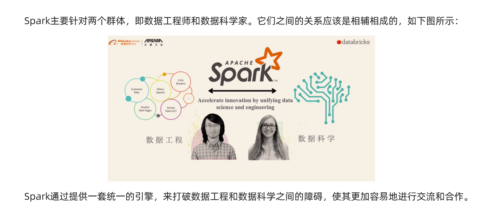

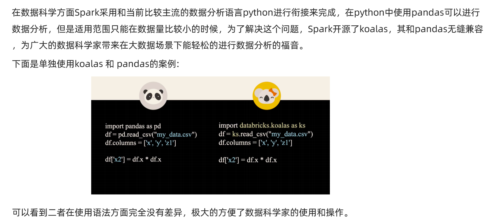


总结: 

Spark 未来 == 数据工程师 + 数据科学家

Spark 未来 == AI  + 大数据

Spark 未来 == Scala + Java + Python + R

Spark 未来 == 大数据领域统一的一站式的全家桶解决方案


