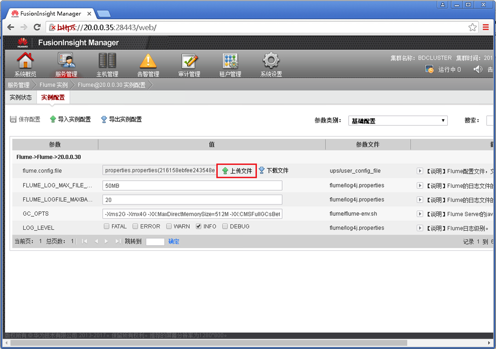
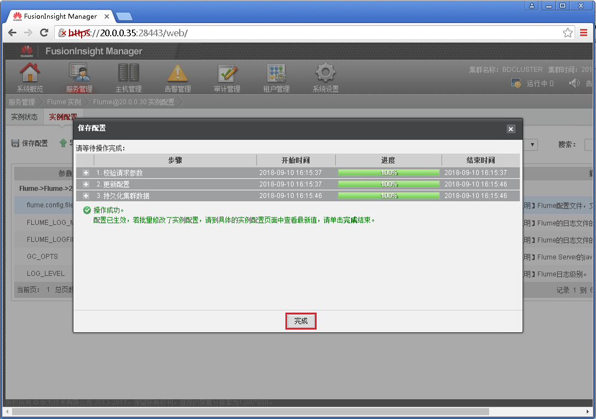
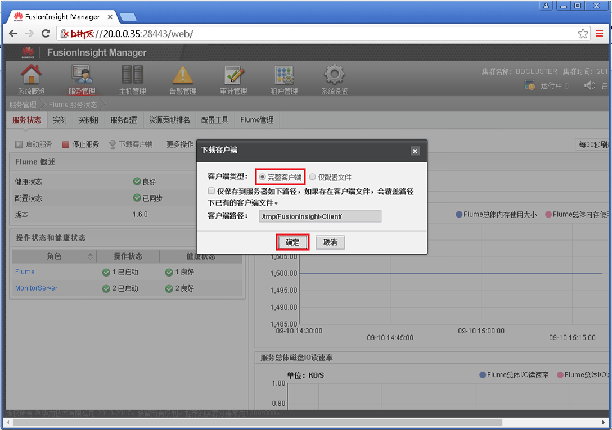
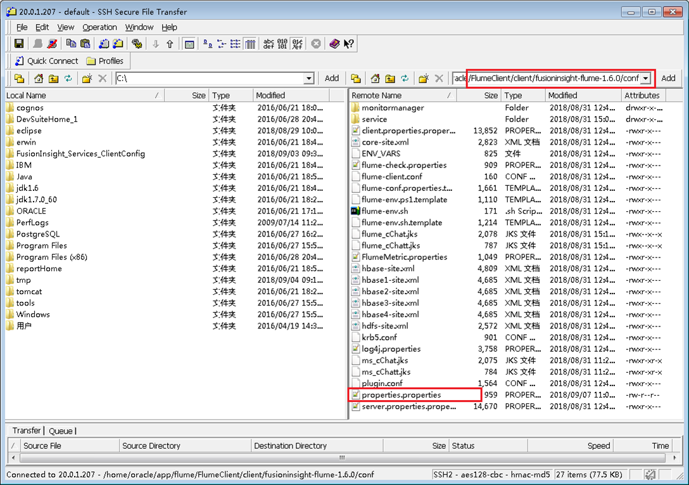
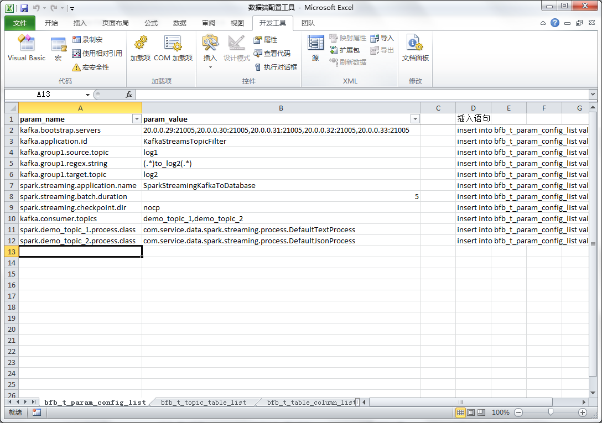
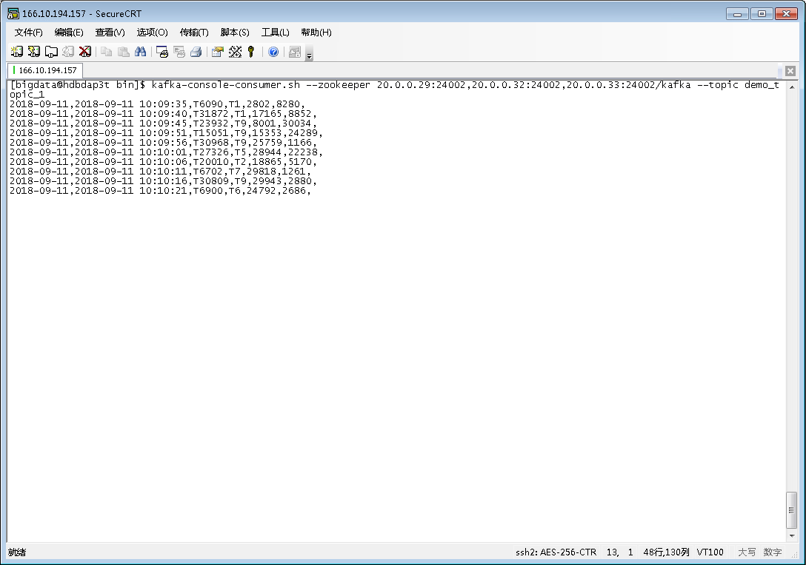
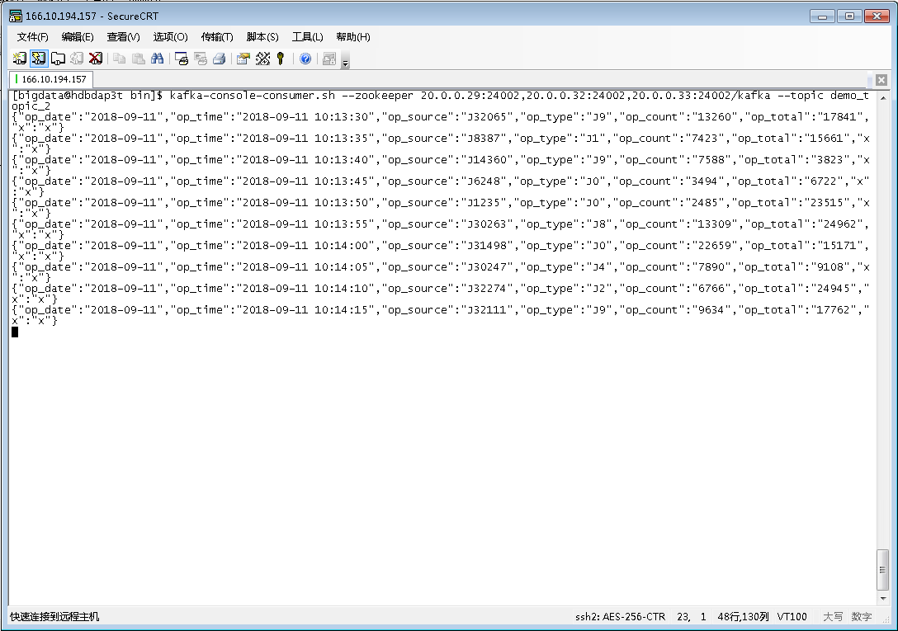
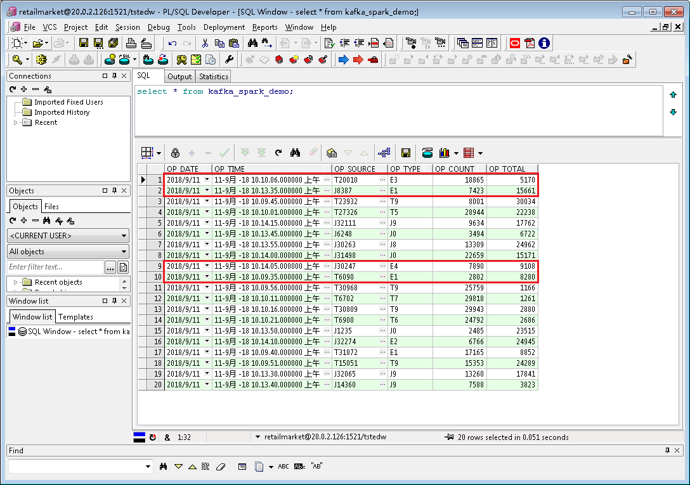

# DataService-Framework

#### 部分截图
Flume服务端配置文件下载  
  
Flume服务端配置文件上传  
  
Flume服务端配置文件生效  
  
Flume客户端软件下载  
  
Flume客户端采集配置  
  
Kafka Topic监控  
  
数据库配置项配置  
  
表结构配置  
  
Spark on Yarn 监控  
  
产生分隔符分隔的数据  
  
产生JSON格式数据  
  
数据处理结果验证  
  
