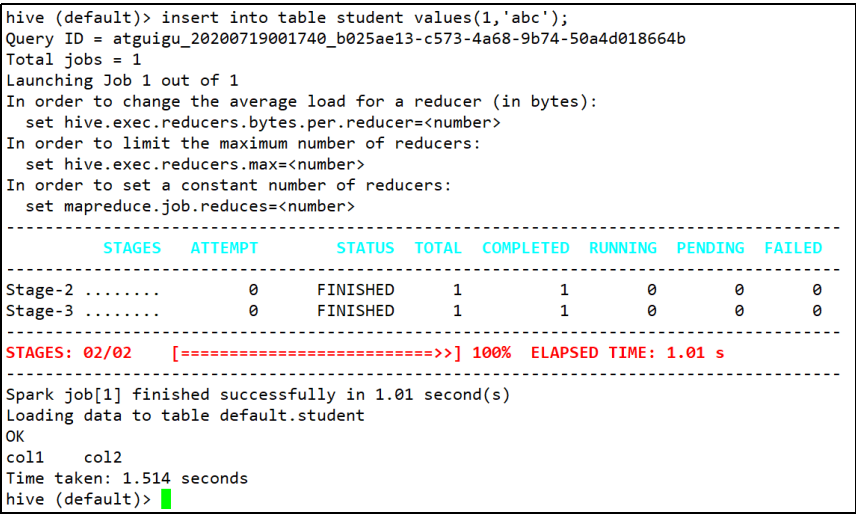
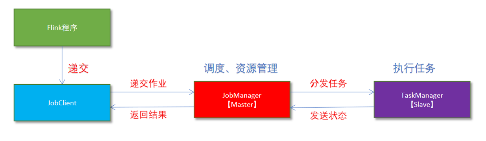
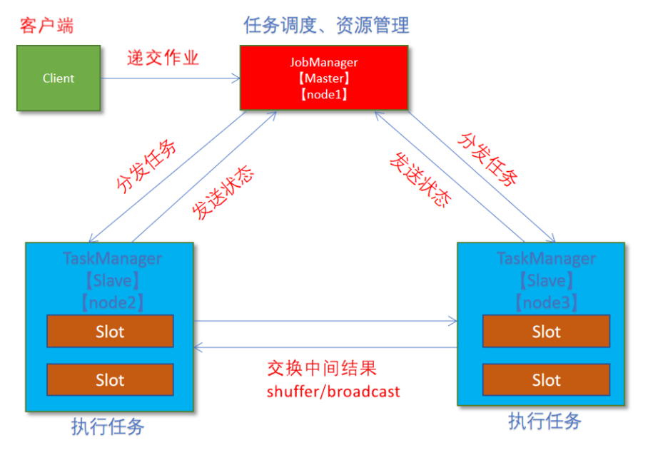
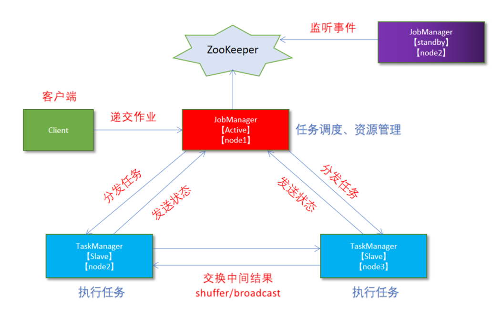
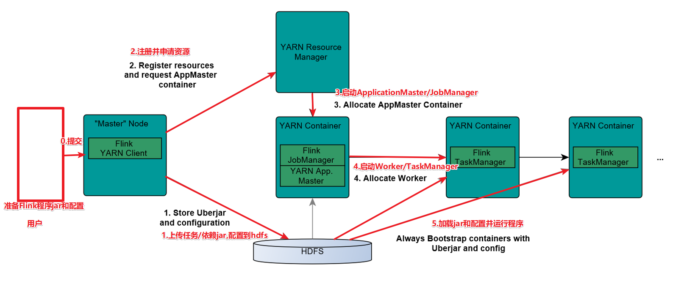
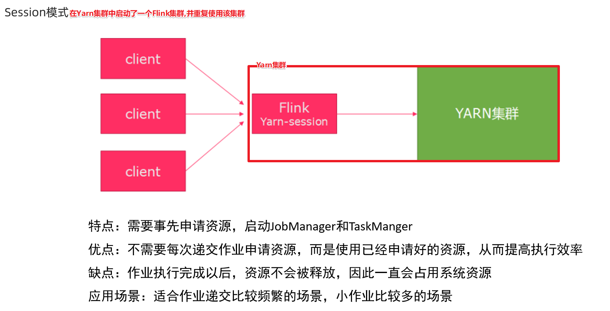

🤔Linux(Cenots7)环境配置

安装好VmWare虚拟机后，操作步骤

VmWare激活码：

```scala
ZF3R0-FHED2-M80TY-8QYGC-NPKYF
YF390-0HF8P-M81RQ-2DXQE-M2UT6
ZF71R-DMX85-08DQY-8YMNC-PPHV8
```

1.修改主机名

```shell
vi /etc/hostname
node01
```

2.添加主机之间的映射

```shell
vi /etc/hosts
192.168.244.121 www.node01.com node01
192.168.244.122 www.node02.com node02
192.168.244.123 www.node03.com node03
```

3.关闭selinux

```shell
vi /etc/selinux/config
SELINUX=enforcing
改为
SELINUX=disabled
```

4/关闭防火墙

```shell
systemctl status firewalld
systemctl stop firewalld
systemctl disable firewalld
```

5.修改root权限

```shell
vi /etc/sudoers
## Allows people in group wheel to run all commands
%wheel ALL=(ALL) ALL
dsjprs ALL=(ALL) ALL

## Allow root to run any commands anywhere
root ALL=(ALL) ALL
dsjprs ALL=(ALL) ALL
```

6.配置yum

```shell
CentOS-Base.repo

#The mirror system uses the connecting IP address of the client and thed

update status of each mirror to pick mirrors that are updated to and

geographically close to the client.  You should use this for CentOS updates

unless you are manually picking other mirrors.

#If the mirrorlist= does not work for you, as a fall back you can try the

remarked out baseurl= line instead.

#
#

[base]
name=CentOS-$releasever - Base
baseurl=https://mirrors.tuna.tsinghua.edu.cn/centos/$releasever/os/$basearch/
#mirrorlist=http://mirrorlist.centos.org/?release=$releasever&arch=$basearch&repo=os
enabled=1
gpgcheck=1
gpgkey=file:///etc/pki/rpm-gpg/RPM-GPG-KEY-7

#released updates
[updates]
name=CentOS-$releasever - Updates
baseurl=https://mirrors.tuna.tsinghua.edu.cn/centos/$releasever/updates/$basearch/
#mirrorlist=http://mirrorlist.centos.org/?release=$releasever&arch=$basearch&repo=updates
enabled=1
gpgcheck=1
gpgkey=file:///etc/pki/rpm-gpg/RPM-GPG-KEY-7


#additional packages that may be useful
[extras]
name=CentOS-$releasever - Extras
baseurl=https://mirrors.tuna.tsinghua.edu.cn/centos/$releasever/extras/$basearch/
#mirrorlist=http://mirrorlist.centos.org/?release=$releasever&arch=$basearch&repo=extras
enabled=1
gpgcheck=1
gpgkey=file:///etc/pki/rpm-gpg/RPM-GPG-KEY-7


#additional packages that extend functionality of existing packages
[centosplus]
name=CentOS-$releasever - Plus
baseurl=https://mirrors.tuna.tsinghua.edu.cn/centos/$releasever/centosplus/$basearch/
#mirrorlist=http://mirrorlist.centos.org/?release=$releasever&arch=$basearch&repo=centosplus
gpgcheck=1
enabled=0
gpgkey=file:///etc/pki/rpm-gpg/RPM-GPG-KEY-7
```

7.建立缓存

```shell
yum clean all
yum makecache
```

8.更新

```shell
yum update
```

9.配置网络NAT连接

```shell
IPADDR=
NETMASK=
GATEWAY=
DNS1=
HWADDR=
#=========================================
EVICE="eth0"
BOOTPROTO="static"
NM_CONTROLLED="yes"
ONBOOT="yes"
TYPE="Ethernet"
IPADDR=192.168.188.130
NETMASK=255.255.255.0
GATEWAY=192.168.188.2
DNS1=202.106.0.20
HWADDR=00:0C:29:84:0C:21　
```

10.修改主机名配置文件

```shell
vi /etc/sysconfig/network
NETWORKING=yes
HOSUNAME=dsjprs
```

11.修改DNS

```shell
vi /etc/resolv.conf
nameserver 192.168.244.2
```

12.重启网络服务

```shell
service network restart
```

13.如果安装的精简版镜像，则安装

安装命令：

```shell
yum install -y epel-release
```

安装 net-tool：工具包集合，包含ifconfig等命令

安装命令：

```shell
yum install -y net-tools
```

安装vim：编辑器

安装命令：

```shell
yum install -y vim
```

集群时间同步（3台机器） 

```shell
yum -y install ntpdate 
ntpdate ntp4.aliyun.com
```

### Ubuntu 环境配置

```shell
ubuntu 静态网络配置
# Let NetworkManager manage all devices on this system
network:
  version: 2
  renderer: NetworkManager
  ethernets:
    ens33:
         dhcp4: no
		 # 这里填写静态 ip，网段和前面看到的网关 ip 一致即可
         addresses: [192.168.255.7/24]
		 # 这里填写的 ip 就是前面 NAT 设置里的网关 ip
         gateway4: 192.168.255.2
         nameservers:
             addresses: [8.8.8.8, 8.8.4.4]
```

阿里云镜像

```shell
########   Ubuntu18.04 阿里云镜像源   ###############
deb http://mirrors.aliyun.com/ubuntu/ bionic main restricted universe multiverse
deb http://mirrors.aliyun.com/ubuntu/ bionic-security main restricted universe multiverse
deb http://mirrors.aliyun.com/ubuntu/ bionic-updates main restricted universe multiverse
deb http://mirrors.aliyun.com/ubuntu/ bionic-proposed main restricted universe multiverse
deb http://mirrors.aliyun.com/ubuntu/ bionic-backports main restricted universe multiverse
deb-src http://mirrors.aliyun.com/ubuntu/ bionic main restricted universe multiverse
deb-src http://mirrors.aliyun.com/ubuntu/ bionic-security main restricted universe multiverse
deb-src http://mirrors.aliyun.com/ubuntu/ bionic-updates main restricted universe multiverse
deb-src http://mirrors.aliyun.com/ubuntu/ bionic-proposed main restricted universe multiverse
deb-src http://mirrors.aliyun.com/ubuntu/ bionic-backports main restricted universe multiverse
########   阿里云镜像源 END  ###############
```

### 编程语言环境配置

1.windows上配置java环境

```shell
JAVA_HOME= C:\Program Files (x86)\Java\jdk1.8.0_91
// 要根据自己的实际路径配置
CLASSPATH= .;%JAVA_HOME%\lib\dt.jar;%JAVA_HOME%\lib\tools.jar;   
//记得前面有个"."
PATH= %JAVA_HOME%\bin;%JAVA_HOME%\jre\bin;
```

2.linux上配置java环境

```shell
export JAVA_HOME=/usr/share/jdk1.6.0_14
export PATH=$JAVA_HOME/bin:$PATH
export CLASSPATH=.:$JAVA_HOME/lib/dt.jar:$JAVA_HOME/lib/tools.jar
```

3.windows上配置scala环境

```shell
%SCALA_HOME%=c:\Progra~1\Scala
%PATH%=%PATH%;%SCALA_HOME%\bin
```

4.linux上配置scala环境

```shell
export SCALA_HOME=/usr/share/jdk1.6.0_14
export PATH=$SCALA_HOME/bin:$PATH
```

5.windows上配置python环境

```shell
path = c:\python
path = %path%
```

6.linux上配置python环境

```shell
export PATH="$PATH:/usr/local/bin/python"
```

7.windows上配置go环境

```shell
GOROOT= D:\WindowsSoftware\Golang
GOPATH = D:\WindowsSoftware\GoPATH

GOPATH = %GOPATH%bin
GIROOT = %GOROOT%bin
```

GOPATH 创建 bin pkg src文件目录

bin：主要存放可执行文件。
pkg：存放编译好的库文件, 主要是*.a文件。
src：下主要存放go的源文件。
此外还需要注意的是不要讲GOROOT设置城Go语言的路径，避免出现不必要的冲突。

8.linux上配置go环境

```shell
export GOROOT=/usr/local/go
export PATH=$PATH:$GOROOT/bin
```

### Linux部署组件

#### 安装Hadoop集群

#### 在Linux系统上

（1）修改主机名称

```shell
[root@localhost ~]# vim /etc/hostname
node01
```

（2）配置Linux克隆机主机名称映射hosts文件，打开/etc/hosts

```shell
[root@node01~]# vim /etc/hosts
# 添加如下内容
192.168.244.121 www.node01.com node01
192.168.244.122 www.node02.com node02
192.168.244.123 www.node03.com node03
```

#### 在windows系统上

（1）如果操作系统是window7，可以直接修改 

​	①进入C:\Windows\System32\drivers\etc路径

​	②打开hosts文件并添加如下内容，然后保存

```shell
192.168.244.121 www.node01.com node01
192.168.244.122 www.node02.com node02
192.168.244.123 www.node03.com node03
```

（2）如果操作系统是window10，先拷贝出来，修改保存以后，再覆盖即可

​	①进入C:\Windows\System32\drivers\etc路径

​	②拷贝hosts文件到桌面

​	③打开桌面hosts文件并添加如下内容

```shell
192.168.244.121 www.node01.com node01
192.168.244.122 www.node02.com node02
192.168.244.123 www.node03.com node03
```

④将桌面hosts文件覆盖C:\Windows\System32\drivers\etc路径hosts文件

#### 1)SSH无密登录配置

（1）node01上生成公钥和私钥：

```shell
[dsjprs@node01 .ssh]$ ssh-keygen -t rsa
```

然后敲（三个回车），就会生成两个文件id_rsa（私钥）、id_rsa.pub（公钥）

（2）将node01公钥拷贝到要免密登录的目标机器上

```shell
[dsjprs@node01 .ssh]$ ssh-copy-id node01
[dsjprs@node01 .ssh]$ ssh-copy-id node02
[dsjprs@node01 .ssh]$ ssh-copy-id node03
```

（3）node02上生成公钥和私钥：

```shell
[dsjprs@node02 .ssh]$ ssh-keygen -t rsa
```

然后敲（三个回车），就会生成两个文件id_rsa（私钥）、id_rsa.pub（公钥）

（4）将node02公钥拷贝到要免密登录的目标机器上

```shell
[dsjprs@node02 .ssh]$ ssh-copy-id node01
[dsjprs@node02 .ssh]$ ssh-copy-id node02
[dsjprs@node02 .ssh]$ ssh-copy-id node03
```

#### 2) 提前创建文件夹module sofware

（1）在/opt目录下创建module、software文件夹

```shell
[root@node01 ~]# mkdir /opt/module
[root@node01 ~]# mkdir /opt/software
```

（2）修改module、software文件夹的所有者和所属组均为dsjprs用户

```shell
[root@node01 ~]# chown dsjprs:dsjprs /opt/module 
[root@node01 ~]# chown dsjprs:dsjprs /opt/software
```


#### 3) xsync集群分发脚本

①在家目录/home/dsjprs下创建bin文件夹

```shell
[dsjprs@node01 ~]$ mkdir bin
```

②在/home/dsjprs/bin目录下创建xsync文件，以便全局调用

```shell
[dsjprs@node01 ~]$cd /home/dsjprs/bin
[dsjprs@node01 ~]$vim xsync.sh
```

在xsync.sh文件中编写如下代码

```shell
#!/bin/bash
#1. 判断参数个数
if [ $# -lt 1 ]
then
  echo Not Enough Arguement!
  exit;
fi
#2. 遍历集群所有机器
for host in node01 node02 node03
do
  echo ====================  $host  ====================
  #3. 遍历所有目录，挨个发送
  for file in $@
  do
    #4 判断文件是否存在
    if [ -e $file ]
    then
      #5. 获取父目录
      pdir=$(cd -P $(dirname $file); pwd)
      #6. 获取当前文件的名称
      fname=$(basename $file)
      ssh $host "mkdir -p $pdir"
      rsync -av $pdir/$fname $host:$pdir
    else
      echo $file does not exists!
    fi
  done
done
```

③修改脚本xsync具有执行权限

```shell
[dsjprs@node01 bin]$ chmod +x xsync
```

④测试脚本

```shell
[dsjprs@node01 bin]$ xsync xsync
```

**在hadoop102的/home/dsjprs目录下创建bin目录，这样脚本可以在服务器的任何目录执行。**

```shell
[dsjprs@node01 ~]$ echo $PATH
/usr/local/bin:/usr/bin:/usr/local/sbin:/usr/sbin:/home/dsjprs/.local/bin:/home/dsjprs/bin
```


#### 4)JDK准备

1.卸载现有JDK（3台节点）

```shell
[dsjprs@node01 opt]# sudo rpm -qa | grep -i java | xargs -n1 sudo rpm -e --nodeps

[dsjprs@node02 opt]# sudo rpm -qa | grep -i java | xargs -n1 sudo rpm -e --nodeps

[dsjprs@node03 opt]# sudo rpm -qa | grep -i java | xargs -n1 sudo rpm -e --nodeps
```

（1）rpm -qa：表示查询所有已经安装的软件包

（2）grep -i：表示过滤时不区分大小写

（3）xargs -n1：表示一次获取上次执行结果的一个值

（4）rpm -e --nodeps：表示卸载软件


2.解压JDK到/opt/module目录下

```shell
[dsjprs@node01 software]# tar -zxvf jdk-8u212-linux-x64.tar.gz -C /opt/module/
```

3.配置JDK环境变量

（1）新建/etc/profile.d/my_env.sh文件

```shell
[dsjprs@node01 module]# sudo vim /etc/profile.d/my_env.sh
```

添加如下内容，然后保存（:wq）退出

```shell
export JAVA_HOME=/usr/share/jdk1.6.0_14
export PATH=$JAVA_HOME/bin:$PATH
export CLASSPATH=.:$JAVA_HOME/lib/dt.jar:$JAVA_HOME/lib/tools.jar
```

（2）让环境变量生效

```shell
[dsjprs@node01 software]$ source /etc/profile.d/my_env.sh
```

4.测试JDK是否安装成功

```shell
[dsjprs@node01 module]# java -version
```

5.分发JDK

```shell
[dsjprs@node01 module]$ xsync /opt/module/jdk1.8.0_212/
```

6.分发环境变量配置文件

```shell
[dsjprs@node01 module]$ sudo /home/dsjprs/bin/xsync /etc/profile.d/my_env.sh
```

7.分别在node02, node03上执行source

```shell
[dsjprs@node02 module]$ source /etc/profile.d/my_env.sh
[dsjprs@node03 module]$ source /etc/profile.d/my_env.sh
```


### 安装Hadoop

#### 1).上传，解压安装包(hadoop102)

```shell
hadoop-3.1.4-bin-snappy-CentOS7.tar.gz 
tar -zxvf hadoop-3.1.4-bin-snappy-CentOS7.tar.gz -C /opt/module
```

#### 2).编辑Hadoop配置文件

##### 1.hadoop.sh

```shell
cd /opt/module/hadoop-3.1.4/etc/hadoop/ 
vim hadoop-env.sh
#配置JAVA_HOME export JAVA_HOME=/export/server/jdk1.8.0_65 
#设置用户以执行对应角色shell命令 
export HDFS_NAMENODE_USER=dsjprs 
export HDFS_DATANODE_USER=dsjprs
export HDFS_SECONDARYNAMENODE_USER=dsjprs 
export YARN_RESOURCEMANAGER_USER=dsjprs
export YARN_NODEMANAGER_USER=dsjprs
# Hadoop调优
export HDFS_NAMENODE_OPTS="-Dhadoop.security.logger=INFO,RFAS - Xmx1024m"
export HDFS_DATANODE_OPTS="-Dhadoop.security.logger=ERROR,RFAS -Xmx1024m"
```

##### 2.core-site.xml

```shell
vim core-site.xml
```

```xml
<configuration> 
    <!-- 默认文件系统的名称。通过URI中schema区分不同文件系统。 --> 
    <!-- file:///本地文件系统 hdfs:// hadoop分布式文件系统 gfs://。--> 
    <!-- hdfs文件系统访问地址：http://nn_host:8020。--> 
<property> 
	<name>fs.defaultFS</name> 		                    	
    <value>hdfs://node01:8020</value> 
</property> 
<!-- hadoop本地数据存储目录 format时自动生成 --> 
<property> 
    <name>hadoop.tmp.dir</name> 
    <value>/export/data/hadoop-3.1.4</value> 
</property> 
<!-- 在Web UI访问HDFS使用的用户名。--> 
<property> 
    <name>hadoop.http.staticuser.user</name> 
    <value>dsjprs</value> 
</property>
<!-- 配置垃圾回收时间为 1 分钟。 -->
<property>
 	<name>fs.trash.interval</name>
 	<value>1</value>
</property>
<property>  
  	<name>io.file.buffer.size</name>  
 	<value>131072</value>  
</property>
<property>  
  	<name>hadoop.proxyuser.spark.hosts</name>  
  	<value>*</value>  
</property>  
<property>  
  	<name>hadoop.proxyuser.spark.groups</name>  
  	<value>*</value>  
</property>
</configuration>
```

##### 3.hdfs-site.xml

```shell
vim hdfs-site.xml
```

```xml
<?xml version="1.0" encoding="UTF-8"?>
<?xml-stylesheet type="text/xsl" href="configuration.xsl"?>
<configuration>
<!-- nn web 端访问地址-->
<property>
	<name>dfs.namenode.http-address</name>
	<value>node01:9870</value>
</property>
<!-- 2nn web 端访问地址-->
<property>
 	<name>dfs.namenode.secondary.http-address</name>
 	<value>node03:9868</value>
</property>
<property>
 	<name>dfs.namenode.name.dir</name>
	<value>file://${hadoop.tmp.dir}/dfs/name1,file://${hadoop.tmp.dir}/dfs/name2</value>
</property>
<property>
 	<name>dfs.datanode.data.dir</name>
	<value>file://${hadoop.tmp.dir}/dfs/data1,file://${hadoop.tmp.dir}/dfs/data2</value>
</property>
<!--SecondaryNameNode 每隔一小时执行一次-->
<property>
 	<name>dfs.namenode.checkpoint.period</name>
 	<value>3600s</value>
</property>
<!-- 一分钟检查一次操作次数，当操作次数达到 1 百万时，SecondaryNameNode 执行一次-->
<property>
 	<name>dfs.namenode.checkpoint.txns</name>
 	<value>1000000</value>
	<description>操作动作次数</description>
</property>
<property>
 	<name>dfs.namenode.checkpoint.check.period</name>
 	<value>60s</value>
	<description> 1 分钟检查一次操作次数</description>
</property>
<!-- DN 向 NN 汇报当前解读信息的时间间隔，默认 6 小时 -->
<property>
	<name>dfs.blockreport.intervalMsec</name>
	<value>21600000</value>
	<description>Determines block reporting interval in milliseconds.</description>
</property>
<!-- DN 扫描自己节点块信息列表的时间，默认 6 小时 -->
<property>
	<name>dfs.datanode.directoryscan.interval</name>
	<value>21600s</value>   
</property>
<!--  heartbeat.recheck.interval 的单位为毫秒， dfs.heartbeat.interval 的单位为秒。 -->
<property>
 	<name>dfs.namenode.heartbeat.recheck-interval</name>
 	<value>300000</value>
</property>
<property>
 	<name>dfs.heartbeat.interval</name>
 	<value>3</value>
</property>
<!-- NameNode 有一个工作线程池，用来处理不同 DataNode 的并发心跳以及客户端并发的元数据操作。 -->
<property>
 	<name>dfs.namenode.handler.count</name>
 	<value>21</value>
</property>
<!-- 白名单 -->
<property>
    <name>dfs.hosts</name>
 	<value>/opt/module/hadoop-3.1.3/etc/hadoop/whitelist</value>
</property>
<!-- 黑名单 -->
<property>
 	<name>dfs.hosts.exclude</name>
 	<value>/opt/module/hadoop-3.1.3/etc/hadoop/blacklist</value>
</property
<property>  
 	<name>dfs.webhdfs.enabled</name>  
  	<value>true</value>  
</property>  
</configuration>
```

##### 4.mapred-site.xml

```shell
vim mapred-site.xml
```

```xml
<?xml version="1.0" encoding="UTF-8"?>
<?xml-stylesheet type="text/xsl" href="configuration.xsl"?>
<configuration>
<!-- 指定 MapReduce 程序运行在 Yarn 上 -->
<property>
 	<name>mapreduce.framework.name</name>
 	<value>yarn</value>
</property>
<!-- MR App Master环境变量。--> 
<property> 
    <name>yarn.app.mapreduce.am.env</name> 
    <value>HADOOP_MAPRED_HOME=${HADOOP_HOME}</value> 
</property> 
<!-- MR MapTask环境变量。--> 
<property> 
    <name>mapreduce.map.env</name> 
    <value>HADOOP_MAPRED_HOME=${HADOOP_HOME}</value> 
</property> 
<!-- MR ReduceTask环境变量。--> 
<property> 
    <name>mapreduce.reduce.env</name> 
    <value>HADOOP_MAPRED_HOME=${HADOOP_HOME}</value> 
</property>
<!-- 历史服务器端地址 -->
<property>
 	<name>mapreduce.jobhistory.address</name>
 	<value>node01:10020</value>
</property>
<!-- 历史服务器 web 端地址 -->
<property>
 	<name>mapreduce.jobhistory.webapp.address</name>
 	<value>node01:19888</value>
</property>
<!-- 环形缓冲区大小，默认 100m -->
<property>
 	<name>mapreduce.task.io.sort.mb</name>
 	<value>100</value>
</property>
<!-- 环形缓冲区溢写阈值，默认 0.8 -->
<property>
 	<name>mapreduce.map.sort.spill.percent</name>
 	<value>0.80</value>
</property>
<!-- merge 合并次数，默认 10 个 -->
<property>
 	<name>mapreduce.task.io.sort.factor</name>
 	<value>10</value>
</property>
<!-- maptask 内存，默认 1g； maptask 堆内存大小默认和该值大小一致
mapreduce.map.java.opts -->
<property>
 	<name>mapreduce.map.memory.mb</name>
 	<value>-1</value>
 	<description>The amount of memory to request from the scheduler for each map task. If 	  this is not specified or is non-positive, it is inferred from mapreduce.map.java.opts 	and mapreduce.job.heap.memory-mb.ratio. If java-opts are also not specified, we set 	it to 1024.
 	</description>
</property>
<!-- matask 的 CPU 核数，默认 1 个 -->
<property>
 	<name>mapreduce.map.cpu.vcores</name>
 	<value>1</value>
</property>
<!-- matask 异常重试次数，默认 4 次 -->
<property>
 	<name>mapreduce.map.maxattempts</name>
 	<value>4</value>
</property>
<!-- 每个 Reduce 去 Map 中拉取数据的并行数。默认值是 5 -->
<property>
 	<name>mapreduce.reduce.shuffle.parallelcopies</name>
	<value>5</value>
</property>
<!-- Buffer 大小占 Reduce 可用内存的比例，默认值 0.7 -->
<property>
 	<name>mapreduce.reduce.shuffle.input.buffer.percent</name>
 	<value>0.70</value>
</property>
<!-- Buffer 中的数据达到多少比例开始写入磁盘，默认值 0.66。 -->
<property>
 	<name>mapreduce.reduce.shuffle.merge.percent</name>
 	<value>0.66</value>
</property>
<!-- reducetask 内存，默认 1g；reducetask 堆内存大小默认和该值大小一致
mapreduce.reduce.java.opts -->
<property>
 	<name>mapreduce.reduce.memory.mb</name>
 	<value>-1</value>
 	<description>The amount of memory to request from the scheduler for each reduce task. 	  If this is not specified or is non-positive, it is inferred from
    mapreduce.reduce.java.opts and mapreduce.job.heap.memory-mb.ratio. If java-opts 		are also not specified, we set it to 1024.
 	</description>
</property>
<!-- reducetask 的 CPU 核数，默认 1 个 -->
<property>
 	<name>mapreduce.reduce.cpu.vcores</name>
 	<value>2</value>
</property>
<!-- reducetask 失败重试次数，默认 4 次 -->
<property>
 	<name>mapreduce.reduce.maxattempts</name>
 	<value>4</value>
</property>
<!-- 当 MapTask 完成的比例达到该值后才会为 ReduceTask 申请资源。默认是 0.05
-->
<property>
 	<name>mapreduce.job.reduce.slowstart.completedmaps</name>
 	<value>0.05</value>
</property>
<!-- 如果程序在规定的默认 10 分钟内没有读到数据，将强制超时退出 -->
<property>
 	<name>mapreduce.task.timeout</name>
 	<value>600000</value>
</property>
</configuration>
```

##### 5.yarn-site.xml

```shell
vim yarn-site.xml
```

```xml
<?xml version="1.0" encoding="UTF-8"?>
<?xml-stylesheet type="text/xsl" href="configuration.xsl"?>
<configuration>
 <!-- 指定 MR 走 shuffle -->
<property>
 	<name>yarn.nodemanager.aux-services</name>
	<value>mapreduce_shuffle</value>
</property>
<!-- 指定 ResourceManager 的地址-->
<property>
 	<name>yarn.resourcemanager.address</name>
	<value>node03:8032</value>
</property>
<property>
     <name>yarn.resourcemanager.scheduler.address</name>
     <value>node03:8030</value>
</property>
<property>
     <name>yarn.resourcemanager.resource-tracker.address</name>
     <value>node03:8031</value>
</property>
<property>
      <name>yarn.resourcemanager.admin.address</name>
      <value>mode03:8033</value>
</property>
<property>
       <name>yarn.resourcemanager.webapp.address</name>
       <value>node03:8088</value>
 </property>
<!-- 环境变量的继承 -->
<property>
 	<name>yarn.nodemanager.env-whitelist</name>
	<value>JAVA_HOME,HADOOP_COMMON_HOME,HADOOP_HDFS_HOME,HADOOP_CO
	NF_DIR,CLASSPATH_PREPEND_DISTCACHE,HADOOP_YARN_HOME,HADOOP_MAPRED_HOME</value>
</property>
<!-- 开启日志聚集功能 -->
<property>
 	<name>yarn.log-aggregation-enable</name>
	<value>true</value>
</property>
<!-- 设置日志聚集服务器地址 -->
<property>
 	<name>yarn.log.server.url</name>
 	<value>http://node01:19888/jobhistory/logs</value>
</property>
<!-- 设置日志保留时间为 7 天 -->
<property>
 	<name>yarn.log-aggregation.retain-seconds</name>
 	<value>604800</value>
</property>
    <!-- 每个容器请求的最小内存资源（以MB为单位）。--> 
<property> 
    <name>yarn.scheduler.minimum-allocation-mb</name> 
    <value>512</value> 
</property> 
<!-- 每个容器请求的最大内存资源（以MB为单位）。--> 
<property> 
    <name>yarn.scheduler.maximum-allocation-mb</name> 
    <value>2048</value> 
</property> 
<!-- 容器虚拟内存与物理内存之间的比率。--> 
<property> 
    <name>yarn.nodemanager.vmem-pmem-ratio</name> 
    <value>4</value> 
</property>
<!-- 选择调度器，默认容量 -->
<property>
<description>The class to use as the resource scheduler.</description>
	<name>yarn.resourcemanager.scheduler.class</name>
	<value>org.apache.hadoop.yarn.server.resourcemanager.
    scheduler.capacity.CapacityScheduler</value>
</property>
<!-- ResourceManager 处理调度器请求的线程数量,默认 50；如果提交的任务数大于 50，可以增加该值，但是不能超过 3 台 * 4 线程 = 12 线程（去除其他应用程序实际不能超过 8） -->
<property>
	<description>Number of threads to handle schedulerinterface.</description>
	<name>yarn.resourcemanager.scheduler.client.thread-count</name>
	<value>8</value>
</property>
<!-- 是否让 yarn 自动检测硬件进行配置，默认是 false，如果该节点有很多其他应用程序，建议手动配置。如果该节点没有其他应用程序，可以采用自动 -->
<property>
	<description>Enable auto-detection of node capabilities such as memory and CPU.
	</description>
	<name>yarn.nodemanager.resource.detect-hardware-capabilities</name>
	<value>false</value>
</property>
<!-- 是否将虚拟核数当作 CPU 核数，默认是 false，采用物理 CPU 核数 -->
<property>
	<description>Flag to determine if logical processors(such as hyperthreads) should be 	 counted as cores. Only applicable on Linux when yarn.nodemanager.resource.cpu-vcores 	  is set to -1 and yarn.nodemanager.resource.detect-hardware-capabilities is true.
	</description>
	<name>yarn.nodemanager.resource.count-logical-processors-ascores</name>
	<value>false</value>
</property>
<!-- 虚拟核数和物理核数乘数，默认是 1.0 -->
<property>
	<description>Multiplier to determine how to convert phyiscal cores to vcores. This value is used if yarn.nodemanager.resource.cpu-vcores is set to -1(which implies 		auto-calculate vcores) and yarn.nodemanager.resource.detect-hardware-capabilities is 	 set to true.The number of vcores will be calculated as number of CPUs * multiplier.
	</description>
	<name>yarn.nodemanager.resource.pcores-vcores-multiplier</name>
	<value>1.0</value>
</property>
<!-- NodeManager 使用内存数，默认 8G，修改为 4G 内存 -->
<property>
	<description>Amount of physical memory, in MB, that can be allocated for containers. 	 If set to -1 and yarn.nodemanager.resource.detect-hardware-capabilities is true, it 	 is automatically calculated(in case of Windows and Linux).In other cases, the default 	   is 8192MB.</description>
	<name>yarn.nodemanager.resource.memory-mb</name>
	<value>4096</value>
</property>
<!-- nodemanager 的 CPU 核数，不按照硬件环境自动设定时默认是 8 个，修改为 4 个 -->
<property>
	<description>Number of vcores that can be allocated for containers. This is used by 	the RM scheduler when allocating resources for containers. This is not used to limit 	 the number of CPUs used by YARN containers. If it is set to -1 and
	yarn.nodemanager.resource.detect-hardware-capabilities is true, it is automatically 	determined from the hardware in case of Windows and Linux.In other cases, number of 	vcores is 8 by default.</description>
	<name>yarn.nodemanager.resource.cpu-vcores</name>
	<value>4</value>
</property>
<!-- 容器最小内存，默认 1G -->
<property>
	<description>The minimum allocation for every container request at theRM in MBs. 		Memory 	requests lower than this will be set to the value of this property. 		 
    Additionally, a node manager that is configured to have less memory than this value 	will be shut down by the resource manager.</description>
	<name>yarn.scheduler.minimum-allocation-mb</name>
	<value>1024</value>
</property>
<!-- 容器最大内存，默认 8G，修改为 2G -->
<property>
	<description>The maximum allocation for every container request at the RM in MBs. 		Memory requests higher than this will throw an InvalidResourceRequestException.
	</description>
	<name>yarn.scheduler.maximum-allocation-mb</name>
	<value>2048</value>
</property>
<!-- 容器最小 CPU 核数，默认 1 个 -->
<property>
	<description>The minimum allocation for every container request at the RM in terms of 	  virtual CPU cores. Requests lower than this will be set to the value of this 		
    property. Additionally, a node manager that is configured to have fewer virtual cores 	  than this value will be shut down by the resource manager.
	</description>
	<name>yarn.scheduler.minimum-allocation-vcores</name>
	<value>1</value>
</property>
<!-- 容器最大 CPU 核数，默认 4 个，修改为 2 个 -->
<property>
	<description>The maximum allocation for every container request at the RM in terms of 	  virtual CPU cores. Requests higher than this will throw an
    InvalidResourceRequestException.</description>
	<name>yarn.scheduler.maximum-allocation-vcores</name>
	<value>2</value>
</property>
<!-- 虚拟内存检查，默认打开，修改为关闭 -->
<property>
	<description>Whether virtual memory limits will be enforced for containers.			
    </description>
	<name>yarn.nodemanager.vmem-check-enabled</name>
	<value>false</value>
</property>
<!-- 虚拟内存和物理内存设置比例,默认 2.1 -->
<property>
	<description>Ratio between virtual memory to physical memory whensetting memory 		limits for containers. Container allocations are expressed in terms of physical 		memory, and virtual memory usage is allowed to exceed this allocation by this ratio.
	</description>
	<name>yarn.nodemanager.vmem-pmem-ratio</name>
	<value>2.1</value>
</property>
<!-- 指定多队列，增加 hive 队列 -->
<property>
 	<name>yarn.scheduler.capacity.root.queues</name>
 	<value>default,hive</value>
 	<description>
 	The queues at the this level (root is the root queue).
	</description>
</property>
<!-- 降低 default 队列资源额定容量为 40%，默认 100% -->
<property>
 	<name>yarn.scheduler.capacity.root.default.capacity</name>
 	<value>40</value>
</property>
<!-- 降低 default 队列资源最大容量为 60%，默认 100% -->
<property>
 	<name>yarn.scheduler.capacity.root.default.maximum-capacity</name>
 	<value>60</value>
</property>
<!-- 指定 hive 队列的资源额定容量 -->
<property>
 	<name>yarn.scheduler.capacity.root.hive.capacity</name>
 	<value>60</value>
</property>
<!-- 用户最多可以使用队列多少资源，1 表示 -->
<property>
 	<name>yarn.scheduler.capacity.root.hive.user-limit-factor</name>
 	<value>1</value>
</property>
<!-- 指定 hive 队列的资源最大容量 -->
<property>
 	<name>yarn.scheduler.capacity.root.hive.maximum-capacity</name>
 	<value>80</value>
</property>
<!-- 启动 hive 队列 -->
<property>
 	<name>yarn.scheduler.capacity.root.hive.state</name>
 	<value>RUNNING</value>
</property>
<!-- 哪些用户有权向队列提交作业 -->
<property>
 	<name>yarn.scheduler.capacity.root.hive.acl_submit_applications</name>
 	<value>*</value>
</property>
<!-- 哪些用户有权操作队列，管理员权限（查看/杀死） -->
<property>
 	<name>yarn.scheduler.capacity.root.hive.acl_administer_queue</name>
 	<value>*</value>
</property>
<!-- 哪些用户有权配置提交任务优先级 -->
<property>
	<name>yarn.scheduler.capacity.root.hive.acl_application_max_priority</name>
 	<value>*</value>
</property>
<!-- 任务的超时时间设置：yarn application -appId appId -updateLifetime Timeout 参考资料： https://blog.cloudera.com/enforcing-application-lifetime-slasyarn/ -->
<!-- 如果 application 指定了超时时间，则提交到该队列的 application 能够指定的最大超时时间不能超过该值。-->
<property>
 	<name>yarn.scheduler.capacity.root.hive.maximum-applicationlifetime</name>
 	<value>-1</value>
</property>
<!-- 如果 application 没指定超时时间，则用 default-application-lifetime 作为默认
值 -->
<property>
 	<name>yarn.scheduler.capacity.root.hive.default-applicationlifetime</name>
 	<value>-1</value>
</property>
</configuration>
```

##### 6.workers

```shell
vim workers
```

```shell
node01
node02
node03
```

##### 7.xsync脚本Hadoop分发

```shell
xsync hadoop-3.1.4
```


##### 8.配置hadoop环境变量/etc/profile.d/my_env.sh

```shell
export HADOOP_HOME=/export/server/hadoop-3.1.4 export PATH=$PATH:$HADOOP_HOME/bin:$HADOOP_HOME/sbin
```

##### 9.分发hadoop环境变量配置

```shell
xsync /etc/profile.d/my_env.sh
```

##### 10.source

```shell
source /etc/profile.d/my_env.sh
```

##### 11.格式化操作

首次启动HDFS时，必须对其进行格式化操作。 

format本质上是初始化工作，进行HDFS清理和准备工作

```shell
hdfs namenode -format
```

##### 12.集群启动命令

**Hadoop集群启动关闭-手动逐个进程启停**

HDFS集群：

```shell
hdfs --daemon start namenode|datanode|secondarynamenode 
hdfs --daemon stop namenode|datanode|secondarynamenode
```

YARN集群

```shell
yarn --daemon start resourcemanager|nodemanager 
yarn --daemon stop resourcemanager|nodemanager
```

**Hadoop集群启动关闭-shell脚本一键启停**

在node1上，使用软件自带的shell脚本一键启动 

前提：配置好机器之间的SSH免密登录和workers文件。

HDFS集群:

```shell
start-dfs.sh 
stop-dfs.sh
```

YARN集群:

```shell
start-yarn.sh 
stop-yarn.sh 
```

Hadoop集群:

```shell
start-all.sh 
stop-all.sh
```

##### 13.进程查看脚本

（1）在/home/dsjprs/bin目录下创建脚本jspcall.sh

```shell
[dsjprs@node01 bin]$ vim jspcall.sh
```

（2）在脚本中编写如下内容

```shell
#! /bin/bash
for i in node01 node02 ndoe03
do
    echo --------- $i ----------
    ssh $i "$*"
done
```

（3）修改脚本执行权限

```shell
[dsjprs@node01 bin]$ chmod +x jspcall.sh
```

（4）启动脚本

```shell
[djsprs@node01 bin]$ jspcall.sh jps
```

##### 14.Hadoop集群常用启动停止脚本

1）Hadoop 集群启停脚本（包含 HDFS，Yarn，Historyserver）：myhadoop.sh 

```shell
cd /home/dsjprs/bin 
vim myhadoop.sh 
```


```shell
#!/bin/bash
if [ $# -lt 1 ]
then
 echo "No Args Input..."
 exit ;
fi
case $1 in
"start")
 echo " =================== 启动 hadoop 集群 ==================="
 echo " --------------- 启动 hdfs ---------------"
 ssh  node01 "/opt/module/hadoop-3.1.3/sbin/start-dfs.sh"
 echo " --------------- 启动 yarn ---------------"
 ssh  node02 "/opt/module/hadoop-3.1.3/sbin/start-yarn.sh"
 echo " --------------- 启动 historyserver ---------------"
 ssh  node01 "/opt/module/hadoop-3.1.3/bin/mapred --daemon start historyserver"
;;
"stop")
 echo " =================== 关闭 hadoop 集群 ==================="
 echo " --------------- 关闭 historyserver ---------------"
 ssh  node01 "/opt/module/hadoop-3.1.3/bin/mapred --daemon stop historyserver"
 echo " --------------- 关闭 yarn ---------------"
 ssh  node02 "/opt/module/hadoop-3.1.3/sbin/stop-yarn.sh"
 echo " --------------- 关闭 hdfs ---------------"
 ssh  node01 "/opt/module/hadoop-3.1.3/sbin/stop-dfs.sh"
;;
*)
 echo "Input Args Error..."
;;
esac
```

2）赋予脚本执行权限：

```shell
chmod +x myhadoop.sh
```

##### **补充**

集群时间同步

如果服务器在公网环境（能连接外网），可以不采用集群时间同步，因为服务器会定期和公网时间进行校准；
如果服务器在内网环境，必须要配置集群时间同步，否则时间久了，会产生时间偏差，导致集群执行任务时间不同步。

1）需求 找一个机器，作为时间服务器，所有的机器与这台集群时间进行定时的同步，生产环境 根据任务对时间的准确程度要求周期同步。测试环境为了尽快看到效果，采用 1 分钟同步一 次。

  (1）查看所有节点 ntpd 服务状态和开机自启动状态

```shell
sudo systemctl status ntpd
sudo systemctl start ntpd
sudo systemctl is-enabled ntpd
```

（2）修改 hadoop102 的 ntp.conf 配置文件

```shell
sudo vim /etc/ntp.conf
```

修改内容如下
（a）修改 1（授权 192.168.10.0-192.168.10.255 网段上的所有机器可以从这台机器上查 询和同步时间）

```shell
#restrict 192.168.10.0 mask 255.255.255.0 nomodify notrap

为

restrict 192.168.10.0 mask 255.255.255.0 nomodify notrap
```

（b）修改 2（集群在局域网中，不使用其他互联网上的时间）

```shell
server 0.centos.pool.ntp.org iburst
server 1.centos.pool.ntp.org iburst
server 2.centos.pool.ntp.org iburst
server 3.centos.pool.ntp.org iburst

为
#server 0.centos.pool.ntp.org iburst
#server 1.centos.pool.ntp.org iburst
#server 2.centos.pool.ntp.org iburst
#server 3.centos.pool.ntp.org iburst 
```

（c）添加 3（当该节点丢失网络连接，依然可以采用本地时间作为时间服务器为集群中 的其他节点提供时间同步）

```shell
server 127.127.1.0 fudge 127.127.1.0 stratum 10
```

（3）修改 hadoop102 的/etc/sysconfig/ntpd 文件

```shell
sudo vim /etc/sysconfig/ntpd
```

增加内容如下（让硬件时间与系统时间一起同步） 

```shell
SYNC_HWCLOCK=yes
```

（4）重新启动 ntpd 服务

```shell
sudo systemctl start ntpd
sudo systemctl enable ntpd 
```

（5）设置 ntpd 服务开机启动

```shell
sudo systemctl enable ntpd
```

##### 15.Hadoop初体验

执行Hadoop官方自带的MapReduce案例 

评估圆周率π的值 

```shell
cd /export/server/hadoop-3.1.4/share/hadoop/mapreduce/ 

hadoop jar hadoop-mapreduce-examples-3.1.4.jar pi 2 4
```

##### 16.Hadoop HDFS基准测试


**测试写入速度**

确保HDFS集群和YARN集群成功启动 

```shell
hadoop jar /export/server/hadoop-3.1.4/share/hadoop/mapreduce/hadoop-mapreduce-client-jobclient-3.1.4- tests.jar TestDFSIO -write -nrFiles 10 -fileSize 10MB
```

说明：向HDFS文件系统中写入数据,10个文件,每个文件10MB,文件存放到/benchmarks/TestDFSIO中 

Throughput：吞吐量、

Average IO rate：平均IO率、

IO rate std deviation：IO率标准偏差


**测试读取速度**

确保HDFS集群和YARN集群成功启动 

```sh
hadoop jar /export/server/hadoop-3.1.4/share/hadoop/mapreduce/hadoop-mapreduce-client-jobclient-3.1.4- tests.jar TestDFSIO -read -nrFiles 10 -fileSize 10MB
```

说明：在HDFS文件系统中读入10个文件,每个文件10M 

Throughput：吞吐量、

Average IO rate：平均IO率、

IO rate std deviation：IO率标准偏差


**清除测试数据**

确保HDFS集群成功启动 

```sh
hadoop jar /export/server/hadoop-3.1.4/share/hadoop/mapreduce/hadoop-mapreduce-client-jobclient-3.1.4- tests.jar TestDFSIO -clean
```

说明：测试期间，会在HDFS集群上创建 /benchmarks目录，测试完毕后，可以清理该目录。


### 安装Zookeeper

#### 分布式安装部署

##### 1）集群规划

​	在node01、node02 和 node03三个节点上部署Zookeeper。

##### 2）解压安装

 （1）解压Zookeeper安装包到/opt/module/目录下

```shell
[dsjprs@node01 software]$ tar -zxvf zookeeper-3.5.7.tar.gz -C /opt/module/
```

（2）修改/opt/module/apache-zookeeper-3.5.7-bin名称为zookeeper-3.5.7

```shell
[dsjprs@node01 module]$ mv apache-zookeeper-3.5.7-bin/ zookeeper-3.5.7
```

（3）同步/opt/module/zookeeper-3.5.7目录内容到node02、node03

```shell
[dsjprs@node01 module]$ xsync zookeeper-3.5.7/
```

##### 3）配置服务器编号

（1）在/opt/module/zookeeper-3.5.7/这个目录下创建zkData

```shell
[dsjprs@node01 zookeeper-3.5.7]$ mkdir zkData
```

（2）在/opt/module/zookeeper-3.5.7/zkData目录下创建一个myid的文件

```shell
[dsjprs@node01 zkData]$ vi myid
```

 添加myid文件，注意一定要在linux里面创建，在notepad++里面很可能乱码

 在文件中添加与server对应的编号：1

（3）拷贝配置好的zookeeper到其他机器上

```shell
[dsjrsp@node01 zkData]$ xsync myid
```

 并分别在node02, node03上修改myid文件中内容为2, 3

##### 4）配置zoo.cfg文件

（1）重命名/opt/module/zookeeper-3.5.7/conf这个目录下的zoo_sample.cfg为zoo.cfg

```shell
[dsjprs@node01 conf]$ mv zoo_sample.cfg zoo.cfg
```

（2）打开zoo.cfg文件

```shell
[dsjprs@node01 conf]$ vim zoo.cfg
```

 修改数据存储路径配置

```shell
dataDir=/opt/module/zookeeper-3.5.7/zkData

增加如下配置
#######################cluster##########################

server.1=node01:2888:3888
server.2=node02:2888:3888
server.3=node03:2888:3888
```

（3）同步zoo.cfg配置文件

```shell
[dsjprs@node01 conf]$ xsync zoo.cfg
```

（4）配置参数解读

```shell
A是一个数字，表示这个是第几号服务器；
集群模式下配置一个文件myid，这个文件在dataDir目录下，这个文件里面有一个数据就是A的值，Zookeeper启动时读取此文件，拿到里面的数据与zoo.cfg里面的配置信息比较从而判断到底是哪个server。

B:是这个服务器的地址；

C:是这个服务器Follower与集群中的Leader服务器交换信息的端口；

D:是万一集群中的Leader服务器挂了，需要一个端口来重新进行选举，选出一个新的Leader，而这个端口就是用来执行选举时服务器相互通信的端口。
```

##### 5) 集群操作

（1）分别启动Zookeeper

```shell
[dsjprs@node01 zookeeper-3.5.7]$ bin/zkServer.sh start
[dsjprs@node01 zookeeper-3.5.7]$ bin/zkServer.sh start
[dsjprs@node01 zookeeper-3.5.7]$ bin/zkServer.sh start
```

（2）查看状态

```shell
[dsjprs@node01 zookeeper-3.5.7]# bin/zkServer.sh status
JMX enabled by default
Using config: /opt/module/zookeeper-3.5.7/bin/../conf/zoo.cfg
Mode: follower
[dsjprs@node02 zookeeper-3.5.7]# bin/zkServer.sh status
JMX enabled by default
Using config: /opt/module/zookeeper-3.5.7/bin/../conf/zoo.cfg
Mode: leader
[dsjprs@node03 zookeeper-3.4.5]# bin/zkServer.sh status
JMX enabled by default
Using config: /opt/module/zookeeper-3.5.7/bin/../conf/zoo.cfg
Mode: follower
```

##### 6）启动客户端

```shell
[dsjprs@node01 zookeeper-3.5.7]$ bin/zkCli.sh
```

##### 7) ZK集群启动停止脚本

（1）在hadoop102的/home/atguigu/bin目录下创建脚本

```shell
[dsjprs@node01 bin]$ vim zk.sh
```

 在脚本中编写如下内容

```shell
#!/bin/bash

case $1 in
"start"){
	for i in node01 node02 node03
	do
        echo ---------- zookeeper $i 启动 ------------
		ssh $i "/opt/module/zookeeper-3.5.7/bin/zkServer.sh start"
	done
};;
"stop"){
	for i in node01 node02 node03
	do
        echo ---------- zookeeper $i 停止 ------------    
		ssh $i "/opt/module/zookeeper-3.5.7/bin/zkServer.sh stop"
	done
};;
"status"){
	for i in node01 node02 node03
	do
        echo ---------- zookeeper $i 状态 ------------    
		ssh $i "/opt/module/zookeeper-3.5.7/bin/zkServer.sh status"
	done
};;
esac
```

（2）增加脚本执行权限

```shell
[dsjprs@node01 bin]$ chmod u+x zk.sh
```

（3）Zookeeper集群启动脚本

```shell
[dsjprs@node01 module]$ zk.sh start
```

（4）Zookeeper集群停止脚本

```shell
[dsjprs@node01 module]$ zk.sh stop
```

### 安装Kafka集群

#### **安装部署**

#### 集群规划


#### 集群部署

##### 1）解压安装包

```shell
[dsjprs@node01 software]$ tar -zxvf kafka_2.11-2.4.1.tgz -C /opt/module/
```

##### 2）修改解压后的文件名称

```shell
[dsjprs@node01 module]$ mv kafka_2.11-2.4.1/ kafka
```

##### 3）在/opt/module/kafka目录下创建logs文件夹

```shell
[dsjprs@node01 kafka]$ mkdir logs
```

##### 4）修改配置文件

```shell
[dsjprs@node01 kafka]$ cd config/
[dsjprs@node01 config]$ vi server.properties
修改或者增加以下内容：
#broker的全局唯一编号，不能重复
broker.id=0
#删除topic功能使能
delete.topic.enable=true
#kafka运行日志存放的路径
log.dirs=/opt/module/kafka/data
#配置连接Zookeeper集群地址
zookeeper.connect=node01:2181,node02:2181,node03:2181/kafka
```

##### 5）配置环境变量

```shell
[dsjprs@node01 module]$ sudo vi /etc/profile.d/my_env.sh

#KAFKA_HOME
export KAFKA_HOME=/opt/module/kafka
export PATH=$PATH:$KAFKA_HOME/bin

[dsjprs@node01 module]$ source /etc/profile.d/my_env.sh
```

##### 6）分发安装包和my_env.sh环境配置文件

```shell
[dsjprs@node01 module]$ xsync kafka/
[dsjprs@node01 module]$ xsync /etc/profile.d/my_env.sh
```

##### 7）分别在node02和node3上修改配置文件

```shell
/opt/module/kafka/configserver.properties中

broker.id=1
broker.id=2

注：broker.id不得重复
```

##### 8）启动集群

依次在node01、node02、node03节点上启动kafka

```shell
[dsjprs@node01 kafka]$ bin/kafka-server-start.sh -daemon /opt/module/kafka/config/server.properties
[dsjprs@node02 kafka]$ bin/kafka-server-start.sh -daemon  /opt/module/kafka/config/server.properties
[dsjprs@node03 kafka]$ bin/kafka-server-start.sh -daemon  /opt/module/kafka/config/server.properties
```

##### 9）关闭集群

```shell
[dsjprs@node01 kafka]$ bin/kafka-server-stop.sh
[dsjprs@node02 kafka]$ bin/kafka-server-stop.sh
[dsjprs@node03 kafka]$ bin/kafka-server-stop.sh
```

##### 10）Kafka集群启动停止脚本

（1）在/home/atguigu/bin目录下创建脚本kf.sh

```shell
[dsjprs@node01 bin]$ vim kf.sh
```

 在脚本中填写如下内容

```shell
#! /bin/bash

case $1 in
"start"){
    for i in node01 node02 node3
    do
        echo " --------启动 $i Kafka-------"
        ssh $i "/opt/module/kafka/bin/kafka-server-start.sh -daemon /opt/module/kafka/config/server.properties"
    done
};;
"stop"){
    for i in node01 node02 node03
    do
        echo " --------停止 $i Kafka-------"
        ssh $i "/opt/module/kafka/bin/kafka-server-stop.sh stop"
    done
};;
esac
```

（2）增加脚本执行权限

```shell
[dsjprs@node01 bin]$ chmod u+x kf.sh
```

（3）kf集群启动脚本

```shell
[dsjprs@node01 module]$ kf.sh start
```

（4）kf集群停止脚本

```
[dsjprs@node01 module]$ kf.sh stop
```

##### 11）Kafka常用命令

（1）查看kafka topic 列表

```shell
[dsjprs@node01 kafka]$ bin/kafka-topics.sh --zookeeper hadoop102:2181/kafka --list
```

（2）创建kakfka topic

  进入到/opt/module/kafka/目录下创建日志主题

```shell
[dsjprs@node01 kafka]$ bin/kafka-topics.sh --zookeeper node01:2181,node02:2181,node03:2181/kafka  --create --replication-factor 1 --partitions 1 --topic topic_log
```

（3）删除kafka topic

```shell
[dsjprs@node01 kafka]$ bin/kafka-topics.sh --delete --zookeeper node01:2181,node02:2181,node03:2181/kafka --topic topic_log
```

（4）kafka生产消息

```shell
[dsjprs@node01 kafka]$ bin/kafka-console-producer.sh \
--broker-list hadoop102:9092 --topic topic_log
>hello world
>dsjprs code
```

（5）kafka消费消息

```shell
[dsjprs@node01 kafka]$ bin/kafka-console-consumer.sh \
--bootstrap-server node01:9092 --from-beginning --topic topic_log
```

--from-beginning：

会把主题中以往所有的数据都读取出来。根据业务场景选择是否增加该配置。

（6）查看kafka topic 详情

```shell
[dsjprs@node kafka]$ bin/kafka-topics.sh --zookeeper node01:2181/kafka \
--describe --topic topic_log
```

##### kafka压力测试

1）kafka 压测

  用Kafka官方自带的脚本，对Kafka进行压测。

```sh
kafka-consumer-perf-test.sh

kafka-producer-perf-test.sh
```

  Kafka压测时，在硬盘读写速度一定的情况下，可以查看到哪些地方出现了瓶颈（CPU，内存，网络IO）。一般都是网络IO达到瓶颈。

2）kafka prodeucer 压力测试

  环境准备

  ①node01、node02、node03的网络带宽都设置为100mbps。

  ②关闭node01主机，并根据node01克隆出node04（修改IP和主机名称）

  ③node04的带宽不设限

  ④创建一个test topic，设置为3个分区2个副本

```shell
[dsjprs@node01 kafka]$ bin/kafka-topics.sh --zookeeper hadoop102:2181,hadoop103:2181,hadoop104:2181/kafka --create --replication-factor 2 --partitions 3 --topic test
```

 在/opt/module/kafka/bin目录下面有这两个文件。我们来测试一下

```shell
[dsjprs@node01 kafka]$ bin/kafka-producer-perf-test.sh  --topic test --record-size 100 --num-records 10000000 --throughput -1 --producer-props bootstrap.servers=node01:9092,node02:9092,node03:9092
```

说明：

record-size：是一条信息有多大，单位是字节。

num-records：是总共发送多少条信息。

throughput：是每秒多少条信息，设成-1，表示不限流，尽可能快的生产数据，可测出生产者最大吞吐量。


Kafka会打印下面的信息

```shell
699884 records sent, 139976.8 records/sec (13.35 MB/sec), 1345.6 ms avg latency, 2210.0 ms max latency.
713247 records sent, 141545.3 records/sec (13.50 MB/sec), 1577.4 ms avg latency, 3596.0 ms max latency.
773619 records sent, 153862.2 records/sec (14.67 MB/sec), 2326.8 ms avg latency, 4051.0 ms max latency.
773961 records sent, 154206.2 records/sec (15.71 MB/sec), 1964.1 ms avg latency, 2917.0 ms max latency.
776970 records sent, 154559.4 records/sec (15.74 MB/sec), 1960.2 ms avg latency, 2922.0 ms max latency.
776421 records sent, 154727.2 records/sec (15.76 MB/sec), 1960.4 ms avg latency, 2954.0 ms max latency.
```

参数解析：Kafka的吞吐量15m/s左右是否符合预期呢？

node01、node02、node03三台集群的网络总带宽30m/s左右，由于是两个副本，所以Kafka的吞吐量30m/s ➗ 2（副本） = 15m/s

结论：网络带宽和副本都会影响吞吐量。


调整batch.size

batch.size：默认值是16k。

batch.size：较小，会降低吞吐量。比如说，批次大小为0则完全禁用批处理，会一条一条发送消息）；

batch.size：过大，会增加消息发送延迟。比如说，Batch设置为64k，但是要等待5秒钟Batch才凑满了64k，才能发送出去。那这条消息的延迟就是5秒钟。

```shell
[dsjprs@node01 kafka]$ bin/kafka-producer-perf-test.sh  --topic test --record-size 100 --num-records 10000000 --throughput -1 --producer-props bootstrap.servers=node01:9092,node02:9092,node03:9092 batch.size=500
```

输出结果:

```shell
69169 records sent, 13833.8 records/sec (1.32 MB/sec), 2517.6 ms avg latency, 4299.0 ms max latency.
105372 records sent, 21074.4 records/sec (2.01 MB/sec), 6748.4 ms avg latency, 9016.0 ms max latency.
113188 records sent, 22637.6 records/sec (2.16 MB/sec), 11348.0 ms avg latency, 13196.0 ms max latency.
108896 records sent, 21779.2 records/sec (2.08 MB/sec), 12272.6 ms avg latency, 12870.0 ms max latency.
```


linger.ms

如果设置batch size为64k，但是比如过了10分钟也没有凑够64k，怎么办？

可以设置，linger.ms。比如linger.ms=5ms，那么就是要发送的数据没有到64k，5ms后，数据也会发出去。


总结

同时设置batch.size和 linger.ms，就是哪个条件先满足就都会将消息发送出去

Kafka需要考虑高吞吐量与延时的平衡。


3） kafka consunmer 压力测试

（1）Consumer的测试，如果这四个指标（IO，CPU，内存，网络）都不能改变，考虑增加分区数来提升性能。

```shell
[dsjprs@node01 kafka]$ bin/kafka-consumer-perf-test.sh --broker-list node01:9092,node02:9092,node03:9092 --topic test --fetch-size 10000 --messages 10000000 --threads 1
```

①参数说明：

--broker-list：指定Kafka集群地址

--topic：指定topic的名称

--fetch-size：指定每次fetch的数据的大小

--messages：总共要消费的消息个数


②测试结果说明：

```shell
start.time, end.time, data.consumed.in.MB, MB.sec,data.consumed.in.nMsg, nMsg.sec

2021-08-03 21:17:21:778, 2021-08-03 21:18:19:775, 514.7169, 8.8749, 5397198, 93059.9514
```

开始测试时间，测试结束数据，共消费数据**514.7169MB，吞吐量8.8749**MB/s

（2）调整fetch-size

​	①增加fetch-size值，观察消费吞吐量。

```shell
dsjprs@node01 kafka]$ bin/kafka-consumer-perf-test.sh --broker-list node01:9092,node02:9092,node03:9092 --topic test --fetch-size 100000 --messages 10000000 --threads 1
```

②测试结果说明：

```shell
start.time, end.time, data.consumed.in.MB, MB.sec,data.consumed.in.nMsg, nMsg.sec

2021-08-03 21:22:57:671, 2021-08-03 21:23:41:938, 514.7169, 11.6276, 5397198, 121923.7355
```

（3）总结

吞吐量受网络带宽和fetch-size的影响


4）Kafka分区数计算

（1）创建一个只有1个分区的topic

（2）测试这个topic的producer吞吐量和consumer吞吐量。

（3）假设他们的值分别是Tp和Tc，单位可以是MB/s。

（4）然后假设总的目标吞吐量是Tt，那么分区数 = Tt / min（Tp，Tc）

  例如：producer吞吐量 = 20m/s；consumer吞吐量 = 50m/s，期望吞吐量   

  100m/s；

  分区数 = 100 / 20 = 5分区

  https://blog.csdn.net/weixin_42641909/article/details/89294698

  分区数一般设置为：3-10个


### 安装 Flume 日志采集

#### **安装部署**

（1）将apache-flume-1.9.0-bin.tar.gz上传到linux的/opt/software目录下

（2）解压apache-flume-1.9.0-bin.tar.gz到/opt/module/目录下

```shell
[dsjprs@node01 software]$ tar -zxf /opt/software/apache-flume-1.9.0-bin.tar.gz -C /opt/module/
```

（3）修改apache-flume-1.9.0-bin的名称为flume

```shell
[dsjprs@node01 module]$ mv /opt/module/apache-flume-1.9.0-bin /opt/module/flume
```

（4）将lib文件夹下的guava-11.0.2.jar删除以兼容Hadoop 3.1.3

```shell
[dsjprs@node01 module]$ rm /opt/module/flume/lib/guava-11.0.2.jar
```

注意：删除guava-11.0.2.jar的服务器节点，一定要配置hadoop环境变量。否则会报如下异常。

```shell
Caused by: java.lang.ClassNotFoundException: com.google.common.collect.Lists
 at java.net.URLClassLoader.findClass(URLClassLoader.java:382)
 at java.lang.ClassLoader.loadClass(ClassLoader.java:424)
 at sun.misc.Launcher$AppClassLoader.loadClass(Launcher.java:349)
 at java.lang.ClassLoader.loadClass(ClassLoader.java:357)
 ... 1 more
```

（5）将flume/conf下的flume-env.sh.template文件修改为flume-env.sh，并配置flume-env.sh文件

```shell
[dsjprs@node01 conf]$ mv flume-env.sh.template flume-env.sh

[dsjprs@node01 conf]$ vi flume-env.sh

export JAVA_HOME=/opt/module/jdk1.8.0_212
```

#### Flume集群停止启动脚本

  在/home/atguigu/bin目录下创建脚本f2.sh

```shell
[dsjprs@node01 bin]$ vim f2.sh
```

​	在脚本中填写如下内容

```shell
#! /bin/bash

case $1 in
"start"){
        for i in node03
        do
            echo " --------启动 $i 消费flume-------"
            ssh $i "nohup /opt/module/flume/bin/flume-ng agent --conf-file /opt/module/flume/conf/kafka-flume-hdfs.conf --name a1 -Dflume.root.logger=INFO,LOGFILE >/opt/module/flume/log2.txt   2>&1 &"
        done
};;
"stop"){
        for i in node03
        do
            echo " --------停止 $i 消费flume-------"
            ssh $i "ps -ef | grep kafka-flume-hdfs | grep -v grep |awk '{print \$2}' | xargs -n1 kill"
        done

};;
esac
```

### 安装MySQL

#### 安装包准备

##### 1）将安装包和JDBC驱动上传到/opt/software，共计6个

```shell
01_mysql-community-common-5.7.16-1.el7.x86_64.rpm
02_mysql-community-libs-5.7.16-1.el7.x86_64.rpm
03_mysql-community-libs-compat-5.7.16-1.el7.x86_64.rpm
04_mysql-community-client-5.7.16-1.el7.x86_64.rpm
05_mysql-community-server-5.7.16-1.el7.x86_64.rpm
mysql-connector-java-5.1.27-bin.jar
```

##### 2）如果是虚拟机按照如下步骤执行

（1）卸载自带的Mysql-libs（如果之前安装过MySQL，要全都卸载掉）

```shell
[dsjprs@node01 software]$ rpm -qa | grep -i -E mysql\|mariadb | xargs -n1 sudo rpm -e --nodeps
```

##### 3）如果是阿里云服务器按照如下步骤执行

说明：由于阿里云服务器安装的是Linux最小系统版，没有如下工具，所以需要安装。

（1）卸载MySQL依赖，虽然机器上没有装MySQL，但是这一步不可少

```shell
[dsjprs@node01 software]# sudo yum remove mysql-libs
```

（2）下载依赖并安装

```shell
[dsjprs@node01 software]# sudo yum install libaio

[dsjprs@node01 software]# sudo yum -y install autoconf
```

#### **安装MySQL**

##### 1）安装MySQL依赖

```shell
[dsjprs@node01 software]$ sudo rpm -ivh 01_mysql-community-common-5.7.16-1.el7.x86_64.rpm
[dsjprs@node01 software]$ sudo rpm -ivh 02_mysql-community-libs-5.7.16-1.el7.x86_64.rpm
[dsjprs@node01 software]$ sudo rpm -ivh 03_mysql-community-libs-compat-5.7.16-1.el7.x86_64.rpm
```

##### 2）安装mysql-client

```shell
[dsjprs@node01 software]$ sudo rpm -ivh 04_mysql-community-client-5.7.16-1.el7.x86_64.rpm
```

##### 3）安装mysql-server

```shell
[dsjprs@node01 software]$ sudo rpm -ivh 05_mysql-community-server-5.7.16-1.el7.x86_64.rpm
```

注意：如果报如下错误，这是由于yum安装了旧版本的GPG keys所造成，从rpm版本4.1后，在安装或升级软件包时会自动检查软件包的签名。

```shell
warning: 05_mysql-community-server-5.7.16-1.el7.x86_64.rpm: Header V3 DSA/SHA1 Signature, key ID 5072e1f5: NOKEY
error: Failed dependencies:
libaio.so.1()(64bit) is needed by mysql-community-server-5.7.16-1.el7.x86_64
```

解决办法

```shell
[dsjprs@node01 software]$ sudo rpm -ivh 05_mysql-community-server-5.7.16-1.el7.x86_64.rpm --force --nodeps
```

##### 4）启动MySQL

```shell
[dsjprs@node01 software]$ sudo systemctl start mysqld
```

##### 5）查看MySQL密码

```shell
[dsjprs@node01 software]$ sudo cat /var/log/mysqld.log | grep password
```

#### 配置MySQL

配置只要是root用户 + 密码，在任何主机上都能登录MySQL数据库。

##### 1）用刚刚查到的密码进入MySQL（如果报错，给密码加单引号）

```shell
[dsjprs@node01 software]$ mysql -uroot -p'password'
```

##### 2）设置复杂密码（由于MySQL密码策略，此密码必须足够复杂）

```mysql
mysql> set password=password("Qs23=zs32");
```

##### 3）更改MySQL密码策略

```mysql
mysql> set global validate_password_length=4;
mysql> set global validate_password_policy=0;
```

##### 4）设置简单好记的密码

```mysql
mysql> set password=password("000000");
```

##### 5）进入MySQL库

```mysql
mysql> use mysql
```

##### 6）查询user表

```mysql
mysql> select user, host from user;
```

##### 7）修改user表，把Host表内容修改为%

```mysql
mysql> update user set host="%" where user="root";
```

##### 8）刷新

```mysql
mysql> flush privileges;
```

##### 9）退出

```mysql
mysql> quit;
```

##### 10）linux环境下 MySQL出现乱码的解决方案

项目进行到和服务器交互，通过post访问服务器端jsp，jsp访问服务器端mysql数据库，最终返回到客户端的中文出现乱码问题。


在整个流程中，出现错误的原因可能是三个：post未设置编码或者编码不相符合，jdbc出现问题，linux下mysql初始码制问题。

在经过繁琐的排查后，最终确定问题为mysql编码问题。


下文介绍如何解决linux下mysql中文乱码问题。

首先进入mysql命令行模式，键入mysql -uroot -p 即可进入。

随后键入 

```mysql
SHOW VARIABLES LIKE 'character_set_%'; 
```

若显示内容类似这样：

```mysql
+-----------------------+--------------------------------+
| Variable_name      | Value                    |
+-----------------------+--------------------------------+
| character_set_client   	| utf8                     |
| character_set_connection  | utf8                     |
| character_set_database  	| utf8                     |
| character_set_filesystem 	| binary                   |
| character_set_results  	| utf8                     |
| character_set_server   	| utf8                     |
| character_set_system  	| utf8                     |
| character_sets_dir    	| /alidata/server/mysql-5.1.73/share/charsets/ |
```

则已修改正确，而mysql默认初始设置的都是latin1而非utf8。

一种解决方法是更改表格的属性设置为utf8或者在创建表格的时候在最后加上`DEFAULT CHARSET=utf8`。

设置表格为utf8码。这样的方法有可能失效。

最根本的解决方法是打开mysql配置文件修改。linux下mysql配置文件名为my.cnf,目录为/etc/my.cnf，打开后按照以下操作：

```mysql
--在 [mysqld] 标签下加上三行
default-character-set = utf8
character_set_server = utf8
lower_case_table_names = 1 //表名不区分大小写（此与编码无关）
--在 [mysql] 标签下加上一行
default-character-set = utf8
--在 [mysql.server]标签下加上一行
default-character-set = utf8
--在 [mysqld_safe]标签下加上一行
default-character-set = utf8
--在 [client]标签下加上一行
default-character-set = utf8
```

上述标签若未能全部找到也没关系。再次打开mysql命令行，执行`SHOW VARIABLES LIKE 'character_set_%';`后若仍存在latin1，则在mysql命令行下执行以下命令：

```mysql
  set character_set_client = utf8;
  set character_set_server = utf8;
  set character_set_connection = utf8;
  set character_set_database = utf8;
  set character_set_results = utf8;
  set collation_connection = utf8_general_ci;
  set collation_database = utf8_general_ci;
  set collation_server = utf8_general_ci
```

执行后再执行上述show 命令可得到目标结果。

设置完成后需要重新启动mysql，

重启命令 /etc/init.d/mysqld restart  。

原数据表需要删除后重建。

最终完成，大功告成。


总结：
1、修改/etc/my.cnf文件，增加以下几行：

```mysql
[client]
# pipe=
# socket=MYSQL
port=3306
default-character-set=utf8
[mysql]
no-beep
# default-character-set=
default-character-set=utf8
# SERVER SECTION
# ----------------------------------------------------------------------
# The following options will be read by the MySQL Server. Make sure that
# you have installed the server correctly (see above) so it reads this 
# file.
# server_type=3
[mysqld]
character_set_server=utf8
```

2、重启mysql服务：

```mysql
service mysql stop；
service mysql status；
service mysql start；
或者 
service mysql restart；
```


### 安装 Sqoop 

#### 下载并解压

1）sqoop官网地址：[http://sqoop.apache.org](http://sqoop.apache.org/docs/1.4.7/index.html)


2）下载地址：http://mirrors.hust.edu.cn/apache/sqoop/1.4.6/


3）上传安装包sqoop-1.4.6.bin__hadoop-2.0.4-alpha.tar.gz到node01的/opt/software路径中


4）解压sqoop安装包到指定目录，如：

```shell
[dsjprs@node01 software]$ tar -zxf sqoop-1.4.6.bin__hadoop-2.0.4-alpha.tar.gz -C /opt/module/
```

5）解压sqoop安装包到指定目录，如：

```shell
[dsjprs@node01 module]$ mv sqoop-1.4.6.bin__hadoop-2.0.4-alpha/ sqoop
```

#### **修改配置文件**

1）进入到/opt/module/sqoop/conf目录，重命名配置文件

```shell
[dsjprs@node01 conf]$ mv sqoop-env-template.sh sqoop-env.sh
```

2）修改配置文件

```shell
[dsjprs@node01 conf]$ vim sqoop-env.sh 
```

增加如下内容

```shell
export HADOOP_COMMON_HOME=/opt/module/hadoop-3.1.3
export HADOOP_MAPRED_HOME=/opt/module/hadoop-3.1.3
export HIVE_HOME=/opt/module/hive
export ZOOKEEPER_HOME=/opt/module/zookeeper-3.5.7
export ZOOCFGDIR=/opt/module/zookeeper-3.5.7/conf
```

#### **拷贝JDBC驱动**

1）将mysql-connector-java-5.1.48.jar 上传到/opt/software路径

2）进入到/opt/software/路径，拷贝jdbc驱动到sqoop的lib目录下。

```shell
[dsjprs@node01 software]$ cp mysql-connector-java-5.1.48.jar /opt/module/sqoop/lib/
```

#### **验证Sqoop**

（1）我们可以通过某一个command来验证sqoop配置是否正确：

```shell
[dsjprs@node01 sqoop]$ bin/sqoop help
```

（2）出现一些Warning警告（警告信息已省略），并伴随着帮助命令的输出：

```shell
Available commands:
codegen            Generate code to interact with database records
create-hive-table     Import a table definition into Hive
eval               Evaluate a SQL statement and display the results
export             Export an HDFS directory to a database table
help               List available commands
import             Import a table from a database to HDFS
import-all-tables     Import tables from a database to HDFS
import-mainframe    Import datasets from a mainframe server to HDFS
  job                Work with saved jobs
  list-databases        List available databases on a server
  list-tables           List available tables in a database
  merge              Merge results of incremental imports
  metastore           Run a standalone Sqoop metastore
  version            Display version information
```

#### 测试Sqoop是否能够成功连接数据库**

```shell
[dsjprs@node01 sqoop]$ bin/sqoop list-databases --connect jdbc:mysql://node01:3306/ --username root --password 000000
```

出现如下输出：

```mysql
information_schema
metastore
mysql
oozie
performance_schema
```

#### Sqoop基本使用

将mysql中user_info表数据导入到HDFS的/test路径

```shell
bin/sqoop import \
--connect jdbc:mysql://node01:3306/gmall \
--username root \
--password 000000 \
--table user_info \
--columns id,login_name \
--where "id>=10 and id<=30" \
--target-dir /test \
--delete-target-dir \
--fields-terminated-by '\t' \
--num-mappers 2 \
--split-by id
```

#### **同步策略**

数据同步策略的类型包括：全量同步、增量同步、新增及变化同步、特殊情况

Ø 全量表：存储完整的数据。

Ø 增量表：存储新增加的数据。

Ø 新增及变化表：存储新增加的数据和变化的数据。

Ø 特殊表：只需要存储一次。

##### 业务数据首日同步脚本

1）脚本编写

（1）在/home/dsjprs/bin目录下创建

```shell
[atguigu@hadoop102 bin]$ vim mysql_to_hdfs_init.sh
```

添加如下内容：

```shell
#! /bin/bash

APP=gmall
sqoop=/opt/module/sqoop/bin/sqoop

if [ -n "$2" ] ;then
   do_date=$2
else 
   echo "请传入日期参数"
   exit
fi 
import_data(){
$sqoop import \
--connect jdbc:mysql://node01:3306/$APP \
--username root \
--password 000000 \
--target-dir /origin_data/$APP/db/$1/$do_date \
--delete-target-dir \
--query "$2 where \$CONDITIONS" \
--num-mappers 1 \
--fields-terminated-by '\t' \
--compress \
--compression-codec lzop \
--null-string '\\N' \
--null-non-string '\\N'

hadoop jar /opt/module/hadoop-3.1.3/share/hadoop/common/hadoop-lzo-0.4.20.jar com.hadoop.compression.lzo.DistributedLzoIndexer /origin_data/$APP/db/$1/$do_date
}
import_order_info(){
  import_data order_info "select
                            id, 
                            total_amount, 
                            order_status, 
                            user_id, 
                            payment_way,
                            delivery_address,
                            out_trade_no, 
                            create_time, 
                            operate_time,
                            expire_time,
                            tracking_no,
                            province_id,
                            activity_reduce_amount,
                            coupon_reduce_amount,                            
                            original_total_amount,
                            feight_fee,
                            feight_fee_reduce      
                        from order_info"
}

import_coupon_use(){
  import_data coupon_use "select
                          id,
                          coupon_id,
                          user_id,
                          order_id,
                          coupon_status,
                          get_time,
                          using_time,
                          used_time,
                          expire_time
                        from coupon_use"
}
...............................
case $1 in
  "order_info")
     import_order_info
;;
  "base_category1")
     import_base_category1
;;
  "base_category2")
     import_base_category2
;;
  "base_category3")
     import_base_category3
;;
  "order_detail")
     import_order_detail
;;
  "sku_info")
     import_sku_info
;;
  "user_info")
     import_user_info
;;
  "payment_info")
     import_payment_info
;;
  "base_province")
     import_base_province
;;
  "base_region")
     import_base_region
;;
  "base_trademark")
     import_base_trademark
;;
  "activity_info")
      import_activity_info
;;
  "cart_info")
      import_cart_info
;;
  "comment_info")
      import_comment_info
;;
  "coupon_info")
      import_coupon_info
;;
  "coupon_use")
      import_coupon_use
;;
  "favor_info")
      import_favor_info
;;
  "order_refund_info")
      import_order_refund_info
;;
  "order_status_log")
      import_order_status_log
;;
  "spu_info")
      import_spu_info
;;
  "activity_rule")
      import_activity_rule
;;
  "base_dic")
      import_base_dic
;;
  "order_detail_activity")
      import_order_detail_activity
;;
  "order_detail_coupon")
      import_order_detail_coupon
;;
  "refund_payment")
      import_refund_payment
;;
  "sku_attr_value")
      import_sku_attr_value
;;
  "sku_sale_attr_value")
      import_sku_sale_attr_value
;;
  "all")
;;
esac
```

说明1：

[ -n 变量值 ] 判断变量的值，是否为空

-- 变量的值，非空，返回true

-- 变量的值，为空，返回false

说明2：

查看date命令的使用，

```shell
[dsjprs@node01 ~]$ date --help
```

（2）增加脚本执行权限

```shell
[dsjrs@node01 bin]$ chmod +x mysql_to_hdfs_init.sh
```

2）脚本使用

```shell
[dsjprs@node01 bin]$ mysql_to_hdfs_init.sh all 2020-06-14
```

##### 业务数据每日同步脚本

```shell
#! /bin/bash

APP=gmall
sqoop=/opt/module/sqoop/bin/sqoop

if [ -n "$2" ] ;then
    do_date=$2
else
    do_date=`date -d '-1 day' +%F`
fi

import_data(){
$sqoop import \
--connect jdbc:mysql://hadoop102:3306/$APP \
--username root \
--password 000000 \
--target-dir /origin_data/$APP/db/$1/$do_date \
--delete-target-dir \
--query "$2 and  \$CONDITIONS" \
--num-mappers 1 \
--fields-terminated-by '\t' \
--compress \
--compression-codec lzop \
--null-string '\\N' \
--null-non-string '\\N'

hadoop jar /opt/module/hadoop-3.1.3/share/hadoop/common/hadoop-lzo-0.4.20.jar com.hadoop.compression.lzo.DistributedLzoIndexer /origin_data/$APP/db/$1/$do_date
}

import_order_info(){
  import_data order_info "select
                            id, 
                            total_amount, 
                            order_status, 
                            user_id, 
                            payment_way,
                            delivery_address,
                            out_trade_no, 
                            create_time, 
                            operate_time,
                            expire_time,
                            tracking_no,
                            province_id,
                            activity_reduce_amount,
                            coupon_reduce_amount,                            
                            original_total_amount,
                            feight_fee,
                            feight_fee_reduce      
                        from order_info
                        where (date_format(create_time,'%Y-%m-%d')='$do_date' 
                        or date_format(operate_time,'%Y-%m-%d')='$do_date')"
}

import_coupon_use(){
  import_data coupon_use "select
                          id,
                          coupon_id,
                          user_id,
                          order_id,
                          coupon_status,
                          get_time,
                          using_time,
                          used_time,
                          expire_time
                        from coupon_use
                        where (date_format(get_time,'%Y-%m-%d')='$do_date'
                        or date_format(using_time,'%Y-%m-%d')='$do_date'
                        or date_format(used_time,'%Y-%m-%d')='$do_date'
                        or date_format(expire_time,'%Y-%m-%d')='$do_date')"
}

import_order_status_log(){
  import_data order_status_log "select
                                  id,
                                  order_id,
                                  order_status,
                                  operate_time
                                from order_status_log
                                where date_format(operate_time,'%Y-%m-%d')='$do_date'"
}

import_user_info(){
  import_data "user_info" "select 
                            id,
                            login_name,
                            nick_name,
                            name,
                            phone_num,
                            email,
                            user_level, 
                            birthday,
                            gender,
                            create_time,
                            operate_time
                          from user_info 
                          where (DATE_FORMAT(create_time,'%Y-%m-%d')='$do_date' 
                          or DATE_FORMAT(operate_time,'%Y-%m-%d')='$do_date')"
}

import_order_detail(){
  import_data order_detail "select 
                              id,
                              order_id, 
                              sku_id,
                              sku_name,
                              order_price,
                              sku_num, 
                              create_time,
                              source_type,
                              source_id,
                              split_total_amount,
                              split_activity_amount,
                              split_coupon_amount
                            from order_detail 
                            where DATE_FORMAT(create_time,'%Y-%m-%d')='$do_date'"
}

import_payment_info(){
  import_data "payment_info"  "select 
                                id,  
                                out_trade_no, 
                                order_id, 
                                user_id, 
                                payment_type, 
                                trade_no, 
                                total_amount,  
                                subject, 
                                payment_status,
                                create_time,
                                callback_time 
                              from payment_info 
                              where (DATE_FORMAT(create_time,'%Y-%m-%d')='$do_date' 
                              or DATE_FORMAT(callback_time,'%Y-%m-%d')='$do_date')"
}

import_comment_info(){
  import_data comment_info "select
                              id,
                              user_id,
                              sku_id,
                              spu_id,
                              order_id,
                              appraise,
                              create_time
                            from comment_info
                            where date_format(create_time,'%Y-%m-%d')='$do_date'"
}

import_order_refund_info(){
  import_data order_refund_info "select
                                id,
                                user_id,
                                order_id,
                                sku_id,
                                refund_type,
                                refund_num,
                                refund_amount,
                                refund_reason_type,
                                refund_status,
                                create_time
                              from order_refund_info
                              where date_format(create_time,'%Y-%m-%d')='$do_date'"
}

import_sku_info(){
  import_data sku_info "select 
                          id,
                          spu_id,
                          price,
                          sku_name,
                          sku_desc,
                          weight,
                          tm_id,
                          category3_id,
                          is_sale,
                          create_time
                        from sku_info where 1=1"
}

import_base_category1(){
  import_data "base_category1" "select 
                                  id,
                                  name 
                                from base_category1 where 1=1"
}

import_base_category2(){
  import_data "base_category2" "select
                                  id,
                                  name,
                                  category1_id 
                                from base_category2 where 1=1"
}

import_base_category3(){
  import_data "base_category3" "select
                                  id,
                                  name,
                                  category2_id
                                from base_category3 where 1=1"
}

import_base_province(){
  import_data base_province "select
                              id,
                              name,
                              region_id,
                              area_code,
                              iso_code,
                              iso_3166_2
                            from base_province
                            where 1=1"
}

import_base_region(){
  import_data base_region "select
                              id,
                              region_name
                            from base_region
                            where 1=1"
}

import_base_trademark(){
  import_data base_trademark "select
                                id,
                                tm_name
                              from base_trademark
                              where 1=1"
}

import_spu_info(){
  import_data spu_info "select
                            id,
                            spu_name,
                            category3_id,
                            tm_id
                          from spu_info
                          where 1=1"
}

import_favor_info(){
  import_data favor_info "select
                          id,
                          user_id,
                          sku_id,
                          spu_id,
                          is_cancel,
                          create_time,
                          cancel_time
                        from favor_info
                        where 1=1"
}

import_cart_info(){
  import_data cart_info "select
                        id,
                        user_id,
                        sku_id,
                        cart_price,
                        sku_num,
                        sku_name,
                        create_time,
                        operate_time,
                        is_ordered,
                        order_time,
                        source_type,
                        source_id
                      from cart_info
                      where 1=1"
}

import_coupon_info(){
  import_data coupon_info "select
                          id,
                          coupon_name,
                          coupon_type,
                          condition_amount,
                          condition_num,
                          activity_id,
                          benefit_amount,
                          benefit_discount,
                          create_time,
                          range_type,
                          limit_num,
                          taken_count,
                          start_time,
                          end_time,
                          operate_time,
                          expire_time
                        from coupon_info
                        where 1=1"
}

import_activity_info(){
  import_data activity_info "select
                              id,
                              activity_name,
                              activity_type,
                              start_time,
                              end_time,
                              create_time
                            from activity_info
                            where 1=1"
}

import_activity_rule(){
    import_data activity_rule "select
                                    id,
                                    activity_id,
                                    activity_type,
                                    condition_amount,
                                    condition_num,
                                    benefit_amount,
                                    benefit_discount,
                                    benefit_level
                                from activity_rule
                                where 1=1"
}

import_base_dic(){
    import_data base_dic "select
                            dic_code,
                            dic_name,
                            parent_code,
                            create_time,
                            operate_time
                          from base_dic
                          where 1=1"
}


import_order_detail_activity(){
    import_data order_detail_activity "select
                                                                id,
                                                                order_id,
                                                                order_detail_id,
                                                                activity_id,
                                                                activity_rule_id,
                                                                sku_id,
                                                                create_time
                                                            from order_detail_activity
                                                            where date_format(create_time,'%Y-%m-%d')='$do_date'"
}


import_order_detail_coupon(){
    import_data order_detail_coupon "select
                                                                id,
								                                                order_id,
                                                                order_detail_id,
                                                                coupon_id,
                                                                coupon_use_id,
                                                                sku_id,
                                                                create_time
                                                            from order_detail_coupon
                                                            where date_format(create_time,'%Y-%m-%d')='$do_date'"
}


import_refund_payment(){
    import_data refund_payment "select
                                                        id,
                                                        out_trade_no,
                                                        order_id,
                                                        sku_id,
                                                        payment_type,
                                                        trade_no,
                                                        total_amount,
                                                        subject,
                                                        refund_status,
                                                        create_time,
                                                        callback_time
                                                    from refund_payment
                                                    where (DATE_FORMAT(create_time,'%Y-%m-%d')='$do_date' 
                                                    or DATE_FORMAT(callback_time,'%Y-%m-%d')='$do_date')"                                                    

}

import_sku_attr_value(){
    import_data sku_attr_value "select
                                                    id,
                                                    attr_id,
                                                    value_id,
                                                    sku_id,
                                                    attr_name,
                                                    value_name
                                                from sku_attr_value
                                                where 1=1"
}


import_sku_sale_attr_value(){
    import_data sku_sale_attr_value "select
                                                            id,
                                                            sku_id,
                                                            spu_id,
                                                            sale_attr_value_id,
                                                            sale_attr_id,
                                                            sale_attr_name,
                                                            sale_attr_value_name
                                                        from sku_sale_attr_value
                                                        where 1=1"
}
case $1 in
  "order_info")
     import_order_info
;;
  "base_category1")
     import_base_category1
;;
  "base_category2")
     import_base_category2
;;
  "base_category3")
     import_base_category3
;;
  "order_detail")
     import_order_detail
;;
  "sku_info")
     import_sku_info
;;
  "user_info")
     import_user_info
;;
  "payment_info")
     import_payment_info
;;
  "base_province")
     import_base_province
;;
  "activity_info")
      import_activity_info
;;
  "cart_info")
      import_cart_info
;;
  "comment_info")
      import_comment_info
;;
  "coupon_info")
      import_coupon_info
;;
  "coupon_use")
      import_coupon_use
;;
  "favor_info")
      import_favor_info
;;
  "order_refund_info")
      import_order_refund_info
;;
  "order_status_log")
      import_order_status_log
;;
  "spu_info")
      import_spu_info
;;
  "activity_rule")
      import_activity_rule
;;
  "base_dic")
      import_base_dic
;;
  "order_detail_activity")
      import_order_detail_activity
;;
  "order_detail_coupon")
      import_order_detail_coupon
;;
  "refund_payment")
      import_refund_payment
;;
  "sku_attr_value")
      import_sku_attr_value
;;
  "sku_sale_attr_value")
      import_sku_sale_attr_value
;;
"all")
   import_base_category1
   import_base_category2
   import_base_category3
   import_order_info
   import_order_detail
   import_sku_info
   import_user_info
   import_payment_info
   import_base_trademark
   import_activity_info
   import_cart_info
   import_comment_info
   import_coupon_use
   import_coupon_info
   import_favor_info
   import_order_refund_info
   import_order_status_log
   import_spu_info
   import_activity_rule
   import_base_dic
   import_order_detail_activity
   import_order_detail_coupon
   import_refund_payment
   import_sku_attr_value
   import_sku_sale_attr_value
;;
esac
```

### 安装Hive

#### Hive安装部署

（1）把apache-hive-3.1.2-bin.tar.gz上传到Linux的/opt/software目录下

（2）解压apache-hive-3.1.2-bin.tar.gz到/opt/module/目录下面

```shell
[dsjprs@node01 software]$ tar -zxvf /opt/software/apache-hive-3.1.2-bin.tar.gz -C /opt/module/
```

（3）修改apache-hive-3.1.2-bin.tar.gz的名称为hive

```shell
[dsjprs@node01 software]$ mv /opt/module/apache-hive-3.1.2-bin/ /opt/module/hive
```

（4）修改/etc/profile.d/my_env.sh，添加环境变量

```shell
[dsjprs@node01 software]$ sudo vim /etc/profile.d/my_env.sh
```

```shell
# 添加内容
# HIVE_HOME
export HIVE_HOME=/opt/module/hive
export PATH=$PATH:$HIVE_HOME/bin
```

```shell
# source一下 /etc/profile.d/my_env.sh文件，使环境变量生效
[djsprs@node01 software]$ source /etc/profile.d/my_env.sh
```

（5）解决日志Jar包冲突，进入/opt/module/hive/lib目录

```shell
[dsjprs@node01 lib]$ mv log4j-slf4j-impl-2.10.0.jar log4j-slf4j-impl-2.10.0.jar.bak
```

#### Hive元数据配置到MySQL

（1）拷贝驱动

将MySQL的JDBC驱动拷贝到Hive的lib目录下

```shell
[dsjprs@node01 lib]$ cp /opt/software/mysql-connector-java-5.1.27.jar /opt/module/hive/lib/
```

（2）配置MetaStore到MySQL

（1）在$HIVE_HOME/conf目录下新建hive-site.xml文件

```shell
[dsjprs@node01 conf]$ vim hive-site.xml
```

添加如下内容

```xml
<?xml version="1.0"?>
<?xml-stylesheet type="text/xsl" href="configuration.xsl"?>
<configuration>
    <property>
        <name>javax.jdo.option.ConnectionURL</name>
        <value>jdbc:mysql://ndoe01:3306/metastore?		
        useSSL=false</value>
    </property>

    <property>
        <name>javax.jdo.option.ConnectionDriverName</name>
        <value>com.mysql.jdbc.Driver</value>
    </property>

    <property>
        <name>javax.jdo.option.ConnectionUserName</name>
        <value>root</value>
    </property>

    <property>
        <name>javax.jdo.option.ConnectionPassword</name>
        <value>000000</value>
    </property>

    <property>
        <name>hive.metastore.warehouse.dir</name>
        <value>/user/hive/warehouse</value>
    </property>

    <property>
        <name>hive.metastore.schema.verification</name>
        <value>false</value>
    </property>

    <property>
    <name>hive.server2.thrift.port</name>
    <value>10000</value>
    </property>

    <property>
        <name>hive.server2.thrift.bind.host</name>
        <value>hadoop102</value>
    </property>

    <property>
        <name>hive.metastore.event.db.notification.api.auth</name>
        <value>false</value>
    </property>
    
    <property>
        <name>hive.cli.print.header</name>
        <value>true</value>
    </property>

    <property>
        <name>hive.cli.print.current.db</name>
        <value>true</value>
    </property>
</configuration>
```

（2）修改hive-env.sh

```shell
cd conf/
mv hive-env.sh.template hive-env.sh
vi hive-env.sh
```

添加：

```shell
HADOOP_HOME=/opt/hadoop
# Hive Configuration Directory can be controlled by:
# export HIVE_CONF_DIR=
export HIVE_CONF_DIR=/opt/hive/conf
# Folder containing extra ibraries required for hive compilation/execution can be controlled by:
# export HIVE_AUX_JARS_PATH=
export HIVE_AUX_JARS_PATH=/opt/hive/lib
```

（3）在2个worker 副节点hive-site.xml文件添加：

```xml
<property>
    <name>hive.metastore.uris</name>
    <value>thrift://hadoop001:9083</value>
  </property>
```


#### 启动Hive

1）初始化元数据库

（1）登陆MySQL

```shell
[dsjprs@node01 conf]$ mysql -uroot -p000000
```

（2）新建Hive元数据库

```mysql
mysql> create database metastore;

mysql> quit;
```

（3）初始化Hive元数据库

```shell
[dsjprs@node01 conf]$ schematool -initSchema -dbType mysql -verbose
```

#### 启动Hive客户端

（1）启动Hive客户端

```shell
[dsjprs@node01 hive]$ bin/hive
```

（2）查看一下数据库

```mysql
hive (default)> show databases;
OK
database_name
default
```

### Hive on Spark

Hive引擎简介

Hive引擎包括：默认MR、tez、spark

Hive on Spark：Hive既作为存储元数据又负责SQL的解析优化，语法是HQL语法，执行引擎变成了Spark，Spark负责采用RDD执行。

Spark on Hive : Hive只作为存储元数据，Spark负责SQL解析优化，语法是Spark SQL语法，Spark负责采用RDD执行。


**Hive** **on** **Spark配置**

#### 1）兼容性说明

注意：官网下载的Hive3.1.2和Spark3.0.0默认是不兼容的。因为Hive3.1.2支持的Spark版本是2.4.5，所以需要我们重新编译Hive3.1.2版本。

编译步骤：官网下载Hive3.1.2源码，修改pom文件中引用的Spark版本为3.0.0，如果编译通过，直接打包获取jar包。如果报错，就根据提示，修改相关方法，直到不报错，打包获取jar包。


#### 2）在Hive所在节点部署Spark

如果之前已经部署了Spark，则该步骤可以跳过，但要检查SPARK_HOME的环境变量配置是否正确。

##### （1）Spark官网下载jar包地址：

http://spark.apache.org/downloads.html

##### （2）上传并解压解压spark-3.0.0-bin-hadoop3.2.tgz

```shell
[dsjprs@node01 software]$ tar -zxvf spark-3.0.0-bin-hadoop3.2.tgz -C /opt/module/

[dsjprs@node01 software]$ mv /opt/module/spark-3.0.0-bin-hadoop3.2 /opt/module/spark
```

##### （3）配置SPARK_HOME环境变量

```shell
[dsjprs@node01 software]$ sudo vim /etc/profile.d/my_env.sh
```

添加如下内容

```shell
# SPARK_HOME
export SPARK_HOME=/opt/module/spark
export PATH=$PATH:$SPARK_HOME/bin
```

source 使其生效

```shell
[dsjprs@node01 software]$ source /etc/profile.d/my_env.sh
```

##### ３）在hive中创建spark配置文件

```shell
[dsjprs@node01 software]$ vim /opt/module/hive/conf/spark-defaults.conf
```

添加如下内容（在执行任务时，会根据如下参数执行）

```shell
spark.master                yarn
spark.eventLog.enabled          true
spark.eventLog.dir             hdfs://hadoop102:8020/spark-history
spark.executor.memory           1g
spark.driver.memory					  1g
```

在HDFS创建如下路径，用于存储历史日志

```shell
[dsjprs@node01 software]$ hadoop fs -mkdir /spark-history
```

##### ４）向HDFS上传Spark纯净版jar包

说明1：由于Spark3.0.0非纯净版默认支持的是hive2.3.7版本，直接使用会和安装的Hive3.1.2出现兼容性问题。所以采用Spark纯净版jar包，不包含hadoop和hive相关依赖，避免冲突。


说明2：Hive任务最终由Spark来执行，Spark任务资源分配由Yarn来调度，该任务有可能被分配到集群的任何一个节点。所以需要将Spark的依赖上传到HDFS集群路径，这样集群中任何一个节点都能获取到。

（1）上传并解压spark-3.0.0-bin-without-hadoop.tgz

```shell
[dsjprs@node01 software]$ tar -zxvf /opt/software/spark-3.0.0-bin-without-hadoop.tgz
```

（2）上传Spark纯净版jar包到HDFS

```shell
[dsjprs@node01 software]$ hadoop fs -mkdir /spark-jars
[dsjprs@node01 software]$ hadoop fs -put spark-3.0.0-bin-without-hadoop/jars/* /spark-jars
```

##### ５）修改hive-site.xml文件

```shell
[dsjprs@node01 ~]$ vim /opt/module/hive/conf/hive-site.xml
```

添加如下内容

```xml
<!--Spark依赖位置（注意：端口号8020必须和namenode的端口号一致）-->

<property>
  <name>spark.yarn.jars</name>
  <value>hdfs://node01:8020/spark-jars/*</value>
</property>
<!--Hive执行引擎-->
<property>
  <name>hive.execution.engine</name>
  <value>spark</value>
</property>
```

#### Hive on Spark测试

（1）启动hive客户端

```shell
[dsjprs@node01 hive]$ bin/hive
```

（2）创建一张测试表

```mysql
hive (default)> create table student(id int, name string);
```

（3）通过insert测试效果

```mysql
hive (default)> insert into table student values(1,'abc');
```

若结果如下，则说明配置成功




#### Yarn配置

#### 增加ApplicationMaster资源比例

容量调度器对每个资源队列中同时运行的Application Master占用的资源进行了限制，该限制通过yarn.scheduler.capacity.maximum-am-resource-percent参数实现，其默认值是0.1，表示每个资源队列上Application Master最多可使用的资源为该队列总资源的10%，目的是防止大部分资源都被Application Master占用，而导致Map/Reduce Task无法执行。


生产环境该参数可使用默认值。但学习环境，集群资源总数很少，如果只分配10%的资源给Application Master，则可能出现，同一时刻只能运行一个Job的情况，因为一个Application Master使用的资源就可能已经达到10%的上限了。故此处可将该值适当调大。

（1）在hadoop102的/opt/module/hadoop-3.1.3/etc/hadoop/capacity-scheduler.xml文件中修改如下参数值

```shell
[atguigu@hadoop102 hadoop]$ vim capacity-scheduler.xml
```

```xml
<property>
  <name>yarn.scheduler.capacity.maximum-am-resource-percent</name>
  <value>0.8</value>
</property
```

（2）分发capacity-scheduler.xml配置文件

```shell
[dsjprs@node01 hadoop]$ xsync capacity-scheduler.xml
```

（3）关闭正在运行的任务，重新启动yarn集群

```shell
[dsjprs@node02 hadoop-3.1.3]$ sbin/stop-yarn.sh

[dsjprs@node02 hadoop-3.1.3]$ sbin/start-yarn.sh
```

### 安装 Spark

#### Spark安装（三台机器可同步进行）

1. 下载spark-2.1.0-bin-hadoop2.7.tgz，放到opt下解压。
2. 将spark环境变量配置到/etc/profile.d/my_env.sh中

```shell
export SPARK_HOME=/opt/spark-2.1.0-bin-hadoop2.7
export PATH=$JAVA_HOME/bin:$SPARK_HOME/bin:$PATH
```

3. 进入spark-2.1.0-bin-hadoop2.7/conf复制spark-env.sh.template并重命名为spark-env.sh

```shell
cp spark-env.sh.template spark-env.sh
```

编辑spark-env.sh文件，添加以下内容

```shell
export JAVA_HOME=/opt/jdk
export SCALA_HOME=/home/sword/DC/scala
export SPARK_MASTER_IP=192.168.241.132
export SPARK_WORKER_MEMORY=8g
export SPARK_WORKER_CORES=4
export SPARK_EXECUTOR_MEMORY=4g
export HADOOP_HOME=/opt/hadoop-2.7.7/
export HADOOP_CONF_DIR=/opt/hadoop-2.7.7/etc/hadoop
export LD_LIBRARY_PATH=$LD_LIBRARY_PATH:/opt/jdk/jre/lib/amd64
export SPARK_WORKER_INSTANCES=2
export SPARK_DAEMON_JAVA_OPTS="-Dspark.deploy.recoveryMode=ZOOKEEPER -Dspark.deploy.zookeeper.url=node01:2181,node02:2181,node03:2181 -Dspark.deploy.zookeeper.dir=/home/sword/DC/SDOZK"
```

4. 把slaves.template拷贝为slaves,并编辑 slaves文件

```shell
cp slaves.template slaves
```

5. 配置spark-defaults.conf （查看历史记录，需要先执行start-history-server.sh）
   将spark-defaults.conf.template 改为 spark-defaults.conf
   mvspark-defaults.conf.template spark-defaults.conf
   修改以下两项：

   ```shell
   spark.eventLog.enabled           true
   spark.eventLog.dir               hdfs://master:9000/directory
   ```

6. hadoop fs -mkdir /directory 在hdfs上创建directory 文件夹：

   ```shell
   export SPARK_HISTORY_OPTS="-Dspark.history.ui.port=4000 -Dspark.history.retainedApplications=3 -Dspark.history.fs.logDirectory=hdfs://master:9000/directory"
   ```

7. 配置log4j.properties（减少输出的日志信息，可不改）
   将log4j.properties.template 改为 log4j.properties
   mv log4j.properties.template log4j.properties

   ```shell
   vi log4j.properties 把INFO改为WARN
   ```

   

编辑slaves文件，添加以下内容（多机添加多个）

```shell
node01
node02
node03
```

### Hadoop Spark on Yarn Zookeeper HA 完全分布式

#### **角色分配**

Zookeeper集群分配三台。

Hadoop分配需要分开说：

首先时HDFS：两个主节点，三个从节点，5台。

JN集群：三台

Yarn集群：两个主节点，三个从节点，5台。

Spark集群分配三台。

 将以上各个集群的节点合并，具体分配如下：

  spark01：Zookeeper、ResourceManager(active)、NameNode(active)。

  spark02：Zookeeper、NameNode(standby)。

  spark03：Zookeeper、ResourceManager(standby)。

  spark04：JournalNode、DataNode、NodeManager、Spark。

  spark05：JournalNode、DataNode、NodeManager、Spark。

  spark06：JournalNode、DataNode、NodeManager、Spark。


#### 创建环境 /etc/profile.d/my_env.sh 配置JAVA_HOME

```shell
export JAVA_HOME=/usr/share/jdk1.6.0_14
export PATH=$JAVA_HOME/bin:$PATH
export CLASSPATH=.:$JAVA_HOME/lib/dt.jar:$JAVA_HOME/lib/tools.jar
```

#### SCALA_HOME

```SHELL
export SCALA_HOME=/usr/share/jdk1.6.0_14
export PATH=$SCALA_HOME/bin:$PATH
```

#### Hadoop HA

##### 配置文件

（1）hadoop-env.sh

```shell
export JAVA_HOME=/usr/share/jdk1.6.0_14
export HADOOP_CONF_DIR=/home/software/hadoop-2.7.1/etc/hadoop
```

（2）core-site.xml

```xml
<configuration>
<!--用来指定hdfs的老大，ns为固定属性名，此值可以自己设置，但是后面的值要和此值对应，表示两个namenode-->
<property>
　　<name>fs.defaultFS</name>
　　<value>hdfs://ns</value>
</property>
<!--用来指定hadoop运行时产生文件的存放目录-->
<property>
　　<name>hadoop.tmp.dir</name>
　　<value>/home/software/hadoop-2.7.1/tmp</value>
</property>
<!--执行zookeeper地址-->
<property>
　　<name>ha.zookeeper.quorum</name>
　　<value>spark01:2181,spark02:2181,spark03:2181</value>
</property>
</configuration>
```

（3）hdfs-site.xml

```xml
<configuration>
<!--执行hdfs的nameservice为ns,和core-site.xml保持一致-->
<property>
　　<name>dfs.nameservices</name>
　　<value>ns</value>
</property>
<!--ns下有两个namenode,分别是nn1,nn2-->
<property>
　　<name>dfs.ha.namenodes.ns</name>
　　<value>nn1,nn2</value>
</property>
<!--nn1的RPC通信地址-->
<property>
　　<name>dfs.namenode.rpc-address.ns.nn1</name>
　　<value>spnode01:9000</value>
</property>

<!--nn1的http通信地址-->
<property>
　　<name>dfs.namenode.http-address.ns.nn1</name>
　　<value>spnode01:50070</value>
</property>
<!--nn2的RPC通信地址-->
<property>
　　<name>dfs.namenode.rpc-address.ns.nn2</name>
　　<value>spnode02:9000</value>
</property>
<!--nn2的http通信地址-->
<property>
　　<name>dfs.namenode.http-address.ns.nn2</name>
　　<value>spnode02:50070</value>
</property>
<!--指定namenode的元数据在JournalNode上的存放位置,这样，namenode2可以从jn集群里获取最新的namenode的信息，达到热备的效果-->
<property>
　　<name>dfs.namenode.shared.edits.dir</name>
<value>qjournal://spark04:8485;spark05:8485;spark06:8485/ns</value>
</property>
<!--指定JournalNode存放数据的位置-->
<property>
　　<name>dfs.journalnode.edits.dir</name>
　　<value>/home/software/hadoop-2.7.1/journal</value>
</property>
<!--开启namenode故障时自动切换-->
<property>
　　<name>dfs.ha.automatic-failover.enabled</name>
　　<value>true</value>
</property>
<!--配置切换的实现方式-->
<property>
　　<name>dfs.client.failover.proxy.provider.ns</name>
<value>org.apache.hadoop.hdfs.server.namenode.ha.ConfiguredFailoverProxyProvider</value>
</property>
<!--配置隔离机制-->
<property>
　　<name>dfs.ha.fencing.methods</name>
　　<value>sshfence</value>
</property>
<!--配置隔离机制的ssh登录秘钥所在的位置-->
<property>
　　<name>dfs.ha.fencing.ssh.private-key-files</name>
　　<value>/root/.ssh/id_rsa</value>
</property>
 
<!--配置namenode数据存放的位置,可以不配置，如果不配置，默认用的是core-site.xml里配置的hadoop.tmp.dir的路径-->
<property>
　　<name>dfs.namenode.name.dir</name>
　　<value>file:///home/software/hadoop2.7.1/tmp/namenode</value>
</property>

<!--配置datanode数据存放的位置,可以不配置，如果不配置，默认用的是core-site.xml里配置的hadoop.tmp.dir的路径-->
<property>
　　<name>dfs.datanode.data.dir</name>
　　<value>file:///home/software/hadoop2.7.1/tmp/datanode</value>
</property>
 
<!--配置block副本数量-->
<property>
　　<name>dfs.replication</name>
　　<value>3</value>
</property>

<!--设置hdfs的操作权限，false表示任何用户都可以在hdfs上操作文件，生产环境不配置此项，默认为true-->
<property>
　　<name>dfs.permissions</name>
　　<value>false</value>
</property>
</configuration>
```

（4）mapred-site.xml

```xml
<configuration>
<property>
　　<!--指定mapreduce运行在yarn上-->
　　<name>mapreduce.framework.name</name>
　　<value>yarn</value>
</property>
</configuration>
```

（5）yarn-site.xml

```xml
<configuration>
<!-- 开启YARN HA --> 
<property>
　　<name>yarn.resourcemanager.ha.enabled</name>
　　<value>true</value>
</property>
<!-- 指定两个resourcemanager的名称 --> 
<property>
　　<name>yarn.resourcemanager.ha.rm-ids</name>
　　<value>rm1,rm2</value>
</property>
<!-- 配置rm1，rm2的主机 --> 
<property>
　　<name>yarn.resourcemanager.hostname.rm1</name>
　　<value>spnode01</value>
</property>

<property>
　　<name>yarn.resourcemanager.hostname.rm2</name>
　　<value>spnode02</value>
</property>

<!--开启yarn恢复机制-->
<property>
　　<name>yarn.resourcemanager.recovery.enabled</name>
　　<value>true</value>
</property>

<!--执行rm恢复机制实现类-->
<property>
　　<name>yarn.resourcemanager.store.class</name>
<value>org.apache.hadoop.yarn.server.resourcemanager.recovery.ZKRMStateStore</value>
</property>

<!-- 配置zookeeper的地址 -->  
<property>
　　<name>yarn.resourcemanager.zk-address</name>
　　<value>spnode01:2181,spnode02:2181,spnode03:2181</value>
　　<description>For multiple zk services, separate them with comma</description>
</property>

<!-- 指定YARN HA的名称 -->
<property>
　　<name>yarn.resourcemanager.cluster-id</name>
　　<value>yarn-ha</value>
</property>
<!--指定yarn的老大 resoucemanager的地址-->
<property>
　　<name>yarn.resourcemanager.hostname</name>
　　<value>spnode02</value>
</property>
<!--NodeManager获取数据的方式-->
<property>
　　<name>yarn.nodemanager.aux-services</name>
　　<value>mapreduce_shuffle</value>
</property>
　<!--开启日志聚合-->
  <property>
  　　<name>yarn.log-aggregation-enable</name>
  　　<value>true</value>
  </property>

　<!--日志在HDFS上最多保存多长时间-->
  <property>
  　　<name>yarn.log-aggregation.retain-seconds</name>
  　　<value>106800</value>
  </property>
    
  <property>
　　<name>yarn.nodemanager.vmem-check-enabled</name>
　　<value>false</value>
</property>

<property>
　　<name>yarn.nodemanager.pmem-check-enabled</name>
　　<value>false</value>
</property>

</configuration>
```

（6）slaves

```xml
spnode01
spnode02
spnode03
```

（7）配置hadoop环境变量

```shell
# HADOOP_HOME
HADOOP_HOME=/home/software/hadoop-2.7.3
PATH=$HADOOP_HOME/bin:$HADOOP_HOME/sbin:$PATH
export PATH HADOOP_HOME
```

（8）source使环境变量生效

```shell
source /etc/profile.d/my_env.sh
```

（9）创建文件夹

```shell
#当前所在Hadoop根目录
mkdir journal
mkdir tmp
cd tmp/
mkdir namenode
mkdir datanode
```

（10）分发脚本

```shell
xsync hadoop
```

（11）启动zookeeper集群

```shell
zkServer.sh start
```

（12）格式化zkfc

  zkfc用来做两个namenode的状态切换管理或者失败切换管理。

  在zk的leader节点服务器上，Hadoop的bin目录中执行如下命令：

```shell
sh hdfs zkfc -formatZK
```

如果配置了Hadoop的环境变量，那么在此节点的任何目录下都可以执行，这个指令的作用是在zookeeper集群上生成ha节点（ns节点）。

（13）启动journalnode集群

为hadoop提供元数据管理（edits）。在04、05、06任意节点服务器上，即分配了journalnode角色的节点服务器上，切换到hadoop安装目录的sbin目录下，执行如下命令：

```shell
hadoop-daemons.sh start journalnode
```

注意：

1、第一次需要手动起，以后就不需要手动启动了，就包含在了start-dfs.sh脚本里面了；

2、此命令执行一次就可以启动所有journalnode节点。如下图，命令使用的是hadoop-daemons.sh，是有s的，启动的时候一定要注意，不要用错了命令。


（14）格式化NameNode

在spnode01服务器上格式化namenode，执行如下命令：

```shell
hadoop namenode -format
```

（15）启动NameNode

​	1.spnode01服务器

​	在spnode01节点上执行如下命令，启动NameNode节点：

```shell
hadoop-daemon.sh start namenode
```

​	2.spnode02服务器

​    首先把spark02服务器的 namenode节点变为standby namenode节点，执行命令 

​    如下:

```shell
hdfs namenode -bootstrapStandby
```

​	3.启动spark02服务器的namenode节点，执行命令如下：

```shell
hadoop-daemon.sh start namenode
```

​	4.启动DataNode

​	在spnode01、spnode02、spnode03服务器上分别启动datanode节点，在这三台	服务器上分别执行如下命令：

```shell
hadoop-daemon.sh start datanode
```

​	5.启动zkfc

​	FalioverControllerActive是失败恢复线程。这个线程需要在NameNode节点所在	的服务器上启动，在spark01、spark02服务器上执行如下命令：

```shell
hadoop-daemon.sh start zkfc
```

​	6.启动Resourcemanager

​	spnode01服务器

​	在spnode01服务器上启动主Resourcemanager节点，执行如下命令：

```shell
start-yarn.sh
```

​	启动成功后，spnode01、spnode02、spnode03服务器上的nodemanager 也会	跟随启动。

​	spnode02服务器

​	在spnode02服务器上启动副 Resoucemanager节点，执行如下命令：

```shell
yarn-daemon.sh start resourcemanager
```

##### Spark on Yarn 搭建

（1）spark-env.sh

```shell
export JAVA_HOME=/home/software/jdk1.8
export SCALA_HOME=/home/software/scala2.11
export HADOOP_HOME=/home/software/hadoop-2.7.1
export HADOOP_CONF_DIR=/home/software/hadoop-2.7.1/etc/hadoop
```

（2）spark-defaults.conf

```shell
spark.yarn.jars=hdfs://spark01:9000/spark_jars/*
```

（3）slaves

```shell
spnode01
spnode02
spnode03
```

（4）上传jar包

​	在HDFS上，创建一个目录，用来存放spark的依赖jar包。此目录是spark-		

​	defaults.conf目录中配置的目录名称，命令如下：

```shell
hadoop fs -mkdir /spark_jars
```

​	进入spark安装目录的jars目录，执行：

```shell
hadoop fs -put ./* /spark_jars
```

（5）启动

​	启动spark shell，进入Spark安装目录的bin目录，执行如下命令：

```shell
spark-shell --master yarn-client
```

### 安装 HBase

#### （1）解压到/opt/module下

```shell
tar -zxvf hbase-2.5.0-bin.tar.gz -C /opt/module
```

#### （2）配置，进入/opt/module/hbase/conf

```shell
cd /opt/hbase-2.0.5/conf
```

① 修改 hbase-env.sh 文件，修改jdk配置和ZooKeeper配置，如下所示：

```shell
# The java implementation to use.  Java 1.8+ required.
export JAVA_HOME=/opt/jdk1.8.0_192

# Tell HBase whether it should manage it's own instance of ZooKeeper or not.
export HBASE_MANAGES_ZK=false
```

② 修改 hbase-site.xml 文件，内容如下：

```
<?xml version="1.0"?>
<?xml-stylesheet type="text/xsl" href="configuration.xsl"?>

<configuration>
    <property>
        <name>hbase.rootdir</name>
        <value>hdfs://node01:9000/hbase</value>
    </property>
    <property>
        <name>hbase.cluster.distributed</name>
        <value>true</value>
    </property>
    <property>
        <name>hbase.zookeeper.quorum</name>
        <value>node01, node02,node03</value>
    </property>
    <property>
        <name>hbase.zookeeper.property.clientPort</name>
        <value>2181</value>
    </property>
</configuration>
```

③ 修改 regionservers 文件 ，内容如下：

```shell
node01
node02
node03
```

④ 创建 backup-masters 文件

```shell
echo 'node03' > back-master
```

⑤ 复制Hadoop 配置文件 hdfs-site.xml 和 core-site.xml 到Hbase配置目录下

```shell
cp /opt/hadoop-2.7.7/etc/hadoop/hdfs-site.xml /opt/hbase-2.0.5/conf/
cp /opt/hadoop-2.7.7/etc/hadoop/core-site.xml /opt/hbase-2.0.5/conf/
```

#### （3）远程复制 hbase-2.0.5 安装目录到其它三台主机 node01, node02, node03

```shell
scp -r /opt/hbase-2.0.5 root@s1:/opt/
scp -r /opt/hbase-2.0.5 root@s2:/opt/
scp -r /opt/hbase-2.0.5 root@s3:/opt/
```

#### （4）配置HBase环境变量

```shell
# HABSE_HOME
export HBASE_HOME=/opt/hbase-2.0.5
export PATH=$PATH:$HBASE_HOME/bin
```

#### （5）source使环境变量生效

```shell
source /etc/profile.d/my_env.sh
```

#### （6）访问页面

​	浏览器输入地址：

​	**[http://s0:16010](http://s0:16010/)**


### 安装Flink

local本地模式-了解

原理



1.下载安装包

https://archive.apache.org/dist/flink/

 

2.上传flink-1.12.0-bin-scala_2.12.tgz到node1的指定目录

 

3.解压

tar -zxvf flink-1.12.0-bin-scala_2.12.tgz 

 

4.如果出现权限问题，需要修改权限

chown -R root:root /export/server/flink-1.12.0

5.改名或创建软链接

mv flink-1.12.0 flink

ln -s /export/server/flink-1.12.0 /export/server/flink

#### 测试

1.准备文件/root/words.txt

vim /root/words.txt

 ```
hello me you her
hello me you
hello me
hello
 ```

2.启动Flink本地“集群”

  /export/server/flink/bin/start-cluster.sh

  

3.使用jps可以查看到下面两个进程

  \- TaskManagerRunner

  \- StandaloneSessionClusterEntrypoint

 

4.访问Flink的Web UI

  http://node1:8081/#/overview


  slot在Flink里面可以认为是资源组，Flink是通过将任务分成子任务并且将这些子任务分配到slot来并行执行程序。

 

5.执行官方示例

```
/export/server/flink/bin/flink run /export/server/flink/examples/batch/WordCount.jar --input /root/words.txt --output /root/out
```


6.停止Flink

/export/server/flink/bin/stop-cluster.sh

 

 

启动shell交互式窗口(目前所有Scala 2.12版本的安装包暂时都不支持 Scala Shell)

/export/server/flink/bin/start-scala-shell.sh local

 

执行如下命令

 ```
benv.readTextFile("/root/words.txt").flatMap(_.split(" ")).map((_,1)).groupBy(0).sum(1).print()
 ```


退出shell

:quit


Standalone独立集群模式-了解

原理



#### 操作

1.集群规划:

\- 服务器: node1(Master + Slave): JobManager + TaskManager

\- 服务器: node2(Slave): TaskManager

\- 服务器: node3(Slave): TaskManager

 

2.修改flink-conf.yaml

vim /export/server/flink/conf/flink-conf.yaml

```
jobmanager.rpc.address: node1
taskmanager.numberOfTaskSlots: 2
web.submit.enable: true

#历史服务器
jobmanager.archive.fs.dir: hdfs://node1:8020/flink/completed-jobs/
historyserver.web.address: node1
historyserver.web.port: 8082
historyserver.archive.fs.dir: hdfs://node1:8020/flink/completed-jobs/
```

2.修改masters

vim /export/server/flink/conf/masters

```
node1:8081
```


3.修改slaves

vim /export/server/flink/conf/workers

```
node1
node2
node3
```


4.添加HADOOP_CONF_DIR环境变量

vim /etc/profile

```
export HADOOP_CONF_DIR=/export/server/hadoop/etc/hadoop
```


5.分发

  scp -r /export/server/flink node2:/export/server/flink

  scp -r /export/server/flink node3:/export/server/flink

  scp  /etc/profile node2:/etc/profile

  scp  /etc/profile node3:/etc/profile

  或

```
 for i in {2..3}; do scp -r flink node$i:$PWD; done
```


  

6.source 

source /etc/profile

#### 测试

1.启动集群，在node1上执行如下命令

  /export/server/flink/bin/start-cluster.sh

  或者单独启动

/export/server/flink/bin/jobmanager.sh ((start|start-foreground) cluster)|stop|stop-all

/export/server/flink/bin/taskmanager.sh start|start-foreground|stop|stop-all

 

2.启动历史服务器

	/export/server/flink/bin/historyserver.sh start

 


3.访问Flink UI界面或使用jps查看

http://node1:8081/#/overview

http://node1:8082/#/overview


4.执行官方测试案例

```
/export/server/flink/bin/flink run /export/server/flink/examples/batch/WordCount.jar
```


6.停止Flink集群

/export/server/flink/bin/stop-cluster.sh


Standalone-HA高可用集群模式

原理



#### 操作

1.集群规划

\- 服务器: node1(Master + Slave): JobManager + TaskManager

\- 服务器: node2(Master + Slave): JobManager + TaskManager

\- 服务器: node3(Slave): TaskManager

 

2.启动ZooKeeper

zkServer.sh status

zkServer.sh stop

zkServer.sh start

 

3.启动HDFS

/export/serves/hadoop/sbin/start-dfs.sh

 

4.停止Flink集群

/export/server/flink/bin/stop-cluster.sh

 

5.修改flink-conf.yaml

vim /export/server/flink/conf/flink-conf.yaml

增加如下内容G

```
state.backend: filesystem
state.backend.fs.checkpointdir: hdfs://node1:8020/flink-checkpoints
high-availability: zookeeper
high-availability.storageDir: hdfs://node1:8020/flink/ha/
high-availability.zookeeper.quorum: node1:2181,node2:2181,node3:2181
```

6.修改masters

vim /export/server/flink/conf/masters

7.同步

```
scp -r /export/server/flink/conf/flink-conf.yaml node2:/export/server/flink/conf/
scp -r /export/server/flink/conf/flink-conf.yaml node3:/export/server/flink/conf/
scp -r /export/server/flink/conf/masters node2:/export/server/flink/conf/
scp -r /export/server/flink/conf/masters node3:/export/server/flink/conf/
```


8.修改node2上的flink-conf.yaml

vim /export/server/flink/conf/flink-conf.yaml

```
jobmanager.rpc.address: node2
```


9.重新启动Flink集群,node1上执行

/export/server/flink/bin/stop-cluster.sh

/export/server/flink/bin/start-cluster.sh

 

10.使用jps命令查看

发现没有Flink相关进程被启动

 

11.查看日志

cat /export/server/flink/log/flink-root-standalonesession-0-node1.log

发现如下错误


因为在Flink1.8版本后,Flink官方提供的安装包里没有整合HDFS的jar

 

12.下载jar包并在Flink的lib目录下放入该jar包并分发使Flink能够支持对Hadoop的操作

下载地址

https://flink.apache.org/downloads.html

13.放入lib目录

cd /export/server/flink/lib


14.分发

for i in {2..3}; do scp -r flink-shaded-hadoop-2-uber-2.7.5-10.0.jar node$i:$PWD; done

 

15.重新启动Flink集群,node1上执行

/export/server/flink/bin/stop-cluster.sh

/export/server/flink/bin/start-cluster.sh

 

16.使用jps命令查看,发现三台机器已经ok

#### 测试

1.访问WebUI

http://node1:8081/#/job-manager/config

http://node2:8081/#/job-manager/config


2.执行wc

/export/server/flink/bin/flink run  /export/server/flink/examples/batch/WordCount.jar

 

3.kill掉其中一个master

 

4.重新执行wc,还是可以正常执行

/export/server/flink/bin/flink run  /export/server/flink/examples/batch/WordCount.jar

 

3.停止集群

/export/server/flink/bin/stop-cluster.sh


### Flink-On-Yarn-开发使用


#### 原理




两种模式

Session会话模式




#### 操作

1.关闭yarn的内存检查

vim /export/server/hadoop/etc/hadoop/yarn-site.xml

```
 <!-- 关闭yarn内存检查 -->
    <property>
        <name>yarn.nodemanager.pmem-check-enabled</name>
        <value>false</value>
    </property>
    <property>
        <name>yarn.nodemanager.vmem-check-enabled</name>
        <value>false</value>
    </property>
```

2.分发

```
scp -r /export/server/hadoop/etc/hadoop/yarn-site.xml node2:/export/server/hadoop/etc/hadoop/yarn-site.xml
scp -r /export/server/hadoop/etc/hadoop/yarn-site.xml node3:/export/server/hadoop/etc/hadoop/yarn-site.xml
```


3.重启yarn

/export/server/hadoop/sbin/stop-yarn.sh

/export/server/hadoop/sbin/start-yarn.sh

#### 测试

#### Session会话模式

在Yarn上启动一个Flink集群,并重复使用该集群,后续提交的任务都是给该集群,资源会被一直占用,除非手动关闭该集群----适用于大量的小任务


1.在yarn上启动一个Flink集群/会话，node1上执行以下命令

/export/server/flink/bin/yarn-session.sh -n 2 -tm 800 -s 1 -d

 

说明:

申请2个CPU、1600M内存

\# -n 表示申请2个容器，这里指的就是多少个taskmanager

\# -tm 表示每个TaskManager的内存大小

\# -s 表示每个TaskManager的slots数量

\# -d 表示以后台程序方式运行

 

注意:

该警告不用管

WARN  org.apache.hadoop.hdfs.DFSClient  - Caught exception 

java.lang.InterruptedException

 

2.查看UI界面

http://node1:8088/cluster

 

3.使用flink run提交任务：

  /export/server/flink/bin/flink run  /export/server/flink/examples/batch/WordCount.jar

  运行完之后可以继续运行其他的小任务

  /export/server/flink/bin/flink run  /export/server/flink/examples/batch/WordCount.jar

 

4.通过上方的ApplicationMaster可以进入Flink的管理界面


  

==5.关闭yarn-session：==

yarn application -kill application_1609508087977_0005


#### Job分离模式--用的更多

针对每个Flink任务在Yarn上启动一个独立的Flink集群并运行,结束后自动关闭并释放资源,----适用于大任务


1.直接提交job

/export/server/flink/bin/flink run -m yarn-cluster -yjm 1024 -ytm 1024 /export/server/flink/examples/batch/WordCount.jar

-m  jobmanager的地址

-yjm 1024 指定jobmanager的内存信息

-ytm 1024 指定taskmanager的内存信息

 

 

2.查看UI界面

http://node1:8088/cluster


### 端口

#### hadoop 2.x VS 3.x 端口对比

最近配置Hadoop3.x集群的时候发现了一些端口变动，导致web访问UI界面失败，查阅资料写个帖子记录分析一下。

Namenode 端口:
2.x端口 	3.x端口 name desc
50470 	9871 	dfs.namenode.https-address The namenode secure http server address and port.
50070 	9870 	dfs.namenode.http-address The address and the base port where the dfs namenode web ui will listen on.
8020 9820 fs.defaultFS 指定HDFS运行时nameNode地址
Secondary NN 端口:
2.x端口 3.x端口 name desc
50091 9869 dfs.namenode.secondary.https-address The secondary namenode HTTPS server address and port
50090 9868 dfs.namenode.secondary.http-address The secondary namenode HTTPS server address and port
Datanode 端口:
2.x端口 3.x端口 name desc
50020 9867 dfs.datanode.ipc.address The datanode ipc server address and port.
50010 9866 dfs.datanode.address The datanode server address and port for data transfer.
50475 9865 dfs.datanode.https.address The datanode secure http server address and port
50075 9864 dfs.datanode.http.address The datanode http server address and por
Yarn 端口
2.x端口 3.x端口 name desc
8088 yarn.resourcemanager.webapp.address http服务端口
以上是常用到的一些配置中的端口变动


#### Spark常用端口

1）Spark历史服务器端口号：18080 （类比于Hadoop历史服务器端口号：19888）

2）Spark Master Web端口号：8080（类比于Hadoop的NameNode Web端口号：9870(50070)）

3）Spark Master内部通信服务端口号：7077 （类比于Hadoop（高版本）的8020(9000)端口）

4）Spark查看当前Spark-shell运行任务情况端口号：4040

5）Hadoop YARN任务运行情况查看端口号：8088

