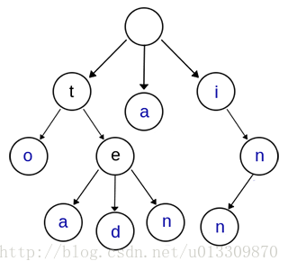

# 🤔👀树 - 前缀树(Trie Tree)

Trie，又称字典树、单词查找树或键树，是一种树形结构，是一种哈希树的变种。典型应用是用于统计，排序和保存大量的字符串（但不仅限于字符串），所以经常被搜索引擎系统用于文本词频统计。它的优点是：利用字符串的公共前缀来减少查询时间，最大限度地减少无谓的字符串比较，查询效率比哈希树高。


## 什么是前缀树

在计算机科学中，trie，又称前缀树或字典树，是一种有序树，用于保存关联数组，其中的键通常是字符串。与二叉查找树不同，键不是直接保存在节点中，而是由节点在树中的位置决定。一个节点的所有子孙都有相同的前缀，也就是这个节点对应的字符串，而根节点对应空字符串。一般情况下，不是所有的节点都有对应的值，只有叶子节点和部分内部节点所对应的键才有相关的值。

Trie 这个术语来自于 retrieval。根据词源学，trie 的发明者 Edward Fredkin 把它读作/ˈtriː/ “tree”。但是，其他作者把它读作/ˈtraɪ/ “try”。trie 中的键通常是字符串，但也可以是其它的结构。trie 的算法可以很容易地修改为处理其它结构的有序序列，比如一串数字或者形状的排列。比如，bitwise trie 中的键是一串位元，可以用于表示整数或者内存地址。trie 树常用于搜索提示。如当输入一个网址，可以自动搜索出可能的选择。当没有完全匹配的搜索结果，可以返回前缀最相似的可能。




上图是一棵Trie树，表示了关键字集合{“a”, “to”, “tea”, “ted”, “ten”, “i”, “in”, “inn”} 。从上图可以归纳出Trie树的基本性质：

- 根节点不包含字符，除根节点外的每一个子节点都包含一个字符。
- 从根节点到某一个节点，路径上经过的字符连接起来，为该节点对应的字符串。
- 每个节点的所有子节点包含的字符互不相同。
- 从第一字符开始有连续重复的字符只占用一个节点，比如上面的to，和ten，中重复的单词t只占用了一个节点。

## 前缀树的实现

> 重点在于节点数据结构，重要的插入和查找方法，以及递归和非递归两种形式。@pdai

### 节点数据结构定义

Node节点中使用map较为高效，用于映射到下一个节点：

```java

public class Trie {
 
  private class Node{

      public boolean isWord; // 是否是某个单词的结束
      
      public TreeMap<Character, Node> next; //到下一个节点的映射

      public Node(boolean isWord){
          this.isWord = isWord;
          //初始化字典树
          next = new TreeMap<>();
      }

      public Node(){
          this(false);
      }
  }
  
  //根节点
  private Node root;
  //Trie单词个数
  private int size;

  public Trie(){
      root = new Node();
      size = 0;
  }

  // 获得Trie中存储的单词数量
  public int getSize(){
      return size;
  }

}
```

### 插入方法

- **非递归方式**

向Trie中添加一个新的单词word: 将单词拆分成一个个字符c，然后从根节点开始往下添加

```java
public void add(String word){

    Node cur = root;
    //循环判断新的cur节点是否包含下一个字符到下一个节点的映射
    for(int i = 0 ; i < word.length() ; i ++){
        //将c当成一个节点插入Trie中
        char c = word.charAt(i);
        //判断cur.next是不是已经指向我们要找的c字符相应的节点
        if(cur.next.get(c) == null){
            //新建节点
            cur.next.put(c, new Node());
        }
        //否则，就直接走到该节点位置即可
        cur = cur.next.get(c);
    }
    //判断该单词并不表示任何一个单词的结尾
    if(!cur.isWord){
        //确定cur是新的单词
        cur.isWord = true;
        size ++;
    }
```

- **递归方式**

```java
/**
  * 向Trie中添加一个新的单词word(递归写法接口)
  *
  * @param word
  */
public void recursionAdd(String word) {
    Node cur = root;
    add(root, word, 0);
}

/**
  * 递归写法调用方法实现递归添加
  *
  * @param node 传入要进行添加的节点
  * @param word 传入要进行添加的单词
  */
public void add(Node node, String word, int index) {
    // 确定终止条件,这个终止条件在没加index这个参数时,很难确定
    // 此时一个单词已经遍历完成了,如果这个结束节点没有标记为单词,就标记为单词
    if (!node.isWord && index == word.length()) {
        node.isWord = true;
        size++;
    }

    if (word.length() > index) {
        char addLetter = word.charAt(index);
        // 判断trie的下个节点组中是否有查询的字符,如果没有,就添加
        if (node.next.get(addLetter) == null) {
            node.next.put(addLetter, new Node());
        }
        // 基于已经存在的字符进行下个字符的递归查询
        add(node.next.get(addLetter), word, index + 1);
    }
}
```

### 查询单词方法

- **非递归方式**

```java
/**
  * 查询单词word是否在Trie中(非递归写法)
  *
  * @param word
  * @return
  */
public boolean contains(String word) {
    Node cur = root;
    for (int i = 0; i < word.length(); i++) {
        char c = word.charAt(i);
        if (cur.next.get(c) == null) {
            return false;
        } else {
            cur = cur.next.get(c);
        }
    }
    return cur.isWord;
}
```

- **递归方式**

```java
/**
  * 查询单词word中是否在Trie中接口(递归写法)
  *
  * @param word
  * @return
  */
public boolean recursionContains(String word) {
    Node cur = root;
    return contains(root, word, 0);
}

/**
  * 查询word中是否在Trie中递归写法
  *
  * @param node
  * @param word
  * @param index
  * @return
  */
private boolean contains(Node node, String word, int index) {
    if (index == word.length()) {
        return node.isWord;
    }
    char c = word.charAt(index);
    if (node.next.get(c) == null) {
        return false;
    } else {
        return contains(node.next.get(c), word, index + 1);
    }
}
```

### 查询前缀方法

- **非递归方式**

```java
/**
  * 查询是否在Trie中有单词一prefix为前缀
  *
  * @param prefix
  * @return
  */
public boolean isPrefix(String prefix) {
    Node cur = root;
    for (int i = 0; i < prefix.length(); i++) {
        char c = prefix.charAt(i);
        if (cur.next.get(c) == null) {
            return false;
        }
        cur = cur.next.get(c);
    }
    return true;
}
```

- **递归方式**

```java
/**
  * 查询是否在Trie中有单词一prefix为前缀(递归调用)
  *
  * @param prefix
  * @return
  */
public boolean recursionIsPrefix(String prefix) {
    Node node = root;
    return recursionIsPrefix(root, prefix, 0);
}

/**
  * 查询是否在Trie中有单词一prefix为前缀(递归实现)
  *
  * @return
  */
public boolean recursionIsPrefix(Node root, String prefix, int index) {
    if (prefix.length() == index) {
        return true;
    }
    char c = prefix.charAt(index);
    if (root.next.get(c) == null) {
        return false;
    } else {
        return recursionIsPrefix(root.next.get(c), prefix, ++index);
    }
}
```


## 前缀树的拓展

> 再深入理解下前缀树。

### 前缀树的复杂度

设平均查询的query词长n， 白名单m条记录，平均长度k,


**简单单词查询**：一个query，需要遍历每一个白名单，调用query是否contains方法，contains方法遍历前词，找到头元素一致，再遍历判断尾序列，contains的复杂度是O(n)，整体复杂度是O(mn)


**前缀树查询**: 一个query，将这个query从头到尾遍历，每个元素在前缀树中判断，操作都是取下一个节点和判断是否是end，时间复杂度是O(1)，整体时间复杂度是O(n)

### 前缀树有哪些应用

这个比较简单，就简单列下：

- 前缀匹配
- 字符串检索， 比如 敏感词过滤，黑白名单等
- 词频统计
- 字符串排序

### 前缀树的压缩：基数树

在计算机科学中，基数树，或称压缩前缀树，是一种更节省空间的 Trie（前缀树）。对于基数树的每个节点，如果该节点是确定的子树的话，就和父节点合并。基数树可用来构建关联数组。 用于 IP 路由。 信息检索中用于文本文档的倒排索引。


基数树可看做是以二进制位串为关键字的 trie 树，是一种多叉树形结构，同时又类似多层索引表，每个中间节点包含指向多个子节点的指针数组，叶子节点包含指向实际的对象的指针(由于对象不具备树节点结构，因此将其父节点看做叶节点)。基数树也被设计成多道树，以提高磁盘交互性能。同时，基数树也是按照字典序来组织叶节点的，这种特点使之适合持久化改造，加上它的多道特点，灵活性较强，适合作为区块链的基础数据结构，构建持久性区块时较好地映射各类数据集合上。基数树支持插入、删除、查找操作。查找包括完全匹配、前缀匹配、前驱查找、后继查找。所有这些操作都是 O(k)复杂度，其中 k 是所有字符串中最大的长度。

### 双数组Trie树(DoubleArrayTrie)

双数组Trie树(DoubleArrayTrie)是一种空间复杂度低的Trie树，**应用于字符区间大的语言（如中文、日文等）分词领域**。


双数组Trie (Double-Array Trie)结构由日本人JUN-ICHI AOE于1989年提出的，是Trie结构的压缩形式，仅用两个线性数组来表示Trie树，该结构有效结合了数字搜索树(Digital Search Tree)检索时间高效的特点和链式表示的Trie空间结构紧凑的特点。双数组Trie的本质是一个确定有限状态自动机（DFA），每个节点代表自动机的一个状态，根据变量不同，进行状态转移，当到达结束状态或无法转移时，完成一次查询操作。在双数组所有键中包含的字符之间的联系都是通过简单的数学加法运算表示，不仅提高了检索速度，而且省去了链式结构中使用的大量指针，节省了存储空间。——《基于双数组Ｔｒｉｅ树算法的字典改进和实现》


