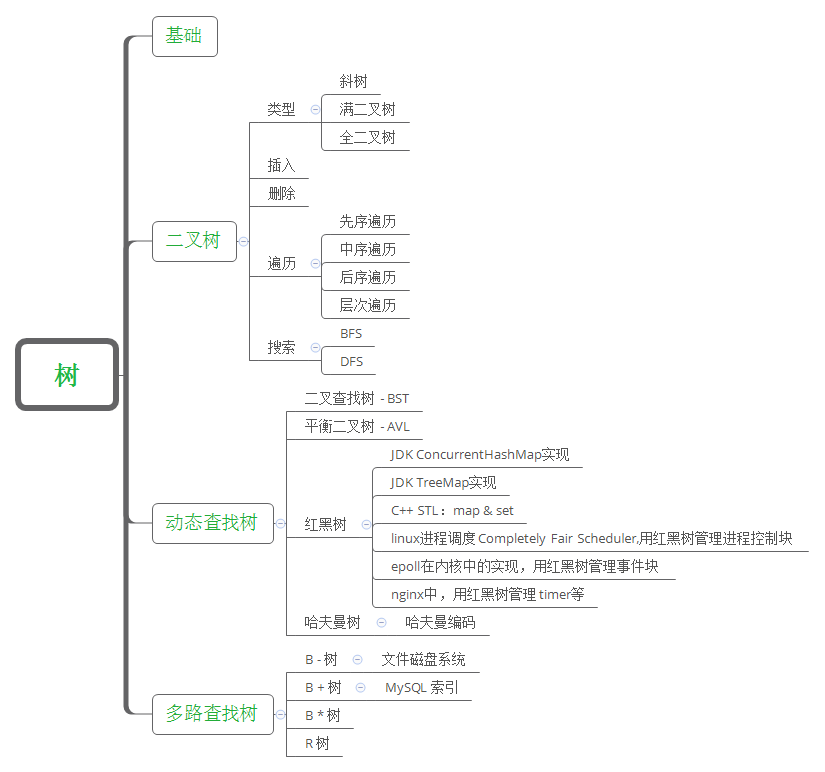
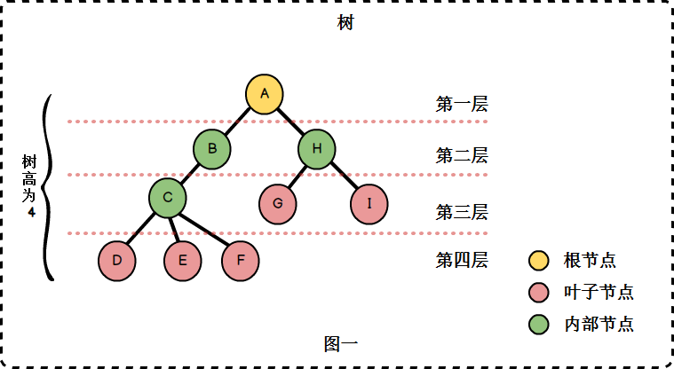
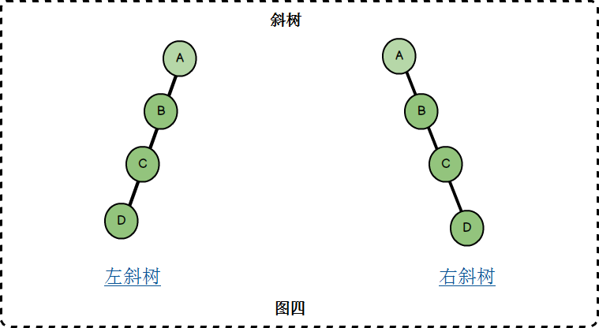
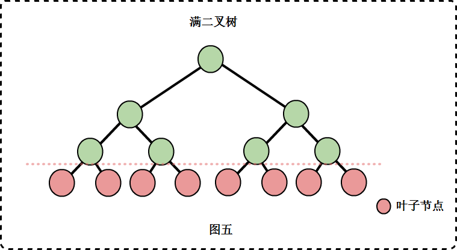
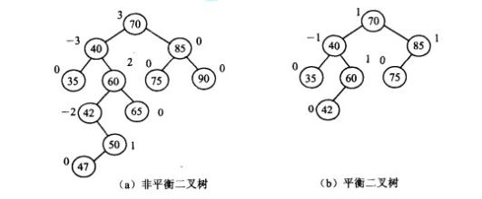
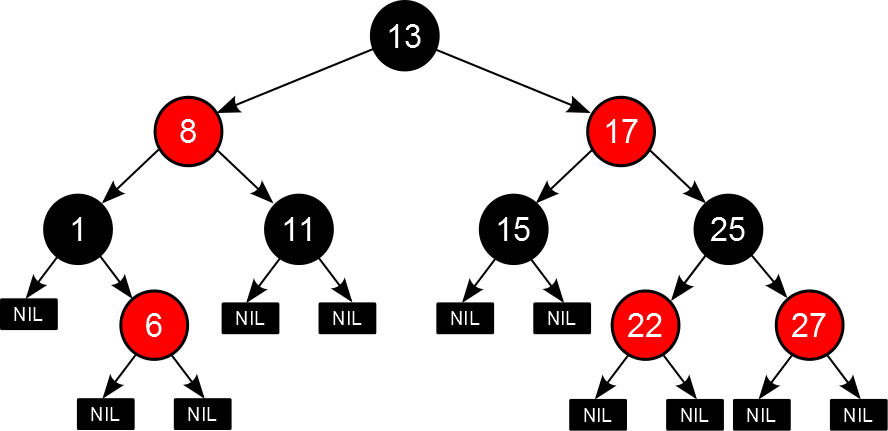
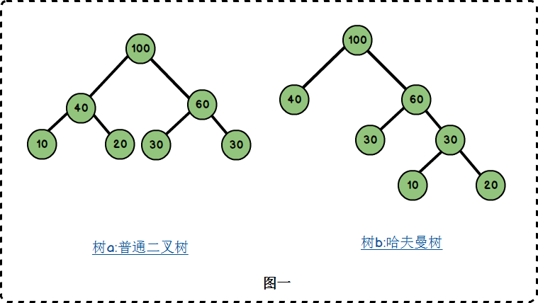
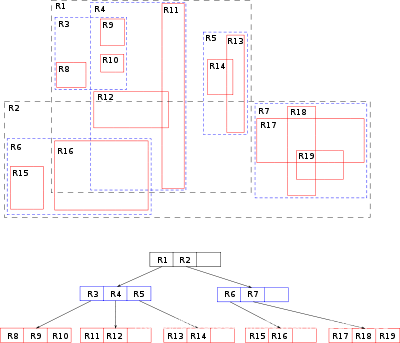

# 🤔👀树 - 基础和Overview

树的整体知识体系结构和几种常见树类型。

## 知识体系结构

## 树

树是一种数据结构，它是n(n>=0)个节点的有限集。n=0时称为空树。n>0时，有限集的元素构成一个具有层次感的数据结构。

区别于线性表一对一的元素关系，树中的节点是一对多的关系。树具有以下特点:

- n>0时，根节点是唯一的，不可能存在多个根节点。
- 每个节点有零个至多个子节点；除了根节点外，每个节点有且仅有一个父节点。根节点没有父节点。

### 树的相关概念

树有许多相关的术语与概念，在学习树的结构之前，我们要熟悉这些概念。

- `子树`: 除了根节点外，每个子节点都可以分为多个不相交的子树。(图二)
- `孩子与双亲`: 若一个结点有子树，那么该结点称为子树根的"双亲"，子树的根是该结点的"孩子"。在图一中，B、H是A的孩子，A是B、H的双亲。
- `兄弟`: 具有相同双亲的节点互为兄弟，例如B与H互为兄弟。
- `节点的度`: 一个节点拥有子树的数目。例如A的度为2，B的度为1，C的度为3.
- `叶子`: 没有子树，也即是度为0的节点。
- `分支节点`: 除了叶子节点之外的节点，也即是度不为0的节点。
- `内部节点`: 除了根节点之外的分支节点。
- `层次`: 根节点为第一层，其余节点的层次等于其双亲节点的层次加1.
- `树的高度`: 也称为树的深度，树中节点的最大层次。
- `有序树`: 树中节点各子树之间的次序是重要的，不可以随意交换位置。
- `无序树`: 树种节点各子树之间的次序是不重要的。可以随意交换位置。
- `森林`: 0或多棵互不相交的树的集合。例如图二中的两棵树为森林。

## 二叉树、完全二叉树、满二叉树

- 二叉树: 最多有两棵子树的树被称为二叉树

- 斜树: 所有节点都只有左子树的二叉树叫做左斜树，所有节点都只有右子树的二叉树叫做右斜树。(本质就是链表)

- 满二叉树: 二叉树中所有非叶子结点的度都是2，且叶子结点都在同一层次上

- 完全二叉树: 如果一个二叉树与满二叉树前m个节点的结构相同，这样的二叉树被称为完全二叉树

## 二叉查找树 - BST

二叉查找树(Binary Search Tree)是指一棵空树或者具有下列性质的二叉树:

- 若任意节点的左子树不空，则左子树上所有节点的值均小于它的根节点的值；
- 若任意节点的右子树不空，则右子树上所有节点的值均大于它的根节点的值；
- 任意节点的左、右子树也分别为二叉查找树；
- 没有键值相等的节点。

二叉查找树相比于其他数据结构的优势在于查找、插入的时间复杂度较低为 O ( log ⁡ n ) 。二叉查找树是基础性数据结构，用于构建更为抽象的数据结构，如集合、多重集、关联数组等。

.svg)

## 平衡二叉树 - AVL

含有相同节点的二叉查找树可以有不同的形态，而二叉查找树的平均查找长度与树的深度有关，所以需要找出一个查找平均长度最小的一棵，那就是平衡二叉树，具有以下性质:

- 要么是棵空树，要么其根节点左右子树的深度之差的绝对值不超过1；
- 其左右子树也都是平衡二叉树；
- 二叉树节点的平衡因子定义为该节点的左子树的深度减去右子树的深度。则平衡二叉树的所有节点的平衡因子只可能是-1,0,1。

## 红黑树

红黑树也是一种自平衡的二叉查找树。

- 每个结点要么是红的要么是黑的。(红或黑)
- 根结点是黑的。  (根黑)
- 每个叶结点(叶结点即指树尾端NIL指针或NULL结点)都是黑的。 (叶黑)
- 如果一个结点是红的，那么它的两个儿子都是黑的。 (红子黑)
- 对于任意结点而言，其到叶结点树尾端NIL指针的每条路径都包含相同数目的黑结点。(路径下黑相同)

用法最广:

- Java ConcurrentHashMap & TreeMap
- C++ STL: map & set
- linux进程调度Completely Fair Scheduler,用红黑树管理进程控制块
- epoll在内核中的实现，用红黑树管理事件块
- nginx中，用红黑树管理timer等

## 哈弗曼树

哈夫曼又称最优二叉树。是一种带权路径长度最短的二叉树，一般可以按下面步骤构建:

- 将所有左，右子树都为空的作为根节点。
- 在森林中选出两棵根节点的权值最小的树作为一棵新树的左，右子树，且置新树的附加根节点的权值为其左，右子树上根节点的权值之和。注意，左子树的权值应小于右子树的权值。
- 从森林中删除这两棵树，同时把新树加入到森林中。
- 重复2，3步骤，直到森林中只有一棵树为止，此树便是哈夫曼树。

## B树

B树(英语: B-tree)是一种自平衡的树，能够保持数据有序。这种数据结构能够让查找数据、顺序访问、插入数据及删除的动作，都在对数时间内完成。B树，概括来说是一种自平衡的m阶树，与自平衡二叉查找树不同，B树适用于读写相对大的数据块的存储系统，例如磁盘。

- 根结点至少有两个子女。
- 每个中间节点都包含k-1个元素和k个孩子，其中 m/2 <= k <= m
- 每一个叶子节点都包含k-1个元素，其中 m/2 <= k <= m
- 所有的叶子结点都位于同一层。
- 每个节点中的元素从小到大排列，节点当中k-1个元素正好是k个孩子包含的元素的值域分划。

B-Tree中的每个节点根据实际情况可以包含大量的关键字信息和分支，如下图所示为一个3阶的B-Tree:

## B+树

B+ 树是一种树数据结构，通常用于关系型数据库(如Mysql)和操作系统的文件系统中。B+ 树的特点是能够保持数据稳定有序，其插入与修改拥有较稳定的对数时间复杂度。B+ 树元素自底向上插入，这与二叉树恰好相反。

在B树基础上，为叶子结点增加链表指针(B树+叶子有序链表)，所有关键字都在叶子结点 中出现，非叶子结点作为叶子结点的索引；B+树总是到叶子结点才命中。

b+树的非叶子节点不保存数据，只保存子树的临界值(最大或者最小)，所以同样大小的节点，b+树相对于b树能够有更多的分支，使得这棵树更加矮胖，查询时做的IO操作次数也更少。

将上一节中的B-Tree优化，由于B+Tree的非叶子节点只存储键值信息，假设每个磁盘块能存储4个键值及指针信息，则变成B+Tree后其结构如下图所示:

## R树

R树是用来做空间数据存储的树状数据结构。例如给地理位置，矩形和多边形这类多维数据建立索引。

R树的核心思想是聚合距离相近的节点并在树结构的上一层将其表示为这些节点的最小外接矩形(MBR)，这个最小外接矩形就成为上一层的一个节点。因为所有节点都在它们的最小外接矩形中，所以跟某个矩形不相交的查询就一定跟这个矩形中的所有节点都不相交。叶子节点上的每个矩形都代表一个对象，节点都是对象的聚合，并且越往上层聚合的对象就越多。也可以把每一层看做是对数据集的近似，叶子节点层是最细粒度的近似，与数据集相似度100%，越往上层越粗糙。

## 总结

我们知道，实际应用当中，我们经常使用的是`查找`和`排序`操作，这在我们的各种管理系统、数据库系统、操作系统等当中，十分常用。

`数组`的下标寻址十分迅速，但计算机的内存是有限的，故数组的长度也是有限的，实际应用当中的数据往往十分庞大；而且无序数组的查找最坏情况需要遍历整个数组；后来人们提出了二分查找，二分查找要求数组的构造一定有序，二分法查找解决了普通数组查找复杂度过高的问题。任和一种数组无法解决的问题就是插入、删除操作比较复杂，因此，在一个增删查改比较频繁的数据结构中，数组不会被优先考虑

`普通链表`由于它的结构特点被证明根本不适合进行查找

`哈希表`是数组和链表的折中，同时它的设计依赖散列函数的设计，数组不能无限长、链表也不适合查找，所以也适合大规模的查找

`二叉查找树`因为可能退化成链表，同样不适合进行查找

`AVL树`是为了解决可能退化成链表问题，但是AVL树的旋转过程非常麻烦，因此插入和删除很慢，也就是构建AVL树比较麻烦

`红黑树`是平衡二叉树和AVL树的折中，因此是比较合适的。集合类中的Map、关联数组具有较高的查询效率，它们的底层实现就是红黑树。

`多路查找树` 是大规模数据存储中，实现索引查询这样一个实际背景下，树节点存储的元素数量是有限的(如果元素数量非常多的话，查找就退化成节点内部的线性查找了)，这样导致二叉查找树结构由于树的深度过大而造成磁盘I/O读写过于频繁，进而导致查询效率低下。

`B树`与自平衡二叉查找树不同，B树适用于读写相对大的数据块的存储系统，例如磁盘。它的应用是文件系统及部分非关系型数据库索引。

`B+树`在B树基础上，为叶子结点增加链表指针(B树+叶子有序链表)，所有关键字都在叶子结点 中出现，非叶子结点作为叶子结点的索引；B+树总是到叶子结点才命中。通常用于关系型数据库(如Mysql)和操作系统的文件系统中。

`B*树`是B+树的变体，在B+树的非根和非叶子结点再增加指向兄弟的指针, 在B+树基础上，为非叶子结点也增加链表指针，将结点的最低利用率从1/2提高到2/3。

`R树`是用来做空间数据存储的树状数据结构。例如给地理位置，矩形和多边形这类多维数据建立索引。

`Trie树`是自然语言处理中最常用的数据结构，很多字符串处理任务都会用到。Trie树本身是一种有限状态自动机，还有很多变体。什么模式匹配、正则表达式，都与这有关。

> 针对大量数据，如果在内存中作业优先考虑红黑树(map,set之类多为RB-tree实现)，如果在硬盘中作业优先考虑B系列树(B+, B, B*)

