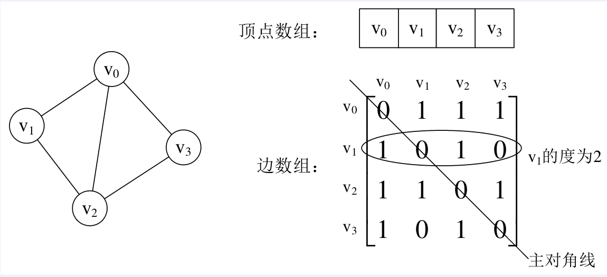
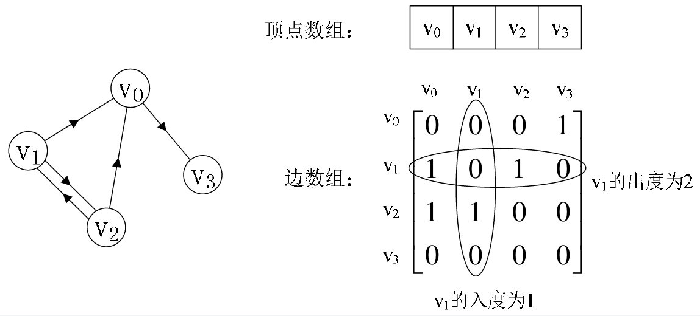
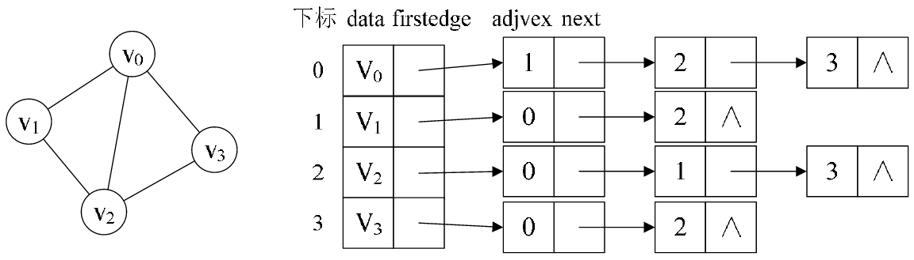
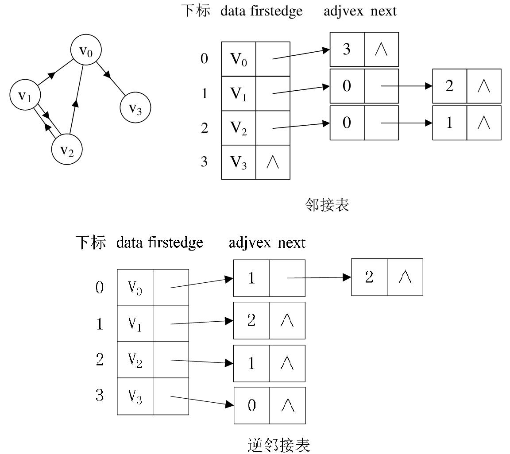
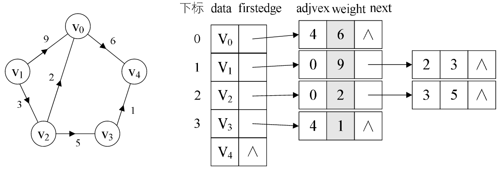

# 图 - 基础和Overview🤔👀

图(Graph)是由顶点和连接顶点的边构成的离散结构。在计算机科学中，图是最灵活的数据结构之一，很多问题都可以使用图模型进行建模求解。例如: 生态环境中不同物种的相互竞争、人与人之间的社交与关系网络、化学上用图区分结构不同但分子式相同的同分异构体、分析计算机网络的拓扑结构确定两台计算机是否可以通信、找到两个城市之间的最短路径等等。

## 图的基础

### 定义

图(Graph)是由顶点的有穷非空集合和顶点之间边的集合组成，通常表示为: G(V,E)，其中，G表示一个图，V是图G中顶点的集合，E是图G中边的集合。

和线性表，树的差异:

- 线性表中我们把数据元素叫元素，树中将数据元素叫结点，在图中数据元素，我们则称之为顶点(Vertex)。
- 线性表可以没有元素，称为空表；树中可以没有节点，称为空树；但是，在图中不允许没有顶点(有穷非空性)。
- 线性表中的各元素是线性关系，树中的各元素是层次关系，而图中各顶点的关系是用边来表示(边集可以为空)。

### 相关术语

- 顶点的度

顶点Vi的度(Degree)是指在图中与Vi相关联的边的条数。对于有向图来说，有入度(In-degree)和出度(Out-degree)之分，有向图顶点的度等于该顶点的入度和出度之和。

- 邻接

若无向图中的两个顶点V1和V2存在一条边(V1,V2)，则称顶点V1和V2邻接(Adjacent)；

若有向图中存在一条边<V3,V2>，则称顶点V3与顶点V2邻接，且是V3邻接到V2或V2邻接直V3；

- 路径

在无向图中，若从顶点Vi出发有一组边可到达顶点Vj，则称顶点Vi到顶点Vj的顶点序列为从顶点Vi到顶点Vj的路径(Path)。

- 连通

若从Vi到Vj有路径可通，则称顶点Vi和顶点Vj是连通(Connected)的。

- 权(Weight)

有些图的边或弧具有与它相关的数字，这种与图的边或弧相关的数叫做权(Weight)。

### 类型

#### 无向图

如果图中任意两个顶点之间的边都是无向边(简而言之就是没有方向的边)，则称该图为无向图(Undirected graphs)。

无向图中的边使用小括号“()”表示; 比如 (V1,V2);

#### 有向图

如果图中任意两个顶点之间的边都是有向边(简而言之就是有方向的边)，则称该图为有向图(Directed graphs)。

有向图中的边使用尖括号“<>”表示; 比如/<V1,V2>

#### 完全图

- `无向完全图`: 在无向图中，如果任意两个顶点之间都存在边，则称该图为无向完全图。(含有n个顶点的无向完全图有(n×(n-1))/2条边)
- `有向完全图: 在有向图中，如果任意两个顶点之间都存在方向互为相反的两条弧，则称该图为有向完全图。(含有n个顶点的有向完全图有n×(n-1)条边)

## 图的存储结构

### 邻接矩阵表示法

图的邻接矩阵(Adjacency Matrix)存储方式是用两个数组来表示图。一个一维数组存储图中顶点信息，一个二维数组(称为邻接矩阵)存储图中的边或弧的信息。

- 无向图:



设置两个数组，顶点数组为vertex[4]={v0,v1,v2,v3}，边数组arc[4][4]为上图右边这样的一个矩阵。对于矩阵的主对角线的值，即arc[0][0]、arc[1][1]、arc[2][2]、arc[3][3]，全为0是因为不存在顶点的边。

- 有向图:

有向图样例，如下图所示的左边。顶点数组为vertex[4]={v0,v1,v2,v3}，弧数组arc[4][4]为下图右边这样的一个矩阵。主对角线上数值依然为0。但因为是有向图，所以此矩阵并不对称，比如由v1到v0有弧，得到arc[1][0]=1，而v到v没有弧，因此arc[0][1]=0。



不足: 由于存在n个顶点的图需要n*n个数组元素进行存储，当图为稀疏图时，使用邻接矩阵存储方法将会出现大量0元素，这会造成极大的空间浪费。这时，可以考虑使用邻接表表示法来存储图中的数据

### 邻接表表示法

首先，回忆我们在线性表时谈到，顺序存储结构就存在预先分配内存可能造成存储空间浪费的问题，于是引出了链式存储的结构。同样的，我们也可以考虑对边或弧使用链式存储的方式来避免空间浪费的问题。

邻接表由表头节点和表节点两部分组成，图中每个顶点均对应一个存储在数组中的表头节点。如果这个表头节点所对应的顶点存在邻接节点，则把邻接节点依次存放于表头节点所指向的单向链表中。

- `无向图`

下图所示的就是一个无向图的邻接表结构。




从上图中我们知道，顶点表的各个结点由data和firstedge两个域表示，data是数据域，存储顶点的信息，firstedge是指针域，指向边表的第一个结点，即此顶点的第一个邻接点。边表结点由adjvex和next两个域组成。adjvex是邻接点域，存储某顶点的邻接点在顶点表中的下标，next则存储指向边表中下一个结点的指针。例如: v1顶点与v0、v2互为邻接点，则在v1的边表中，adjvex分别为v0的0和v2的2。

PS: 对于无向图来说，使用邻接表进行存储也会出现数据冗余的现象。例如上图中，顶点V0所指向的链表中存在一个指向顶点V3的同事，顶点V3所指向的链表中也会存在一个指向V0的顶点。

- `有向图`

若是有向图，邻接表结构是类似的，但要注意的是有向图由于有方向的。因此，有向图的邻接表分为出边表和入边表(又称逆邻接表)，出边表的表节点存放的是从表头节点出发的有向边所指的尾节点；入边表的表节点存放的则是指向表头节点的某个顶点，如下图所示。



- `带权图`

对于带权值的网图，可以在边表结点定义中再增加一个weight的数据域，存储权值信息即可，如下图所示。




## 图相关题目

### 二分图

如果可以用两种颜色对图中的节点进行着色，并且保证相邻的节点颜色不同，那么这个图就是二分图。

**判断是否为二分图**

[785. Is Graph Bipartite? (Medium)  (opens new window)](https://leetcode.com/problems/is-graph-bipartite/description/)

```html
Input: [[1,3], [0,2], [1,3], [0,2]]
Output: true
Explanation:
The graph looks like this:
0----1
|    |
|    |
3----2
We can divide the vertices into two groups: {0, 2} and {1, 3}.
```


```html
Example 2:
Input: [[1,2,3], [0,2], [0,1,3], [0,2]]
Output: false
Explanation:
The graph looks like this:
0----1
| \  |
|  \ |
3----2
We cannot find a way to divide the set of nodes into two independent subsets.
```

```java
public boolean isBipartite(int[][] graph) {
    int[] colors = new int[graph.length];
    Arrays.fill(colors, -1);
    for (int i = 0; i < graph.length; i++) {  // 处理图不是连通的情况
        if (colors[i] == -1 && !isBipartite(i, 0, colors, graph)) {
            return false;
        }
    }
    return true;
}

private boolean isBipartite(int curNode, int curColor, int[] colors, int[][] graph) {
    if (colors[curNode] != -1) {
        return colors[curNode] == curColor;
    }
    colors[curNode] = curColor;
    for (int nextNode : graph[curNode]) {
        if (!isBipartite(nextNode, 1 - curColor, colors, graph)) {
            return false;
        }
    }
    return true;
}
```

### 拓扑排序

常用于在具有先序关系的任务规划中。

**课程安排的合法性**

[207. Course Schedule (Medium)  (opens new window)](https://leetcode.com/problems/course-schedule/description/)

```html
2, [[1,0]]
return true
```


```html
2, [[1,0],[0,1]]
return false
```


题目描述: 一个课程可能会先修课程，判断给定的先修课程规定是否合法。

本题不需要使用拓扑排序，只需要检测有向图是否存在环即可。

```java
public boolean canFinish(int numCourses, int[][] prerequisites) {
    List<Integer>[] graphic = new List[numCourses];
    for (int i = 0; i < numCourses; i++) {
        graphic[i] = new ArrayList<>();
    }
    for (int[] pre : prerequisites) {
        graphic[pre[0]].add(pre[1]);
    }
    boolean[] globalMarked = new boolean[numCourses];
    boolean[] localMarked = new boolean[numCourses];
    for (int i = 0; i < numCourses; i++) {
        if (hasCycle(globalMarked, localMarked, graphic, i)) {
            return false;
        }
    }
    return true;
}

private boolean hasCycle(boolean[] globalMarked, boolean[] localMarked,
                         List<Integer>[] graphic, int curNode) {

    if (localMarked[curNode]) {
        return true;
    }
    if (globalMarked[curNode]) {
        return false;
    }
    globalMarked[curNode] = true;
    localMarked[curNode] = true;
    for (int nextNode : graphic[curNode]) {
        if (hasCycle(globalMarked, localMarked, graphic, nextNode)) {
            return true;
        }
    }
    localMarked[curNode] = false;
    return false;
}
```

**课程安排的顺序**

[210. Course Schedule II (Medium)  (opens new window)](https://leetcode.com/problems/course-schedule-ii/description/)

```html
4, [[1,0],[2,0],[3,1],[3,2]]
There are a total of 4 courses to take. To take course 3 you should have finished both courses 1 and 2. Both courses 1 and 2 should be taken after you finished course 0. So one correct course order is [0,1,2,3]. Another correct ordering is[0,2,1,3].
```


使用 DFS 来实现拓扑排序，使用一个栈存储后序遍历结果，这个栈的逆序结果就是拓扑排序结果。

证明: 对于任何先序关系: v->w，后序遍历结果可以保证 w 先进入栈中，因此栈的逆序结果中 v 会在 w 之前。

```java
public int[] findOrder(int numCourses, int[][] prerequisites) {
    List<Integer>[] graphic = new List[numCourses];
    for (int i = 0; i < numCourses; i++) {
        graphic[i] = new ArrayList<>();
    }
    for (int[] pre : prerequisites) {
        graphic[pre[0]].add(pre[1]);
    }
    Stack<Integer> postOrder = new Stack<>();
    boolean[] globalMarked = new boolean[numCourses];
    boolean[] localMarked = new boolean[numCourses];
    for (int i = 0; i < numCourses; i++) {
        if (hasCycle(globalMarked, localMarked, graphic, i, postOrder)) {
            return new int[0];
        }
    }
    int[] orders = new int[numCourses];
    for (int i = numCourses - 1; i >= 0; i--) {
        orders[i] = postOrder.pop();
    }
    return orders;
}

private boolean hasCycle(boolean[] globalMarked, boolean[] localMarked, List<Integer>[] graphic,
                         int curNode, Stack<Integer> postOrder) {

    if (localMarked[curNode]) {
        return true;
    }
    if (globalMarked[curNode]) {
        return false;
    }
    globalMarked[curNode] = true;
    localMarked[curNode] = true;
    for (int nextNode : graphic[curNode]) {
        if (hasCycle(globalMarked, localMarked, graphic, nextNode, postOrder)) {
            return true;
        }
    }
    localMarked[curNode] = false;
    postOrder.push(curNode);
    return false;
}
```

### 并查集

并查集可以动态地连通两个点，并且可以非常快速地判断两个点是否连通。

**冗余连接**

[684. Redundant Connection (Medium)  (opens new window)](https://leetcode.com/problems/redundant-connection/description/)

```html
Input: [[1,2], [1,3], [2,3]]
Output: [2,3]
Explanation: The given undirected graph will be like this:
  1
 / \
2 - 3
```

题目描述: 有一系列的边连成的图，找出一条边，移除它之后该图能够成为一棵树。

```java
public int[] findRedundantConnection(int[][] edges) {
    int N = edges.length;
    UF uf = new UF(N);
    for (int[] e : edges) {
        int u = e[0], v = e[1];
        if (uf.connect(u, v)) {
            return e;
        }
        uf.union(u, v);
    }
    return new int[]{-1, -1};
}

private class UF {

    private int[] id;

    UF(int N) {
        id = new int[N + 1];
        for (int i = 0; i < id.length; i++) {
            id[i] = i;
        }
    }

    void union(int u, int v) {
        int uID = find(u);
        int vID = find(v);
        if (uID == vID) {
            return;
        }
        for (int i = 0; i < id.length; i++) {
            if (id[i] == uID) {
                id[i] = vID;
            }
        }
    }

    int find(int p) {
        return id[p];
    }

    boolean connect(int u, int v) {
        return find(u) == find(v);
    }
}
```

