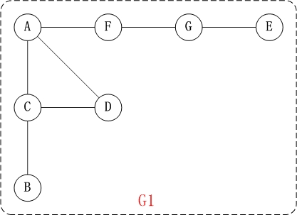
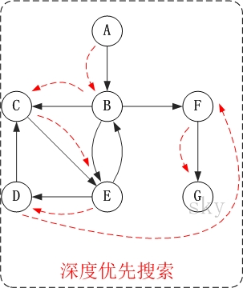
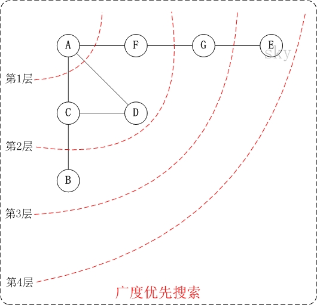

# 🤔👀图 - 遍历(BFS & DFS)

图的深度优先搜索(Depth First Search)，和树的先序遍历比较类似; 广度优先搜索算法(Breadth First Search)，又称为"宽度优先搜索"或"横向优先搜索"。 @pdai


## 深度优先搜索

### 深度优先搜索介绍

它的思想: 假设初始状态是图中所有顶点均未被访问，则从某个顶点v出发，首先访问该顶点，然后依次从它的各个未被访问的邻接点出发深度优先搜索遍历图，直至图中所有和v有路径相通的顶点都被访问到。 若此时尚有其他顶点未被访问到，则另选一个未被访问的顶点作起始点，重复上述过程，直至图中所有顶点都被访问到为止。

显然，深度优先搜索是一个递归的过程。

### 深度优先搜索图解

#### 无向图的深度优先搜索

下面以"无向图"为例，来对深度优先搜索进行演示。




对上面的图G1进行深度优先遍历，从顶点A开始。


`第1步`: 访问A。

`第2步`: 访问(A的邻接点)C。 在第1步访问A之后，接下来应该访问的是A的邻接点，即"C,D,F"中的一个。但在本文的实现中，顶点ABCDEFG是按照顺序存储，C在"D和F"的前面，因此，先访问C。

`第3步`: 访问(C的邻接点)B。 在第2步访问C之后，接下来应该访问C的邻接点，即"B和D"中一个(A已经被访问过，就不算在内)。而由于B在D之前，先访问B。

`第4步`: 访问(C的邻接点)D。 在第3步访问了C的邻接点B之后，B没有未被访问的邻接点；因此，返回到访问C的另一个邻接点D。

`第5步`: 访问(A的邻接点)F。 前面已经访问了A，并且访问完了"A的邻接点B的所有邻接点(包括递归的邻接点在内)"；因此，此时返回到访问A的另一个邻接点F。

`第6步`: 访问(F的邻接点)G。

`第7步`: 访问(G的邻接点)E。

因此访问顺序是: A -> C -> B -> D -> F -> G -> E


### 有向图的深度优先搜索

下面以"有向图"为例，来对深度优先搜索进行演示。


对上面的图G2进行深度优先遍历，从顶点A开始。




`第1步`: 访问A。

`第2步`: 访问B。 在访问了A之后，接下来应该访问的是A的出边的另一个顶点，即顶点B。

`第3步`: 访问C。 在访问了B之后，接下来应该访问的是B的出边的另一个顶点，即顶点C,E,F。在本文实现的图中，顶点ABCDEFG按照顺序存储，因此先访问C。

`第4步`: 访问E。 接下来访问C的出边的另一个顶点，即顶点E。

`第5步`: 访问D。 接下来访问E的出边的另一个顶点，即顶点B,D。顶点B已经被访问过，因此访问顶点D。

`第6步`: 访问F。 接下应该回溯"访问A的出边的另一个顶点F"。

`第7步`: 访问G。

因此访问顺序是: A -> B -> C -> E -> D -> F -> G


## 广度优先搜索

### 广度优先搜索介绍

广度优先搜索算法(Breadth First Search)，又称为"宽度优先搜索"或"横向优先搜索"，简称BFS。

它的思想是: 从图中某顶点v出发，在访问了v之后依次访问v的各个未曾访问过的邻接点，然后分别从这些邻接点出发依次访问它们的邻接点，并使得“先被访问的顶点的邻接点先于后被访问的顶点的邻接点被访问，直至图中所有已被访问的顶点的邻接点都被访问到。如果此时图中尚有顶点未被访问，则需要另选一个未曾被访问过的顶点作为新的起始点，重复上述过程，直至图中所有顶点都被访问到为止。

换句话说，广度优先搜索遍历图的过程是以v为起点，由近至远，依次访问和v有路径相通且路径长度为1,2...的顶点。

### 广度优先搜索图解

#### 无向图的广度优先搜索

下面以"无向图"为例，来对广度优先搜索进行演示。还是以上面的图G1为例进行说明。




`第1步`: 访问A。

`第2步`: 依次访问C,D,F。 在访问了A之后，接下来访问A的邻接点。前面已经说过，在本文实现中，顶点ABCDEFG按照顺序存储的，C在"D和F"的前面，因此，先访问C。再访问完C之后，再依次访问D,F。

`第3步`: 依次访问B,G。 在第2步访问完C,D,F之后，再依次访问它们的邻接点。首先访问C的邻接点B，再访问F的邻接点G。

`第4步`: 访问E。 在第3步访问完B,G之后，再依次访问它们的邻接点。只有G有邻接点E，因此访问G的邻接点E。

因此访问顺序是: A -> C -> D -> F -> B -> G -> E

#### 有向图的广度优先搜索

下面以"有向图"为例，来对广度优先搜索进行演示。还是以上面的图G2为例进行说明。

.jpg)


`第1步`: 访问A。

`第2步`: 访问B。

`第3步`: 依次访问C,E,F。 在访问了B之后，接下来访问B的出边的另一个顶点，即C,E,F。前面已经说过，在本文实现中，顶点ABCDEFG按照顺序存储的，因此会先访问C，再依次访问E,F。

`第4步`: 依次访问D,G。 在访问完C,E,F之后，再依次访问它们的出边的另一个顶点。还是按照C,E,F的顺序访问，C的已经全部访问过了，那么就只剩下E,F；先访问E的邻接点D，再访问F的邻接点G。

因此访问顺序是: A -> B -> C -> E -> F -> D -> G

## 相关实现

### 邻接矩阵实现无向图

```java
import java.io.IOException;
import java.util.Scanner;

public class MatrixUDG {

    private char[] mVexs;       // 顶点集合
    private int[][] mMatrix;    // 邻接矩阵

    /* 
     * 创建图(自己输入数据)
     */
    public MatrixUDG() {

        // 输入"顶点数"和"边数"
        System.out.printf("input vertex number: ");
        int vlen = readInt();
        System.out.printf("input edge number: ");
        int elen = readInt();
        if ( vlen < 1 || elen < 1 || (elen > (vlen*(vlen - 1)))) {
            System.out.printf("input error: invalid parameters!\n");
            return ;
        }
        
        // 初始化"顶点"
        mVexs = new char[vlen];
        for (int i = 0; i < mVexs.length; i++) {
            System.out.printf("vertex(%d): ", i);
            mVexs[i] = readChar();
        }

        // 初始化"边"
        mMatrix = new int[vlen][vlen];
        for (int i = 0; i < elen; i++) {
            // 读取边的起始顶点和结束顶点
            System.out.printf("edge(%d):", i);
            char c1 = readChar();
            char c2 = readChar();
            int p1 = getPosition(c1);
            int p2 = getPosition(c2);

            if (p1==-1 || p2==-1) {
                System.out.printf("input error: invalid edge!\n");
                return ;
            }

            mMatrix[p1][p2] = 1;
            mMatrix[p2][p1] = 1;
        }
    }

    /*
     * 创建图(用已提供的矩阵)
     *
     * 参数说明：
     *     vexs  -- 顶点数组
     *     edges -- 边数组
     */
    public MatrixUDG(char[] vexs, char[][] edges) {
        
        // 初始化"顶点数"和"边数"
        int vlen = vexs.length;
        int elen = edges.length;

        // 初始化"顶点"
        mVexs = new char[vlen];
        for (int i = 0; i < mVexs.length; i++)
            mVexs[i] = vexs[i];

        // 初始化"边"
        mMatrix = new int[vlen][vlen];
        for (int i = 0; i < elen; i++) {
            // 读取边的起始顶点和结束顶点
            int p1 = getPosition(edges[i][0]);
            int p2 = getPosition(edges[i][1]);

            mMatrix[p1][p2] = 1;
            mMatrix[p2][p1] = 1;
        }
    }

    /*
     * 返回ch位置
     */
    private int getPosition(char ch) {
        for(int i=0; i<mVexs.length; i++)
            if(mVexs[i]==ch)
                return i;
        return -1;
    }

    /*
     * 读取一个输入字符
     */
    private char readChar() {
        char ch='0';

        do {
            try {
                ch = (char)System.in.read();
            } catch (IOException e) {
                e.printStackTrace();
            }
        } while(!((ch>='a'&&ch<='z') || (ch>='A'&&ch<='Z')));

        return ch;
    }

    /*
     * 读取一个输入字符
     */
    private int readInt() {
        Scanner scanner = new Scanner(System.in);
        return scanner.nextInt();
    }

    /*
     * 返回顶点v的第一个邻接顶点的索引，失败则返回-1
     */
    private int firstVertex(int v) {

        if (v<0 || v>(mVexs.length-1))
            return -1;

        for (int i = 0; i < mVexs.length; i++)
            if (mMatrix[v][i] == 1)
                return i;

        return -1;
    }

    /*
     * 返回顶点v相对于w的下一个邻接顶点的索引，失败则返回-1
     */
    private int nextVertex(int v, int w) {

        if (v<0 || v>(mVexs.length-1) || w<0 || w>(mVexs.length-1))
            return -1;

        for (int i = w + 1; i < mVexs.length; i++)
            if (mMatrix[v][i] == 1)
                return i;

        return -1;
    }

    /*
     * 深度优先搜索遍历图的递归实现
     */
    private void DFS(int i, boolean[] visited) {

        visited[i] = true;
        System.out.printf("%c ", mVexs[i]);
        // 遍历该顶点的所有邻接顶点。若是没有访问过，那么继续往下走
        for (int w = firstVertex(i); w >= 0; w = nextVertex(i, w)) {
            if (!visited[w])
                DFS(w, visited);
        }
    }

    /*
     * 深度优先搜索遍历图
     */
    public void DFS() {
        boolean[] visited = new boolean[mVexs.length];       // 顶点访问标记

        // 初始化所有顶点都没有被访问
        for (int i = 0; i < mVexs.length; i++)
            visited[i] = false;

        System.out.printf("DFS: ");
        for (int i = 0; i < mVexs.length; i++) {
            if (!visited[i])
                DFS(i, visited);
        }
        System.out.printf("\n");
    }

    /*
     * 广度优先搜索（类似于树的层次遍历）
     */
    public void BFS() {
        int head = 0;
        int rear = 0;
        int[] queue = new int[mVexs.length];            // 辅组队列
        boolean[] visited = new boolean[mVexs.length];  // 顶点访问标记

        for (int i = 0; i < mVexs.length; i++)
            visited[i] = false;

        System.out.printf("BFS: ");
        for (int i = 0; i < mVexs.length; i++) {
            if (!visited[i]) {
                visited[i] = true;
                System.out.printf("%c ", mVexs[i]);
                queue[rear++] = i;  // 入队列
            }

            while (head != rear) {
                int j = queue[head++];  // 出队列
                for (int k = firstVertex(j); k >= 0; k = nextVertex(j, k)) { //k是为访问的邻接顶点
                    if (!visited[k]) {
                        visited[k] = true;
                        System.out.printf("%c ", mVexs[k]);
                        queue[rear++] = k;
                    }
                }
            }
        }
        System.out.printf("\n");
    }

    /*
     * 打印矩阵队列图
     */
    public void print() {
        System.out.printf("Martix Graph:\n");
        for (int i = 0; i < mVexs.length; i++) {
            for (int j = 0; j < mVexs.length; j++)
                System.out.printf("%d ", mMatrix[i][j]);
            System.out.printf("\n");
        }
    }

    public static void main(String[] args) {
        char[] vexs = {'A', 'B', 'C', 'D', 'E', 'F', 'G'};
        char[][] edges = new char[][]{
            {'A', 'C'}, 
            {'A', 'D'}, 
            {'A', 'F'}, 
            {'B', 'C'}, 
            {'C', 'D'}, 
            {'E', 'G'}, 
            {'F', 'G'}};
        MatrixUDG pG;

        // 自定义"图"(输入矩阵队列)
        //pG = new MatrixUDG();
        // 采用已有的"图"
        pG = new MatrixUDG(vexs, edges);

        pG.print();   // 打印图
        pG.DFS();     // 深度优先遍历
        pG.BFS();     // 广度优先遍历
    }
}
```

### 邻接表实现的无向图

```java
import java.io.IOException;
import java.util.Scanner;

public class ListUDG {
    // 邻接表中表对应的链表的顶点
    private class ENode {
        int ivex;       // 该边所指向的顶点的位置
        ENode nextEdge; // 指向下一条弧的指针
    }

    // 邻接表中表的顶点
    private class VNode {
        char data;          // 顶点信息
        ENode firstEdge;    // 指向第一条依附该顶点的弧
    };

    private VNode[] mVexs;  // 顶点数组


    /* 
     * 创建图(自己输入数据)
     */
    public ListUDG() {

        // 输入"顶点数"和"边数"
        System.out.printf("input vertex number: ");
        int vlen = readInt();
        System.out.printf("input edge number: ");
        int elen = readInt();
        if ( vlen < 1 || elen < 1 || (elen > (vlen*(vlen - 1)))) {
            System.out.printf("input error: invalid parameters!\n");
            return ;
        }
        
        // 初始化"顶点"
        mVexs = new VNode[vlen];
        for (int i = 0; i < mVexs.length; i++) {
            System.out.printf("vertex(%d): ", i);
            mVexs[i] = new VNode();
            mVexs[i].data = readChar();
            mVexs[i].firstEdge = null;
        }

        // 初始化"边"
        //mMatrix = new int[vlen][vlen];
        for (int i = 0; i < elen; i++) {
            // 读取边的起始顶点和结束顶点
            System.out.printf("edge(%d):", i);
            char c1 = readChar();
            char c2 = readChar();
            int p1 = getPosition(c1);
            int p2 = getPosition(c2);
            // 初始化node1
            ENode node1 = new ENode();
            node1.ivex = p2;
            // 将node1链接到"p1所在链表的末尾"
            if(mVexs[p1].firstEdge == null)
              mVexs[p1].firstEdge = node1;
            else
                linkLast(mVexs[p1].firstEdge, node1);
            // 初始化node2
            ENode node2 = new ENode();
            node2.ivex = p1;
            // 将node2链接到"p2所在链表的末尾"
            if(mVexs[p2].firstEdge == null)
              mVexs[p2].firstEdge = node2;
            else
                linkLast(mVexs[p2].firstEdge, node2);
        }
    }

    /*
     * 创建图(用已提供的矩阵)
     *
     * 参数说明：
     *     vexs  -- 顶点数组
     *     edges -- 边数组
     */
    public ListUDG(char[] vexs, char[][] edges) {
        
        // 初始化"顶点数"和"边数"
        int vlen = vexs.length;
        int elen = edges.length;

        // 初始化"顶点"
        mVexs = new VNode[vlen];
        for (int i = 0; i < mVexs.length; i++) {
            mVexs[i] = new VNode();
            mVexs[i].data = vexs[i];
            mVexs[i].firstEdge = null;
        }

        // 初始化"边"
        for (int i = 0; i < elen; i++) {
            // 读取边的起始顶点和结束顶点
            char c1 = edges[i][0];
            char c2 = edges[i][1];
            // 读取边的起始顶点和结束顶点
            int p1 = getPosition(edges[i][0]);
            int p2 = getPosition(edges[i][1]);

            // 初始化node1
            ENode node1 = new ENode();
            node1.ivex = p2;
            // 将node1链接到"p1所在链表的末尾"
            if(mVexs[p1].firstEdge == null)
              mVexs[p1].firstEdge = node1;
            else
                linkLast(mVexs[p1].firstEdge, node1);
            // 初始化node2
            ENode node2 = new ENode();
            node2.ivex = p1;
            // 将node2链接到"p2所在链表的末尾"
            if(mVexs[p2].firstEdge == null)
              mVexs[p2].firstEdge = node2;
            else
                linkLast(mVexs[p2].firstEdge, node2);
        }
    }

    /*
     * 将node节点链接到list的最后
     */
    private void linkLast(ENode list, ENode node) {
        ENode p = list;

        while(p.nextEdge!=null)
            p = p.nextEdge;
        p.nextEdge = node;
    }

    /*
     * 返回ch位置
     */
    private int getPosition(char ch) {
        for(int i=0; i<mVexs.length; i++)
            if(mVexs[i].data==ch)
                return i;
        return -1;
    }

    /*
     * 读取一个输入字符
     */
    private char readChar() {
        char ch='0';

        do {
            try {
                ch = (char)System.in.read();
            } catch (IOException e) {
                e.printStackTrace();
            }
        } while(!((ch>='a'&&ch<='z') || (ch>='A'&&ch<='Z')));

        return ch;
    }

    /*
     * 读取一个输入字符
     */
    private int readInt() {
        Scanner scanner = new Scanner(System.in);
        return scanner.nextInt();
    }

    /*
     * 深度优先搜索遍历图的递归实现
     */
    private void DFS(int i, boolean[] visited) {
        ENode node;

        visited[i] = true;
        System.out.printf("%c ", mVexs[i].data);
        node = mVexs[i].firstEdge;
        while (node != null) {
            if (!visited[node.ivex])
                DFS(node.ivex, visited);
            node = node.nextEdge;
        }
    }

    /*
     * 深度优先搜索遍历图
     */
    public void DFS() {
        boolean[] visited = new boolean[mVexs.length];       // 顶点访问标记

        // 初始化所有顶点都没有被访问
        for (int i = 0; i < mVexs.length; i++)
            visited[i] = false;

        System.out.printf("DFS: ");
        for (int i = 0; i < mVexs.length; i++) {
            if (!visited[i])
                DFS(i, visited);
        }
        System.out.printf("\n");
    }

    /*
     * 广度优先搜索（类似于树的层次遍历）
     */
    public void BFS() {
        int head = 0;
        int rear = 0;
        int[] queue = new int[mVexs.length];            // 辅组队列
        boolean[] visited = new boolean[mVexs.length];  // 顶点访问标记

        for (int i = 0; i < mVexs.length; i++)
            visited[i] = false;

        System.out.printf("BFS: ");
        for (int i = 0; i < mVexs.length; i++) {
            if (!visited[i]) {
                visited[i] = true;
                System.out.printf("%c ", mVexs[i].data);
                queue[rear++] = i;  // 入队列
            }

            while (head != rear) {
                int j = queue[head++];  // 出队列
                ENode node = mVexs[j].firstEdge;
                while (node != null) {
                    int k = node.ivex;
                    if (!visited[k])
                    {
                        visited[k] = true;
                        System.out.printf("%c ", mVexs[k].data);
                        queue[rear++] = k;
                    }
                    node = node.nextEdge;
                }
            }
        }
        System.out.printf("\n");
    }

    /*
     * 打印矩阵队列图
     */
    public void print() {
        System.out.printf("List Graph:\n");
        for (int i = 0; i < mVexs.length; i++) {
            System.out.printf("%d(%c): ", i, mVexs[i].data);
            ENode node = mVexs[i].firstEdge;
            while (node != null) {
                System.out.printf("%d(%c) ", node.ivex, mVexs[node.ivex].data);
                node = node.nextEdge;
            }
            System.out.printf("\n");
        }
    }

    public static void main(String[] args) {
        char[] vexs = {'A', 'B', 'C', 'D', 'E', 'F', 'G'};
        char[][] edges = new char[][]{
            {'A', 'C'}, 
            {'A', 'D'}, 
            {'A', 'F'}, 
            {'B', 'C'}, 
            {'C', 'D'}, 
            {'E', 'G'}, 
            {'F', 'G'}};
        ListUDG pG;

        // 自定义"图"(输入矩阵队列)
        //pG = new ListUDG();
        // 采用已有的"图"
        pG = new ListUDG(vexs, edges);

        pG.print();   // 打印图
        pG.DFS();     // 深度优先遍历
        pG.BFS();     // 广度优先遍历
    }
}
```

### 邻接矩阵实现的有向图

```java
import java.io.IOException;
import java.util.Scanner;

public class MatrixDG {

    private char[] mVexs;       // 顶点集合
    private int[][] mMatrix;    // 邻接矩阵

    /* 
     * 创建图(自己输入数据)
     */
    public MatrixDG() {

        // 输入"顶点数"和"边数"
        System.out.printf("input vertex number: ");
        int vlen = readInt();
        System.out.printf("input edge number: ");
        int elen = readInt();
        if ( vlen < 1 || elen < 1 || (elen > (vlen*(vlen - 1)))) {
            System.out.printf("input error: invalid parameters!\n");
            return ;
        }
        
        // 初始化"顶点"
        mVexs = new char[vlen];
        for (int i = 0; i < mVexs.length; i++) {
            System.out.printf("vertex(%d): ", i);
            mVexs[i] = readChar();
        }

        // 初始化"边"
        mMatrix = new int[vlen][vlen];
        for (int i = 0; i < elen; i++) {
            // 读取边的起始顶点和结束顶点
            System.out.printf("edge(%d):", i);
            char c1 = readChar();
            char c2 = readChar();
            int p1 = getPosition(c1);
            int p2 = getPosition(c2);

            if (p1==-1 || p2==-1) {
                System.out.printf("input error: invalid edge!\n");
                return ;
            }

            mMatrix[p1][p2] = 1;
        }
    }

    /*
     * 创建图(用已提供的矩阵)
     *
     * 参数说明：
     *     vexs  -- 顶点数组
     *     edges -- 边数组
     */
    public MatrixDG(char[] vexs, char[][] edges) {
        
        // 初始化"顶点数"和"边数"
        int vlen = vexs.length;
        int elen = edges.length;

        // 初始化"顶点"
        mVexs = new char[vlen];
        for (int i = 0; i < mVexs.length; i++)
            mVexs[i] = vexs[i];

        // 初始化"边"
        mMatrix = new int[vlen][vlen];
        for (int i = 0; i < elen; i++) {
            // 读取边的起始顶点和结束顶点
            int p1 = getPosition(edges[i][0]);
            int p2 = getPosition(edges[i][1]);

            mMatrix[p1][p2] = 1;
        }
    }

    /*
     * 返回ch位置
     */
    private int getPosition(char ch) {
        for(int i=0; i<mVexs.length; i++)
            if(mVexs[i]==ch)
                return i;
        return -1;
    }

    /*
     * 读取一个输入字符
     */
    private char readChar() {
        char ch='0';

        do {
            try {
                ch = (char)System.in.read();
            } catch (IOException e) {
                e.printStackTrace();
            }
        } while(!((ch>='a'&&ch<='z') || (ch>='A'&&ch<='Z')));

        return ch;
    }

    /*
     * 读取一个输入字符
     */
    private int readInt() {
        Scanner scanner = new Scanner(System.in);
        return scanner.nextInt();
    }

    /*
     * 返回顶点v的第一个邻接顶点的索引，失败则返回-1
     */
    private int firstVertex(int v) {

        if (v<0 || v>(mVexs.length-1))
            return -1;

        for (int i = 0; i < mVexs.length; i++)
            if (mMatrix[v][i] == 1)
                return i;

        return -1;
    }

    /*
     * 返回顶点v相对于w的下一个邻接顶点的索引，失败则返回-1
     */
    private int nextVertex(int v, int w) {

        if (v<0 || v>(mVexs.length-1) || w<0 || w>(mVexs.length-1))
            return -1;

        for (int i = w + 1; i < mVexs.length; i++)
            if (mMatrix[v][i] == 1)
                return i;

        return -1;
    }

    /*
     * 深度优先搜索遍历图的递归实现
     */
    private void DFS(int i, boolean[] visited) {

        visited[i] = true;
        System.out.printf("%c ", mVexs[i]);
        // 遍历该顶点的所有邻接顶点。若是没有访问过，那么继续往下走
        for (int w = firstVertex(i); w >= 0; w = nextVertex(i, w)) {
            if (!visited[w])
                DFS(w, visited);
        }
    }

    /*
     * 深度优先搜索遍历图
     */
    public void DFS() {
        boolean[] visited = new boolean[mVexs.length];       // 顶点访问标记

        // 初始化所有顶点都没有被访问
        for (int i = 0; i < mVexs.length; i++)
            visited[i] = false;

        System.out.printf("DFS: ");
        for (int i = 0; i < mVexs.length; i++) {
            if (!visited[i])
                DFS(i, visited);
        }
        System.out.printf("\n");
    }

    /*
     * 广度优先搜索（类似于树的层次遍历）
     */
    public void BFS() {
        int head = 0;
        int rear = 0;
        int[] queue = new int[mVexs.length];            // 辅组队列
        boolean[] visited = new boolean[mVexs.length];  // 顶点访问标记

        for (int i = 0; i < mVexs.length; i++)
            visited[i] = false;

        System.out.printf("BFS: ");
        for (int i = 0; i < mVexs.length; i++) {
            if (!visited[i]) {
                visited[i] = true;
                System.out.printf("%c ", mVexs[i]);
                queue[rear++] = i;  // 入队列
            }

            while (head != rear) {
                int j = queue[head++];  // 出队列
                for (int k = firstVertex(j); k >= 0; k = nextVertex(j, k)) { //k是为访问的邻接顶点
                    if (!visited[k]) {
                        visited[k] = true;
                        System.out.printf("%c ", mVexs[k]);
                        queue[rear++] = k;
                    }
                }
            }
        }
        System.out.printf("\n");
    }

    /*
     * 打印矩阵队列图
     */
    public void print() {
        System.out.printf("Martix Graph:\n");
        for (int i = 0; i < mVexs.length; i++) {
            for (int j = 0; j < mVexs.length; j++)
                System.out.printf("%d ", mMatrix[i][j]);
            System.out.printf("\n");
        }
    }

    public static void main(String[] args) {
        char[] vexs = {'A', 'B', 'C', 'D', 'E', 'F', 'G'};
        char[][] edges = new char[][]{
            {'A', 'B'}, 
            {'B', 'C'}, 
            {'B', 'E'}, 
            {'B', 'F'}, 
            {'C', 'E'}, 
            {'D', 'C'}, 
            {'E', 'B'}, 
            {'E', 'D'}, 
            {'F', 'G'}}; 
        MatrixDG pG;

        // 自定义"图"(输入矩阵队列)
        //pG = new MatrixDG();
        // 采用已有的"图"
        pG = new MatrixDG(vexs, edges);

        pG.print();   // 打印图
        pG.DFS();     // 深度优先遍历
        pG.BFS();     // 广度优先遍历
    }
}
```

### 邻接表实现的有向图

```java
import java.io.IOException;
import java.util.Scanner;

public class ListDG {
    // 邻接表中表对应的链表的顶点
    private class ENode {
        int ivex;       // 该边所指向的顶点的位置
        ENode nextEdge; // 指向下一条弧的指针
    }

    // 邻接表中表的顶点
    private class VNode {
        char data;          // 顶点信息
        ENode firstEdge;    // 指向第一条依附该顶点的弧
    };

    private VNode[] mVexs;  // 顶点数组


    /* 
     * 创建图(自己输入数据)
     */
    public ListDG() {

        // 输入"顶点数"和"边数"
        System.out.printf("input vertex number: ");
        int vlen = readInt();
        System.out.printf("input edge number: ");
        int elen = readInt();
        if ( vlen < 1 || elen < 1 || (elen > (vlen*(vlen - 1)))) {
            System.out.printf("input error: invalid parameters!\n");
            return ;
        }
        
        // 初始化"顶点"
        mVexs = new VNode[vlen];
        for (int i = 0; i < mVexs.length; i++) {
            System.out.printf("vertex(%d): ", i);
            mVexs[i] = new VNode();
            mVexs[i].data = readChar();
            mVexs[i].firstEdge = null;
        }

        // 初始化"边"
        //mMatrix = new int[vlen][vlen];
        for (int i = 0; i < elen; i++) {
            // 读取边的起始顶点和结束顶点
            System.out.printf("edge(%d):", i);
            char c1 = readChar();
            char c2 = readChar();
            int p1 = getPosition(c1);
            int p2 = getPosition(c2);
            // 初始化node1
            ENode node1 = new ENode();
            node1.ivex = p2;
            // 将node1链接到"p1所在链表的末尾"
            if(mVexs[p1].firstEdge == null)
              mVexs[p1].firstEdge = node1;
            else
                linkLast(mVexs[p1].firstEdge, node1);
        }
    }

    /*
     * 创建图(用已提供的矩阵)
     *
     * 参数说明：
     *     vexs  -- 顶点数组
     *     edges -- 边数组
     */
    public ListDG(char[] vexs, char[][] edges) {
        
        // 初始化"顶点数"和"边数"
        int vlen = vexs.length;
        int elen = edges.length;

        // 初始化"顶点"
        mVexs = new VNode[vlen];
        for (int i = 0; i < mVexs.length; i++) {
            mVexs[i] = new VNode();
            mVexs[i].data = vexs[i];
            mVexs[i].firstEdge = null;
        }

        // 初始化"边"
        for (int i = 0; i < elen; i++) {
            // 读取边的起始顶点和结束顶点
            char c1 = edges[i][0];
            char c2 = edges[i][1];
            // 读取边的起始顶点和结束顶点
            int p1 = getPosition(edges[i][0]);
            int p2 = getPosition(edges[i][1]);

            // 初始化node1
            ENode node1 = new ENode();
            node1.ivex = p2;
            // 将node1链接到"p1所在链表的末尾"
            if(mVexs[p1].firstEdge == null)
              mVexs[p1].firstEdge = node1;
            else
                linkLast(mVexs[p1].firstEdge, node1);
        }
    }

    /*
     * 将node节点链接到list的最后
     */
    private void linkLast(ENode list, ENode node) {
        ENode p = list;

        while(p.nextEdge!=null)
            p = p.nextEdge;
        p.nextEdge = node;
    }

    /*
     * 返回ch位置
     */
    private int getPosition(char ch) {
        for(int i=0; i<mVexs.length; i++)
            if(mVexs[i].data==ch)
                return i;
        return -1;
    }

    /*
     * 读取一个输入字符
     */
    private char readChar() {
        char ch='0';

        do {
            try {
                ch = (char)System.in.read();
            } catch (IOException e) {
                e.printStackTrace();
            }
        } while(!((ch>='a'&&ch<='z') || (ch>='A'&&ch<='Z')));

        return ch;
    }

    /*
     * 读取一个输入字符
     */
    private int readInt() {
        Scanner scanner = new Scanner(System.in);
        return scanner.nextInt();
    }

    /*
     * 深度优先搜索遍历图的递归实现
     */
    private void DFS(int i, boolean[] visited) {
        ENode node;

        visited[i] = true;
        System.out.printf("%c ", mVexs[i].data);
        node = mVexs[i].firstEdge;
        while (node != null) {
            if (!visited[node.ivex])
                DFS(node.ivex, visited);
            node = node.nextEdge;
        }
    }

    /*
     * 深度优先搜索遍历图
     */
    public void DFS() {
        boolean[] visited = new boolean[mVexs.length];       // 顶点访问标记

        // 初始化所有顶点都没有被访问
        for (int i = 0; i < mVexs.length; i++)
            visited[i] = false;

        System.out.printf("DFS: ");
        for (int i = 0; i < mVexs.length; i++) {
            if (!visited[i])
                DFS(i, visited);
        }
        System.out.printf("\n");
    }

    /*
     * 广度优先搜索（类似于树的层次遍历）
     */
    public void BFS() {
        int head = 0;
        int rear = 0;
        int[] queue = new int[mVexs.length];            // 辅组队列
        boolean[] visited = new boolean[mVexs.length];  // 顶点访问标记

        for (int i = 0; i < mVexs.length; i++)
            visited[i] = false;

        System.out.printf("BFS: ");
        for (int i = 0; i < mVexs.length; i++) {
            if (!visited[i]) {
                visited[i] = true;
                System.out.printf("%c ", mVexs[i].data);
                queue[rear++] = i;  // 入队列
            }

            while (head != rear) {
                int j = queue[head++];  // 出队列
                ENode node = mVexs[j].firstEdge;
                while (node != null) {
                    int k = node.ivex;
                    if (!visited[k])
                    {
                        visited[k] = true;
                        System.out.printf("%c ", mVexs[k].data);
                        queue[rear++] = k;
                    }
                    node = node.nextEdge;
                }
            }
        }
        System.out.printf("\n");
    }

    /*
     * 打印矩阵队列图
     */
    public void print() {
        System.out.printf("List Graph:\n");
        for (int i = 0; i < mVexs.length; i++) {
            System.out.printf("%d(%c): ", i, mVexs[i].data);
            ENode node = mVexs[i].firstEdge;
            while (node != null) {
                System.out.printf("%d(%c) ", node.ivex, mVexs[node.ivex].data);
                node = node.nextEdge;
            }
            System.out.printf("\n");
        }
    }

    public static void main(String[] args) {
        char[] vexs = {'A', 'B', 'C', 'D', 'E', 'F', 'G'};
        char[][] edges = new char[][]{
            {'A', 'B'}, 
            {'B', 'C'}, 
            {'B', 'E'}, 
            {'B', 'F'}, 
            {'C', 'E'}, 
            {'D', 'C'}, 
            {'E', 'B'}, 
            {'E', 'D'}, 
            {'F', 'G'}}; 
        ListDG pG;

        // 自定义"图"(输入矩阵队列)
        //pG = new ListDG();
        // 采用已有的"图"
        pG = new ListDG(vexs, edges);

        pG.print();   // 打印图
        pG.DFS();     // 深度优先遍历
        pG.BFS();     // 广度优先遍历
    }
}
```