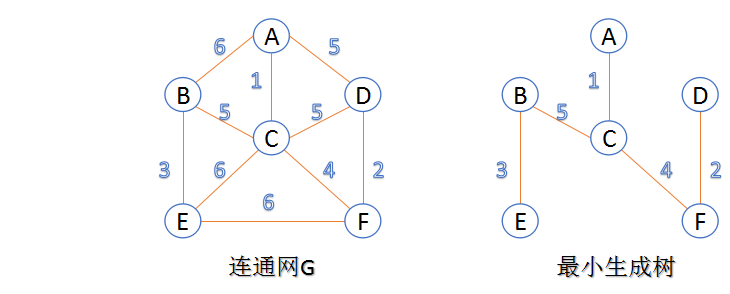
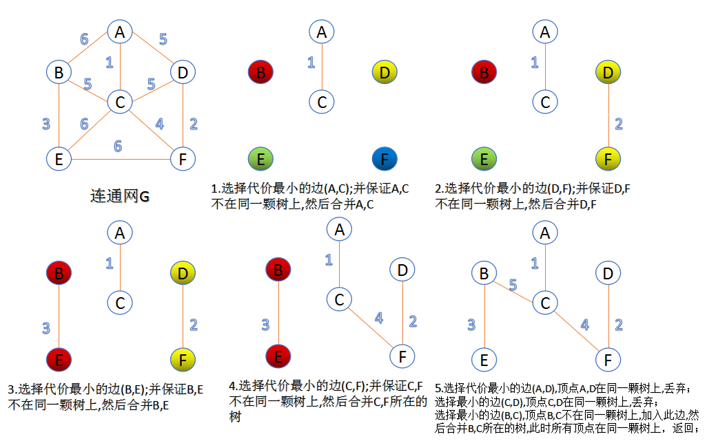
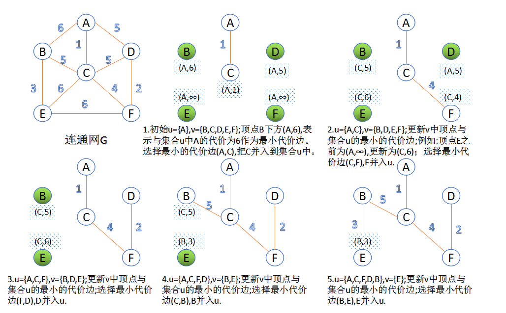

# 🤔👀图 - 最小生成树(Prim & Kruskal)

Kruskal算法是从最小权重边着手，将森林里的树逐渐合并；prim算法是从顶点出发，在根结点的基础上建起一棵树。

## 最小生成树相关名词

- `连通图`: 在无向图中，若任意两个顶点vivi与vjvj都有路径相通，则称该无向图为连通图。
- `强连通图`: 在有向图中，若任意两个顶点vivi与vjvj都有路径相通，则称该有向图为强连通图。
- `连通网`: 在连通图中，若图的边具有一定的意义，每一条边都对应着一个数，称为权；权代表着连接连个顶点的代价，称这种连通图叫做连通网。
- `生成树`: 一个连通图的生成树是指一个连通子图，它含有图中全部n个顶点，但只有足以构成一棵树的n-1条边。一颗有n个顶点的生成树有且仅有n-1条边，如果生成树中再添加一条边，则必定成环。
- `最小生成树`: 在连通网的所有生成树中，所有边的代价和最小的生成树，称为最小生成树。

## 最小生成树算法

### Kruskal算法

此算法可以称为“加边法”，初始最小生成树边数为0，每迭代一次就选择一条满足条件的最小代价边，加入到最小生成树的边集合里。

1. 把图中的所有边按代价从小到大排序；
2. 把图中的n个顶点看成独立的n棵树组成的森林；
3. 按权值从小到大选择边，所选的边连接的两个顶点ui,viui,vi,应属于两颗不同的树，则成为最小生成树的一条边，并将这两颗树合并作为一颗树。
4. 重复(3),直到所有顶点都在一颗树内或者有n-1条边为止。

### Prim算法

此算法可以称为“加点法”，每次迭代选择代价最小的边对应的点，加入到最小生成树中。算法从某一个顶点s开始，逐渐长大覆盖整个连通网的所有顶点。

- 图的所有顶点集合为VV；初始令集合u={s},v=V−uu={s},v=V−u;
- 在两个集合u,vu,v能够组成的边中，选择一条代价最小的边(u0,v0)(u0,v0)，加入到最小生成树中，并把v0v0并入到集合u中。
- 重复上述步骤，直到最小生成树有n-1条边或者n个顶点为止。

由于不断向集合u中加点，所以最小代价边必须同步更新；需要建立一个辅助数组closedge,用来维护集合v中每个顶点与集合u中最小代价边信息，:

## 总结

因为Kruskal涉及大量对边的操作，所以它适用于稀疏图；普通的prim算法适用于稠密图，但堆优化的prim算法更适用于稀疏图，因为其时间复杂度是由边的数量决定的。
