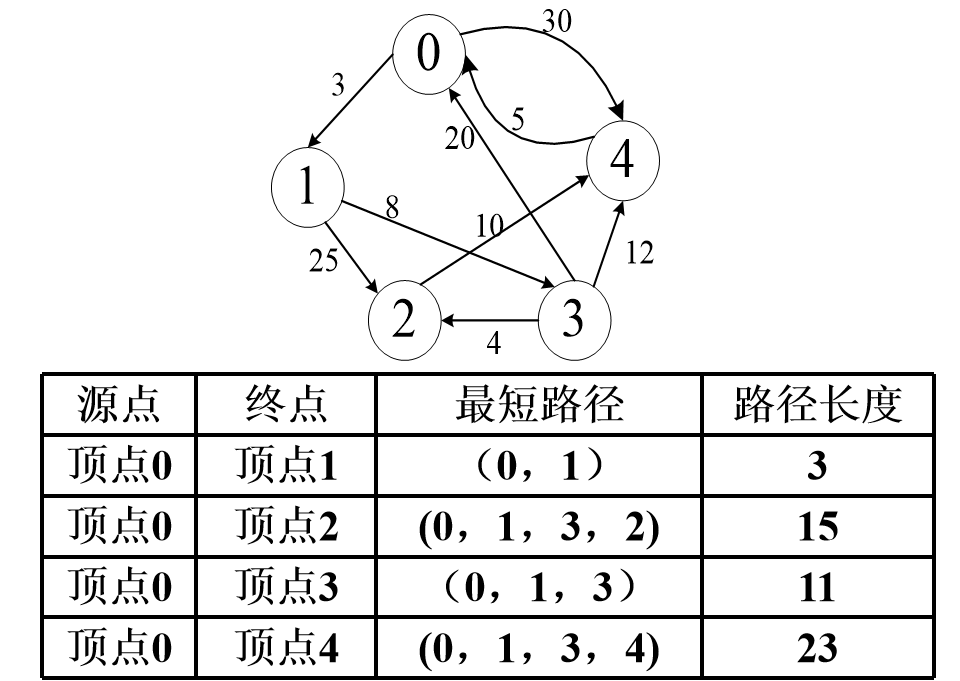

# 图 - 最短路径(Dijkstra & Frolyd)

最短路径有着广泛的应用，比如地图两点间距离计算，公交查询系统，路由选择等。@pdai

## 最短路径介绍

最短路径问题是图论研究中的一个经典算法问题，旨在寻找图(由结点和路径组成的)中两结点之间的最短路径。最短路径不一定是经过边最少的路径，但在这些最短路径中，长度最短的那一条路径上只有一条边，且它的权值在从源点出发的所有边的权值最小。

从图中某一顶点(称为源点)到达另一顶点(称为终点)的路径可能不止一条，如何找到一条路径使得沿此路径上各边上的权值总和达到最小，例: 公交查询系统。

路径长度最短的最短路径的特点:

- 在这条路径上，必定只含一条弧，并且这条弧的权值最小。
- 下一条路径长度次短的最短路径的特点:
- 它只可能有两种情况: 或者是直接从源点到该点(只含一条弧)； 或者是从源点经过顶点v1，再到达该顶点(由两条弧组成)。

问题解法:

- 求从某个源点到其余各点的最短路径 — Dijkstra算法
- 每一对顶点之间的最短路径 — Floyd算法

## 最短路径算法

### Dijkstra算法

1.定义概览

Dijkstra(迪杰斯特拉)算法是典型的单源最短路径算法，用于计算一个节点到其他所有节点的最短路径。主要特点是以起始点为中心向外层层扩展，直到扩展到终点为止。Dijkstra算法是很有代表性的最短路径算法，在很多专业课程中都作为基本内容有详细的介绍，如数据结构，图论，运筹学等等。注意该算法要求图中不存在负权边。

问题描述: 在无向图 G=(V,E) 中，假设每条边 E[i] 的长度为 w[i]，找到由顶点 V0 到其余各点的最短路径。(单源最短路径)

2.算法描述

1)算法思想: 设G=(V,E)是一个带权有向图，把图中顶点集合V分成两组，第一组为已求出最短路径的顶点集合(用S表示，初始时S中只有一个源点，以后每求得一条最短路径 , 就将加入到集合S中，直到全部顶点都加入到S中，算法就结束了)，第二组为其余未确定最短路径的顶点集合(用U表示)，按最短路径长度的递增次序依次把第二组的顶点加入S中。在加入的过程中，总保持从源点v到S中各顶点的最短路径长度不大于从源点v到U中任何顶点的最短路径长度。此外，每个顶点对应一个距离，S中的顶点的距离就是从v到此顶点的最短路径长度，U中的顶点的距离，是从v到此顶点只包括S中的顶点为中间顶点的当前最短路径长度。

2)算法步骤:

a.初始时，S只包含源点，即S＝{v}，v的距离为0。U包含除v外的其他顶点，即:U={其余顶点}，若v与U中顶点u有边，则<u,v>正常有权值，若u不是v的出边邻接点，则<u,v>权值为∞。

b.从U中选取一个距离v最小的顶点k，把k，加入S中(该选定的距离就是v到k的最短路径长度)。

c.以k为新考虑的中间点，修改U中各顶点的距离；若从源点v到顶点u的距离(经过顶点k)比原来距离(不经过顶点k)短，则修改顶点u的距离值，修改后的距离值的顶点k的距离加上边上的权。

d.重复步骤b和c直到所有顶点都包含在S中。

