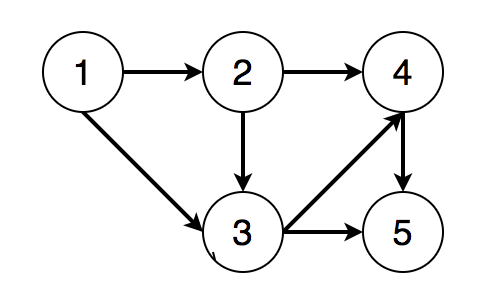
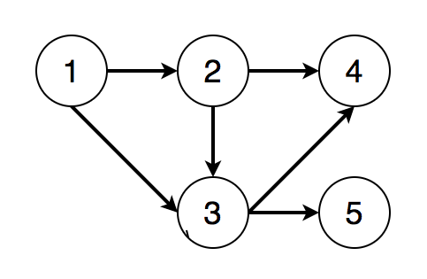

# 🤔👀图 - 拓扑排序(Topological sort)

拓扑排序主要用来解决有向图中的依赖解析(dependency resolution)问题。

## 扑排序介绍

对于任何有向图而言，其拓扑排序为其所有结点的一个线性排序(对于同一个有向图而言可能存在多个这样的结点排序)。该排序满足这样的条件——对于图中的任意两个结点u和v，若存在一条有向边从u指向v，则在拓扑排序中u一定出现在v前面。

例如一个有向无环图如下:



- 结点1必须在结点2、3之前
- 结点2必须在结点3、4之前
- 结点3必须在结点4、5之前
- 结点4必须在结点5之前

则一个满足条件的拓扑排序为[1, 2, 3, 4, 5]。

## 拓扑排序前提

当且仅当一个有向图为有向无环图(directed acyclic graph，或称DAG)时，才能得到对应于该图的拓扑排序。这里有两点要注意:

- 对于有环图，必然会造成循环依赖(circular dependency)，不符合拓扑排序定义；
- 对于每一个有向无环图都至少存在一种拓扑排序；

`不唯一的情况`:

上图中若我们删 4、5结点之前的有向边，上图变为如下所示:




则我们可得到两个不同的拓扑排序结果: [1, 2, 3, 4, 5]和[1, 2, 3, 5, 4]。

## 拓扑排序算法

为了说明如何得到一个有向无环图的拓扑排序，我们首先需要了解有向图结点的入度(indegree)和出度(outdegree)的概念。

假设有向图中不存在起点和终点为同一结点的有向边。


`入度`: 设有向图中有一结点v，其入度即为当前所有从其他结点出发，终点为v的的边的数目。也就是所有指向v的有向边的数目。

`出度`: 设有向图中有一结点v，其出度即为当前所有起点为v，指向其他结点的边的数目。也就是所有由v发出的边的数目。


在了解了入度和出度的概念之后，再根据拓扑排序的定义，我们自然就能够得出结论: 要想完成拓扑排序，我们每次都应当从入度为0的结点开始遍历。因为只有入度为0的结点才能够成为拓扑排序的起点。否则根据拓扑排序的定义，只要一个结点v的入度不为0，则至少有一条边起始于其他结点而指向v，那么这条边的起点在拓扑排序的顺序中应当位于v之前，则v不能成为当前遍历的起点。


由此我们可以进一步得出一个改进的深度优先遍历或广度优先遍历算法来完成拓扑排序。以广度优先遍历为例，这一改进后的算法与普通的广度优先遍历唯一的区别在于我们应当保存每一个结点对应的入度，并在遍历的每一层选取入度为0的结点开始遍历(而普通的广度优先遍历则无此限制，可以从该吃呢个任意一个结点开始遍历)。这个算法描述如下:

- 初始化一个int[] inDegree保存每一个结点的入度。
- 对于图中的每一个结点的子结点，将其子结点的入度加1。
- 选取入度为0的结点开始遍历，并将该节点加入输出。
- 对于遍历过的每个结点，更新其子结点的入度: 将子结点的入度减1。
- 重复步骤3，直到遍历完所有的结点。
- 如果无法遍历完所有的结点，则意味着当前的图不是有向无环图。不存在拓扑排序。

## 拓扑排序代码实现

广度优先遍历拓扑排序的Java代码如下:

```java
public class TopologicalSort {
    /**
     * Get topological ordering of the input directed graph 
     * @param n number of nodes in the graph
     * @param adjacencyList adjacency list representation of the input directed graph
     * @return topological ordering of the graph stored in an List<Integer>. 
     */
    public List<Integer> topologicalSort(int n, int[][] adjacencyList) {
        List<Integer> topoRes = new ArrayList<>();
        int[] inDegree = new int[n];
        for (int[] parent : adjacencyList) {
            for (int child : parent) {
                inDegree[child]++;
            }
        }
        
        Deque<Integer> deque = new ArrayDeque<>();
        
        // start from nodes whose indegree are 0
        for (int i = 0; i < n; i++) {
            if (inDegree[i] == 0) deque.offer(i);
        }
        
        while (!deque.isEmpty()) {
            int curr = deque.poll();
            topoRes.add(curr);
            for (int child : adjacencyList[curr]) {
                inDegree[child]--;
                if (inDegree[child] == 0) {
                    deque.offer(child);
                }
            }
        }
    
        return topoRes.size() == n ? topoRes : new ArrayList<>();
    }
}   
```

## 复杂度

时间复杂度:  O(n + e)，其中n为图中的结点数目，e为图中的边的数目

空间复杂度: O(n)
