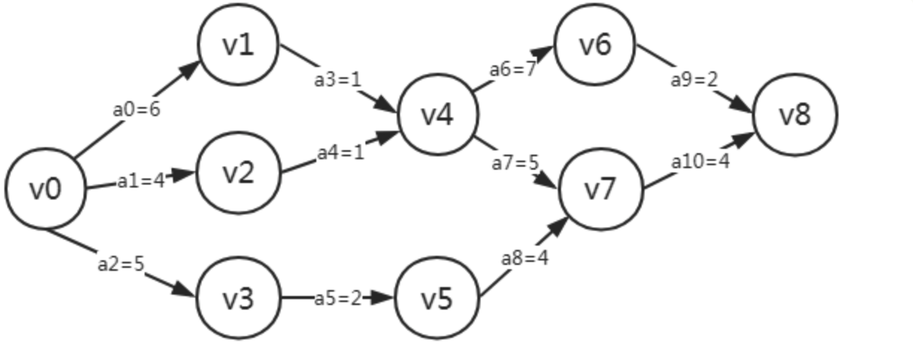
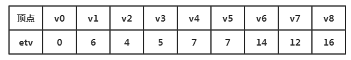
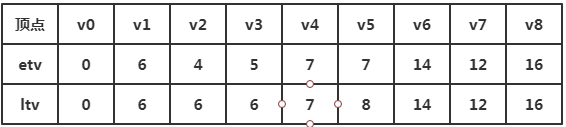
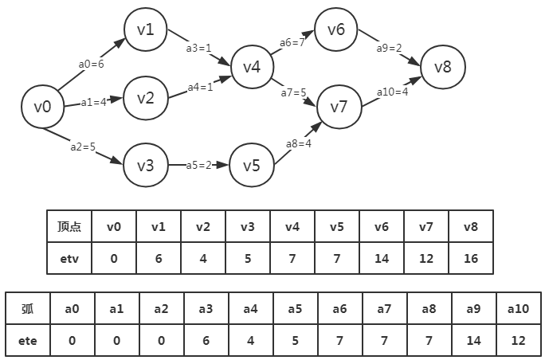
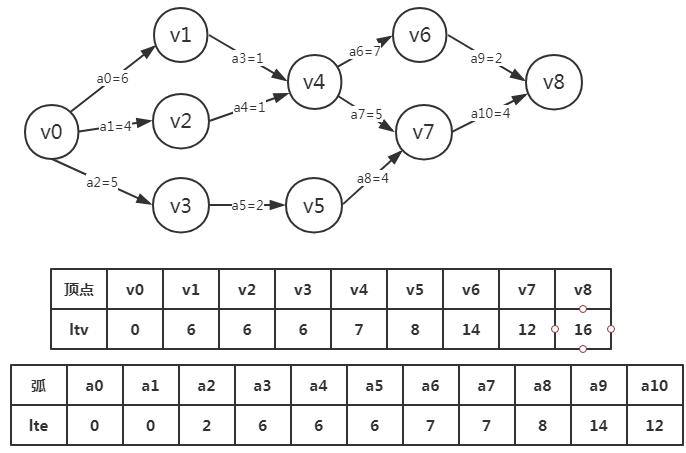

# 图 - AOE & 关键路径

关键路径在项目管理计算工期等方面有广泛等应用，提升工期就是所见缩减所有关键路径上的工期，并且在实现时需要应用到之前拓扑排序的算法(前提: 有向无环图，有依赖关系)。

## 关键路径相关名词

相关术语:

- `AOV网络(Activity On Vertex Network)`: 有向图，用顶点表示活动，用弧表示活动的先后顺序
- `AOE网络(Activity On Edge)`: 有向图，用顶点表示事件，用弧表示活动，用权值表示活动消耗时间(带权的有向无环图)
- `活动`: 业务逻辑中的行为，用边表示
- `事件`: 活动的结果或者触发条件
- `关键路径`: 具有最大路径长度(权重)的路径，可能不止一条
- `活动的两个属性`: e(i)最早开始时间，l(i)最晚开始时间
- `事件的两个属性`: ve(j)最早开始时间，vl(j)最晚开始时间

AOV和AOE的对比: 虽然都是用来对工程建模，但是还是有很大不同。主要体现在:

- AOV网是顶点表示活动的网，他只描述活动之间的制约更新，
- AOE网是用边表示活动的网，边上的权值表示活动持续的时间

## 关键路径的实现

### 4个关键概念

#### 事件最早发生时间

事件最早发生时间etv(earliest time of vertex)，即顶点Vk的最早发生时间。

#### 事件最晚发生时间

事件最晚发生时间ltv(lastest time of vertex)，即顶点Vk的最晚发生时间，也就是每个顶点对应的事件最晚需要开始的事件，超出此事件将会延误整个工期。

#### 活动的最早开工时间

活动的最早开工时间ete(earliest time of edge)，即弧ak的最早发生时间。

#### 活动的最晚开工时间

活动的最晚开工时间lte(lastest time if edge)，即弧的最晚发生时间，也就是不推迟工期的最晚开工时间。

### 4个时间的关系

我们可以由事件的最早发生时间和事件的最晚发生时间求出活动的最早和最晚开工时间。 由1,2可以求得3,4，然后在根据ete[k]是否与lte[k]相等来判断ak是否是关键活动。

### 算法实现

- 推演图

- etv从左向右推导

- ltv从右向左推导

- ete: 活动最早开工时间需要和etv事件最早发生时间结合

te: 活动最晚开工时间需要和ltv事件最晚发生时间结合(都是倒序获得)

[这里(opens new window)](https://www.cnblogs.com/ssyfj/p/9496969.html)

