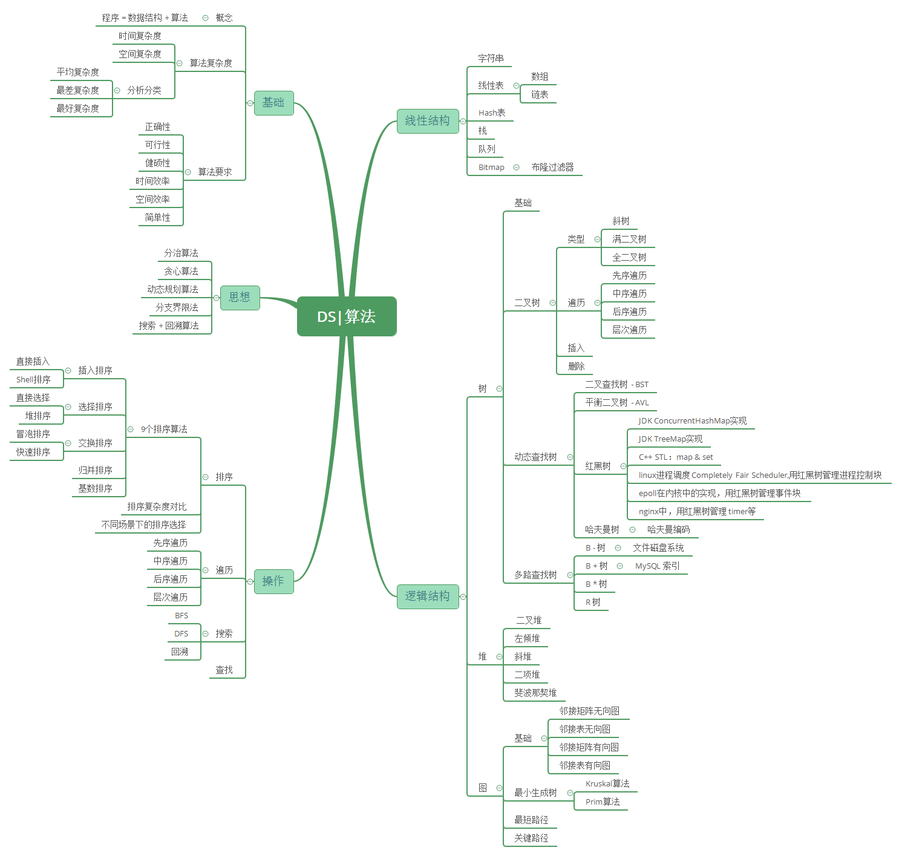

# 🤔👀♥数据结构基础知识体系详解♥

**总结如下：**

`数组`的下标寻址十分迅速，但计算机的内存是有限的，故数组的长度也是有限的，实际应用当中的数据往往十分庞大；而且无序数组的查找最坏情况需要遍历整个数组；后来人们提出了二分查找，二分查找要求数组的构造一定有序，二分法查找解决了普通数组查找复杂度过高的问题。任和一种数组无法解决的问题就是插入、删除操作比较复杂，因此，在一个增删查改比较频繁的数据结构中，数组不会被优先考虑

`普通链表`由于它的结构特点被证明根本不适合进行查找

`哈希表`是数组和链表的折中，同时它的设计依赖散列函数的设计，数组不能无限长、链表也不适合查找，所以也适合大规模的查找

`二叉查找树`因为可能退化成链表，同样不适合进行查找

`AVL树`是为了解决可能退化成链表问题，但是AVL树的旋转过程非常麻烦，因此插入和删除很慢，也就是构建AVL树比较麻烦

`红黑树`是平衡二叉树和AVL树的折中，因此是比较合适的。集合类中的Map、关联数组具有较高的查询效率，它们的底层实现就是红黑树。

`多路查找树` 是大规模数据存储中，实现索引查询这样一个实际背景下，树节点存储的元素数量是有限的(如果元素数量非常多的话，查找就退化成节点内部的线性查找了)，这样导致二叉查找树结构由于树的深度过大而造成磁盘I/O读写过于频繁，进而导致查询效率低下。

`B树`与自平衡二叉查找树不同，B树适用于读写相对大的数据块的存储系统，例如磁盘。它的应用是文件系统及部分非关系型数据库索引。

`B+树`在B树基础上，为叶子结点增加链表指针(B树+叶子有序链表)，所有关键字都在叶子结点 中出现，非叶子结点作为叶子结点的索引；B+树总是到叶子结点才命中。通常用于关系型数据库(如Mysql)和操作系统的文件系统中。

`B*树`是B+树的变体，在B+树的非根和非叶子结点再增加指向兄弟的指针, 在B+树基础上，为非叶子结点也增加链表指针，将结点的最低利用率从1/2提高到2/3。

`R树`是用来做空间数据存储的树状数据结构。例如给地理位置，矩形和多边形这类多维数据建立索引。

`Trie树`是自然语言处理中最常用的数据结构，很多字符串处理任务都会用到。Trie树本身是一种有限状态自动机，还有很多变体。什么模式匹配、正则表达式，都与这有关。

数据结构是基础中的基础，任何进阶都逃不开这些知识点。

数据结构之 线性结构：首先理解数据结构中线性结构及其延伸：数组和矩阵，链表，栈和队列等。

- 线性表 - 数组和矩阵

  - 数组是一种连续存储线性结构，元素类型相同，大小相等，数组是多维的，通过使用整型索引值来访问他们的元素，数组尺寸不能改变

  

- 线性表 - 链表

  - n个节点离散分配，彼此通过指针相连，每个节点只有一个前驱节点，每个节点只有一个后续节点，首节点没有前驱节点，尾节点没有后续节点。确定一个链表我们只需要头指针，通过头指针就可以把整个链表都能推出来

  

- 线性表(散列) - 哈希表

  - 散列表（Hash table，也叫哈希表），是根据关键码值(Key value)而直接进行访问的数据结构。也就是说，它通过把关键码值映射到表中一个位置来访问记录，以加快查找的速度。这个映射函数叫做散列函数，存放记录的数组叫做散列表。

  

- 线性表 - 栈和队列

  - 数组和链表都是线性存储结构的基础，栈和队列都是线性存储结构的应用

数据结构之 逻辑结构：树：然后理解数据结构中逻辑结构之树：二叉搜索树(BST)，平衡二叉树(AVL)，红黑树(R-B Tree)，哈夫曼树，前缀树(Trie)等。

- 树 - 基础和Overview

  - 树在数据结构中至关重要，这里展示树的整体知识体系结构和几种常见树类型

  

- 树 - 二叉搜索树(BST)

  - 本文主要介绍 二叉树中最基本的二叉查找树（Binary Search Tree），（又：二叉搜索树，二叉排序树）它或者是一棵空树，或者是具有下列性质的二叉树： 若它的左子树不空，则左子树上所有结点的值均小于它的根结点的值； 若它的右子树不空，则右子树上所有结点的值均大于它的根结点的值； 它的左、右子树也分别为二叉排序树。

  

- 树 - 平衡二叉树(AVL)

  - 平衡二叉树（Balanced Binary Tree）具有以下性质：它是一棵空树或它的左右两个子树的高度差的绝对值不超过1，并且左右两个子树都是一棵平衡二叉树。平衡二叉树的常用实现方法有红黑树、AVL、替罪羊树、Treap、伸展树等。 最小二叉平衡树的节点的公式如下 F(n)=F(n-1)+F(n-2)+1 这个类似于一个递归的数列，可以参考Fibonacci数列，1是根节点，F(n-1)是左子树的节点数量，F(n-2)是右子树的节点数量。

  

- 树 - 红黑树(R-B Tree)

  - 红黑树（Red Black Tree） 是一种自平衡二叉查找树，是在计算机科学中用到的一种数据结构，典型的用途是实现关联数组，是平衡二叉树和AVL树的折中。

  

- 树 - 哈夫曼树

  - 哈夫曼又称最优二叉树, 是一种带权路径长度最短的二叉树。

  

- 树 - 前缀树(Trie)

  - Trie，又称字典树、单词查找树或键树，是一种树形结构，是一种哈希树的变种。典型应用是用于统计，排序和保存大量的字符串（但不仅限于字符串），所以经常被搜索引擎系统用于文本词频统计。它的优点是：利用字符串的公共前缀来减少查询时间，最大限度地减少无谓的字符串比较，查询效率比哈希树高。
  
  

数据结构之 逻辑结构：图：最后理解数据结构中逻辑结构之图：图基础，图的遍历，最小生成树(Prim & Kruskal)，最短路径(Dijkstra & Frolyd)，拓扑排序(Topological sort)，AOE & 关键路径等。

- 图 - 基础和Overview

  - 图(Graph)是由顶点和连接顶点的边构成的离散结构。在计算机科学中，图是最灵活的数据结构之一，很多问题都可以使用图模型进行建模求解。例如: 生态环境中不同物种的相互竞争、人与人之间的社交与关系网络、化学上用图区分结构不同但分子式相同的同分异构体、分析计算机网络的拓扑结构确定两台计算机是否可以通信、找到两个城市之间的最短路径等等。

  

- 图 - 遍历(BFS & DFS)

  - 图的深度优先搜索(Depth First Search)，和树的先序遍历比较类似; 广度优先搜索算法(Breadth First Search)，又称为"宽度优先搜索"或"横向优先搜索"

  

- 图 - 最小生成树(Prim & Kruskal)

  - Kruskal算法是从最小权重边着手，将森林里的树逐渐合并；prim算法是从顶点出发，在根结点的基础上建起一棵树

  

- 图 - 最短路径(Dijkstra & Frolyd)

  - 最短路径有着广泛的应用，比如地图两点间距离计算，公交查询系统，路由选择等

  

- 图 - 拓扑排序(Topological sort)

  - 拓扑排序主要用来解决有向图中的依赖解析(dependency resolution)问题

  

- 图 - AOE & 关键路径

  - 关键路径在项目管理计算工期等方面有广泛等应用，提升工期就是所见缩减所有关键路径上的工期，并且在实现时需要应用到之前拓扑排序的算法(前提: 有向无环图，有依赖关系)

