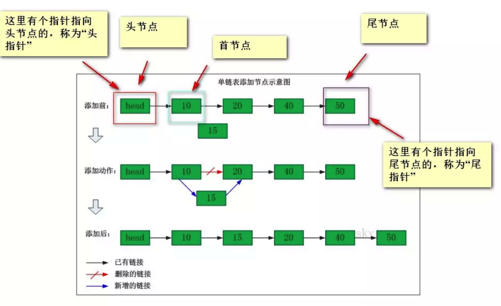

# 🤔👀线性表 - 链表

n个节点离散分配，彼此通过指针相连，每个节点只有一个前驱节点，每个节点只有一个后续节点，首节点没有前驱节点，尾节点没有后续节点。确定一个链表我们只需要头指针，通过头指针就可以把整个链表都能推出来。

## 知识点

### 优缺点

链表优点

- 空间没有限制
- 插入删除元素很快

链表缺点 存取速度很慢

### 分类

- 单向链表 一个节点指向下一个节点。
- 双向链表 一个节点有两个指针域。
- 循环链表 能通过任何一个节点找到其他所有的节点，将两种(双向/单向)链表的最后一个结点指向第一个结点从而实现循环。

### 实现




节点

```java
public class Node {
    //数据域
    public int data;
    //指针域，指向下一个节点
    public Node next;

    public Node() {
    }
    public Node(int data) {
        this.data = data;
    }
    public Node(int data, Node next) {
        this.data = data;
        this.next = next;
    }
}
```

如上，一个链表节点对象就创建完成了，但理解链表本身并不难，但做相关的操作却并非易事，其算法包括且不限于:

- 插入节点
- 遍历
- 查找
- 清空
- 销毁
- 求长度
- 排序
- 删除节点
- 去重

## 链表相关题目

链表是空节点，或者有一个值和一个指向下一个链表的指针，因此很多链表问题可以用递归来处理。

**找出两个链表的交点**

```html
A:          a1 → a2
                    ↘
                      c1 → c2 → c3
                    ↗
B:    b1 → b2 → b3
```

要求: 时间复杂度为 O(N)，空间复杂度为 O(1)

设 A 的长度为 a + c，B 的长度为 b + c，其中 c 为尾部公共部分长度，可知 a + c + b = b + c + a。


当访问 A 链表的指针访问到链表尾部时，令它从链表 B 的头部开始访问链表 B；同样地，当访问 B 链表的指针访问到链表尾部时，令它从链表 A 的头部开始访问链表 A。这样就能控制访问 A 和 B 两个链表的指针能同时访问到交点。

```java
public ListNode getIntersectionNode(ListNode headA, ListNode headB) {
    ListNode l1 = headA, l2 = headB;
    while (l1 != l2) {
        l1 = (l1 == null) ? headB : l1.next;
        l2 = (l2 == null) ? headA : l2.next;
    }
    return l1;
}
```

如果只是判断是否存在交点，那么就是另一个问题，即 [编程之美 3.6]() 的问题。有两种解法:

- 把第一个链表的结尾连接到第二个链表的开头，看第二个链表是否存在环；
- 或者直接比较两个链表的最后一个节点是否相同。

**链表反转**

递归

```java
public ListNode reverseList(ListNode head) {
    if (head == null || head.next == null) {
        return head;
    }
    ListNode next = head.next;
    ListNode newHead = reverseList(next);
    next.next = head;
    head.next = null;
    return newHead;
}
```

头插法

```java
public ListNode reverseList(ListNode head) {
    ListNode newHead = new ListNode(-1);
    while (head != null) {
        ListNode next = head.next;
        head.next = newHead.next;
        newHead.next = head;
        head = next;
    }
    return newHead.next;
}
```

**归并两个有序的链表**

```java
public ListNode mergeTwoLists(ListNode l1, ListNode l2) {
    if (l1 == null) return l2;
    if (l2 == null) return l1;
    if (l1.val < l2.val) {
        l1.next = mergeTwoLists(l1.next, l2);
        return l1;
    } else {
        l2.next = mergeTwoLists(l1, l2.next);
        return l2;
    }
}
```

```html
Given 1->1->2, return 1->2.
Given 1->1->2->3->3, return 1->2->3.
```

```java
public ListNode deleteDuplicates(ListNode head) {
    if (head == null || head.next == null) return head;
    head.next = deleteDuplicates(head.next);
    return head.val == head.next.val ? head.next : head;
}
```

**删除链表的倒数第 n 个节点**

```html
Given linked list: 1->2->3->4->5, and n = 2.
After removing the second node from the end, the linked list becomes 1->2->3->5.
```

```java
public ListNode removeNthFromEnd(ListNode head, int n) {
    ListNode fast = head;
    while (n-- > 0) {
        fast = fast.next;
    }
    if (fast == null) return head.next;
    ListNode slow = head;
    while (fast.next != null) {
        fast = fast.next;
        slow = slow.next;
    }
    slow.next = slow.next.next;
    return head;
}
```

**交换链表中的相邻结点**

```html
Given 1->2->3->4, you should return the list as 2->1->4->3.
```

题目要求: 不能修改结点的 val 值，O(1) 空间复杂度。

```java
public ListNode swapPairs(ListNode head) {
    ListNode node = new ListNode(-1);
    node.next = head;
    ListNode pre = node;
    while (pre.next != null && pre.next.next != null) {
        ListNode l1 = pre.next, l2 = pre.next.next;
        ListNode next = l2.next;
        l1.next = next;
        l2.next = l1;
        pre.next = l2;

        pre = l1;
    }
    return node.next;
}
```

**链表求和**

```html
Input: (7 -> 2 -> 4 -> 3) + (5 -> 6 -> 4)
Output: 7 -> 8 -> 0 -> 7
```

题目要求: 不能修改原始链表。

````java
public ListNode addTwoNumbers(ListNode l1, ListNode l2) {
    Stack<Integer> l1Stack = buildStack(l1);
    Stack<Integer> l2Stack = buildStack(l2);
    ListNode head = new ListNode(-1);
    int carry = 0;
    while (!l1Stack.isEmpty() || !l2Stack.isEmpty() || carry != 0) {
        int x = l1Stack.isEmpty() ? 0 : l1Stack.pop();
        int y = l2Stack.isEmpty() ? 0 : l2Stack.pop();
        int sum = x + y + carry;
        ListNode node = new ListNode(sum % 10);
        node.next = head.next;
        head.next = node;
        carry = sum / 10;
    }
    return head.next;
}

private Stack<Integer> buildStack(ListNode l) {
    Stack<Integer> stack = new Stack<>();
    while (l != null) {
        stack.push(l.val);
        l = l.next;
    }
    return stack;
}
````

**回文链表**

题目要求: 以 O(1) 的空间复杂度来求解。

切成两半，把后半段反转，然后比较两半是否相等。

```java
public boolean isPalindrome(ListNode head) {
    if (head == null || head.next == null) return true;
    ListNode slow = head, fast = head.next;
    while (fast != null && fast.next != null) {
        slow = slow.next;
        fast = fast.next.next;
    }
    if (fast != null) slow = slow.next;  // 偶数节点，让 slow 指向下一个节点
    cut(head, slow);                     // 切成两个链表
    return isEqual(head, reverse(slow));
}

private void cut(ListNode head, ListNode cutNode) {
    while (head.next != cutNode) {
        head = head.next;
    }
    head.next = null;
}

private ListNode reverse(ListNode head) {
    ListNode newHead = null;
    while (head != null) {
        ListNode nextNode = head.next;
        head.next = newHead;
        newHead = head;
        head = nextNode;
    }
    return newHead;
}

private boolean isEqual(ListNode l1, ListNode l2) {
    while (l1 != null && l2 != null) {
        if (l1.val != l2.val) return false;
        l1 = l1.next;
        l2 = l2.next;
    }
    return true;
}
```

**分隔链表**

```html
Input:
root = [1, 2, 3, 4, 5, 6, 7, 8, 9, 10], k = 3
Output: [[1, 2, 3, 4], [5, 6, 7], [8, 9, 10]]
Explanation:
The input has been split into consecutive parts with size difference at most 1, and earlier parts are a larger size than the later parts.
```

题目描述: 把链表分隔成 k 部分，每部分的长度都应该尽可能相同，排在前面的长度应该大于等于后面的。

```java
public ListNode[] splitListToParts(ListNode root, int k) {
    int N = 0;
    ListNode cur = root;
    while (cur != null) {
        N++;
        cur = cur.next;
    }
    int mod = N % k;
    int size = N / k;
    ListNode[] ret = new ListNode[k];
    cur = root;
    for (int i = 0; cur != null && i < k; i++) {
        ret[i] = cur;
        int curSize = size + (mod-- > 0 ? 1 : 0);
        for (int j = 0; j < curSize - 1; j++) {
            cur = cur.next;
        }
        ListNode next = cur.next;
        cur.next = null;
        cur = next;
    }
    return ret;
}
```

**链表元素按奇偶聚集**

```html
Example:
Given 1->2->3->4->5->NULL,
return 1->3->5->2->4->NULL.
```

```java
public ListNode oddEvenList(ListNode head) {
    if (head == null) {
        return head;
    }
    ListNode odd = head, even = head.next, evenHead = even;
    while (even != null && even.next != null) {
        odd.next = odd.next.next;
        odd = odd.next;
        even.next = even.next.next;
        even = even.next;
    }
    odd.next = evenHead;
    return head;
}
```
