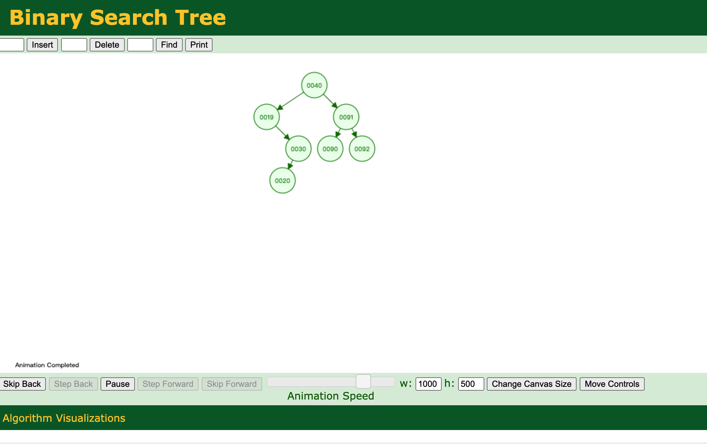
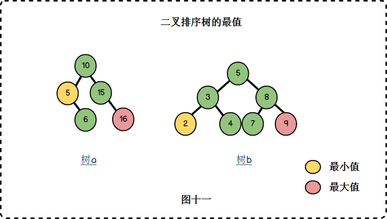
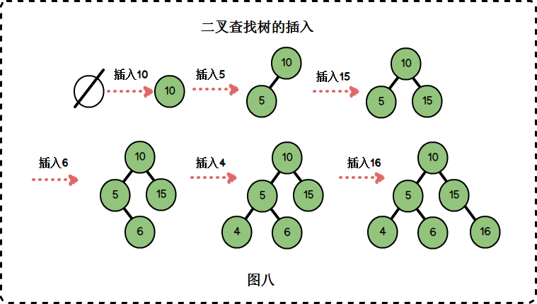
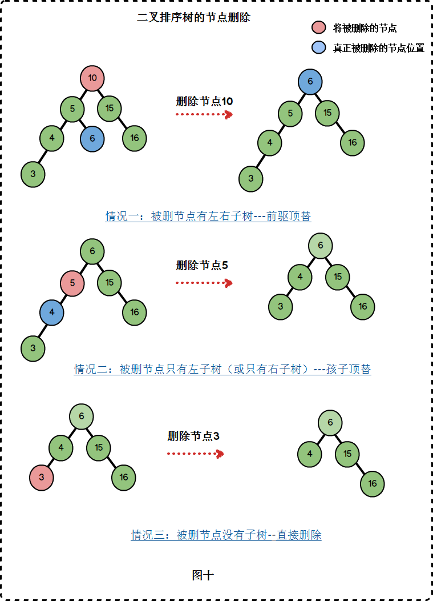
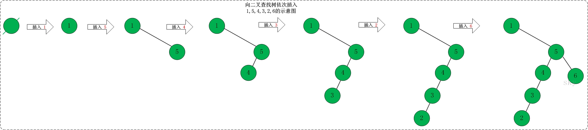
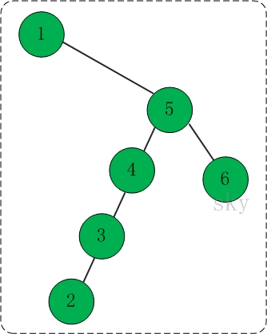
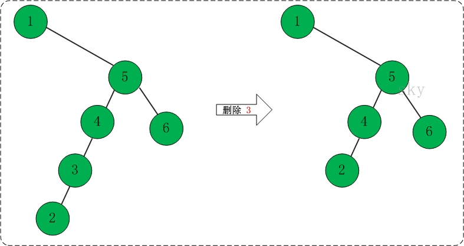

# 🤔👀树 - 二叉搜索树(BST)

二叉树中最基本的二叉查找树（Binary Search Tree），（又：二叉搜索树，二叉排序树）它或者是一棵空树，或者是具有下列性质的二叉树： 若它的左子树不空，则左子树上所有结点的值均小于它的根结点的值； 若它的右子树不空，则右子树上所有结点的值均大于它的根结点的值； 它的左、右子树也分别为二叉排序树。

## BST的定义

在二叉查找树中:

- 若任意节点的左子树不空，则左子树上所有结点的值均小于它的根结点的值；
- 任意节点的右子树不空，则右子树上所有结点的值均大于它的根结点的值；
- 任意节点的左、右子树也分别为二叉查找树。
- 没有键值相等的节点。




## BST的实现

### 节点

BSTree是二叉树，它保护了二叉树的根节点mRoot；mRoot是BSTNode类型，而BSTNode是二叉查找树的节点，它是BSTree的内部类。BSTNode包含二叉查找树的几个基本信息:

- key -- 它是关键字，是用来对二叉查找树的节点进行排序的。
- left -- 它指向当前节点的左孩子。
- right -- 它指向当前节点的右孩子。
- parent -- 它指向当前节点的父结点。

```java
public class BSTree<T extends Comparable<T>> {

    private BSTNode<T> mRoot;    // 根结点

    public class BSTNode<T extends Comparable<T>> {
        T key;                // 关键字(键值)
        BSTNode<T> left;      // 左孩子
        BSTNode<T> right;     // 右孩子
        BSTNode<T> parent;    // 父结点

        public BSTNode(T key, BSTNode<T> parent, BSTNode<T> left, BSTNode<T> right) {
            this.key = key;
            this.parent = parent;
            this.left = left;
            this.right = right;
        }
    }

        ......
}
```

### 遍历

这里讲解前序遍历、中序遍历、后序遍历3种方式。

#### 前序遍历

若二叉树非空，则执行以下操作:

- 访问根结点；
- 先序遍历左子树；
- 先序遍历右子树。

```java
private void preOrder(BSTNode<T> tree) {
    if(tree != null) {
        System.out.print(tree.key+" ");
        preOrder(tree.left);
        preOrder(tree.right);
    }
}

public void preOrder() {
    preOrder(mRoot);
}
```

#### 中序遍历

若二叉树非空，则执行以下操作:

- 中序遍历左子树；
- 访问根结点；
- 中序遍历右子树。

```java
private void inOrder(BSTNode<T> tree) {
    if(tree != null) {
        inOrder(tree.left);
        System.out.print(tree.key+" ");
        inOrder(tree.right);
    }
}

public void inOrder() {
    inOrder(mRoot);
}
```

#### 后序遍历

若二叉树非空，则执行以下操作:

- 后序遍历左子树；
- 后序遍历右子树；
- 访问根结点。

```java
private void postOrder(BSTNode<T> tree) {
    if(tree != null)
    {
        postOrder(tree.left);
        postOrder(tree.right);
        System.out.print(tree.key+" ");
    }
}

public void postOrder() {
    postOrder(mRoot);
}
```

看看下面这颗树的各种遍历方式:

.svg)

对于上面的二叉树而言，

- 前序遍历结果:  8 3 1 6 4 7 10 14 13
- 中序遍历结果:  1 3 4 6 7 8 10 13 14
- 后序遍历结果:  1 4 7 6 3 13 14 10 8

### 查找

- 递归版本的代码

```java
/*
 * (递归实现)查找"二叉树x"中键值为key的节点
 */
private BSTNode<T> search(BSTNode<T> x, T key) {
    if (x==null)
        return x;

    int cmp = key.compareTo(x.key);
    if (cmp < 0)
        return search(x.left, key);
    else if (cmp > 0)
        return search(x.right, key);
    else
        return x;
}

public BSTNode<T> search(T key) {
    return search(mRoot, key);
}
```

- 非递归版本的代码

```java
/*
 * (非递归实现)查找"二叉树x"中键值为key的节点
 */
private BSTNode<T> iterativeSearch(BSTNode<T> x, T key) {
    while (x!=null) {
        int cmp = key.compareTo(x.key);

        if (cmp < 0) 
            x = x.left;
        else if (cmp > 0) 
            x = x.right;
        else
            return x;
    }

    return x;
}

public BSTNode<T> iterativeSearch(T key) {
    return iterativeSearch(mRoot, key);
}
```

### 最大值和最小值




- 查找最大结点

```java
/* 
 * 查找最大结点: 返回tree为根结点的二叉树的最大结点。
 */
private BSTNode<T> maximum(BSTNode<T> tree) {
    if (tree == null)
        return null;

    while(tree.right != null)
        tree = tree.right;
    return tree;
}

public T maximum() {
    BSTNode<T> p = maximum(mRoot);
    if (p != null)
        return p.key;

    return null;
}
```

- 查找最小结点

```java
/* 
 * 查找最小结点: 返回tree为根结点的二叉树的最小结点。
 */
private BSTNode<T> minimum(BSTNode<T> tree) {
    if (tree == null)
        return null;

    while(tree.left != null)
        tree = tree.left;
    return tree;
}

public T minimum() {
    BSTNode<T> p = minimum(mRoot);
    if (p != null)
        return p.key;

    return null;
}
```

### 前驱和后继

节点的前驱: 是该节点的左子树中的最大节点。 节点的后继: 是该节点的右子树中的最小节点。

- 查找前驱节点

```java
/* 
 * 找结点(x)的前驱结点。即，查找"二叉树中数据值小于该结点"的"最大结点"。
 */
public BSTNode<T> predecessor(BSTNode<T> x) {
    // 如果x存在左孩子，则"x的前驱结点"为 "以其左孩子为根的子树的最大结点"。
    if (x.left != null)
        return maximum(x.left);

    // 如果x没有左孩子。则x有以下两种可能: 
    // (01) x是"一个右孩子"，则"x的前驱结点"为 "它的父结点"。
    // (01) x是"一个左孩子"，则查找"x的最低的父结点，并且该父结点要具有右孩子"，找到的这个"最低的父结点"就是"x的前驱结点"。
    BSTNode<T> y = x.parent;
    while ((y!=null) && (x==y.left)) {
        x = y;
        y = y.parent;
    }

    return y;
}
```

- 查找后继节点

```java
/* 
 * 找结点(x)的后继结点。即，查找"二叉树中数据值大于该结点"的"最小结点"。
 */
public BSTNode<T> successor(BSTNode<T> x) {
    // 如果x存在右孩子，则"x的后继结点"为 "以其右孩子为根的子树的最小结点"。
    if (x.right != null)
        return minimum(x.right);

    // 如果x没有右孩子。则x有以下两种可能: 
    // (01) x是"一个左孩子"，则"x的后继结点"为 "它的父结点"。
    // (02) x是"一个右孩子"，则查找"x的最低的父结点，并且该父结点要具有左孩子"，找到的这个"最低的父结点"就是"x的后继结点"。
    BSTNode<T> y = x.parent;
    while ((y!=null) && (x==y.right)) {
        x = y;
        y = y.parent;
    }

    return y;
}
```

### 插入



```java
/* 
 * 将结点插入到二叉树中
 *
 * 参数说明: 
 *     tree 二叉树的
 *     z 插入的结点
 */
private void insert(BSTree<T> bst, BSTNode<T> z) {
    int cmp;
    BSTNode<T> y = null;
    BSTNode<T> x = bst.mRoot;

    // 查找z的插入位置
    while (x != null) {
        y = x;
        cmp = z.key.compareTo(x.key);
        if (cmp < 0)
            x = x.left;
        else
            x = x.right;
    }

    z.parent = y;
    if (y==null)
        bst.mRoot = z;
    else {
        cmp = z.key.compareTo(y.key);
        if (cmp < 0)
            y.left = z;
        else
            y.right = z;
    }
}

/* 
 * 新建结点(key)，并将其插入到二叉树中
 *
 * 参数说明: 
 *     tree 二叉树的根结点
 *     key 插入结点的键值
 */
public void insert(T key) {
    BSTNode<T> z=new BSTNode<T>(key,null,null,null);

    // 如果新建结点失败，则返回。
    if (z != null)
        insert(this, z);
}
```

### 删除




```java
/* 
 * 删除结点(z)，并返回被删除的结点
 *
 * 参数说明: 
 *     bst 二叉树
 *     z 删除的结点
 */
private BSTNode<T> remove(BSTree<T> bst, BSTNode<T> z) {
    BSTNode<T> x=null;
    BSTNode<T> y=null;

    if ((z.left == null) || (z.right == null) )
        y = z;
    else
        y = successor(z);

    if (y.left != null)
        x = y.left;
    else
        x = y.right;

    if (x != null)
        x.parent = y.parent;

    if (y.parent == null)
        bst.mRoot = x;
    else if (y == y.parent.left)
        y.parent.left = x;
    else
        y.parent.right = x;

    if (y != z) 
        z.key = y.key;

    return y;
}

/* 
 * 删除结点(z)，并返回被删除的结点
 *
 * 参数说明: 
 *     tree 二叉树的根结点
 *     z 删除的结点
 */
public void remove(T key) {
    BSTNode<T> z, node; 

    if ((z = search(mRoot, key)) != null)
        if ( (node = remove(this, z)) != null)
            node = null;
}
```

### 打印

```java
/*
 * 打印"二叉查找树"
 *
 * key        -- 节点的键值 
 * direction  --  0，表示该节点是根节点;
 *               -1，表示该节点是它的父结点的左孩子;
 *                1，表示该节点是它的父结点的右孩子。
 */
private void print(BSTNode<T> tree, T key, int direction) {

    if(tree != null) {

        if(direction==0)    // tree是根节点
            System.out.printf("%2d is root\n", tree.key);
        else                // tree是分支节点
            System.out.printf("%2d is %2d's %6s child\n", tree.key, key, direction==1?"right" : "left");

        print(tree.left, tree.key, -1);
        print(tree.right,tree.key,  1);
    }
}

public void print() {
    if (mRoot != null)
        print(mRoot, mRoot.key, 0);
}
```

### 销毁

```java
/*
 * 销毁二叉树
 */
private void destroy(BSTNode<T> tree) {
    if (tree==null)
        return ;

    if (tree.left != null)
        destroy(tree.left);
    if (tree.right != null)
        destroy(tree.right);

    tree=null;
}

public void clear() {
    destroy(mRoot);
    mRoot = null;
}
```


## 测试程序

下面对测试程序的流程进行分析！

- 新建"二叉查找树"root。
- 向二叉查找树中依次插入1,5,4,3,2,6 。如下图所示:



- 遍历和查找

插入1,5,4,3,2,6之后，得到的二叉查找树如下:



```html
前序遍历结果: 1 5 4 3 2 6 
中序遍历结果: 1 2 3 4 5 6 
后序遍历结果: 2 3 4 6 5 1 
最小值是1，而最大值是6。
```

- 删除节点4。如下图所示:




- 重新遍历该二叉查找树。

中序遍历结果: 1 2 4 5 6

## 代码和测试代码

### 代码实现

```java
/**
 * Java 语言: 二叉查找树
 *
 * @author skywang
 * @date 2013/11/07
 */

public class BSTree<T extends Comparable<T>> {

    private BSTNode<T> mRoot;    // 根结点

    public class BSTNode<T extends Comparable<T>> {
        T key;                // 关键字(键值)
        BSTNode<T> left;    // 左孩子
        BSTNode<T> right;    // 右孩子
        BSTNode<T> parent;    // 父结点

        public BSTNode(T key, BSTNode<T> parent, BSTNode<T> left, BSTNode<T> right) {
            this.key = key;
            this.parent = parent;
            this.left = left;
            this.right = right;
        }

        public T getKey() {
            return key;
        }

        public String toString() {
            return "key:"+key;
        }
    }

    public BSTree() {
        mRoot=null;
    }

    /*
     * 前序遍历"二叉树"
     */
    private void preOrder(BSTNode<T> tree) {
        if(tree != null) {
            System.out.print(tree.key+" ");
            preOrder(tree.left);
            preOrder(tree.right);
        }
    }

    public void preOrder() {
        preOrder(mRoot);
    }

    /*
     * 中序遍历"二叉树"
     */
    private void inOrder(BSTNode<T> tree) {
        if(tree != null) {
            inOrder(tree.left);
            System.out.print(tree.key+" ");
            inOrder(tree.right);
        }
    }

    public void inOrder() {
        inOrder(mRoot);
    }


    /*
     * 后序遍历"二叉树"
     */
    private void postOrder(BSTNode<T> tree) {
        if(tree != null)
        {
            postOrder(tree.left);
            postOrder(tree.right);
            System.out.print(tree.key+" ");
        }
    }

    public void postOrder() {
        postOrder(mRoot);
    }


    /*
     * (递归实现)查找"二叉树x"中键值为key的节点
     */
    private BSTNode<T> search(BSTNode<T> x, T key) {
        if (x==null)
            return x;

        int cmp = key.compareTo(x.key);
        if (cmp < 0)
            return search(x.left, key);
        else if (cmp > 0)
            return search(x.right, key);
        else
            return x;
    }

    public BSTNode<T> search(T key) {
        return search(mRoot, key);
    }

    /*
     * (非递归实现)查找"二叉树x"中键值为key的节点
     */
    private BSTNode<T> iterativeSearch(BSTNode<T> x, T key) {
        while (x!=null) {
            int cmp = key.compareTo(x.key);

            if (cmp < 0) 
                x = x.left;
            else if (cmp > 0) 
                x = x.right;
            else
                return x;
        }

        return x;
    }

    public BSTNode<T> iterativeSearch(T key) {
        return iterativeSearch(mRoot, key);
    }

    /* 
     * 查找最小结点: 返回tree为根结点的二叉树的最小结点。
     */
    private BSTNode<T> minimum(BSTNode<T> tree) {
        if (tree == null)
            return null;

        while(tree.left != null)
            tree = tree.left;
        return tree;
    }

    public T minimum() {
        BSTNode<T> p = minimum(mRoot);
        if (p != null)
            return p.key;

        return null;
    }
     
    /* 
     * 查找最大结点: 返回tree为根结点的二叉树的最大结点。
     */
    private BSTNode<T> maximum(BSTNode<T> tree) {
        if (tree == null)
            return null;

        while(tree.right != null)
            tree = tree.right;
        return tree;
    }

    public T maximum() {
        BSTNode<T> p = maximum(mRoot);
        if (p != null)
            return p.key;

        return null;
    }

    /* 
     * 找结点(x)的后继结点。即，查找"二叉树中数据值大于该结点"的"最小结点"。
     */
    public BSTNode<T> successor(BSTNode<T> x) {
        // 如果x存在右孩子，则"x的后继结点"为 "以其右孩子为根的子树的最小结点"。
        if (x.right != null)
            return minimum(x.right);

        // 如果x没有右孩子。则x有以下两种可能: 
        // (01) x是"一个左孩子"，则"x的后继结点"为 "它的父结点"。
        // (02) x是"一个右孩子"，则查找"x的最低的父结点，并且该父结点要具有左孩子"，找到的这个"最低的父结点"就是"x的后继结点"。
        BSTNode<T> y = x.parent;
        while ((y!=null) && (x==y.right)) {
            x = y;
            y = y.parent;
        }

        return y;
    }
     
    /* 
     * 找结点(x)的前驱结点。即，查找"二叉树中数据值小于该结点"的"最大结点"。
     */
    public BSTNode<T> predecessor(BSTNode<T> x) {
        // 如果x存在左孩子，则"x的前驱结点"为 "以其左孩子为根的子树的最大结点"。
        if (x.left != null)
            return maximum(x.left);

        // 如果x没有左孩子。则x有以下两种可能: 
        // (01) x是"一个右孩子"，则"x的前驱结点"为 "它的父结点"。
        // (01) x是"一个左孩子"，则查找"x的最低的父结点，并且该父结点要具有右孩子"，找到的这个"最低的父结点"就是"x的前驱结点"。
        BSTNode<T> y = x.parent;
        while ((y!=null) && (x==y.left)) {
            x = y;
            y = y.parent;
        }

        return y;
    }

    /* 
     * 将结点插入到二叉树中
     *
     * 参数说明: 
     *     tree 二叉树的
     *     z 插入的结点
     */
    private void insert(BSTree<T> bst, BSTNode<T> z) {
        int cmp;
        BSTNode<T> y = null;
        BSTNode<T> x = bst.mRoot;

        // 查找z的插入位置
        while (x != null) {
            y = x;
            cmp = z.key.compareTo(x.key);
            if (cmp < 0)
                x = x.left;
            else
                x = x.right;
        }

        z.parent = y;
        if (y==null)
            bst.mRoot = z;
        else {
            cmp = z.key.compareTo(y.key);
            if (cmp < 0)
                y.left = z;
            else
                y.right = z;
        }
    }

    /* 
     * 新建结点(key)，并将其插入到二叉树中
     *
     * 参数说明: 
     *     tree 二叉树的根结点
     *     key 插入结点的键值
     */
    public void insert(T key) {
        BSTNode<T> z=new BSTNode<T>(key,null,null,null);

        // 如果新建结点失败，则返回。
        if (z != null)
            insert(this, z);
    }

    /* 
     * 删除结点(z)，并返回被删除的结点
     *
     * 参数说明: 
     *     bst 二叉树
     *     z 删除的结点
     */
    private BSTNode<T> remove(BSTree<T> bst, BSTNode<T> z) {
        BSTNode<T> x=null;
        BSTNode<T> y=null;

        if ((z.left == null) || (z.right == null) )
            y = z;
        else
            y = successor(z);

        if (y.left != null)
            x = y.left;
        else
            x = y.right;

        if (x != null)
            x.parent = y.parent;

        if (y.parent == null)
            bst.mRoot = x;
        else if (y == y.parent.left)
            y.parent.left = x;
        else
            y.parent.right = x;

        if (y != z) 
            z.key = y.key;

        return y;
    }

    /* 
     * 删除结点(z)，并返回被删除的结点
     *
     * 参数说明: 
     *     tree 二叉树的根结点
     *     z 删除的结点
     */
    public void remove(T key) {
        BSTNode<T> z, node; 

        if ((z = search(mRoot, key)) != null)
            if ( (node = remove(this, z)) != null)
                node = null;
    }

    /*
     * 销毁二叉树
     */
    private void destroy(BSTNode<T> tree) {
        if (tree==null)
            return ;

        if (tree.left != null)
            destroy(tree.left);
        if (tree.right != null)
            destroy(tree.right);

        tree=null;
    }

    public void clear() {
        destroy(mRoot);
        mRoot = null;
    }

    /*
     * 打印"二叉查找树"
     *
     * key        -- 节点的键值 
     * direction  --  0，表示该节点是根节点;
     *               -1，表示该节点是它的父结点的左孩子;
     *                1，表示该节点是它的父结点的右孩子。
     */
    private void print(BSTNode<T> tree, T key, int direction) {

        if(tree != null) {

            if(direction==0)    // tree是根节点
                System.out.printf("%2d is root\n", tree.key);
            else                // tree是分支节点
                System.out.printf("%2d is %2d's %6s child\n", tree.key, key, direction==1?"right" : "left");

            print(tree.left, tree.key, -1);
            print(tree.right,tree.key,  1);
        }
    }

    public void print() {
        if (mRoot != null)
            print(mRoot, mRoot.key, 0);
    }
}
```

### 测试代码

```java
/**
 * Java 语言: 二叉查找树
 *
 * @author skywang
 * @date 2013/11/07
 */
public class BSTreeTest {

    private static final int arr[] = {1,5,4,3,2,6};

    public static void main(String[] args) {
        int i, ilen;
        BSTree<Integer> tree=new BSTree<Integer>();

        System.out.print("== 依次添加: ");
        ilen = arr.length;
        for(i=0; i<ilen; i++) {
            System.out.print(arr[i]+" ");
            tree.insert(arr[i]);
        }

        System.out.print("\n== 前序遍历: ");
        tree.preOrder();

        System.out.print("\n== 中序遍历: ");
        tree.inOrder();

        System.out.print("\n== 后序遍历: ");
        tree.postOrder();
        System.out.println();

        System.out.println("== 最小值: "+ tree.minimum());
        System.out.println("== 最大值: "+ tree.maximum());
        System.out.println("== 树的详细信息: ");
        tree.print();

        System.out.print("\n== 删除根节点: "+ arr[3]);
        tree.remove(arr[3]);

        System.out.print("\n== 中序遍历: ");
        tree.inOrder();
        System.out.println();

        // 销毁二叉树
        tree.clear();
    }
}
```

### 测试结果

```java
== 依次添加: 1 5 4 3 2 6 
== 前序遍历: 1 5 4 3 2 6 
== 中序遍历: 1 2 3 4 5 6 
== 后序遍历: 2 3 4 6 5 1 
== 最小值: 1
== 最大值: 6
== 树的详细信息: 
is root
is  1's  right child
is  5's   left child
is  4's   left child
is  3's   left child
is  5's  right child

== 删除根节点: 3
== 中序遍历: 1 2 4 5 6
```

## BST相关题目

二叉查找树(BST): 根节点大于等于左子树所有节点，小于等于右子树所有节点。

二叉查找树中序遍历有序。

**修剪二叉查找树**

```html
Input:

    3
   / \
  0   4
   \
    2
   /
  1

  L = 1
  R = 3

Output:

      3
     /
   2
  /
 1
```

题目描述: 只保留值在 L ~ R 之间的节点

**寻找二叉查找树的第 k 个元素**

中序遍历解法:

```java
private int cnt = 0;
private int val;

public int kthSmallest(TreeNode root, int k) {
    inOrder(root, k);
    return val;
}

private void inOrder(TreeNode node, int k) {
    if (node == null) return;
    inOrder(node.left, k);
    cnt++;
    if (cnt == k) {
        val = node.val;
        return;
    }
    inOrder(node.right, k);
}
```

递归解法:

```java
public int kthSmallest(TreeNode root, int k) {
    int leftCnt = count(root.left);
    if (leftCnt == k - 1) return root.val;
    if (leftCnt > k - 1) return kthSmallest(root.left, k);
    return kthSmallest(root.right, k - leftCnt - 1);
}

private int count(TreeNode node) {
    if (node == null) return 0;
    return 1 + count(node.left) + count(node.right);
}
```

**把二叉查找树每个节点的值都加上比它大的节点的值**

```html
Input: The root of a Binary Search Tree like this:

              5
            /   \
           2     13

Output: The root of a Greater Tree like this:

             18
            /   \
          20     13
```

先遍历右子树。

```java
private int sum = 0;

public TreeNode convertBST(TreeNode root) {
    traver(root);
    return root;
}

private void traver(TreeNode node) {
    if (node == null) return;
    traver(node.right);
    sum += node.val;
    node.val = sum;
    traver(node.left);
}
```

**二叉查找树的最近公共祖先**

```html
        _______6______
      /                \
  ___2__             ___8__
 /      \           /      \
0        4         7        9
        /  \
       3   5

For example, the lowest common ancestor (LCA) of nodes 2 and 8 is 6. Another example is LCA of nodes 2 and 4 is 2, since a node can be a descendant of itself according to the LCA definition.
```

```java
public TreeNode lowestCommonAncestor(TreeNode root, TreeNode p, TreeNode q) {
    if (root.val > p.val && root.val > q.val) return lowestCommonAncestor(root.left, p, q);
    if (root.val < p.val && root.val < q.val) return lowestCommonAncestor(root.right, p, q);
    return root;
}
```

**二叉树的最近公共祖先**

```html
       _______3______
      /              \
  ___5__           ___1__
 /      \         /      \
6        2       0        8
        /  \
       7    4

For example, the lowest common ancestor (LCA) of nodes 5 and 1 is 3. Another example is LCA of nodes 5 and 4 is 5, since a node can be a descendant of itself according to the LCA definition.
```

```java
public TreeNode lowestCommonAncestor(TreeNode root, TreeNode p, TreeNode q) {
    if (root == null || root == p || root == q) return root;
    TreeNode left = lowestCommonAncestor(root.left, p, q);
    TreeNode right = lowestCommonAncestor(root.right, p, q);
    return left == null ? right : right == null ? left : root;
}
```

**从有序数组中构造二叉查找树**

```java
public TreeNode sortedArrayToBST(int[] nums) {
    return toBST(nums, 0, nums.length - 1);
}

private TreeNode toBST(int[] nums, int sIdx, int eIdx){
    if (sIdx > eIdx) return null;
    int mIdx = (sIdx + eIdx) / 2;
    TreeNode root = new TreeNode(nums[mIdx]);
    root.left =  toBST(nums, sIdx, mIdx - 1);
    root.right = toBST(nums, mIdx + 1, eIdx);
    return root;
}
```

**根据有序链表构造平衡的二叉查找树**

```html
Given the sorted linked list: [-10,-3,0,5,9],

One possible answer is: [0,-3,9,-10,null,5], which represents the following height balanced BST:

      0
     / \
   -3   9
   /   /
 -10  5
```

```java
public TreeNode sortedListToBST(ListNode head) {
    if (head == null) return null;
    if (head.next == null) return new TreeNode(head.val);
    ListNode preMid = preMid(head);
    ListNode mid = preMid.next;
    preMid.next = null;  // 断开链表
    TreeNode t = new TreeNode(mid.val);
    t.left = sortedListToBST(head);
    t.right = sortedListToBST(mid.next);
    return t;
}

private ListNode preMid(ListNode head) {
    ListNode slow = head, fast = head.next;
    ListNode pre = head;
    while (fast != null && fast.next != null) {
        pre = slow;
        slow = slow.next;
        fast = fast.next.next;
    }
    return pre;
}
```

**在二叉查找树中寻找两个节点，使它们的和为一个给定值**

```html
Input:

    5
   / \
  3   6
 / \   \
2   4   7

Target = 9

Output: True
```

使用中序遍历得到有序数组之后，再利用双指针对数组进行查找。

应该注意到，这一题不能用分别在左右子树两部分来处理这种思想，因为两个待求的节点可能分别在左右子树中。

```java
public boolean findTarget(TreeNode root, int k) {
    List<Integer> nums = new ArrayList<>();
    inOrder(root, nums);
    int i = 0, j = nums.size() - 1;
    while (i < j) {
        int sum = nums.get(i) + nums.get(j);
        if (sum == k) return true;
        if (sum < k) i++;
        else j--;
    }
    return false;
}

private void inOrder(TreeNode root, List<Integer> nums) {
    if (root == null) return;
    inOrder(root.left, nums);
    nums.add(root.val);
    inOrder(root.right, nums);
}
```

**在二叉查找树中查找两个节点之差的最小绝对值**

```html
Input:

   1
    \
     3
    /
   2

Output:

1
```

利用二叉查找树的中序遍历为有序的性质，计算中序遍历中临近的两个节点之差的绝对值，取最小值。

```java
private int minDiff = Integer.MAX_VALUE;
private TreeNode preNode = null;

public int getMinimumDifference(TreeNode root) {
    inOrder(root);
    return minDiff;
}

private void inOrder(TreeNode node) {
    if (node == null) return;
    inOrder(node.left);
    if (preNode != null) minDiff = Math.min(minDiff, node.val - preNode.val);
    preNode = node;
    inOrder(node.right);
}
```

**寻找二叉查找树中出现次数最多的值**

```html
   1
    \
     2
    /
   2

return [2].
```

答案可能不止一个，也就是有多个值出现的次数一样多。

```java
private int curCnt = 1;
private int maxCnt = 1;
private TreeNode preNode = null;

public int[] findMode(TreeNode root) {
    List<Integer> maxCntNums = new ArrayList<>();
    inOrder(root, maxCntNums);
    int[] ret = new int[maxCntNums.size()];
    int idx = 0;
    for (int num : maxCntNums) {
        ret[idx++] = num;
    }
    return ret;
}

private void inOrder(TreeNode node, List<Integer> nums) {
    if (node == null) return;
    inOrder(node.left, nums);
    if (preNode != null) {
        if (preNode.val == node.val) curCnt++;
        else curCnt = 1;
    }
    if (curCnt > maxCnt) {
        maxCnt = curCnt;
        nums.clear();
        nums.add(node.val);
    } else if (curCnt == maxCnt) {
        nums.add(node.val);
    }
    preNode = node;
    inOrder(node.right, nums);
}
```

