# 🤔👀树 - 平衡二叉树(AVL)

平衡二叉树（Balanced Binary Tree）具有以下性质：

它是一棵空树或它的左右两个子树的高度差的绝对值不超过1，并且左右两个子树都是一棵平衡二叉树。平衡二叉树的常用实现方法有红黑树、AVL、替罪羊树、Treap、伸展树等。 最小二叉平衡树的节点的公式如下 F(n)=F(n-1)+F(n-2)+1 这个类似于一个递归的数列，可以参考Fibonacci数列，1是根节点，F(n-1)是左子树的节点数量，F(n-2)是右子树的节点数量。

## 什么是AVL树

AVL树是高度平衡的二叉树。它的特点是: AVL树中任何节点的两个子树的高度最大差别为1。

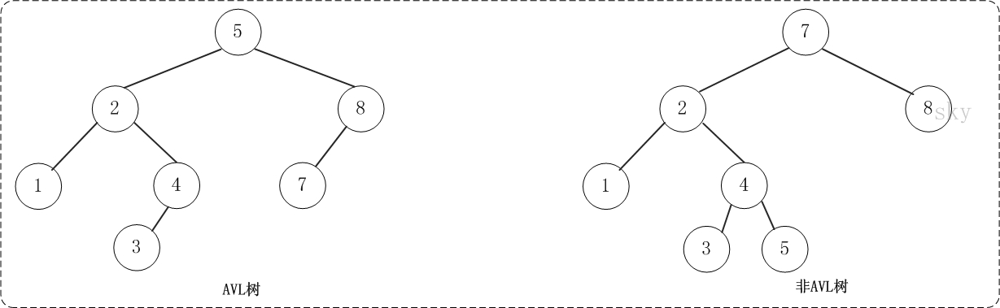


上面的两张图片，左边的是AVL树，它的任何节点的两个子树的高度差别都<=1；而右边的不是AVL树，因为7的两颗子树的高度相差为2(以2为根节点的树的高度是3，而以8为根节点的树的高度是1)。

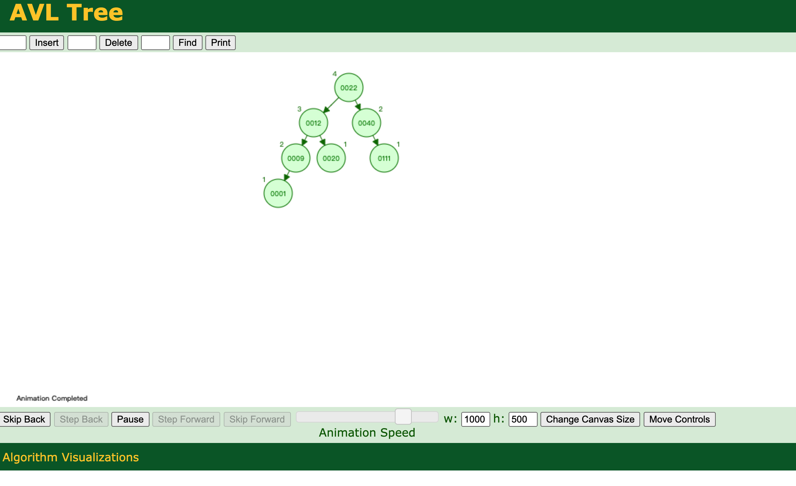

## AVL树的实现

### 节点

#### 节点定义

AVLTree是AVL树对应的类，而AVLTreeNode是AVL树节点，它是AVLTree的内部类。AVLTree包含了AVL树的根节点，AVL树的基本操作也定义在AVL树中。AVLTreeNode包括的几个组成对象:

- key -- 是关键字，是用来对AVL树的节点进行排序的。
- left -- 是左孩子。
- right -- 是右孩子。
- height -- 是高度。

```java
public class AVLTree<T extends Comparable<T>> {
    private AVLTreeNode<T> mRoot;    // 根结点

    // AVL树的节点(内部类)
    class AVLTreeNode<T extends Comparable<T>> {
        T key;                // 关键字(键值)
        int height;         // 高度
        AVLTreeNode<T> left;    // 左孩子
        AVLTreeNode<T> right;    // 右孩子

        public AVLTreeNode(T key, AVLTreeNode<T> left, AVLTreeNode<T> right) {
            this.key = key;
            this.left = left;
            this.right = right;
            this.height = 0;
        }
    }
    
    ......
}
```

#### 树的高度

关于高度，有的地方将"空二叉树的高度是-1"，而本文采用维基百科上的定义: 树的高度为最大层次。即空的二叉树的高度是0，非空树的高度等于它的最大层次(根的层次为1，根的子节点为第2层，依次类推)。

```java
/*
 * 获取树的高度
 */
private int height(AVLTreeNode<T> tree) {
    if (tree != null)
        return tree.height;

    return 0;
}

public int height() {
    return height(mRoot);
}
```

#### 比较大小

```java
/*
 * 比较两个值的大小
 */
private int max(int a, int b) {
    return a>b ? a : b;
}
```

### 旋转

如果在AVL树中进行插入或删除节点后，可能导致AVL树失去平衡。这种失去平衡的可以概括为4种姿态: LL(左左)，LR(左右)，RR(右右)和RL(右左)。下面给出它们的示意图:


上图中的4棵树都是"失去平衡的AVL树"，从左往右的情况依次是: LL、LR、RL、RR。除了上面的情况之外，还有其它的失去平衡的AVL树，如下图:


上面的两张图都是为了便于理解，而列举的关于"失去平衡的AVL树"的例子。总的来说，AVL树失去平衡时的情况一定是LL、LR、RL、RR这4种之一，它们都由各自的定义:

(1) LL: LeftLeft，也称为"左左"。插入或删除一个节点后，根节点的左子树的左子树还有非空子节点，导致"根的左子树的高度"比"根的右子树的高度"大2，导致AVL树失去了平衡。 例如，在上面LL情况中，由于"根节点(8)的左子树(4)的左子树(2)还有非空子节点"，而"根节点(8)的右子树(12)没有子节点"；导致"根节点(8)的左子树(4)高度"比"根节点(8)的右子树(12)"高2。


(2) LR: LeftRight，也称为"左右"。插入或删除一个节点后，根节点的左子树的右子树还有非空子节点，导致"根的左子树的高度"比"根的右子树的高度"大2，导致AVL树失去了平衡。 例如，在上面LR情况中，由于"根节点(8)的左子树(4)的左子树(6)还有非空子节点"，而"根节点(8)的右子树(12)没有子节点"；导致"根节点(8)的左子树(4)高度"比"根节点(8)的右子树(12)"高2。


(3) RL: RightLeft，称为"右左"。插入或删除一个节点后，根节点的右子树的左子树还有非空子节点，导致"根的右子树的高度"比"根的左子树的高度"大2，导致AVL树失去了平衡。 例如，在上面RL情况中，由于"根节点(8)的右子树(12)的左子树(10)还有非空子节点"，而"根节点(8)的左子树(4)没有子节点"；导致"根节点(8)的右子树(12)高度"比"根节点(8)的左子树(4)"高2。


(4) RR: RightRight，称为"右右"。插入或删除一个节点后，根节点的右子树的右子树还有非空子节点，导致"根的右子树的高度"比"根的左子树的高度"大2，导致AVL树失去了平衡。 例如，在上面RR情况中，由于"根节点(8)的右子树(12)的右子树(14)还有非空子节点"，而"根节点(8)的左子树(4)没有子节点"；导致"根节点(8)的右子树(12)高度"比"根节点(8)的左子树(4)"高2。


如果在AVL树中进行插入或删除节点后，可能导致AVL树失去平衡。AVL失去平衡之后，可以通过旋转使其恢复平衡，下面分别介绍"LL(左左)，LR(左右)，RR(右右)和RL(右左)"这4种情况对应的旋转方法。

#### LL的旋转

LL失去平衡的情况，可以通过一次旋转让AVL树恢复平衡。如下图:


图中左边是旋转之前的树，右边是旋转之后的树。从中可以发现，旋转之后的树又变成了AVL树，而且该旋转只需要一次即可完成。 对于LL旋转，你可以这样理解为: LL旋转是围绕"失去平衡的AVL根节点"进行的，也就是节点k2；而且由于是LL情况，即左左情况，就用手抓着"左孩子，即k1"使劲摇。将k1变成根节点，k2变成k1的右子树，"k1的右子树"变成"k2的左子树"。

```java
/*
 * LL: 左左对应的情况(左单旋转)。
 *
 * 返回值: 旋转后的根节点
 */
private AVLTreeNode<T> leftLeftRotation(AVLTreeNode<T> k2) {
    AVLTreeNode<T> k1;

    k1 = k2.left;
    k2.left = k1.right;
    k1.right = k2;

    k2.height = max( height(k2.left), height(k2.right)) + 1;
    k1.height = max( height(k1.left), k2.height) + 1;

    return k1;
}
```

#### RR的旋转

理解了LL之后，RR就相当容易理解了。RR是与LL对称的情况！RR恢复平衡的旋转方法如下:


图中左边是旋转之前的树，右边是旋转之后的树。RR旋转也只需要一次即可完成。

```java
/*
 * RR: 右右对应的情况(右单旋转)。
 *
 * 返回值: 旋转后的根节点
 */
private AVLTreeNode<T> rightRightRotation(AVLTreeNode<T> k1) {
    AVLTreeNode<T> k2;

    k2 = k1.right;
    k1.right = k2.left;
    k2.left = k1;

    k1.height = max( height(k1.left), height(k1.right)) + 1;
    k2.height = max( height(k2.right), k1.height) + 1;

    return k2;
}
```

#### LR的旋转

LR失去平衡的情况，需要经过两次旋转才能让AVL树恢复平衡。如下图:

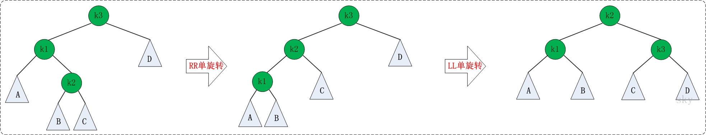

第一次旋转是围绕"k1"进行的"RR旋转"，第二次是围绕"k3"进行的"LL旋转"。

```java
/*
 * LR: 左右对应的情况(左双旋转)。
 *
 * 返回值: 旋转后的根节点
 */
private AVLTreeNode<T> leftRightRotation(AVLTreeNode<T> k3) {
    k3.left = rightRightRotation(k3.left);

    return leftLeftRotation(k3);
}
```

#### RL的旋转

RL是与LR的对称情况！RL恢复平衡的旋转方法如下:


第一次旋转是围绕"k3"进行的"LL旋转"，第二次是围绕"k1"进行的"RR旋转"。

```java
/*
 * RL: 右左对应的情况(右双旋转)。
 *
 * 返回值: 旋转后的根节点
 */
private AVLTreeNode<T> rightLeftRotation(AVLTreeNode<T> k1) {
    k1.right = leftLeftRotation(k1.right);

    return rightRightRotation(k1);
}
```

### 插入

插入节点的代码

```java
/* 
 * 将结点插入到AVL树中，并返回根节点
 *
 * 参数说明: 
 *     tree AVL树的根结点
 *     key 插入的结点的键值
 * 返回值: 
 *     根节点
 */
private AVLTreeNode<T> insert(AVLTreeNode<T> tree, T key) {
    if (tree == null) {
        // 新建节点
        tree = new AVLTreeNode<T>(key, null, null);
        if (tree==null) {
            System.out.println("ERROR: create avltree node failed!");
            return null;
        }
    } else {
        int cmp = key.compareTo(tree.key);

           if (cmp < 0) {    // 应该将key插入到"tree的左子树"的情况
            tree.left = insert(tree.left, key);
            // 插入节点后，若AVL树失去平衡，则进行相应的调节。
            if (height(tree.left) - height(tree.right) == 2) {
                if (key.compareTo(tree.left.key) < 0)
                    tree = leftLeftRotation(tree);
                else
                    tree = leftRightRotation(tree);
            }
        } else if (cmp > 0) {    // 应该将key插入到"tree的右子树"的情况
            tree.right = insert(tree.right, key);
            // 插入节点后，若AVL树失去平衡，则进行相应的调节。
            if (height(tree.right) - height(tree.left) == 2) {
                if (key.compareTo(tree.right.key) > 0)
                    tree = rightRightRotation(tree);
                else
                    tree = rightLeftRotation(tree);
            }
        } else {    // cmp==0
            System.out.println("添加失败: 不允许添加相同的节点！");
        }
    }

    tree.height = max( height(tree.left), height(tree.right)) + 1;

    return tree;
}

public void insert(T key) {
    mRoot = insert(mRoot, key);
}
```

### 删除

删除节点的代码

```java
/* 
 * 删除结点(z)，返回根节点
 *
 * 参数说明: 
 *     tree AVL树的根结点
 *     z 待删除的结点
 * 返回值: 
 *     根节点
 */
private AVLTreeNode<T> remove(AVLTreeNode<T> tree, AVLTreeNode<T> z) {
    // 根为空 或者 没有要删除的节点，直接返回null。
    if (tree==null || z==null)
        return null;

    int cmp = z.key.compareTo(tree.key);
    if (cmp < 0) {        // 待删除的节点在"tree的左子树"中
        tree.left = remove(tree.left, z);
        // 删除节点后，若AVL树失去平衡，则进行相应的调节。
        if (height(tree.right) - height(tree.left) == 2) {
            AVLTreeNode<T> r =  tree.right;
            if (height(r.left) > height(r.right))
                tree = rightLeftRotation(tree);
            else
                tree = rightRightRotation(tree);
        }
    } else if (cmp > 0) {    // 待删除的节点在"tree的右子树"中
        tree.right = remove(tree.right, z);
        // 删除节点后，若AVL树失去平衡，则进行相应的调节。
        if (height(tree.left) - height(tree.right) == 2) {
            AVLTreeNode<T> l =  tree.left;
            if (height(l.right) > height(l.left))
                tree = leftRightRotation(tree);
            else
                tree = leftLeftRotation(tree);
        }
    } else {    // tree是对应要删除的节点。
        // tree的左右孩子都非空
        if ((tree.left!=null) && (tree.right!=null)) {
            if (height(tree.left) > height(tree.right)) {
                // 如果tree的左子树比右子树高；
                // 则(01)找出tree的左子树中的最大节点
                //   (02)将该最大节点的值赋值给tree。
                //   (03)删除该最大节点。
                // 这类似于用"tree的左子树中最大节点"做"tree"的替身；
                // 采用这种方式的好处是: 删除"tree的左子树中最大节点"之后，AVL树仍然是平衡的。
                AVLTreeNode<T> max = maximum(tree.left);
                tree.key = max.key;
                tree.left = remove(tree.left, max);
            } else {
                // 如果tree的左子树不比右子树高(即它们相等，或右子树比左子树高1)
                // 则(01)找出tree的右子树中的最小节点
                //   (02)将该最小节点的值赋值给tree。
                //   (03)删除该最小节点。
                // 这类似于用"tree的右子树中最小节点"做"tree"的替身；
                // 采用这种方式的好处是: 删除"tree的右子树中最小节点"之后，AVL树仍然是平衡的。
                AVLTreeNode<T> min = maximum(tree.right);
                tree.key = min.key;
                tree.right = remove(tree.right, min);
            }
        } else {
            AVLTreeNode<T> tmp = tree;
            tree = (tree.left!=null) ? tree.left : tree.right;
            tmp = null;
        }
    }

    return tree;
}

public void remove(T key) {
    AVLTreeNode<T> z; 

    if ((z = search(mRoot, key)) != null)
        mRoot = remove(mRoot, z);
}
```


## AVL树测试

1. 新建AVL树
2. 依次添加"3,2,1,4,5,6,7,16,15,14,13,12,11,10,8,9" 到AVL树中。

2.01 添加3,2 添加3,2都不会破坏AVL树的平衡性。

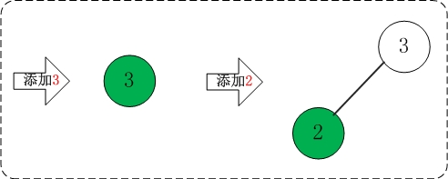


2.02 添加1 添加1之后，AVL树失去平衡(LL)，此时需要对AVL树进行旋转(LL旋转)。旋转过程如下:

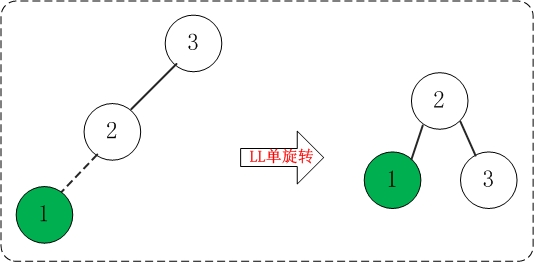


2.03 添加4 添加4不会破坏AVL树的平衡性。

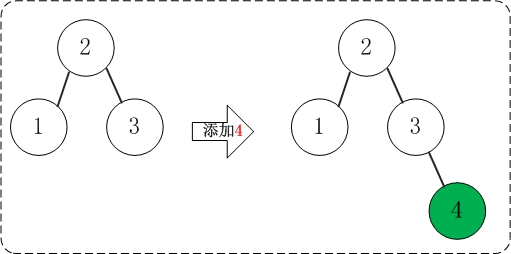


2.04 添加5 添加5之后，AVL树失去平衡(RR)，此时需要对AVL树进行旋转(RR旋转)。旋转过程如下:

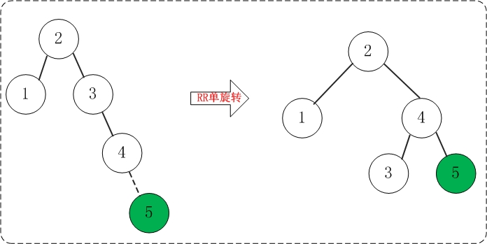


2.05 添加6 添加6之后，AVL树失去平衡(RR)，此时需要对AVL树进行旋转(RR旋转)。旋转过程如下:

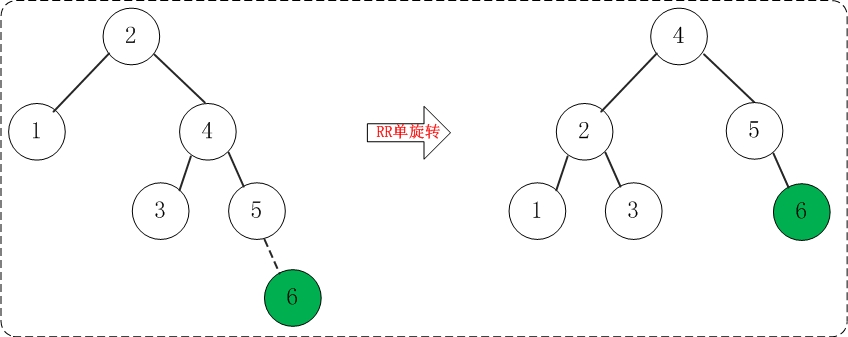


2.06 添加7 添加7之后，AVL树失去平衡(RR)，此时需要对AVL树进行旋转(RR旋转)。旋转过程如下:

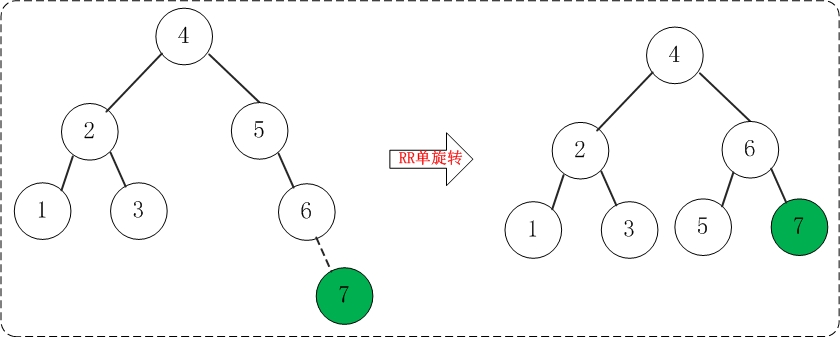


2.07 添加16 添加16不会破坏AVL树的平衡性。

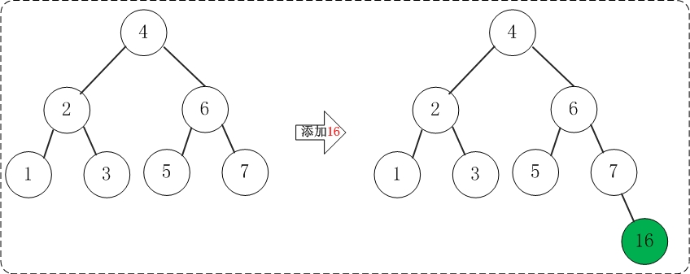

2.08 添加15 添加15之后，AVL树失去平衡(RR)，此时需要对AVL树进行旋转(RR旋转)。旋转过程如下:

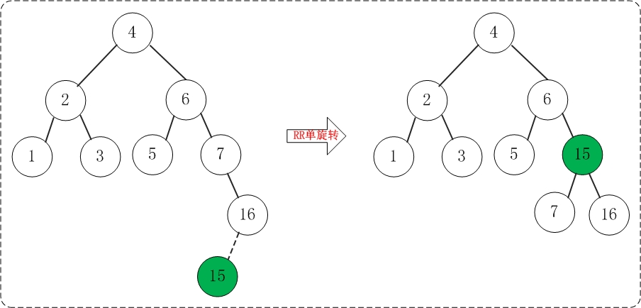


2.09 添加14 添加14之后，AVL树失去平衡(RL)，此时需要对AVL树进行旋转(RL旋转)。旋转过程如下:

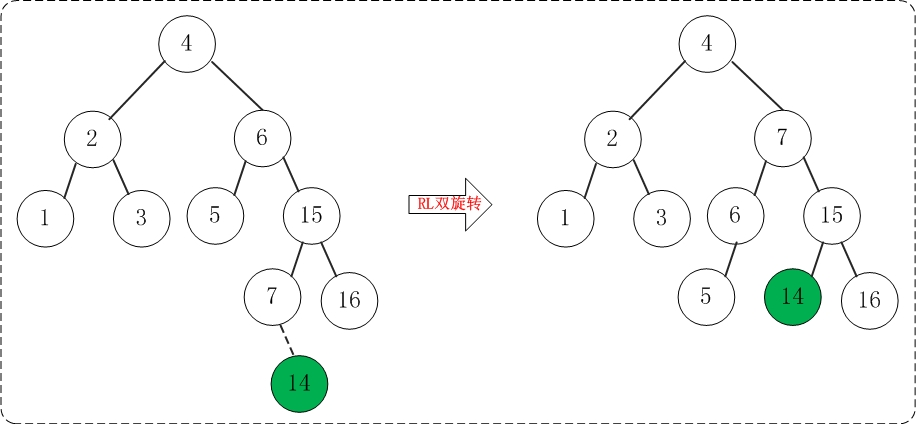


2.10 添加13 添加13之后，AVL树失去平衡(RR)，此时需要对AVL树进行旋转(RR旋转)。旋转过程如下

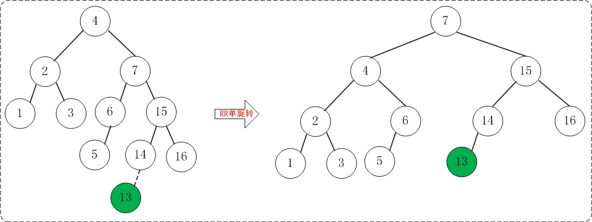


2.11 添加12 添加12之后，AVL树失去平衡(LL)，此时需要对AVL树进行旋转(LL旋转)。旋转过程如下:

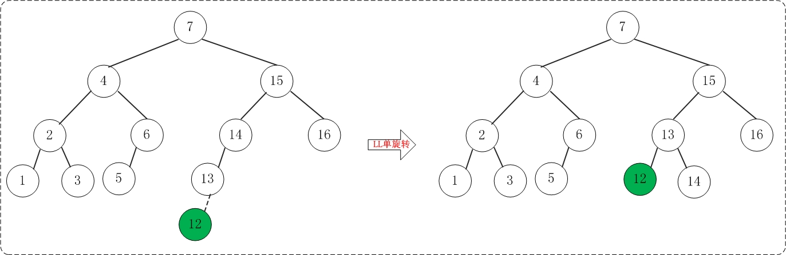


2.12 添加11 添加11之后，AVL树失去平衡(LL)，此时需要对AVL树进行旋转(LL旋转)。旋转过程如下:

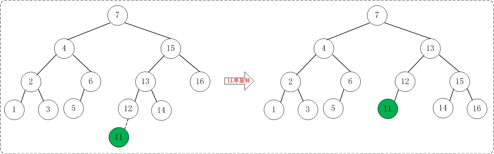


2.13 添加10 添加10之后，AVL树失去平衡(LL)，此时需要对AVL树进行旋转(LL旋转)。旋转过程如下:

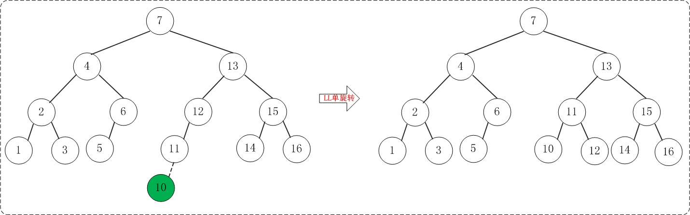


2.14 添加8 添加8不会破坏AVL树的平衡性。

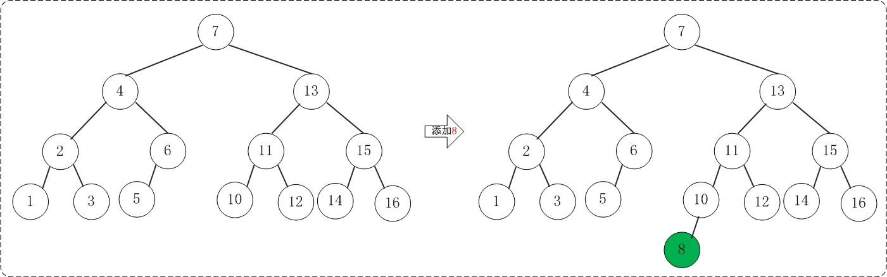


2.15 添加9 但是添加9之后，AVL树失去平衡(LR)，此时需要对AVL树进行旋转(LR旋转)。旋转过程如下:

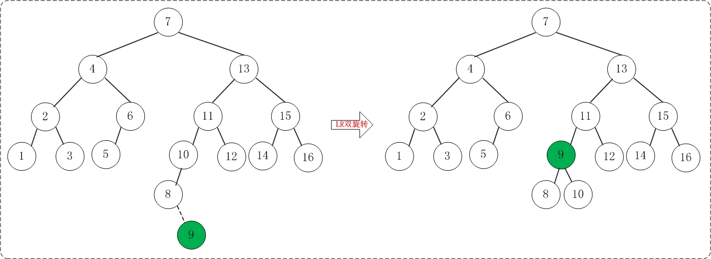


3.打印树的信息

输出下面树的信息:

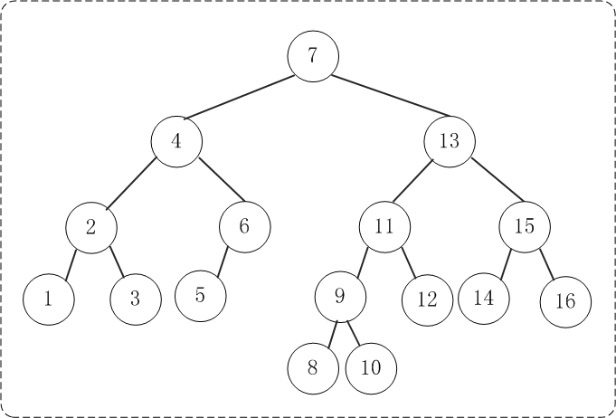

```sh
前序遍历: 7 4 2 1 3 6 5 13 11 9 8 10 12 15 14 16 
中序遍历: 1 2 3 4 5 6 7 8 9 10 11 12 13 14 15 16 
后序遍历: 1 3 2 5 6 4 8 10 9 12 11 14 16 15 13 7 
高度: 5
最小值: 1
最大值: 16
```

4.删除节点8

删除操作并不会造成AVL树的不平衡。

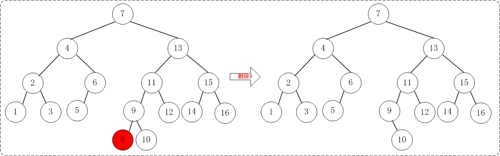

删除节点8之后，再打印该AVL树的信息。

```sh
高度: 5
中序遍历: 1 2 3 4 5 6 7 9 10 11 12 13 14 15 16
```


## 完整实现和测试的代码

### AVL 完整实现代码

```java
/**
 * Java 语言: AVL树
 *
 * @author skywang
 * @date 2013/11/07
 */

public class AVLTree<T extends Comparable<T>> {
    private AVLTreeNode<T> mRoot;    // 根结点

    // AVL树的节点(内部类)
    class AVLTreeNode<T extends Comparable<T>> {
        T key;                // 关键字(键值)
        int height;         // 高度
        AVLTreeNode<T> left;    // 左孩子
        AVLTreeNode<T> right;    // 右孩子

        public AVLTreeNode(T key, AVLTreeNode<T> left, AVLTreeNode<T> right) {
            this.key = key;
            this.left = left;
            this.right = right;
            this.height = 0;
        }
    }

    // 构造函数
    public AVLTree() {
        mRoot = null;
    }

    /*
     * 获取树的高度
     */
    private int height(AVLTreeNode<T> tree) {
        if (tree != null)
            return tree.height;

        return 0;
    }

    public int height() {
        return height(mRoot);
    }

    /*
     * 比较两个值的大小
     */
    private int max(int a, int b) {
        return a>b ? a : b;
    }

    /*
     * 前序遍历"AVL树"
     */
    private void preOrder(AVLTreeNode<T> tree) {
        if(tree != null) {
            System.out.print(tree.key+" ");
            preOrder(tree.left);
            preOrder(tree.right);
        }
    }

    public void preOrder() {
        preOrder(mRoot);
    }

    /*
     * 中序遍历"AVL树"
     */
    private void inOrder(AVLTreeNode<T> tree) {
        if(tree != null)
        {
            inOrder(tree.left);
            System.out.print(tree.key+" ");
            inOrder(tree.right);
        }
    }

    public void inOrder() {
        inOrder(mRoot);
    }

    /*
     * 后序遍历"AVL树"
     */
    private void postOrder(AVLTreeNode<T> tree) {
        if(tree != null) {
            postOrder(tree.left);
            postOrder(tree.right);
            System.out.print(tree.key+" ");
        }
    }

    public void postOrder() {
        postOrder(mRoot);
    }

    /*
     * (递归实现)查找"AVL树x"中键值为key的节点
     */
    private AVLTreeNode<T> search(AVLTreeNode<T> x, T key) {
        if (x==null)
            return x;

        int cmp = key.compareTo(x.key);
        if (cmp < 0)
            return search(x.left, key);
        else if (cmp > 0)
            return search(x.right, key);
        else
            return x;
    }

    public AVLTreeNode<T> search(T key) {
        return search(mRoot, key);
    }

    /*
     * (非递归实现)查找"AVL树x"中键值为key的节点
     */
    private AVLTreeNode<T> iterativeSearch(AVLTreeNode<T> x, T key) {
        while (x!=null) {
            int cmp = key.compareTo(x.key);

            if (cmp < 0)
                x = x.left;
            else if (cmp > 0)
                x = x.right;
            else
                return x;
        }

        return x;
    }

    public AVLTreeNode<T> iterativeSearch(T key) {
        return iterativeSearch(mRoot, key);
    }

    /* 
     * 查找最小结点: 返回tree为根结点的AVL树的最小结点。
     */
    private AVLTreeNode<T> minimum(AVLTreeNode<T> tree) {
        if (tree == null)
            return null;

        while(tree.left != null)
            tree = tree.left;
        return tree;
    }

    public T minimum() {
        AVLTreeNode<T> p = minimum(mRoot);
        if (p != null)
            return p.key;

        return null;
    }
     
    /* 
     * 查找最大结点: 返回tree为根结点的AVL树的最大结点。
     */
    private AVLTreeNode<T> maximum(AVLTreeNode<T> tree) {
        if (tree == null)
            return null;

        while(tree.right != null)
            tree = tree.right;
        return tree;
    }

    public T maximum() {
        AVLTreeNode<T> p = maximum(mRoot);
        if (p != null)
            return p.key;

        return null;
    }

    /*
     * LL: 左左对应的情况(左单旋转)。
     *
     * 返回值: 旋转后的根节点
     */
    private AVLTreeNode<T> leftLeftRotation(AVLTreeNode<T> k2) {
        AVLTreeNode<T> k1;

        k1 = k2.left;
        k2.left = k1.right;
        k1.right = k2;

        k2.height = max( height(k2.left), height(k2.right)) + 1;
        k1.height = max( height(k1.left), k2.height) + 1;

        return k1;
    }

    /*
     * RR: 右右对应的情况(右单旋转)。
     *
     * 返回值: 旋转后的根节点
     */
    private AVLTreeNode<T> rightRightRotation(AVLTreeNode<T> k1) {
        AVLTreeNode<T> k2;

        k2 = k1.right;
        k1.right = k2.left;
        k2.left = k1;

        k1.height = max( height(k1.left), height(k1.right)) + 1;
        k2.height = max( height(k2.right), k1.height) + 1;

        return k2;
    }

    /*
     * LR: 左右对应的情况(左双旋转)。
     *
     * 返回值: 旋转后的根节点
     */
    private AVLTreeNode<T> leftRightRotation(AVLTreeNode<T> k3) {
        k3.left = rightRightRotation(k3.left);

        return leftLeftRotation(k3);
    }

    /*
     * RL: 右左对应的情况(右双旋转)。
     *
     * 返回值: 旋转后的根节点
     */
    private AVLTreeNode<T> rightLeftRotation(AVLTreeNode<T> k1) {
        k1.right = leftLeftRotation(k1.right);

        return rightRightRotation(k1);
    }

    /* 
     * 将结点插入到AVL树中，并返回根节点
     *
     * 参数说明: 
     *     tree AVL树的根结点
     *     key 插入的结点的键值
     * 返回值: 
     *     根节点
     */
    private AVLTreeNode<T> insert(AVLTreeNode<T> tree, T key) {
        if (tree == null) {
            // 新建节点
            tree = new AVLTreeNode<T>(key, null, null);
            if (tree==null) {
                System.out.println("ERROR: create avltree node failed!");
                return null;
            }
        } else {
            int cmp = key.compareTo(tree.key);

               if (cmp < 0) {    // 应该将key插入到"tree的左子树"的情况
                tree.left = insert(tree.left, key);
                // 插入节点后，若AVL树失去平衡，则进行相应的调节。
                if (height(tree.left) - height(tree.right) == 2) {
                    if (key.compareTo(tree.left.key) < 0)
                        tree = leftLeftRotation(tree);
                    else
                        tree = leftRightRotation(tree);
                }
            } else if (cmp > 0) {    // 应该将key插入到"tree的右子树"的情况
                tree.right = insert(tree.right, key);
                // 插入节点后，若AVL树失去平衡，则进行相应的调节。
                if (height(tree.right) - height(tree.left) == 2) {
                    if (key.compareTo(tree.right.key) > 0)
                        tree = rightRightRotation(tree);
                    else
                        tree = rightLeftRotation(tree);
                }
            } else {    // cmp==0
                System.out.println("添加失败: 不允许添加相同的节点！");
            }
        }

        tree.height = max( height(tree.left), height(tree.right)) + 1;

        return tree;
    }

    public void insert(T key) {
        mRoot = insert(mRoot, key);
    }

    /* 
     * 删除结点(z)，返回根节点
     *
     * 参数说明: 
     *     tree AVL树的根结点
     *     z 待删除的结点
     * 返回值: 
     *     根节点
     */
    private AVLTreeNode<T> remove(AVLTreeNode<T> tree, AVLTreeNode<T> z) {
        // 根为空 或者 没有要删除的节点，直接返回null。
        if (tree==null || z==null)
            return null;

        int cmp = z.key.compareTo(tree.key);
        if (cmp < 0) {        // 待删除的节点在"tree的左子树"中
            tree.left = remove(tree.left, z);
            // 删除节点后，若AVL树失去平衡，则进行相应的调节。
            if (height(tree.right) - height(tree.left) == 2) {
                AVLTreeNode<T> r =  tree.right;
                if (height(r.left) > height(r.right))
                    tree = rightLeftRotation(tree);
                else
                    tree = rightRightRotation(tree);
            }
        } else if (cmp > 0) {    // 待删除的节点在"tree的右子树"中
            tree.right = remove(tree.right, z);
            // 删除节点后，若AVL树失去平衡，则进行相应的调节。
            if (height(tree.left) - height(tree.right) == 2) {
                AVLTreeNode<T> l =  tree.left;
                if (height(l.right) > height(l.left))
                    tree = leftRightRotation(tree);
                else
                    tree = leftLeftRotation(tree);
            }
        } else {    // tree是对应要删除的节点。
            // tree的左右孩子都非空
            if ((tree.left!=null) && (tree.right!=null)) {
                if (height(tree.left) > height(tree.right)) {
                    // 如果tree的左子树比右子树高；
                    // 则(01)找出tree的左子树中的最大节点
                    //   (02)将该最大节点的值赋值给tree。
                    //   (03)删除该最大节点。
                    // 这类似于用"tree的左子树中最大节点"做"tree"的替身；
                    // 采用这种方式的好处是: 删除"tree的左子树中最大节点"之后，AVL树仍然是平衡的。
                    AVLTreeNode<T> max = maximum(tree.left);
                    tree.key = max.key;
                    tree.left = remove(tree.left, max);
                } else {
                    // 如果tree的左子树不比右子树高(即它们相等，或右子树比左子树高1)
                    // 则(01)找出tree的右子树中的最小节点
                    //   (02)将该最小节点的值赋值给tree。
                    //   (03)删除该最小节点。
                    // 这类似于用"tree的右子树中最小节点"做"tree"的替身；
                    // 采用这种方式的好处是: 删除"tree的右子树中最小节点"之后，AVL树仍然是平衡的。
                    AVLTreeNode<T> min = minimum(tree.right);
                    tree.key = min.key;
                    tree.right = remove(tree.right, min);
                }
            } else {
                AVLTreeNode<T> tmp = tree;
                tree = (tree.left!=null) ? tree.left : tree.right;
                tmp = null;
            }
        }

        tree.height = max(height(tree.left), height(tree.right)) + 1;

        return tree;
    }

    public void remove(T key) {
        AVLTreeNode<T> z; 

        if ((z = search(mRoot, key)) != null)
            mRoot = remove(mRoot, z);
    }

    /* 
     * 销毁AVL树
     */
    private void destroy(AVLTreeNode<T> tree) {
        if (tree==null)
            return ;

        if (tree.left != null)
            destroy(tree.left);
        if (tree.right != null)
            destroy(tree.right);

        tree = null;
    }

    public void destroy() {
        destroy(mRoot);
    }

    /*
     * 打印"二叉查找树"
     *
     * key        -- 节点的键值 
     * direction  --  0，表示该节点是根节点;
     *               -1，表示该节点是它的父结点的左孩子;
     *                1，表示该节点是它的父结点的右孩子。
     */
    private void print(AVLTreeNode<T> tree, T key, int direction) {
        if(tree != null) {
            if(direction==0)    // tree是根节点
                System.out.printf("%2d is root\n", tree.key, key);
            else                // tree是分支节点
                System.out.printf("%2d is %2d's %6s child\n", tree.key, key, direction==1?"right" : "left");

            print(tree.left, tree.key, -1);
            print(tree.right,tree.key,  1);
        }
    }

    public void print() {
        if (mRoot != null)
            print(mRoot, mRoot.key, 0);
    }
}
```

### AVL 完整测试代码

```java
/**
 * Java 语言: AVL树
 *
 * @author skywang
 * @date 2013/11/07
 */

public class AVLTreeTest {
    private static int arr[]= {3,2,1,4,5,6,7,16,15,14,13,12,11,10,8,9};

    public static void main(String[] args) {
        int i;
        AVLTree<Integer> tree = new AVLTree<Integer>();

        System.out.printf("== 依次添加: ");
        for(i=0; i<arr.length; i++) {
            System.out.printf("%d ", arr[i]);
            tree.insert(arr[i]);
        }

        System.out.printf("\n== 前序遍历: ");
        tree.preOrder();

        System.out.printf("\n== 中序遍历: ");
        tree.inOrder();

        System.out.printf("\n== 后序遍历: ");
        tree.postOrder();
        System.out.printf("\n");

        System.out.printf("== 高度: %d\n", tree.height());
        System.out.printf("== 最小值: %d\n", tree.minimum());
        System.out.printf("== 最大值: %d\n", tree.maximum());
        System.out.printf("== 树的详细信息: \n");
        tree.print();

        i = 8;
        System.out.printf("\n== 删除根节点: %d", i);
        tree.remove(i);

        System.out.printf("\n== 高度: %d", tree.height());
        System.out.printf("\n== 中序遍历: ");
        tree.inOrder();
        System.out.printf("\n== 树的详细信息: \n");
        tree.print();

        // 销毁二叉树
        tree.destroy();
    }
}
```

### 测试结果

```java
== 依次添加: 3 2 1 4 5 6 7 16 15 14 13 12 11 10 8 9 
== 前序遍历: 7 4 2 1 3 6 5 13 11 9 8 10 12 15 14 16 
== 中序遍历: 1 2 3 4 5 6 7 8 9 10 11 12 13 14 15 16 
== 后序遍历: 1 3 2 5 6 4 8 10 9 12 11 14 16 15 13 7 
== 高度: 5
== 最小值: 1
== 最大值: 16
== 树的详细信息: 
 7 is root
 4 is  7's   left child
 2 is  4's   left child
 1 is  2's   left child
 3 is  2's  right child
 6 is  4's  right child
 5 is  6's   left child
13 is  7's  right child
11 is 13's   left child
 9 is 11's   left child
 8 is  9's   left child
10 is  9's  right child
12 is 11's  right child
15 is 13's  right child
14 is 15's   left child
16 is 15's  right child

== 删除根节点: 8
== 高度: 5
== 中序遍历: 1 2 3 4 5 6 7 9 10 11 12 13 14 15 16 
== 树的详细信息: 
 7 is root
 4 is  7's   left child
 2 is  4's   left child
 1 is  2's   left child
 3 is  2's  right child
 6 is  4's  right child
 5 is  6's   left child
13 is  7's  right child
11 is 13's   left child
 9 is 11's   left child
10 is  9's  right child
12 is 11's  right child
15 is 13's  right child
14 is 15's   left child
16 is 15's  right child
```

