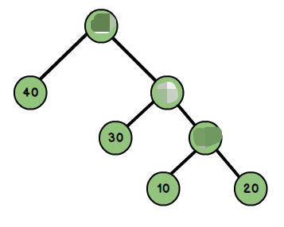
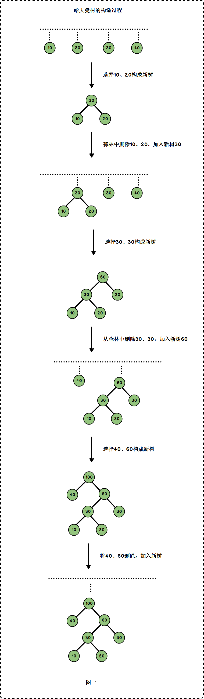
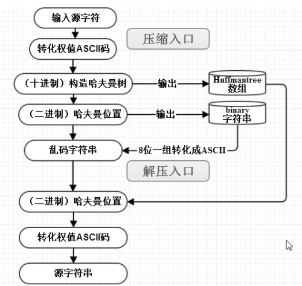

# 🤔👀 树 - 哈夫曼树(Huffman Tree)

哈夫曼又称最优二叉树, 是一种带权路径长度最短的二叉树。(注意带权路径WPL是指叶子节点，很多网上的文章有误导) 

## 哈夫曼树相关名词

先看一棵哈夫曼树: (哈夫曼树推理是通过叶子节点，所以理解的时候需要忽略非叶子节点，很多文章在这点上有误导)



- `路径与路径长度`: 从树中一个节点到另一个节点之间的分支构成了两个节点之间的路径，路径上的分支数目称作路径长度。若规定根节点位于第一层，则根节点到第H层的节点的路径长度为H-1。如到40 的路径长度为1；30的路径长度为2；20的路径长度为3。


- `节点的权`: 将树中的节点赋予一个某种含义的数值作为该节点的权值，该值称为节点的权；


- `带权路径长度`: 从根节点到某个节点之间的路径长度与该节点的权的乘积。例如上图节点10的路径长度为3,它的带权路径长度为10 * 3 = 30；


- `树的带权路径长度`: 树的带权路径长度为所有叶子节点的带权路径长度之和，称为WPL。上图的WPL = 1x40+2x30+3x10+3x20 = 190，而哈夫曼树就是树的带权路径最小的二叉树。

## 哈夫曼树的构建

假设有n个权值，则构造出的哈夫曼树有n个叶子结点。 n个权值分别设为 w1、w2、…、wn，哈夫曼树的构造规则为:

- 将w1、w2、…，wn看成是有n 棵树的森林(每棵树仅有一个结点)；
- 在森林中选出根结点的权值最小的两棵树进行合并，作为一棵新树的左、右子树，且新树的根结点权值为其左、右子树根结点权值之和；
- 从森林中删除选取的两棵树，并将新树加入森林；
- 重复上面两步，直到森林中只剩一棵树为止，该树即为所求得的哈夫曼树。

上图中，它的叶子节点为{10，20，30，40}，以这4个权值构建哈夫曼树的过程为:




## 哈夫曼编码

为{10，20，30，40}这四个权值构建了哈夫曼编码后，我们可以由如下规则获得它们的哈夫曼编码:

从根节点到每一个叶子节点的路径上，左分支记为0，右分支记为1，将这些0与1连起来即为叶子节点的哈夫曼编码。如下图:

| (字母)权值 | 编码 |
| :--------: | :--: |
|     10     | 100  |
|     20     | 101  |
|     30     |  11  |
|     40     |  0   |

由此可见，出现频率越高的字母(也即权值越大)，其编码越短。这便使编码之后的字符串的平均长度、期望值降低，从而达到无损压缩数据的目的。

具体流程如下:




## 哈夫曼树的实现

哈夫曼树的重点是如何构造哈夫曼树。本文构造哈夫曼时，用到了"(二叉堆)最小堆"。下面对哈夫曼树进行讲解。

- 哈夫曼树节点

```java
public class HuffmanNode implements Comparable, Cloneable {
    protected int key;              // 权值
    protected HuffmanNode left;     // 左孩子
    protected HuffmanNode right;    // 右孩子
    protected HuffmanNode parent;   // 父结点

    protected HuffmanNode(int key, HuffmanNode left, HuffmanNode right, HuffmanNode parent) {
        this.key = key;
        this.left = left;
        this.right = right;
        this.parent = parent;
    }

    @Override
    public Object clone() {
        Object obj=null;

        try {
            obj = (HuffmanNode)super.clone();//Object 中的clone()识别出你要复制的是哪一个对象。    
        } catch(CloneNotSupportedException e) {
            System.out.println(e.toString());
        }

        return obj;    
    }

    @Override
    public int compareTo(Object obj) {
        return this.key - ((HuffmanNode)obj).key;
    }
}
```

- 哈夫曼树

```java
import java.util.List;
import java.util.ArrayList;
import java.util.Collections;

public class Huffman {

	private HuffmanNode mRoot;	// 根结点

	/* 
	 * 创建Huffman树
	 *
	 * @param 权值数组
	 */
	public Huffman(int a[]) {
        HuffmanNode parent = null;
		MinHeap heap;

		// 建立数组a对应的最小堆
		heap = new MinHeap(a);
	 
		for(int i=0; i<a.length-1; i++) {   
        	HuffmanNode left = heap.dumpFromMinimum();  // 最小节点是左孩子
        	HuffmanNode right = heap.dumpFromMinimum(); // 其次才是右孩子
	 
			// 新建parent节点，左右孩子分别是left/right；
			// parent的大小是左右孩子之和
			parent = new HuffmanNode(left.key+right.key, left, right, null);
			left.parent = parent;
			right.parent = parent;

			// 将parent节点数据拷贝到"最小堆"中
			heap.insert(parent);
		}

		mRoot = parent;

		// 销毁最小堆
		heap.destroy();
	}

	/*
	 * 前序遍历"Huffman树"
	 */
	private void preOrder(HuffmanNode tree) {
		if(tree != null) {
			System.out.print(tree.key+" ");
			preOrder(tree.left);
			preOrder(tree.right);
		}
	}

	public void preOrder() {
		preOrder(mRoot);
	}

	/*
	 * 中序遍历"Huffman树"
	 */
	private void inOrder(HuffmanNode tree) {
		if(tree != null) {
			inOrder(tree.left);
			System.out.print(tree.key+" ");
			inOrder(tree.right);
		}
	}

	public void inOrder() {
		inOrder(mRoot);
	}


	/*
	 * 后序遍历"Huffman树"
	 */
	private void postOrder(HuffmanNode tree) {
		if(tree != null)
		{
			postOrder(tree.left);
			postOrder(tree.right);
			System.out.print(tree.key+" ");
		}
	}

	public void postOrder() {
		postOrder(mRoot);
	}

	/*
	 * 销毁Huffman树
	 */
	private void destroy(HuffmanNode tree) {
		if (tree==null)
			return ;

		if (tree.left != null)
			destroy(tree.left);
		if (tree.right != null)
			destroy(tree.right);

		tree=null;
	}

	public void destroy() {
		destroy(mRoot);
		mRoot = null;
	}

	/*
	 * 打印"Huffman树"
	 *
	 * key        -- 节点的键值 
	 * direction  --  0，表示该节点是根节点;
	 *               -1，表示该节点是它的父结点的左孩子;
	 *                1，表示该节点是它的父结点的右孩子。
	 */
	private void print(HuffmanNode tree, int key, int direction) {

		if(tree != null) {

			if(direction==0)	// tree是根节点
				System.out.printf("%2d is root\n", tree.key);
			else				// tree是分支节点
				System.out.printf("%2d is %2d's %6s child\n", tree.key, key, direction==1?"right" : "left");

			print(tree.left, tree.key, -1);
			print(tree.right,tree.key,  1);
		}
	}

	public void print() {
		if (mRoot != null)
			print(mRoot, mRoot.key, 0);
	}
}
```

- 最小堆

```java
import java.util.ArrayList;
import java.util.List;

public class MinHeap {

	private List<HuffmanNode> mHeap;		// 存放堆的数组

	/* 
	 * 创建最小堆
	 *
	 * 参数说明：
	 *     a -- 数据所在的数组
	 */
	protected MinHeap(int a[]) {
		mHeap = new ArrayList<HuffmanNode>();
		// 初始化数组
		for(int i=0; i<a.length; i++) {
		    HuffmanNode node = new HuffmanNode(a[i], null, null, null);
			mHeap.add(node);
		}

		// 从(size/2-1) --> 0逐次遍历。遍历之后，得到的数组实际上是一个最小堆。
		for (int i = a.length / 2 - 1; i >= 0; i--)
			filterdown(i, a.length-1);
	}

	/* 
	 * 最小堆的向下调整算法
	 *
	 * 注：数组实现的堆中，第N个节点的左孩子的索引值是(2N+1)，右孩子的索引是(2N+2)。
	 *
	 * 参数说明：
	 *     start -- 被下调节点的起始位置(一般为0，表示从第1个开始)
	 *     end   -- 截至范围(一般为数组中最后一个元素的索引)
	 */
	protected void filterdown(int start, int end) {
		int c = start; 	 	// 当前(current)节点的位置
		int l = 2*c + 1; 	// 左(left)孩子的位置
		HuffmanNode tmp = mHeap.get(c);	// 当前(current)节点

		while(l <= end) {
			// "l"是左孩子，"l+1"是右孩子
			if(l < end && (mHeap.get(l).compareTo(mHeap.get(l+1))>0))
				l++;		// 左右两孩子中选择较小者，即mHeap[l+1]

			int cmp = tmp.compareTo(mHeap.get(l));
			if(cmp <= 0)
				break;		//调整结束
			else {
				mHeap.set(c, mHeap.get(l));
				c = l;
				l = 2*l + 1;   
			}       
		}   
		mHeap.set(c, tmp);
	}
	
	/*
	 * 最小堆的向上调整算法(从start开始向上直到0，调整堆)
	 *
	 * 注：数组实现的堆中，第N个节点的左孩子的索引值是(2N+1)，右孩子的索引是(2N+2)。
	 *
	 * 参数说明：
	 *     start -- 被上调节点的起始位置(一般为数组中最后一个元素的索引)
	 */
	protected void filterup(int start) {
		int c = start;			// 当前节点(current)的位置
		int p = (c-1)/2;		// 父(parent)结点的位置 
		HuffmanNode tmp = mHeap.get(c);	// 当前(current)节点

		while(c > 0) {
			int cmp = mHeap.get(p).compareTo(tmp);
			if(cmp <= 0)
				break;
			else {
				mHeap.set(c, mHeap.get(p));
				c = p;
				p = (p-1)/2;   
			}       
		}
		mHeap.set(c, tmp);
	} 
 
	/* 
	 * 将node插入到二叉堆中
	 */
	protected void insert(HuffmanNode node) {
		int size = mHeap.size();

		mHeap.add(node);	// 将"数组"插在表尾
		filterup(size);		// 向上调整堆
	}

	/*
	 * 交换两个HuffmanNode节点的全部数据
	 */
	private void swapNode(int i, int j) {
		HuffmanNode tmp = mHeap.get(i);
		mHeap.set(i, mHeap.get(j));
		mHeap.set(j, tmp);
	}

	/* 
	 * 新建一个节点，并将最小堆中最小节点的数据复制给该节点。
	 * 然后除最小节点之外的数据重新构造成最小堆。
	 *
	 * 返回值：
	 *     失败返回null。
	 */
	protected HuffmanNode dumpFromMinimum() {
		int size = mHeap.size();

		// 如果"堆"已空，则返回
		if(size == 0)
			return null;

		// 将"最小节点"克隆一份，将克隆得到的对象赋值给node
		HuffmanNode node = (HuffmanNode)mHeap.get(0).clone();

		// 交换"最小节点"和"最后一个节点"
		mHeap.set(0, mHeap.get(size-1));
		// 删除最后的元素
		mHeap.remove(size-1);

		if (mHeap.size() > 1)
			filterdown(0, mHeap.size()-1);

		return node;
	}

	// 销毁最小堆
	protected void destroy() {
		mHeap.clear();
		mHeap = null;
	}
}
```

## 哈夫曼树测试

```java
public class HuffmanTest {

	private static final int a[]= {5,6,8,7,15};

	public static void main(String[] args) {
		int i;
		Huffman tree;

		System.out.print("== 添加数组: ");
		for(i=0; i<a.length; i++) 
			System.out.print(a[i]+" ");
	
		// 创建数组a对应的Huffman树
		tree = new Huffman(a);

		System.out.print("\n== 前序遍历: ");
		tree.preOrder();

		System.out.print("\n== 中序遍历: ");
		tree.inOrder();

		System.out.print("\n== 后序遍历: ");
		tree.postOrder();
		System.out.println();

		System.out.println("== 树的详细信息: ");
		tree.print();

		// 销毁二叉树
		tree.destroy();
	}
}
```


