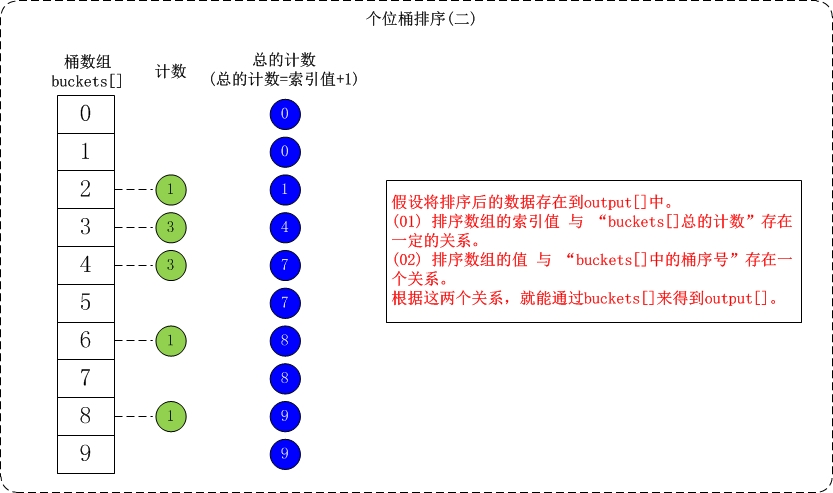

# 排序 - 基数排序(Radix Sort)

基数排序(Radix Sort)是桶排序的扩展. 

## 基数排序介绍

它的基本思想是: 将整数按位数切割成不同的数字，然后按每个位数分别比较。 具体做法是: 将所有待比较数值统一为同样的数位长度，数位较短的数前面补零。然后，从最低位开始，依次进行一次排序。这样从最低位排序一直到最高位排序完成以后, 数列就变成一个有序序列。

## 基数排序实现

通过基数排序对数组{53, 3, 542, 748, 14, 214, 154, 63, 616}，它的示意图如下:


在上图中，首先将所有待比较树脂统一为统一位数长度，接着从最低位开始，依次进行排序。

1. 按照个位数进行排序。
2. 按照十位数进行排序。
3. 按照百位数进行排序。 排序后，数列就变成了一个有序序列。

下面简单介绍一下对数组{53, 3, 542, 748, 14, 214, 154, 63, 616}按个位数进行排序的流程。

- 个位的数值范围是[0,10)。因此，参见桶数组buckets[]，将数组按照个位数值添加到桶中。


- 接着是根据桶数组buckets[]来进行排序。假设将排序后的数组存在output[]中；找出output[]和buckets[]之间的联系就可以对数据进行排序了。




## 基数排序复杂度和稳定性

### 基数排序复杂度

### 基数排序稳定性

## 代码实现

```java
public class RadixSort {

    /*
     * 获取数组a中最大值
     *
     * 参数说明: 
     *     a -- 数组
     *     n -- 数组长度
     */
    private static int getMax(int[] a) {
        int max;

        max = a[0];
        for (int i = 1; i < a.length; i++)
            if (a[i] > max)
                max = a[i];

        return max;
    }

    /*
     * 对数组按照"某个位数"进行排序(桶排序)
     *
     * 参数说明: 
     *     a -- 数组
     *     exp -- 指数。对数组a按照该指数进行排序。
     *
     * 例如，对于数组a={50, 3, 542, 745, 2014, 154, 63, 616}；
     *    (01) 当exp=1表示按照"个位"对数组a进行排序
     *    (02) 当exp=10表示按照"十位"对数组a进行排序
     *    (03) 当exp=100表示按照"百位"对数组a进行排序
     *    ...
     */
    private static void countSort(int[] a, int exp) {
        //int output[a.length];    // 存储"被排序数据"的临时数组
        int[] output = new int[a.length];    // 存储"被排序数据"的临时数组
        int[] buckets = new int[10];

        // 将数据出现的次数存储在buckets[]中
        for (int i = 0; i < a.length; i++)
            buckets[ (a[i]/exp)%10 ]++;

        // 更改buckets[i]。目的是让更改后的buckets[i]的值，是该数据在output[]中的位置。
        for (int i = 1; i < 10; i++)
            buckets[i] += buckets[i - 1];

        // 将数据存储到临时数组output[]中
        for (int i = a.length - 1; i >= 0; i--) {
            output[buckets[ (a[i]/exp)%10 ] - 1] = a[i];
            buckets[ (a[i]/exp)%10 ]--;
        }

        // 将排序好的数据赋值给a[]
        for (int i = 0; i < a.length; i++)
            a[i] = output[i];

        output = null;
        buckets = null;
    }

    /*
     * 基数排序
     *
     * 参数说明: 
     *     a -- 数组
     */
    public static void radixSort(int[] a) {
        int exp;    // 指数。当对数组按各位进行排序时，exp=1；按十位进行排序时，exp=10；...
        int max = getMax(a);    // 数组a中的最大值

        // 从个位开始，对数组a按"指数"进行排序
        for (exp = 1; max/exp > 0; exp *= 10)
            countSort(a, exp);
    }

    public static void main(String[] args) {
        int i;
        int a[] = {53, 3, 542, 748, 14, 214, 154, 63, 616};

        System.out.printf("before sort:");
        for (i=0; i<a.length; i++)
            System.out.printf("%d ", a[i]);
        System.out.printf("\n");

        radixSort(a);    // 基数排序

        System.out.printf("after  sort:");
        for (i=0; i<a.length; i++)
            System.out.printf("%d ", a[i]);
        System.out.printf("\n");
    }
}
```