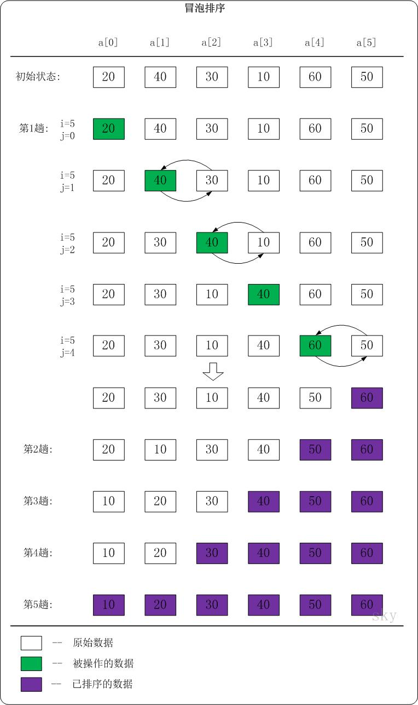

# 排序 - 冒泡排序(Bubble Sort)

最简单和最基本的排序。

## 冒泡排序介绍

它是一种较简单的排序算法。它会遍历若干次要排序的数列，每次遍历时，它都会从前往后依次的比较相邻两个数的大小；如果前者比后者大，则交换它们的位置。这样，一次遍历之后，最大的元素就在数列的末尾！ 采用相同的方法再次遍历时，第二大的元素就被排列在最大元素之前。重复此操作，直到整个数列都有序为止！

## 冒泡排序实现

下面以数列{20,40,30,10,60,50}为例，演示它的冒泡排序过程(如下图)。




分析第1趟排序

- 当i=5,j=0时，a[0]<a[1]。此时，不做任何处理！

  

- 当i=5,j=1时，a[1]>a[2]。此时，交换a[1]和a[2]的值；交换之后，a[1]=30，a[2]=40。


- 当i=5,j=2时，a[2]>a[3]。此时，交换a[2]和a[3]的值；交换之后，a[2]=10，a[3]=40。


- 当i=5,j=3时，a[3]<a[4]。此时，不做任何处理！


- 当i=5,j=4时，a[4]>a[5]。此时，交换a[4]和a[5]的值；交换之后，a[4]=50，a[3]=60。


于是，第1趟排序完之后，数列{20,40,30,10,60,50}变成了{20,30,10,40,50,60}。此时，数列末尾的值最大。

根据这种方法:

- 第2趟排序完之后，数列中a[5...6]是有序的。
- 第3趟排序完之后，数列中a[4...6]是有序的。
- 第4趟排序完之后，数列中a[3...6]是有序的。
- 第5趟排序完之后，数列中a[1...6]是有序的。整个数列也就是有序的了。

## 复杂度和稳定性

### 冒泡排序时间复杂度

冒泡排序的时间复杂度是O(N2)。 假设被排序的数列中有N个数。遍历一趟的时间复杂度是O(N)，需要遍历多少次呢? N-1次！因此，冒泡排序的时间复杂度是O(N2)。

### 冒泡排序稳定性

冒泡排序是稳定的算法，它满足稳定算法的定义。 算法稳定性 -- 假设在数列中存在a[i]=a[j]，若在排序之前，a[i]在a[j]前面；并且排序之后，a[i]仍然在a[j]前面。则这个排序算法是稳定的！

## 代码实现

```java
public class BubbleSort {

    /*
     * 冒泡排序
     *
     * 参数说明: 
     *     a -- 待排序的数组
     *     n -- 数组的长度
     */
    public static void bubbleSort1(int[] a, int n) {
        int i,j;

        for (i=n-1; i>0; i--) {
            // 将a[0...i]中最大的数据放在末尾
            for (j=0; j<i; j++) {

                if (a[j] > a[j+1]) {
                    // 交换a[j]和a[j+1]
                    int tmp = a[j];
                    a[j] = a[j+1];
                    a[j+1] = tmp;
                }
            }
        }
    }

    /*
     * 冒泡排序(改进版)
     *
     * 参数说明: 
     *     a -- 待排序的数组
     *     n -- 数组的长度
     */
    public static void bubbleSort2(int[] a, int n) {
        int i,j;
        int flag;                 // 标记

        for (i=n-1; i>0; i--) {

            flag = 0;            // 初始化标记为0
            // 将a[0...i]中最大的数据放在末尾
            for (j=0; j<i; j++) {
                if (a[j] > a[j+1]) {
                    // 交换a[j]和a[j+1]
                    int tmp = a[j];
                    a[j] = a[j+1];
                    a[j+1] = tmp;

                    flag = 1;    // 若发生交换，则设标记为1
                }
            }

            if (flag==0)
                break;            // 若没发生交换，则说明数列已有序。
        }
    }

    public static void main(String[] args) {
        int i;
        int[] a = {20,40,30,10,60,50};

        System.out.printf("before sort:");
        for (i=0; i<a.length; i++)
            System.out.printf("%d ", a[i]);
        System.out.printf("\n");

        bubbleSort1(a, a.length);
        //bubbleSort2(a, a.length);

        System.out.printf("after  sort:");
        for (i=0; i<a.length; i++)
            System.out.printf("%d ", a[i]);
        System.out.printf("\n");
    }
}
```

