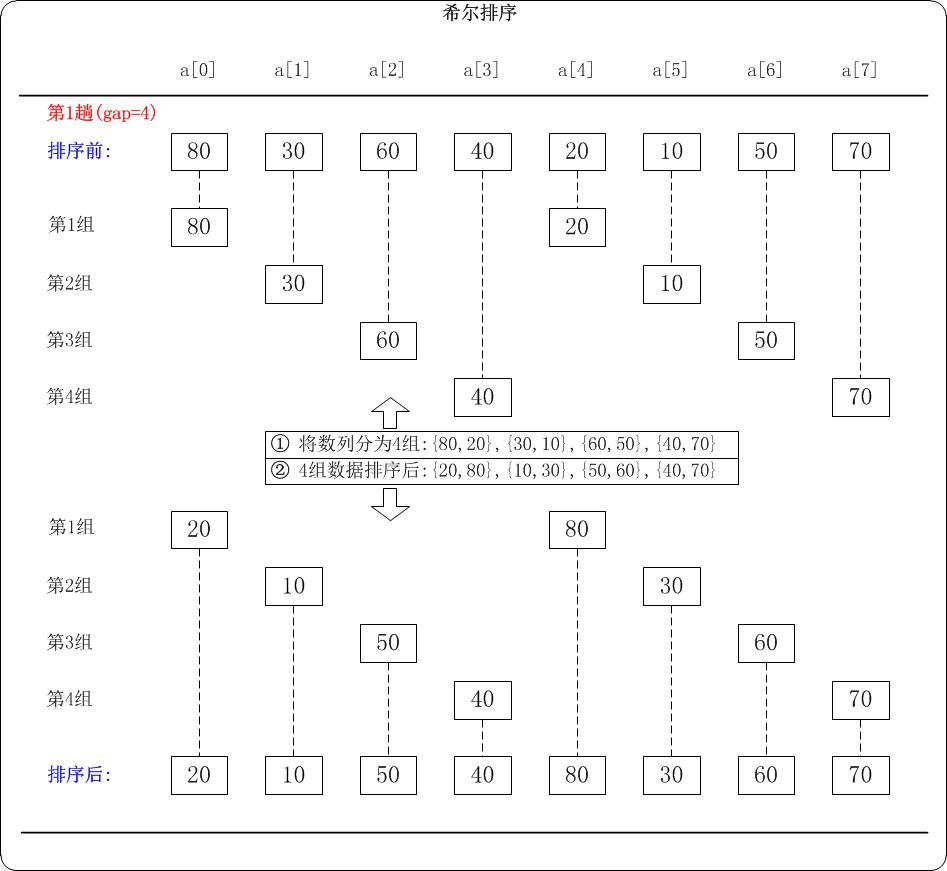

# 排序 - Shell排序(Shell Sort)

希尔排序(Shell Sort)是插入排序的一种，它是针对直接插入排序算法的改进。

## 希尔排序介绍

希尔排序实质上是一种分组插入方法。它的基本思想是: 对于n个待排序的数列，取一个小于n的整数gap(gap被称为步长)将待排序元素分成若干个组子序列，所有距离为gap的倍数的记录放在同一个组中；然后，对各组内的元素进行直接插入排序。 这一趟排序完成之后，每一个组的元素都是有序的。然后减小gap的值，并重复执行上述的分组和排序。重复这样的操作，当gap=1时，整个数列就是有序的。

## 希尔排序实现

下面以数列{80,30,60,40,20,10,50,70}为例，演示它的希尔排序过程。

第1趟: (gap=4)


当gap=4时,意味着将数列分为4个组:  

{80,20},{30,10},{60,50},{40,70}。 

对应数列:  {80,30,60,40,20,10,50,70}


对这4个组分别进行排序，

排序结果:  {20,80},{10,30},{50,60},{40,70}。 

对应数列:  {20,10,50,40,80,30,60,70} 


第2趟: (gap=2)


当gap=2时,意味着将数列分为2个组:

 {20,50,80,60}, {10,40,30,70}。 

对应数列:  {20,10,50,40,80,30,60,70} 

注意: {20,50,80,60}实际上有两个有序的数列{20,80}和{50,60}组成。

 {10,40,30,70}实际上有两个有序的数列{10,30}和{40,70}组成。 

对这2个组分别进行排序，


排序结果: {20,50,60,80}, {10,30,40,70}。 

对应数列:  {20,10,50,30,60,40,80,70}


第3趟: (gap=1)


当gap=1时,意味着将数列分为1个组: 

{20,10,50,30,60,40,80,70} 

注意:

 {20,10,50,30,60,40,80,70}

实际上有两个有序的数列{20,50,60,80}和{10,30,40,70}组成。 

对这1个组分别进行排序，排序结果: {10,20,30,40,50,60,70,80}

## 希尔排序的时间复杂度和稳定性

### 希尔排序时间复杂度

希尔排序的时间复杂度与增量(即，步长gap)的选取有关。例如，当增量为1时，希尔排序退化成了直接插入排序，此时的时间复杂度为O(N²)，而Hibbard增量的希尔排序的时间复杂度为O(N3/2)。

### 希尔排序稳定性

希尔排序是不稳定的算法，它满足稳定算法的定义。对于相同的两个数，可能由于分在不同的组中而导致它们的顺序发生变化。

`算法稳定性` -- 假设在数列中存在a[i]=a[j]，若在排序之前，a[i]在a[j]前面；并且排序之后，a[i]仍然在a[j]前面。则这个排序算法是稳定的！

## 代码实现

```java
public class ShellSort {

    /**
     * 希尔排序
     *
     * 参数说明: 
     *     a -- 待排序的数组
     *     n -- 数组的长度
     */
    public static void shellSort1(int[] a, int n) {

        // gap为步长，每次减为原来的一半。
        for (int gap = n / 2; gap > 0; gap /= 2) {

            // 共gap个组，对每一组都执行直接插入排序
            for (int i = 0 ;i < gap; i++) {

                for (int j = i + gap; j < n; j += gap) {

                    // 如果a[j] < a[j-gap]，则寻找a[j]位置，并将后面数据的位置都后移。
                    if (a[j] < a[j - gap]) {

                        int tmp = a[j];
                        int k = j - gap;
                        while (k >= 0 && a[k] > tmp) {
                            a[k + gap] = a[k];
                            k -= gap;
                        }
                        a[k + gap] = tmp;
                    }
                }
            }
        }
    }

    /**
     * 对希尔排序中的单个组进行排序
     *
     * 参数说明: 
     *     a -- 待排序的数组
     *     n -- 数组总的长度
     *     i -- 组的起始位置
     *     gap -- 组的步长
     *
     *  组是"从i开始，将相隔gap长度的数都取出"所组成的！
     */
    public static void groupSort(int[] a, int n, int i,int gap) {

        for (int j = i + gap; j < n; j += gap) {

            // 如果a[j] < a[j-gap]，则寻找a[j]位置，并将后面数据的位置都后移。
            if (a[j] < a[j - gap]) {

                int tmp = a[j];
                int k = j - gap;
                while (k >= 0 && a[k] > tmp) {
                    a[k + gap] = a[k];
                    k -= gap;
                }
                a[k + gap] = tmp;
            }
        }
    }

    /**
     * 希尔排序
     *
     * 参数说明: 
     *     a -- 待排序的数组
     *     n -- 数组的长度
     */
    public static void shellSort2(int[] a, int n) {
        // gap为步长，每次减为原来的一半。
        for (int gap = n / 2; gap > 0; gap /= 2) {
            // 共gap个组，对每一组都执行直接插入排序
            for (int i = 0 ;i < gap; i++)
                groupSort(a, n, i, gap);
        }
    }

    public static void main(String[] args) {
        int i;
        int a[] = {80,30,60,40,20,10,50,70};

        System.out.printf("before sort:");
        for (i=0; i<a.length; i++)
            System.out.printf("%d ", a[i]);
        System.out.printf("\n");

        shellSort1(a, a.length);
        //shellSort2(a, a.length);

        System.out.printf("after  sort:");
        for (i=0; i<a.length; i++)
            System.out.printf("%d ", a[i]);
        System.out.printf("\n");
    }
}
```


