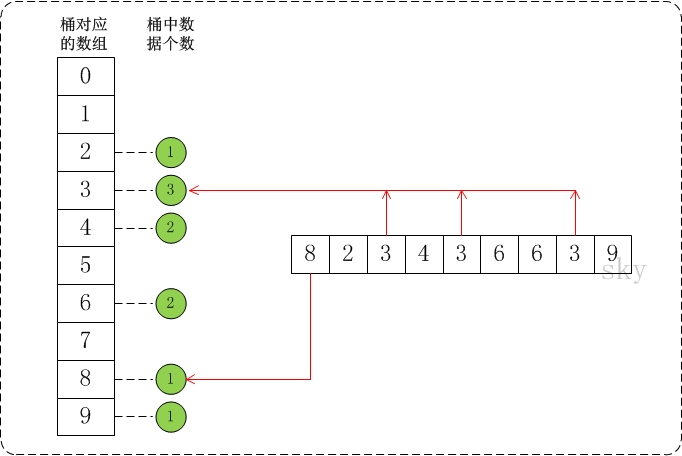

# 排序 - 桶排序(Bucket Sort)

桶排序(Bucket Sort)的原理很简单，将数组分到有限数量的桶子里。每个桶子再个别排序（有可能再使用别的排序算法或是以递归方式继续使用桶排序进行排序）。

## 桶排序介绍

假设待排序的数组a中共有N个整数，并且已知数组a中数据的范围[0, MAX)。在桶排序时，创建容量为MAX的桶数组r，并将桶数组元素都初始化为0；将容量为MAX的桶数组中的每一个单元都看作一个"桶"。

在排序时，逐个遍历数组a，将数组a的值，作为"桶数组r"的下标。当a中数据被读取时，就将桶的值加1。例如，读取到数组a[3]=5，则将r[5]的值+1。

## 桶排序实现

假设a={8,2,3,4,3,6,6,3,9}, max=10。此时，将数组a的所有数据都放到需要为0-9的桶中。如下图:




在将数据放到桶中之后，再通过一定的算法，将桶中的数据提出出来并转换成有序数组。就得到我们想要的结果了。

## 桶排序复杂度和稳定性

### 桶排序复杂度

- 平均时间复杂度: O(n + k)
- 最佳时间复杂度: O(n + k)
- 最差时间复杂度: O(n ^ 2)
- 空间复杂度: O(n * k)

桶排序最好情况下使用线性时间O(n)，桶排序的时间复杂度，取决与对各个桶之间数据进行排序的时间复杂度，因为其它部分的时间复杂度都为O(n)。很显然，桶划分的越小，各个桶之间的数据越少，排序所用的时间也会越少。但相应的空间消耗就会增大。

### 桶排序稳定性

稳定性: 稳定

## 代码实现

```java
public class BucketSort {

    /*
     * 桶排序
     *
     * 参数说明: 
     *     a -- 待排序数组
     *     max -- 数组a中最大值的范围
     */
    public static void bucketSort(int[] a, int max) {
        int[] buckets;

        if (a==null || max<1)
            return ;

        // 创建一个容量为max的数组buckets，并且将buckets中的所有数据都初始化为0。
        buckets = new int[max];

        // 1. 计数
        for(int i = 0; i < a.length; i++) 
            buckets[a[i]]++; 

        // 2. 排序
        for (int i = 0, j = 0; i < max; i++) {
            while( (buckets[i]--) >0 ) {
                a[j++] = i;
            }
        }

        buckets = null;
    }

    public static void main(String[] args) {
        int i;
        int a[] = {8,2,3,4,3,6,6,3,9};

        System.out.printf("before sort:");
        for (i=0; i<a.length; i++)
            System.out.printf("%d ", a[i]);
        System.out.printf("\n");

        bucketSort(a, 10); // 桶排序

        System.out.printf("after  sort:");
        for (i=0; i<a.length; i++)
            System.out.printf("%d ", a[i]);
        System.out.printf("\n");
    }
}
```
