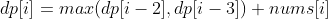
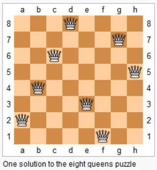

🤔👀算法思想


## 算法思想详解

- 算法思想 - 分治算法

  - 分治算法的基本思想是将一个规模为N的问题分解为K个规模较小的子问题，这些子问题相互独立且与原问题性质相同。求出子问题的解，就可得到原问题的解

  

- 算法思想 - 动态规划算法

  - 动态规划算法通常用于求解具有某种最优性质的问题。在这类问题中，可能会有许多可行解。每一个解都对应于一个值，我们希望找到具有最优值的解。动态规划算法与分治法类似，其基本思想也是将待求解问题分解成若干个子问题，先求解子问题，然后从这些子问题的解得到原问题的解

  

- 算法思想 - 贪心算法

  - 算法中贪心算法的思想: 保证每次操作都是局部最优的，并且最后得到的结果是全局最优的

  

- 算法思想 - 二分法

  - 算法思想中分治算法重要的二分法，比如二分查找；二分查找也称折半查找（Binary Search），它是一种效率较高的查找方法。但是，折半查找要求线性表必须采用顺序存储结构，而且表中元素按关键字有序排列。

  

- 算法思想 - 搜索算法

  - 算法中搜索算法的思想，主要包含BFS，DFS

  

- 算法思想 - 回溯算法

  - Backtracking(回溯)属于 DFS, 本文主要介绍算法中Backtracking算法的思想。回溯算法实际上一个类似枚举的搜索尝试过程，主要是在搜索尝试过程中寻找问题的解，当发现已不满足求解条件时，就“回溯”返回，尝试别的路径。回溯法是一种选优搜索法，按选优条件向前搜索，以达到目标。但当探索到某一步时，发现原先选择并不优或达不到目标，就退回一步重新选择，这种走不通就退回再走的技术为回溯法


## 算法思想 - 分治算法

分治算法的基本思想是将一个规模为N的问题分解为K个规模较小的子问题，这些子问题相互独立且与原问题性质相同。求出子问题的解，就可得到原问题的解。

## 分治相关题目

### 给表达式加括号

```html
Input: "2-1-1".

((2-1)-1) = 0
(2-(1-1)) = 2

Output : [0, 2]
```

```java
public List<Integer> diffWaysToCompute(String input) {
    List<Integer> ways = new ArrayList<>();
    for (int i = 0; i < input.length(); i++) {
        char c = input.charAt(i);
        if (c == '+' || c == '-' || c == '*') {
            List<Integer> left = diffWaysToCompute(input.substring(0, i));
            List<Integer> right = diffWaysToCompute(input.substring(i + 1));
            for (int l : left) {
                for (int r : right) {
                    switch (c) {
                        case '+':
                            ways.add(l + r);
                            break;
                        case '-':
                            ways.add(l - r);
                            break;
                        case '*':
                            ways.add(l * r);
                            break;
                    }
                }
            }
        }
    }
    if (ways.size() == 0) {
        ways.add(Integer.valueOf(input));
    }
    return ways;
}
```

# 算法思想 - 动态规划算法


动态规划算法通常用于求解具有某种最优性质的问题。在这类问题中，可能会有许多可行解。每一个解都对应于一个值，我们希望找到具有最优值的解。动态规划算法与分治法类似，其基本思想也是将待求解问题分解成若干个子问题，先求解子问题，然后从这些子问题的解得到原问题的解。动态规划算法在算法思想中是极为重要的，需要重点掌握。

## 动态规划相关题目

递归和动态规划都是将原问题拆成多个子问题然后求解，他们之间最本质的区别是，动态规划保存了子问题的解，避免重复计算。

### 斐波那契数列

#### 爬楼梯

题目描述: 有 N 阶楼梯，每次可以上一阶或者两阶，求有多少种上楼梯的方法。

定义一个数组 dp 存储上楼梯的方法数(为了方便讨论，数组下标从 1 开始)，dp[i] 表示走到第 i 个楼梯的方法数目。

第 i 个楼梯可以从第 i-1 和 i-2 个楼梯再走一步到达，走到第 i 个楼梯的方法数为走到第 i-1 和第 i-2 个楼梯的方法数之和。


考虑到 dp[i] 只与 dp[i - 1] 和 dp[i - 2] 有关，因此可以只用两个变量来存储 dp[i - 1] 和 dp[i - 2]，使得原来的 O(N) 空间复杂度优化为 O(1) 复杂度。

```java
public int climbStairs(int n) {
    if (n <= 2) {
        return n;
    }
    int pre2 = 1, pre1 = 2;
    for (int i = 2; i < n; i++) {
        int cur = pre1 + pre2;
        pre2 = pre1;
        pre1 = cur;
    }
    return pre1;
}
```


#### 强盗抢劫

题目描述: 抢劫一排住户，但是不能抢邻近的住户，求最大抢劫量。

定义 dp 数组用来存储最大的抢劫量，其中 dp[i] 表示抢到第 i 个住户时的最大抢劫量。

由于不能抢劫邻近住户，因此如果抢劫了第 i 个住户那么只能抢劫 i - 2 或者 i - 3 的住户，所以



```java
public int rob(int[] nums) {
    int n = nums.length;
    if (n == 0) {
        return 0;
    }
    if (n == 1) {
        return nums[0];
    }
    int pre3 = 0, pre2 = 0, pre1 = 0;
    for (int i = 0; i < n; i++) {
        int cur = Math.max(pre2, pre3) + nums[i];
        pre3 = pre2;
        pre2 = pre1;
        pre1 = cur;
    }
    return Math.max(pre1, pre2);
}
```


#### 强盗在环形街区抢劫

```java
public int rob(int[] nums) {
    if (nums == null || nums.length == 0) {
        return 0;
    }
    int n = nums.length;
    if (n == 1) {
        return nums[0];
    }
    return Math.max(rob(nums, 0, n - 2), rob(nums, 1, n - 1));
}

private int rob(int[] nums, int first, int last) {
    int pre3 = 0, pre2 = 0, pre1 = 0;
    for (int i = first; i <= last; i++) {
        int cur = Math.max(pre3, pre2) + nums[i];
        pre3 = pre2;
        pre2 = pre1;
        pre1 = cur;
    }
    return Math.max(pre2, pre1);
}
```

#### 信件错排

题目描述: 有 N 个 信 和 信封，它们被打乱，求错误装信方式的数量。

定义一个数组 dp 存储错误方式数量，dp[i] 表示前 i 个信和信封的错误方式数量。假设第 i 个信装到第 j 个信封里面，而第 j 个信装到第 k 个信封里面。根据 i 和 k 是否相等，有两种情况:

- i==k，交换 i 和 k 的信后，它们的信和信封在正确的位置，但是其余 i-2 封信有 dp[i-2] 种错误装信的方式。由于 j 有 i-1 种取值，因此共有 (i-1)*dp[i-2] 种错误装信方式。
- i != k，交换 i 和 j 的信后，第 i 个信和信封在正确的位置，其余 i-1 封信有 dp[i-1] 种错误装信方式。由于 j 有 i-1 种取值，因此共有 (i-1)*dp[i-1] 种错误装信方式。

综上所述，错误装信数量方式数量为:

-16352391237211.gif)


#### 母牛生产

题目描述: 假设农场中成熟的母牛每年都会生 1 头小母牛，并且永远不会死。第一年有 1 只小母牛，从第二年开始，母牛开始生小母牛。每只小母牛 3 年之后成熟又可以生小母牛。给定整数 N，求 N 年后牛的数量。

第 i 年成熟的牛的数量为:

.gif)


### 矩阵路径

#### 矩阵的最小路径和

```html
[[1,3,1],
 [1,5,1],
 [4,2,1]]
Given the above grid map, return 7. Because the path 1→3→1→1→1 minimizes the sum.
```

题目描述: 求从矩阵的左上角到右下角的最小路径和，每次只能向右和向下移动。

```java
public int minPathSum(int[][] grid) {
    if (grid.length == 0 || grid[0].length == 0) {
        return 0;
    }
    int m = grid.length, n = grid[0].length;
    int[] dp = new int[n];
    for (int i = 0; i < m; i++) {
        for (int j = 0; j < n; j++) {
            if (i == 0) {
                dp[j] = dp[j - 1];
            } else {
                dp[j] = Math.min(dp[j - 1], dp[j]);
            }
            dp[j] += grid[i][j];
        }
    }
    return dp[n - 1];
}
```

#### 矩阵的总路径数

题目描述: 统计从矩阵左上角到右下角的路径总数，每次只能向右或者向下移动。

.jpg)


```java
public int uniquePaths(int m, int n) {
    int[] dp = new int[n];
    Arrays.fill(dp, 1);
    for (int i = 1; i < m; i++) {
        for (int j = 1; j < n; j++) {
            dp[j] = dp[j] + dp[j - 1];
        }
    }
    return dp[n - 1];
}
```

也可以直接用数学公式求解，这是一个组合问题。机器人总共移动的次数 S=m+n-2，向下移动的次数 D=m-1，那么问题可以看成从 S 从取出 D 个位置的组合数量，这个问题的解为 C(S, D)。

```java
public int uniquePaths(int m, int n) {
    int S = m + n - 2;  // 总共的移动次数
    int D = m - 1;      // 向下的移动次数
    long ret = 1;
    for (int i = 1; i <= D; i++) {
        ret = ret * (S - D + i) / i;
    }
    return (int) ret;
}
```

### 数组区间

#### 数组区间和

```html
Given nums = [-2, 0, 3, -5, 2, -1]

sumRange(0, 2) -> 1
sumRange(2, 5) -> -1
sumRange(0, 5) -> -3
```

求区间 i ~ j 的和，可以转换为 sum[j] - sum[i-1]，其中 sum[i] 为 0 ~ i 的和。

```java
class NumArray {

    private int[] sums;

    public NumArray(int[] nums) {
        sums = new int[nums.length + 1];
        for (int i = 1; i <= nums.length; i++) {
            sums[i] = sums[i - 1] + nums[i - 1];
        }
    }

    public int sumRange(int i, int j) {
        return sums[j + 1] - sums[i];
    }
}
```


#### 子数组最大的和

```html
For example, given the array [-2,1,-3,4,-1,2,1,-5,4],
the contiguous subarray [4,-1,2,1] has the largest sum = 6.
```

```java
public int maxSubArray(int[] nums) {
    if (nums == null || nums.length == 0) {
        return 0;
    }
    int preSum = nums[0];
    int maxSum = preSum;
    for (int i = 1; i < nums.length; i++) {
        preSum = preSum > 0 ? preSum + nums[i] : nums[i];
        maxSum = Math.max(maxSum, preSum);
    }
    return maxSum;
}
```

#### 数组中等差递增子区间的个数

```html
A = [1, 2, 3, 4]
return: 3, for 3 arithmetic slices in A: [1, 2, 3], [2, 3, 4] and [1, 2, 3, 4] itself.
```

dp[i] 表示以 A[i] 为结尾的等差递增子区间的个数。

在 A[i] - A[i - 1] == A[i - 1] - A[i - 2] 的条件下，{A[i - 2], A[i - 1], A[i]} 是一个等差递增子区间。如果 {A[i - 3], A[i - 2], A[i - 1]} 是一个等差递增子区间，那么 {A[i - 3], A[i - 2], A[i - 1], A[i]} 也是等差递增子区间，dp[i] = dp[i-1] + 1。

```java
public int numberOfArithmeticSlices(int[] A) {
    if (A == null || A.length == 0) {
        return 0;
    }
    int n = A.length;
    int[] dp = new int[n];
    for (int i = 2; i < n; i++) {
        if (A[i] - A[i - 1] == A[i - 1] - A[i - 2]) {
            dp[i] = dp[i - 1] + 1;
        }
    }
    int total = 0;
    for (int cnt : dp) {
        total += cnt;
    }
    return total;
}
```

### 分割整数

#### 分割整数的最大乘积

题目描述: For example, given n = 2, return 1 (2 = 1 + 1); given n = 10, return 36 (10 = 3 + 3 + 4).

```java
public int integerBreak(int n) {
    int[] dp = new int[n + 1];
    dp[1] = 1;
    for (int i = 2; i <= n; i++) {
        for (int j = 1; j <= i - 1; j++) {
            dp[i] = Math.max(dp[i], Math.max(j * dp[i - j], j * (i - j)));
        }
    }
    return dp[n];
}
```

#### 按平方数来分割整数

题目描述: For example, given n = 12, return 3 because 12 = 4 + 4 + 4; given n = 13, return 2 because 13 = 4 + 9.

```java
public int numSquares(int n) {
    List<Integer> squareList = generateSquareList(n);
    int[] dp = new int[n + 1];
    for (int i = 1; i <= n; i++) {
        int min = Integer.MAX_VALUE;
        for (int square : squareList) {
            if (square > i) {
                break;
            }
            min = Math.min(min, dp[i - square] + 1);
        }
        dp[i] = min;
    }
    return dp[n];
}

private List<Integer> generateSquareList(int n) {
    List<Integer> squareList = new ArrayList<>();
    int diff = 3;
    int square = 1;
    while (square <= n) {
        squareList.add(square);
        square += diff;
        diff += 2;
    }
    return squareList;
}
```

#### 分割整数构成字母字符串

题目描述: Given encoded message "12", it could be decoded as "AB" (1 2) or "L" (12).

```java
public int numDecodings(String s) {
    if (s == null || s.length() == 0) {
        return 0;
    }
    int n = s.length();
    int[] dp = new int[n + 1];
    dp[0] = 1;
    dp[1] = s.charAt(0) == '0' ? 0 : 1;
    for (int i = 2; i <= n; i++) {
        int one = Integer.valueOf(s.substring(i - 1, i));
        if (one != 0) {
            dp[i] += dp[i - 1];
        }
        if (s.charAt(i - 2) == '0') {
            continue;
        }
        int two = Integer.valueOf(s.substring(i - 2, i));
        if (two <= 26) {
            dp[i] += dp[i - 2];
        }
    }
    return dp[n];
}
```

### 最长递增子序列

已知一个序列 {S1, S2,...,Sn}，取出若干数组成新的序列 {Si1, Si2,..., Sim}，其中 i1、i2 ... im 保持递增，即新序列中各个数仍然保持原数列中的先后顺序，称新序列为原序列的一个 子序列 。

如果在子序列中，当下标 ix > iy 时，Six > Siy，称子序列为原序列的一个 递增子序列 。


定义一个数组 dp 存储最长递增子序列的长度，dp[n] 表示以 Sn 结尾的序列的最长递增子序列长度。对于一个递增子序列 {Si1, Si2,...,Sim}，如果 im < n 并且 Sim < Sn，此时 {Si1, Si2,..., Sim, Sn} 为一个递增子序列，递增子序列的长度增加 1。满足上述条件的递增子序列中，长度最长的那个递增子序列就是要找的，在长度最长的递增子序列上加上 Sn 就构成了以 Sn 为结尾的最长递增子序列。因此 dp[n] = max{ dp[i]+1 | Si < Sn && i < n} 。

因为在求 dp[n] 时可能无法找到一个满足条件的递增子序列，此时 {Sn} 就构成了递增子序列，需要对前面的求解方程做修改，令 dp[n] 最小为 1，即:


对于一个长度为 N 的序列，最长递增子序列并不一定会以 SN 为结尾，因此 dp[N] 不是序列的最长递增子序列的长度，需要遍历 dp 数组找出最大值才是所要的结果，max{ dp[i] | 1 <= i <= N} 即为所求。


#### 最长递增子序列

```java
public int lengthOfLIS(int[] nums) {
    int n = nums.length;
    int[] dp = new int[n];
    for (int i = 0; i < n; i++) {
        int max = 1;
        for (int j = 0; j < i; j++) {
            if (nums[i] > nums[j]) {
                max = Math.max(max, dp[j] + 1);
            }
        }
        dp[i] = max;
    }
    return Arrays.stream(dp).max().orElse(0);
}
```

使用 Stream 求最大值会导致运行时间过长，可以改成以下形式:

```jav
int ret = 0;
for (int i = 0; i < n; i++) {
    ret = Math.max(ret, dp[i]);
}
return ret;
```

以上解法的时间复杂度为 O(N2)，可以使用二分查找将时间复杂度降低为 O(NlogN)。

定义一个 tails 数组，其中 tails[i] 存储长度为 i + 1 的最长递增子序列的最后一个元素。对于一个元素 x，

- 如果它大于 tails 数组所有的值，那么把它添加到 tails 后面，表示最长递增子序列长度加 1；
- 如果 tails[i-1] < x <= tails[i]，那么更新 tails[i-1] = x。

例如对于数组 [4,3,6,5]，有:

```html
tails      len      num
[]         0        4
[4]        1        3
[3]        1        6
[3,6]      2        5
[3,5]      2        null
```

可以看出 tails 数组保持有序，因此在查找 Si 位于 tails 数组的位置时就可以使用二分查找。

```java
public int lengthOfLIS(int[] nums) {
    int n = nums.length;
    int[] tails = new int[n];
    int len = 0;
    for (int num : nums) {
        int index = binarySearch(tails, len, num);
        tails[index] = num;
        if (index == len) {
            len++;
        }
    }
    return len;
}

private int binarySearch(int[] tails, int len, int key) {
    int l = 0, h = len;
    while (l < h) {
        int mid = l + (h - l) / 2;
        if (tails[mid] == key) {
            return mid;
        } else if (tails[mid] > key) {
            h = mid;
        } else {
            l = mid + 1;
        }
    }
    return l;
}
```

#### 一组整数对能够构成的最长链

```html
Input: [[1,2], [2,3], [3,4]]
Output: 2
Explanation: The longest chain is [1,2] -> [3,4]
```

题目描述: 对于 (a, b) 和 (c, d) ，如果 b < c，则它们可以构成一条链。

```java
public int findLongestChain(int[][] pairs) {
    if (pairs == null || pairs.length == 0) {
        return 0;
    }
    Arrays.sort(pairs, (a, b) -> (a[0] - b[0]));
    int n = pairs.length;
    int[] dp = new int[n];
    Arrays.fill(dp, 1);
    for (int i = 1; i < n; i++) {
        for (int j = 0; j < i; j++) {
            if (pairs[j][1] < pairs[i][0]) {
                dp[i] = Math.max(dp[i], dp[j] + 1);
            }
        }
    }
    return Arrays.stream(dp).max().orElse(0);
}
```

#### 最长摆动子序列

```html
Input: [1,7,4,9,2,5]
Output: 6
The entire sequence is a wiggle sequence.

Input: [1,17,5,10,13,15,10,5,16,8]
Output: 7
There are several subsequences that achieve this length. One is [1,17,10,13,10,16,8].

Input: [1,2,3,4,5,6,7,8,9]
Output: 2
```

要求: 使用 O(N) 时间复杂度求解。

```java
public int wiggleMaxLength(int[] nums) {
    if (nums == null || nums.length == 0) {
        return 0;
    }
    int up = 1, down = 1;
    for (int i = 1; i < nums.length; i++) {
        if (nums[i] > nums[i - 1]) {
            up = down + 1;
        } else if (nums[i] < nums[i - 1]) {
            down = up + 1;
        }
    }
    return Math.max(up, down);
}
```

### 最长公共子序列

对于两个子序列 S1 和 S2，找出它们最长的公共子序列。

定义一个二维数组 dp 用来存储最长公共子序列的长度，其中 dp[i][j] 表示 S1 的前 i 个字符与 S2 的前 j 个字符最长公共子序列的长度。考虑 S1i 与 S2j 值是否相等，分为两种情况:

- 当 S1i==S2j 时，那么就能在 S1 的前 i-1 个字符与 S2 的前 j-1 个字符最长公共子序列的基础上再加上 S1i 这个值，最长公共子序列长度加 1，即 dp[i][j] = dp[i-1][j-1] + 1。
- 当 S1i != S2j 时，此时最长公共子序列为 S1 的前 i-1 个字符和 S2 的前 j 个字符最长公共子序列，或者 S1 的前 i 个字符和 S2 的前 j-1 个字符最长公共子序列，取它们的最大者，即 dp[i][j] = max{ dp[i-1][j], dp[i][j-1] }。

综上，最长公共子序列的状态转移方程为:


对于长度为 N 的序列 S1 和长度为 M 的序列 S2，dp[N][M] 就是序列 S1 和序列 S2 的最长公共子序列长度。

与最长递增子序列相比，最长公共子序列有以下不同点:

- 针对的是两个序列，求它们的最长公共子序列。
- 在最长递增子序列中，dp[i] 表示以 Si 为结尾的最长递增子序列长度，子序列必须包含 Si ；在最长公共子序列中，dp[i][j] 表示 S1 中前 i 个字符与 S2 中前 j 个字符的最长公共子序列长度，不一定包含 S1i 和 S2j。
- 在求最终解时，最长公共子序列中 dp[N][M] 就是最终解，而最长递增子序列中 dp[N] 不是最终解，因为以 SN 为结尾的最长递增子序列不一定是整个序列最长递增子序列，需要遍历一遍 dp 数组找到最大者。

```java
public int lengthOfLCS(int[] nums1, int[] nums2) {
    int n1 = nums1.length, n2 = nums2.length;
    int[][] dp = new int[n1 + 1][n2 + 1];
    for (int i = 1; i <= n1; i++) {
        for (int j = 1; j <= n2; j++) {
            if (nums1[i - 1] == nums2[j - 1]) {
                dp[i][j] = dp[i - 1][j - 1] + 1;
            } else {
                dp[i][j] = Math.max(dp[i - 1][j], dp[i][j - 1]);
            }
        }
    }
    return dp[n1][n2];
}
```

### 0-1 背包

有一个容量为 N 的背包，要用这个背包装下物品的价值最大，这些物品有两个属性: 体积 w 和价值 v。

定义一个二维数组 dp 存储最大价值，其中 dp[i][j] 表示前 i 件物品体积不超过 j 的情况下能达到的最大价值。设第 i 件物品体积为 w，价值为 v，根据第 i 件物品是否添加到背包中，可以分两种情况讨论:

- 第 i 件物品没添加到背包，总体积不超过 j 的前 i 件物品的最大价值就是总体积不超过 j 的前 i-1 件物品的最大价值，dp[i][j] = dp[i-1][j]。
- 第 i 件物品添加到背包中，dp[i][j] = dp[i-1][j-w] + v。

第 i 件物品可添加也可以不添加，取决于哪种情况下最大价值更大。因此，0-1 背包的状态转移方程为:

.gif)


```java
public int knapsack(int W, int N, int[] weights, int[] values) {
    int[][] dp = new int[N + 1][W + 1];
    for (int i = 1; i <= N; i++) {
        int w = weights[i - 1], v = values[i - 1];
        for (int j = 1; j <= W; j++) {
            if (j >= w) {
                dp[i][j] = Math.max(dp[i - 1][j], dp[i - 1][j - w] + v);
            } else {
                dp[i][j] = dp[i - 1][j];
            }
        }
    }
    return dp[N][W];
}
```


#### 空间优化

在程序实现时可以对 0-1 背包做优化。观察状态转移方程可以知道，前 i 件物品的状态仅与前 i-1 件物品的状态有关，因此可以将 dp 定义为一维数组，其中 dp[j] 既可以表示 dp[i-1][j] 也可以表示 dp[i][j]。此时，

-16352392439202.gif)


因为 dp[j-w] 表示 dp[i-1][j-w]，因此不能先求 dp[i][j-w]，以防将 dp[i-1][j-w] 覆盖。也就是说要先计算 dp[i][j] 再计算 dp[i][j-w]，在程序实现时需要按倒序来循环求解。

```java
public int knapsack(int W, int N, int[] weights, int[] values) {
    int[] dp = new int[W + 1];
    for (int i = 1; i <= N; i++) {
        int w = weights[i - 1], v = values[i - 1];
        for (int j = W; j >= 1; j--) {
            if (j >= w) {
                dp[j] = Math.max(dp[j], dp[j - w] + v);
            }
        }
    }
    return dp[W];
}
```

无法使用贪心算法的解释

0-1 背包问题无法使用贪心算法来求解，也就是说不能按照先添加性价比最高的物品来达到最优，这是因为这种方式可能造成背包空间的浪费，从而无法达到最优。考虑下面的物品和一个容量为 5 的背包，如果先添加物品 0 再添加物品 1，那么只能存放的价值为 16，浪费了大小为 2 的空间。最优的方式是存放物品 1 和物品 2，价值为 22.

|  id  |  w   |  v   | v/w  |
| :--: | :--: | :--: | :--: |
|  0   |  1   |  6   |  6   |
|  1   |  2   |  10  |  5   |
|  2   |  3   |  12  |  4   |

变种

- 完全背包: 物品数量为无限个
- 多重背包: 物品数量有限制
- 多维费用背包: 物品不仅有重量，还有体积，同时考虑这两种限制
- 其它: 物品之间相互约束或者依赖

#### 划分数组为和相等的两部分

```html
Input: [1, 5, 11, 5]

Output: true

Explanation: The array can be partitioned as [1, 5, 5] and [11].
```

可以看成一个背包大小为 sum/2 的 0-1 背包问题。

```java
public boolean canPartition(int[] nums) {
    int sum = computeArraySum(nums);
    if (sum % 2 != 0) {
        return false;
    }
    int W = sum / 2;
    boolean[] dp = new boolean[W + 1];
    dp[0] = true;
    Arrays.sort(nums);
    for (int num : nums) {                 // 0-1 背包一个物品只能用一次
        for (int i = W; i >= num; i--) {   // 从后往前，先计算 dp[i] 再计算 dp[i-num]
            dp[i] = dp[i] || dp[i - num];
        }
    }
    return dp[W];
}

private int computeArraySum(int[] nums) {
    int sum = 0;
    for (int num : nums) {
        sum += num;
    }
    return sum;
}
```

#### 改变一组数的正负号使得它们的和为一给定数

```html
Input: nums is [1, 1, 1, 1, 1], S is 3.
Output: 5
Explanation:

-1+1+1+1+1 = 3
+1-1+1+1+1 = 3
+1+1-1+1+1 = 3
+1+1+1-1+1 = 3
+1+1+1+1-1 = 3

There are 5 ways to assign symbols to make the sum of nums be target 3.
```

该问题可以转换为 Subset Sum 问题，从而使用 0-1 背包的方法来求解。

可以将这组数看成两部分，P 和 N，其中 P 使用正号，N 使用负号，有以下推导:

```html
                  sum(P) - sum(N) = target
sum(P) + sum(N) + sum(P) - sum(N) = target + sum(P) + sum(N)
                       2 * sum(P) = target + sum(nums)
```

因此只要找到一个子集，令它们都取正号，并且和等于 (target + sum(nums))/2，就证明存在解。

```java
public int findTargetSumWays(int[] nums, int S) {
    int sum = computeArraySum(nums);
    if (sum < S || (sum + S) % 2 == 1) {
        return 0;
    }
    int W = (sum + S) / 2;
    int[] dp = new int[W + 1];
    dp[0] = 1;
    Arrays.sort(nums);
    for (int num : nums) {
        for (int i = W; i >= num; i--) {
            dp[i] = dp[i] + dp[i - num];
        }
    }
    return dp[W];
}

private int computeArraySum(int[] nums) {
    int sum = 0;
    for (int num : nums) {
        sum += num;
    }
    return sum;
}
```

DFS 解法:

```java
public int findTargetSumWays(int[] nums, int S) {
    return findTargetSumWays(nums, 0, S);
}

private int findTargetSumWays(int[] nums, int start, int S) {
    if (start == nums.length) {
        return S == 0 ? 1 : 0;
    }
    return findTargetSumWays(nums, start + 1, S + nums[start])
            + findTargetSumWays(nums, start + 1, S - nums[start]);
}
```


#### 字符串按单词列表分割

```html
s = "leetcode",
dict = ["leet", "code"].
Return true because "leetcode" can be segmented as "leet code".
```

dict 中的单词没有使用次数的限制，因此这是一个完全背包问题。

0-1 背包和完全背包在实现上的不同之处是，0-1 背包对物品的迭代是在最外层，而完全背包对物品的迭代是在最里层。

```java
public boolean wordBreak(String s, List<String> wordDict) {
    int n = s.length();
    boolean[] dp = new boolean[n + 1];
    dp[0] = true;
    for (int i = 1; i <= n; i++) {
        for (String word : wordDict) {   // 完全一个物品可以使用多次
            int len = word.length();
            if (len <= i && word.equals(s.substring(i - len, i))) {
                dp[i] = dp[i] || dp[i - len];
            }
        }
    }
    return dp[n];
}
```

#### 01 字符构成最多的字符串

```html
Input: Array = {"10", "0001", "111001", "1", "0"}, m = 5, n = 3
Output: 4

Explanation: There are totally 4 strings can be formed by the using of 5 0s and 3 1s, which are "10","0001","1","0"
```

这是一个多维费用的 0-1 背包问题，有两个背包大小，0 的数量和 1 的数量。

```java
public int findMaxForm(String[] strs, int m, int n) {
    if (strs == null || strs.length == 0) {
        return 0;
    }
    int[][] dp = new int[m + 1][n + 1];
    for (String s : strs) {    // 每个字符串只能用一次
        int ones = 0, zeros = 0;
        for (char c : s.toCharArray()) {
            if (c == '0') {
                zeros++;
            } else {
                ones++;
            }
        }
        for (int i = m; i >= zeros; i--) {
            for (int j = n; j >= ones; j--) {
                dp[i][j] = Math.max(dp[i][j], dp[i - zeros][j - ones] + 1);
            }
        }
    }
    return dp[m][n];
}
```

#### 找零钱的最少硬币数

```html
Example 1:
coins = [1, 2, 5], amount = 11
return 3 (11 = 5 + 5 + 1)

Example 2:
coins = [2], amount = 3
return -1.
```

题目描述: 给一些面额的硬币，要求用这些硬币来组成给定面额的钱数，并且使得硬币数量最少。硬币可以重复使用。

- 物品: 硬币
- 物品大小: 面额
- 物品价值: 数量

因为硬币可以重复使用，因此这是一个完全背包问题。

```java
public int coinChange(int[] coins, int amount) {
    if (coins == null || coins.length == 0) {
        return 0;
    }
    int[] minimum = new int[amount + 1];
    Arrays.fill(minimum, amount + 1);
    minimum[0] = 0;
    Arrays.sort(coins);
    for (int i = 1; i <= amount; i++) {
        for (int j = 0; j < coins.length && coins[j] <= i; j++) {
            minimum[i] = Math.min(minimum[i], minimum[i - coins[j]] + 1);
        }
    }
    return minimum[amount] > amount ? -1 : minimum[amount];
}
```

#### 组合总和

```html
nums = [1, 2, 3]
target = 4

The possible combination ways are:
(1, 1, 1, 1)
(1, 1, 2)
(1, 2, 1)
(1, 3)
(2, 1, 1)
(2, 2)
(3, 1)

Note that different sequences are counted as different combinations.

Therefore the output is 7.
```

#### 完全背包。

```java
public int combinationSum4(int[] nums, int target) {
    if (nums == null || nums.length == 0) {
        return 0;
    }
    int[] maximum = new int[target + 1];
    maximum[0] = 1;
    Arrays.sort(nums);
    for (int i = 1; i <= target; i++) {
        for (int j = 0; j < nums.length && nums[j] <= i; j++) {
            maximum[i] += maximum[i - nums[j]];
        }
    }
    return maximum[target];
}
```

### 股票交易

#### 需要冷却期的股票交易

题目描述: 交易之后需要有一天的冷却时间。


```java
public int maxProfit(int[] prices) {
    if (prices == null || prices.length == 0) {
        return 0;
    }
    int N = prices.length;
    int[] buy = new int[N];
    int[] s1 = new int[N];
    int[] sell = new int[N];
    int[] s2 = new int[N];
    s1[0] = buy[0] = -prices[0];
    sell[0] = s2[0] = 0;
    for (int i = 1; i < N; i++) {
        buy[i] = s2[i - 1] - prices[i];
        s1[i] = Math.max(buy[i - 1], s1[i - 1]);
        sell[i] = Math.max(buy[i - 1], s1[i - 1]) + prices[i];
        s2[i] = Math.max(s2[i - 1], sell[i - 1]);
    }
    return Math.max(sell[N - 1], s2[N - 1]);
}
```

#### 需要交易费用的股票交易

```html
Input: prices = [1, 3, 2, 8, 4, 9], fee = 2
Output: 8
Explanation: The maximum profit can be achieved by:
Buying at prices[0] = 1
Selling at prices[3] = 8
Buying at prices[4] = 4
Selling at prices[5] = 9
The total profit is ((8 - 1) - 2) + ((9 - 4) - 2) = 8.
```

题目描述: 每交易一次，都要支付一定的费用。


```java
public int maxProfit(int[] prices, int fee) {
    int N = prices.length;
    int[] buy = new int[N];
    int[] s1 = new int[N];
    int[] sell = new int[N];
    int[] s2 = new int[N];
    s1[0] = buy[0] = -prices[0];
    sell[0] = s2[0] = 0;
    for (int i = 1; i < N; i++) {
        buy[i] = Math.max(sell[i - 1], s2[i - 1]) - prices[i];
        s1[i] = Math.max(buy[i - 1], s1[i - 1]);
        sell[i] = Math.max(buy[i - 1], s1[i - 1]) - fee + prices[i];
        s2[i] = Math.max(s2[i - 1], sell[i - 1]);
    }
    return Math.max(sell[N - 1], s2[N - 1]);
}
```


#### 买入和售出股票最大的收益

题目描述: 只进行一次交易。

只要记录前面的最小价格，将这个最小价格作为买入价格，然后将当前的价格作为售出价格，查看当前收益是不是最大收益。

```java
public int maxProfit(int[] prices) {
    int n = prices.length;
    if (n == 0) return 0;
    int soFarMin = prices[0];
    int max = 0;
    for (int i = 1; i < n; i++) {
        if (soFarMin > prices[i]) soFarMin = prices[i];
        else max = Math.max(max, prices[i] - soFarMin);
    }
    return max;
}
```

#### 只能进行两次的股票交易

```java
public int maxProfit(int[] prices) {
    int firstBuy = Integer.MIN_VALUE, firstSell = 0;
    int secondBuy = Integer.MIN_VALUE, secondSell = 0;
    for (int curPrice : prices) {
        if (firstBuy < -curPrice) {
            firstBuy = -curPrice;
        }
        if (firstSell < firstBuy + curPrice) {
            firstSell = firstBuy + curPrice;
        }
        if (secondBuy < firstSell - curPrice) {
            secondBuy = firstSell - curPrice;
        }
        if (secondSell < secondBuy + curPrice) {
            secondSell = secondBuy + curPrice;
        }
    }
    return secondSell;
}
```

#### 只能进行 k 次的股票交易

```java
public int maxProfit(int k, int[] prices) {
    int n = prices.length;
    if (k >= n / 2) {   // 这种情况下该问题退化为普通的股票交易问题
        int maxProfit = 0;
        for (int i = 1; i < n; i++) {
            if (prices[i] > prices[i - 1]) {
                maxProfit += prices[i] - prices[i - 1];
            }
        }
        return maxProfit;
    }
    int[][] maxProfit = new int[k + 1][n];
    for (int i = 1; i <= k; i++) {
        int localMax = maxProfit[i - 1][0] - prices[0];
        for (int j = 1; j < n; j++) {
            maxProfit[i][j] = Math.max(maxProfit[i][j - 1], prices[j] + localMax);
            localMax = Math.max(localMax, maxProfit[i - 1][j] - prices[j]);
        }
    }
    return maxProfit[k][n - 1];
}
```

### 字符串编辑

#### 删除两个字符串的字符使它们相等

```html
Input: "sea", "eat"
Output: 2
Explanation: You need one step to make "sea" to "ea" and another step to make "eat" to "ea".
```

可以转换为求两个字符串的最长公共子序列问题。

```java
public int minDistance(String word1, String word2) {
    int m = word1.length(), n = word2.length();
    int[][] dp = new int[m + 1][n + 1];
    for (int i = 1; i <= m; i++) {
        for (int j = 1; j <= n; j++) {
            if (word1.charAt(i - 1) == word2.charAt(j - 1)) {
                dp[i][j] = dp[i - 1][j - 1] + 1;
            } else {
                dp[i][j] = Math.max(dp[i][j - 1], dp[i - 1][j]);
            }
        }
    }
    return m + n - 2 * dp[m][n];
}
```

#### 编辑距离

```html
Example 1:

Input: word1 = "horse", word2 = "ros"
Output: 3
Explanation:
horse -> rorse (replace 'h' with 'r')
rorse -> rose (remove 'r')
rose -> ros (remove 'e')
Example 2:

Input: word1 = "intention", word2 = "execution"
Output: 5
Explanation:
intention -> inention (remove 't')
inention -> enention (replace 'i' with 'e')
enention -> exention (replace 'n' with 'x')
exention -> exection (replace 'n' with 'c')
exection -> execution (insert 'u')
```

题目描述: 修改一个字符串成为另一个字符串，使得修改次数最少。一次修改操作包括: 插入一个字符、删除一个字符、替换一个字符。

```java
public int minDistance(String word1, String word2) {
    if (word1 == null || word2 == null) {
        return 0;
    }
    int m = word1.length(), n = word2.length();
    int[][] dp = new int[m + 1][n + 1];
    for (int i = 1; i <= m; i++) {
        dp[i][0] = i;
    }
    for (int i = 1; i <= n; i++) {
        dp[0][i] = i;
    }
    for (int i = 1; i <= m; i++) {
        for (int j = 1; j <= n; j++) {
            if (word1.charAt(i - 1) == word2.charAt(j - 1)) {
                dp[i][j] = dp[i - 1][j - 1];
            } else {
                dp[i][j] = Math.min(dp[i - 1][j - 1], Math.min(dp[i][j - 1], dp[i - 1][j])) + 1;
            }
        }
    }
    return dp[m][n];
}
```

#### 复制粘贴字符

题目描述: 最开始只有一个字符 A，问需要多少次操作能够得到 n 个字符 A，每次操作可以复制当前所有的字符，或者粘贴。

```html
Input: 3
Output: 3
Explanation:
Intitally, we have one character 'A'.
In step 1, we use Copy All operation.
In step 2, we use Paste operation to get 'AA'.
In step 3, we use Paste operation to get 'AAA'.
```

```java
public int minSteps(int n) {
    if (n == 1) return 0;
    for (int i = 2; i <= Math.sqrt(n); i++) {
        if (n % i == 0) return i + minSteps(n / i);
    }
    return n;
}
```

```java
public int minSteps(int n) {
    int[] dp = new int[n + 1];
    int h = (int) Math.sqrt(n);
    for (int i = 2; i <= n; i++) {
        dp[i] = i;
        for (int j = 2; j <= h; j++) {
            if (i % j == 0) {
                dp[i] = dp[j] + dp[i / j];
                break;
            }
        }
    }
    return dp[n];
}
```


# 算法思想 - 贪心算法

本文主要介绍算法中贪心算法的思想: 保证每次操作都是局部最优的，并且最后得到的结果是全局最优的。

## 贪心思想相关题目

### 分配饼干

```html
Input: [1,2], [1,2,3]
Output: 2

Explanation: You have 2 children and 3 cookies. The greed factors of 2 children are 1, 2.
You have 3 cookies and their sizes are big enough to gratify all of the children,
You need to output 2.
```

题目描述: 每个孩子都有一个满足度，每个饼干都有一个大小，只有饼干的大小大于等于一个孩子的满足度，该孩子才会获得满足。求解最多可以获得满足的孩子数量。


给一个孩子的饼干应当尽量小又能满足该孩子，这样大饼干就能拿来给满足度比较大的孩子。因为最小的孩子最容易得到满足，所以先满足最小的孩子。


证明: 假设在某次选择中，贪心策略选择给当前满足度最小的孩子分配第 m 个饼干，第 m 个饼干为可以满足该孩子的最小饼干。假设存在一种最优策略，给该孩子分配第 n 个饼干，并且 m < n。我们可以发现，经过这一轮分配，贪心策略分配后剩下的饼干一定有一个比最优策略来得大。因此在后续的分配中，贪心策略一定能满足更多的孩子。也就是说不存在比贪心策略更优的策略，即贪心策略就是最优策略。

```java
public int findContentChildren(int[] g, int[] s) {
    Arrays.sort(g);
    Arrays.sort(s);
    int gi = 0, si = 0;
    while (gi < g.length && si < s.length) {
        if (g[gi] <= s[si]) {
            gi++;
        }
        si++;
    }
    return gi;
}
```

### 不重叠的区间个数

```html
Input: [ [1,2], [1,2], [1,2] ]

Output: 2

Explanation: You need to remove two [1,2] to make the rest of intervals non-overlapping.
```

```html
Input: [ [1,2], [2,3] ]

Output: 0

Explanation: You don't need to remove any of the intervals since they're already non-overlapping.
```

题目描述: 计算让一组区间不重叠所需要移除的区间个数。

计算最多能组成的不重叠区间个数，然后用区间总个数减去不重叠区间的个数。

在每次选择中，区间的结尾最为重要，选择的区间结尾越小，留给后面的区间的空间越大，那么后面能够选择的区间个数也就越大。

按区间的结尾进行排序，每次选择结尾最小，并且和前一个区间不重叠的区间。

```java
public int eraseOverlapIntervals(Interval[] intervals) {
    if (intervals.length == 0) {
        return 0;
    }
    Arrays.sort(intervals, Comparator.comparingInt(o -> o.end));
    int cnt = 1;
    int end = intervals[0].end;
    for (int i = 1; i < intervals.length; i++) {
        if (intervals[i].start < end) {
            continue;
        }
        end = intervals[i].end;
        cnt++;
    }
    return intervals.length - cnt;
}
```

使用 lambda 表示式创建 Comparator 会导致算法运行时间过长，如果注重运行时间，可以修改为普通创建 Comparator 语句:

```java
Arrays.sort(intervals, new Comparator<Interval>() {
    @Override
    public int compare(Interval o1, Interval o2) {
        return o1.end - o2.end;
    }
});
```

### 投飞镖刺破气球

```html
Input:
[[10,16], [2,8], [1,6], [7,12]]

Output:
2
```

题目描述: 气球在一个水平数轴上摆放，可以重叠，飞镖垂直投向坐标轴，使得路径上的气球都会刺破。求解最小的投飞镖次数使所有气球都被刺破。

也是计算不重叠的区间个数，不过和 Non-overlapping Intervals 的区别在于，[1, 2] 和 [2, 3] 在本题中算是重叠区间。

```java
public int findMinArrowShots(int[][] points) {
    if (points.length == 0) {
        return 0;
    }
    Arrays.sort(points, Comparator.comparingInt(o -> o[1]));
    int cnt = 1, end = points[0][1];
    for (int i = 1; i < points.length; i++) {
        if (points[i][0] <= end) {
            continue;
        }
        cnt++;
        end = points[i][1];
    }
    return cnt;
}
```

### 根据身高和序号重组队列

```html
Input:
[[7,0], [4,4], [7,1], [5,0], [6,1], [5,2]]

Output:
[[5,0], [7,0], [5,2], [6,1], [4,4], [7,1]]
```

题目描述: 一个学生用两个分量 (h, k) 描述，h 表示身高，k 表示排在前面的有 k 个学生的身高比他高或者和他一样高。

为了在每次插入操作时不影响后续的操作，身高较高的学生应该先做插入操作，否则身高较小的学生原先正确插入第 k 个位置可能会变成第 k+1 个位置。

身高降序、k 值升序，然后按排好序的顺序插入队列的第 k 个位置中。

```java
public int[][] reconstructQueue(int[][] people) {
    if (people == null || people.length == 0 || people[0].length == 0) {
        return new int[0][0];
    }
    Arrays.sort(people, (a, b) -> (a[0] == b[0] ? a[1] - b[1] : b[0] - a[0]));
    List<int[]> queue = new ArrayList<>();
    for (int[] p : people) {
        queue.add(p[1], p);
    }
    return queue.toArray(new int[queue.size()][]);
}
```


### 分隔字符串使同种字符出现在一起

```html
Input: S = "ababcbacadefegdehijhklij"
Output: [9,7,8]
Explanation:
The partition is "ababcbaca", "defegde", "hijhklij".
This is a partition so that each letter appears in at most one part.
A partition like "ababcbacadefegde", "hijhklij" is incorrect, because it splits S into less parts.
```

```java
public List<Integer> partitionLabels(String S) {
    int[] lastIndexsOfChar = new int[26];
    for (int i = 0; i < S.length(); i++) {
        lastIndexsOfChar[char2Index(S.charAt(i))] = i;
    }
    List<Integer> partitions = new ArrayList<>();
    int firstIndex = 0;
    while (firstIndex < S.length()) {
        int lastIndex = firstIndex;
        for (int i = firstIndex; i < S.length() && i <= lastIndex; i++) {
            int index = lastIndexsOfChar[char2Index(S.charAt(i))];
            if (index > lastIndex) {
                lastIndex = index;
            }
        }
        partitions.add(lastIndex - firstIndex + 1);
        firstIndex = lastIndex + 1;
    }
    return partitions;
}

private int char2Index(char c) {
    return c - 'a';
}
```

### 种植花朵

```html
Input: flowerbed = [1,0,0,0,1], n = 1
Output: True
```

题目描述: 花朵之间至少需要一个单位的间隔，求解是否能种下 n 朵花。

```java
public boolean canPlaceFlowers(int[] flowerbed, int n) {
    int len = flowerbed.length;
    int cnt = 0;
    for (int i = 0; i < len && cnt < n; i++) {
        if (flowerbed[i] == 1) {
            continue;
        }
        int pre = i == 0 ? 0 : flowerbed[i - 1];
        int next = i == len - 1 ? 0 : flowerbed[i + 1];
        if (pre == 0 && next == 0) {
            cnt++;
            flowerbed[i] = 1;
        }
    }
    return cnt >= n;
}
```

### 判断是否为子序列

```html
s = "abc", t = "ahbgdc"
Return true.
```

```java
public boolean isSubsequence(String s, String t) {
    int index = -1;
    for (char c : s.toCharArray()) {
        index = t.indexOf(c, index + 1);
        if (index == -1) {
            return false;
        }
    }
    return true;
}
```

### 修改一个数成为非递减数组

```html
Input: [4,2,3]
Output: True
Explanation: You could modify the first 4 to 1 to get a non-decreasing array.
```

题目描述: 判断一个数组能不能只修改一个数就成为非递减数组。

在出现 nums[i] < nums[i - 1] 时，需要考虑的是应该修改数组的哪个数，使得本次修改能使 i 之前的数组成为非递减数组，并且  **不影响后续的操作** 。优先考虑令 nums[i - 1] = nums[i]，因为如果修改 nums[i] = nums[i - 1] 的话，那么 nums[i] 这个数会变大，就有可能比 nums[i + 1] 大，从而影响了后续操作。还有一个比较特别的情况就是 nums[i] < nums[i - 2]，只修改 nums[i - 1] = nums[i] 不能使数组成为非递减数组，只能修改 nums[i] = nums[i - 1]。

```java
public boolean checkPossibility(int[] nums) {
    int cnt = 0;
    for (int i = 1; i < nums.length && cnt < 2; i++) {
        if (nums[i] >= nums[i - 1]) {
            continue;
        }
        cnt++;
        if (i - 2 >= 0 && nums[i - 2] > nums[i]) {
            nums[i] = nums[i - 1];
        } else {
            nums[i - 1] = nums[i];
        }
    }
    return cnt <= 1;
}
```

### 股票的最大收益

题目描述: 一次股票交易包含买入和卖出，多个交易之间不能交叉进行。

对于 [a, b, c, d]，如果有 a <= b <= c <= d ，那么最大收益为 d - a。而 d - a = (d - c) + (c - b) + (b - a) ，因此当访问到一个 prices[i] 且 prices[i] - prices[i-1] > 0，那么就把 prices[i] - prices[i-1] 添加到收益中，从而在局部最优的情况下也保证全局最优。

```java
public int maxProfit(int[] prices) {
    int profit = 0;
    for (int i = 1; i < prices.length; i++) {
        if (prices[i] > prices[i - 1]) {
            profit += (prices[i] - prices[i - 1]);
        }
    }
    return profit;
}
```


# 算法思想 - 二分法

本文主要介绍算法思想中分治算法重要的二分法，比如二分查找；二分查找也称折半查找（Binary Search），它是一种效率较高的查找方法。但是，折半查找要求线性表必须采用顺序存储结构，而且表中元素按关键字有序排列。

## 二分查找

### 正常实现

```java
public int binarySearch(int[] nums, int key) {
    int l = 0, h = nums.length - 1;
    while (l <= h) {
        int m = l + (h - l) / 2;
        if (nums[m] == key) {
            return m;
        } else if (nums[m] > key) {
            h = m - 1;
        } else {
            l = m + 1;
        }
    }
    return -1;
}
```

### 时间复杂度

二分查找也称为折半查找，每次都能将查找区间减半，这种折半特性的算法时间复杂度都为 O(logN)。

**m 计算**

有两种计算中值 m 的方式:

- m = (l + h) / 2
- m = l + (h - l) / 2

l + h 可能出现加法溢出，最好使用第二种方式。

**返回值**

循环退出时如果仍然没有查找到 key，那么表示查找失败。可以有两种返回值:

- -1: 以一个错误码表示没有查找到 key
- l: 将 key 插入到 nums 中的正确位置

### 二分查找变种

二分查找可以有很多变种，变种实现要注意边界值的判断。例如在一个有重复元素的数组中查找 key 的最左位置的实现如下:

```java
public int binarySearch(int[] nums, int key) {
    int l = 0, h = nums.length - 1;
    while (l < h) {
        int m = l + (h - l) / 2;
        if (nums[m] >= key) {
            h = m;
        } else {
            l = m + 1;
        }
    }
    return l;
}
```

该实现和正常实现有以下不同:

- 循环条件为 l < h
- h 的赋值表达式为 h = m
- 最后返回 l 而不是 -1

在 nums[m] >= key 的情况下，可以推导出最左 key 位于 [l, m] 区间中，这是一个闭区间。h 的赋值表达式为 h = m，因为 m 位置也可能是解。

在 h 的赋值表达式为 h = mid 的情况下，如果循环条件为 l <= h，那么会出现循环无法退出的情况，因此循环条件只能是 l < h。以下演示了循环条件为 l <= h 时循环无法退出的情况:

```sh
nums = {0, 1, 2}, key = 1
l   m   h
0   1   2  nums[m] >= key
0   0   1  nums[m] < key
1   1   1  nums[m] >= key
1   1   1  nums[m] >= key
...
```

当循环体退出时，不表示没有查找到 key，因此最后返回的结果不应该为 -1。为了验证有没有查找到，需要在调用端判断一下返回位置上的值和 key 是否相等。


#### 求开方

```html
Input: 4
Output: 2

Input: 8
Output: 2
Explanation: The square root of 8 is 2.82842..., and since we want to return an integer, the decimal part will be truncated.
```

一个数 x 的开方 sqrt 一定在 0 ~ x 之间，并且满足 sqrt == x / sqrt。可以利用二分查找在 0 ~ x 之间查找 sqrt。

对于 x = 8，它的开方是 2.82842...，最后应该返回 2 而不是 3。在循环条件为 l <= h 并且循环退出时，h 总是比 l 小 1，也就是说 h = 2，l = 3，因此最后的返回值应该为 h 而不是 l。

```java
public int mySqrt(int x) {
    if (x <= 1) {
        return x;
    }
    int l = 1, h = x;
    while (l <= h) {
        int mid = l + (h - l) / 2;
        int sqrt = x / mid;
        if (sqrt == mid) {
            return mid;
        } else if (mid > sqrt) {
            h = mid - 1;
        } else {
            l = mid + 1;
        }
    }
    return h;
}
```

#### 大于给定元素的最小元素

```html
Input:
letters = ["c", "f", "j"]
target = "d"
Output: "f"

Input:
letters = ["c", "f", "j"]
target = "k"
Output: "c"
```

题目描述: 给定一个有序的字符数组 letters 和一个字符 target，要求找出 letters 中大于 target 的最小字符，如果找不到就返回第 1 个字符。

```java
public char nextGreatestLetter(char[] letters, char target) {
    int n = letters.length;
    int l = 0, h = n - 1;
    while (l <= h) {
        int m = l + (h - l) / 2;
        if (letters[m] <= target) {
            l = m + 1;
        } else {
            h = m - 1;
        }
    }
    return l < n ? letters[l] : letters[0];
}
```

#### 有序数组的 Single Element

```html
Input: [1,1,2,3,3,4,4,8,8]
Output: 2
```

题目描述: 一个有序数组只有一个数不出现两次，找出这个数。要求以 O(logN) 时间复杂度进行求解。

令 index 为 Single Element 在数组中的位置。如果 m 为偶数，并且 m + 1 < index，那么 nums[m] == nums[m + 1]；m + 1 >= index，那么 nums[m] != nums[m + 1]。

从上面的规律可以知道，如果 nums[m] == nums[m + 1]，那么 index 所在的数组位置为 [m + 2, h]，此时令 l = m + 2；如果 nums[m] != nums[m + 1]，那么 index 所在的数组位置为 [l, m]，此时令 h = m。

因为 h 的赋值表达式为 h = m，那么循环条件也就只能使用 l < h 这种形式。

```java
public int singleNonDuplicate(int[] nums) {
    int l = 0, h = nums.length - 1;
    while (l < h) {
        int m = l + (h - l) / 2;
        if (m % 2 == 1) {
            m--;   
            // 保证 l/h/m 都在偶数位，使得查找区间大小一直都是奇数
        }
        if (nums[m] == nums[m + 1]) {
            l = m + 2;
        } else {
            h = m;
        }
    }
    return nums[l];
}
```

#### 第一个错误的版本

题目描述: 给定一个元素 n 代表有 [1, 2, ..., n] 版本，可以调用 isBadVersion(int x) 知道某个版本是否错误，要求找到第一个错误的版本。

如果第 m 个版本出错，则表示第一个错误的版本在 [l, m] 之间，令 h = m；否则第一个错误的版本在 [m + 1, h] 之间，令 l = m + 1。

因为 h 的赋值表达式为 h = m，因此循环条件为 l < h。

```java
public int firstBadVersion(int n) {
    int l = 1, h = n;
    while (l < h) {
        int mid = l + (h - l) / 2;
        if (isBadVersion(mid)) {
            h = mid;
        } else {
            l = mid + 1;
        }
    }
    return l;
}
```

#### 旋转数组的最小数字

```html
Input: [3,4,5,1,2],
Output: 1
```

```java
public int findMin(int[] nums) {
    int l = 0, h = nums.length - 1;
    while (l < h) {
        int m = l + (h - l) / 2;
        if (nums[m] <= nums[h]) {
            h = m;
        } else {
            l = m + 1;
        }
    }
    return nums[l];
}
```

#### 查找区间

```html
Input: nums = [5,7,7,8,8,10], target = 8
Output: [3,4]

Input: nums = [5,7,7,8,8,10], target = 6
Output: [-1,-1]
```

```java
public int[] searchRange(int[] nums, int target) {
    int first = binarySearch(nums, target);
    int last = binarySearch(nums, target + 1) - 1;
    if (first == nums.length || nums[first] != target) {
        return new int[]{-1, -1};
    } else {
        return new int[]{first, Math.max(first, last)};
    }
}

private int binarySearch(int[] nums, int target) {
    int l = 0, h = nums.length; // 注意 h 的初始值
    while (l < h) {
        int m = l + (h - l) / 2;
        if (nums[m] >= target) {
            h = m;
        } else {
            l = m + 1;
        }
    }
    return l;
}
```


# 算法思想 - 搜索算法

本文主要介绍算法中搜索算法的思想，主要包含BFS，DFS。

## 搜索相关题目

深度优先搜索和广度优先搜索广泛运用于树和图中，但是它们的应用远远不止如此。

### BFS


广度优先搜索的搜索过程有点像一层一层地进行遍历，每层遍历都以上一层遍历的结果作为起点，遍历一个距离能访问到的所有节点。需要注意的是，遍历过的节点不能再次被遍历。

第一层:

- 0 -> {6,2,1,5};

第二层:

- 6 -> {4}
- 2 -> {}
- 1 -> {}
- 5 -> {3}

第三层:

- 4 -> {}
- 3 -> {}

可以看到，每一层遍历的节点都与根节点距离相同。设 di 表示第 i 个节点与根节点的距离，推导出一个结论: 对于先遍历的节点 i 与后遍历的节点 j，有 di<=dj。利用这个结论，可以求解最短路径等  **最优解**  问题: 第一次遍历到目的节点，其所经过的路径为最短路径。应该注意的是，使用 BFS 只能求解无权图的最短路径。

在程序实现 BFS 时需要考虑以下问题:

- 队列: 用来存储每一轮遍历得到的节点；
- 标记: 对于遍历过的节点，应该将它标记，防止重复遍历。

#### 计算在网格中从原点到特定点的最短路径长度

```html
[[1,1,0,1],
 [1,0,1,0],
 [1,1,1,1],
 [1,0,1,1]]
```

1 表示可以经过某个位置，求解从 (0, 0) 位置到 (tr, tc) 位置的最短路径长度。

```java
public int minPathLength(int[][] grids, int tr, int tc) {
    final int[][] direction = {{1, 0}, {-1, 0}, {0, 1}, {0, -1}};
    final int m = grids.length, n = grids[0].length;
    Queue<Pair<Integer, Integer>> queue = new LinkedList<>();
    queue.add(new Pair<>(0, 0));
    int pathLength = 0;
    while (!queue.isEmpty()) {
        int size = queue.size();
        pathLength++;
        while (size-- > 0) {
            Pair<Integer, Integer> cur = queue.poll();
            for (int[] d : direction) {
                int nr = cur.getKey() + d[0], nc = cur.getValue() + d[1];
                Pair<Integer, Integer> next = new Pair<>(nr, nc);
                if (next.getKey() < 0 || next.getValue() >= m
                        || next.getKey() < 0 || next.getValue() >= n) {

                    continue;
                }
                grids[next.getKey()][next.getValue()] = 0; // 标记
                if (next.getKey() == tr && next.getValue() == tc) {
                    return pathLength;
                }
                queue.add(next);
            }
        }
    }
    return -1;
}
```

#### 组成整数的最小平方数数量

```html
For example, given n = 12, return 3 because 12 = 4 + 4 + 4; 
given n = 13, return 2 because 13 = 4 + 9.
```

可以将每个整数看成图中的一个节点，如果两个整数之差为一个平方数，那么这两个整数所在的节点就有一条边。

要求解最小的平方数数量，就是求解从节点 n 到节点 0 的最短路径。

本题也可以用动态规划求解，在之后动态规划部分中会再次出现。

```java
public int numSquares(int n) {
    List<Integer> squares = generateSquares(n);
    Queue<Integer> queue = new LinkedList<>();
    boolean[] marked = new boolean[n + 1];
    queue.add(n);
    marked[n] = true;
    int level = 0;
    while (!queue.isEmpty()) {
        int size = queue.size();
        level++;
        while (size-- > 0) {
            int cur = queue.poll();
            for (int s : squares) {
                int next = cur - s;
                if (next < 0) {
                    break;
                }
                if (next == 0) {
                    return level;
                }
                if (marked[next]) {
                    continue;
                }
                marked[next] = true;
                queue.add(cur - s);
            }
        }
    }
    return n;
}

/**
 * 生成小于 n 的平方数序列
 * @return 1,4,9,...
 */
private List<Integer> generateSquares(int n) {
    List<Integer> squares = new ArrayList<>();
    int square = 1;
    int diff = 3;
    while (square <= n) {
        squares.add(square);
        square += diff;
        diff += 2;
    }
    return squares;
}
```

#### 最短单词路径

```html
Input:
beginWord = "hit",
endWord = "cog",
wordList = ["hot","dot","dog","lot","log","cog"]

Output: 5

Explanation: As one shortest transformation is 
"hit" -> "hot" -> "dot" -> "dog" -> "cog",
return its length 5.
```

```html
Input:
beginWord = "hit"
endWord = "cog"
wordList = ["hot","dot","dog","lot","log"]

Output: 0

Explanation: The endWord "cog" is not in wordList, therefore no possible transformation.
```

找出一条从 beginWord 到 endWord 的最短路径，每次移动规定为改变一个字符，并且改变之后的字符串必须在 wordList 中。

```java
public int ladderLength(String beginWord, String endWord, List<String> wordList) {
    wordList.add(beginWord);
    int N = wordList.size();
    int start = N - 1;
    int end = 0;
    while (end < N && !wordList.get(end).equals(endWord)) {
        end++;
    }
    if (end == N) {
        return 0;
    }
    List<Integer>[] graphic = buildGraphic(wordList);
    return getShortestPath(graphic, start, end);
}

private List<Integer>[] buildGraphic(List<String> wordList) {
    int N = wordList.size();
    List<Integer>[] graphic = new List[N];
    for (int i = 0; i < N; i++) {
        graphic[i] = new ArrayList<>();
        for (int j = 0; j < N; j++) {
            if (isConnect(wordList.get(i), wordList.get(j))) {
                graphic[i].add(j);
            }
        }
    }
    return graphic;
}

private boolean isConnect(String s1, String s2) {
    int diffCnt = 0;
    for (int i = 0; i < s1.length() && diffCnt <= 1; i++) {
        if (s1.charAt(i) != s2.charAt(i)) {
            diffCnt++;
        }
    }
    return diffCnt == 1;
}

private int getShortestPath(List<Integer>[] graphic, int start, int end) {
    Queue<Integer> queue = new LinkedList<>();
    boolean[] marked = new boolean[graphic.length];
    queue.add(start);
    marked[start] = true;
    int path = 1;
    while (!queue.isEmpty()) {
        int size = queue.size();
        path++;
        while (size-- > 0) {
            int cur = queue.poll();
            for (int next : graphic[cur]) {
                if (next == end) {
                    return path;
                }
                if (marked[next]) {
                    continue;
                }
                marked[next] = true;
                queue.add(next);
            }
        }
    }
    return 0;
}
```


### DFS


广度优先搜索一层一层遍历，每一层得到的所有新节点，要用队列存储起来以备下一层遍历的时候再遍历。

而深度优先搜索在得到一个新节点时立马对新节点进行遍历: 从节点 0 出发开始遍历，得到到新节点 6 时，立马对新节点 6 进行遍历，得到新节点 4；如此反复以这种方式遍历新节点，直到没有新节点了，此时返回。返回到根节点 0 的情况是，继续对根节点 0 进行遍历，得到新节点 2，然后继续以上步骤。

从一个节点出发，使用 DFS 对一个图进行遍历时，能够遍历到的节点都是从初始节点可达的，DFS 常用来求解这种  **可达性**  问题。

在程序实现 DFS 时需要考虑以下问题:

- 栈: 用栈来保存当前节点信息，当遍历新节点返回时能够继续遍历当前节点。可以使用递归栈。
- 标记: 和 BFS 一样同样需要对已经遍历过的节点进行标记。

#### 查找最大的连通面积

```html
[[0,0,1,0,0,0,0,1,0,0,0,0,0],
 [0,0,0,0,0,0,0,1,1,1,0,0,0],
 [0,1,1,0,1,0,0,0,0,0,0,0,0],
 [0,1,0,0,1,1,0,0,1,0,1,0,0],
 [0,1,0,0,1,1,0,0,1,1,1,0,0],
 [0,0,0,0,0,0,0,0,0,0,1,0,0],
 [0,0,0,0,0,0,0,1,1,1,0,0,0],
 [0,0,0,0,0,0,0,1,1,0,0,0,0]]
```

```java
private int m, n;
private int[][] direction = {{0, 1}, {0, -1}, {1, 0}, {-1, 0}};

public int maxAreaOfIsland(int[][] grid) {
    if (grid == null || grid.length == 0) {
        return 0;
    }
    m = grid.length;
    n = grid[0].length;
    int maxArea = 0;
    for (int i = 0; i < m; i++) {
        for (int j = 0; j < n; j++) {
            maxArea = Math.max(maxArea, dfs(grid, i, j));
        }
    }
    return maxArea;
}

private int dfs(int[][] grid, int r, int c) {
    if (r < 0 || r >= m || c < 0 || c >= n || grid[r][c] == 0) {
        return 0;
    }
    grid[r][c] = 0;
    int area = 1;
    for (int[] d : direction) {
        area += dfs(grid, r + d[0], c + d[1]);
    }
    return area;
}
```


#### 矩阵中的连通分量数目

```html
Input:
11000
11000
00100
00011

Output: 3
```

可以将矩阵表示看成一张有向图。

```java
private int m, n;
private int[][] direction = {{0, 1}, {0, -1}, {1, 0}, {-1, 0}};

public int numIslands(char[][] grid) {
    if (grid == null || grid.length == 0) {
        return 0;
    }
    m = grid.length;
    n = grid[0].length;
    int islandsNum = 0;
    for (int i = 0; i < m; i++) {
        for (int j = 0; j < n; j++) {
            if (grid[i][j] != '0') {
                dfs(grid, i, j);
                islandsNum++;
            }
        }
    }
    return islandsNum;
}

private void dfs(char[][] grid, int i, int j) {
    if (i < 0 || i >= m || j < 0 || j >= n || grid[i][j] == '0') {
        return;
    }
    grid[i][j] = '0';
    for (int[] d : direction) {
        dfs(grid, i + d[0], j + d[1]);
    }
}
```

#### 好友关系的连通分量数目

```html
Input:
[[1,1,0],
 [1,1,0],
 [0,0,1]]
Output: 2
Explanation:The 0th and 1st students are direct friends, so they are in a friend circle.
The 2nd student himself is in a friend circle. So return 2.
```

好友关系可以看成是一个无向图，例如第 0 个人与第 1 个人是好友，那么 M[0][1] 和 M[1][0] 的值都为 1。

```java
private int n;

public int findCircleNum(int[][] M) {
    n = M.length;
    int circleNum = 0;
    boolean[] hasVisited = new boolean[n];
    for (int i = 0; i < n; i++) {
        if (!hasVisited[i]) {
            dfs(M, i, hasVisited);
            circleNum++;
        }
    }
    return circleNum;
}

private void dfs(int[][] M, int i, boolean[] hasVisited) {
    hasVisited[i] = true;
    for (int k = 0; k < n; k++) {
        if (M[i][k] == 1 && !hasVisited[k]) {
            dfs(M, k, hasVisited);
        }
    }
}
```

#### 填充封闭区域

```html
For example,
X X X X
X O O X
X X O X
X O X X

After running your function, the board should be:
X X X X
X X X X
X X X X
X O X X
```

使被 'X' 包围的 'O' 转换为 'X'。

先填充最外侧，剩下的就是里侧了。

```java
private int[][] direction = {{0, 1}, {0, -1}, {1, 0}, {-1, 0}};
private int m, n;

public void solve(char[][] board) {
    if (board == null || board.length == 0) {
        return;
    }

    m = board.length;
    n = board[0].length;

    for (int i = 0; i < m; i++) {
        dfs(board, i, 0);
        dfs(board, i, n - 1);
    }
    for (int i = 0; i < n; i++) {
        dfs(board, 0, i);
        dfs(board, m - 1, i);
    }

    for (int i = 0; i < m; i++) {
        for (int j = 0; j < n; j++) {
            if (board[i][j] == 'T') {
                board[i][j] = 'O';
            } else if (board[i][j] == 'O') {
                board[i][j] = 'X';
            }
        }
    }
}

private void dfs(char[][] board, int r, int c) {
    if (r < 0 || r >= m || c < 0 || c >= n || board[r][c] != 'O') {
        return;
    }
    board[r][c] = 'T';
    for (int[] d : direction) {
        dfs(board, r + d[0], c + d[1]);
    }
}
```

#### 能到达的太平洋和大西洋的区域

```html
Given the following 5x5 matrix:

  Pacific ~   ~   ~   ~   ~
       ~  1   2   2   3  (5) *
       ~  3   2   3  (4) (4) *
       ~  2   4  (5)  3   1  *
       ~ (6) (7)  1   4   5  *
       ~ (5)  1   1   2   4  *
          *   *   *   *   * Atlantic

Return:
[[0, 4], [1, 3], [1, 4], [2, 2], [3, 0], [3, 1], [4, 0]] (positions with parentheses in above matrix).
```

左边和上边是太平洋，右边和下边是大西洋，内部的数字代表海拔，海拔高的地方的水能够流到低的地方，求解水能够流到太平洋和大西洋的所有位置。

```java

private int m, n;
private int[][] matrix;
private int[][] direction = {{0, 1}, {0, -1}, {1, 0}, {-1, 0}};

public List<int[]> pacificAtlantic(int[][] matrix) {
    List<int[]> ret = new ArrayList<>();
    if (matrix == null || matrix.length == 0) {
        return ret;
    }

    m = matrix.length;
    n = matrix[0].length;
    this.matrix = matrix;
    boolean[][] canReachP = new boolean[m][n];
    boolean[][] canReachA = new boolean[m][n];

    for (int i = 0; i < m; i++) {
        dfs(i, 0, canReachP);
        dfs(i, n - 1, canReachA);
    }
    for (int i = 0; i < n; i++) {
        dfs(0, i, canReachP);
        dfs(m - 1, i, canReachA);
    }

    for (int i = 0; i < m; i++) {
        for (int j = 0; j < n; j++) {
            if (canReachP[i][j] && canReachA[i][j]) {
                ret.add(new int[]{i, j});
            }
        }
    }

    return ret;
}

private void dfs(int r, int c, boolean[][] canReach) {
    if (canReach[r][c]) {
        return;
    }
    canReach[r][c] = true;
    for (int[] d : direction) {
        int nextR = d[0] + r;
        int nextC = d[1] + c;
        if (nextR < 0 || nextR >= m || nextC < 0 || nextC >= n
                || matrix[r][c] > matrix[nextR][nextC]) {

            continue;
        }
        dfs(nextR, nextC, canReach);
    }
}
```


# 算法思想 - 回溯算法

Backtracking(回溯)属于 DFS, 本文主要介绍算法中Backtracking算法的思想。回溯算法实际上一个类似枚举的搜索尝试过程，主要是在搜索尝试过程中寻找问题的解，当发现已不满足求解条件时，就“回溯”返回，尝试别的路径。回溯法是一种选优搜索法，按选优条件向前搜索，以达到目标。但当探索到某一步时，发现原先选择并不优或达不到目标，就退回一步重新选择，这种走不通就退回再走的技术为回溯法

## Backtracking

- 普通 DFS 主要用在  **可达性问题** ，这种问题只需要执行到特点的位置然后返回即可。
- 而 Backtracking 主要用于求解  **排列组合**  问题，例如有 { 'a','b','c' } 三个字符，求解所有由这三个字符排列得到的字符串，这种问题在执行到特定的位置返回之后还会继续执行求解过程。

因为 Backtracking 不是立即就返回，而要继续求解，因此在程序实现时，需要注意对元素的标记问题:

- 在访问一个新元素进入新的递归调用时，需要将新元素标记为已经访问，这样才能在继续递归调用时不用重复访问该元素；
- 但是在递归返回时，需要将元素标记为未访问，因为只需要保证在一个递归链中不同时访问一个元素，可以访问已经访问过但是不在当前递归链中的元素。

### 数字键盘组合


```html
Input:Digit string "23"
Output: ["ad", "ae", "af", "bd", "be", "bf", "cd", "ce", "cf"].
```

```java

private static final String[] KEYS = {"", "", "abc", "def", "ghi", "jkl", "mno", "pqrs", "tuv", "wxyz"};

public List<String> letterCombinations(String digits) {
    List<String> combinations = new ArrayList<>();
    if (digits == null || digits.length() == 0) {
        return combinations;
    }
    doCombination(new StringBuilder(), combinations, digits);
    return combinations;
}

private void doCombination(StringBuilder prefix, List<String> combinations, final String digits) {
    if (prefix.length() == digits.length()) {
        combinations.add(prefix.toString());
        return;
    }
    int curDigits = digits.charAt(prefix.length()) - '0';
    String letters = KEYS[curDigits];
    for (char c : letters.toCharArray()) {
        prefix.append(c);                         // 添加
        doCombination(prefix, combinations, digits);
        prefix.deleteCharAt(prefix.length() - 1); // 删除
    }
}
```

### IP 地址划分

```html
Given "25525511135",
return ["255.255.11.135", "255.255.111.35"].
```

```java
public List<String> restoreIpAddresses(String s) {
    List<String> addresses = new ArrayList<>();
    StringBuilder tempAddress = new StringBuilder();
    doRestore(0, tempAddress, addresses, s);
    return addresses;
}

private void doRestore(int k, StringBuilder tempAddress, List<String> addresses, String s) {
    if (k == 4 || s.length() == 0) {
        if (k == 4 && s.length() == 0) {
            addresses.add(tempAddress.toString());
        }
        return;
    }
    for (int i = 0; i < s.length() && i <= 2; i++) {
        if (i != 0 && s.charAt(0) == '0') {
            break;
        }
        String part = s.substring(0, i + 1);
        if (Integer.valueOf(part) <= 255) {
            if (tempAddress.length() != 0) {
                part = "." + part;
            }
            tempAddress.append(part);
            doRestore(k + 1, tempAddress, addresses, s.substring(i + 1));
            tempAddress.delete(tempAddress.length() - part.length(), tempAddress.length());
        }
    }
}
```

### 在矩阵中寻找字符串

```html
For example,
Given board =
[
  ['A','B','C','E'],
  ['S','F','C','S'],
  ['A','D','E','E']
]
word = "ABCCED", -> returns true,
word = "SEE", -> returns true,
word = "ABCB", -> returns false.
```

```java
private final static int[][] direction = {{1, 0}, {-1, 0}, {0, 1}, {0, -1}};
private int m;
private int n;

public boolean exist(char[][] board, String word) {
    if (word == null || word.length() == 0) {
        return true;
    }
    if (board == null || board.length == 0 || board[0].length == 0) {
        return false;
    }

    m = board.length;
    n = board[0].length;
    boolean[][] hasVisited = new boolean[m][n];

    for (int r = 0; r < m; r++) {
        for (int c = 0; c < n; c++) {
            if (backtracking(0, r, c, hasVisited, board, word)) {
                return true;
            }
        }
    }

    return false;
}

private boolean backtracking(int curLen, int r, int c, boolean[][] visited, final char[][] board, final String word) {
    if (curLen == word.length()) {
        return true;
    }
    if (r < 0 || r >= m || c < 0 || c >= n
            || board[r][c] != word.charAt(curLen) || visited[r][c]) {

        return false;
    }

    visited[r][c] = true;

    for (int[] d : direction) {
        if (backtracking(curLen + 1, r + d[0], c + d[1], visited, board, word)) {
            return true;
        }
    }

    visited[r][c] = false;

    return false;
}
```

### 输出二叉树中所有从根到叶子的路径

```html
  1
 /  \
2    3
 \
  5
```

```html
["1->2->5", "1->3"]
```

```java

public List<String> binaryTreePaths(TreeNode root) {
    List<String> paths = new ArrayList<>();
    if (root == null) {
        return paths;
    }
    List<Integer> values = new ArrayList<>();
    backtracking(root, values, paths);
    return paths;
}

private void backtracking(TreeNode node, List<Integer> values, List<String> paths) {
    if (node == null) {
        return;
    }
    values.add(node.val);
    if (isLeaf(node)) {
        paths.add(buildPath(values));
    } else {
        backtracking(node.left, values, paths);
        backtracking(node.right, values, paths);
    }
    values.remove(values.size() - 1);
}

private boolean isLeaf(TreeNode node) {
    return node.left == null && node.right == null;
}

private String buildPath(List<Integer> values) {
    StringBuilder str = new StringBuilder();
    for (int i = 0; i < values.size(); i++) {
        str.append(values.get(i));
        if (i != values.size() - 1) {
            str.append("->");
        }
    }
    return str.toString();
}
```

### 排列

```html
[1,2,3] have the following permutations:
[
  [1,2,3],
  [1,3,2],
  [2,1,3],
  [2,3,1],
  [3,1,2],
  [3,2,1]
]
```

```java
public List<List<Integer>> permute(int[] nums) {
    List<List<Integer>> permutes = new ArrayList<>();
    List<Integer> permuteList = new ArrayList<>();
    boolean[] hasVisited = new boolean[nums.length];
    backtracking(permuteList, permutes, hasVisited, nums);
    return permutes;
}

private void backtracking(List<Integer> permuteList, List<List<Integer>> permutes, boolean[] visited, final int[] nums) {
    if (permuteList.size() == nums.length) {
        permutes.add(new ArrayList<>(permuteList)); // 重新构造一个 List
        return;
    }
    for (int i = 0; i < visited.length; i++) {
        if (visited[i]) {
            continue;
        }
        visited[i] = true;
        permuteList.add(nums[i]);
        backtracking(permuteList, permutes, visited, nums);
        permuteList.remove(permuteList.size() - 1);
        visited[i] = false;
    }
}
```

### 含有相同元素求排列

```html
[1,1,2] have the following unique permutations:
[[1,1,2], [1,2,1], [2,1,1]]
```

数组元素可能含有相同的元素，进行排列时就有可能出现重复的排列，要求重复的排列只返回一个。

在实现上，和 Permutations 不同的是要先排序，然后在添加一个元素时，判断这个元素是否等于前一个元素，如果等于，并且前一个元素还未访问，那么就跳过这个元素。

```java
public List<List<Integer>> permuteUnique(int[] nums) {
    List<List<Integer>> permutes = new ArrayList<>();
    List<Integer> permuteList = new ArrayList<>();
    Arrays.sort(nums);  // 排序
    boolean[] hasVisited = new boolean[nums.length];
    backtracking(permuteList, permutes, hasVisited, nums);
    return permutes;
}

private void backtracking(List<Integer> permuteList, List<List<Integer>> permutes, boolean[] visited, final int[] nums) {
    if (permuteList.size() == nums.length) {
        permutes.add(new ArrayList<>(permuteList));
        return;
    }

    for (int i = 0; i < visited.length; i++) {
        if (i != 0 && nums[i] == nums[i - 1] && !visited[i - 1]) {
            continue;  // 防止重复
        }
        if (visited[i]){
            continue;
        }
        visited[i] = true;
        permuteList.add(nums[i]);
        backtracking(permuteList, permutes, visited, nums);
        permuteList.remove(permuteList.size() - 1);
        visited[i] = false;
    }
}
```

### 组合

```html
If n = 4 and k = 2, a solution is:
[
  [2,4],
  [3,4],
  [2,3],
  [1,2],
  [1,3],
  [1,4],
]
```

```java
public List<List<Integer>> combine(int n, int k) {
    List<List<Integer>> combinations = new ArrayList<>();
    List<Integer> combineList = new ArrayList<>();
    backtracking(combineList, combinations, 1, k, n);
    return combinations;
}

private void backtracking(List<Integer> combineList, List<List<Integer>> combinations, int start, int k, final int n) {
    if (k == 0) {
        combinations.add(new ArrayList<>(combineList));
        return;
    }
    for (int i = start; i <= n - k + 1; i++) {  // 剪枝
        combineList.add(i);
        backtracking(combineList, combinations, i + 1, k - 1, n);
        combineList.remove(combineList.size() - 1);
    }
}
```

### 组合求和

```html
given candidate set [2, 3, 6, 7] and target 7,
A solution set is:
[[7],[2, 2, 3]]
```

```java
public List<List<Integer>> combinationSum(int[] candidates, int target) {
    List<List<Integer>> combinations = new ArrayList<>();
    backtracking(new ArrayList<>(), combinations, 0, target, candidates);
    return combinations;
}

private void backtracking(List<Integer> tempCombination, List<List<Integer>> combinations,
                          int start, int target, final int[] candidates) {

    if (target == 0) {
        combinations.add(new ArrayList<>(tempCombination));
        return;
    }
    for (int i = start; i < candidates.length; i++) {
        if (candidates[i] <= target) {
            tempCombination.add(candidates[i]);
            backtracking(tempCombination, combinations, i, target - candidates[i], candidates);
            tempCombination.remove(tempCombination.size() - 1);
        }
    }
}
```

### 含有相同元素的求组合求和

```html
For example, given candidate set [10, 1, 2, 7, 6, 1, 5] and target 8,
A solution set is:
[
  [1, 7],
  [1, 2, 5],
  [2, 6],
  [1, 1, 6]
]
```

```java
public List<List<Integer>> combinationSum2(int[] candidates, int target) {
    List<List<Integer>> combinations = new ArrayList<>();
    Arrays.sort(candidates);
    backtracking(new ArrayList<>(), combinations, new boolean[candidates.length], 0, target, candidates);
    return combinations;
}

private void backtracking(List<Integer> tempCombination, List<List<Integer>> combinations,
                          boolean[] hasVisited, int start, int target, final int[] candidates) {

    if (target == 0) {
        combinations.add(new ArrayList<>(tempCombination));
        return;
    }
    for (int i = start; i < candidates.length; i++) {
        if (i != 0 && candidates[i] == candidates[i - 1] && !hasVisited[i - 1]) {
            continue;
        }
        if (candidates[i] <= target) {
            tempCombination.add(candidates[i]);
            hasVisited[i] = true;
            backtracking(tempCombination, combinations, hasVisited, i + 1, target - candidates[i], candidates);
            hasVisited[i] = false;
            tempCombination.remove(tempCombination.size() - 1);
        }
    }
}
```

### 1-9 数字的组合求和

```html
Input: k = 3, n = 9

Output:

[[1,2,6], [1,3,5], [2,3,4]]
```

从 1-9 数字中选出 k 个数不重复的数，使得它们的和为 n。

```java
public List<List<Integer>> combinationSum3(int k, int n) {
    List<List<Integer>> combinations = new ArrayList<>();
    List<Integer> path = new ArrayList<>();
    backtracking(k, n, 1, path, combinations);
    return combinations;
}

private void backtracking(int k, int n, int start,
                          List<Integer> tempCombination, List<List<Integer>> combinations) {

    if (k == 0 && n == 0) {
        combinations.add(new ArrayList<>(tempCombination));
        return;
    }
    if (k == 0 || n == 0) {
        return;
    }
    for (int i = start; i <= 9; i++) {
        tempCombination.add(i);
        backtracking(k - 1, n - i, i + 1, tempCombination, combinations);
        tempCombination.remove(tempCombination.size() - 1);
    }
}
```


### 子集

找出集合的所有子集，子集不能重复，[1, 2] 和 [2, 1] 这种子集算重复

```java
public List<List<Integer>> subsets(int[] nums) {
    List<List<Integer>> subsets = new ArrayList<>();
    List<Integer> tempSubset = new ArrayList<>();
    for (int size = 0; size <= nums.length; size++) {
        backtracking(0, tempSubset, subsets, size, nums); // 不同的子集大小
    }
    return subsets;
}

private void backtracking(int start, List<Integer> tempSubset, List<List<Integer>> subsets,
                          final int size, final int[] nums) {

    if (tempSubset.size() == size) {
        subsets.add(new ArrayList<>(tempSubset));
        return;
    }
    for (int i = start; i < nums.length; i++) {
        tempSubset.add(nums[i]);
        backtracking(i + 1, tempSubset, subsets, size, nums);
        tempSubset.remove(tempSubset.size() - 1);
    }
}
```

### 含有相同元素求子集

```html
For example,
If nums = [1,2,2], a solution is:

[
  [2],
  [1],
  [1,2,2],
  [2,2],
  [1,2],
  []
]
```

```java
public List<List<Integer>> subsetsWithDup(int[] nums) {
    Arrays.sort(nums);
    List<List<Integer>> subsets = new ArrayList<>();
    List<Integer> tempSubset = new ArrayList<>();
    boolean[] hasVisited = new boolean[nums.length];
    for (int size = 0; size <= nums.length; size++) {
        backtracking(0, tempSubset, subsets, hasVisited, size, nums); // 不同的子集大小
    }
    return subsets;
}

private void backtracking(int start, List<Integer> tempSubset, List<List<Integer>> subsets, boolean[] hasVisited,
                          final int size, final int[] nums) {

    if (tempSubset.size() == size) {
        subsets.add(new ArrayList<>(tempSubset));
        return;
    }
    for (int i = start; i < nums.length; i++) {
        if (i != 0 && nums[i] == nums[i - 1] && !hasVisited[i - 1]) {
            continue;
        }
        tempSubset.add(nums[i]);
        hasVisited[i] = true;
        backtracking(i + 1, tempSubset, subsets, hasVisited, size, nums);
        hasVisited[i] = false;
        tempSubset.remove(tempSubset.size() - 1);
    }
}
```

### 分割字符串使得每个部分都是回文数

```html
For example, given s = "aab",
Return

[
  ["aa","b"],
  ["a","a","b"]
]
```

```java
public List<List<String>> partition(String s) {
    List<List<String>> partitions = new ArrayList<>();
    List<String> tempPartition = new ArrayList<>();
    doPartition(s, partitions, tempPartition);
    return partitions;
}

private void doPartition(String s, List<List<String>> partitions, List<String> tempPartition) {
    if (s.length() == 0) {
        partitions.add(new ArrayList<>(tempPartition));
        return;
    }
    for (int i = 0; i < s.length(); i++) {
        if (isPalindrome(s, 0, i)) {
            tempPartition.add(s.substring(0, i + 1));
            doPartition(s.substring(i + 1), partitions, tempPartition);
            tempPartition.remove(tempPartition.size() - 1);
        }
    }
}

private boolean isPalindrome(String s, int begin, int end) {
    while (begin < end) {
        if (s.charAt(begin++) != s.charAt(end--)) {
            return false;
        }
    }
    return true;
}
```

### 数独


```java
private boolean[][] rowsUsed = new boolean[9][10];
private boolean[][] colsUsed = new boolean[9][10];
private boolean[][] cubesUsed = new boolean[9][10];
private char[][] board;

public void solveSudoku(char[][] board) {
    this.board = board;
    for (int i = 0; i < 9; i++)
        for (int j = 0; j < 9; j++) {
            if (board[i][j] == '.') {
                continue;
            }
            int num = board[i][j] - '0';
            rowsUsed[i][num] = true;
            colsUsed[j][num] = true;
            cubesUsed[cubeNum(i, j)][num] = true;
        }

    for (int i = 0; i < 9; i++) {
        for (int j = 0; j < 9; j++) {
            backtracking(i, j);
        }
    }
}

private boolean backtracking(int row, int col) {
    while (row < 9 && board[row][col] != '.') {
        row = col == 8 ? row + 1 : row;
        col = col == 8 ? 0 : col + 1;
    }
    if (row == 9) {
        return true;
    }
    for (int num = 1; num <= 9; num++) {
        if (rowsUsed[row][num] || colsUsed[col][num] || cubesUsed[cubeNum(row, col)][num]) {
            continue;
        }
        rowsUsed[row][num] = colsUsed[col][num] = cubesUsed[cubeNum(row, col)][num] = true;
        board[row][col] = (char) (num + '0');
        if (backtracking(row, col)) {
            return true;
        }
        board[row][col] = '.';
        rowsUsed[row][num] = colsUsed[col][num] = cubesUsed[cubeNum(row, col)][num] = false;
    }
    return false;
}

private int cubeNum(int i, int j) {
    int r = i / 3;
    int c = j / 3;
    return r * 3 + c;
}
```

### N 皇后




在 n*n 的矩阵中摆放 n 个皇后，并且每个皇后不能在同一行，同一列，同一对角线上，求所有的 n 皇后的解。

一行一行地摆放，在确定一行中的那个皇后应该摆在哪一列时，需要用三个标记数组来确定某一列是否合法，这三个标记数组分别为: 列标记数组、45 度对角线标记数组和 135 度对角线标记数组。

45 度对角线标记数组的维度为 2 * n - 1，通过下图可以明确 (r, c) 的位置所在的数组下标为 r + c。


135 度对角线标记数组的维度也是 2 * n - 1，(r, c) 的位置所在的数组下标为 n - 1 - (r - c)。


```java
private List<List<String>> solutions;
private char[][] nQueens;
private boolean[] colUsed;
private boolean[] diagonals45Used;
private boolean[] diagonals135Used;
private int n;

public List<List<String>> solveNQueens(int n) {
    solutions = new ArrayList<>();
    nQueens = new char[n][n];
    for (int i = 0; i < n; i++) {
        Arrays.fill(nQueens[i], '.');
    }
    colUsed = new boolean[n];
    diagonals45Used = new boolean[2 * n - 1];
    diagonals135Used = new boolean[2 * n - 1];
    this.n = n;
    backtracking(0);
    return solutions;
}

private void backtracking(int row) {
    if (row == n) {
        List<String> list = new ArrayList<>();
        for (char[] chars : nQueens) {
            list.add(new String(chars));
        }
        solutions.add(list);
        return;
    }

    for (int col = 0; col < n; col++) {
        int diagonals45Idx = row + col;
        int diagonals135Idx = n - 1 - (row - col);
        if (colUsed[col] || diagonals45Used[diagonals45Idx] || diagonals135Used[diagonals135Idx]) {
            continue;
        }
        nQueens[row][col] = 'Q';
        colUsed[col] = diagonals45Used[diagonals45Idx] = diagonals135Used[diagonals135Idx] = true;
        backtracking(row + 1);
        colUsed[col] = diagonals45Used[diagonals45Idx] = diagonals135Used[diagonals135Idx] = false;
        nQueens[row][col] = '.';
    }
}
```
